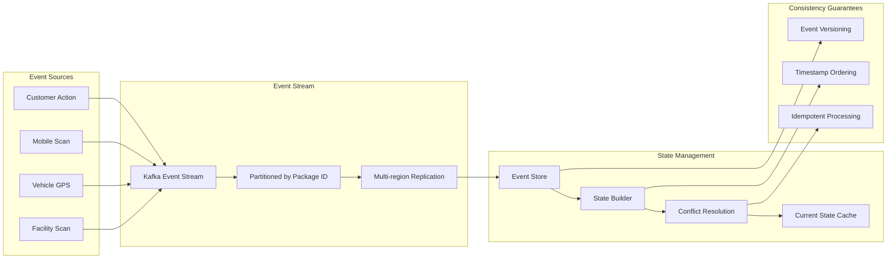
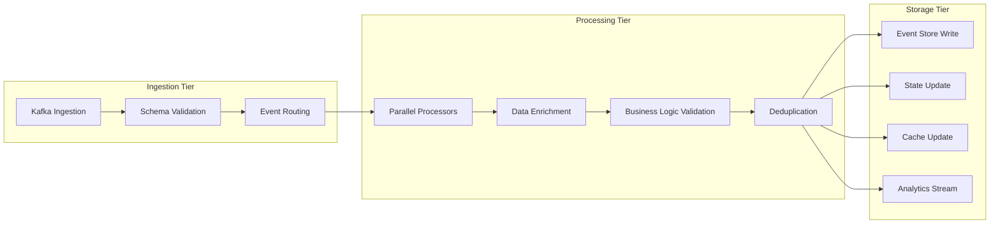

# Real-time Package Tracking Systems

## System Overview

Global logistics companies like FedEx, UPS, and Amazon need to track millions of packages in real-time across their networks, providing customers with accurate delivery estimates and enabling operational optimization. These systems process billions of tracking events daily while maintaining 99.9% accuracy and sub-second query response times.

### Scale & Complexity
- **Daily Package Volume**: 20M+ packages tracked simultaneously
- **Tracking Events**: 500M+ status updates daily
- **Global Network**: 500+ distribution centers, 100,000+ delivery vehicles
- **Customer Queries**: 100M+ tracking requests daily
- **Delivery Accuracy**: 99.5%+ on-time delivery rate

## Architecture Overview

```mermaid
graph TB
    subgraph "Package Sources"
        SORT[Sorting Facilities]
        HUB[Distribution Hubs]
        TRUCK[Delivery Vehicles]
        SCAN[Mobile Scanners]
        CUSTOMER[Customer Drop-off]
    end

    subgraph "Data Collection Layer"
        IOT[IoT Sensors]
        BARCODE[Barcode Scanners]
        GPS[GPS Tracking]
        RFID[RFID Readers]
        MOBILE[Mobile Apps]
    end

    subgraph "Event Processing"
        KAFKA[Event Stream (Kafka)]
        VALIDATOR[Event Validator]
        ENRICHER[Data Enricher]
        PROCESSOR[Event Processor]
        DEDUPLICATOR[Duplicate Handler]
    end

    subgraph "Core Services"
        TRACKING[Tracking Service]
        PREDICTION[Delivery Prediction]
        ROUTE[Route Optimization]
        EXCEPTION[Exception Handler]
        NOTIFICATION[Notification Service]
    end

    subgraph "Data Storage"
        EVENTS[(Event Store)]
        PACKAGE_DB[(Package Database)]
        ROUTE_DB[(Route Database)]
        CACHE[Redis Cache]
        ANALYTICS[(Analytics Warehouse)]
    end

    subgraph "Customer Interfaces"
        API[Tracking API]
        WEB[Web Portal]
        MOBILE_APP[Mobile Apps]
        SMS[SMS Service]
        EMAIL[Email Service]
    end

    SORT --> BARCODE
    HUB --> IOT
    TRUCK --> GPS
    SCAN --> MOBILE
    CUSTOMER --> RFID
    
    BARCODE --> KAFKA
    IOT --> KAFKA
    GPS --> KAFKA
    RFID --> KAFKA
    MOBILE --> KAFKA
    
    KAFKA --> VALIDATOR
    VALIDATOR --> ENRICHER
    ENRICHER --> PROCESSOR
    PROCESSOR --> DEDUPLICATOR
    
    DEDUPLICATOR --> TRACKING
    TRACKING --> PREDICTION
    PREDICTION --> ROUTE
    ROUTE --> EXCEPTION
    EXCEPTION --> NOTIFICATION
    
    TRACKING --> EVENTS
    TRACKING --> PACKAGE_DB
    ROUTE --> ROUTE_DB
    TRACKING --> CACHE
    PROCESSOR --> ANALYTICS
    
    API --> CACHE
    WEB --> API
    MOBILE_APP --> API
    NOTIFICATION --> SMS
    NOTIFICATION --> EMAIL
```

## Key Architectural Challenges

### 1. Real-time Event Processing at Scale

**Challenge**: Processing 500M+ tracking events daily with sub-second latency requirements.

**Solution Architecture**:
- Event-driven architecture with Apache Kafka
- Stream processing with Apache Flink for real-time analytics
- Distributed event validation and enrichment
- Automatic scaling based on event volume

**Implementation**:
```python
class PackageTrackingEventProcessor:
    def __init__(self):
        self.kafka_consumer = KafkaConsumer(
            'package-events',
            bootstrap_servers=['kafka-cluster'],
            value_deserializer=lambda m: json.loads(m.decode('utf-8'))
        )
        self.event_validator = EventValidator()
        self.data_enricher = DataEnricher()
        self.tracking_service = TrackingService()
        self.notification_service = NotificationService()
    
    async def process_tracking_events(self):
        """
        Main event processing loop
        """
        async for message in self.kafka_consumer:
            try:
                event = message.value
                
                # Validate event format and required fields
                if not self.event_validator.validate(event):
                    await self.handle_invalid_event(event)
                    continue
                
                # Enrich event with additional data
                enriched_event = await self.data_enricher.enrich(event)
                
                # Process based on event type
                await self.route_event_processing(enriched_event)
                
                # Update package status
                await self.update_package_status(enriched_event)
                
                # Trigger notifications if necessary
                await self.check_notification_triggers(enriched_event)
                
            except Exception as e:
                await self.handle_processing_error(e, message)
    
    async def route_event_processing(self, event):
        """
        Route events to appropriate processors based on type
        """
        event_type = event['event_type']
        
        if event_type == 'PACKAGE_SCANNED':
            await self.process_scan_event(event)
        elif event_type == 'VEHICLE_DEPARTED':
            await self.process_departure_event(event)
        elif event_type == 'DELIVERY_ATTEMPTED':
            await self.process_delivery_attempt(event)
        elif event_type == 'EXCEPTION_OCCURRED':
            await self.process_exception_event(event)
        else:
            await self.process_generic_event(event)
    
    async def process_scan_event(self, event):
        """
        Process package scan events (pickup, sorting, loading, etc.)
        """
        package_id = event['package_id']
        location = event['location']
        timestamp = event['timestamp']
        scan_type = event['scan_type']
        
        # Update package location
        await self.tracking_service.update_package_location(
            package_id, location, timestamp
        )
        
        # Update delivery prediction
        await self.update_delivery_prediction(package_id, location, scan_type)
        
        # Check for milestone achievements
        if scan_type in ['OUT_FOR_DELIVERY', 'DELIVERED']:
            await self.notification_service.send_milestone_notification(
                package_id, scan_type, timestamp
            )
        
        # Analytics tracking
        await self.track_analytics_event(event)
```

### 2. Global Package State Management

**Challenge**: Maintaining consistent package state across distributed systems and time zones.

**Solution**: Event sourcing with distributed state management and conflict resolution.



**State Management Implementation**:
```go
type PackageStateManager struct {
    eventStore    EventStore
    stateCache    *redis.Client
    conflictResolver *ConflictResolver
    eventPublisher   EventPublisher
}

type PackageEvent struct {
    EventID       string    `json:"event_id"`
    PackageID     string    `json:"package_id"`
    EventType     string    `json:"event_type"`
    Timestamp     time.Time `json:"timestamp"`
    Location      Location  `json:"location"`
    ScanDetails   ScanInfo  `json:"scan_details,omitempty"`
    GPSData       GPSInfo   `json:"gps_data,omitempty"`
    EventSource   string    `json:"event_source"`
    Version       int       `json:"version"`
}

func (psm *PackageStateManager) ProcessEvent(event *PackageEvent) error {
    // Validate event
    if err := psm.validateEvent(event); err != nil {
        return fmt.Errorf("invalid event: %w", err)
    }
    
    // Check for duplicates
    if exists, _ := psm.eventStore.EventExists(event.EventID); exists {
        return nil // Idempotent - ignore duplicate
    }
    
    // Get current package state
    currentState, err := psm.getCurrentState(event.PackageID)
    if err != nil {
        return fmt.Errorf("failed to get current state: %w", err)
    }
    
    // Detect conflicts
    conflicts := psm.conflictResolver.DetectConflicts(currentState, event)
    
    if len(conflicts) > 0 {
        // Resolve conflicts
        resolvedState, err := psm.conflictResolver.ResolveConflicts(
            currentState, event, conflicts
        )
        if err != nil {
            return fmt.Errorf("conflict resolution failed: %w", err)
        }
        currentState = resolvedState
    }
    
    // Apply event to state
    newState := psm.applyEventToState(currentState, event)
    
    // Persist event and state
    if err := psm.eventStore.StoreEvent(event); err != nil {
        return fmt.Errorf("failed to store event: %w", err)
    }
    
    if err := psm.stateCache.SetPackageState(event.PackageID, newState); err != nil {
        return fmt.Errorf("failed to cache state: %w", err)
    }
    
    // Publish state change
    stateChangeEvent := &PackageStateChangeEvent{
        PackageID:    event.PackageID,
        PreviousState: currentState,
        NewState:     newState,
        TriggerEvent: event,
        Timestamp:    time.Now(),
    }
    
    return psm.eventPublisher.PublishStateChange(stateChangeEvent)
}

func (psm *PackageStateManager) GetPackageStatus(packageID string) (*PackageStatus, error) {
    // Try cache first
    if state, err := psm.stateCache.GetPackageState(packageID); err == nil {
        return psm.stateToStatus(state), nil
    }
    
    // Rebuild from events
    events, err := psm.eventStore.GetEventsForPackage(packageID)
    if err != nil {
        return nil, err
    }
    
    state := psm.rebuildStateFromEvents(events)
    
    // Cache the rebuilt state
    psm.stateCache.SetPackageState(packageID, state)
    
    return psm.stateToStatus(state), nil
}
```

### 3. Predictive Delivery Analytics

**Challenge**: Accurately predicting delivery times considering traffic, weather, and operational constraints.

**Implementation**:
```yaml
Prediction Algorithm Components:
  Historical Performance:
    - Route-specific delivery times
    - Driver/vehicle performance patterns
    - Seasonal and day-of-week variations
    - Holiday and special event impacts
    
  Real-time Factors:
    - Current traffic conditions
    - Weather conditions and forecasts
    - Vehicle capacity and current load
    - Dynamic route optimization results
    
  Machine Learning Models:
    - Gradient boosting for delivery time prediction
    - Neural networks for traffic pattern analysis
    - Time series forecasting for demand patterns
    - Reinforcement learning for route optimization
```

## Data Architecture

### 1. Event Store Schema

```sql
-- Package tracking events table
CREATE TABLE package_events (
    event_id UUID PRIMARY KEY,
    package_id VARCHAR(50) NOT NULL,
    event_type VARCHAR(50) NOT NULL,
    event_timestamp TIMESTAMP WITH TIME ZONE NOT NULL,
    location_id VARCHAR(20),
    latitude DECIMAL(10,8),
    longitude DECIMAL(11,8),
    facility_code VARCHAR(10),
    vehicle_id VARCHAR(20),
    employee_id VARCHAR(20),
    scan_type VARCHAR(30),
    event_data JSONB,
    created_at TIMESTAMP WITH TIME ZONE DEFAULT NOW(),
    
    INDEX idx_package_timestamp (package_id, event_timestamp),
    INDEX idx_event_type_timestamp (event_type, event_timestamp),
    INDEX idx_location_timestamp (location_id, event_timestamp)
);

-- Package current state table (materialized view)
CREATE TABLE package_current_state (
    package_id VARCHAR(50) PRIMARY KEY,
    current_status VARCHAR(30) NOT NULL,
    current_location_id VARCHAR(20),
    current_facility VARCHAR(10),
    last_scan_time TIMESTAMP WITH TIME ZONE,
    estimated_delivery TIMESTAMP WITH TIME ZONE,
    delivery_address JSONB,
    service_type VARCHAR(20),
    weight_kg DECIMAL(8,3),
    dimensions JSONB,
    created_at TIMESTAMP WITH TIME ZONE,
    updated_at TIMESTAMP WITH TIME ZONE DEFAULT NOW(),
    
    INDEX idx_status_service (current_status, service_type),
    INDEX idx_estimated_delivery (estimated_delivery),
    INDEX idx_facility_status (current_facility, current_status)
);

-- Delivery routes and schedules
CREATE TABLE delivery_routes (
    route_id VARCHAR(30) PRIMARY KEY,
    vehicle_id VARCHAR(20) NOT NULL,
    driver_id VARCHAR(20) NOT NULL,
    route_date DATE NOT NULL,
    planned_stops JSONB NOT NULL,
    estimated_duration_minutes INTEGER,
    actual_duration_minutes INTEGER,
    packages_delivered INTEGER DEFAULT 0,
    route_status VARCHAR(20) DEFAULT 'PLANNED',
    created_at TIMESTAMP WITH TIME ZONE DEFAULT NOW(),
    
    INDEX idx_vehicle_date (vehicle_id, route_date),
    INDEX idx_driver_date (driver_id, route_date),
    INDEX idx_route_status (route_status, route_date)
);
```

### 2. Real-time State Caching

```python
class PackageStateCache:
    def __init__(self):
        self.redis_cluster = redis.RedisCluster(
            startup_nodes=[
                {"host": "redis-node-1", "port": 7000},
                {"host": "redis-node-2", "port": 7000},
                {"host": "redis-node-3", "port": 7000},
            ]
        )
        self.cache_ttl = 3600  # 1 hour
        
    async def get_package_state(self, package_id):
        """
        Retrieve current package state from cache
        """
        cache_key = f"package:state:{package_id}"
        
        cached_data = await self.redis_cluster.get(cache_key)
        if cached_data:
            return json.loads(cached_data)
        
        return None
    
    async def set_package_state(self, package_id, state):
        """
        Cache package state with expiration
        """
        cache_key = f"package:state:{package_id}"
        state_json = json.dumps(state, default=str)
        
        await self.redis_cluster.setex(cache_key, self.cache_ttl, state_json)
        
        # Also maintain location-based indices for queries
        if 'current_location' in state:
            location_key = f"location:packages:{state['current_location']}"
            await self.redis_cluster.sadd(location_key, package_id)
            await self.redis_cluster.expire(location_key, self.cache_ttl)
    
    async def get_packages_at_location(self, location_id):
        """
        Get all packages at a specific location
        """
        location_key = f"location:packages:{location_id}"
        package_ids = await self.redis_cluster.smembers(location_key)
        
        packages = []
        for package_id in package_ids:
            state = await self.get_package_state(package_id.decode())
            if state:
                packages.append(state)
        
        return packages
```

## Performance Optimization

### 1. Event Processing Pipeline



**Performance Metrics**:
```yaml
Processing Performance:
  Throughput:
    - Event ingestion: 500,000 events/second
    - Event processing: 300,000 events/second
    - State updates: 200,000 updates/second
    - Cache operations: 1M operations/second
    
  Latency:
    - Event validation: <10ms p95
    - State update: <50ms p95
    - Cache lookup: <1ms p95
    - End-to-end tracking: <100ms p95
    
  Reliability:
    - Event processing success rate: 99.99%
    - State consistency: 99.95%
    - Cache hit rate: 95%+
    - Zero data loss guarantee
```

### 2. Global Distribution Strategy

```python
class GlobalTrackingDistribution:
    def __init__(self):
        self.regions = {
            'us-east': TrackingRegion('us-east-1', primary=True),
            'us-west': TrackingRegion('us-west-1'),
            'eu-west': TrackingRegion('eu-west-1'),
            'ap-southeast': TrackingRegion('ap-southeast-1'),
            'ap-northeast': TrackingRegion('ap-northeast-1')
        }
        self.data_router = DataRouter()
    
    def route_package_events(self, event):
        """
        Route tracking events to appropriate regional processing
        """
        package_id = event['package_id']
        origin_region = self.determine_origin_region(event['location'])
        
        # Primary processing in origin region
        primary_region = self.regions[origin_region]
        primary_region.process_event(event)
        
        # Replicate to relevant regions based on delivery destination
        destination_region = self.determine_destination_region(package_id)
        if destination_region != origin_region:
            self.regions[destination_region].replicate_event(event)
        
        # Global backup to primary US region
        if origin_region != 'us-east':
            self.regions['us-east'].backup_event(event)
    
    def get_package_status(self, package_id, requesting_region):
        """
        Get package status with region optimization
        """
        # Try local region first
        local_region = self.regions[requesting_region]
        status = local_region.get_local_status(package_id)
        
        if status and not status.is_stale():
            return status
        
        # Fall back to origin region
        origin_region = self.determine_package_origin_region(package_id)
        if origin_region != requesting_region:
            status = self.regions[origin_region].get_status(package_id)
        
        # Cache locally for future requests
        local_region.cache_status(package_id, status)
        
        return status
```

## Real-World Examples

### FedEx Package Tracking

**Scale**: 15M+ packages/day, 220+ countries

**Architecture Highlights**:
- COSMOS (global tracking system) with event sourcing
- Real-time GPS tracking on 180,000+ vehicles
- Advanced scanning technology with 99.7% accuracy
- Predictive analytics for delivery time estimation

**Innovation Features**:
```yaml
Technology Stack:
  - Event processing: Custom high-throughput messaging
  - GPS integration: Real-time vehicle tracking
  - Mobile scanning: Handheld and vehicle-mounted scanners
  - Customer interfaces: Web, mobile, API, EDI

Performance Characteristics:
  - Package scanning rate: 500+ scans/second peak
  - Tracking query response: <200ms average
  - Global synchronization: <5 minutes worldwide
  - Delivery prediction accuracy: 95%+
```

### UPS Package Tracking (DIAD & ORION)

**Scale**: 20M+ packages/day, integrated route optimization

**Technical Innovations**:
- DIAD (Delivery Information Acquisition Device) integration
- ORION route optimization with tracking integration
- Telematics data fusion for comprehensive visibility
- Machine learning for delivery prediction

**Architecture Features**:
```yaml
Integrated Systems:
  - ORION: AI-powered route optimization
  - DIAD: Real-time delivery data capture
  - Telematics: Vehicle performance and location
  - Customer systems: My Choice delivery preferences

Advanced Analytics:
  - Route optimization: 100M+ calculations/day
  - Delivery prediction: Weather and traffic integration
  - Customer preferences: Proactive delivery management
  - Exception handling: Automated resolution workflows
```

### Amazon Package Tracking

**Scale**: 5B+ packages/year, integrated fulfillment

**Unique Approach**:
- End-to-end integration from order to delivery
- Predictive shipping before orders are placed
- Last-mile innovation with delivery partners
- Customer-controlled delivery experience

**Technology Implementation**:
```yaml
Fulfillment Integration:
  - Predictive analytics: Pre-positioning inventory
  - Dynamic routing: Real-time delivery optimization
  - Last-mile innovation: Amazon Flex, lockers, drones
  - Customer control: Delivery instructions, timing

Scale Characteristics:
  - Peak processing: 1M+ packages/hour
  - Delivery network: 500+ fulfillment centers
  - Last-mile fleet: 100,000+ delivery vehicles
  - Customer notifications: Real-time across all channels
```

## Advanced Features

### 1. Predictive Exception Handling

```python
class PredictiveExceptionManager:
    def __init__(self):
        self.weather_service = WeatherService()
        self.traffic_service = TrafficService()
        self.ml_predictor = ExceptionPredictor()
        self.notification_service = NotificationService()
    
    async def predict_delivery_exceptions(self, route_id):
        """
        Predict potential delivery exceptions before they occur
        """
        route = await self.get_route_details(route_id)
        predictions = []
        
        for stop in route.planned_stops:
            # Weather-related predictions
            weather_risk = await self.assess_weather_risk(
                stop.location, stop.planned_time
            )
            
            # Traffic-related predictions
            traffic_risk = await self.assess_traffic_risk(
                stop.location, stop.planned_time
            )
            
            # Historical pattern analysis
            historical_risk = await self.ml_predictor.predict_exception_risk(
                stop.location, stop.planned_time, route.service_type
            )
            
            # Combine risk factors
            total_risk = self.calculate_combined_risk(
                weather_risk, traffic_risk, historical_risk
            )
            
            if total_risk > 0.7:  # High risk threshold
                exception_prediction = {
                    'stop_id': stop.id,
                    'risk_level': total_risk,
                    'predicted_exception_types': self.predict_exception_types(
                        weather_risk, traffic_risk, historical_risk
                    ),
                    'recommended_actions': self.recommend_actions(total_risk),
                    'confidence': self.calculate_confidence(total_risk)
                }
                predictions.append(exception_prediction)
        
        return predictions
    
    async def proactive_exception_handling(self, predictions):
        """
        Take proactive actions based on exception predictions
        """
        for prediction in predictions:
            if prediction['risk_level'] > 0.8:  # Very high risk
                # Automatically reschedule delivery
                await self.reschedule_delivery(
                    prediction['stop_id'], 
                    prediction['recommended_actions']
                )
                
                # Notify customer proactively
                await self.notification_service.send_proactive_notification(
                    prediction['stop_id'],
                    f"Your delivery has been rescheduled due to predicted {prediction['predicted_exception_types'][0]}"
                )
```

### 2. IoT Integration for Enhanced Tracking

```python
class IoTTrackingIntegration:
    def __init__(self):
        self.sensor_manager = SensorManager()
        self.data_processor = IoTDataProcessor()
        self.alert_system = AlertSystem()
    
    async def process_sensor_data(self, sensor_data):
        """
        Process IoT sensor data for enhanced package tracking
        """
        if sensor_data['sensor_type'] == 'GPS':
            await self.process_gps_data(sensor_data)
        elif sensor_data['sensor_type'] == 'TEMPERATURE':
            await self.process_temperature_data(sensor_data)
        elif sensor_data['sensor_type'] == 'SHOCK':
            await self.process_shock_data(sensor_data)
        elif sensor_data['sensor_type'] == 'DOOR_SENSOR':
            await self.process_door_sensor_data(sensor_data)
    
    async def process_temperature_data(self, sensor_data):
        """
        Handle temperature-sensitive package monitoring
        """
        package_id = sensor_data['package_id']
        temperature = sensor_data['temperature']
        timestamp = sensor_data['timestamp']
        
        # Get package temperature requirements
        package_info = await self.get_package_info(package_id)
        temp_requirements = package_info.get('temperature_requirements')
        
        if temp_requirements:
            if temperature < temp_requirements['min'] or temperature > temp_requirements['max']:
                # Temperature violation detected
                alert = {
                    'package_id': package_id,
                    'alert_type': 'TEMPERATURE_VIOLATION',
                    'current_temperature': temperature,
                    'required_range': temp_requirements,
                    'timestamp': timestamp,
                    'severity': 'HIGH'
                }
                
                await self.alert_system.send_alert(alert)
                
                # Update package status
                await self.update_package_exception_status(
                    package_id, 'TEMPERATURE_EXCEPTION', alert
                )
    
    async def process_shock_data(self, sensor_data):
        """
        Handle fragile package shock monitoring
        """
        package_id = sensor_data['package_id']
        shock_level = sensor_data['shock_g']
        
        package_info = await self.get_package_info(package_id)
        if package_info.get('fragile', False):
            fragile_threshold = package_info.get('shock_threshold', 2.0)  # 2G default
            
            if shock_level > fragile_threshold:
                # Excessive shock detected
                alert = {
                    'package_id': package_id,
                    'alert_type': 'EXCESSIVE_SHOCK',
                    'shock_level': shock_level,
                    'threshold': fragile_threshold,
                    'timestamp': sensor_data['timestamp']
                }
                
                await self.alert_system.send_alert(alert)
                
                # Flag for inspection at next scan point
                await self.flag_for_inspection(package_id, 'SHOCK_DAMAGE_CHECK')
```

## Lessons Learned

### 1. Event Ordering and Consistency

**Challenge**: Events arriving out of order due to network delays and distributed processing.

**Solution**:
- Event timestamp-based ordering with clock synchronization
- Vector clocks for distributed event ordering
- Conflict resolution algorithms for concurrent updates
- Event replay capabilities for consistency recovery

### 2. Global Scale Data Synchronization

**Challenge**: Keeping tracking data consistent across global regions with varying network conditions.

**Solution**:
- Regional event processing with asynchronous replication
- Conflict-free replicated data types (CRDTs) for eventual consistency
- Master-slave replication with regional failover
- Intelligent data partitioning by geographic regions

### 3. Customer Experience During Exceptions

**Challenge**: Managing customer expectations when deliveries don't go as planned.

**Solution**:
- Proactive exception prediction and communication
- Real-time delivery window updates
- Alternative delivery options and scheduling
- Transparent communication about delays and reasons

## Future Considerations

### 1. Autonomous Delivery Integration

```yaml
Next-Generation Tracking:
  Drone Delivery:
    - Real-time flight path tracking
    - Weather-adaptive routing
    - Autonomous exception handling
    - Customer interaction protocols
  
  Autonomous Vehicles:
    - Self-driving delivery trucks
    - Dynamic route optimization
    - Unattended delivery protocols
    - Remote vehicle monitoring
  
  Smart Infrastructure:
    - IoT-enabled delivery lockers
    - Blockchain-based delivery proof
    - AI-powered delivery optimization
    - Predictive maintenance systems
```

### 2. Advanced Customer Experience

- **Augmented Reality**: AR-based package tracking and delivery visualization
- **Voice Integration**: Voice-controlled tracking queries and delivery scheduling
- **Predictive Delivery**: AI-powered delivery time prediction with weather and traffic
- **Sustainable Delivery**: Carbon footprint tracking and eco-friendly delivery options

### 3. Blockchain Integration

- **Delivery Verification**: Immutable proof of delivery records
- **Supply Chain Transparency**: End-to-end package provenance tracking
- **Smart Contracts**: Automated delivery milestone payments
- **Decentralized Tracking**: Peer-to-peer package tracking networks

## Technology Stack

**Event Processing**:
- Apache Kafka for event streaming
- Apache Flink for stream processing
- Redis Cluster for real-time caching
- PostgreSQL for persistent storage

**IoT & Sensors**:
- AWS IoT Core for device connectivity
- MQTT for lightweight sensor communication
- InfluxDB for time-series sensor data
- Grafana for IoT data visualization

**Machine Learning**:
- TensorFlow for delivery prediction models
- Apache Spark for batch analytics
- MLflow for model lifecycle management
- Feature stores for real-time ML features

**Global Infrastructure**:
- Multi-region cloud deployment
- CDN for global content delivery
- Edge computing for local processing
- Disaster recovery and backup systems

This comprehensive package tracking architecture demonstrates how modern logistics companies provide real-time visibility into their global networks while maintaining the accuracy, reliability, and customer experience that modern e-commerce requires.