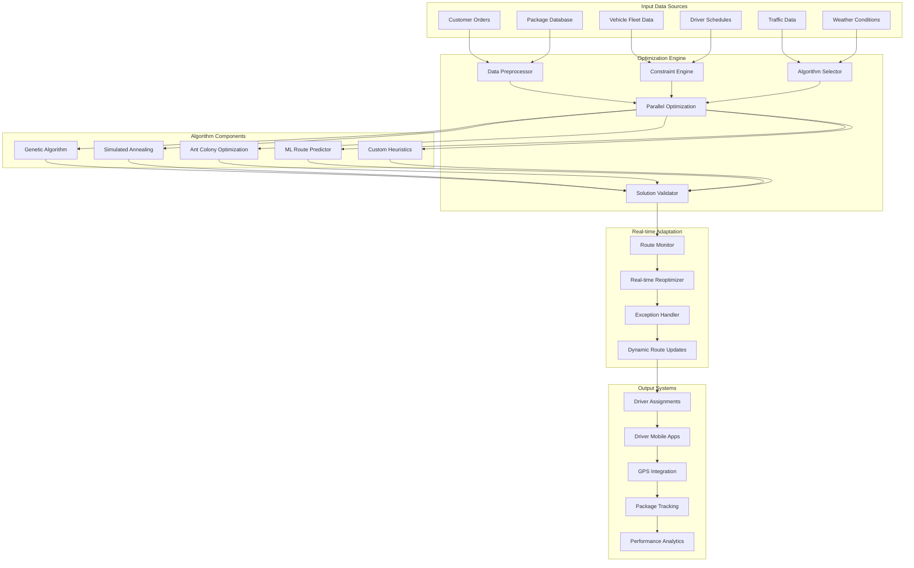
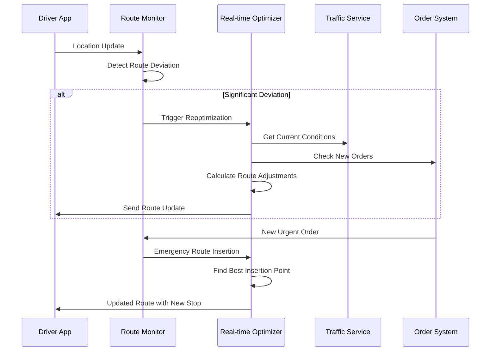

# Route Optimization Algorithms

## System Overview

Logistics companies use sophisticated algorithms to optimize delivery routes, reducing fuel costs, improving delivery times, and maximizing vehicle utilization. Systems like UPS ORION, Amazon's Last Mile optimization, and DHL's route planning process billions of calculations daily to optimize routes for hundreds of thousands of vehicles globally.

### Scale & Complexity
- **Daily Route Calculations**: 100K+ optimized routes globally
- **Optimization Variables**: 10M+ constraints per optimization run
- **Real-time Adjustments**: 1M+ route modifications daily
- **Fuel Savings**: 10-15% reduction through optimization
- **Computation Scale**: 100B+ route combinations evaluated daily

## Architecture Overview



## Key Architectural Challenges

### 1. Vehicle Routing Problem (VRP) at Scale

**Challenge**: Solving complex VRP variants with thousands of stops and hundreds of vehicles in real-time.

**Solution Architecture**:
- Hybrid optimization combining multiple algorithms
- Parallel processing with distributed computing
- Machine learning for solution space pruning
- Hierarchical decomposition for large problems

**Implementation**:
```python
class VehicleRoutingOptimizer:
    def __init__(self):
        self.genetic_algorithm = GeneticAlgorithm()
        self.simulated_annealing = SimulatedAnnealing()
        self.ant_colony = AntColonyOptimization()
        self.ml_predictor = MLRoutePredictorModel()
        self.constraint_checker = ConstraintChecker()
        self.parallel_executor = ParallelExecutor()
    
    async def optimize_routes(self, optimization_request):
        """
        Main route optimization pipeline
        """
        # Preprocess and validate input data
        processed_data = await self.preprocess_optimization_data(optimization_request)
        
        # Problem decomposition for large instances
        subproblems = self.decompose_problem(processed_data)
        
        # Parallel optimization of subproblems
        optimization_tasks = []
        for subproblem in subproblems:
            task = self.optimize_subproblem(subproblem)
            optimization_tasks.append(task)
        
        subproblem_solutions = await asyncio.gather(*optimization_tasks)
        
        # Merge and optimize connections between subproblems
        merged_solution = self.merge_subproblem_solutions(subproblem_solutions)
        
        # Final optimization pass
        final_solution = await self.final_optimization_pass(merged_solution)
        
        # Validate solution feasibility
        validation_result = await self.validate_solution(final_solution, processed_data)
        
        if not validation_result.is_valid:
            # Fallback to repair or reoptimization
            final_solution = await self.repair_solution(final_solution, validation_result)
        
        return final_solution
    
    async def optimize_subproblem(self, subproblem):
        """
        Optimize individual subproblems using multiple algorithms
        """
        # Run multiple optimization algorithms in parallel
        optimization_results = await asyncio.gather(
            self.genetic_algorithm.optimize(subproblem),
            self.simulated_annealing.optimize(subproblem),
            self.ant_colony.optimize(subproblem),
            self.ml_predictor.predict_optimal_routes(subproblem)
        )
        
        # Select best solution based on multiple criteria
        best_solution = self.select_best_solution(optimization_results, subproblem)
        
        # Local search improvement
        improved_solution = await self.local_search_improvement(best_solution, subproblem)
        
        return improved_solution
    
    def decompose_problem(self, problem_data):
        """
        Decompose large routing problems into manageable subproblems
        """
        if len(problem_data.stops) <= 500:  # Small problem
            return [problem_data]
        
        # Geographic clustering of stops
        geographic_clusters = self.cluster_stops_geographically(
            problem_data.stops, max_cluster_size=300
        )
        
        subproblems = []
        for cluster in geographic_clusters:
            # Assign vehicles to each cluster
            cluster_vehicles = self.assign_vehicles_to_cluster(
                cluster, problem_data.vehicles
            )
            
            subproblem = OptimizationSubproblem(
                stops=cluster.stops,
                vehicles=cluster_vehicles,
                constraints=problem_data.constraints.filter_for_cluster(cluster)
            )
            subproblems.append(subproblem)
        
        return subproblems
```

### 2. Real-time Route Adaptation

**Challenge**: Dynamically updating routes based on traffic, new orders, and delivery exceptions.

**Solution**: Event-driven real-time optimization with incremental updates.



**Real-time Optimization Implementation**:
```go
type RealTimeOptimizer struct {
    routeMonitor     *RouteMonitor
    trafficService   *TrafficService
    orderService     *OrderService
    optimizationEngine *OptimizationEngine
    updateChannel    chan RouteUpdate
}

type RouteUpdate struct {
    RouteID       string
    UpdateType    string
    UpdateData    interface{}
    Priority      int
    Timestamp     time.Time
}

func (rto *RealTimeOptimizer) StartRealTimeOptimization() {
    // Start monitoring goroutines
    go rto.monitorTrafficChanges()
    go rto.monitorNewOrders()
    go rto.monitorDriverProgress()
    go rto.processRouteUpdates()
}

func (rto *RealTimeOptimizer) processRouteUpdates() {
    for update := range rto.updateChannel {
        switch update.UpdateType {
        case "TRAFFIC_CHANGE":
            rto.handleTrafficUpdate(update)
        case "NEW_ORDER":
            rto.handleNewOrderInsertion(update)
        case "DRIVER_DELAYED":
            rto.handleDriverDelay(update)
        case "DELIVERY_EXCEPTION":
            rto.handleDeliveryException(update)
        }
    }
}

func (rto *RealTimeOptimizer) handleNewOrderInsertion(update RouteUpdate) {
    newOrder := update.UpdateData.(Order)
    
    // Find candidate routes within delivery area
    candidateRoutes := rto.findCandidateRoutes(newOrder.DeliveryAddress)
    
    bestInsertion := &RouteInsertion{}
    minCostIncrease := math.MaxFloat64
    
    for _, routeID := range candidateRoutes {
        currentRoute := rto.getCurrentRoute(routeID)
        
        // Try inserting at different positions
        for position := 1; position < len(currentRoute.Stops); position++ {
            insertion := RouteInsertion{
                RouteID:   routeID,
                Order:     newOrder,
                Position:  position,
            }
            
            // Calculate cost increase
            costIncrease := rto.calculateInsertionCost(insertion, currentRoute)
            
            // Check feasibility constraints
            if rto.isInsertionFeasible(insertion, currentRoute) && 
               costIncrease < minCostIncrease {
                bestInsertion = &insertion
                minCostIncrease = costIncrease
            }
        }
    }
    
    if bestInsertion.RouteID != "" {
        // Apply the best insertion
        rto.applyRouteInsertion(*bestInsertion)
        
        // Notify driver of route change
        rto.notifyDriverOfRouteChange(bestInsertion.RouteID)
    } else {
        // No feasible insertion found, trigger full reoptimization
        rto.triggerEmergencyReoptimization(newOrder)
    }
}

func (rto *RealTimeOptimizer) calculateInsertionCost(insertion RouteInsertion, currentRoute *Route) float64 {
    // Calculate additional travel distance
    insertPos := insertion.Position
    prevStop := currentRoute.Stops[insertPos-1]
    nextStop := currentRoute.Stops[insertPos]
    newStop := insertion.Order.DeliveryAddress
    
    // Original distance between prev and next
    originalDistance := rto.getDistance(prevStop.Location, nextStop.Location)
    
    // New distances: prev -> new -> next
    newDistance := rto.getDistance(prevStop.Location, newStop) + 
                  rto.getDistance(newStop, nextStop.Location)
    
    distanceIncrease := newDistance - originalDistance
    
    // Calculate time impact
    timeIncrease := rto.calculateTimeIncrease(insertion, currentRoute)
    
    // Combined cost (distance + time penalty)
    return distanceIncrease*0.6 + timeIncrease*0.4
}
```

### 3. Multi-Objective Optimization

**Challenge**: Balancing conflicting objectives like cost, delivery time, fuel efficiency, and driver satisfaction.

**Implementation**:
```yaml
Optimization Objectives:
  Primary Objectives:
    - Minimize total travel distance: 40% weight
    - Minimize total travel time: 30% weight  
    - Maximize on-time delivery rate: 20% weight
    - Minimize overtime costs: 10% weight
    
  Secondary Objectives:
    - Balance driver workloads
    - Minimize fuel consumption
    - Reduce vehicle wear and tear
    - Optimize customer satisfaction scores
    
  Constraint Categories:
    - Vehicle capacity constraints
    - Driver working time regulations
    - Customer time window requirements
    - Vehicle type compatibility with packages
    - Geographic delivery restrictions
```

## Advanced Algorithm Implementations

### 1. Hybrid Genetic Algorithm

```python
class HybridGeneticAlgorithm:
    def __init__(self, problem_size):
        self.population_size = min(100, max(20, problem_size // 10))
        self.mutation_rate = 0.1
        self.crossover_rate = 0.8
        self.local_search_probability = 0.3
        self.generations = 1000
    
    def optimize(self, vrp_problem):
        """
        Hybrid genetic algorithm with local search
        """
        # Initialize population with diverse solutions
        population = self.initialize_population(vrp_problem)
        
        # Evaluate initial fitness
        for individual in population:
            individual.fitness = self.evaluate_fitness(individual, vrp_problem)
        
        best_solution = max(population, key=lambda x: x.fitness)
        
        for generation in range(self.generations):
            new_population = []
            
            # Elitism - keep best individuals
            elite_size = max(1, self.population_size // 10)
            elite = sorted(population, key=lambda x: x.fitness, reverse=True)[:elite_size]
            new_population.extend(elite)
            
            # Generate offspring
            while len(new_population) < self.population_size:
                # Tournament selection
                parent1 = self.tournament_selection(population)
                parent2 = self.tournament_selection(population)
                
                # Crossover
                if random.random() < self.crossover_rate:
                    child1, child2 = self.order_crossover(parent1, parent2)
                else:
                    child1, child2 = parent1.copy(), parent2.copy()
                
                # Mutation
                if random.random() < self.mutation_rate:
                    child1 = self.mutate(child1, vrp_problem)
                if random.random() < self.mutation_rate:
                    child2 = self.mutate(child2, vrp_problem)
                
                # Local search improvement
                if random.random() < self.local_search_probability:
                    child1 = self.local_search_2opt(child1, vrp_problem)
                if random.random() < self.local_search_probability:
                    child2 = self.local_search_2opt(child2, vrp_problem)
                
                new_population.extend([child1, child2])
            
            # Evaluate new population
            for individual in new_population:
                if not hasattr(individual, 'fitness'):
                    individual.fitness = self.evaluate_fitness(individual, vrp_problem)
            
            population = new_population[:self.population_size]
            
            # Update best solution
            current_best = max(population, key=lambda x: x.fitness)
            if current_best.fitness > best_solution.fitness:
                best_solution = current_best
            
            # Adaptive parameter adjustment
            self.adapt_parameters(generation, population)
        
        return best_solution
    
    def local_search_2opt(self, solution, problem):
        """
        2-opt local search for route improvement
        """
        improved = True
        while improved:
            improved = False
            
            for route_idx, route in enumerate(solution.routes):
                for i in range(len(route) - 1):
                    for j in range(i + 2, len(route)):
                        # Try 2-opt swap
                        new_route = route[:i+1] + route[i+1:j+1][::-1] + route[j+1:]
                        
                        if self.is_route_improvement(route, new_route, problem):
                            solution.routes[route_idx] = new_route
                            improved = True
                            break
                    if improved:
                        break
        
        return solution
```

### 2. Machine Learning Route Prediction

```python
class MLRoutePredictorModel:
    def __init__(self):
        self.route_quality_model = GradientBoostingRegressor()
        self.time_prediction_model = RandomForestRegressor()
        self.traffic_impact_model = NeuralNetwork()
        self.feature_engineer = RouteFeatureEngineer()
    
    def train_models(self, historical_routes):
        """
        Train ML models on historical route performance data
        """
        features = []
        quality_labels = []
        time_labels = []
        traffic_impact_labels = []
        
        for route_record in historical_routes:
            # Extract features
            route_features = self.feature_engineer.extract_features(route_record)
            features.append(route_features)
            
            # Quality label (efficiency score)
            quality_score = self.calculate_route_quality_score(route_record)
            quality_labels.append(quality_score)
            
            # Time prediction labels
            actual_time = route_record.actual_completion_time
            time_labels.append(actual_time)
            
            # Traffic impact
            traffic_delay = route_record.traffic_delay_minutes
            traffic_impact_labels.append(traffic_delay)
        
        # Train models
        self.route_quality_model.fit(features, quality_labels)
        self.time_prediction_model.fit(features, time_labels)
        self.traffic_impact_model.fit(features, traffic_impact_labels)
    
    def predict_optimal_routes(self, vrp_problem):
        """
        Use ML to predict optimal route characteristics
        """
        # Generate candidate route configurations
        candidates = self.generate_route_candidates(vrp_problem)
        
        best_routes = []
        for candidate in candidates:
            # Extract features for prediction
            features = self.feature_engineer.extract_features(candidate)
            
            # Predict route quality
            predicted_quality = self.route_quality_model.predict([features])[0]
            
            # Predict completion time
            predicted_time = self.time_prediction_model.predict([features])[0]
            
            # Predict traffic impact
            predicted_traffic_delay = self.traffic_impact_model.predict([features])[0]
            
            # Calculate overall score
            overall_score = (
                predicted_quality * 0.5 +
                (1.0 / (predicted_time + 1)) * 0.3 +
                (1.0 / (predicted_traffic_delay + 1)) * 0.2
            )
            
            candidate.ml_score = overall_score
            best_routes.append(candidate)
        
        # Return top candidates for further optimization
        return sorted(best_routes, key=lambda x: x.ml_score, reverse=True)[:10]
```

## Real-World Examples

### UPS ORION (On-Road Integrated Optimization and Navigation)

**Scale**: 55,000+ delivery routes optimized daily

**Technical Achievements**:
- Reduces delivery miles by 100M+ annually
- Saves 10M+ gallons of fuel per year
- Processes 200,000+ optimization calculations per route
- Integrates with DIAD delivery devices for real-time feedback

**Algorithm Implementation**:
```yaml
ORION Features:
  - Problem Size: Up to 120 stops per route
  - Constraints: 250+ business rules per optimization
  - Algorithms: Proprietary hybrid metaheuristics
  - Real-time Updates: Traffic and service time adjustments
  
Performance Metrics:
  - Miles Reduction: 6-8% average per route
  - Fuel Savings: $300-400M annually
  - Computation Time: <30 minutes per route
  - Driver Compliance: 85%+ route adherence
```

### Amazon Last Mile Optimization

**Scale**: 1M+ packages delivered daily through optimized routes

**Innovation Focus**:
- Dynamic routing with real-time order insertion
- Machine learning for delivery time prediction
- Customer preference integration
- Multi-modal delivery optimization (vans, bikes, drones)

**Technical Architecture**:
```yaml
Amazon Approach:
  - Predictive Routing: Routes generated before orders confirmed
  - Dynamic Insertion: Real-time order accommodation
  - Customer Preferences: Delivery time windows, location preferences
  - Multi-modal: Integration with Amazon Flex, lockers, drones
  
Advanced Features:
  - AI-powered delivery time prediction
  - Weather and traffic integration
  - Customer behavior modeling
  - Sustainable delivery route optimization
```

### DHL SmartTruck Initiative

**Scale**: Global optimization across 47,000+ vehicles

**Key Innovations**:
- IoT sensor integration for real-time optimization
- Predictive maintenance integration with routing
- Carbon footprint optimization
- Driver behavior optimization

**Implementation Highlights**:
```yaml
DHL SmartTruck:
  - Sensor Integration: 200+ data points per vehicle
  - Predictive Analytics: Maintenance-aware routing
  - Sustainability: CO2 optimization alongside cost
  - Driver Training: Route efficiency education
  
Results:
  - Fuel Efficiency: 15% improvement
  - On-time Delivery: 96% achievement rate
  - Carbon Reduction: 30% decrease in emissions
  - Driver Satisfaction: Improved work-life balance
```

## Performance Optimization

### 1. Computational Performance

```yaml
Optimization Performance:
  Problem Solving Speed:
    - Small routes (20-50 stops): <1 minute
    - Medium routes (50-100 stops): 1-5 minutes
    - Large routes (100-200 stops): 5-15 minutes
    - Enterprise scale (1000+ routes): 30-60 minutes
    
  Memory Optimization:
    - Problem decomposition for large instances
    - Streaming processing for constraint evaluation
    - Garbage collection optimization
    - Memory pooling for route objects
    
  Parallel Processing:
    - Multi-threaded algorithm execution
    - GPU acceleration for distance calculations
    - Distributed computing for large fleets
    - Cloud scaling for peak optimization periods
```

### 2. Algorithm Selection Strategy

```python
class AdaptiveAlgorithmSelector:
    def __init__(self):
        self.performance_history = {}
        self.problem_classifier = ProblemClassifier()
        self.algorithm_registry = AlgorithmRegistry()
    
    def select_optimal_algorithm(self, problem):
        """
        Select the best algorithm based on problem characteristics
        """
        # Classify the problem
        problem_class = self.problem_classifier.classify(problem)
        
        # Get historical performance for similar problems
        historical_performance = self.performance_history.get(problem_class, {})
        
        # Consider problem-specific factors
        selection_factors = {
            'problem_size': len(problem.stops),
            'constraint_complexity': problem.constraint_count,
            'time_window_density': problem.time_window_ratio,
            'geographic_spread': problem.geographic_diameter,
            'vehicle_heterogeneity': problem.vehicle_type_count
        }
        
        # Score algorithms based on expected performance
        algorithm_scores = {}
        for algorithm_name, algorithm in self.algorithm_registry.items():
            score = self.predict_algorithm_performance(
                algorithm, problem_class, selection_factors
            )
            algorithm_scores[algorithm_name] = score
        
        # Select top algorithms for parallel execution
        top_algorithms = sorted(
            algorithm_scores.items(), 
            key=lambda x: x[1], 
            reverse=True
        )[:3]
        
        return [alg_name for alg_name, score in top_algorithms]
    
    def update_performance_history(self, problem_class, algorithm_name, performance):
        """
        Update historical performance data
        """
        if problem_class not in self.performance_history:
            self.performance_history[problem_class] = {}
        
        if algorithm_name not in self.performance_history[problem_class]:
            self.performance_history[problem_class][algorithm_name] = []
        
        self.performance_history[problem_class][algorithm_name].append(performance)
        
        # Keep only recent performance data
        max_history = 100
        if len(self.performance_history[problem_class][algorithm_name]) > max_history:
            self.performance_history[problem_class][algorithm_name] = \
                self.performance_history[problem_class][algorithm_name][-max_history:]
```

## Lessons Learned

### 1. Balance Between Optimization and Practicality

**Challenge**: Mathematically optimal routes may not be practical for drivers.

**Solutions Applied**:
- Driver feedback integration into optimization criteria
- Route familiarity weights for driver efficiency
- Configurable optimization vs. practicality trade-offs
- Driver training and change management programs

### 2. Real-time Constraints vs. Solution Quality

**Challenge**: Real-time optimization requires fast solutions that may be suboptimal.

**Solutions Applied**:
- Hierarchical optimization with different time horizons
- Incremental optimization for minor changes
- Pre-computed route templates for common scenarios
- Quality vs. speed trade-off configuration

### 3. Integration with Legacy Systems

**Challenge**: Optimization engines must integrate with existing fleet management systems.

**Solutions Applied**:
- API-based integration with standardized data formats
- Gradual migration strategies from legacy systems
- Backward compatibility for existing workflows
- Change management and training programs

## Future Considerations

### 1. Autonomous Vehicle Integration

```yaml
Next-Generation Route Optimization:
  Autonomous Fleet Management:
    - Mixed human/autonomous fleet optimization
    - 24/7 operation capability for autonomous vehicles
    - Dynamic re-tasking based on vehicle availability
    - Coordinated autonomous vehicle swarms
  
  Advanced Capabilities:
    - Real-time re-routing for autonomous vehicles
    - Coordinated multi-vehicle deliveries
    - Predictive maintenance-aware routing
    - Energy optimization for electric autonomous fleets
```

### 2. Sustainability Integration

- **Carbon Footprint Optimization**: Routes optimized for environmental impact
- **Electric Vehicle Range Management**: Battery-aware route planning
- **Multi-modal Integration**: Optimization across delivery methods
- **Circular Economy**: Return trip optimization for package recycling

### 3. Advanced AI Integration

- **Deep Reinforcement Learning**: Self-improving optimization algorithms
- **Computer Vision**: Real-time traffic and delivery condition assessment
- **Natural Language Processing**: Customer preference understanding
- **Predictive Analytics**: Demand forecasting for proactive optimization

## Technology Stack

**Optimization Engines**:
- OR-Tools (Google) for constraint programming
- Gurobi/CPLEX for mixed-integer programming
- Custom metaheuristics in C++/Python
- GPU acceleration with CUDA/OpenCL

**Machine Learning**:
- TensorFlow/PyTorch for deep learning models
- Scikit-learn for classical ML algorithms
- Apache Spark for distributed ML training
- MLflow for model lifecycle management

**Real-time Processing**:
- Apache Kafka for event streaming
- Apache Flink for stream processing
- Redis for real-time caching
- WebSocket for driver app updates

**Infrastructure**:
- Kubernetes for container orchestration
- AWS/GCP for cloud computing resources
- Docker for application containerization
- Prometheus/Grafana for monitoring

This comprehensive route optimization architecture demonstrates how modern logistics companies use sophisticated algorithms and real-time data to optimize delivery operations, reduce costs, and improve customer satisfaction while adapting to changing conditions and constraints.