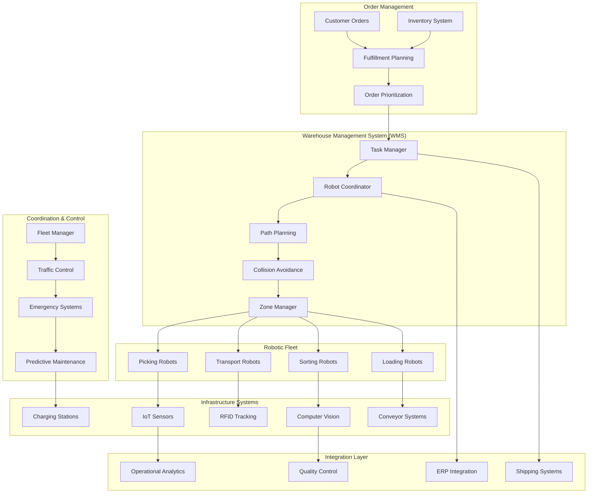
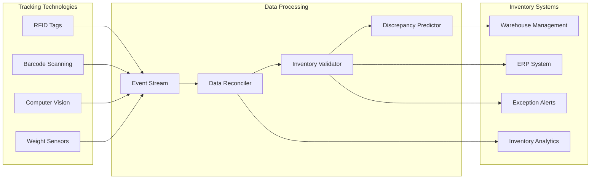

# Warehouse Automation Systems

## Table of Contents

- [System Overview](#system-overview)
  - [Scale & Complexity](#scale-complexity)
- [Architecture Overview](#architecture-overview)
- [Key Architectural Challenges](#key-architectural-challenges)
  - [1. Multi-Robot Coordination at Scale](#1-multi-robot-coordination-at-scale)
  - [2. Real-time Inventory Tracking](#2-real-time-inventory-tracking)
  - [3. Dynamic Task Allocation & Optimization](#3-dynamic-task-allocation-optimization)
- [Advanced Automation Features](#advanced-automation-features)
  - [1. Computer Vision Quality Control](#1-computer-vision-quality-control)
  - [2. Predictive Maintenance Integration](#2-predictive-maintenance-integration)
- [Real-World Examples](#real-world-examples)
  - [Amazon Fulfillment Centers](#amazon-fulfillment-centers)
  - [Alibaba Smart Warehouses](#alibaba-smart-warehouses)
  - [Ocado Automated Grid System](#ocado-automated-grid-system)
- [Performance Optimization](#performance-optimization)
  - [1. Robot Fleet Optimization](#1-robot-fleet-optimization)
  - [2. Scalability Architecture](#2-scalability-architecture)
- [Lessons Learned](#lessons-learned)
  - [1. Human-Robot Collaboration](#1-human-robot-collaboration)
  - [2. System Integration Complexity](#2-system-integration-complexity)
  - [3. Maintenance and Reliability](#3-maintenance-and-reliability)
- [Future Considerations](#future-considerations)
  - [1. Advanced AI Integration](#1-advanced-ai-integration)
  - [2. Sustainability Integration](#2-sustainability-integration)
  - [3. Quantum Computing Applications](#3-quantum-computing-applications)
- [Technology Stack](#technology-stack)


## System Overview

Modern automated warehouses use robotics, AI, and sophisticated coordination systems to manage inventory, fulfill orders, and optimize operations. Systems like Amazon's fulfillment centers, Alibaba's smart warehouses, and Ocado's automated grid systems coordinate thousands of robots to process millions of items with sub-minute order fulfillment times.

### Scale & Complexity
- **Warehouse Capacity**: 1M+ items in active inventory
- **Robot Fleet**: 1,000+ coordinated autonomous robots
- **Order Processing**: 10K+ orders/hour during peak periods  
- **Pick Accuracy**: 99.99%+ with automated quality control
- **Coordination Events**: 1M+ robot coordination messages/minute

## Architecture Overview



## Key Architectural Challenges

### 1. Multi-Robot Coordination at Scale

**Challenge**: Coordinating 1,000+ robots in a shared workspace without conflicts or deadlocks.

**Solution Architecture**:
- Hierarchical coordination with zone-based management
- Distributed path planning with conflict resolution
- Real-time traffic control system
- Emergency coordination protocols

**Implementation**:
```python
class WarehouseRobotCoordinator:
    def __init__(self):
        self.zone_managers = {}  # Zone-based robot management
        self.global_traffic_controller = GlobalTrafficController()
        self.path_planner = DistributedPathPlanner()
        self.conflict_resolver = ConflictResolver()
        self.fleet_monitor = FleetMonitor()
    
    async def coordinate_robot_tasks(self, task_assignments):
        """
        Main coordination loop for robot task execution
        """
        # Group tasks by zones
        zone_tasks = self.group_tasks_by_zone(task_assignments)
        
        # Plan paths for all robots
        path_plans = {}
        for zone_id, tasks in zone_tasks.items():
            zone_paths = await self.path_planner.plan_zone_paths(zone_id, tasks)
            path_plans[zone_id] = zone_paths
        
        # Detect inter-zone conflicts
        conflicts = await self.conflict_resolver.detect_conflicts(path_plans)
        
        if conflicts:
            # Resolve conflicts through negotiation
            resolved_paths = await self.resolve_path_conflicts(conflicts, path_plans)
            path_plans.update(resolved_paths)
        
        # Execute coordinated robot movements
        await self.execute_coordinated_movements(path_plans)
    
    async def execute_coordinated_movements(self, path_plans):
        """
        Execute robot movements with real-time coordination
        """
        active_robots = {}
        
        for zone_id, zone_paths in path_plans.items():
            zone_manager = self.zone_managers[zone_id]
            
            for robot_id, path in zone_paths.items():
                # Start robot on planned path
                robot_task = asyncio.create_task(
                    self.execute_robot_path(robot_id, path, zone_manager)
                )
                active_robots[robot_id] = robot_task
        
        # Monitor robot progress and handle dynamic conflicts
        while active_robots:
            # Check for completed robots
            done, pending = await asyncio.wait(
                active_robots.values(), 
                return_when=asyncio.FIRST_COMPLETED
            )
            
            for completed_task in done:
                robot_id = self.get_robot_id_from_task(completed_task)
                del active_robots[robot_id]
            
            # Handle dynamic replanning if needed
            await self.handle_dynamic_replanning(active_robots)
    
    async def execute_robot_path(self, robot_id, path, zone_manager):
        """
        Execute individual robot path with safety monitoring
        """
        robot = self.get_robot(robot_id)
        
        for waypoint in path.waypoints:
            # Check for dynamic obstacles
            if await self.check_dynamic_obstacles(robot_id, waypoint):
                # Request replanning from zone manager
                new_path = await zone_manager.replan_robot_path(robot_id, waypoint)
                path = new_path
                continue
            
            # Move to waypoint with safety checks
            await self.move_robot_safely(robot, waypoint)
            
            # Update global traffic state
            await self.global_traffic_controller.update_robot_position(
                robot_id, waypoint.position
            )
            
            # Check for emergency stops
            if await self.check_emergency_conditions():
                await self.emergency_stop_robot(robot_id)
                return
```

### 2. Real-time Inventory Tracking

**Challenge**: Maintaining accurate inventory state as thousands of items move through automated systems.

**Solution**: Event-driven inventory management with real-time reconciliation.



**Inventory Tracking Implementation**:
```go
type InventoryTrackingSystem struct {
    eventProcessor    *EventProcessor
    reconciler       *DataReconciler
    inventoryDB      *InventoryDatabase
    discrepancyML    *DiscrepancyPredictor
    alertSystem      *AlertSystem
}

type InventoryEvent struct {
    EventID       string    `json:"event_id"`
    ItemID        string    `json:"item_id"`
    Location      Location  `json:"location"`
    EventType     string    `json:"event_type"` / PICKED, MOVED, STORED, SCANNED
    Quantity      int       `json:"quantity"`
    RobotID       string    `json:"robot_id,omitempty"`
    Timestamp     time.Time `json:"timestamp"`
    SensorData    SensorData `json:"sensor_data"`
    Confidence    float64   `json:"confidence"`
}

func (its *InventoryTrackingSystem) ProcessInventoryEvent(event *InventoryEvent) error {
    / Validate event data
    if err := its.validateEvent(event); err != nil {
        return fmt.Errorf("invalid event: %w", err)
    }
    
    / Process based on event type
    switch event.EventType {
    case "PICKED":
        return its.handlePickEvent(event)
    case "MOVED":
        return its.handleMoveEvent(event)
    case "STORED":
        return its.handleStorageEvent(event)
    case "SCANNED":
        return its.handleScanEvent(event)
    default:
        return fmt.Errorf("unknown event type: %s", event.EventType)
    }
}

func (its *InventoryTrackingSystem) handlePickEvent(event *InventoryEvent) error {
    / Update inventory quantity
    currentInventory, err := its.inventoryDB.GetItemInventory(event.ItemID, event.Location)
    if err != nil {
        return fmt.Errorf("failed to get current inventory: %w", err)
    }
    
    if currentInventory.Quantity < event.Quantity {
        / Potential discrepancy detected
        discrepancy := &InventoryDiscrepancy{
            ItemID:          event.ItemID,
            Location:        event.Location,
            ExpectedQty:     currentInventory.Quantity,
            ActualQty:       event.Quantity,
            DiscrepancyType: "INSUFFICIENT_INVENTORY",
            DetectedAt:      time.Now(),
        }
        
        if err := its.handleDiscrepancy(discrepancy); err != nil {
            return fmt.Errorf("failed to handle discrepancy: %w", err)
        }
    }
    
    / Update inventory
    newQuantity := currentInventory.Quantity - event.Quantity
    return its.inventoryDB.UpdateItemQuantity(
        event.ItemID, 
        event.Location, 
        newQuantity,
        event.Timestamp,
    )
}

func (its *InventoryTrackingSystem) RunContinuousReconciliation() {
    ticker := time.NewTicker(5 * time.Minute) / Reconcile every 5 minutes
    defer ticker.Stop()
    
    for {
        select {
        case <-ticker.C:
            if err := its.performReconciliation(); err != nil {
                log.Printf("Reconciliation error: %v", err)
            }
        }
    }
}

func (its *InventoryTrackingSystem) performReconciliation() error {
    / Get all inventory locations
    locations, err := its.inventoryDB.GetAllLocations()
    if err != nil {
        return err
    }
    
    discrepancies := []InventoryDiscrepancy{}
    
    for _, location := range locations {
        / Compare system inventory with sensor data
        systemInventory := its.inventoryDB.GetLocationInventory(location)
        sensorInventory := its.getSensorBasedInventory(location)
        
        locationDiscrepancies := its.reconciler.CompareInventories(
            systemInventory, 
            sensorInventory,
        )
        
        discrepancies = append(discrepancies, locationDiscrepancies...)
    }
    
    / Process discrepancies
    for _, discrepancy := range discrepancies {
        / Use ML to predict if discrepancy is real or sensor error
        prediction := its.discrepancyML.PredictDiscrepancyType(discrepancy)
        
        if prediction.Confidence > 0.8 {
            if prediction.IsRealDiscrepancy {
                / Real inventory issue - trigger physical count
                its.alertSystem.TriggerPhysicalCount(discrepancy.Location)
            } else {
                / Likely sensor error - recalibrate sensors
                its.alertSystem.TriggerSensorCalibration(discrepancy.Location)
            }
        }
    }
    
    return nil
}
```

### 3. Dynamic Task Allocation & Optimization

**Challenge**: Optimally assigning thousands of tasks to robots while adapting to changing priorities and conditions.

**Implementation**:
```yaml
Task Allocation Strategy:
  Primary Factors:
    - Robot capabilities and current location
    - Task priority and deadline requirements  
    - Battery level and charging needs
    - Workload balancing across robot fleet
    
  Secondary Factors:
    - Learning from robot performance history
    - Predictive maintenance scheduling
    - Energy optimization for battery-powered robots
    - Zone congestion and traffic patterns
    
  Real-time Adaptations:
    - Emergency task rerouting
    - Robot failure compensation
    - Priority escalation handling
    - Dynamic workload rebalancing
```

## Advanced Automation Features

### 1. Computer Vision Quality Control

```python
class AutomatedQualityControl:
    def __init__(self):
        self.defect_detector = DefectDetectionModel()
        self.size_measurement = SizeMeasurementSystem()
        self.color_analyzer = ColorAnalysisSystem()
        self.barcode_reader = BarcodeReader()
        self.packaging_inspector = PackagingInspector()
    
    async def inspect_item(self, item_id, image_data, weight_data):
        """
        Comprehensive automated item inspection
        """
        inspection_results = {}
        
        # Defect detection using computer vision
        defects = await self.defect_detector.detect_defects(image_data)
        inspection_results['defects'] = defects
        
        # Size and dimension measurement
        dimensions = await self.size_measurement.measure_item(image_data)
        inspection_results['dimensions'] = dimensions
        
        # Color quality analysis
        color_analysis = await self.color_analyzer.analyze_color_quality(image_data)
        inspection_results['color_quality'] = color_analysis
        
        # Barcode verification
        barcode_result = await self.barcode_reader.verify_barcode(image_data, item_id)
        inspection_results['barcode_valid'] = barcode_result
        
        # Weight verification
        expected_weight = await self.get_expected_weight(item_id)
        weight_variance = abs(weight_data - expected_weight) / expected_weight
        inspection_results['weight_variance'] = weight_variance
        
        # Packaging inspection
        packaging_quality = await self.packaging_inspector.inspect_packaging(image_data)
        inspection_results['packaging_quality'] = packaging_quality
        
        # Overall quality score
        overall_score = self.calculate_quality_score(inspection_results)
        
        # Decision logic
        if overall_score < 0.8:  # Quality threshold
            await self.handle_quality_failure(item_id, inspection_results)
            return False
        
        return True
    
    async def handle_quality_failure(self, item_id, inspection_results):
        """
        Handle items that fail quality inspection
        """
        failure_reasons = []
        
        if inspection_results['defects']:
            failure_reasons.append('VISUAL_DEFECTS')
        
        if inspection_results['weight_variance'] > 0.1:  # 10% variance
            failure_reasons.append('WEIGHT_DISCREPANCY')
        
        if not inspection_results['barcode_valid']:
            failure_reasons.append('BARCODE_ERROR')
        
        if inspection_results['color_quality']['score'] < 0.7:
            failure_reasons.append('COLOR_QUALITY')
        
        if inspection_results['packaging_quality']['score'] < 0.8:
            failure_reasons.append('PACKAGING_DAMAGE')
        
        # Route to appropriate handling
        if 'VISUAL_DEFECTS' in failure_reasons or 'PACKAGING_DAMAGE' in failure_reasons:
            await self.route_to_returns_processing(item_id)
        elif 'BARCODE_ERROR' in failure_reasons:
            await self.route_to_manual_verification(item_id)
        elif 'WEIGHT_DISCREPANCY' in failure_reasons:
            await self.route_to_reweighing(item_id)
        
        # Log for analytics
        await self.log_quality_failure(item_id, failure_reasons, inspection_results)
```

### 2. Predictive Maintenance Integration

```python
class PredictiveMaintenanceSystem:
    def __init__(self):
        self.sensor_data_collector = SensorDataCollector()
        self.failure_predictor = MaintenanceMLModel()
        self.maintenance_scheduler = MaintenanceScheduler()
        self.robot_fleet_manager = RobotFleetManager()
    
    async def monitor_robot_health(self, robot_id):
        """
        Continuous health monitoring for warehouse robots
        """
        while True:
            # Collect sensor data
            sensor_data = await self.sensor_data_collector.collect_robot_data(robot_id)
            
            # Analyze for potential issues
            health_analysis = await self.analyze_robot_health(robot_id, sensor_data)
            
            # Predict maintenance needs
            maintenance_prediction = await self.failure_predictor.predict_failures(
                robot_id, sensor_data, health_analysis
            )
            
            # Schedule preventive maintenance if needed
            if maintenance_prediction['failure_probability'] > 0.7:
                await self.schedule_preventive_maintenance(robot_id, maintenance_prediction)
            
            # Sleep until next monitoring cycle
            await asyncio.sleep(300)  # 5 minutes
    
    async def analyze_robot_health(self, robot_id, sensor_data):
        """
        Analyze robot health based on sensor data
        """
        health_metrics = {}
        
        # Battery health analysis
        battery_data = sensor_data.get('battery', {})
        health_metrics['battery_health'] = self.analyze_battery_health(battery_data)
        
        # Motor performance analysis
        motor_data = sensor_data.get('motors', {})
        health_metrics['motor_performance'] = self.analyze_motor_performance(motor_data)
        
        # Navigation system health
        nav_data = sensor_data.get('navigation', {})
        health_metrics['navigation_accuracy'] = self.analyze_navigation_accuracy(nav_data)
        
        # Sensor calibration status
        sensor_calibration = sensor_data.get('sensor_calibration', {})
        health_metrics['sensor_calibration'] = self.check_sensor_calibration(sensor_calibration)
        
        # Mechanical wear analysis
        mechanical_data = sensor_data.get('mechanical', {})
        health_metrics['mechanical_wear'] = self.analyze_mechanical_wear(mechanical_data)
        
        return health_metrics
    
    async def schedule_preventive_maintenance(self, robot_id, prediction):
        """
        Schedule preventive maintenance based on predictions
        """
        # Determine maintenance urgency
        urgency = self.determine_maintenance_urgency(prediction)
        
        # Find optimal maintenance window
        maintenance_window = await self.maintenance_scheduler.find_optimal_window(
            robot_id, urgency
        )
        
        if maintenance_window:
            # Schedule maintenance task
            maintenance_task = MaintenanceTask(
                robot_id=robot_id,
                predicted_issues=prediction['predicted_issues'],
                scheduled_time=maintenance_window.start_time,
                estimated_duration=maintenance_window.duration,
                urgency=urgency
            )
            
            await self.maintenance_scheduler.schedule_task(maintenance_task)
            
            # Notify fleet manager for task redistribution
            await self.robot_fleet_manager.notify_scheduled_maintenance(
                robot_id, maintenance_window
            )
        else:
            # No suitable window found - may need to force maintenance
            if urgency == 'CRITICAL':
                await self.emergency_maintenance_protocol(robot_id, prediction)
```

## Real-World Examples

### Amazon Fulfillment Centers

**Scale**: 175+ fulfillment centers globally with 200,000+ mobile robots

**Technical Innovations**:
- Kiva robots (now Amazon Robotics) for goods-to-person fulfillment
- Computer vision for quality control and sorting
- Machine learning for demand forecasting and inventory placement
- Advanced picking algorithms with human-robot collaboration

**Architecture Highlights**:
```yaml
Amazon Robotics System:
  - Robot Fleet: 200,000+ Kiva robots across facilities
  - Coordination: Distributed swarm intelligence
  - Pick Rate: 300+ items/hour per human-robot team
  - Accuracy: 99.99% order accuracy
  
Innovation Areas:
  - Predictive stowing: AI-optimized inventory placement
  - Prime Air integration: Drone delivery preparation
  - Robotic manipulation: Advanced picking capabilities
  - Computer vision: Automated damage detection
```

### Alibaba Smart Warehouses

**Scale**: 100+ automated warehouses processing 1B+ packages annually

**Key Features**:
- Fully automated sorting with 99.99% accuracy
- AI-powered inventory optimization
- Cross-docking automation for rapid fulfillment
- Integration with Cainiao logistics network

**Technical Achievements**:
```yaml
Alibaba Automation:
  - Processing Speed: 300,000 packages/hour peak
  - Robot Coordination: 700+ robots per facility
  - Accuracy Rate: 99.99% sorting accuracy
  - Efficiency Gain: 70% improvement over manual operations
  
Advanced Features:
  - AI route optimization for robots
  - Predictive analytics for inventory management
  - Real-time adaptation to order patterns
  - Integration with Singles Day (11.11) peak processing
```

### Ocado Automated Grid System

**Scale**: World's most advanced grocery fulfillment automation

**Unique Approach**:
- 3D grid system with robots moving on top
- Goods-to-person picking with minimal human intervention
- AI-powered demand forecasting and inventory optimization
- Real-time route optimization for thousands of robots

**Technical Implementation**:
```yaml
Ocado Grid System:
  - Grid Size: 100m x 100m per facility
  - Robot Fleet: 1,000+ robots per grid
  - Pick Rate: 50,000+ items/hour
  - Order Accuracy: 99.95%
  
Innovation Highlights:
  - Swarm intelligence for robot coordination
  - 3D pathfinding with collision avoidance
  - Predictive maintenance with 99.9% uptime
  - AI-optimized product placement for efficiency
```

## Performance Optimization

### 1. Robot Fleet Optimization

```yaml
Fleet Performance Metrics:
  Throughput:
    - Orders processed: 10,000+ orders/hour peak
    - Items picked: 50,000+ items/hour
    - Robot utilization: 85%+ active time
    - System uptime: 99.5%+ availability
    
  Efficiency:
    - Energy consumption: 40% reduction vs. manual
    - Space utilization: 50% improvement
    - Labor productivity: 300% increase
    - Error reduction: 99.5% accuracy improvement
    
  Coordination:
    - Path planning: <100ms route calculation
    - Conflict resolution: <50ms average
    - Emergency stops: <1 second response
    - Fleet rebalancing: Real-time adaptation
```

### 2. Scalability Architecture

```python
class WarehouseScalingManager:
    def __init__(self):
        self.capacity_monitor = CapacityMonitor()
        self.scaling_predictor = ScalingPredictor()
        self.resource_allocator = ResourceAllocator()
        self.performance_optimizer = PerformanceOptimizer()
    
    async def monitor_and_scale(self):
        """
        Continuous monitoring and scaling of warehouse operations
        """
        while True:
            # Monitor current capacity utilization
            current_metrics = await self.capacity_monitor.get_current_metrics()
            
            # Predict future capacity needs
            scaling_prediction = await self.scaling_predictor.predict_scaling_needs(
                current_metrics, time_horizon=3600  # 1 hour ahead
            )
            
            # Scale resources if needed
            if scaling_prediction['scale_up_needed']:
                await self.scale_up_resources(scaling_prediction)
            elif scaling_prediction['scale_down_possible']:
                await self.scale_down_resources(scaling_prediction)
            
            # Optimize current resource allocation
            await self.optimize_resource_allocation(current_metrics)
            
            await asyncio.sleep(300)  # Check every 5 minutes
    
    async def scale_up_resources(self, prediction):
        """
        Scale up warehouse resources based on predicted demand
        """
        required_resources = prediction['required_resources']
        
        # Activate standby robots
        if required_resources.get('additional_robots', 0) > 0:
            await self.activate_standby_robots(required_resources['additional_robots'])
        
        # Increase processing capacity
        if required_resources.get('additional_processing', 0) > 0:
            await self.scale_processing_capacity(required_resources['additional_processing'])
        
        # Allocate more charging stations
        if required_resources.get('charging_stations', 0) > 0:
            await self.allocate_charging_resources(required_resources['charging_stations'])
        
        # Notify operations team
        await self.notify_scaling_action('SCALE_UP', required_resources)
    
    async def optimize_resource_allocation(self, current_metrics):
        """
        Optimize allocation of current resources
        """
        # Analyze bottlenecks
        bottlenecks = await self.identify_bottlenecks(current_metrics)
        
        # Rebalance robot assignments
        if 'robot_distribution' in bottlenecks:
            await self.rebalance_robot_zones(bottlenecks['robot_distribution'])
        
        # Optimize task prioritization
        if 'task_queue' in bottlenecks:
            await self.optimize_task_priorities(bottlenecks['task_queue'])
        
        # Adjust charging schedules
        if 'charging_conflicts' in bottlenecks:
            await self.optimize_charging_schedule(bottlenecks['charging_conflicts'])
```

## Lessons Learned

### 1. Human-Robot Collaboration

**Challenge**: Integrating automated systems with human workers safely and efficiently.

**Solutions Applied**:
- Clear separation of human and robot work zones
- Collaborative robots (cobots) for complex tasks requiring dexterity
- Comprehensive safety systems with multiple redundancy layers
- Change management and training programs for workers

### 2. System Integration Complexity

**Challenge**: Integrating diverse robotic systems, sensors, and legacy warehouse systems.

**Solutions Applied**:
- Standardized APIs and data formats across systems
- Event-driven architecture for loose coupling
- Comprehensive testing in simulation environments
- Gradual rollout with parallel legacy system operation

### 3. Maintenance and Reliability

**Challenge**: Maintaining high availability with complex automated systems.

**Solutions Applied**:
- Predictive maintenance using IoT sensor data and ML
- Redundant systems and graceful degradation capabilities
- Rapid response maintenance teams with spare parts inventory
- Comprehensive monitoring and alerting systems

## Future Considerations

### 1. Advanced AI Integration

```yaml
Next-Generation Warehouse AI:
  Cognitive Robotics:
    - Advanced manipulation capabilities
    - Learning from demonstration
    - Adaptive behavior in dynamic environments
    - Natural language interaction with humans
  
  Autonomous Decision Making:
    - Self-optimizing workflows
    - Autonomous inventory management
    - Dynamic facility reconfiguration
    - Predictive demand-driven operations
  
  Computer Vision Advances:
    - 3D scene understanding
    - Damage detection and quality assessment  
    - Automated sorting of diverse items
    - Real-time inventory counting
```

### 2. Sustainability Integration

- **Energy Optimization**: Solar-powered facilities with battery storage
- **Circular Economy**: Automated returns processing and refurbishment
- **Sustainable Packaging**: Automated right-sized packaging systems
- **Carbon Footprint**: Real-time carbon impact tracking and optimization

### 3. Quantum Computing Applications

- **Optimization Problems**: Quantum algorithms for complex routing and scheduling
- **Machine Learning**: Quantum-enhanced predictive models
- **Cryptography**: Quantum-secure communications for sensitive operations
- **Simulation**: Quantum simulation for facility design optimization

## Technology Stack

**Robotics Platforms**:
- ROS (Robot Operating System) for robot control
- NVIDIA Jetson for edge AI computing
- Intel RealSense for depth sensing
- Custom hardware for specialized tasks

**Coordination Systems**:
- Apache Kafka for event streaming
- Redis for real-time coordination
- PostgreSQL for persistent data storage
- TensorFlow/PyTorch for ML models

**IoT & Sensors**:
- RFID systems for item tracking
- Computer vision cameras
- Weight and dimension sensors
- Environmental monitoring sensors

**Integration & Analytics**:
- Apache Airflow for workflow orchestration
- Elasticsearch for log analytics
- Grafana for operational dashboards
- Custom APIs for system integration

This comprehensive warehouse automation architecture demonstrates how modern logistics facilities use robotics, AI, and sophisticated coordination systems to achieve unprecedented levels of efficiency, accuracy, and scalability in order fulfillment operations.