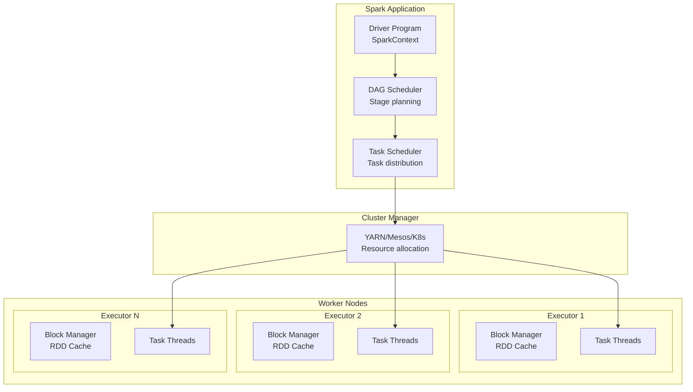
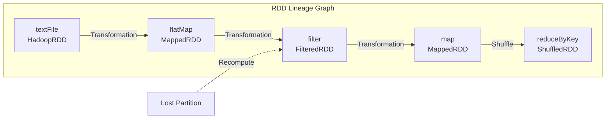
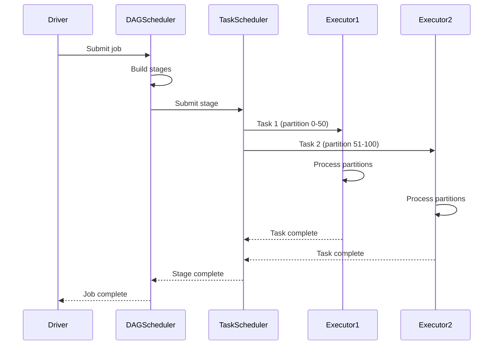
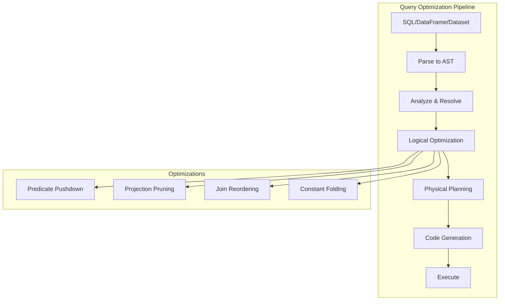
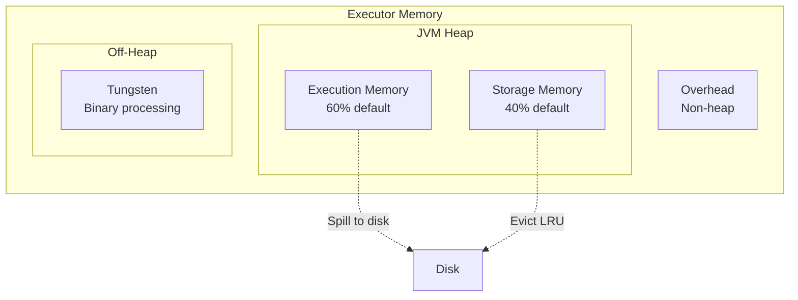
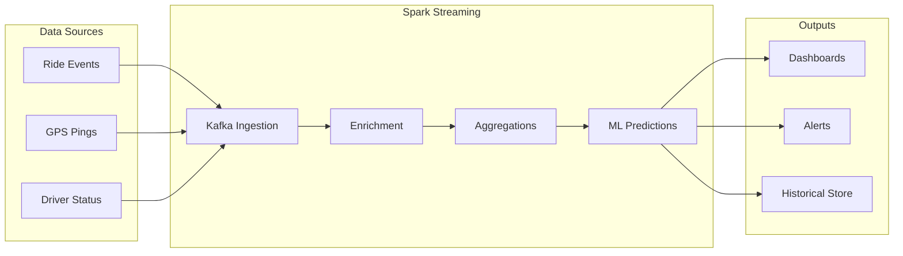
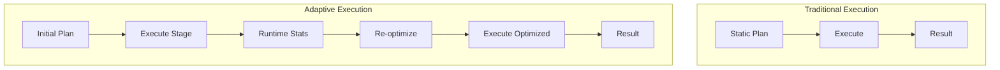

# Apache Spark: Unified Analytics Engine at Scale

!!! abstract "The Spark Story"
    **🎯 Single Achievement**: Made big data processing 100x faster
    **📊 Scale**: Alibaba: 100PB+ data, 10,000+ nodes
    **⏱️ Performance**: 100x faster than MapReduce for iterative
    **💡 Key Innovation**: In-memory computing with RDD abstraction

## Why Spark Matters

| MapReduce Era | Spark Innovation | Business Impact |
|---------------|------------------|------------------|
| **Disk between steps** → slow | **Memory caching** → fast | 100x speedup |
| **Batch only** → limited | **Unified engine** → flexible | One system for all |
| **Low-level API** → complex | **High-level APIs** → simple | 10x productivity |
| **Single pass** → inefficient | **Iterative algorithms** → ML ready | Enable AI/ML at scale |

## Architecture Overview



## Core Innovation: RDD Abstraction

### Resilient Distributed Datasets

```scala
// RDD: Immutable, partitioned collection
val textFile = spark.textFile("hdfs://...")

// Transformations (lazy)
val words = textFile
  .flatMap(line => line.split(" "))
  .filter(word => word.length > 3)

// Actions (trigger execution)
val count = words.count()  // Executes entire DAG

// Persistence
words.cache()  // Keep in memory for reuse
```

### RDD Lineage (Fault Tolerance)



## Execution Model

### DAG Construction and Optimization

```scala
// User code
val result = input
  .filter(_.age > 18)
  .map(u => (u.city, 1))
  .reduceByKey(_ + _)
  .filter(_._2 > 100)
  .collect()
```

```mermaid
graph TB
    subgraph "Logical Plan"
        READ[Read Input]
        F1[Filter: age > 18]
        MAP[Map: (city, 1)]
        REDUCE[ReduceByKey: sum]
        F2[Filter: count > 100]
    end
    
    subgraph "Physical Plan"
        subgraph "Stage 1"
            S1_READ[Read + Filter]
            S1_MAP[Map]
            S1_SHUFFLE[Shuffle Write]
        end
        
        subgraph "Stage 2"
            S2_SHUFFLE[Shuffle Read]
            S2_REDUCE[Reduce]
            S2_FILTER[Filter]
        end
    end
    
    READ --> F1
    F1 --> MAP
    MAP --> REDUCE
    REDUCE --> F2
    
    S1_READ --> S1_MAP
    S1_MAP --> S1_SHUFFLE
    S1_SHUFFLE -.->|Network| S2_SHUFFLE
    S2_SHUFFLE --> S2_REDUCE
    S2_REDUCE --> S2_FILTER
```

### Task Execution



## Evolution: From RDD to DataFrames to Datasets

### API Evolution

```scala
// 1. RDD API (2014) - Low level
val wordCounts = textFile
  .flatMap(_.split(" "))
  .map(word => (word, 1))
  .reduceByKey(_ + _)

// 2. DataFrame API (2015) - SQL-like
val wordCounts = textFile
  .select(explode(split($"value", " ")).as("word"))
  .groupBy("word")
  .count()

// 3. Dataset API (2016) - Type safe + optimization
case class Word(word: String, count: Long)
val wordCounts = textFile
  .flatMap(_.split(" "))
  .groupByKey(identity)
  .count()
  .as[Word]
```

### Catalyst Optimizer



## Unified Engine: Batch + Streaming

### Structured Streaming

```scala
// Same API for batch and streaming!
val df = spark
  .readStream  // Change: read → readStream
  .format("kafka")
  .option("subscribe", "events")
  .load()

val counts = df
  .selectExpr("CAST(value AS STRING)")
  .select(explode(split($"value", " ")).as("word"))
  .groupBy("word")
  .count()

counts.writeStream  // Change: write → writeStream
  .outputMode("complete")
  .format("console")
  .start()
```

### Processing Model Comparison

| Aspect | Batch | Micro-batch Streaming | Continuous Streaming |
|--------|-------|---------------------|---------------------|
| **Latency** | Minutes-Hours | 100ms-1s | 1-10ms |
| **Throughput** | Highest | High | Medium |
| **Complexity** | Simple | Medium | Complex |
| **Use Case** | ETL, Analytics | Near real-time | Real-time |

## Production Patterns

### Dynamic Resource Allocation

```scala
// Spark configuration
spark.conf.set("spark.dynamicAllocation.enabled", "true")
spark.conf.set("spark.dynamicAllocation.minExecutors", "10")
spark.conf.set("spark.dynamicAllocation.maxExecutors", "1000")
spark.conf.set("spark.dynamicAllocation.executorIdleTimeout", "60s")

// Scales based on workload
// - Idle executors released after 60s
// - New executors requested for pending tasks
// - Maintains 10-1000 executor range
```

### Memory Management



### Optimization Techniques

```scala
// 1. Partition optimization
val optimalPartitions = inputSize / 128MB  // Target partition size
df.repartition(optimalPartitions)

// 2. Broadcast joins for small tables
val smallTable = spark.table("users").cache()
val largeTable = spark.table("events")

largeTable.join(broadcast(smallTable), "user_id")

// 3. Avoid shuffles
df.groupBy("key").agg(sum("value"))  // Shuffle required
df.reduceByKey(_ + _)  // More efficient for RDD

// 4. Cache strategically
val frequentlyUsed = df.filter(...).cache()
frequentlyUsed.count()  // Trigger cache
```

## Real-World Use Cases

### Netflix: Content Recommendations

```scala
// Collaborative filtering at scale
val userFactors = als.fit(ratings).userFactors
val itemFactors = als.fit(ratings).itemFactors

// Generate recommendations for all users
val recommendations = userFactors
  .crossJoin(itemFactors)
  .selectExpr("user_id", "item_id", 
    "dot_product(user_features, item_features) as score")
  .filter($"score" > threshold)
  .groupBy("user_id")
  .agg(collect_list(struct("item_id", "score")).as("recommendations"))

// Process 100M+ users x 100K+ items
```

### Uber: Real-time Analytics



## Performance Tuning

### Common Performance Issues

| Problem | Symptom | Solution |
|---------|---------|----------|
| **Data Skew** | One task takes forever | Salting, custom partitioner |
| **Small Files** | Many tasks, overhead | Coalesce, combine files |
| **Shuffles** | Network bottleneck | Optimize joins, use broadcast |
| **Spilling** | Disk I/O high | Increase memory, optimize |
| **GC Pressure** | Long pauses | Tune GC, use off-heap |

### Shuffle Optimization

```scala
// Problem: Skewed join
val skewedJoin = orders.join(users, "user_id")
// User 'power_user' has 1M orders, others have 100

// Solution: Salting
val saltedOrders = orders
  .withColumn("salt", when($"user_id" === "power_user", 
    rand() * 100).otherwise(0))
  .withColumn("salted_key", concat($"user_id", $"salt"))

val saltedUsers = users
  .flatMap(user => 
    if (user.id == "power_user") 
      (0 to 99).map(salt => (s"${user.id}$salt", user))
    else 
      Seq((s"${user.id}0", user))
  )

val optimizedJoin = saltedOrders.join(saltedUsers, "salted_key")
```

## Modern Enhancements

### Adaptive Query Execution (3.0+)



### GPU Acceleration

```scala
// RAPIDS integration
spark.conf.set("spark.rapids.sql.enabled", "true")
spark.conf.set("spark.task.resource.gpu.amount", "0.25")

// Automatically uses GPU for:
// - Joins, aggregations
// - Sorting, filtering  
// - Parquet reading
// - ML operations
```

## Lessons Learned

### What Made Spark Successful

1. **Unified API**: Same code for batch, streaming, SQL, ML
2. **Memory Speed**: 100x faster than disk-based systems
3. **Developer Friendly**: High-level APIs in multiple languages
4. **Fault Tolerant**: RDD lineage enables recomputation
5. **Ecosystem**: Rich libraries for SQL, ML, Graph, Streaming

### Common Pitfalls

1. **Not Understanding Lazy Evaluation**:
   ```scala
   val df = spark.read.parquet("huge_file")
   df.filter(condition)  // Nothing happens yet!
   df.count()  // NOW it executes
   ```

2. **Collecting Large Data**:
   ```scala
   // DON'T: OOM on driver
   val allData = hugeRDD.collect()
   
   // DO: Process distributed
   hugeRDD.foreach(processRecord)
   ```

3. **Ignoring Data Skew**:
   ```scala
   // Monitor partition sizes
   df.rdd.mapPartitions(iter => 
     Iterator(iter.size)).collect()
   ```

## Decision Framework

### When to Use Spark

✅ **Perfect Fit**:
- Large-scale ETL
- Iterative algorithms (ML)
- Interactive analytics
- Stream processing
- Multi-language teams

⚠️ **Consider Carefully**:
- Sub-second latency
- Small data (<100GB)
- Simple aggregations only
- OLTP workloads

❌ **Avoid**:
- Real-time (<100ms)
- Transactional processing
- Key-value lookups
- Small datasets

## Key Takeaways

!!! success "Critical Success Factors"
    1. **Understand the APIs**: RDD vs DataFrame vs Dataset
    2. **Monitor and Tune**: Use Spark UI extensively
    3. **Optimize Shuffles**: They're the bottleneck
    4. **Cache Wisely**: Memory is limited
    5. **Test at Scale**: Behavior changes with size

## Related Topics

- [MapReduce](../../../architects-handbook/case-studies/messaging-streaming/mapreduce.md) - Predecessor comparison
- [Distributed Computing](../../../pattern-library/distributed-computing) - Core concepts
- [Stream Processing](../../../pattern-library/stream-processing) - Streaming patterns
- [Apache Flink](flink) - Alternative engine
- [Databricks](databricks.md) - Commercial Spark platform

## References

1. [Spark: The Definitive Guide](https://www.oreilly.com/library/view/spark-the-definitive/9781491912201/)
2. [High Performance Spark](https://www.oreilly.com/library/view/high-performance-spark/9781491943199/)
3. [Learning Spark, 2nd Edition](https://www.oreilly.com/library/view/learning-spark-2nd/9781492050049/)
4. [Spark Documentation](https://spark.apache.org/docs/latest/)
