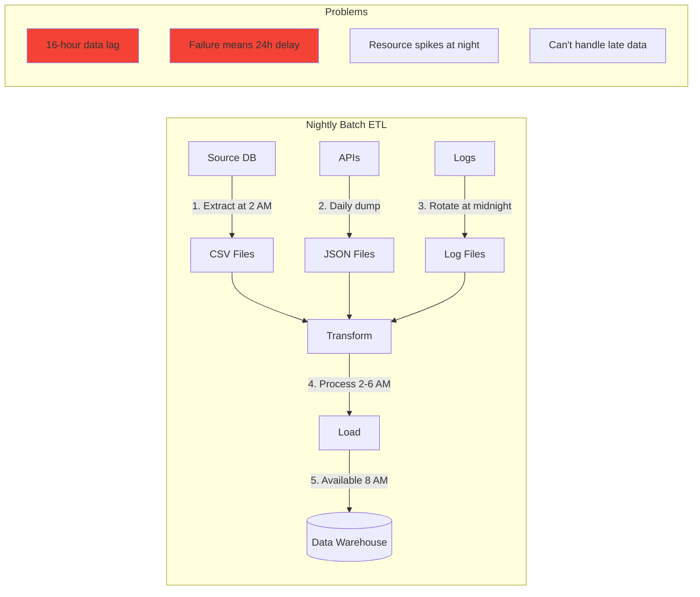
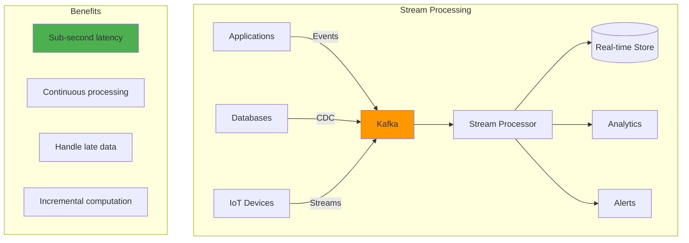
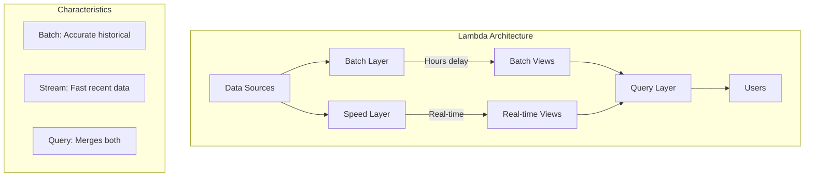
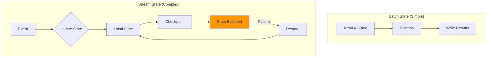
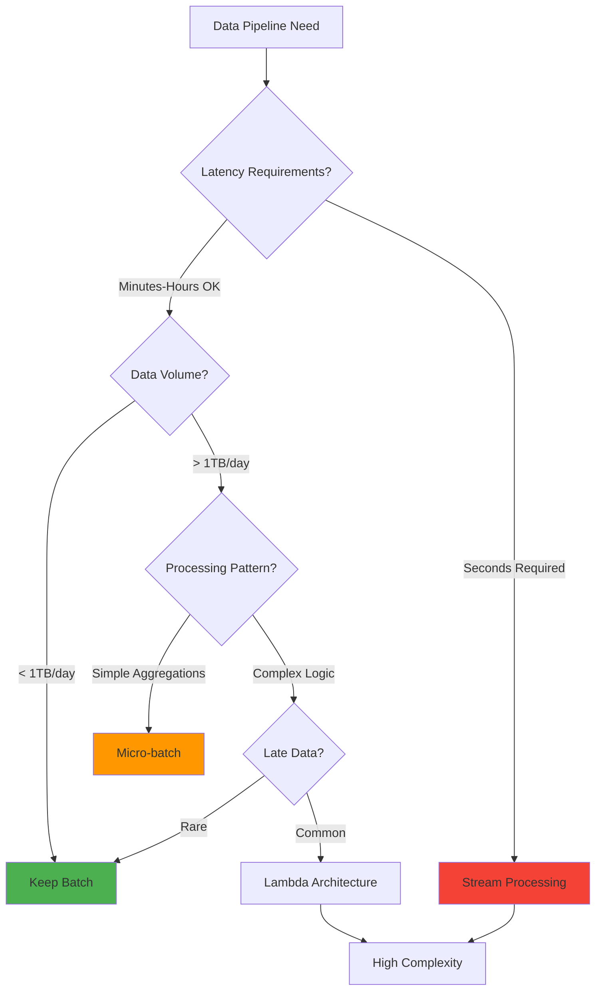

# Migration: From Batch to Stream Processing

!!! warning "Excellence Badge"
    🥉 **Bronze Tier**: Understand the trade-offs before migrating

!!! info "Migration Reality"
    While batch processing is considered legacy, it still has valid use cases. This guide helps you migrate where it makes sense and avoid common pitfalls.

!!! abstract "Processing Comparison"
    | Aspect | Batch | Streaming | Impact |
    |--------|-------|-----------|--------|
    | **Latency** | Hours/Days | Seconds/Milliseconds | 1000x faster |
    | **Complexity** | Simple | Complex | 5x harder |
    | **Cost** | Cheap | Expensive | 2x more |
    | **Accuracy** | Perfect | Approximate | Trade-offs |
    | **Recovery** | Re-run batch | Complex replay | Harder |

## Executive Summary

Many organizations built data pipelines using batch processing—running large jobs at scheduled intervals. While simple and reliable, batch processing introduces delays that modern businesses can't afford. This case study examines migrations from batch to stream processing, including when it makes sense and when it doesn't.

## The Batch Processing Legacy

### Classic Batch Architecture



### Why Batch Worked (And Still Does)

```python
class BatchProcessingAdvantages:
    def __init__(self):
        self.benefits = {
            "simplicity": "Easy to understand and debug",
            "reliability": "Failures are obvious and fixable",
            "cost": "Only pay for processing time",
            "tooling": "Mature ecosystem (Airflow, etc.)",
            "accuracy": "Can achieve perfect consistency"
        }
    
    def when_batch_still_makes_sense(self):
        return [
            "Historical reprocessing",
            "Complex aggregations over large datasets",
            "Data quality and validation checks",
            "Regulatory reporting",
            "ML model training"
        ]
```

## Stream Processing Benefits

### Real-Time Architecture



## Migration Patterns

### Pattern 1: Parallel Run (Recommended)

```python
class ParallelRunMigration:
    """
    Run both systems in parallel for validation
    """
    
    def migrate_safely(self):
        # Phase 1: Add streaming alongside batch
        self.setup_stream_processing()
        
        # Phase 2: Run both for 1-3 months
        while not self.results_match():
            self.debug_differences()
            self.fix_streaming_logic()
        
        # Phase 3: Gradual cutover
        self.route_read_traffic_percentage(stream=10)
        self.monitor_accuracy()
        
        if self.confidence_high():
            self.increase_stream_percentage()
        else:
            self.investigate_issues()
        
        # Phase 4: Deprecate batch
        if self.stream_percentage == 100:
            self.schedule_batch_shutdown()
```

### Pattern 2: Lambda Architecture



### Pattern 3: Kappa Architecture

```python
class KappaArchitecture:
    """
    Stream-only processing with replay capability
    """
    
    def process_everything_as_streams(self):
        # Single processing pipeline
        pipeline = StreamPipeline()
        
        # Can replay from beginning for:
        # - Reprocessing with new logic
        # - Disaster recovery
        # - Historical analysis
        
        if self.need_historical_reprocess():
            pipeline.replay_from(timestamp=0)
        else:
            pipeline.process_from_latest()
        
        # Simpler than Lambda, but requires
        # infinite retention or archival strategy
```

## Technical Implementation

### From Batch ETL to Streaming

=== "Before: Batch ETL"
    ```python
    # Nightly batch job
    def batch_etl():
        # Extract - Read entire dataset
        orders = db.query("""
            SELECT * FROM orders 
            WHERE date = CURRENT_DATE - 1
        """)
        
        # Transform - Process all at once
        enriched_orders = []
        for order in orders:
            customer = db.get_customer(order.customer_id)
            enriched = enrich_order(order, customer)
            enriched_orders.append(enriched)
        
        # Load - Bulk insert
        warehouse.bulk_insert(enriched_orders)
    ```

=== "After: Stream Processing"
    ```python
    # Continuous stream processing
    @stream_processor
    def process_order_stream(order_event):
        # Process each event as it arrives
        customer = cache.get(order_event.customer_id)
        if not customer:
            customer = db.get_customer(order_event.customer_id)
            cache.set(order_event.customer_id, customer)
        
        # Transform
        enriched = enrich_order(order_event, customer)
        
        # Immediate output
        output_stream.send(enriched)
    ```

### Handling Late Data

```python
class WatermarkStrategy:
    """
    Handle data that arrives late
    """
    
    def configure_watermarks(self):
        return {
            # Allow 5 minutes for late data
            "allowed_lateness": timedelta(minutes=5),
            
            # Watermark generation
            "watermark_interval": timedelta(seconds=10),
            
            # What to do with late data
            "late_data_handling": {
                "within_allowed_lateness": "update_results",
                "beyond_allowed_lateness": "send_to_late_topic"
            }
        }
    
    def process_with_watermarks(self, stream):
        return (
            stream
            .assign_timestamps_and_watermarks(
                WatermarkStrategy()
                .for_bounded_out_of_orderness(Duration.minutes(5))
            )
            .window(TumblingEventTimeWindows.of(Duration.minutes(1)))
            .aggregate(CountAggregator())
        )
```

### Exactly-Once Processing

```python
class ExactlyOnceProcessing:
    """
    Ensure each event is processed exactly once
    """
    
    def setup_kafka_transactions(self):
        # Producer config
        producer_config = {
            'bootstrap.servers': 'localhost:9092',
            'transactional.id': 'order-processor-1',
            'enable.idempotence': True
        }
        
        # Consumer config
        consumer_config = {
            'bootstrap.servers': 'localhost:9092',
            'group.id': 'order-processors',
            'isolation.level': 'read_committed',
            'enable.auto.commit': False
        }
        
        return producer_config, consumer_config
    
    def process_with_transactions(self, message):
        producer.begin_transaction()
        
        try:
            # Process message
            result = process_order(message)
            
            # Send result
            producer.send('processed-orders', result)
            
            # Commit offset and transaction together
            producer.send_offsets_to_transaction(
                consumer.position(),
                consumer.consumer_group_metadata()
            )
            producer.commit_transaction()
            
        except Exception as e:
            producer.abort_transaction()
            raise
```

## Common Challenges

### Challenge 1: State Management



### Challenge 2: Testing Complexity

```python
class StreamTestingChallenges:
    def test_scenarios(self):
        return {
            "out_of_order_events": """
                Event A (timestamp: 10:00) arrives after
                Event B (timestamp: 10:01)
            """,
            
            "late_arriving_data": """
                Window closes at 10:05, but event from
                10:04 arrives at 10:10
            """,
            
            "state_recovery": """
                System crashes mid-processing,
                need to recover without duplicates
            """,
            
            "time_skew": """
                Different sources have clock differences
            """,
            
            "backpressure": """
                Downstream can't keep up with processing
            """
        }
```

### Challenge 3: Cost Management

| Resource | Batch | Streaming | Cost Impact |
|----------|-------|-----------|-------------|
| **Compute** | 8 hours/day | 24 hours/day | 3x |
| **Memory** | Stateless | Stateful | 5x |
| **Storage** | Temporary | Checkpoints + Kafka | 2x |
| **Network** | Bulk transfer | Continuous | 4x |
| **Operations** | Simple | Complex | 3x |

## Decision Framework



## Best Practices

### Do's and Don'ts

✅ **Do's**
1. Start with parallel run for validation
2. Invest heavily in monitoring
3. Design for failure and recovery
4. Use schemas for data evolution
5. Plan for late data from day one

❌ **Don'ts**
1. Don't migrate everything at once
2. Don't underestimate operational complexity
3. Don't ignore cost implications
4. Don't skip the team training
5. Don't expect batch-like simplicity

### Migration Checklist

- [ ] **Business Case**
  - [ ] Quantify value of real-time
  - [ ] Calculate ROI including complexity
  - [ ] Get stakeholder buy-in

- [ ] **Technical Readiness**
  - [ ] Team training on streaming
  - [ ] Monitoring infrastructure
  - [ ] State management strategy
  - [ ] Error handling design

- [ ] **Migration Plan**
  - [ ] Parallel run period
  - [ ] Validation criteria
  - [ ] Rollback procedures
  - [ ] Gradual cutover strategy

## Real-World Examples

### Success: Real-Time Fraud Detection

```python
# Before: Batch (next day detection)
def batch_fraud_detection():
    # Run at 2 AM
    yesterday_transactions = load_transactions(date=yesterday)
    fraud_scores = model.predict(yesterday_transactions)
    
    # Alert next morning - too late!
    send_fraud_alerts(fraud_scores)

# After: Streaming (instant detection)
@stream_processor
def stream_fraud_detection(transaction):
    # Real-time feature calculation
    features = calculate_features(transaction)
    
    # Immediate scoring
    fraud_score = model.predict(features)
    
    if fraud_score > THRESHOLD:
        # Block transaction immediately
        block_transaction(transaction)
        alert_fraud_team(transaction)
```

### Failure: Over-Engineering Analytics

```python
# Unnecessary streaming complexity
class OverEngineeredAnalytics:
    """
    Monthly reports don't need real-time processing!
    """
    
    def why_this_failed(self):
        return [
            "Monthly reports don't benefit from streaming",
            "Added complexity without value",
            "3x higher costs for same result",
            "Team struggled with streaming concepts",
            "Batch was perfect for this use case"
        ]
```

## Modern Guidance

### Hybrid Approach

```python
def modern_data_architecture():
    """
    Use the right tool for each job
    """
    
    return {
        "real_time_needs": {
            "fraud_detection": "streaming",
            "user_activity_tracking": "streaming",
            "system_monitoring": "streaming"
        },
        
        "batch_appropriate": {
            "model_training": "batch",
            "historical_reports": "batch",
            "data_quality_checks": "batch"
        },
        
        "hybrid_approach": {
            "user_analytics": "lambda_architecture",
            "financial_reporting": "micro_batch"
        }
    }
```

## Related Resources

- [Stream Processing Pattern](../patterns/stream-processing.md)
- [Lambda Architecture](../pattern-library/architecture/lambda-architecture.md)
- [Event Sourcing Pattern](../pattern-library/data-management/event-sourcing.md)
- [Streaming Systems Book](https://www.oreilly.com/library/view/streaming-systems/9781491983867/)

---

*"Batch processing is not dead, but real-time is the future for user-facing features." - Data Engineering Wisdom*