# 📨 Distributed Message Queue Design (Kafka/RabbitMQ)

**Challenge**: Build a distributed message broker handling millions of messages/sec with durability

!!! info "Case Study Sources"
    Based on: Apache Kafka Docs¹, LinkedIn Engineering², RabbitMQ in Depth³, Kafka Definitive Guide⁴, Kafka Academic Paper⁵

## Overview

Message queues enable async communication and service decoupling. Handle 1M+ msg/sec with durability, configurable delivery, horizontal scaling, partition ordering, consumer groups.

## Architecture Evolution

### Phase 1: Simple In-Memory Queue (2008-2010)
```text
Producer → In-Memory Queue → Consumer
```
**Problems**: Messages lost on crash, no persistence, SPOF, memory limits

### Phase 2: Persistent Queue with WAL (2010-2011)


**Key Decision**: Write-Ahead Logging
**Result**: 100x durability, 600MB/sec sequential disk writes²
**Pattern**: WAL

### Phase 3: Distributed Architecture (2011-2014)


**Innovation: Log-Structured Storage**⁵
- Append-only commit log
- Zero-copy sends
- Batch compression
- Pagecache usage

**Patterns & Pillars Applied**:
- Pattern: [Leader-Follower Replication](../pattern-library/coordination/leader-follower/)
- Pattern: [Partitioning](../pattern-library/scaling/sharding/) - Topic partitions
- 🏛 Pillar: [State Distribution](../core-principles/pillars/state-distribution.md) - Distributed logs
- 🏛 Pillar: [Truth Distribution](../core-principles/pillars/truth-distribution.md) - Ordered delivery

### Phase 4: Modern Streaming Platform (2014-Present)


**Current Capabilities**:
- 7 trillion+ messages/day at LinkedIn
- 2M+ messages/second sustained
- PB/day data ingestion
- <10ms end-to-end latency

## Concept Map


## Key Design Decisions

### 1. Storage Architecture

**Sequential Append-Only Log**:
```
Partition 0:
[Offset 0][Offset 1][Offset 2][Offset 3]...[Offset N]
   |         |         |         |
   Msg1      Msg2      Msg3      Msg4

Benefits:
- O(1) writes (append only)
- Sequential disk I/O (600MB/s vs 100KB/s random)
- Natural ordering by offset
```

### 2. Partitioning Strategy

**Topic Partitioning**:
```python
def get_partition(key, num_partitions):
    if key is None:
# Round-robin for keyless messages
        return round_robin_counter % num_partitions
    else:
# Hash-based partitioning for keyed messages
        return hash(key) % num_partitions
```

**Benefits**:
- Horizontal scaling
- Parallel processing
- Order guarantee per partition

### 3. Replication Protocol

**In-Sync Replicas (ISR)**:


### 4. Consumer Group Coordination

**Partition Assignment**:
```
Topic: Orders (6 partitions)
Consumer Group: OrderProcessors (3 consumers)

Assignment:
- Consumer 1: Partitions 0, 1
- Consumer 2: Partitions 2, 3  
- Consumer 3: Partitions 4, 5

Rebalancing triggered when:
- Consumer joins/leaves
- Partition count changes
```

## Technical Deep Dives

### Zero-Copy Transfer

Traditional approach:
```
1. Read data from disk to OS buffer
2. Copy from OS buffer to application buffer
3. Copy from application buffer to socket buffer
4. Send from socket buffer to NIC
```

Zero-copy with sendfile():
```
1. Read data from disk to OS buffer
2. Send directly from OS buffer to NIC
```

**Performance Impact**: 65% reduction in CPU usage

### Write Path Optimization

```java
class MessageWriter {
    private final FileChannel channel;
    private final ByteBuffer buffer = ByteBuffer.allocateDirect(1_048_576); / 1MB
    
    public void batchWrite(List<Message> messages) {
        buffer.clear();
        
        / Batch messages into buffer
        for (Message msg : messages) {
            if (buffer.remaining() < msg.size()) {
                flush();
                buffer.clear();
            }
            buffer.put(serialize(msg));
        }
        
        flush();
    }
    
    private void flush() {
        buffer.flip();
        channel.write(buffer);
        channel.force(false); / Flush to disk
    }
}
```

### Exactly-Once Semantics

**Idempotent Producer**:
```java
ProducerConfig config = new ProducerConfig()
    .setIdempotenceEnabled(true)
    .setTransactionalId("order-processor-1");

producer.beginTransaction();
try {
    / Process and produce messages
    producer.send(new ProducerRecord<>("orders", order));
    producer.send(new ProducerRecord<>("inventory", update));
    
    producer.commitTransaction();
} catch (Exception e) {
    producer.abortTransaction();
}
```

## Core Components Deep Dive

### 1. Log-Structured Storage Engine

```python
class LogSegment:
    """Immutable log segment with index"""
    
    def __init__(self, base_offset: int, log_dir: str):
        self.base_offset = base_offset
        self.log_file = f"{log_dir}/{base_offset}.log"
        self.index_file = f"{log_dir}/{base_offset}.index"
        self.timeindex_file = f"{log_dir}/{base_offset}.timeindex"
        
# Memory-mapped files for performance
        self.log_mmap = None
        self.index_mmap = None
        self.current_position = 0
        self.current_offset = base_offset
        
    async def append(self, messages: List[Message]) -> int:
        """Append messages to log segment"""
        batch = MessageBatch()
        
# Add messages to batch
        for msg in messages:
            batch.add(
                offset=self.current_offset,
                timestamp=msg.timestamp,
                key=msg.key,
                value=msg.value,
                headers=msg.headers
            )
            self.current_offset += 1
            
# Compress batch
        compressed = self._compress_batch(batch)
        
# Write to log file
        start_position = self.current_position
        bytes_written = await self._write_to_log(compressed)
        self.current_position += bytes_written
        
# Update indices
        await self._update_indices(
            batch.first_offset,
            batch.last_offset,
            start_position,
            batch.max_timestamp
        )
        
        return batch.last_offset
```

### 2. Replication Protocol

```python
class ReplicationManager:
    """Manages replication across brokers"""
    
    def __init__(self, broker_id: int):
        self.broker_id = broker_id
        self.replica_fetchers = {}
        self.leader_replicas = {}
        self.follower_replicas = {}
        
    async def become_leader(self, topic_partition: TopicPartition):
        """Handle leader election"""
# 1. Stop fetching as follower
        if topic_partition in self.replica_fetchers:
            await self.replica_fetchers[topic_partition].stop()
            del self.replica_fetchers[topic_partition]
            
# 2. Initialize leader state
        leader_replica = LeaderReplica(
            topic_partition,
            self.broker_id
        )
        self.leader_replicas[topic_partition] = leader_replica
        
# 3. Start accepting produces
        await leader_replica.start_accepting_produces()
        
# 4. Wait for ISR to catch up
        await leader_replica.wait_for_isr_catchup()
```

### 3. Consumer Group Coordination

```python
class ConsumerGroupCoordinator:
    """Coordinates consumer group membership and assignment"""
    
    def __init__(self, group_id: str):
        self.group_id = group_id
        self.members = {}  # member_id -> metadata
        self.generation_id = 0
        self.leader_id = None
        self.assignment_strategy = RangeAssignor()
        
    async def handle_join_group(self, member_id: str,
                               metadata: ConsumerMetadata) -> JoinGroupResponse:
        """Handle consumer joining group"""
# 1. Add/update member
        self.members[member_id] = metadata
        
# 2. Trigger rebalance if needed
        if self._should_rebalance():
            await self._trigger_rebalance()
            
# 3. Elect leader if needed
        if not self.leader_id:
            self.leader_id = self._elect_leader()
            
# 4. Wait for all members
        await self._wait_for_members()
        
# 5. Return response
        return JoinGroupResponse(
            generation_id=self.generation_id,
            leader_id=self.leader_id,
            member_id=member_id,
            members=self.members if member_id == self.leader_id else None
        )
```

### 4. Stream Processing Integration

```python
class KafkaStreamsProcessor:
    """Stream processing with exactly-once semantics"""
    
    def __init__(self, app_id: str):
        self.app_id = app_id
        self.topology = StreamTopology()
        self.state_stores = {}
        self.tasks = {}
        
    def stream(self, topics: List[str]) -> KStream:
        """Create stream from topics"""
        source_node = SourceNode(
            name=f"source-{'-'.join(topics)}",
            topics=topics
        )
        self.topology.add_source(source_node)
        
        return KStream(source_node, self.topology)
```

### 5. Performance Optimization

```python
class ZeroCopyTransfer:
    """Zero-copy data transfer using sendfile"""
    
    async def transfer_to_socket(self, log_segment: LogSegment,
                                socket: Socket,
                                offset: int,
                                length: int):
        """Transfer log data directly to socket"""
# Open log file
        with open(log_segment.log_file, 'rb') as f:
# Seek to offset
            position = log_segment.index.lookup(offset)
            f.seek(position)
            
# Use sendfile for zero-copy transfer
            await socket.sendfile(f, position, length)
```

## Performance Characteristics

### Throughput Benchmarks

| Configuration | Messages/sec | Latency (p99) | CPU Usage |
|--------------|--------------|---------------|-----------|
| Single broker, no replication | 800K | 2ms | 40% |
| 3 brokers, replication factor 3 | 500K | 5ms | 60% |
| 5 brokers, RF=3, compression | 700K | 4ms | 70% |
| 10 brokers, RF=3, batching | 1.2M | 10ms | 65% |


### Storage Efficiency

```
Message size: 1KB
Retention: 7 days
Throughput: 100K messages/sec

Daily storage = 100K * 1KB * 86400 = 8.64TB
Weekly storage = 60.48TB

With compression (Snappy, 50% ratio): 30.24TB
With replication factor 3: 90.72TB total
```

## Failure Scenarios

### 1. Broker Failure


### 2. Network Partition
```
Partition Scenario:
[Broker 1, 2] <--X--> [Broker 3, 4, 5]

With min.insync.replicas = 2:
- Minority side becomes read-only
- Majority side continues operations
- Automatic recovery when partition heals
```

### 3. Consumer Failure
```
Consumer Group Before:
- C1: Partitions 0,1,2
- C2: Partitions 3,4,5

C1 Fails →

Rebalancing Result:
- C2: Partitions 0,1,2,3,4,5
```

## Monitoring and Operations

### Key Metrics

**Producer Metrics**:
- Records sent/sec
- Average batch size
- Request latency
- Failed sends

**Broker Metrics**:
- Messages in/out per second
- Partition lag
- ISR shrink/expand rate
- Disk usage %

**Consumer Metrics**:
- Lag per partition
- Messages consumed/sec
- Rebalance frequency
- Processing time

### Operational Playbook

**Adding Capacity**:
```bash
# 1. Add new broker
kafka-server-start.sh config/server-new.properties

# 2. Reassign partitions
kafka-reassign-partitions.sh \
  --reassignment-json-file expand-cluster-plan.json \
  --execute

# 3. Monitor progress
kafka-reassign-partitions.sh \
  --reassignment-json-file expand-cluster-plan.json \
  --verify
```

## Lessons Learned

### 1. Sequential I/O is King
- Append-only logs leverage disk throughput
- Avoid random reads/writes at all costs
- Pre-allocate files to prevent fragmentation

### 2. Batching Everywhere
- Batch on producer (reduces network calls)
- Batch on write (amortizes fsync cost)
- Batch on consumer (improves throughput)

### 3. Replication != Backup
- Replication protects against hardware failure
- Still need backup for logical errors
- Point-in-time recovery requires additional tooling

### 4. Partition Count Matters
- More partitions = more parallelism
- But also more memory usage (buffers)
- And higher coordination overhead

### 5. Monitor Consumer Lag
- Lag is the #1 health indicator
- Set alerts on increasing lag
- Investigate root cause (slow processing vs. high load)

## Law Mapping & Design Decisions

### Comprehensive Design Decision Matrix

| Design Decision | Law 1<br/>🚀 Latency | Law 2<br/>💾 Capacity | Law 3<br/>🔥 Failure | Law 4<br/>🔀 Concurrency | Law 5<br/>🤝 Coordination | Law 6<br/>👁️ Observability | Law 7<br/>👤 Human | Law 8<br/>💰 Economics |
|----------------|----------|----------|---------|-------------|--------------|---------------|-------|-----------|
| **Log-Structured Storage** | ✅ Sequential writes | ✅ Efficient storage | ✅ Crash recovery | ✅ Append-only | ⚪ | ✅ Offset tracking | ⚪ | ✅ Disk efficiency |
| **Partitioning** | ✅ Parallel access | ✅ Horizontal scale | ✅ Partition isolation | ✅ Consumer parallelism | ✅ Ordered per partition | ✅ Per-partition metrics | ✅ Scalable topics | ✅ Linear scaling |
| **Replication** | ⚪ Sync overhead | ✅ Fault tolerance | ✅ Automatic failover | ✅ Parallel replication | ✅ ISR protocol | ✅ Replication lag | ✅ Durability control | ✅ Tunable redundancy |
| **Zero-Copy** | ✅ Minimal CPU | ✅ High throughput | ⚪ | ✅ Kernel bypass | ⚪ | ✅ Transfer metrics | ⚪ | ✅ 5x efficiency |
| **Batch Processing** | ✅ Amortized overhead | ✅ Compression | ⚪ | ✅ Batch operations | ⚪ | ✅ Batch metrics | ✅ Throughput control | ✅ Network efficiency |
| **Consumer Groups** | ⚪ Coordination overhead | ✅ Work distribution | ✅ Automatic rebalance | ✅ Parallel consumption | ✅ Group coordination | ✅ Lag monitoring | ✅ Simple scaling | ✅ Resource sharing |
| **Exactly-Once** | ⚪ Transaction overhead | ⚪ | ✅ No duplicates/loss | ✅ Idempotent ops | ✅ Transaction protocol | ✅ Transaction metrics | ✅ Correctness | ⚪ |
| **Tiered Storage** | ⚪ Tier latency | ✅ Infinite retention | ✅ Cost-effective backup | ⚪ | ✅ Tier migration | ✅ Storage metrics | ✅ Long retention | ✅ 80% cost savings |


**Legend**: ✅ Primary impact | ⚪ Secondary/No impact

## Alternative Architectures

### Alternative 1: Traditional Message Queue (RabbitMQ Style)


**Trade-offs**:
- Rich routing (topic, fanout, headers)
- Message acknowledgment
- Priority queues
- Limited scalability
- Not built for streaming
- Complex clustering

### Alternative 2: In-Memory Pub/Sub (Redis Style)


**Trade-offs**:
- Ultra-low latency
- Simple pub/sub
- No disk I/O
- No persistence
- Messages lost on crash
- Limited by memory

### Alternative 3: Cloud-Native (AWS SQS/SNS Style)


**Trade-offs**:
- Fully managed
- Infinite scale
- Pay per use
- Vendor lock-in
- Limited features
- Higher latency

### Alternative 4: Event Store (EventStore/Axon Style)


**Trade-offs**:
- Event sourcing native
- Time travel
- Complex projections
- Learning curve
- Storage overhead
- Complex operations

## Performance & Monitoring

### Key Performance Metrics

```python
class MessageQueueMetrics:
    """Comprehensive metrics for message queue"""
    
    def __init__(self):
        self.metrics = {
# Throughput metrics
            'messages_in_rate': Rate(
                'mq_messages_in_per_sec',
                'Messages produced per second'
            ),
            'messages_out_rate': Rate(
                'mq_messages_out_per_sec',
                'Messages consumed per second'
            ),
            
# Latency metrics
            'produce_latency': Histogram(
                'mq_produce_latency_ms',
                'Time to produce message',
                buckets=[1, 5, 10, 50, 100, 500, 1000]
            ),
            'end_to_end_latency': Histogram(
                'mq_end_to_end_latency_ms',
                'Time from produce to consume',
                buckets=[10, 50, 100, 500, 1000, 5000]
            ),
            
# Consumer metrics
            'consumer_lag': Gauge(
                'mq_consumer_lag_messages',
                'Consumer lag in messages',
                ['group', 'topic', 'partition']
            )
        }
```

### Monitoring Dashboard


## Consistency Deep Dive for Message Queues

### Consistency Challenges in Distributed Queues


### Message Ordering Guarantees


### Consistency Models by Use Case

| Use Case | Consistency Model | Implementation | Trade-offs |
|----------|------------------|----------------|------------|
| **Financial Transactions** | Exactly-Once + Total Order | Idempotent producer + Transactions | Higher latency, Lower throughput |
| **Log Aggregation** | At-Least-Once | Async commits + Retries | Possible duplicates |
| **Real-time Analytics** | At-Most-Once | Fire-and-forget | Possible message loss |
| **Event Sourcing** | Exactly-Once + Causal Order | Transactional outbox | Complex implementation |
| **IoT Telemetry** | Best Effort | UDP-like semantics | High throughput |
| **CDC (Change Data Capture)** | Exactly-Once + Order | Log-based replication | Requires source support |


### Kafka's Consistency Architecture


### Consumer Group Coordination


### Exactly-Once Semantics Implementation


### Multi-DC Replication Consistency


### Handling Network Partitions

```mermaid
graph TB
    subgraph "Before Partition"
        BP[Producer] --> BL[Leader]
        BL <--> BF1[Follower 1<br/>In ISR]
        BL <--> BF2[Follower 2<br/>In ISR]
        BC[Consumer] --> BL
    end
    
    subgraph "During Partition"
        DP[Producer] --> DL[Leader<br/>Isolated]
        DF1[Follower 1] <--> DF2[Follower 2]
        DC[Consumer] --> DF1
        
        DL -.X.-> DF1
        DL -.X.-> DF2
    end
    
    subgraph "Resolution"
        R1[ISR Shrinks to {Leader}]
        R2[Producers Fail (min.insync.replicas)]
        R3[Consumers Read from Followers]
        R4[Wait for Partition Heal]
    end
    
    style DL fill:#ff6b6b
    style R2 fill:#4ecdc4
```

### Consistency Monitoring Dashboard

```mermaid
graph TB
    subgraph "Replication Metrics"
        R1[Under-Replicated Partitions: 0]
        R2[Offline Partitions: 0]
        R3[ISR Shrink Rate: 0.1/min]
        R4[Replica Lag: max 100ms]
    end
    
    subgraph "Producer Metrics"
        P1[Record Send Rate: 1M/sec]
        P2[Failed Sends: 0.01%]
        P3[Average Latency: 5ms]
        P4[Batch Size: 16KB avg]
    end
    
    subgraph "Consumer Metrics"
        C1[Lag by Group: <1000 msgs]
        C2[Commit Success: 99.99%]
        C3[Rebalance Time: 3.2s avg]
        C4[Fetch Latency: 2ms avg]
    end
    
    subgraph "Alerts"
        A1[🔴 Partition 5 Under-replicated]
        A2[🟡 Consumer Lag > 10K]
        A3[🟠 Rebalance in Progress]
    end
```



### Message Queue Consistency Patterns

| Pattern | Description | Use Case | Example |
|---------|-------------|----------|---------|
| **Idempotent Producer** | Automatic retry with dedup | Exactly-once produce | Kafka producer ID |
| **Consumer Checkpointing** | Save progress periodically | Resume after failure | Offset commits |
| **Transactional Messaging** | Atomic multi-partition writes | Exactly-once processing | Kafka transactions |
| **Log Compaction** | Keep latest value per key | Event sourcing | Changelog topics |
| **Sticky Partitioning** | Maintain consumer-partition affinity | Stateful processing | Kafka sticky assignor |
| **Controlled Shutdown** | Graceful leader migration | Zero downtime | Broker shutdown |
| **Read Replicas** | Scale read throughput | Analytics workloads | Follower fetching |


### Best Practices for Queue Consistency

```mermaid
graph LR
    subgraph "Producer Best Practices"
        PB1[Enable Idempotence]
        PB2[Set acks=all for Critical]
        PB3[Handle Retries Properly]
        PB4[Use Transactions When Needed]
    end
    
    subgraph "Broker Configuration"
        BB1[min.insync.replicas ≥ 2]
        BB2[unclean.leader.election=false]
        BB3[Replication Factor ≥ 3]
        BB4[Enable Compression]
    end
    
    subgraph "Consumer Patterns"
        CB1[Commit After Processing]
        CB2[Handle Rebalances Gracefully]
        CB3[Implement Idempotent Processing]
        CB4[Monitor Consumer Lag]
    end
    
    PB1 --> BB1 --> CB1
```



## Failure Scenarios & Recovery

### Common Failure Modes

1. **Broker Failure**
   ```python
   class BrokerFailureHandler:
       async def handle_broker_failure(self, failed_broker_id: int):
# 1. Detect failed broker
           if not await self.is_broker_alive(failed_broker_id):
# 2. Trigger leader election for affected partitions
               affected_partitions = self.get_broker_partitions(failed_broker_id)
               
               for partition in affected_partitions:
                   if partition.leader == failed_broker_id:
                       await self.elect_new_leader(partition)
   ```

2. **Network Partition**
   ```python
   class NetworkPartitionHandler:
       async def handle_network_partition(self, partitioned_brokers: List[int]):
# 1. Detect split brain
           if self.is_split_brain(partitioned_brokers):
# 2. Fence minority partition
               minority = self.find_minority_partition(partitioned_brokers)
               await self.fence_brokers(minority)
   ```

## Trade-offs and Decisions

| Decision | Trade-off | Why This Choice |
|----------|-----------|-----------------|
| Append-only log | Can't modify messages | Maximizes write throughput |
| Partition ordering | No global ordering | Enables parallel processing |
| Pull-based consumers | More complex clients | Better flow control |
| Persistent storage | Higher latency | Durability guarantee |
| Fixed partition count | Rebalancing overhead | Predictable performance |


## Key Design Insights

!!! quote "1. 📊 Log is the Core Abstraction"
    The append-only log unifies storage, messaging, and stream processing into a single primitive.

!!! quote "2. 🔄 Replication Must Be Async"
    Synchronous replication would kill throughput. ISR provides the right balance.

!!! quote "3. 🎯 Partitioning Enables Scale"
    Without partitions, you can't scale beyond a single machine's capacity.

!!! quote "4. ⚡ Zero-Copy is Critical"
    Moving data through user space would limit throughput to ~100MB/s.

!!! quote "5. 💾 Tiered Storage Changes Economics"
    Separating hot and cold storage enables infinite retention at reasonable cost.

## 🔗 Related Concepts & Deep Dives

### Laws Applied
- **[Law 2: Asynchronous Reality](../../core-principles/laws/asynchronous-reality.md)** - Network RTT dominates replication latency
- **[Law 4: Trade-offs](../../core-principles/laws/multidimensional-optimization.md)** - Partitioning for horizontal scaling
- **[Law 1: Failure](../../core-principles/laws/correlated-failure.md)** - Replication for fault tolerance
- **[Law 3: Emergence](../../core-principles/laws/emergent-chaos.md)** - Producer and consumer parallelism
- **[Law 5: Epistemology](../../core-principles/laws/distributed-knowledge.md)** - Consumer group coordination and monitoring
- **[Law 6: Human-API](../../core-principles/laws/cognitive-load.md)** - Simple producer/consumer API
- **[Law 7: Economics](../../core-principles/laws/economic-reality.md)** - Cost-effective storage with compression

### Related Patterns
- 📨 **[Event-Driven Architecture](../pattern-library/architecture/event-driven/)** - Kafka as event backbone
- **[Event Sourcing](../pattern-library/data-management/event-sourcing/)** - Log as source of truth
- **[Saga Pattern](../pattern-library/data-management/saga/)** - Distributed transactions over messaging
- **[CQRS](../pattern-library/data-management/cqrs/)** - Separate read/write paths with Kafka

### Quantitative Models
- **[Little's Law](../quantitative-analysis/littles-law/)** - Queue depth and latency relationship
- **[Queueing Theory](../quantitative-analysis/queueing-models/)** - M/M/c model for brokers
- **[Universal Scalability Law](../quantitative-analysis/universal-scalability/)** - Coordination overhead in consumer groups

### Similar Case Studies
- **[Event Sourcing System](../pattern-library/data-management/event-sourcing/)** - Using Kafka for event store
- **Real-time Analytics (Coming Soon)** - Stream processing with Kafka Streams
- **Multi-Region Replication (Coming Soon)** - Cross-DC messaging

## References

- [Kafka: A Distributed Messaging System for Log Processing](https:/www.microsoft.com/en-us/research/publication/kafka-distributed-messaging-system-log-processing/)
- [Building LinkedIn's Real-time Activity Data Pipeline](https:/engineering.linkedin.com/distributed-systems/building-linkedins-real-time-activity-data-pipeline/)
- [The Log: What every software engineer should know](https:/engineering.linkedin.com/distributed-systems/log-what-every-software-engineer-should-know-about-real-time-datas-unifying/)
- [Kafka Improvement Proposals (KIPs)](https:/cwiki.apache.org/confluence/display/KAFKA/Kafka+Improvement+Proposals/)