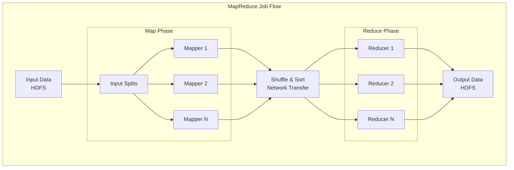
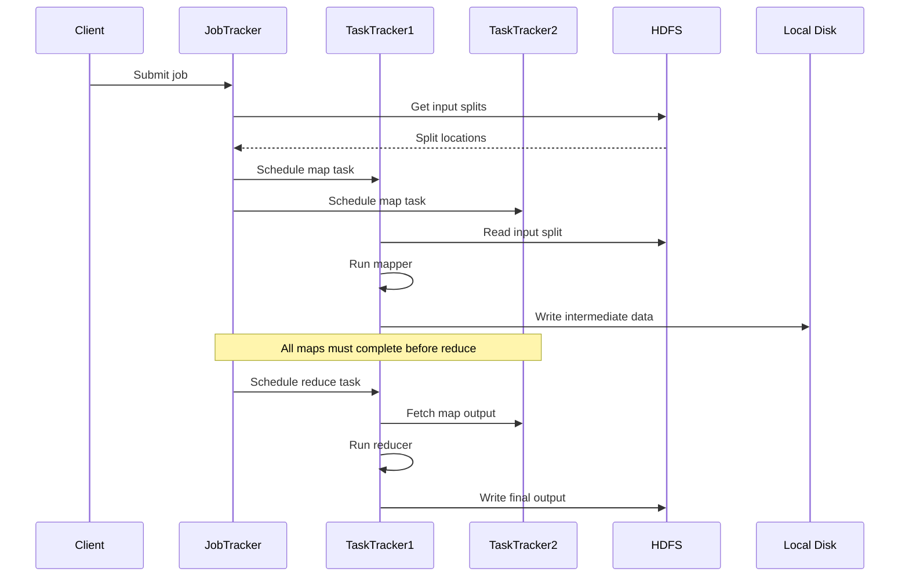
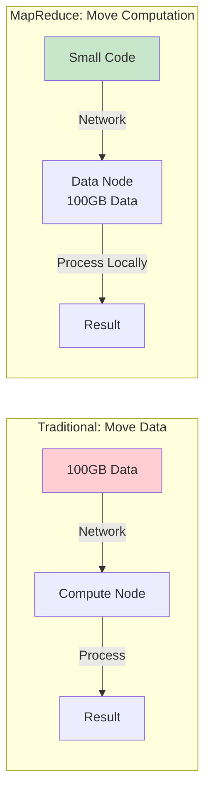
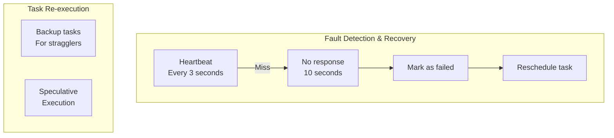
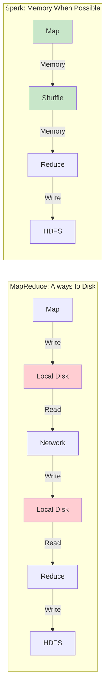
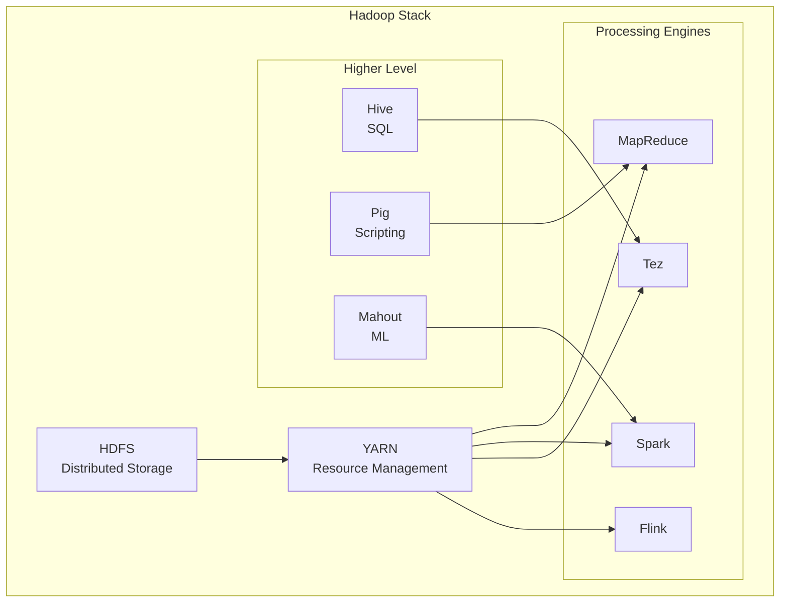

# MapReduce: Google's Distributed Computing Framework

!!! abstract "The MapReduce Story"
    **🎯 Single Achievement**: Made big data processing accessible
    **📊 Scale**: Google: 20PB+ daily across 10,000+ machines
    **⏱️ Performance**: Hours for web-scale processing
    **💡 Key Innovation**: Simple programming model hides complexity

!!! warning "Bronze Tier Status"
    MapReduce pioneered distributed data processing but has been superseded by frameworks like Spark that are 100x faster due to in-memory processing and richer APIs.

## Why MapReduce Mattered

| Before MapReduce | MapReduce Innovation | Business Impact |
|------------------|---------------------|------------------|
| **Complex distributed code** → bugs | **Simple map/reduce** → reliable | 90% fewer errors |
| **Manual fault handling** → failures | **Automatic recovery** → resilient | 99.9% completion |
| **Custom infrastructure** → expensive | **Commodity hardware** → scalable | 10x cost reduction |
| **Months to implement** → slow | **Days to deploy** → agile | 100x faster development |

## Architecture Overview



## Programming Model

### Classic Word Count Example

```java
// Mapper: Process input records
public class WordCountMapper 
    extends Mapper<LongWritable, Text, Text, IntWritable> {
    
    private final static IntWritable one = new IntWritable(1);
    private Text word = new Text();
    
    public void map(LongWritable key, Text value, Context context) {
        String line = value.toString();
        StringTokenizer tokenizer = new StringTokenizer(line);
        
        while (tokenizer.hasMoreTokens()) {
            word.set(tokenizer.nextToken());
            context.write(word, one);  // Emit (word, 1)
        }
    }
}

// Reducer: Aggregate values by key
public class WordCountReducer 
    extends Reducer<Text, IntWritable, Text, IntWritable> {
    
    public void reduce(Text key, Iterable<IntWritable> values, 
                      Context context) {
        int sum = 0;
        for (IntWritable val : values) {
            sum += val.get();
        }
        context.write(key, new IntWritable(sum));
    }
}
```

### Execution Flow



## Key Design Principles

### 1. Data Locality



### 2. Fault Tolerance



### 3. Shuffle Phase (The Bottleneck)

```mermaid
graph TB
    subgraph "Map Output"
        M1[Mapper 1<br/>(A,1) (B,1) (C,1)]
        M2[Mapper 2<br/>(B,1) (C,1) (D,1)]
        M3[Mapper 3<br/>(A,1) (C,1) (D,1)]
    end
    
    subgraph "Shuffle & Sort"
        PART[Partitioner<br/>Hash(key) % reducers]
        SORT[Sort by key]
        MERGE[Merge values]
    end
    
    subgraph "Reduce Input"
        R1[Reducer 1<br/>(A,[1,1])]
        R2[Reducer 2<br/>(B,[1,1]) (C,[1,1,1])]
        R3[Reducer 3<br/>(D,[1,1])]
    end
    
    M1 --> PART
    M2 --> PART
    M3 --> PART
    
    PART --> SORT
    SORT --> MERGE
    
    MERGE --> R1
    MERGE --> R2
    MERGE --> R3
```

## Real-World Applications at Google

### 1. Web Index Building

```java
// Simplified PageRank in MapReduce
// Mapper: Distribute rank to neighbors
map(String pageId, PageData page) {
    emit(pageId, 0.0);  // For existence
    
    int numLinks = page.outlinks.size();
    double rankContribution = page.rank / numLinks;
    
    for (String outlink : page.outlinks) {
        emit(outlink, rankContribution);
    }
}

// Reducer: Sum contributions
reduce(String pageId, Iterator<Double> contributions) {
    double newRank = 0.15;  // Damping factor
    
    for (Double contrib : contributions) {
        newRank += 0.85 * contrib;
    }
    
    emit(pageId, newRank);
}

// Note: Requires multiple iterations (MapReduce weakness)
```

### 2. Log Analysis

```python
# Analyze petabytes of logs
def mapper(line):
    # Parse Apache log
    ip, timestamp, url, status, size = parse_log(line)
    
    # Multiple analyses in one pass
    yield ("status:" + status, 1)  # Count by status
    yield ("hour:" + timestamp.hour, 1)  # Count by hour
    yield ("url:" + url, int(size))  # Bytes per URL

def reducer(key, values):
    if key.startswith("url:"):
        yield (key, sum(values))  # Total bytes
    else:
        yield (key, len(values))  # Count
```

## Limitations Leading to Deprecation

### 1. Disk I/O Overhead



### 2. Limited Programming Model

| Use Case | MapReduce | Modern Frameworks |
|----------|-----------|-------------------|
| **Iterative ML** | Multiple jobs, slow | Single job, fast |
| **Graph Processing** | Awkward fit | Native support |
| **Stream Processing** | Not supported | Native support |
| **Interactive Queries** | Hours | Seconds |
| **Complex DAGs** | Chain jobs manually | Automatic |

### 3. Performance Comparison

```python
# Iterative algorithm (e.g., K-means clustering)

# MapReduce: Each iteration is a full job
for i in range(10):
    # Map: Assign points to clusters (disk write)
    # Reduce: Compute new centers (disk write)
    # Total: 20 disk I/Os
    run_mapreduce_job()

# Spark: Cache in memory
points = spark.read.parquet("data").cache()
centers = initial_centers

for i in range(10):
    # Operations on cached data (memory)
    # Total: 2 disk I/Os (read + write)
    centers = points.map(assign_cluster)\
                   .reduceByKey(compute_center)\
                   .collect()
```

## Hadoop Ecosystem (MapReduce v2)



## Lessons Learned

### What MapReduce Got Right

1. **Simplicity**: Two functions handle complexity
2. **Fault Tolerance**: Automatic handling of failures
3. **Scalability**: Linear scaling to thousands of nodes
4. **Data Locality**: Computation moves to data
5. **Commodity Hardware**: No special requirements

### What Led to Its Decline

1. **Disk Bottleneck**: Every step writes to disk
2. **Latency**: Minutes to hours for simple queries
3. **Limited Model**: Only map and reduce
4. **No Iteration Support**: Painful for ML/Graph
5. **No Memory Utilization**: Wastes fast memory

## Migration to Modern Frameworks

### MapReduce to Spark Translation

```scala
// MapReduce style (multiple jobs)
val job1 = new Job()  // Word count
val job2 = new Job()  // Filter common words
val job3 = new Job()  // Sort by frequency

// Spark style (single job)
val wordCounts = textFile
  .flatMap(_.split(" "))
  .map((_, 1))
  .reduceByKey(_ + _)
  .filter(_._2 > 100)
  .sortBy(_._2, ascending = false)
  .collect()
```

## When MapReduce Still Makes Sense

✅ **Consider MapReduce**:
- Simple batch ETL
- One-pass transformations
- Existing Hadoop investment
- No iterative processing

❌ **Use Modern Alternatives**:
- Iterative algorithms
- Interactive analytics
- Stream processing
- Graph computations
- Machine learning

## Key Takeaways

!!! quote "Historical Impact"
    1. **Democratized Big Data**: Made it accessible to developers
    2. **Proved Commodity Scale**: 10,000+ node clusters work
    3. **Inspired Innovation**: Led to Spark, Flink, etc.
    4. **Established Patterns**: Fault tolerance, data locality
    5. **Showed Limitations**: Disk I/O kills performance

## Related Topics

- [Apache Spark](../../../apache-spark.md) - Next-generation replacement
- [Apache Flink](flink) - Stream-first processing
- [HDFS](hdfs.md) - Distributed file system
- [Distributed Computing](../pattern-library/distributed-computing) - Core concepts
- [Google File System](gfs.md) - Storage layer

## References

1. [MapReduce: Simplified Data Processing on Large Clusters](https://research.google/pubs/pub62/)
2. [Hadoop: The Definitive Guide](https://www.oreilly.com/library/view/hadoop-the-definitive/9781491901687/)
3. [The Google File System](https://research.google/pubs/pub51/)
4. [Resilient Distributed Datasets (Spark Paper)](https://www.usenix.org/system/files/conference/nsdi12/nsdi12-final138.pdf)
