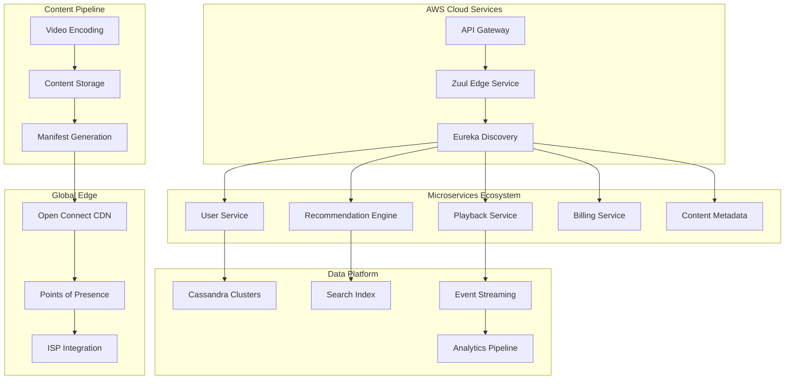
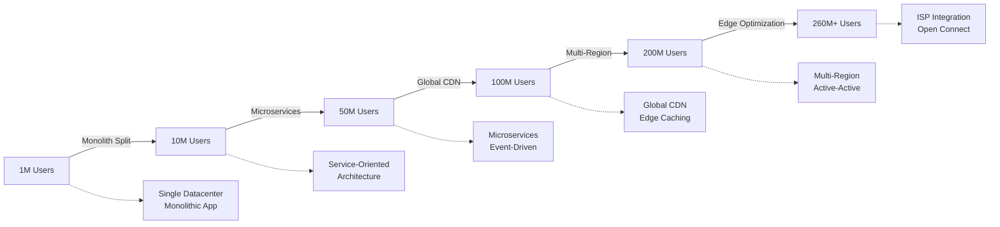
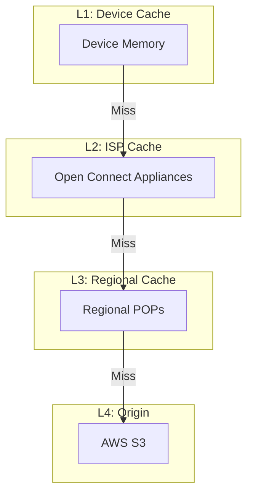

# Netflix Streaming: Scale and Architecture Deep Dive

## Table of Contents

- [Executive Summary](#executive-summary)
- [System Overview](#system-overview)
  - [Business Context](#business-context)
  - [High-Level Architecture](#high-level-architecture)
- [Mapping to Fundamental Laws](#mapping-to-fundamental-laws)
  - [Law Analysis](#law-analysis)
- [Design Deep Dive](#design-deep-dive)
  - [Data Architecture](#data-architecture)
  - [Scaling Strategy](#scaling-strategy)
- [Failure Scenarios & Lessons](#failure-scenarios-lessons)
  - [Circuit Breaker Pattern in Action](#circuit-breaker-pattern-in-action)
  - [Load Balancing at Scale](#load-balancing-at-scale)
- [Performance Characteristics](#performance-characteristics)
  - [Latency Breakdown](#latency-breakdown)
  - [Resource Utilization](#resource-utilization)
- [Operational Excellence](#operational-excellence)
  - [Monitoring & Observability](#monitoring-observability)
  - [Deployment Strategy](#deployment-strategy)
- [Caching Strategy Deep Dive](#caching-strategy-deep-dive)
  - [Cache Hierarchy](#cache-hierarchy)
- [Key Innovations](#key-innovations)
- [Pattern Excellence Analysis](#pattern-excellence-analysis)
  - [Gold Patterns in Production](#gold-patterns-in-production)
  - [Silver Patterns Supporting Scale](#silver-patterns-supporting-scale)
  - [Bronze Pattern Migration](#bronze-pattern-migration)
- [Takeaways for Your System](#takeaways-for-your-system)
- [Excellence Resources](#excellence-resources)
  - [Implementation Guides](#implementation-guides)
  - [Related Case Studies](#related-case-studies)
  - [Pattern Deep Dives](#pattern-deep-dives)
- [Further Reading](#further-reading)
- [Discussion Questions](#discussion-questions)


!!! success "Excellence Badge"
    🥇 **Gold Tier**: Battle-tested at internet scale with proven reliability

!!! abstract "Quick Facts"
| Metric | Value |
 |--------|-------|
 | **Scale** | 260+ million subscribers |
 | **Throughput** | 15% of global internet traffic |
 | **Data Volume** | 100+ petabytes of content |
 | **Availability** | 99.99% uptime globally |
 | **Team Size** | 2000+ engineers |


## Executive Summary

Netflix transformed from a DVD-by-mail service to the world's largest streaming platform through radical architectural decisions. By embracing microservices, chaos engineering, and cloud-native design, Netflix processes over 1 billion hours of content monthly while maintaining sub-second startup times. Their architecture demonstrates how to build systems that scale globally while remaining resilient to constant failures.

## System Overview

### Business Context

<div class="grid" markdown>
 <div class="card">
 <h3 class="card__title">Problem Space</h3>
 <p class="card__description">Stream high-quality video content to millions of concurrent users globally with minimal buffering</p>
 </div>
 <div class="card">
 <h3 class="card__title">Constraints</h3>
 <p class="card__description">Network variability, device diversity, content licensing restrictions, and massive scale requirements</p>
 </div>
 <div class="card">
 <h3 class="card__title">Success Metrics</h3>
 <p class="card__description">Sub-3 second video startup time, 99.99% availability, adaptive quality streaming</p>
 </div>
</div>

### High-Level Architecture



## Mapping to Fundamental Laws

### Law Analysis

<table class="responsive-table">
<thead>
 <tr>
 <th>Law</th>
 <th>Challenge</th>
 <th>Solution</th>
 <th>Trade-off</th>
 </tr>
</thead>
<tbody>
 <tr>
 <td data-label="Law">Correlated Failure</td>
 <td data-label="Challenge">AWS region outages affecting millions</td>
 <td data-label="Solution">Multi-region active-active, circuit breakers</td>
 <td data-label="Trade-off">3x infrastructure cost, complex orchestration</td>
 </tr>
 <tr>
 <td data-label="Law">Asynchronous Reality</td>
 <td data-label="Challenge">Global latency for video streaming</td>
 <td data-label="Solution">Open Connect CDN, edge caching, predictive pre-loading</td>
 <td data-label="Trade-off">Massive storage requirements at edge</td>
 </tr>
 <tr>
 <td data-label="Law">Emergent Chaos</td>
 <td data-label="Challenge">Millions of concurrent user interactions</td>
 <td data-label="Solution">Event-driven architecture, eventual consistency</td>
 <td data-label="Trade-off">Complex event ordering and duplicate handling</td>
 </tr>
 <tr>
 <td data-label="Law">Multidimensional Optimization</td>
 <td data-label="Challenge">Balance quality, cost, and performance</td>
 <td data-label="Solution">Adaptive bitrate streaming, chaos engineering</td>
 <td data-label="Trade-off">Increased complexity in client and infrastructure</td>
 </tr>
 <tr>
 <td data-label="Law">Distributed Knowledge</td>
 <td data-label="Challenge">Monitoring 700+ microservices</td>
 <td data-label="Solution">Atlas monitoring, distributed tracing, real-time dashboards</td>
 <td data-label="Trade-off">Significant monitoring infrastructure overhead</td>
 </tr>
 <tr>
 <td data-label="Law">Cognitive Load</td>
 <td data-label="Challenge">Managing complex microservices ecosystem</td>
 <td data-label="Solution">Service ownership, automated tooling, chaos engineering</td>
 <td data-label="Trade-off">Higher skill requirements for engineers</td>
 </tr>
 <tr>
 <td data-label="Law">Economic Reality</td>
 <td data-label="Challenge">Content delivery costs at global scale</td>
 <td data-label="Solution">ISP partnerships, intelligent caching, compression</td>
 <td data-label="Trade-off">Complex partnership negotiations and technical integration</td>
 </tr>
</tbody>
</table>

## Design Deep Dive

### Data Architecture

!!! tip "Key Design Decisions"
 1. **Microservices Architecture**: 700+ independent services with clear ownership boundaries
 2. **Event-Driven Design**: Kafka-based event streaming for loose coupling and scalability 
 3. **Polyglot Persistence**: Multiple databases optimized for specific use cases (Cassandra, DynamoDB, MySQL)
 4. **Content Delivery Network**: Open Connect CDN with 15,000+ servers in ISP locations globally

### Scaling Strategy



## Failure Scenarios & Lessons

!!! danger "Major Incident: Christmas Eve 2012 AWS Outage"
 **What Happened**: AWS ELB service outage in US-East-1 took down Netflix streaming for several hours on Christmas Eve, affecting millions of users during peak viewing time.

 **Root Cause**: 
 - Single point of failure in AWS Elastic Load Balancer service
 - Netflix's dependency on single-region architecture at the time
 - Insufficient circuit breakers between critical services

 **Impact**: 
 - 6+ hours of streaming outages
 - Millions of users affected during holiday peak
 - Significant revenue loss and customer dissatisfaction
 - Public relations impact during high-visibility period

 **Lessons Learned**:
 1. **Embrace failure**: Led to development of chaos engineering practices and Chaos Monkey
 2. **Multi-region architecture**: Accelerated move to active-active multi-region deployment
 3. **Circuit breaker patterns**: Implemented comprehensive failure isolation mechanisms

### Circuit Breaker Pattern in Action

!!! info "Pattern Deep Dive: [Circuit Breaker](../pattern-library/resilience/circuit-breaker.md)"
    Netflix's Hystrix framework implements circuit breakers at massive scale, handling 100B+ requests daily. When a service fails, the circuit breaker opens to prevent cascading failures, allowing the system to degrade gracefully.

```java
/ Hystrix Command Example
@HystrixCommand(
    fallbackMethod = "getDefaultRecommendations",
    commandProperties = {
        @HystrixProperty(name = "circuitBreaker.requestVolumeThreshold", value = "20"),
        @HystrixProperty(name = "circuitBreaker.errorThresholdPercentage", value = "50"),
        @HystrixProperty(name = "circuitBreaker.sleepWindowInMilliseconds", value = "5000")
    }
)
public List<Movie> getRecommendations(String userId) {
    return recommendationService.getForUser(userId);
}
```

### Load Balancing at Scale

!!! info "Pattern Deep Dive: [Load Balancing](../pattern-library/scaling/load-balancing.md)"
    Zuul gateway performs intelligent load balancing across microservices, using real-time metrics to route requests to healthy instances.

## Performance Characteristics

### Latency Breakdown

<div class="grid" markdown>
 <div class="card">
 <h3 class="card__title">Video Startup</h3>
 <div class="stat-number">2.5s</div>
 </div>
 <div class="card">
 <h3 class="card__title">API Response</h3>
 <div class="stat-number">50ms</div>
 </div>
 <div class="card">
 <h3 class="card__title">Search Results</h3>
 <div class="stat-number">200ms</div>
 </div>
</div>

### Resource Utilization

| Resource | Usage | Efficiency |
|----------|-------|------------|
| CDN Storage | 100+ PB | High hit ratio (95%+) |
| AWS Compute | 50,000+ instances | Auto-scaling based on demand |
| Network | 15% global traffic | Optimized through ISP partnerships |
| Content Processing | 1000s of hours/day | Parallel encoding pipelines |


## Operational Excellence

### Monitoring & Observability

- **Metrics**: Atlas time-series database with 2+ billion metrics per minute
- **Logging**: Centralized logging with real-time processing and alerting
- **Tracing**: Distributed tracing across microservices for performance analysis
- **Alerting**: SLO-based alerting with automated incident response

### Deployment Strategy

!!! note
 **Deployment Frequency**: 4000+ deployments per day across all services
 **Rollout Strategy**: Canary deployments with automated rollback based on key metrics
 **Rollback Time**: < 10 minutes for critical services with automated rollback triggers
 **Feature Flags**: Extensive use for A/B testing and gradual feature rollouts

## Caching Strategy Deep Dive

!!! info "Pattern Deep Dive: [Caching Strategies](../pattern-library/scaling/caching-strategies.md)"
    Netflix's Open Connect CDN implements multi-level caching with 15,000+ edge servers globally, achieving 95%+ cache hit rates and reducing backbone traffic significantly.

### Cache Hierarchy



## Key Innovations

1. **Chaos Engineering**: Pioneered systematic failure injection to build resilient systems
2. **Microservices at Scale**: Demonstrated how to successfully operate 700+ microservices
3. **Adaptive Streaming**: Dynamic quality adjustment based on network conditions and device capabilities

## Pattern Excellence Analysis

### Gold Patterns in Production

<div class="grid cards" markdown>

- :material-shield-check:{ .lg .middle } **[Circuit Breaker](../pattern-library/resilience/circuit-breaker/)** 🥇
    
    ---
    
    **Netflix Scale**: 100B+ requests/day protected by Hystrix
    
    **Implementation**: Every microservice call wrapped with circuit breaker, 50ms timeout default
    
    **Success Metric**: 99.99% availability despite frequent AWS issues

- :material-database-arrow-right:{ .lg .middle } **[Event Sourcing](../pattern-library/data-management/event-sourcing/)** 🥇
    
    ---
    
    **Netflix Scale**: Complete viewing history for 260M+ users
    
    **Implementation**: Every play, pause, seek as immutable events
    
    **Success Metric**: Enable time-travel debugging and ML training

- :material-call-split:{ .lg .middle } **[CQRS](../pattern-library/data-management/cqrs/)** 🥇
    
    ---
    
    **Netflix Scale**: Separate paths for 1M+ writes/sec and 10M+ reads/sec
    
    **Implementation**: Write to Cassandra, read from ElasticSearch
    
    **Success Metric**: 50ms p99 read latency at scale

- :material-layers-triple:{ .lg .middle } **[Multi-Level Cache](../pattern-library/scaling/caching-strategies/)** 🥇
    
    ---
    
    **Netflix Scale**: 15,000+ edge servers, 100PB+ content
    
    **Implementation**: Open Connect CDN with ISP integration
    
    **Success Metric**: 95%+ cache hit rate globally

</div>

### Silver Patterns Supporting Scale

<div class="grid cards" markdown>

- :material-lan:{ .lg .middle } **[Service Mesh](../pattern-library/communication/service-mesh/)** 🥈
    
    ---
    
    **Implementation**: Zuul for edge routing, Eureka for discovery
    
    **Trade-off**: Added complexity for better observability

- :material-ferry:{ .lg .middle } **[Bulkhead](../pattern-library/resilience/bulkhead/)** 🥈
    
    ---
    
    **Implementation**: Isolated thread pools prevent resource exhaustion
    
    **Trade-off**: Higher memory usage for isolation

- :material-message-arrow-right:{ .lg .middle } **[Async Messaging](../pattern-library/async-messaging.md/)** 🥈
    
    ---
    
    **Implementation**: Kafka handles 1T+ messages/day
    
    **Trade-off**: Eventual consistency for real-time processing

</div>

### Bronze Pattern Migration

<div class="migration-box">
<h4>⚡ From Monolith to Microservices</h4>

Netflix started with a monolith and migrated to microservices over 3 years:

1. **2008**: Monolithic Java application
2. **2009**: Database issues force service extraction
3. **2010**: Move to AWS begins
4. **2011**: Full microservices architecture

**Key Learning**: Start simple, evolve when needed. The monolith served them well until scale demanded change.

[View Migration Playbook →](../architects-handbook/implementation-playbooks/migrations/monolith-to-microservices/)
</div>

## Takeaways for Your System

!!! quote "Key Lessons"
 1. **When to apply**: Microservices work well for large teams with clear service boundaries and independent deployment needs
 2. **When to avoid**: Don't start with microservices - begin with monolith and split when team size and complexity demand it
 3. **Cost considerations**: Expect 2-3x operational overhead but gain in development velocity and system resilience
 4. **Team requirements**: Need DevOps expertise, monitoring infrastructure, and culture that embraces failure

## Excellence Resources

### Implementation Guides
- [Resilience First Architecture](../architects-handbook/implementation-playbooks/implementation-guides/resilience-first/) - Netflix's approach to building resilient systems
- [Platform Engineering Playbook](../architects-handbook/implementation-playbooks/implementation-guides/platform-engineering-playbook/) - How Netflix built their platform
- [Data Consistency at Scale](../architects-handbook/implementation-playbooks/implementation-guides/data-consistency/) - Managing eventual consistency

### Related Case Studies
- [YouTube: Video at Scale](../youtube.md) - Compare with YouTube's architecture
- [Spotify: Music Streaming](../architects-handbook/case-studies/search-analytics/spotify-recommendations.md) - Similar challenges, different domain
- [Disney+: Launch at Scale](video-streaming.md) - Learning from Netflix's playbook

### Pattern Deep Dives
- [Circuit Breaker Pattern](../pattern-library/resilience/circuit-breaker/) - Detailed implementation guide
- [Chaos Engineering Pattern](../pattern-library/chaos-engineering.md/) - How to implement chaos testing
- [Event Sourcing Pattern](../pattern-library/data-management/event-sourcing/) - Building event-driven systems

## Further Reading

- [Netflix Technology Blog](https://netflixtechblog.com/)
- [Chaos Engineering: Building Confidence in System Behavior](https://www.oreilly.com/library/view/chaos-engineering/9781491988459/)
- [Microservices at Netflix Scale](https://www.infoq.com/presentations/netflix-microservices-architecture/)
- [Open Connect: Netflix's Content Delivery Network](https://openconnect.netflix.com/en/)

## Discussion Questions

1. How would Netflix's architecture change if they had to guarantee strong consistency for user viewing history?
2. What are the trade-offs between Netflix's microservices approach vs. a more monolithic architecture?
3. How does chaos engineering philosophy impact team culture and development practices?
4. Could Netflix's Open Connect CDN model work for other types of content beyond video streaming?