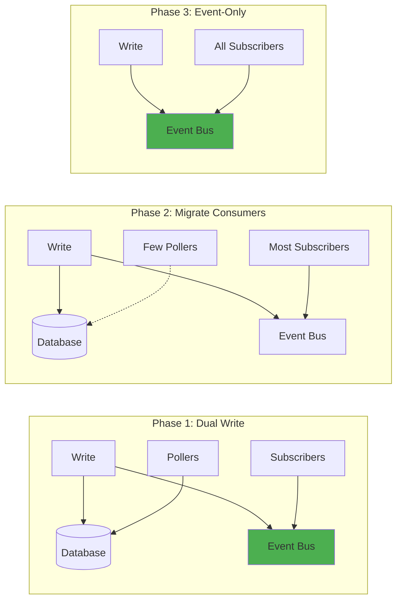

# Migration: From Polling to Event-Driven Architecture

!!! warning "Excellence Badge"
    🥉 **Bronze Tier**: Legacy pattern - migrate to modern alternatives

!!! danger "Deprecation Notice"
    Polling is an anti-pattern in modern distributed systems. This case study documents migration strategies to event-driven architectures.

!!! abstract "Migration Impact"
    | Metric | Before (Polling) | After (Events) | Improvement |
    |--------|------------------|----------------|-------------|
    | **Latency** | 30-60 seconds | 50-500ms | 100x faster |
    | **Resource Usage** | 100 servers | 20 servers | 80% reduction |
    | **Cost** | $50K/month | $20K/month | 60% savings |
    | **Complexity** | Simple | Complex | 3x increase |

## Executive Summary

Many legacy systems rely on polling—repeatedly checking for changes—which wastes resources and introduces delays. This case study examines common migration patterns from polling to event-driven architectures, including pitfalls encountered and lessons learned from real-world migrations.

## The Polling Problem

### Why Polling Doesn't Scale

```mermaid
graph TB
    subgraph "Polling Architecture"
        C1[Client 1] -->|Poll every 30s| API
        C2[Client 2] -->|Poll every 30s| API
        C3[Client N] -->|Poll every 30s| API
        
        API --> DB[(Database)]
        
        API -->|99% "No changes"| C1
        API -->|99% "No changes"| C2
        API -->|99% "No changes"| C3
    end
    
    subgraph "Problems"
        P1[Wasted Resources: 99% useless queries]
        P2[High Latency: Up to poll interval]
        P3[Database Load: N clients × frequency]
        P4[Thundering Herd: Synchronized polls]
    end
    
    style P1 fill:#f44336
    style P2 fill:#f44336
    style P3 fill:#f44336
```

### Real-World Polling Scenarios

| System | Poll Frequency | Waste | Latency | Monthly Cost |
|--------|----------------|-------|---------|---------------|
| **Order Status** | Every 10s | 99.9% | 0-10s | $5,000 |
| **Inventory Sync** | Every 1m | 98% | 0-60s | $3,000 |
| **Price Updates** | Every 5m | 95% | 0-5m | $2,000 |
| **Report Generation** | Every 1h | 90% | 0-1h | $1,000 |

## Migration Strategies

### Strategy 1: Dual-Write Transition



### Strategy 2: Strangler Fig Pattern

```python
class StranglerFigMigration:
    def __init__(self):
        self.polling_clients = set(ALL_CLIENTS)
        self.event_clients = set()
        self.event_bus = EventBus()
    
    def process_update(self, data):
        # Always write to database (legacy)
        self.db.update(data)
        
        # Always publish event (new)
        event = self.create_event(data)
        self.event_bus.publish(event)
        
        # Gradually migrate clients
        self.migrate_next_batch()
    
    def get_updates(self, client_id):
        if client_id in self.event_clients:
            # New path: event-driven
            return {"status": "subscribed_to_events"}
        else:
            # Legacy path: polling
            return self.db.get_changes_since(client_id.last_poll)
    
    def migrate_next_batch(self):
        # Migrate 10% of remaining polling clients
        batch_size = max(1, len(self.polling_clients) // 10)
        batch = random.sample(self.polling_clients, batch_size)
        
        for client in batch:
            self.polling_clients.remove(client)
            self.event_clients.add(client)
            self.notify_client_of_migration(client)
```

## Common Migration Patterns

### Pattern 1: Webhook-Based Events

=== "Before: Polling"
    ```python
    # Client code - runs every 30 seconds
    def poll_for_orders():
        response = requests.get(
            "https://api.example.com/orders",
            params={"since": last_poll_time}
        )
        
        if response.json()["orders"]:
            process_orders(response.json()["orders"])
        
        last_poll_time = datetime.now()
    ```

=== "After: Webhooks"
    ```python
    # Server code - sends events
    def create_order(order_data):
        order = save_order(order_data)
        
        # Send webhook
        webhook_event = {
            "event_type": "order.created",
            "order": order.to_dict(),
            "timestamp": datetime.now().isoformat()
        }
        
        send_webhook(customer.webhook_url, webhook_event)
    
    # Client code - receives events
    @app.post("/webhook")
    def handle_webhook(event):
        if event["event_type"] == "order.created":
            process_order(event["order"])
    ```

### Pattern 2: Event Streaming

=== "Before: Batch Polling"
    ```python
    # Polls database for all changes
    def batch_sync():
        changes = db.query("""
            SELECT * FROM inventory
            WHERE updated_at > %s
        """, last_sync_time)
        
        for change in changes:
            update_downstream_system(change)
    ```

=== "After: Event Stream"
    ```python
    # Publishes events on change
    def update_inventory(item_id, quantity):
        # Update database
        db.update_inventory(item_id, quantity)
        
        # Publish event
        event = {
            "event_id": str(uuid.uuid4()),
            "event_type": "inventory.updated",
            "item_id": item_id,
            "quantity": quantity,
            "timestamp": time.time()
        }
        
        kafka_producer.send("inventory-events", event)
    
    # Consumes events
    def consume_inventory_events():
        for message in kafka_consumer:
            event = message.value
            update_downstream_system(event)
    ```

## Migration Challenges

### Challenge 1: Event Ordering

**Problem**: Events arrive out of order

```python
class EventOrderingHandler:
    def __init__(self):
        self.event_buffer = defaultdict(list)
        self.watermarks = {}
    
    def handle_event(self, event):
        partition_key = event["entity_id"]
        
        # Buffer events
        self.event_buffer[partition_key].append(event)
        
        # Sort by timestamp
        self.event_buffer[partition_key].sort(
            key=lambda e: e["timestamp"]
        )
        
        # Process in order
        self.process_buffered_events(partition_key)
```

### Challenge 2: Duplicate Events

**Problem**: Network issues cause duplicate delivery

```python
class IdempotencyHandler:
    def __init__(self):
        self.processed_events = TTLCache(maxsize=10000, ttl=3600)
    
    def handle_event(self, event):
        event_id = event["event_id"]
        
        # Check if already processed
        if event_id in self.processed_events:
            logger.info(f"Skipping duplicate event: {event_id}")
            return
        
        # Process event
        self.process_event(event)
        
        # Mark as processed
        self.processed_events[event_id] = True
```

### Challenge 3: Missed Events

**Problem**: Client was offline and missed events

```python
class EventRecovery:
    def __init__(self):
        self.event_store = EventStore()
    
    def get_missed_events(self, client_id, last_event_id):
        # Get all events after last processed
        missed_events = self.event_store.get_events_after(
            client_id=client_id,
            after_event_id=last_event_id,
            limit=1000
        )
        
        return missed_events
    
    def replay_events(self, client_id, from_timestamp):
        # Replay historical events
        events = self.event_store.get_events_since(
            timestamp=from_timestamp
        )
        
        for event in events:
            self.send_event_to_client(client_id, event)
```

## Migration Checklist

### Pre-Migration

- [ ] **Analyze polling patterns**
  - Frequency of polls
  - Percentage of empty responses
  - Resource consumption

- [ ] **Choose event delivery mechanism**
  - Webhooks for external clients
  - Message queue for internal
  - Event stream for high volume

- [ ] **Design event schema**
  - Event types and payloads
  - Versioning strategy
  - Backward compatibility

### During Migration

- [ ] **Implement dual-write**
  - Keep polling working
  - Start publishing events
  - Monitor both paths

- [ ] **Gradual client migration**
  - Start with non-critical clients
  - Monitor error rates
  - Have rollback ready

- [ ] **Handle edge cases**
  - Event ordering
  - Duplicate delivery
  - Missed events

### Post-Migration

- [ ] **Decommission polling**
  - Monitor for stragglers
  - Remove polling code
  - Clean up resources

- [ ] **Optimize event system**
  - Tune delivery guarantees
  - Optimize batching
  - Monitor costs

## Cost-Benefit Analysis

### Polling Costs (Monthly)

```python
# Example: Order status polling
polling_clients = 10000
polls_per_client_per_day = 8640  # Every 10 seconds
api_calls_per_month = polling_clients * polls_per_client_per_day * 30
# = 2.592 billion API calls/month

cost_per_1000_calls = 0.004  # $0.004 per 1000 API calls
api_cost = (api_calls_per_month / 1000) * cost_per_1000_calls
# = $10,368/month just for API calls

db_cost = 5000  # Database load from polling
server_cost = 10000  # Servers to handle polling

total_polling_cost = api_cost + db_cost + server_cost
# = $25,368/month
```

### Event-Driven Costs (Monthly)

```python
# Event-driven replacement
events_per_month = 1000000  # Only actual changes
event_delivery_cost = events_per_month * 0.00001  # $0.01 per 1000 events
# = $10/month for event delivery

streaming_infrastructure = 5000  # Kafka/webhooks
reduced_server_cost = 2000  # Fewer servers needed

total_event_cost = event_delivery_cost + streaming_infrastructure + reduced_server_cost
# = $7,010/month

# Savings: $18,358/month (72% reduction)
```

## Lessons Learned

### What Worked

✅ **Success Factors**
- Gradual migration reduced risk
- Dual-write period caught issues early
- Event replay capability saved the day
- Monitoring was crucial

### What Failed

❌ **Common Mistakes**
- Underestimating event ordering complexity
- Not planning for offline clients
- Assuming exactly-once delivery
- Big-bang migrations always fail

### Key Takeaways

!!! tip "Migration Best Practices"
    1. **Never trust the network** - Build for failures
    2. **Events can arrive multiple times** - Make idempotent
    3. **Order isn't guaranteed** - Design accordingly
    4. **Keep polling as fallback** - During transition
    5. **Monitor everything** - Both old and new paths

## Modern Alternatives Comparison

| Pattern | Use Case | Pros | Cons |
|---------|----------|------|------|
| **Webhooks** | B2B integrations | Simple, standard | Delivery challenges |
| **WebSockets** | Real-time UI | Bidirectional | Stateful connections |
| **Event Streams** | High volume | Durable, scalable | Complex infrastructure |
| **SSE** | Browser updates | Simple, HTTP-based | Unidirectional only |

## Related Resources

- [Event-Driven Architecture Pattern](../pattern-library/architecture/event-driven.md)
- [Webhook Pattern](../pattern-library/webhook.md)
- [Migration Best Practices](../excellence/migration-guide.md)
- [Anti-Patterns Guide](../reference/anti-patterns.md)

---

*"The best time to stop polling was yesterday. The second best time is now." - Every SRE*