# Design a Metrics Monitoring and Alerting System

!!! example "Excellence Badge"
    🥈 **Silver Tier**: Proven at enterprise scale with solid architectural choices

!!! info "Case Study Overview"
    **System**: Prometheus / Datadog  
    **Scale**: 10M+ metrics/second, 100K+ hosts monitored  
    **Challenges**: High cardinality, efficient storage, fast queries, real-time alerting  
    **Key Patterns**: Time series compression, downsampling, federation, push vs pull

*Estimated reading time: 25 minutes*

## Introduction

Modern distributed systems generate millions of metrics per second. A robust monitoring system must collect, store, and query these metrics efficiently while providing real-time alerting capabilities. This case study explores building a system that can handle the scale of companies like Netflix (2.5 billion time series) or Uber (500 billion metrics/day).

## Challenge Statement

Design a metrics monitoring and alerting system that can:
- Ingest 10M+ metrics per second from 100K+ hosts
- Store months of historical data efficiently
- Query across billions of data points in <1 second
- Support flexible alerting rules with <1 minute detection
- Handle high-cardinality metrics (millions of unique series)
- Scale horizontally for both ingestion and queries
- Provide 99.9% availability for critical alerts

## Architecture Evolution

### Phase 1: Monolithic Monitoring (Early Days)


**Limitations**:
- Single point of failure
- Limited by single server capacity
- No horizontal scaling

### Phase 2: Distributed Architecture (Current)


## Concept Map

```mermaid
graph TD
    MM[Metrics Monitoring]
    
    MM --> A1[Law 2: Asynchronous Reality ⏳]
    MM --> A2[Law 4: Trade-offs ⚖️]
    MM --> A3[Law 1: Failure ⛓️]
    MM --> A4[Law 3: Emergence 🌪️]
    MM --> A6[Law 5: Epistemology 🧠]
    
    A1 --> L1[In-memory Aggregation]
    A1 --> L2[Index Optimization]
    A1 --> L3[Query Caching]
    
    A2 --> C1[Compression]
    A2 --> C2[Downsampling]
    A2 --> C3[Retention Policies]
    
    A3 --> F1[Replication]
    A3 --> F2[Federation]
    A3 --> F3[Graceful Degradation]
    
    A4 --> CO1[Eventual Consistency]
    A4 --> CO2[Time Sync]
    A4 --> CO3[Deduplication]
    
    A6 --> O1[Self-Monitoring]
    A6 --> O2[Meta-Metrics]
    A6 --> O3[Audit Logs]
```



## Key Design Decisions

### 1. Data Model

**Time Series Structure**:
```
Metric: http_requests_total
Labels: {method="GET", endpoint="/api/users", status="200", region="us-east"}
Samples: [(t1, v1), (t2, v2), (t3, v3), ...]

Series Identifier = hash(metric_name + sorted(labels))
```

**Why Time Series**:
- Natural fit for metrics (value over time)
- Efficient compression (similar values)
- Fast range queries
- Easy aggregation

### 2. Collection Strategy

**Pull vs Push**:

| Approach | Pros | Cons |
|----------|------|------|
| Pull (Prometheus) | Service discovery, up/down detection, controlled load | Firewall complexity, scaling challenges |
| Push (Datadog) | Works across networks, simpler scaling | No automatic up/down, potential overload |


**Hybrid Solution**:
```yaml
## Pull for internal services
scrape_configs:
  - job_name: 'kubernetes-pods'
    kubernetes_sd_configs:
      - role: pod
    relabel_configs:
      - source_labels: [__meta_kubernetes_pod_annotation_prometheus_io_scrape]
        action: keep
        regex: true

## Push gateway for short-lived jobs
push_gateway:
  endpoint: https://pushgateway.monitoring.svc:9091
  batch_size: 1000
  flush_interval: 10s
```

### 3. Storage Architecture

**Two-Level Storage**:
```
Recent Data (Hot Storage):
- In-memory for last 2 hours
- SSD for last 24 hours
- Optimized for writes and recent queries

Historical Data (Cold Storage):
- Object storage (S3)
- Compressed blocks
- Optimized for storage efficiency
```

**Compression Techniques**:
```go
/ Delta-of-delta encoding for timestamps
func compressTimestamps(timestamps []int64) []byte {
    if len(timestamps) == 0 {
        return nil
    }
    
    buffer := new(bytes.Buffer)
    prev := timestamps[0]
    prevDelta := int64(0)
    
    writeVarInt(buffer, prev) / First timestamp
    
    for i := 1; i < len(timestamps); i++ {
        delta := timestamps[i] - prev
        deltaDelta := delta - prevDelta
        
        writeVarInt(buffer, deltaDelta)
        
        prev = timestamps[i]
        prevDelta = delta
    }
    
    return buffer.Bytes()
}

/ XOR encoding for float values
func compressValues(values []float64) []byte {
    / Similar approach with XOR compression
    / Achieves 1.37 bytes/sample average
}
```

### 4. Query Engine

**Query Optimization**:
```sql
-- Original query
SELECT avg(cpu_usage) 
FROM metrics 
WHERE host =~ 'web-.*' 
  AND time > now() - 1h
GROUP BY time(1m)

-- Optimized execution plan
1. Use inverted index to find series matching host pattern
2. Read only required chunks from disk (1 hour of data)
3. Decompress chunks in parallel
4. Apply aggregation using vectorized operations
5. Cache results for repeated queries
```

**Distributed Query Execution**:


## Technical Deep Dives

### High Cardinality Handling

**Problem**: Millions of unique label combinations
```
## Explosion example
metrics = 1000
services = 100
endpoints = 50
regions = 10
status_codes = 5

Total series = 1000 * 100 * 50 * 10 * 5 = 250M series
```

**Solutions**:

1. **Adaptive Sampling**:
```python
def should_sample(series_id, cardinality):
    if cardinality < 1_000_000:
        return True  # Keep all low-cardinality series
    
## Progressively sample high-cardinality series
    sample_rate = 1_000_000 / cardinality
    return random.random() < sample_rate
```

2. **Label Limits**:
```yaml
## Enforce limits
global:
  max_samples_per_send: 10000
  max_series_per_metric: 100000
  max_label_names_per_series: 30
  max_label_value_length: 200
```

3. **Cardinality Analysis**:
```sql
-- Find high-cardinality metrics
SELECT 
    metric_name,
    COUNT(DISTINCT label_set) as cardinality,
    SUM(sample_count) as total_samples
FROM metric_metadata
GROUP BY metric_name
ORDER BY cardinality DESC
LIMIT 20;
```

### Real-time Alerting

**Alert Rule Evaluation**:
```yaml
groups:
  - name: example
    interval: 30s
    rules:
      - alert: HighRequestLatency
        expr: |
          histogram_quantile(0.95,
            sum(rate(http_request_duration_seconds_bucket[5m])) 
            by (job, le)
          ) > 0.5
        for: 10m
        labels:
          severity: warning
        annotations:
          summary: High request latency on {{ '{{' }} $labels.job {{ '}}' }}
          description: "95th percentile latency is {{ '{{' }} $value {{ '}}' }}s"
```

**Alert Pipeline**:


### Federation and Global View

**Hierarchical Federation**:
```
Global Level (Cross-Region):
  ├── Regional Level (US-East)
  │   ├── Cluster Level (Prod-1)
  │   │   └── Local Prometheus (1000 targets)
  │   └── Cluster Level (Prod-2)
  │       └── Local Prometheus (1000 targets)
  └── Regional Level (EU-West)
      └── Cluster Level (Prod-3)
          └── Local Prometheus (1000 targets)
```

**Recording Rules for Aggregation**:
```yaml
## Pre-compute expensive queries at lower levels
groups:
  - name: aggregations
    interval: 30s
    rules:
## Service-level aggregation
      - record: service:http_requests:rate5m
        expr: |
          sum by (service, method, status) (
            rate(http_requests_total[5m])
          )
      
## Regional rollup
      - record: region:service:http_requests:rate5m
        expr: |
          sum by (region, service) (
            service:http_requests:rate5m
          )
```

## Performance Optimization

### Ingestion Pipeline

```go
type IngestionPipeline struct {
    batches chan *MetricBatch
    workers int
}

func (p *IngestionPipeline) Process() {
    / Stage 1: Batching
    batcher := NewBatcher(batchSize=10000, timeout=100ms)
    
    / Stage 2: Validation
    validator := NewValidator()
    
    / Stage 3: Deduplication
    deduper := NewDeduper(window=30s)
    
    / Stage 4: Compression
    compressor := NewCompressor()
    
    / Stage 5: Sharding
    sharder := NewSharder(shards=64)
    
    / Pipeline execution
    for batch := range p.batches {
        batch = batcher.Process(batch)
        batch = validator.Process(batch)
        batch = deduper.Process(batch)
        batch = compressor.Process(batch)
        
        shard := sharder.GetShard(batch)
        shard.Write(batch)
    }
}
```

### Query Performance

**Index Structure**:
```
Inverted Index:
  "region=us-east" -> [series1, series2, series3, ...]
  "service=api" -> [series2, series4, series5, ...]
  
Posting Lists with Bitmaps:
  series1: bitmap[1,0,1,1,0,0,1,...]  / 1 = has data in chunk
  
Time-based Partitioning:
  /data/2024/01/15/chunk_0001.tsm
  /data/2024/01/15/chunk_0002.tsm
```

**Query Execution Stats**:
| Query Type | Data Points | Response Time | Memory Used |
|------------|-------------|---------------|-------------|
| Instant query | 10K | 50ms | 100MB |
| 1-hour range | 1M | 200ms | 500MB |
| 1-day aggregation | 100M | 1.2s | 2GB |
| 30-day histogram | 1B | 5s | 8GB |


## Operational Considerations

### Capacity Planning

```python
def calculate_storage_requirements(
    metrics_per_second=1_000_000,
    bytes_per_sample=16,  # timestamp + value + overhead
    retention_days=30,
    replication_factor=3,
    compression_ratio=0.15  # 85% compression
):
    daily_ingestion = metrics_per_second * 86400 * bytes_per_sample
    total_storage = daily_ingestion * retention_days * replication_factor
    compressed_storage = total_storage * compression_ratio
    
    return {
        "daily_ingestion_GB": daily_ingestion / 1e9,
        "total_storage_TB": compressed_storage / 1e12,
        "monthly_cost_usd": (compressed_storage / 1e12) * 23  # S3 pricing
    }

## Example: 1M metrics/sec = 3.7 TB/day raw, 16.6 TB total compressed
```

### Monitoring the Monitor

**Self-Metrics**:
```
prometheus_tsdb_head_samples_appended_total
prometheus_tsdb_compaction_duration_seconds
prometheus_rule_evaluation_duration_seconds
prometheus_http_request_duration_seconds
prometheus_engine_query_duration_seconds
```

**SLO Definition**:
```yaml
slos:
  - name: ingestion_availability
    target: 99.9%
    indicator: |
      sum(rate(prometheus_tsdb_head_samples_appended_total[5m])) 
      / 
      sum(rate(expected_samples_total[5m]))
  
  - name: query_latency
    target: 95% < 1s
    indicator: |
      histogram_quantile(0.95,
        prometheus_http_request_duration_seconds_bucket{handler="/api/v1/query"}
      )
```

## Failure Scenarios

### 1. Storage Node Failure
```
Impact: Loss of recent data (last 2 hours)
Mitigation: 
- 3x replication across nodes
- Automatic failover to replica
- Replay from Write-Ahead Log (WAL)
```

### 2. Query Overload
```
Symptoms: 
- Query latency spikes
- Memory exhaustion
- CPU throttling

Mitigation:
- Query result caching
- Resource limits per query
- Automatic query killing
- Read replicas for scaling
```

### 3. High Cardinality Explosion
```
Detection:
- Series count growing exponentially
- Memory usage increasing rapidly
- Ingestion slowing down

Response:
- Enforce cardinality limits
- Drop high-cardinality metrics
- Alert on cardinality growth
- Implement sampling
```

## Lessons Learned

### 1. Cardinality is the Silent Killer
- Monitor cardinality growth continuously
- Implement limits before it's too late
- Educate developers on label best practices

### 2. Pre-aggregation is Essential
- Recording rules reduce query load by 90%
- Trade storage for query performance
- Aggregate at ingestion time when possible

### 3. Pull vs Push: Context Matters
- Pull works great for internal infrastructure
- Push necessary for ephemeral workloads
- Hybrid approach provides flexibility

### 4. Compression is Not Optional
- 85-95% compression is achievable
- Custom compression beats general-purpose
- Compress early in the pipeline

### 5. Federation Requires Planning
- Design hierarchy from day one
- Use recording rules for efficiency
- Consider network topology

## Trade-offs and Decisions

| Decision | Trade-off | Why This Choice |
|----------|-----------|-----------------|
| Pull-based collection | Complexity vs control | Better service discovery and health detection |
| 15-second scrape interval | Granularity vs volume | Balance between detail and storage |
| 30-day retention | Cost vs history | Most queries are for recent data |
| Eventual consistency | Accuracy vs availability | Monitoring can tolerate small delays |
| Fixed schema | Flexibility vs performance | Optimized storage and queries |


## References

- [Prometheus: Up & Running](https://www.oreilly.com/library/view/prometheus-up/9781492034131/)
- [Facebook's Gorilla: A Fast, Scalable, In-Memory Time Series Database](https://www.vldb.org/pvldb/vol8/p1816-teller.pdf/)
- [M3: Uber's Open Source, Large-scale Metrics Platform](https://eng.uber.com/m3/)
- [The Evolution of Monitoring at Google](https://sre.google/sre-book/monitoring-distributed-systems/)