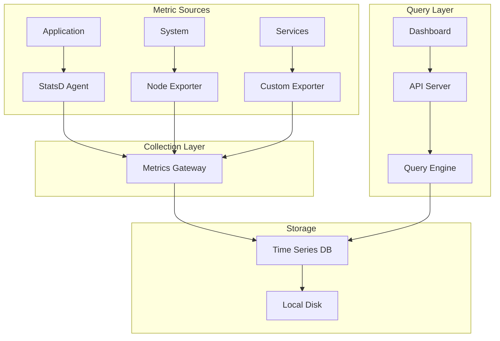
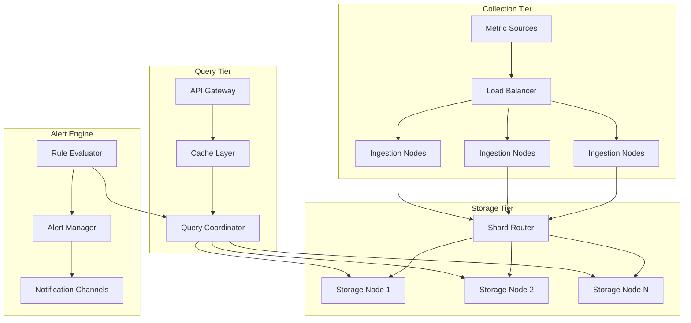
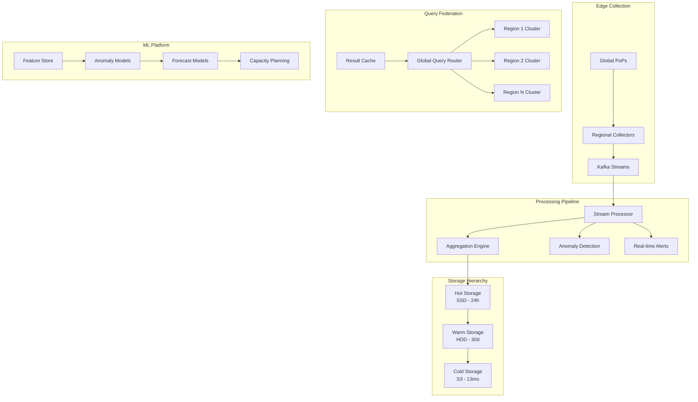

# Metrics Monitoring System - System Design Case Study

## Table of Contents

- [1. Problem Statement](#1-problem-statement)
  - [Real-World Context](#real-world-context)
- [2. Requirements Analysis](#2-requirements-analysis)
  - [Functional Requirements](#functional-requirements)
  - [Non-Functional Requirements](#non-functional-requirements)
  - [Law Mapping](#law-mapping)
- [3. Architecture Evolution](#3-architecture-evolution)
  - [Stage 1: Basic Monitoring (10K metrics/sec)](#stage-1-basic-monitoring-10k-metricssec)
  - [Stage 2: Distributed Architecture (1M metrics/sec)](#stage-2-distributed-architecture-1m-metricssec)
  - [Stage 3: Global Scale Architecture (10M+ metrics/sec)](#stage-3-global-scale-architecture-10m-metricssec)
- [4. Detailed Component Design](#4-detailed-component-design)
  - [4.1 Time Series Storage Engine](#41-time-series-storage-engine)
- [Delta of delta encoding for timestamps](#delta-of-delta-encoding-for-timestamps)
- [XOR encoding for floating point values](#xor-encoding-for-floating-point-values)
- [Convert to byte arrays](#convert-to-byte-arrays)
- [Combine and compress with Zstandard](#combine-and-compress-with-zstandard)
- [Variable byte encoding](#variable-byte-encoding)
- [First value stored as-is](#first-value-stored-as-is)
- [XOR'd values with leading/trailing zero compression](#xord-values-with-leadingtrailing-zero-compression)
- [Control bits for compression type](#control-bits-for-compression-type)
- [Initialize shards](#initialize-shards)
- [Create series ID from metric + tags](#create-series-id-from-metric-tags)
- [Determine shard using consistent hashing](#determine-shard-using-consistent-hashing)
- [Write to shard](#write-to-shard)
- [Parse query to determine affected shards](#parse-query-to-determine-affected-shards)
- [Parallel query execution](#parallel-query-execution)
- [Merge results](#merge-results)
  - [4.2 High-Performance Query Engine](#42-high-performance-query-engine)
- [Check cache first](#check-cache-first)
- [Parse query into AST](#parse-query-into-ast)
- [Optimize query plan](#optimize-query-plan)
- [Execute query](#execute-query)
- [Cache result with TTL based on time range](#cache-result-with-ttl-based-on-time-range)
- [Build storage query](#build-storage-query)
- [Execute in parallel across shards](#execute-in-parallel-across-shards)
- [Get child results](#get-child-results)
- [Apply aggregation](#apply-aggregation)
- [Rolling window aggregation](#rolling-window-aggregation)
- [Point-wise aggregation](#point-wise-aggregation)
- [Group series by labels](#group-series-by-labels)
- [Merge series in group](#merge-series-in-group)
- [Apply rolling function](#apply-rolling-function)
- [... other aggregation functions](#other-aggregation-functions)
  - [4.3 Real-Time Alerting Engine](#43-real-time-alerting-engine)
- [Start tracking](#start-tracking)
- [Check if duration exceeded](#check-if-duration-exceeded)
- [Fire alert](#fire-alert)
- [Clear pending state](#clear-pending-state)
- [Start evaluation tasks](#start-evaluation-tasks)
- [Get rules assigned to this worker](#get-rules-assigned-to-this-worker)
- [Evaluate rules in parallel](#evaluate-rules-in-parallel)
- [Process generated alerts](#process-generated-alerts)
- [Execute rule expression](#execute-rule-expression)
- [Check each series](#check-each-series)
- [Get latest value](#get-latest-value)
- [Generate alert fingerprint for deduplication](#generate-alert-fingerprint-for-deduplication)
- [Check if alert already fired recently](#check-if-alert-already-fired-recently)
- [Mark as processed](#mark-as-processed)
- [Store alert in database](#store-alert-in-database)
- [Route to handlers](#route-to-handlers)
- [Check silences](#check-silences)
- [Check inhibitions](#check-inhibitions)
- [Find matching routes](#find-matching-routes)
- [Send notifications](#send-notifications)
- [Apply notification throttling](#apply-notification-throttling)
- [Send based on receiver type](#send-based-on-receiver-type)
- [... other notification channels](#other-notification-channels)
  - [4.4 Distributed Aggregation Pipeline](#44-distributed-aggregation-pipeline)
- [Read from Kafka](#read-from-kafka)
- [Parse metrics](#parse-metrics)
- [1-minute aggregations](#1-minute-aggregations)
- [Write 1-minute aggregations](#write-1-minute-aggregations)
- [5-minute aggregations from 1-minute data](#5-minute-aggregations-from-1-minute-data)
- [Write 5-minute aggregations](#write-5-minute-aggregations)
- [Read real-time metrics](#read-real-time-metrics)
- [Calculate baseline statistics using historical data](#calculate-baseline-statistics-using-historical-data)
- [Join with real-time data and detect anomalies](#join-with-real-time-data-and-detect-anomalies)
- [Write anomalies to alert stream](#write-anomalies-to-alert-stream)
- [5. Advanced Features](#5-advanced-features)
  - [5.1 Distributed Tracing Integration](#51-distributed-tracing-integration)
- [Service-level metrics](#service-level-metrics)
- [Error rate](#error-rate)
- [Dependency metrics](#dependency-metrics)
  - [5.2 Machine Learning Integration](#52-machine-learning-integration)
- [Prepare data for Prophet](#prepare-data-for-prophet)
- [Add seasonality components](#add-seasonality-components)
- [Fit model](#fit-model)
- [Generate forecast](#generate-forecast)
- [Check where forecast exceeds threshold](#check-where-forecast-exceeds-threshold)
- [6. Performance Optimizations](#6-performance-optimizations)
  - [6.1 Query Optimization](#61-query-optimization)
- [Pushdown predicates](#pushdown-predicates)
- [Merge adjacent aggregations](#merge-adjacent-aggregations)
- [Parallelize independent branches](#parallelize-independent-branches)
- [Pre-aggregate where possible](#pre-aggregate-where-possible)
- [Recursively optimize children](#recursively-optimize-children)
- [Check if we can push down](#check-if-we-can-push-down)
- [Push filter into metric query](#push-filter-into-metric-query)
  - [6.2 Storage Optimization](#62-storage-optimization)
- [Analyze data characteristics](#analyze-data-characteristics)
- [Low variance - use RLE](#low-variance-use-rle)
- [Few unique values - use dictionary](#few-unique-values-use-dictionary)
- [High variance - use Gorilla](#high-variance-use-gorilla)
- [7. Failure Scenarios and Mitigation](#7-failure-scenarios-and-mitigation)
  - [7.1 Ingestion Failures](#71-ingestion-failures)
- [Write to local buffer](#write-to-local-buffer)
- [Try remote ingestion](#try-remote-ingestion)
- [Drain local buffer if successful](#drain-local-buffer-if-successful)
  - [7.2 Query Failures](#72-query-failures)
- [Try full precision query](#try-full-precision-query)
- [Fall back to sampled data](#fall-back-to-sampled-data)
- [Fall back to cache-only](#fall-back-to-cache-only)
- [8. Real-World Implementation Examples](#8-real-world-implementation-examples)
  - [8.1 Prometheus Architecture](#81-prometheus-architecture)
  - [8.2 Datadog Implementation](#82-datadog-implementation)
  - [8.3 Performance Metrics](#83-performance-metrics)
- [9. Failure Stories and Lessons](#9-failure-stories-and-lessons)
  - [9.1 The Metrics Storm (2019)](#91-the-metrics-storm-2019)
  - [9.2 The Cardinality Explosion (2020)](#92-the-cardinality-explosion-2020)
- [10. Alternative Architectures](#10-alternative-architectures)
  - [10.1 Push vs Pull Model](#101-push-vs-pull-model)
  - [10.2 Column vs Time-Series Storage](#102-column-vs-time-series-storage)
- [11. Exercise: Build Your Own Metrics System](#11-exercise-build-your-own-metrics-system)
  - [Starter Kit](#starter-kit)
- [Exercise: Implement a basic metrics collector](#exercise-implement-a-basic-metrics-collector)
- [Bonus: Add compression, persistence, and alerting](#bonus-add-compression-persistence-and-alerting)
- [12. References and Further Reading](#12-references-and-further-reading)
- [13. Industry Insights](#13-industry-insights)
  - [Key Takeaways](#key-takeaways)
  - [Future Trends](#future-trends)

## 1. Problem Statement

Design a comprehensive metrics monitoring and alerting system like Prometheus or Datadog that can:
- Collect metrics from millions of sources at high frequency
- Store and query time-series data efficiently
- Provide real-time alerting with <1 minute detection latency
- Support complex queries and aggregations
- Handle 10M+ metrics per second globally
- Maintain 99.99% availability for critical alerts

### Real-World Context
- **Prometheus**: Open-source monitoring system used by thousands of companies
- **Datadog**: SaaS monitoring platform processing trillions of data points daily
- **New Relic**: Application performance monitoring for millions of hosts
- **Grafana Cloud**: Hosted metrics platform serving billions of queries

## 2. Requirements Analysis

### Functional Requirements
1. **Metric Collection**
   - Pull-based (Prometheus model) and push-based (StatsD model) ingestion
   - Support for multiple metric types (gauges, counters, histograms, summaries)
   - Auto-discovery of monitoring targets
   - Custom metric instrumentation

2. **Data Storage**
   - Efficient time-series storage with compression
   - Multi-resolution data retention (raw → 5m → 1h → 1d)
   - Fast range queries across time windows
   - Tag-based indexing for dimensional data

3. **Query Engine**
   - PromQL-like query language
   - Real-time aggregations and transformations
   - Join operations across metrics
   - Mathematical and statistical functions

4. **Alerting System**
   - Rule-based alert definitions
   - Multi-channel notifications (email, Slack, PagerDuty)
   - Alert suppression and deduplication
   - Escalation policies

5. **Visualization**
   - Real-time dashboards
   - Custom graph types (line, bar, heatmap, flame)
   - Template variables for dynamic dashboards
   - Annotation support for events

### Non-Functional Requirements
- **Scale**: 10M+ metrics/second ingestion rate
- **Storage**: Petabytes of compressed time-series data
- **Query Latency**: <100ms for recent data, <5s for historical
- **Alert Latency**: <60s from metric emission to notification
- **Availability**: 99.99% for ingestion, 99.9% for queries
- **Retention**: 15 minutes (raw) → 13 months (aggregated)

### Law Mapping
- **Law 1 (Latency)**: Sub-second metric collection and alerting
- **Law 2 (Capacity)**: Finite storage requires intelligent downsampling
- **Law 3 (Failure)**: Component failures must not lose metrics
- **Law 4 (Concurrency)**: Parallel query execution across shards
- **Law 5 (Coordination)**: Distributed aggregation coordination
- **Law 6 (Observability)**: Self-monitoring and meta-metrics
- **Law 7 (Interface)**: Intuitive query language and dashboards
- **Law 8 (Economics)**: Cost-effective storage with compression

## 3. Architecture Evolution

### Stage 1: Basic Monitoring (10K metrics/sec)


### Stage 2: Distributed Architecture (1M metrics/sec)


### Stage 3: Global Scale Architecture (10M+ metrics/sec)


## 4. Detailed Component Design

### 4.1 Time Series Storage Engine
```python
import struct
import zstd
from typing import List, Tuple, Dict
import numpy as np

class TimeSeriesBlock:
    """Compressed block of time series data"""
    
    def __init__(self, metric_id: str, start_time: int):
        self.metric_id = metric_id
        self.start_time = start_time
        self.timestamps: List[int] = []
        self.values: List[float] = []
        self.compressed_data: bytes = None
        
    def append(self, timestamp: int, value: float):
        """Add a data point using delta encoding"""
        if self.timestamps:
## Delta of delta encoding for timestamps
            delta = timestamp - self.timestamps[-1]
            self.timestamps.append(delta)
        else:
            self.timestamps.append(timestamp)
            
## XOR encoding for floating point values
        if self.values:
            prev_bits = struct.unpack('>Q', struct.pack('>d', self.values[-1]))[0]
            curr_bits = struct.unpack('>Q', struct.pack('>d', value))[0]
            xor_bits = prev_bits ^ curr_bits
            self.values.append(xor_bits)
        else:
            self.values.append(value)
    
    def compress(self) -> bytes:
        """Compress block using Gorilla-style compression"""
## Convert to byte arrays
        timestamp_bytes = self._encode_timestamps()
        value_bytes = self._encode_values()
        
## Combine and compress with Zstandard
        raw_data = timestamp_bytes + value_bytes
        self.compressed_data = zstd.compress(raw_data, level=3)
        return self.compressed_data
    
    def _encode_timestamps(self) -> bytes:
        """Variable-length encoding for timestamp deltas"""
        encoded = bytearray()
        for ts in self.timestamps:
## Variable byte encoding
            while ts >= 0x80:
                encoded.append((ts & 0x7F) | 0x80)
                ts >>= 7
            encoded.append(ts & 0x7F)
        return bytes(encoded)
    
    def _encode_values(self) -> bytes:
        """Bit-packed encoding for XOR'd values"""
        bit_stream = BitStream()
        for i, val in enumerate(self.values):
            if i == 0:
## First value stored as-is
                bit_stream.write_bits(val, 64)
            else:
## XOR'd values with leading/trailing zero compression
                leading_zeros = self._count_leading_zeros(val)
                trailing_zeros = self._count_trailing_zeros(val)
                
## Control bits for compression type
                if val == 0:
                    bit_stream.write_bits(0, 1)  # Single zero bit
                else:
                    bit_stream.write_bits(1, 1)
                    bit_stream.write_bits(leading_zeros, 5)
                    bit_stream.write_bits(64 - leading_zeros - trailing_zeros, 6)
                    significant_bits = (val >> trailing_zeros) & ((1 << (64 - leading_zeros - trailing_zeros)) - 1)
                    bit_stream.write_bits(significant_bits, 64 - leading_zeros - trailing_zeros)
        
        return bit_stream.get_bytes()

class ShardedTSDB:
    """Sharded time series database with consistent hashing"""
    
    def __init__(self, num_shards: int = 64):
        self.num_shards = num_shards
        self.shards: Dict[int, TSDBShard] = {}
        self.hash_ring = ConsistentHashRing(num_shards)
        
## Initialize shards
        for i in range(num_shards):
            self.shards[i] = TSDBShard(shard_id=i)
    
    def write(self, metric_id: str, timestamp: int, value: float, tags: Dict[str, str]):
        """Write metric to appropriate shard"""
## Create series ID from metric + tags
        series_id = self._create_series_id(metric_id, tags)
        
## Determine shard using consistent hashing
        shard_id = self.hash_ring.get_node(series_id)
        shard = self.shards[shard_id]
        
## Write to shard
        shard.write(series_id, timestamp, value, tags)
    
    def query(self, query: TSQuery) -> TimeSeriesResult:
        """Execute distributed query across shards"""
## Parse query to determine affected shards
        affected_shards = self._get_affected_shards(query)
        
## Parallel query execution
        futures = []
        with ThreadPoolExecutor(max_workers=len(affected_shards)) as executor:
            for shard_id in affected_shards:
                future = executor.submit(self.shards[shard_id].query, query)
                futures.append(future)
        
## Merge results
        results = []
        for future in futures:
            shard_result = future.result()
            results.append(shard_result)
        
        return self._merge_results(results, query)
    
    def _create_series_id(self, metric_id: str, tags: Dict[str, str]) -> str:
        """Create unique series identifier"""
        tag_str = ','.join(f"{k}={v}" for k, v in sorted(tags.items()))
        return f"{metric_id}{'{' + tag_str + '}'}"
```

### 4.2 High-Performance Query Engine
```python
from dataclasses import dataclass
from enum import Enum
import asyncio
from typing import List, Optional, Callable

class AggregationType(Enum):
    SUM = "sum"
    AVG = "avg"
    MAX = "max"
    MIN = "min"
    COUNT = "count"
    STDDEV = "stddev"
    PERCENTILE = "percentile"

@dataclass
class QueryNode:
    """Abstract syntax tree node for queries"""
    pass

@dataclass
class MetricNode(QueryNode):
    metric: str
    labels: Dict[str, str]
    time_range: Tuple[int, int]

@dataclass
class AggregateNode(QueryNode):
    function: AggregationType
    child: QueryNode
    group_by: List[str]
    window: Optional[int]

@dataclass
class BinaryOpNode(QueryNode):
    operator: str
    left: QueryNode
    right: QueryNode

class QueryEngine:
    """Distributed query execution engine"""
    
    def __init__(self, storage: ShardedTSDB, cache: RedisCache):
        self.storage = storage
        self.cache = cache
        self.query_parser = QueryParser()
        self.optimizer = QueryOptimizer()
    
    async def execute_query(self, query_string: str) -> TimeSeriesResult:
        """Execute PromQL-style query"""
## Check cache first
        cache_key = self._get_cache_key(query_string)
        cached_result = await self.cache.get(cache_key)
        if cached_result:
            return cached_result
        
## Parse query into AST
        ast = self.query_parser.parse(query_string)
        
## Optimize query plan
        optimized_ast = self.optimizer.optimize(ast)
        
## Execute query
        result = await self._execute_node(optimized_ast)
        
## Cache result with TTL based on time range
        ttl = self._calculate_cache_ttl(ast)
        await self.cache.set(cache_key, result, ttl)
        
        return result
    
    async def _execute_node(self, node: QueryNode) -> TimeSeriesResult:
        """Recursively execute query nodes"""
        if isinstance(node, MetricNode):
            return await self._execute_metric_query(node)
        elif isinstance(node, AggregateNode):
            return await self._execute_aggregate(node)
        elif isinstance(node, BinaryOpNode):
            return await self._execute_binary_op(node)
        else:
            raise ValueError(f"Unknown node type: {type(node)}")
    
    async def _execute_metric_query(self, node: MetricNode) -> TimeSeriesResult:
        """Execute basic metric query"""
## Build storage query
        storage_query = TSQuery(
            metric=node.metric,
            labels=node.labels,
            start_time=node.time_range[0],
            end_time=node.time_range[1]
        )
        
## Execute in parallel across shards
        return await self.storage.query_async(storage_query)
    
    async def _execute_aggregate(self, node: AggregateNode) -> TimeSeriesResult:
        """Execute aggregation function"""
## Get child results
        child_results = await self._execute_node(node.child)
        
## Apply aggregation
        if node.window:
## Rolling window aggregation
            return self._apply_rolling_aggregate(
                child_results, 
                node.function, 
                node.window,
                node.group_by
            )
        else:
## Point-wise aggregation
            return self._apply_instant_aggregate(
                child_results,
                node.function,
                node.group_by
            )
    
    def _apply_rolling_aggregate(
        self, 
        data: TimeSeriesResult, 
        func: AggregationType,
        window: int,
        group_by: List[str]
    ) -> TimeSeriesResult:
        """Apply rolling window aggregation"""
        aggregated = TimeSeriesResult()
        
## Group series by labels
        grouped = self._group_by_labels(data, group_by)
        
        for group_key, series_list in grouped.items():
## Merge series in group
            merged = self._merge_series(series_list)
            
## Apply rolling function
            if func == AggregationType.AVG:
                result = self._rolling_average(merged, window)
            elif func == AggregationType.SUM:
                result = self._rolling_sum(merged, window)
            elif func == AggregationType.MAX:
                result = self._rolling_max(merged, window)
## ... other aggregation functions
            
            aggregated.add_series(result)
        
        return aggregated
```

### 4.3 Real-Time Alerting Engine
```python
import asyncio
from datetime import datetime, timedelta
from typing import Dict, List, Set, Optional
import aioredis

class AlertRule:
    """Alert rule definition"""
    
    def __init__(self, rule_id: str, name: str, expression: str, 
                 duration: int, labels: Dict[str, str]):
        self.rule_id = rule_id
        self.name = name
        self.expression = expression  # PromQL expression
        self.duration = duration      # Duration before firing
        self.labels = labels
        self.for_state: Dict[str, datetime] = {}  # Track pending alerts
    
    def evaluate(self, value: float, labels: Dict[str, str]) -> Optional[Alert]:
        """Evaluate rule and return alert if conditions met"""
        series_id = self._get_series_id(labels)
        
        if value > 0:  # Expression evaluated to true
            if series_id not in self.for_state:
## Start tracking
                self.for_state[series_id] = datetime.utcnow()
            else:
## Check if duration exceeded
                start_time = self.for_state[series_id]
                if datetime.utcnow() - start_time >= timedelta(seconds=self.duration):
## Fire alert
                    return Alert(
                        rule_id=self.rule_id,
                        name=self.name,
                        labels={**self.labels, **labels},
                        value=value,
                        fired_at=datetime.utcnow()
                    )
        else:
## Clear pending state
            if series_id in self.for_state:
                del self.for_state[series_id]
        
        return None

class AlertingEngine:
    """Distributed alerting engine with deduplication"""
    
    def __init__(self, query_engine: QueryEngine, redis_url: str):
        self.query_engine = query_engine
        self.rules: Dict[str, AlertRule] = {}
        self.redis_url = redis_url
        self.evaluation_interval = 15  # seconds
        self.alert_handlers: List[AlertHandler] = []
        
    async def start(self):
        """Start alert evaluation loop"""
        self.redis = await aioredis.create_redis_pool(self.redis_url)
        
## Start evaluation tasks
        tasks = []
        for i in range(4):  # 4 parallel evaluators
            task = asyncio.create_task(self._evaluation_loop(i))
            tasks.append(task)
        
        await asyncio.gather(*tasks)
    
    async def _evaluation_loop(self, worker_id: int):
        """Main evaluation loop for a worker"""
        while True:
            try:
## Get rules assigned to this worker
                assigned_rules = self._get_assigned_rules(worker_id)
                
## Evaluate rules in parallel
                tasks = []
                for rule in assigned_rules:
                    task = asyncio.create_task(self._evaluate_rule(rule))
                    tasks.append(task)
                
                alerts = await asyncio.gather(*tasks)
                
## Process generated alerts
                for alert in alerts:
                    if alert:
                        await self._process_alert(alert)
                
            except Exception as e:
                logger.error(f"Evaluation error in worker {worker_id}: {e}")
            
            await asyncio.sleep(self.evaluation_interval)
    
    async def _evaluate_rule(self, rule: AlertRule) -> Optional[Alert]:
        """Evaluate single alert rule"""
        try:
## Execute rule expression
            result = await self.query_engine.execute_query(rule.expression)
            
## Check each series
            for series in result.series:
## Get latest value
                if series.values:
                    latest_value = series.values[-1]
                    alert = rule.evaluate(latest_value, series.labels)
                    if alert:
                        return alert
            
            return None
            
        except Exception as e:
            logger.error(f"Rule evaluation failed for {rule.rule_id}: {e}")
            return None
    
    async def _process_alert(self, alert: Alert):
        """Process alert with deduplication and routing"""
## Generate alert fingerprint for deduplication
        fingerprint = alert.get_fingerprint()
        
## Check if alert already fired recently
        dedup_key = f"alert:dedup:{fingerprint}"
        if await self.redis.exists(dedup_key):
            return  # Skip duplicate
        
## Mark as processed
        await self.redis.setex(dedup_key, 3600, "1")  # 1 hour dedup
        
## Store alert in database
        await self._store_alert(alert)
        
## Route to handlers
        for handler in self.alert_handlers:
            asyncio.create_task(handler.handle(alert))
    
    def add_handler(self, handler: AlertHandler):
        """Add alert notification handler"""
        self.alert_handlers.append(handler)

class AlertManager:
    """Alert routing and notification manager"""
    
    def __init__(self):
        self.routes: List[Route] = []
        self.silences: List[Silence] = []
        self.inhibitions: List[Inhibition] = []
    
    async def handle_alert(self, alert: Alert):
        """Route alert to appropriate receivers"""
## Check silences
        if self._is_silenced(alert):
            return
        
## Check inhibitions
        if self._is_inhibited(alert):
            return
        
## Find matching routes
        matching_routes = self._match_routes(alert)
        
## Send notifications
        for route in matching_routes:
            await self._send_notification(alert, route)
    
    async def _send_notification(self, alert: Alert, route: Route):
        """Send alert via configured channel"""
## Apply notification throttling
        throttle_key = f"throttle:{route.receiver}:{alert.get_fingerprint()}"
        if await self._is_throttled(throttle_key, route.repeat_interval):
            return
        
## Send based on receiver type
        if route.receiver_type == "email":
            await self._send_email(alert, route.config)
        elif route.receiver_type == "slack":
            await self._send_slack(alert, route.config)
        elif route.receiver_type == "pagerduty":
            await self._send_pagerduty(alert, route.config)
## ... other notification channels
```

### 4.4 Distributed Aggregation Pipeline
```python
from pyspark.sql import SparkSession
from pyspark.sql.functions import *
from pyspark.sql.types import *
import pyspark.sql.functions as F

class MetricAggregationPipeline:
    """Spark-based metric aggregation pipeline"""
    
    def __init__(self, spark: SparkSession):
        self.spark = spark
        self.checkpoint_dir = "s3://metrics/checkpoints"
        
    def create_streaming_pipeline(self):
        """Create real-time aggregation pipeline"""
## Read from Kafka
        raw_metrics = self.spark \
            .readStream \
            .format("kafka") \
            .option("kafka.bootstrap.servers", "kafka:9092") \
            .option("subscribe", "raw-metrics") \
            .option("startingOffsets", "latest") \
            .load()
        
## Parse metrics
        parsed_metrics = raw_metrics \
            .select(
                get_json_object(col("value").cast("string"), "$.metric").alias("metric"),
                get_json_object(col("value").cast("string"), "$.value").cast("double").alias("value"),
                get_json_object(col("value").cast("string"), "$.timestamp").cast("timestamp").alias("timestamp"),
                from_json(
                    get_json_object(col("value").cast("string"), "$.tags"),
                    MapType(StringType(), StringType())
                ).alias("tags")
            )
        
## 1-minute aggregations
        one_min_agg = parsed_metrics \
            .withWatermark("timestamp", "1 minute") \
            .groupBy(
                window("timestamp", "1 minute"),
                "metric",
                "tags"
            ) \
            .agg(
                avg("value").alias("avg"),
                min("value").alias("min"),
                max("value").alias("max"),
                count("value").alias("count"),
                stddev("value").alias("stddev"),
                percentile_approx("value", 0.5).alias("p50"),
                percentile_approx("value", 0.95).alias("p95"),
                percentile_approx("value", 0.99).alias("p99")
            )
        
## Write 1-minute aggregations
        query_1min = one_min_agg \
            .writeStream \
            .outputMode("append") \
            .format("parquet") \
            .option("path", "s3://metrics/aggregated/1min") \
            .option("checkpointLocation", f"{self.checkpoint_dir}/1min") \
            .partitionBy("metric") \
            .trigger(processingTime="30 seconds") \
            .start()
        
## 5-minute aggregations from 1-minute data
        five_min_agg = self.spark \
            .readStream \
            .format("parquet") \
            .option("path", "s3://metrics/aggregated/1min") \
            .load() \
            .withWatermark("window.start", "5 minutes") \
            .groupBy(
                window(col("window.start"), "5 minutes"),
                "metric",
                "tags"
            ) \
            .agg(
                avg("avg").alias("avg"),
                min("min").alias("min"),
                max("max").alias("max"),
                sum("count").alias("count")
            )
        
## Write 5-minute aggregations
        query_5min = five_min_agg \
            .writeStream \
            .outputMode("append") \
            .format("parquet") \
            .option("path", "s3://metrics/aggregated/5min") \
            .option("checkpointLocation", f"{self.checkpoint_dir}/5min") \
            .partitionBy("metric") \
            .trigger(processingTime="2 minutes") \
            .start()
        
        return [query_1min, query_5min]
    
    def create_anomaly_detection_pipeline(self):
        """Real-time anomaly detection using statistical methods"""
## Read real-time metrics
        metrics_stream = self.spark \
            .readStream \
            .format("parquet") \
            .option("path", "s3://metrics/aggregated/1min") \
            .load()
        
## Calculate baseline statistics using historical data
        baseline_stats = self.spark \
            .read \
            .format("parquet") \
            .option("path", "s3://metrics/aggregated/1min") \
            .load() \
            .filter(col("window.start") >= date_sub(current_date(), 7)) \
            .groupBy("metric", "tags") \
            .agg(
                avg("avg").alias("baseline_avg"),
                stddev("avg").alias("baseline_stddev")
            )
        
## Join with real-time data and detect anomalies
        anomalies = metrics_stream \
            .join(
                broadcast(baseline_stats),
                ["metric", "tags"],
                "left"
            ) \
            .withColumn(
                "z_score",
                (col("avg") - col("baseline_avg")) / col("baseline_stddev")
            ) \
            .withColumn(
                "is_anomaly",
                abs(col("z_score")) > 3
            ) \
            .filter(col("is_anomaly"))
        
## Write anomalies to alert stream
        query_anomalies = anomalies \
            .selectExpr(
                "metric",
                "tags",
                "avg as value",
                "z_score",
                "window.start as timestamp"
            ) \
            .writeStream \
            .outputMode("append") \
            .format("kafka") \
            .option("kafka.bootstrap.servers", "kafka:9092") \
            .option("topic", "metric-anomalies") \
            .option("checkpointLocation", f"{self.checkpoint_dir}/anomalies") \
            .start()
        
        return query_anomalies
```

## 5. Advanced Features

### 5.1 Distributed Tracing Integration
```python
class TracingMetricsCollector:
    """Collect metrics from distributed traces"""
    
    def __init__(self, jaeger_endpoint: str):
        self.jaeger_endpoint = jaeger_endpoint
        self.metrics_buffer = MetricsBuffer()
    
    async def process_span(self, span: Span):
        """Extract metrics from trace span"""
## Service-level metrics
        self.metrics_buffer.record_histogram(
            f"trace.duration.{span.service_name}",
            span.duration_ms,
            tags={
                "service": span.service_name,
                "operation": span.operation_name,
                "status": span.status
            }
        )
        
## Error rate
        if span.error:
            self.metrics_buffer.increment(
                f"trace.errors.{span.service_name}",
                tags={
                    "service": span.service_name,
                    "operation": span.operation_name,
                    "error_type": span.error_type
                }
            )
        
## Dependency metrics
        for child_span in span.children:
            self.metrics_buffer.record_histogram(
                "trace.dependency.duration",
                child_span.duration_ms,
                tags={
                    "from_service": span.service_name,
                    "to_service": child_span.service_name,
                    "operation": child_span.operation_name
                }
            )
```

### 5.2 Machine Learning Integration
```python
class MetricForecasting:
    """Time series forecasting for capacity planning"""
    
    def __init__(self, prophet_model=None):
        self.prophet_model = prophet_model or Prophet()
        self.forecast_horizon = 24 * 7  # 1 week
    
    def train_forecast_model(self, historical_data: pd.DataFrame):
        """Train Prophet model on historical metrics"""
## Prepare data for Prophet
        df = historical_data.rename(columns={
            'timestamp': 'ds',
            'value': 'y'
        })
        
## Add seasonality components
        self.prophet_model.add_seasonality(
            name='hourly',
            period=1,
            fourier_order=10
        )
        
## Fit model
        self.prophet_model.fit(df)
        
## Generate forecast
        future = self.prophet_model.make_future_dataframe(
            periods=self.forecast_horizon,
            freq='H'
        )
        forecast = self.prophet_model.predict(future)
        
        return forecast[['ds', 'yhat', 'yhat_lower', 'yhat_upper']]
    
    def detect_capacity_issues(self, forecast: pd.DataFrame, 
                              capacity_threshold: float) -> List[Alert]:
        """Detect future capacity issues from forecast"""
        alerts = []
        
## Check where forecast exceeds threshold
        breaches = forecast[forecast['yhat_upper'] > capacity_threshold]
        
        if not breaches.empty:
            first_breach = breaches.iloc[0]
            alerts.append(Alert(
                name="Capacity Warning",
                severity="warning",
                message=f"Metric forecasted to exceed capacity by {first_breach['ds']}",
                labels={
                    "forecast_value": str(first_breach['yhat']),
                    "threshold": str(capacity_threshold),
                    "breach_time": str(first_breach['ds'])
                }
            ))
        
        return alerts
```

## 6. Performance Optimizations

### 6.1 Query Optimization
```python
class QueryOptimizer:
    """Optimize query execution plans"""
    
    def optimize(self, ast: QueryNode) -> QueryNode:
        """Apply optimization rules to query AST"""
## Pushdown predicates
        ast = self._pushdown_predicates(ast)
        
## Merge adjacent aggregations
        ast = self._merge_aggregations(ast)
        
## Parallelize independent branches
        ast = self._identify_parallelism(ast)
        
## Pre-aggregate where possible
        ast = self._apply_pre_aggregation(ast)
        
        return ast
    
    def _pushdown_predicates(self, node: QueryNode) -> QueryNode:
        """Push filters down to data source"""
        if isinstance(node, BinaryOpNode):
## Recursively optimize children
            node.left = self._pushdown_predicates(node.left)
            node.right = self._pushdown_predicates(node.right)
            
## Check if we can push down
            if node.operator == "AND" and isinstance(node.left, FilterNode):
                if isinstance(node.right, MetricNode):
## Push filter into metric query
                    node.right.labels.update(node.left.labels)
                    return node.right
        
        return node
```

### 6.2 Storage Optimization
```python
class AdaptiveCompression:
    """Adaptive compression based on data characteristics"""
    
    def select_compression(self, data: np.array) -> CompressionMethod:
        """Select optimal compression method"""
## Analyze data characteristics
        variance = np.var(data)
        unique_ratio = len(np.unique(data)) / len(data)
        
        if variance < 0.01:
## Low variance - use RLE
            return RunLengthEncoding()
        elif unique_ratio < 0.1:
## Few unique values - use dictionary
            return DictionaryCompression()
        else:
## High variance - use Gorilla
            return GorillaCompression()
```

## 7. Failure Scenarios and Mitigation

### 7.1 Ingestion Failures
```python
class ResilientIngestion:
    """Handle ingestion failures gracefully"""
    
    def __init__(self):
        self.local_buffer = DiskBackedQueue("/var/metrics/buffer")
        self.circuit_breaker = CircuitBreaker(
            failure_threshold=5,
            recovery_timeout=30
        )
    
    async def ingest_with_fallback(self, metrics: List[Metric]):
        """Ingest with local buffering on failure"""
        if self.circuit_breaker.is_open():
## Write to local buffer
            await self.local_buffer.enqueue(metrics)
            return
        
        try:
## Try remote ingestion
            await self.remote_ingest(metrics)
            
## Drain local buffer if successful
            if not self.local_buffer.is_empty():
                buffered = await self.local_buffer.dequeue_batch(1000)
                await self.remote_ingest(buffered)
                
        except Exception as e:
            self.circuit_breaker.record_failure()
            await self.local_buffer.enqueue(metrics)
```

### 7.2 Query Failures
```python
class QueryResilience:
    """Resilient query execution"""
    
    async def execute_with_degradation(self, query: Query) -> Result:
        """Execute query with graceful degradation"""
        try:
## Try full precision query
            return await self.execute_full_query(query)
        except TimeoutError:
## Fall back to sampled data
            logger.warning("Query timeout, falling back to sampling")
            return await self.execute_sampled_query(query, sample_rate=0.1)
        except StorageError:
## Fall back to cache-only
            logger.error("Storage error, using cache only")
            return await self.execute_cache_only_query(query)
```

## 8. Real-World Implementation Examples

### 8.1 Prometheus Architecture
- **Pull-based model**: Scrapers pull metrics from targets
- **Local storage**: 2-hour blocks with compression
- **Federation**: Hierarchical metric aggregation
- **Service discovery**: Kubernetes, Consul, DNS

### 8.2 Datadog Implementation
- **Agent-based**: Local agents with buffering
- **Tag-based**: Dimensional data model
- **Stream processing**: Apache Kafka + Spark
- **Multi-region**: Regional clusters with global query

### 8.3 Performance Metrics
- **Prometheus**: 1M samples/sec/server, 1.3 bytes/sample
- **Datadog**: 15M custom metrics, sub-second latency
- **InfluxDB**: 1M writes/sec, 10x compression
- **TimescaleDB**: 2M metrics/sec, SQL interface

## 9. Failure Stories and Lessons

### 9.1 The Metrics Storm (2019)
A misconfigured Kubernetes deployment caused pods to restart rapidly, each sending full metric dumps on startup. The monitoring system was overwhelmed with 100x normal traffic, causing cascading failures.

**Lessons**:
- Implement backpressure and rate limiting
- Use exponential backoff for retries
- Separate critical from non-critical metrics

### 9.2 The Cardinality Explosion (2020)
A developer added user ID as a metric label, creating millions of unique time series. Storage filled up in hours, queries became impossibly slow.

**Lessons**:
- Enforce cardinality limits
- Validate label values
- Monitor meta-metrics (series count)

## 10. Alternative Architectures

### 10.1 Push vs Pull Model
```mermaid
graph LR
    subgraph "Push Model (StatsD)"
        A[App] -->|UDP| B[StatsD]
        B --> C[Aggregator]
        C --> D[Storage]
    end
    
    subgraph "Pull Model (Prometheus)"
        E[App] -->|Expose| F[/metrics]
        G[Scraper] -->|HTTP GET| F
        G --> H[Storage]
    end
```

### 10.2 Column vs Time-Series Storage
- **Column Store**: Better compression, complex queries
- **Time-Series**: Optimized for time-range queries
- **Hybrid**: Recent data in TSDB, historical in column store

## 11. Exercise: Build Your Own Metrics System

### Starter Kit
```python
## Exercise: Implement a basic metrics collector
class MetricsCollector:
    def __init__(self):
        self.metrics = defaultdict(list)
    
    def record(self, name: str, value: float, timestamp: int = None):
        """TODO: Implement metric recording with timestamp"""
        pass
    
    def query(self, name: str, start: int, end: int) -> List[Tuple[int, float]]:
        """TODO: Implement time-range query"""
        pass
    
    def aggregate(self, name: str, func: str, window: int) -> List[Tuple[int, float]]:
        """TODO: Implement windowed aggregation"""
        pass

## Bonus: Add compression, persistence, and alerting
```

## 12. References and Further Reading

1. **"Gorilla: A Fast, Scalable, In-Memory Time Series Database"** - Facebook
2. **"The Evolution of Monitoring at Google"** - Google SRE Book
3. **"Prometheus: Up & Running"** - Brian Brazil
4. **"High Performance Time Series Databases"** - InfluxData
5. **"Monitoring Distributed Systems"** - Cindy Sridharan

## 13. Industry Insights

### Key Takeaways
1. **Compression is Critical**: 10-100x compression typical
2. **Cardinality Control**: Biggest operational challenge
3. **Federation Strategy**: Local collection, global query
4. **Adaptive Sampling**: Full fidelity recent, sampled historical
5. **Self-Monitoring**: Monitor the monitoring system

### Future Trends
- **eBPF Integration**: Kernel-level metrics without agents
- **ML-Driven Alerts**: Anomaly detection replacing thresholds
- **Edge Computing**: Process metrics at collection point
- **Standardization**: OpenTelemetry becoming universal

*"In God we trust. All others bring data."* - W. Edwards Deming