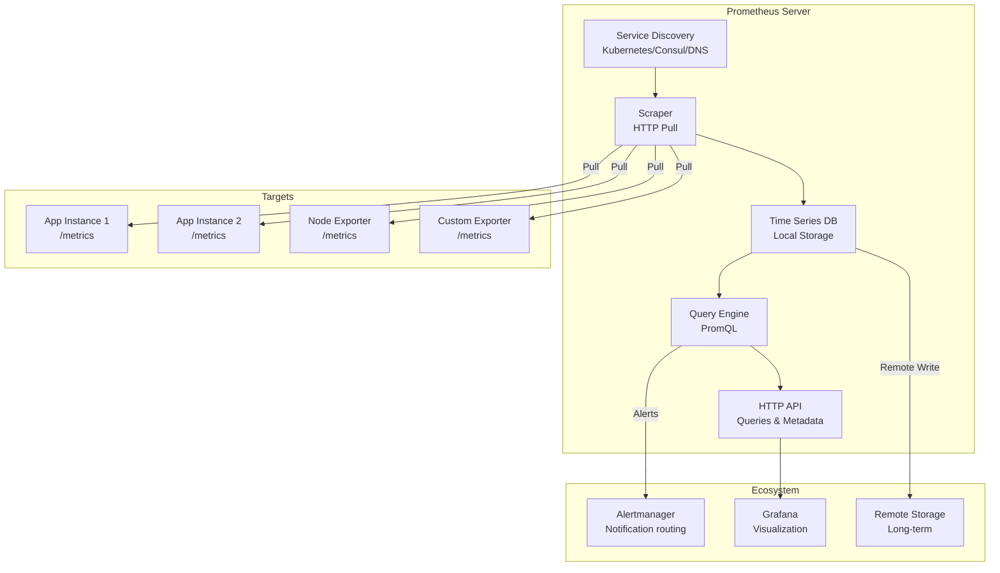
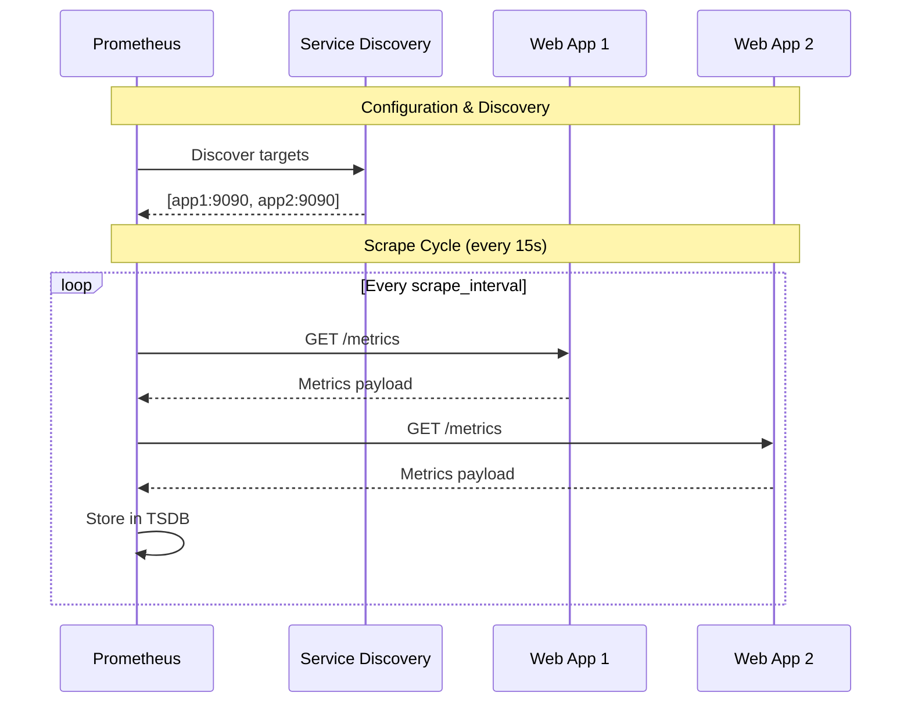
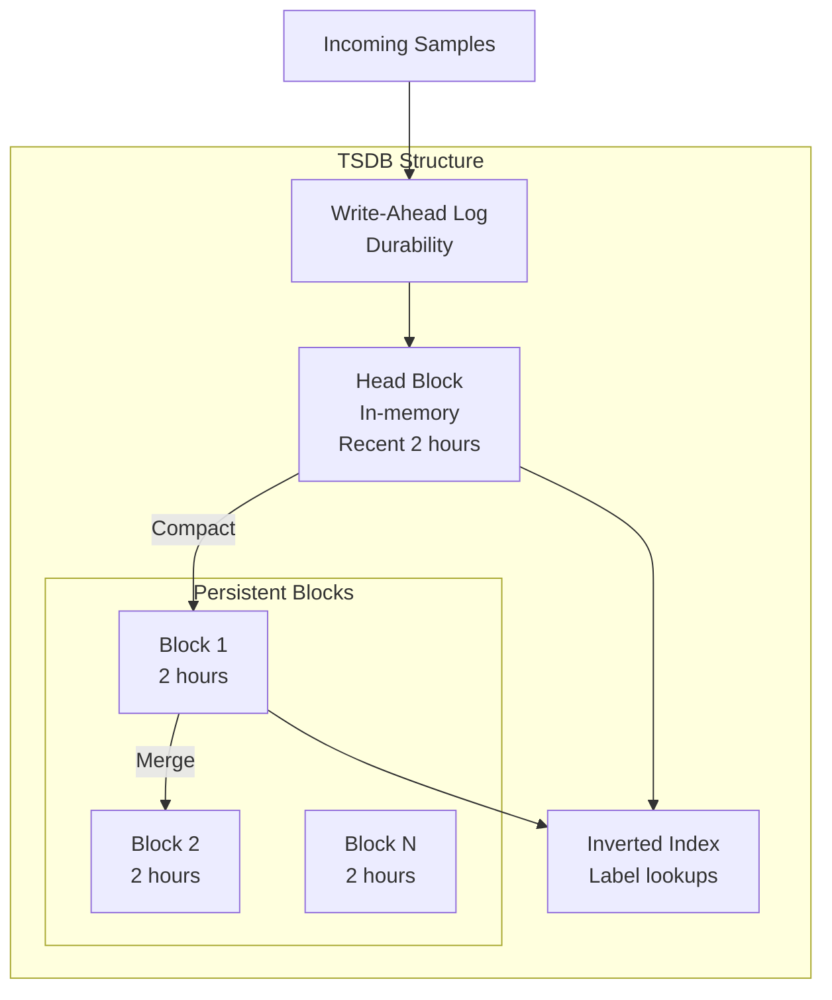
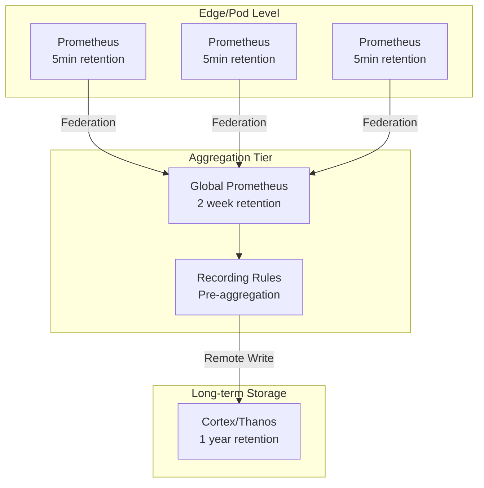
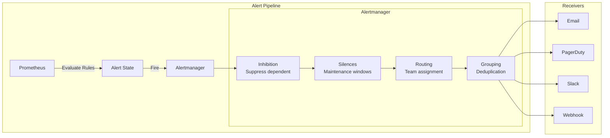
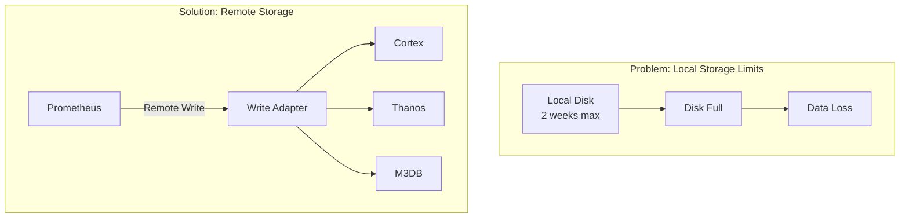

# Prometheus: Cloud-Native Monitoring at Scale

!!! abstract "The Prometheus Story"
    **🎯 Single Achievement**: Defined cloud-native monitoring
    **📊 Scale**: Kubernetes: 10M+ active series per instance
    **⏱️ Performance**: Sub-second queries over millions of series
    **💡 Key Innovation**: Pull-based model with service discovery

## Why Prometheus Matters

| Traditional Monitoring | Prometheus Innovation | Business Impact |
|----------------------|---------------------|------------------|
| **Push to central server** → bottleneck | **Pull from targets** → scalable | 100x more targets |
| **Static configuration** → manual updates | **Service discovery** → dynamic | Zero manual config |
| **Host-based metrics** → limited view | **Dimensional metrics** → flexible | 10x better insights |
| **Proprietary storage** → vendor lock | **Open TSDB format** → portable | No vendor lock-in |

## Architecture Overview



## Core Design Principles

### 1. Dimensional Data Model

```prometheus
# Traditional: flat metrics
cpu_usage_web_server_1 75.5
cpu_usage_web_server_2 82.3
cpu_usage_db_server_1 45.2

# Prometheus: dimensional metrics
cpu_usage{instance="server-1",job="web",env="prod"} 75.5
cpu_usage{instance="server-2",job="web",env="prod"} 82.3
cpu_usage{instance="server-1",job="db",env="prod"} 45.2

# Powerful queries
sum by (job) (cpu_usage{env="prod"})  # CPU by service type
avg(cpu_usage{job="web"})             # Average web server CPU
```

### 2. Pull-Based Model



### 3. PromQL Query Language

```prometheus
# Instant queries
http_requests_total{status="500"}  # All 500 errors

# Rate calculations
rate(http_requests_total[5m])  # Requests per second, 5min window

# Aggregations
sum by (status) (
  rate(http_requests_total[5m])
)  # RPS grouped by status code

# Complex queries
(
  sum by (instance) (rate(http_requests_total{job="api"}[5m]))
  /
  sum by (instance) (up{job="api"})
) > 1000  # Instances handling >1000 RPS

# Histogram quantiles
histogram_quantile(0.99,
  sum by (le) (
    rate(http_request_duration_seconds_bucket[5m])
  )
)  # 99th percentile latency
```

## Time Series Database Design

### Storage Layout



### Compression & Efficiency

```go
// Sample storage format
type Sample struct {
    Timestamp int64   // 8 bytes
    Value     float64 // 8 bytes
}

// Compression techniques:
// 1. Delta encoding for timestamps
// 2. XOR compression for values
// 3. Chunk encoding

// Result: ~1.3 bytes per sample average
// 1M series * 4 samples/min * 60min * 24h = 5.76B samples/day
// Storage: ~7.5GB/day (highly compressed)
```

## Production Patterns

### Multi-Tier Architecture



### Service Discovery Configuration

```yaml
# Kubernetes service discovery
scrape_configs:
  - job_name: 'kubernetes-pods'
    kubernetes_sd_configs:
      - role: pod
    relabel_configs:
      # Only scrape pods with annotation
      - source_labels: [__meta_kubernetes_pod_annotation_prometheus_io_scrape]
        action: keep
        regex: true
      # Use pod annotation for metrics path
      - source_labels: [__meta_kubernetes_pod_annotation_prometheus_io_path]
        action: replace
        target_label: __metrics_path__
        regex: (.+)
      # Extract pod labels
      - action: labelmap
        regex: __meta_kubernetes_pod_label_(.+)
```

### High-Cardinality Management

```prometheus
# Problem: Cardinality explosion
http_requests{path="/user/123"}     # Bad: unique label per user
http_requests{path="/user/456"}
# Millions of series!

# Solution: Bounded cardinality
http_requests{path="/user/{id}"}    # Good: template path
http_requests{endpoint="user"}

# Recording rules for expensive queries
groups:
  - name: aggregations
    interval: 30s
    rules:
      - record: instance:http_requests:rate5m
        expr: |
          sum by (instance) (
            rate(http_requests_total[5m])
          )
```

## Alerting Architecture



### Alert Rule Examples

```yaml
groups:
  - name: availability
    rules:
      - alert: HighErrorRate
        expr: |
          sum by (service) (
            rate(http_requests_total{status=~"5.."}[5m])
          ) / 
          sum by (service) (
            rate(http_requests_total[5m])
          ) > 0.05
        for: 5m
        labels:
          severity: critical
        annotations:
          summary: "High error rate for {{ $labels.service }}"
          description: "{{ $labels.service }} has {{ $value | humanizePercentage }} error rate"

      - alert: InstanceDown
        expr: up == 0
        for: 1m
        labels:
          severity: critical
        annotations:
          summary: "Instance {{ $labels.instance }} is down"
```

## Scaling Challenges

### Challenge 1: Cardinality Explosion

!!! danger "The Label Trap"
    **Problem**: Adding high-cardinality labels
    **Example**: `{user_id="12345"}` with millions of users
    **Impact**: OOM, slow queries, impossible to scale
    **Solution**: Use bounded labels, recording rules

### Challenge 2: Long-Term Storage



### Challenge 3: Federation Bottlenecks

```yaml
# Anti-pattern: Pulling all metrics
- job_name: 'federate'
  honor_labels: true
  metrics_path: '/federate'
  params:
    'match[]':
      - '{__name__=~".+"}'  # DON'T DO THIS!

# Best practice: Selective federation
- job_name: 'federate'
  honor_labels: true
  metrics_path: '/federate'
  params:
    'match[]':
      - 'up{job="prometheus"}'  # Only specific metrics
      - 'instance:http_requests:rate5m'  # Pre-aggregated
```

## Best Practices

### 1. Metric Naming

```prometheus
# Good naming conventions
http_requests_total         # Counter: _total suffix
http_request_duration_seconds  # Histogram: base unit
http_requests_in_progress   # Gauge: current state
process_start_time_seconds  # Timestamp: _seconds suffix

# Include unit in name
network_bytes_total        # Not: network_traffic
memory_usage_bytes         # Not: memory_usage
http_duration_seconds      # Not: http_latency
```

### 2. Label Design

```prometheus
# Good: Bounded cardinality
http_requests_total{method="GET",status="200",endpoint="/api/users"}

# Bad: Unbounded cardinality
http_requests_total{user_id="12345",session_id="abc-def-ghi"}

# Use quantiles for distributions
http_request_duration_seconds_bucket{le="0.1"}   # 100ms
http_request_duration_seconds_bucket{le="0.5"}   # 500ms
http_request_duration_seconds_bucket{le="1.0"}   # 1s
http_request_duration_seconds_bucket{le="+Inf"}  # Total
```

### 3. Resource Planning

| Metric | Formula | Example |
|--------|---------|----------|
| **Memory** | `series * 8KB` | 1M series = 8GB RAM |
| **CPU** | `series * scrapes/min * 0.001` | 1M series = 1 core |
| **Disk** | `samples * 1.3 bytes` | 1M series/min = 2GB/day |
| **Network** | `targets * metrics * interval` | 1000 targets = 10Mbps |

## Modern Enhancements

### Remote Write 2.0

```go
// Improved remote write protocol
type WriteRequest struct {
    Timeseries []TimeSeries
    Metadata   []MetricMetadata
    
    // New in 2.0
    SymbolTable     []string  // String interning
    ExemplarData    []Exemplar // Trace correlation
    CompressedData  []byte     // Snappy compression
}
```

### Exemplars (Trace Integration)

```prometheus
# Metrics with trace correlation
http_requests_total{method="GET",status="500"} 1027 # {trace_id="abc123"}

# Query traces for slow requests
http_request_duration_seconds{quantile="0.99"} # Link to Jaeger
```

## Decision Framework

### When to Use Prometheus

✅ **Perfect Fit**:
- Kubernetes monitoring
- Microservices metrics
- SRE/DevOps workflows
- Pull-based collection
- Open source requirement

⚠️ **Consider Carefully**:
- Very high cardinality (>10M series)
- Long-term storage (>1 month)
- Business metrics/analytics
- Log aggregation

❌ **Avoid**:
- Event/log storage
- Tracing data
- User analytics
- Billing metrics

## Key Takeaways

!!! success "Why Prometheus Won"
    1. **Pull model**: Simpler, more scalable than push
    2. **Service discovery**: Native cloud integration
    3. **PromQL**: Powerful time series queries
    4. **Ecosystem**: Exporters for everything
    5. **Simplicity**: Single binary, local storage

## Related Topics

- [Time Series Databases](../pattern-library/time-series-db) - TSDB design
- [Service Discovery](../pattern-library/communication/service-discovery) - Dynamic targets
- [Observability](../pattern-library/observability) - Metrics pillar
- [Grafana](grafana) - Visualization layer
- [OpenTelemetry](opentelemetry.md) - Unified observability

## References

1. [Prometheus: Up & Running](https://www.oreilly.com/library/view/prometheus-up/9781492034131/)
2. [Robust Perception Blog](https://www.robustperception.io/blog)
3. [PromCon Talks](https://promcon.io/)
4. [Prometheus Documentation](https://prometheus.io/docs/)
