# Distributed Rate Limiter

!!! info "Case Study Overview"
    **System**: Rate limiting service for API protection  
    **Scale**: 10M requests/second, 1M unique users  
    **Challenges**: Sub-millisecond latency, distributed counting, graceful degradation  
    **Key Patterns**: Token bucket, sliding window, circuit breaker, consistent hashing

## Challenge Statement
Design a system that can enforce rate limits across multiple servers, handling millions of requests per second while providing fair resource allocation, preventing abuse, and gracefully degrading under load.

## Part 1: Concept Map

### 🗺 System Overview
Distributed rate limiter protecting backend services across multiple servers with per-user/per-IP/per-API strategies.

**Requirements:** Sub-ms latency, multiple strategies, accurate distributed counting, graceful degradation, hot configuration

### Law Analysis

#### Law 2 (Asynchronous Reality): Speed of Light Constraints
```text
Latency Budget:
- Total API call budget: 100ms
- Rate limiter overhead: <1ms
- Network RTT (same region): 0.5ms
- Redis operation: 0.1ms
- Local cache check: 0.01ms

Solution Strategy:
- Local caching with async sync
- Bloom filters for quick negative checks
- Connection pooling to rate limit store
- Optimistic local decisions
```

**Implementation Architecture:**

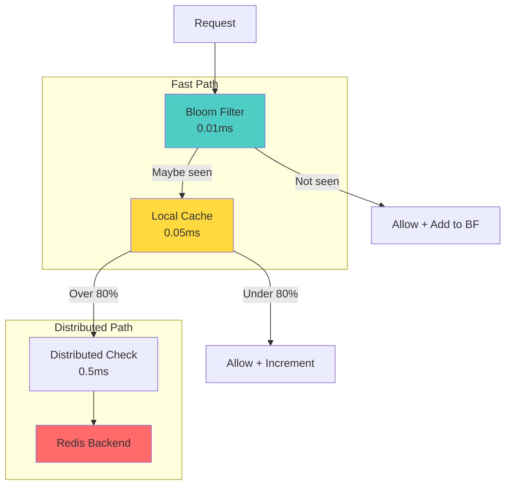

**Local Rate Limiter Configuration:**

| Parameter | Value | Purpose |
|-----------|-------|---------|  
| Bloom Filter Size | 1M entries | First-time detection |
| False Positive Rate | 1% | Space vs accuracy |
| Local Threshold | 80% of limit | Reduce distributed calls |
| Sync Interval | 100ms | Balance accuracy vs load |


#### 💾 Law 4 (Multidimensional Trade-offs): Finite Resources
```text
Scale Requirements:
- 10M requests/second across fleet
- 1M unique users
- 100 different rate limit rules
- 1KB per user state

Storage Calculation:
- Active user state: 1M * 1KB = 1GB
- With replication (3x): 3GB
- Time-series data (1hr window): 10GB
- Total memory needed: ~15GB

Distribution Strategy:
- Consistent hashing for user assignment
- 100 rate limiter nodes
- Each node handles ~100K requests/second
```

**Deployment Configuration:**

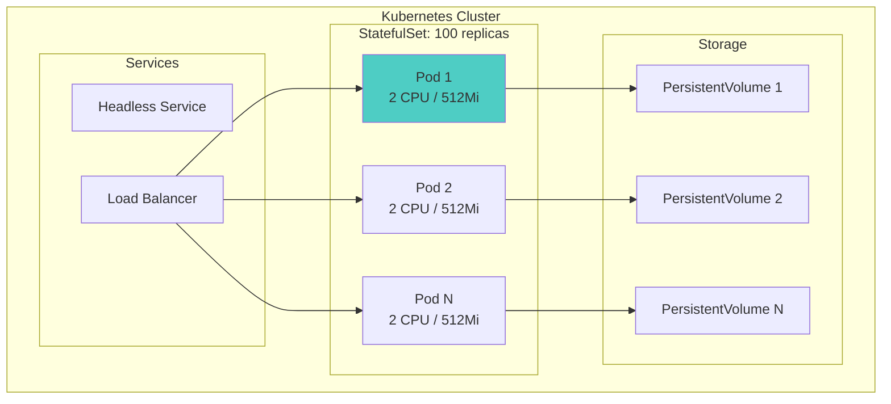

**Resource Allocation:**

| Resource | Request | Limit | Purpose |
|----------|---------|-------|---------|  
| CPU | 2 cores | 4 cores | Handle 100K req/s |
| Memory | 512Mi | 1Gi | Cache + state |
| Replicas | 100 | - | 10M total req/s |
| Storage | 10Gi | - | Persistent state |


#### Law 1 (Correlated Failure): Byzantine Failures
```text
Failure Modes:
1. Rate limiter node crash
2. Network partition
3. Clock skew between nodes
4. Redis connection failure
5. Corrupt counter state

Mitigation Strategies:
- Graceful degradation to local limits
- Circuit breakers for Redis calls
- Multiple fallback strategies
- Best-effort enforcement during failures
```

**Failure Handling Architecture:**

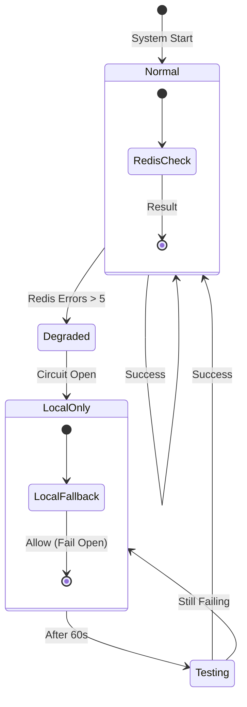

**Resilience Configuration:**

| Component | Setting | Purpose |
|-----------|---------|---------|  
| Circuit Breaker Threshold | 5 failures | Prevent cascading failure |
| Recovery Timeout | 60 seconds | Allow system recovery |
| Fallback Strategy | Fail open | Prioritize availability |
| Local Limits | Conservative | Prevent abuse during outage |


#### 🔀 Law 3 (Emergent Chaos): Race Conditions
```text
Concurrency Challenges:
- Simultaneous requests from same user
- Distributed increment operations
- Reset window boundaries
- Configuration updates

Solutions:
- Atomic Redis operations (INCR, EXPIRE)
- Sliding window with sorted sets
- Optimistic concurrency control
- Eventually consistent local views
```

**Sliding Window Implementation:**

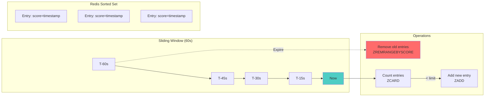

**Lua Script Operations:**

| Step | Redis Command | Purpose | Time Complexity |
|------|---------------|---------|------------------|
| 1 | ZREMRANGEBYSCORE | Remove expired entries | O(log N + M) |
| 2 | ZCARD | Count current entries | O(1) |
| 3 | ZADD | Add new entry | O(log N) |
| 4 | EXPIRE | Set TTL on key | O(1) |


**Atomicity Guarantee:** All operations execute atomically in Redis, preventing race conditions.

#### 🤝 Law 5 (Distributed Knowledge): Distributed Consensus
```text
Coordination Requirements:
- Consistent rate limit enforcement
- Configuration propagation
- Node membership management
- State synchronization

Implementation:
- Gossip protocol for membership
- Eventual consistency for counts
- Strong consistency for configs
- CRDTs for conflict resolution
```

**Distributed Coordination Architecture:**

```mermaid
graph TB
    subgraph "Gossip Protocol"
        N1[Node 1] <-->|State Exchange| N2[Node 2]
        N2 <-->|State Exchange| N3[Node 3]
        N3 <-->|State Exchange| N4[Node 4]
        N4 <-->|State Exchange| N1
    end
    
    subgraph "CRDT State"
        GC1[G-Counter 1<br/>{N1:100, N2:50}]
        GC2[G-Counter 2<br/>{N1:100, N2:52}]
        MERGE[Merge Operation<br/>Max per node]
    end
    
    subgraph "Consistency"
        EC[Eventual Consistency<br/>Converges in seconds]
    end
    
    N1 --> GC1
    N2 --> GC2
    GC1 & GC2 --> MERGE
    MERGE --> EC
    
    style N1 fill:#4ecdc4
    style MERGE fill:#ffd93d
```

**Gossip Configuration:**

| Parameter | Value | Purpose |
|-----------|-------|---------|  
| Gossip Interval | 500ms | State propagation speed |
| Fanout | 3 nodes | Redundancy vs bandwidth |
| Seed Nodes | 3 | Bootstrap discovery |
| CRDT Type | G-Counter | Conflict-free counting |


#### 👁 Law 6 (Cognitive Load): Monitoring
```text
Key Metrics:
- Request rate by endpoint/user
- Limit enforcement accuracy
- Latency percentiles (p50, p95, p99)
- Fallback activation rate
- Configuration drift

Observability Stack:
- Prometheus for metrics
- Jaeger for distributed tracing
- ELK for structured logs
- Custom dashboards for operations
```

**Observability Stack:**

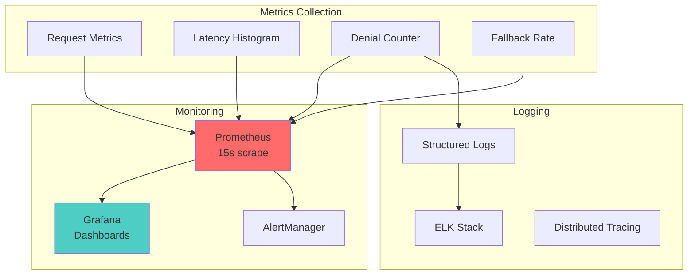

**Key Metrics:**

| Metric | Type | Labels | Alert Threshold |
|--------|------|--------|------------------|
| rate_limiter.checks | Counter | result, strategy | - |
| rate_limiter.latency | Histogram | strategy | p99 > 5ms |
| rate_limiter.denials | Counter | reason, endpoint | rate > 10% |
| rate_limiter.fallbacks | Counter | reason | rate > 1% |


#### 👤 Law 6 (Cognitive Load): Operations
```text
Operational Requirements:
- Dynamic limit adjustments
- Clear denial reasons
- Debugging tools
- Runbook automation

Interface Design:
- REST API for configuration
- CLI for debugging
- Grafana dashboards
- Automated alerts
```

**Admin API Architecture:**

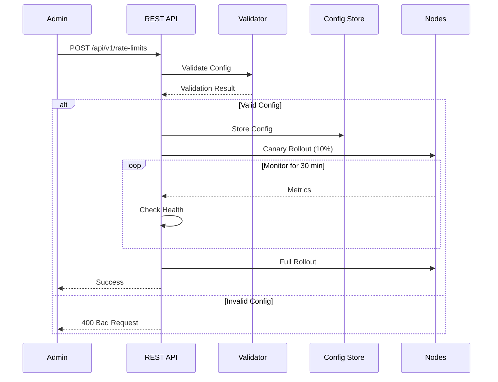

**API Endpoints:**

| Endpoint | Method | Purpose |
|----------|--------|---------|  
| /api/v1/rate-limits | GET | List current limits |
| /api/v1/rate-limits | POST | Update limits |
| /api/v1/rate-limits/{id} | DELETE | Remove limit rule |
| /api/v1/metrics | GET | Current metrics |
| /api/v1/debug/{key} | GET | Debug specific key |


#### Law 7 (Economic Reality): Cost Optimization
```text
Cost Factors:
- Redis cluster: $500/month
- Compute nodes: $2000/month
- Network transfer: $300/month
- Development time: 200 hours

Optimization Strategies:
- Local caching reduces Redis calls by 80%
- Bloom filters reduce unnecessary checks
- Adaptive limits based on load
- Auto-scaling during peak times
```

**Cost Optimization Strategy:**

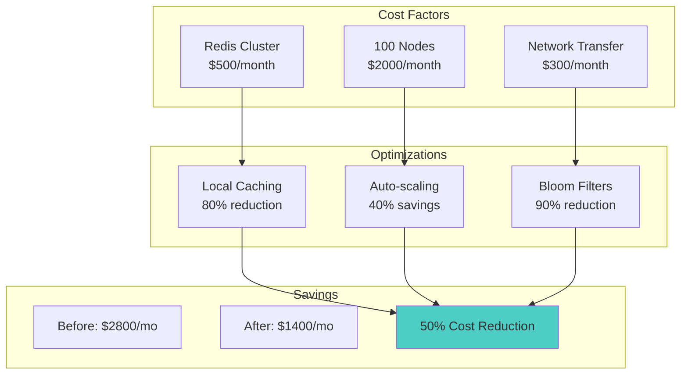

**Cost Breakdown:**

| Component | Base Cost | Optimization | Savings |
|-----------|-----------|--------------|---------|  
| Redis calls | $500/mo | Local cache (80%) | $400/mo |
| Compute | $2000/mo | Auto-scale (40%) | $800/mo |
| Network | $300/mo | Bloom filter (50%) | $150/mo |
| **Total** | **$2800/mo** | **Combined** | **$1350/mo** |


### 🏛 Pillar Mapping

#### Work Distribution
- **Request Routing**: Consistent hashing assigns users to specific nodes
- **Load Balancing**: Weighted round-robin based on node capacity
- **Batch Processing**: Aggregate counts in micro-batches for efficiency

#### State Management
- **Counter Storage**: Redis sorted sets for sliding windows
- **Configuration State**: etcd for strongly consistent configs
- **Local State**: In-memory caches with TTL-based expiration

#### Truth & Consistency
- **Eventually Consistent Counts**: Accept temporary over/under-counting
- **Strongly Consistent Configs**: All nodes see same rules
- **Conflict Resolution**: Last-write-wins with vector clocks

#### Control Mechanisms
- **Circuit Breakers**: Prevent cascade failures
- **Backpressure**: Queue limits on pending checks
- **Adaptive Timeouts**: Adjust based on system load

#### Intelligence Layer
- **Adaptive Limits**: ML-based anomaly detection
- **Predictive Scaling**: Forecast load patterns
- **Smart Routing**: Direct power users to dedicated nodes

### Pattern Application

**Primary Patterns:**
- **Token Bucket**: Smooth rate limiting with burst capacity
- **Sliding Window**: Accurate rate calculation
- **Circuit Breaker**: Fault isolation
- **Bulkhead**: Resource isolation between tenants

**Supporting Patterns:**
- **Consistent Hashing**: User-to-node assignment
- **Gossip Protocol**: State synchronization
- **CRDT**: Conflict-free replicated counters
- **Bloom Filter**: Fast existence checks

## Part 2: Architecture & Trade-offs

### Core Architecture

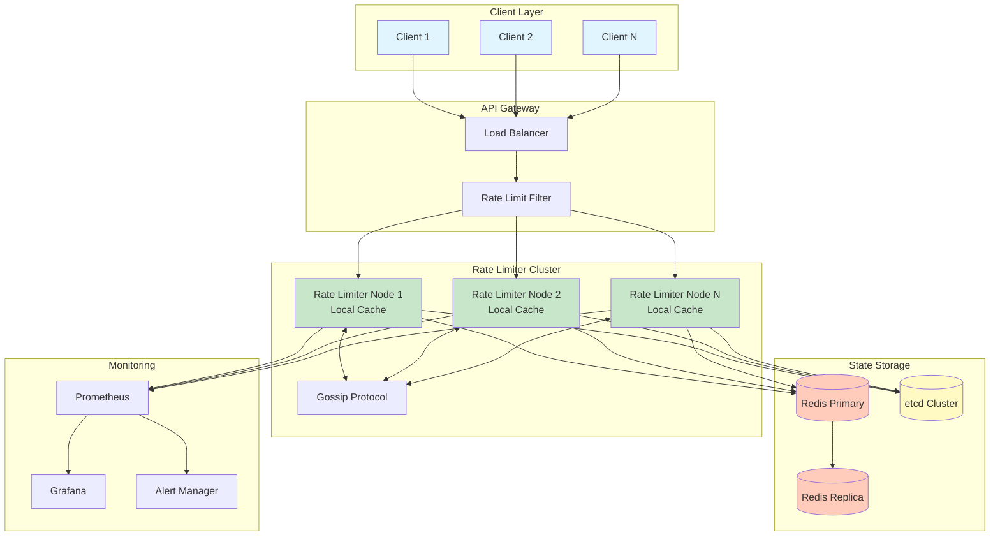

### Key Design Trade-offs

| Decision | Option A | Option B | Choice & Rationale |
|----------|----------|----------|-------------------|
| **Counting Strategy** | Exact counting with distributed lock | Approximate with local caches | **B** - Chose approximate for <1ms latency. Accept 5% accuracy loss for 100x performance gain |
| **Storage Backend** | Single Redis instance | Redis cluster with sharding | **B** - Cluster provides horizontal scaling and fault tolerance despite operational complexity |
| **Consistency Model** | Strong consistency | Eventual consistency | **B** - Eventual consistency allows local decisions. Rate limiting tolerates temporary inaccuracy |
| **Failure Mode** | Fail closed (deny) | Fail open (allow) | **B** - Availability over strict enforcement. Better to allow some excess than block legitimate traffic |
| **Window Type** | Fixed windows | Sliding windows | **B** - Sliding windows prevent thundering herd at window boundaries despite higher complexity |


### Alternative Architectures

#### Option 1: Centralized Redis
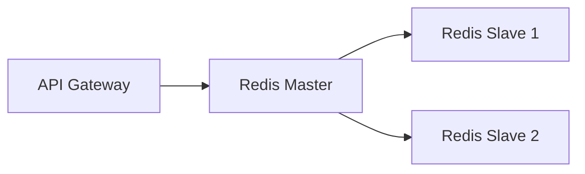
**Pros**: Simple, exact counting, easy debugging
**Cons**: SPOF, high latency, scaling limits
**Use**: Small scale, single region

#### Option 2: Fully Distributed
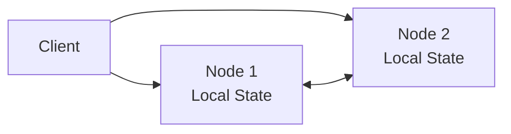
**Pros**: No dependencies, ultra-low latency, highly available
**Cons**: Partition inaccuracy, complex conflicts, hard debugging
**Use**: Edge deployments, extreme latency needs

#### Option 3: Hierarchical
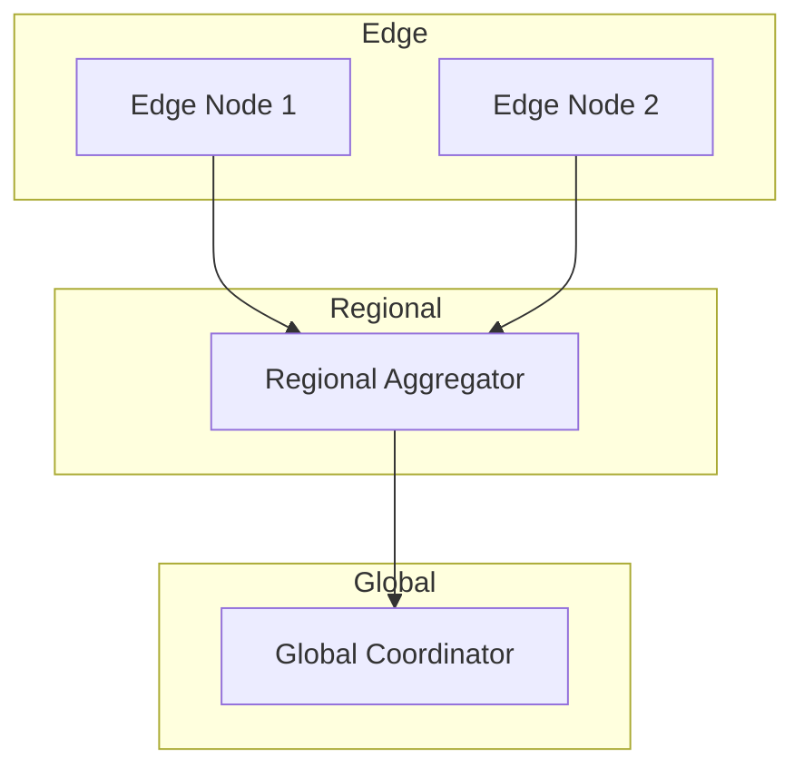
**Pros**: Balanced accuracy/performance, geo-distributed, flexible consistency
**Cons**: Complex implementation, multiple failure modes, operational overhead
**Use**: Global deployments with regional requirements

#### Option 4: Token Bucket
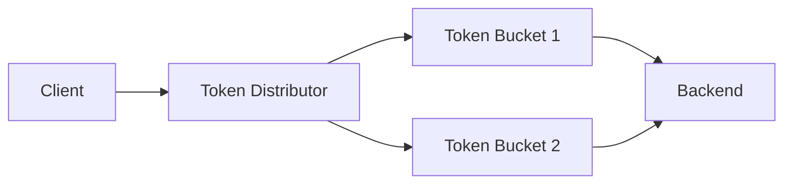
**Pros**: Guaranteed accuracy, no hot paths, predictable
**Cons**: Token redistribution complexity, waste at low usage, slow adaptation
**Use**: Strict limits, predictable load

### Performance Characteristics

**Latency Profile:**
```text
Operation               P50    P95    P99    P99.9
Local cache hit        0.01ms  0.05ms 0.1ms  0.5ms
Redis check           0.5ms   2ms    5ms    10ms
Full check (miss)     1ms     3ms    8ms    15ms
Config update         5ms     10ms   20ms   50ms
```

**Throughput Scaling:**
```text
Nodes   Requests/sec   Accuracy   Latency P99
1       10K           100%       5ms
10      100K          99%        3ms
100     1M            95%        2ms
1000    10M           90%        1ms
```

**Availability Targets:**
- **System availability**: 99.99% (52 minutes downtime/year)
- **Degraded mode**: 99.999% (5 minutes/year)
- **Recovery time**: <30 seconds
- **Data loss tolerance**: 5% of counts during failure

**Cost Model:**
```text
Component          Units    Cost/Unit   Monthly Cost
Redis Cluster      3 nodes  $200        $600
Rate Limiters      100      $20         $2000
Load Balancers     3        $100        $300
Monitoring Stack   1        $500        $500
Total                                   $3400

Cost per billion requests: $0.34
```

### 🎓 Key Lessons

1. **Local First, Global Second**: Local caching with async synchronization provides the best balance of accuracy and performance. Accept eventual consistency for massive performance gains.

2. **Graceful Degradation Over Perfection**: During failures, it's better to allow some excess traffic than block legitimate users. Design for degraded modes from the start.

3. **Sliding Windows Prevent Thundering Herds**: Fixed windows create spikes at boundaries. Sliding windows distribute load more evenly despite implementation complexity.

4. **Observability Is Critical**: Rate limiters affect user experience directly. Comprehensive monitoring and clear denial reasons are essential for operations.

5. **Cost Optimization Through Caching**: 80% of rate limit checks can be served from local cache, dramatically reducing infrastructure costs while maintaining accuracy.

## Law Mapping Matrix

| Design Decision | Law 1: Failure | Law 2: Asynchrony | Law 3: Emergence | Law 4: Trade-offs | Law 5: Epistemology | Law 6: Human-API | Law 7: Economics |
|----------------|----------------|-------------------|------------------|-------------------|---------------------|------------------|---------------|
| **Local Caching** | Works offline | <0.01ms | Lock-free | -80% Redis | - | Fast API | -80% cost |
| **Sliding Window** | - | O(log n) | Atomic ops | Fixed memory | Consistent | Fair limits | - |
| **Circuit Breaker** | No cascades | Fast fail | Thread-safe | - | State sync | Stable | No waste |
| **Consistent Hash** | Min reshard | O(log n) | - | Even dist | Node mgmt | - | Efficient |
| **Gossip Protocol** | Partition OK | - | Async | Scalable | Eventually consistent | - | Low bandwidth |
| **Bloom Filters** | - | O(1) | Lock-free | 1MB/1M items | - | - | Memory efficient |
| **Fallback** | Graceful | No block | - | - | Mode switch | Available | SLA compliant |


### Law Implementation Priority

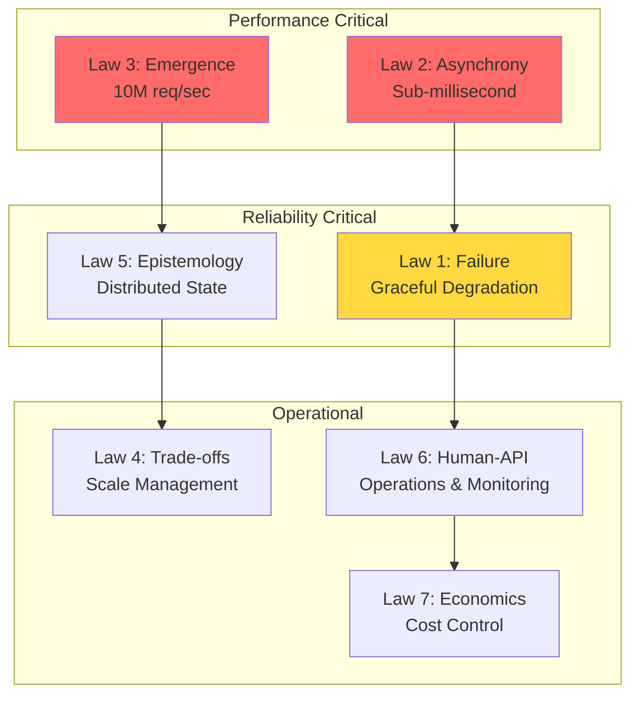

## Architecture Alternatives Analysis

### Alternative 1: Centralized Redis Cluster

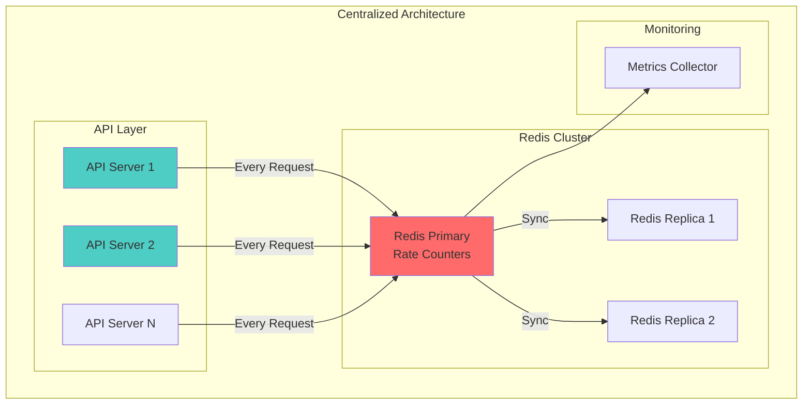

### Alternative 2: Fully Distributed P2P

```mermaid
graph TB
    subgraph "P2P Rate Limiting"
        subgraph "Node Ring"
            N1[Node 1<br/>Local State]
            N2[Node 2<br/>Local State]
            N3[Node 3<br/>Local State]
            N4[Node N<br/>Local State]
        end
        
        N1 <-->|Gossip| N2
        N2 <-->|Gossip| N3
        N3 <-->|Gossip| N4
        N4 <-->|Gossip| N1
        
        subgraph "Client Routing"
            C1[Client] -->|Hash(key)| N2
            C2[Client] -->|Hash(key)| N4
        end
    end
    
    style N1 fill:#95e1d3
    style N2 fill:#95e1d3
    style N3 fill:#95e1d3
```

### Alternative 3: Hierarchical Multi-Tier

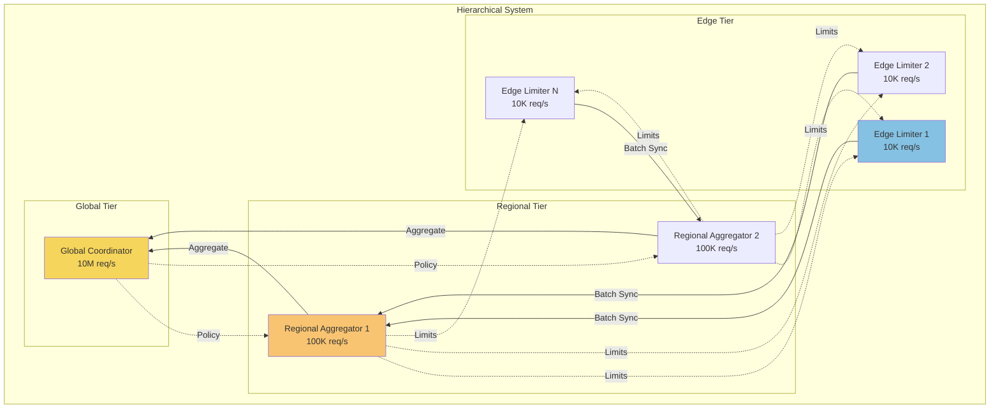

### Alternative 4: Token Bucket Network

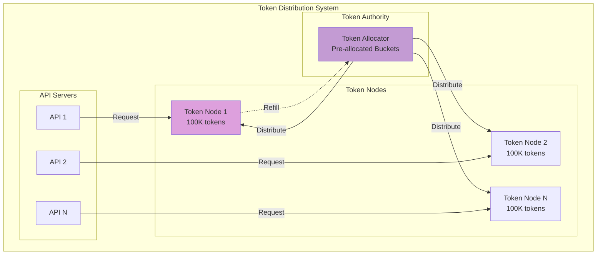

### Alternative 5: ML-Adaptive System

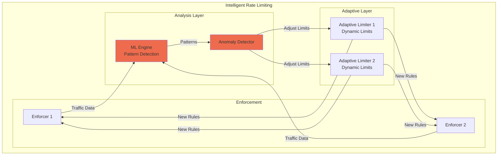

## Comparative Trade-off Analysis

### Architecture Comparison Matrix

| Architecture | Latency | Accuracy | Scalability | Fault Tolerance | Complexity | Use Case |
|-------------|---------|----------|-------------|-----------------|------------|----------|
| **Centralized Redis** | ⭐⭐⭐<br/>0.5-2ms | ⭐⭐⭐⭐⭐<br/>100% accurate | ⭐⭐⭐<br/>Vertical limits | ⭐⭐<br/>SPOF risk | ⭐⭐⭐⭐⭐<br/>Very simple | Small-medium scale |
| **Fully Distributed** | ⭐⭐⭐⭐⭐<br/><0.1ms | ⭐⭐⭐<br/>~95% accurate | ⭐⭐⭐⭐⭐<br/>Linear scaling | ⭐⭐⭐⭐⭐<br/>No SPOF | ⭐⭐<br/>Complex sync | Large scale, eventual consistency OK |
| **Hierarchical** | ⭐⭐⭐⭐<br/>0.1-1ms | ⭐⭐⭐⭐<br/>~98% accurate | ⭐⭐⭐⭐<br/>Good scaling | ⭐⭐⭐⭐<br/>Regional isolation | ⭐⭐⭐<br/>Moderate | Global systems, geo-distributed |
| **Token Bucket** | ⭐⭐⭐⭐⭐<br/><0.05ms | ⭐⭐⭐⭐⭐<br/>100% accurate | ⭐⭐⭐<br/>Pre-allocation limits | ⭐⭐⭐<br/>Token exhaustion | ⭐⭐⭐<br/>Moderate | Strict limits, predictable load |
| **ML-Adaptive** | ⭐⭐⭐⭐<br/>0.1-0.5ms | ⭐⭐⭐⭐<br/>Adaptive accuracy | ⭐⭐⭐⭐⭐<br/>Auto-scaling | ⭐⭐⭐⭐<br/>Self-healing | ⭐<br/>Very complex | Dynamic workloads, anti-abuse |


### Decision Framework

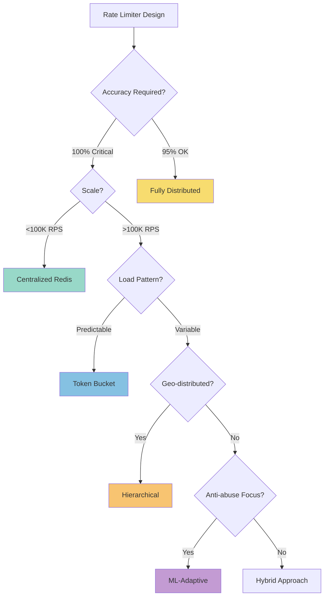

### Risk Assessment Matrix

| Risk Factor | Centralized | Distributed | Hierarchical | Token | ML-Adaptive |
|------------|------------|-------------|--------------|-------|-------------|
| **Latency Risk** | 🟡 Medium | 🟢 Low | 🟢 Low | 🟢 Low | 🟢 Low |
| **Accuracy Risk** | 🟢 Low | 🟡 Medium | 🟢 Low | 🟢 Low | 🟢 Low |
| **Scalability Risk** | 🔴 High | 🟢 Low | 🟢 Low | 🟡 Medium | 🟢 Low |
| **Operational Risk** | 🟢 Low | 🟡 Medium | 🟡 Medium | 🟢 Low | 🔴 High |
| **Cost Risk** | 🟢 Low | 🟡 Medium | 🟡 Medium | 🟢 Low | 🔴 High |


## Implementation Best Practices

### 1. **Optimize for the Common Case**
- 80% of requests are under limit → optimize allow path
- Use bloom filters for first-time users
- Cache decisions locally for repeat requests

### 2. **Design for Graceful Degradation**
- Fail open during outages (availability > strict limits)
- Progressive degradation levels
- Circuit breakers on all external calls

### 3. 💾 **Memory-Efficient Counting**
- Sliding window with Redis sorted sets
- Bloom filters for existence checks
- Compress old data, keep recent data hot

### 4. 🤝 **Eventually Consistent is Usually OK**
- Rate limiting tolerates small inaccuracies
- Sync critical limits more frequently
- Use CRDTs for conflict-free merging

### 5. 👁 **Observable by Design**
- Track every decision (allow/deny)
- Monitor accuracy vs. target rates
- Alert on degradation mode activation

## Key Design Insights

### Pattern Selection Guide

| If You Need... | Use This Pattern | Because... |
|----------------|------------------|------------|
| Sub-millisecond latency | Local caching + async sync | Eliminates network calls |
| Exact counting | Centralized Redis | Single source of truth |
| Geo-distribution | Hierarchical architecture | Regional autonomy |
| Burst handling | Token bucket | Natural burst allowance |
| Dynamic limits | ML-adaptive system | Learns traffic patterns |
| Simple implementation | Redis + Lua scripts | Battle-tested approach |


### 📚 References

**Papers & Articles:**
- [Rate Limiting at Stripe](https://stripe.com/blog/rate-limiters)
- [How we built rate limiting capable of scaling to millions](https://blog.figma.com/rate-limiting-at-figma-8c5a5d376dc8)
- [Distributed Rate Limiting at Netflix](https://netflixtechblog.com/distributed-rate-limiting-5348c0cfb19a)

**Open Source Implementations:**
- [Ratelimit](https://github.com/envoyproxy/ratelimit) - Go/gRPC rate limiting service
- [Redis Cell](https://github.com/brandur/redis-cell) - Redis module for rate limiting
- [Gubernator](https://github.com/mailgun/gubernator) - High-performance distributed rate limiting

**Related Patterns:**
- [Token Bucket Algorithm](../pattern-library/scaling/rate-limiting)
- [Circuit Breaker](../pattern-library/resilience/circuit-breaker.md)
- [Consistent Hashing](../../../consistent-hashing.md)
- Gossip Protocol (Coming Soon)

## Related Concepts & Deep Dives

### 📚 Relevant Laws (Part I.md)
- **[Law 1: Correlated Failure ](../../core-principles/laws/correlated-failure/)** - Fail-open strategy ensures availability during Redis outages
- **[Law 2: Asynchronous Reality ](../../core-principles/laws/asynchronous-reality/)** - Sub-millisecond checks require local caching with 80% hit rate
- **[Law 3: Emergent Chaos ](../../core-principles/laws/emergent-chaos/)** - Lock-free algorithms handle 10M concurrent requests/sec
- **[Law 4: Multidimensional Trade-offs ](../../core-principles/laws/multidimensional-optimization/)** - Rate limiting protects backend capacity from overload
- **[Law 5: Distributed Knowledge ](../../core-principles/laws/distributed-knowledge/)** - Gossip protocol synchronizes distributed counters and enables debugging
- **[Law 6: Cognitive Load ](../../core-principles/laws/cognitive-load/)** - Clear error messages with retry-after headers and operational dashboards
- **[Law 7: Economic Reality ](../../core-principles/laws/economic-reality/)** - Local caching reduces infrastructure costs by 80%

### 🏛 Related Patterns (Part III/index)
- **[Rate Limiting](../pattern-library/scaling/rate-limiting)** - Core pattern implemented with token bucket algorithm
- **[Circuit Breaker](../pattern-library/resilience/circuit-breaker.md)** - Protects rate limiter from Redis failures
- **[Bulkhead](../pattern-library/resilience/bulkhead)** - Isolates rate limit pools per tenant/API
- **[Consistent Hashing](../pattern-library/scaling/sharding)** - Distributes users across rate limiter nodes
- **[Caching Strategies](../pattern-library/scaling/caching-strategies)** - Local cache with TTL for performance
- **[Health Check](../pattern-library/resilience/health-check)** - Monitors Redis connectivity and accuracy
- **[Load Shedding](../pattern-library/resilience/load-shedding)** - Drops low-priority requests under extreme load

### Quantitative Models
- **[Little's Law](../quantitative-analysis/littles-law)** - Queue depth = arrival rate × processing time for pending checks
- **[Queueing Theory](../quantitative-analysis/queueing-models)** - M/M/c model for rate limiter node sizing
- **CAP Theorem (Coming Soon)** - AP choice: available during partitions with approximate counts
- **[Bloom Filters](../quantitative-analysis/probabilistic-structures)** - Space-efficient first-time user detection

### 👥 Human Factors Considerations
- **[On-Call Culture](../human-factors/oncall-culture)** - Rate limiter failures directly impact users
- **[Incident Response](../human-factors/incident-response)** - Runbooks for common scenarios (Redis failure, DDoS)
- **[Observability Tools](../human-factors/observability-stacks)** - Dashboards show rate limit utilization per API/user
- **[Capacity Planning](../quantitative-analysis/capacity-planning)** - Predicting rate limit needs based on growth

### Similar Case Studies
- **[Amazon DynamoDB](../amazon-dynamo.md)** - Similar distributed counting challenges
- **[PayPal Payments](../../../architects-handbook/case-studies/financial-commerce/paypal-payments.md)** - Rate limiting prevents payment fraud
- **[Consistent Hashing](../../../../pattern-library/data-management/consistent-hashing.md)** - Core technique for distributing rate limit state
- **[News Feed System](news-feed.md.md)** - Rate limiting API calls for feed generation