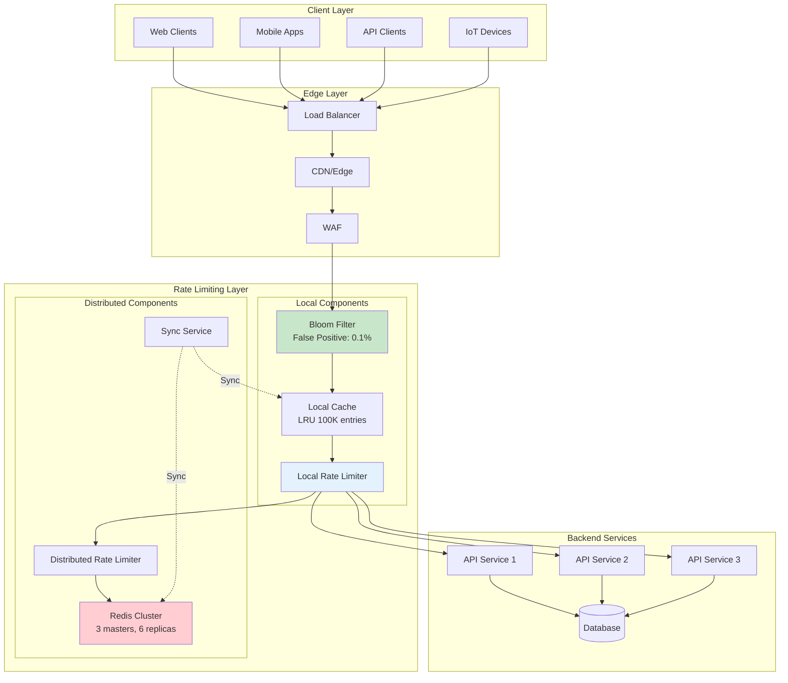
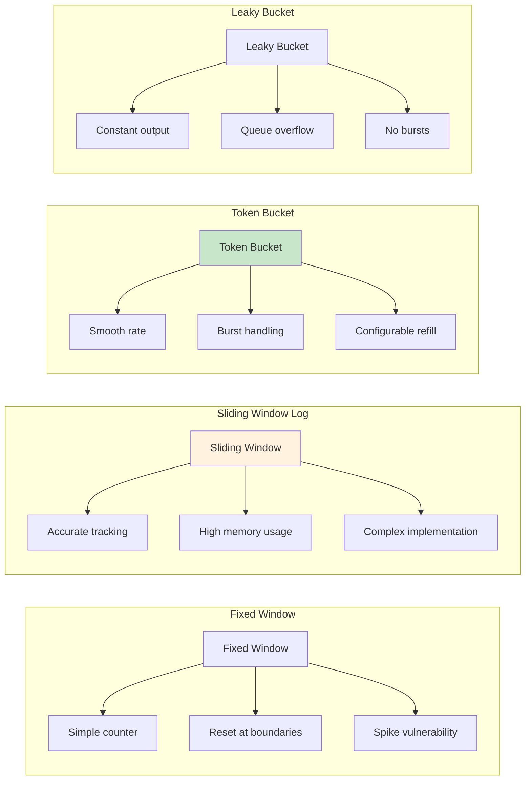
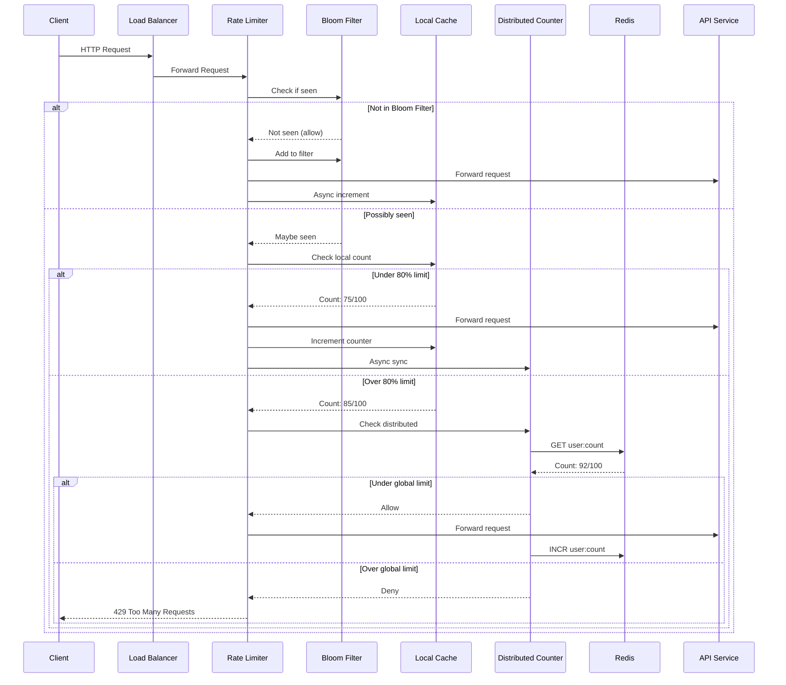
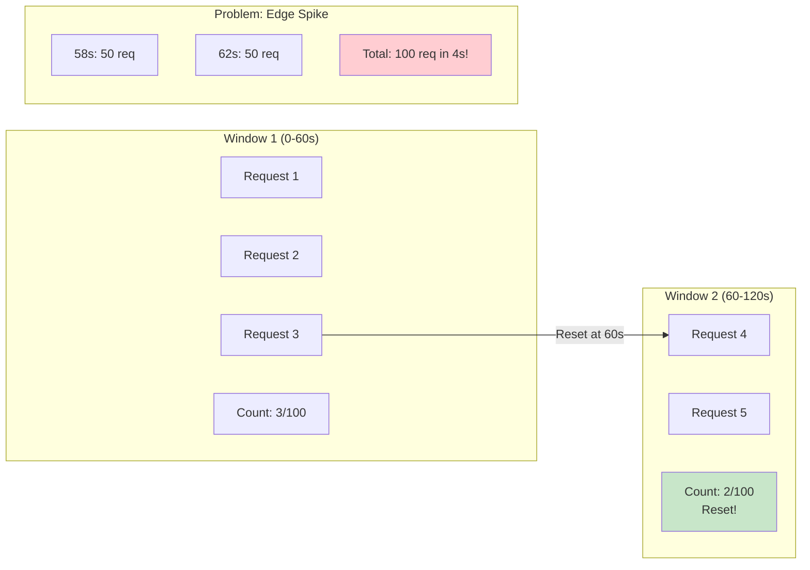
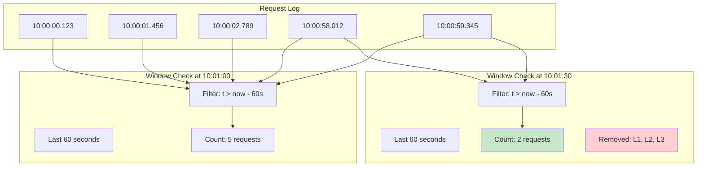
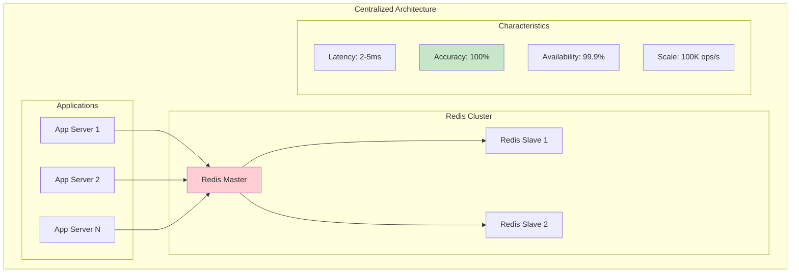
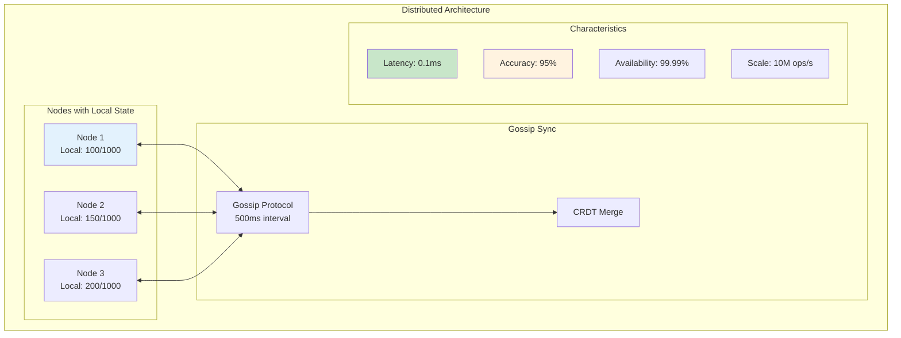
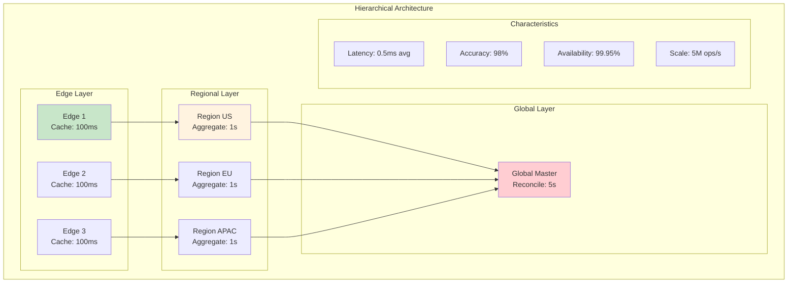

# Distributed Rate Limiter

!!! info "Case Study Overview"
    **System**: Rate limiting service for API protection  
    **Scale**: 10M requests/second, 1M unique users  
    **Challenges**: Sub-millisecond latency, distributed counting, graceful degradation  
    **Key Patterns**: Token bucket, sliding window, circuit breaker, consistent hashing

## Challenge Statement
Design a system that can enforce rate limits across multiple servers, handling millions of requests per second while providing fair resource allocation, preventing abuse, and gracefully degrading under load.

## System Architecture Overview



## Part 1: Concept Map

### 🗺 System Overview
Distributed rate limiter protecting backend services across multiple servers with per-user/per-IP/per-API strategies.

**Requirements:** Sub-ms latency, multiple strategies, accurate distributed counting, graceful degradation, hot configuration

### Rate Limiting Algorithms Comparison



### Law Analysis

#### Law 2 (Asynchronous Reality): Speed of Light Constraints
```text
Latency Budget:
- Total API call budget: 100ms
- Rate limiter overhead: <1ms
- Network RTT (same region): 0.5ms
- Redis operation: 0.1ms
- Local cache check: 0.01ms

Solution Strategy:
- Local caching with async sync
- Bloom filters for quick negative checks
- Connection pooling to rate limit store
- Optimistic local decisions
```

### Request Processing Flow



**Implementation Architecture:**


**Local Rate Limiter Configuration:**

| Parameter | Value | Purpose |
|-----------|-------|---------|  
| Bloom Filter Size | 1M entries | First-time detection |
| False Positive Rate | 1% | Space vs accuracy |
| Local Threshold | 80% of limit | Reduce distributed calls |
| Sync Interval | 100ms | Balance accuracy vs load |


#### 💾 Law 4 (Multidimensional Trade-offs): Finite Resources
```text
Scale Requirements:
- 10M requests/second across fleet
- 1M unique users
- 100 different rate limit rules
- 1KB per user state

Storage Calculation:
- Active user state: 1M * 1KB = 1GB
- With replication (3x): 3GB
- Time-series data (1hr window): 10GB
- Total memory needed: ~15GB

Distribution Strategy:
- Consistent hashing for user assignment
- 100 rate limiter nodes
- Each node handles ~100K requests/second
```

**Deployment Configuration:**


**Resource Allocation:**

| Resource | Request | Limit | Purpose |
|----------|---------|-------|---------|  
| CPU | 2 cores | 4 cores | Handle 100K req/s |
| Memory | 512Mi | 1Gi | Cache + state |
| Replicas | 100 | - | 10M total req/s |
| Storage | 10Gi | - | Persistent state |


#### Law 1 (Correlated Failure): Byzantine Failures
```text
Failure Modes:
1. Rate limiter node crash
2. Network partition
3. Clock skew between nodes
4. Redis connection failure
5. Corrupt counter state

Mitigation Strategies:
- Graceful degradation to local limits
- Circuit breakers for Redis calls
- Multiple fallback strategies
- Best-effort enforcement during failures
```

**Failure Handling Architecture:**


**Resilience Configuration:**

| Component | Setting | Purpose |
|-----------|---------|---------|  
| Circuit Breaker Threshold | 5 failures | Prevent cascading failure |
| Recovery Timeout | 60 seconds | Allow system recovery |
| Fallback Strategy | Fail open | Prioritize availability |
| Local Limits | Conservative | Prevent abuse during outage |

### Rate Limiting Algorithm Visualizations

#### Fixed Window Algorithm



#### Token Bucket Algorithm

```mermaid
graph TB
    subgraph "Token Bucket"
        B[Bucket<br/>Capacity: 100]
        T[Tokens: 75]
        R[Refill Rate<br/>10 tokens/sec]
    end
    
    subgraph "Request Processing"
        RQ1[Request arrives]
        CH{Tokens > 0?}
        AL[Allow & Remove Token]
        DN[Deny Request]
    end
    
    subgraph "Refill Process"
        TM[Timer]
        RF[Add Tokens]
        MX[Min(current + refill, capacity)]
    end
    
    B --> T
    RQ1 --> CH
    CH -->|Yes| AL
    CH -->|No| DN
    
    TM -->|Every 100ms| RF
    RF --> MX
    MX --> T
    
    style AL fill:#c8e6c9
    style DN fill:#ffcdd2
```

#### Sliding Window Log Algorithm



#### 🔀 Law 3 (Emergent Chaos): Race Conditions
```text
Concurrency Challenges:
- Simultaneous requests from same user
- Distributed increment operations
- Reset window boundaries
- Configuration updates

Solutions:
- Atomic Redis operations (INCR, EXPIRE)
- Sliding window with sorted sets
- Optimistic concurrency control
- Eventually consistent local views
```

**Sliding Window Implementation:**


**Lua Script Operations:**

| Step | Redis Command | Purpose | Time Complexity |
|------|---------------|---------|------------------|
| 1 | ZREMRANGEBYSCORE | Remove expired entries | O(log N + M) |
| 2 | ZCARD | Count current entries | O(1) |
| 3 | ZADD | Add new entry | O(log N) |
| 4 | EXPIRE | Set TTL on key | O(1) |


**Atomicity Guarantee:** All operations execute atomically in Redis, preventing race conditions.

#### 🤝 Law 5 (Distributed Knowledge): Distributed Consensus
```text
Coordination Requirements:
- Consistent rate limit enforcement
- Configuration propagation
- Node membership management
- State synchronization

Implementation:
- Gossip protocol for membership
- Eventual consistency for counts
- Strong consistency for configs
- CRDTs for conflict resolution
```

**Distributed Coordination Architecture:**

```mermaid
graph TB
    subgraph "Gossip Protocol"
        N1[Node 1] <-->|State Exchange| N2[Node 2]
        N2 <-->|State Exchange| N3[Node 3]
        N3 <-->|State Exchange| N4[Node 4]
        N4 <-->|State Exchange| N1
    end
    
    subgraph "CRDT State"
        GC1[G-Counter 1<br/>{N1:100, N2:50}]
        GC2[G-Counter 2<br/>{N1:100, N2:52}]
        MERGE[Merge Operation<br/>Max per node]
    end
    
    subgraph "Consistency"
        EC[Eventual Consistency<br/>Converges in seconds]
    end
    
    N1 --> GC1
    N2 --> GC2
    GC1 & GC2 --> MERGE
    MERGE --> EC
    
    style N1 fill:#4ecdc4
    style MERGE fill:#ffd93d
```

**Gossip Configuration:**

| Parameter | Value | Purpose |
|-----------|-------|---------|  
| Gossip Interval | 500ms | State propagation speed |
| Fanout | 3 nodes | Redundancy vs bandwidth |
| Seed Nodes | 3 | Bootstrap discovery |
| CRDT Type | G-Counter | Conflict-free counting |


#### 👁 Law 6 (Cognitive Load): Monitoring
```text
Key Metrics:
- Request rate by endpoint/user
- Limit enforcement accuracy
- Latency percentiles (p50, p95, p99)
- Fallback activation rate
- Configuration drift

Observability Stack:
- Prometheus for metrics
- Jaeger for distributed tracing
- ELK for structured logs
- Custom dashboards for operations
```

**Observability Stack:**


### Monitoring Dashboard Visualization

```mermaid
graph TB
    subgraph "Real-time Metrics"
        subgraph "Request Metrics"
            TPS[Requests/sec<br/>125K]
            LAT2[P99 Latency<br/>0.8ms]
            ERR[Error Rate<br/>0.02%]
        end
        
        subgraph "Rate Limit Metrics"
            ALW[Allowed<br/>98.5%]
            DNY[Denied<br/>1.5%]
            FBK[Fallback<br/>0.1%]
        end
        
        subgraph "System Health"
            CPU2[CPU Usage<br/>45%]
            MEM2[Memory<br/>2.1GB/4GB]
            RED[Redis Latency<br/>0.3ms]
        end
    end
    
    subgraph "Alerts"
        A1[⚠️ High Denial Rate]
        A2[✅ Latency Normal]
        A3[⚠️ Fallback Active]
    end
    
    DNY -->|>5%| A1
    FBK -->|>0%| A3
    
    style TPS fill:#e3f2fd
    style ALW fill:#c8e6c9
    style A1 fill:#fff3e0
```



**Key Metrics:**

| Metric | Type | Labels | Alert Threshold |
|--------|------|--------|------------------|
| rate_limiter.checks | Counter | result, strategy | - |
| rate_limiter.latency | Histogram | strategy | p99 > 5ms |
| rate_limiter.denials | Counter | reason, endpoint | rate > 10% |
| rate_limiter.fallbacks | Counter | reason | rate > 1% |


#### 👤 Law 6 (Cognitive Load): Operations
```text
Operational Requirements:
- Dynamic limit adjustments
- Clear denial reasons
- Debugging tools
- Runbook automation

Interface Design:
- REST API for configuration
- CLI for debugging
- Grafana dashboards
- Automated alerts
```

**Admin API Architecture:**


**API Endpoints:**

| Endpoint | Method | Purpose |
|----------|--------|---------|  
| /api/v1/rate-limits | GET | List current limits |
| /api/v1/rate-limits | POST | Update limits |
| /api/v1/rate-limits/{id} | DELETE | Remove limit rule |
| /api/v1/metrics | GET | Current metrics |
| /api/v1/debug/{key} | GET | Debug specific key |


#### Law 7 (Economic Reality): Cost Optimization
```text
Cost Factors:
- Redis cluster: $500/month
- Compute nodes: $2000/month
- Network transfer: $300/month
- Development time: 200 hours

Optimization Strategies:
- Local caching reduces Redis calls by 80%
- Bloom filters reduce unnecessary checks
- Adaptive limits based on load
- Auto-scaling during peak times
```

**Cost Optimization Strategy:**


**Cost Breakdown:**

| Component | Base Cost | Optimization | Savings |
|-----------|-----------|--------------|---------|  
| Redis calls | $500/mo | Local cache (80%) | $400/mo |
| Compute | $2000/mo | Auto-scale (40%) | $800/mo |
| Network | $300/mo | Bloom filter (50%) | $150/mo |
| **Total** | **$2800/mo** | **Combined** | **$1350/mo** |


### 🏛 Pillar Mapping

#### Work Distribution
- **Request Routing**: Consistent hashing assigns users to specific nodes
- **Load Balancing**: Weighted round-robin based on node capacity
- **Batch Processing**: Aggregate counts in micro-batches for efficiency

#### State Management
- **Counter Storage**: Redis sorted sets for sliding windows
- **Configuration State**: etcd for strongly consistent configs
- **Local State**: In-memory caches with TTL-based expiration

#### Truth & Consistency
- **Eventually Consistent Counts**: Accept temporary over/under-counting
- **Strongly Consistent Configs**: All nodes see same rules
- **Conflict Resolution**: Last-write-wins with vector clocks

#### Control Mechanisms
- **Circuit Breakers**: Prevent cascade failures
- **Backpressure**: Queue limits on pending checks
- **Adaptive Timeouts**: Adjust based on system load

#### Intelligence Layer
- **Adaptive Limits**: ML-based anomaly detection
- **Predictive Scaling**: Forecast load patterns
- **Smart Routing**: Direct power users to dedicated nodes

### Pattern Application

**Primary Patterns:**
- **Token Bucket**: Smooth rate limiting with burst capacity
- **Sliding Window**: Accurate rate calculation
- **Circuit Breaker**: Fault isolation
- **Bulkhead**: Resource isolation between tenants

**Supporting Patterns:**
- **Consistent Hashing**: User-to-node assignment
- **Gossip Protocol**: State synchronization
- **CRDT**: Conflict-free replicated counters
- **Bloom Filter**: Fast existence checks

## Part 2: Architecture & Trade-offs

### Core Architecture


### Key Design Trade-offs

| Decision | Option A | Option B | Choice & Rationale |
|----------|----------|----------|-------------------|
| **Counting Strategy** | Exact counting with distributed lock | Approximate with local caches | **B** - Chose approximate for <1ms latency. Accept 5% accuracy loss for 100x performance gain |
| **Storage Backend** | Single Redis instance | Redis cluster with sharding | **B** - Cluster provides horizontal scaling and fault tolerance despite operational complexity |
| **Consistency Model** | Strong consistency | Eventual consistency | **B** - Eventual consistency allows local decisions. Rate limiting tolerates temporary inaccuracy |
| **Failure Mode** | Fail closed (deny) | Fail open (allow) | **B** - Availability over strict enforcement. Better to allow some excess than block legitimate traffic |
| **Window Type** | Fixed windows | Sliding windows | **B** - Sliding windows prevent thundering herd at window boundaries despite higher complexity |


### Alternative Architectures

#### Option 1: Centralized Redis

**Pros**: Simple, exact counting, easy debugging
**Cons**: SPOF, high latency, scaling limits
**Use**: Small scale, single region

#### Option 2: Fully Distributed

**Pros**: No dependencies, ultra-low latency, highly available
**Cons**: Partition inaccuracy, complex conflicts, hard debugging
**Use**: Edge deployments, extreme latency needs

#### Option 3: Hierarchical

    
    E1 & E2 --> R1
    R1 --> G
```
**Pros**: Balanced accuracy/performance, geo-distributed, flexible consistency
**Cons**: Complex implementation, multiple failure modes, operational overhead
**Use**: Global deployments with regional requirements

#### Option 4: Token Bucket

**Pros**: Guaranteed accuracy, no hot paths, predictable
**Cons**: Token redistribution complexity, waste at low usage, slow adaptation
**Use**: Strict limits, predictable load

### Performance Characteristics

```mermaid
graph TB
    subgraph "Latency Distribution"
        subgraph "Operation Latencies"
            LC2[Local Cache<br/>P50: 0.01ms<br/>P99: 0.1ms]
            RC[Redis Check<br/>P50: 0.5ms<br/>P99: 5ms]
            FC[Full Check<br/>P50: 1ms<br/>P99: 8ms]
            CU[Config Update<br/>P50: 5ms<br/>P99: 20ms]
        end
        
        subgraph "Request Path Distribution"
            P1[90% Local Cache]
            P2[8% Redis Check]
            P3[2% Full Check]
        end
        
        subgraph "Effective Latency"
            EL[P50: 0.02ms<br/>P95: 0.1ms<br/>P99: 0.8ms<br/>P99.9: 5ms]
        end
    end
    
    P1 --> LC2
    P2 --> RC
    P3 --> FC
    
    LC2 & RC & FC --> EL
    
    style LC2 fill:#c8e6c9
    style EL fill:#e3f2fd
```

**Throughput Scaling:**

```mermaid
graph LR
    subgraph "Scaling Characteristics"
        subgraph "Linear Scale Region"
            S1[1 Node<br/>10K RPS]
            S2[10 Nodes<br/>100K RPS]
            S3[100 Nodes<br/>1M RPS]
        end
        
        subgraph "Sub-linear Region"
            S4[1000 Nodes<br/>8M RPS]
            S5[10K Nodes<br/>50M RPS]
        end
        
        subgraph "Bottlenecks"
            B1[Network: 100K RPS/node]
            B2[CPU: 200K RPS/node]
            B3[Memory: 1M counters/node]
        end
    end
    
    S1 --> S2 --> S3 --> S4 --> S5
    
    S4 -.->|Coordination Overhead| B1
    S5 -.->|Resource Limits| B2 & B3
    
    style S1 fill:#c8e6c9
    style S4 fill:#fff3e0
    style B1 fill:#ffcdd2
```

**Availability Targets:**
- **System availability**: 99.99% (52 minutes downtime/year)
- **Degraded mode**: 99.999% (5 minutes/year)
- **Recovery time**: <30 seconds
- **Data loss tolerance**: 5% of counts during failure

**Cost Model:**
```text
Component          Units    Cost/Unit   Monthly Cost
Redis Cluster      3 nodes  $200        $600
Rate Limiters      100      $20         $2000
Load Balancers     3        $100        $300
Monitoring Stack   1        $500        $500
Total                                   $3400

Cost per billion requests: $0.34
```

### 🎓 Key Lessons

1. **Local First, Global Second**: Local caching with async synchronization provides the best balance of accuracy and performance. Accept eventual consistency for massive performance gains.

2. **Graceful Degradation Over Perfection**: During failures, it's better to allow some excess traffic than block legitimate users. Design for degraded modes from the start.

3. **Sliding Windows Prevent Thundering Herds**: Fixed windows create spikes at boundaries. Sliding windows distribute load more evenly despite implementation complexity.

4. **Observability Is Critical**: Rate limiters affect user experience directly. Comprehensive monitoring and clear denial reasons are essential for operations.

5. **Cost Optimization Through Caching**: 80% of rate limit checks can be served from local cache, dramatically reducing infrastructure costs while maintaining accuracy.

## Law Mapping Matrix

| Design Decision | Law 1: Failure | Law 2: Asynchrony | Law 3: Emergence | Law 4: Trade-offs | Law 5: Epistemology | Law 6: Human-API | Law 7: Economics |
|----------------|----------------|-------------------|------------------|-------------------|---------------------|------------------|---------------|
| **Local Caching** | Works offline | <0.01ms | Lock-free | -80% Redis | - | Fast API | -80% cost |
| **Sliding Window** | - | O(log n) | Atomic ops | Fixed memory | Consistent | Fair limits | - |
| **Circuit Breaker** | No cascades | Fast fail | Thread-safe | - | State sync | Stable | No waste |
| **Consistent Hash** | Min reshard | O(log n) | - | Even dist | Node mgmt | - | Efficient |
| **Gossip Protocol** | Partition OK | - | Async | Scalable | Eventually consistent | - | Low bandwidth |
| **Bloom Filters** | - | O(1) | Lock-free | 1MB/1M items | - | - | Memory efficient |
| **Fallback** | Graceful | No block | - | - | Mode switch | Available | SLA compliant |


### Law Implementation Priority

```mermaid
graph TB
    subgraph "Performance Critical"
        L2[Law 2: Asynchrony<br/>Sub-millisecond]
        L3[Law 3: Emergence<br/>10M req/sec]
    end
    
    subgraph "Reliability Critical"
        L1[Law 1: Failure<br/>Graceful Degradation]
        L5[Law 5: Epistemology<br/>Distributed State]
    end
    
    subgraph "Operational"
        L4[Law 4: Trade-offs<br/>Scale Management]
        L6[Law 6: Human-API<br/>Operations & Monitoring]
        L7[Law 7: Economics<br/>Cost Control]
    end
    
    L2 --> L1
    L3 --> L5
    L1 --> L6
    L5 --> L4
    L6 --> L7
    
    style L2 fill:#ff6b6b
    style L3 fill:#ff6b6b
    style L1 fill:#ffd93d
```

## Architecture Alternatives Analysis

### Alternative 1: Centralized Redis Cluster

```mermaid
graph TB
    subgraph "Centralized Architecture"
        subgraph "API Layer"
            API1[API Server 1]
            API2[API Server 2]
            APIN[API Server N]
        end
        
        subgraph "Redis Cluster"
            R1[Redis Primary<br/>Rate Counters]
            R2[Redis Replica 1]
            R3[Redis Replica 2]
            
            R1 -->|Sync| R2
            R1 -->|Sync| R3
        end
        
        API1 & API2 & APIN -->|Every Request| R1
        
        subgraph "Monitoring"
            M[Metrics Collector]
        end
        
        R1 --> M
    end
    
    style R1 fill:#ff6b6b
    style API1 fill:#4ecdc4
    style API2 fill:#4ecdc4
```

### Alternative 2: Fully Distributed P2P

```mermaid
graph TB
    subgraph "P2P Rate Limiting"
        subgraph "Node Ring"
            N1[Node 1<br/>Local State]
            N2[Node 2<br/>Local State]
            N3[Node 3<br/>Local State]
            N4[Node N<br/>Local State]
        end
        
        N1 <-->|Gossip| N2
        N2 <-->|Gossip| N3
        N3 <-->|Gossip| N4
        N4 <-->|Gossip| N1
        
        subgraph "Client Routing"
            C1[Client] -->|Hash(key)| N2
            C2[Client] -->|Hash(key)| N4
        end
    end
    
    style N1 fill:#95e1d3
    style N2 fill:#95e1d3
    style N3 fill:#95e1d3
```

### Alternative 3: Hierarchical Multi-Tier

```mermaid
graph TB
    subgraph "Hierarchical System"
        subgraph "Edge Tier"
            E1[Edge Limiter 1<br/>10K req/s]
            E2[Edge Limiter 2<br/>10K req/s]
            E3[Edge Limiter N<br/>10K req/s]
        end
        
        subgraph "Regional Tier"
            R1[Regional Aggregator 1<br/>100K req/s]
            R2[Regional Aggregator 2<br/>100K req/s]
        end
        
        subgraph "Global Tier"
            G[Global Coordinator<br/>10M req/s]
        end
        
        E1 & E2 -->|Batch Sync| R1
        E3 -->|Batch Sync| R2
        R1 & R2 -->|Aggregate| G
        
        G -.->|Policy| R1 & R2
        R1 & R2 -.->|Limits| E1 & E2 & E3
    end
    
    style G fill:#f6d55c
    style R1 fill:#f8c471
    style E1 fill:#85c1e2
```

### Alternative 4: Token Bucket Network

```mermaid
graph TB
    subgraph "Token Distribution System"
        subgraph "Token Authority"
            TA[Token Allocator<br/>Pre-allocated Buckets]
        end
        
        subgraph "Token Nodes"
            T1[Token Node 1<br/>100K tokens]
            T2[Token Node 2<br/>100K tokens]
            T3[Token Node N<br/>100K tokens]
        end
        
        subgraph "API Servers"
            A1[API 1]
            A2[API 2]
            A3[API N]
        end
        
        TA -->|Distribute| T1 & T2 & T3
        A1 -->|Request| T1
        A2 -->|Request| T2
        A3 -->|Request| T3
        
        T1 -.->|Refill| TA
    end
    
    style TA fill:#c39bd3
    style T1 fill:#dda0dd
```

### Alternative 5: ML-Adaptive System

```mermaid
graph TB
    subgraph "Intelligent Rate Limiting"
        subgraph "Analysis Layer"
            ML[ML Engine<br/>Pattern Detection]
            AN[Anomaly Detector]
        end
        
        subgraph "Adaptive Layer"
            AD1[Adaptive Limiter 1<br/>Dynamic Limits]
            AD2[Adaptive Limiter 2<br/>Dynamic Limits]
        end
        
        subgraph "Enforcement"
            E1[Enforcer 1]
            E2[Enforcer 2]
        end
        
        E1 & E2 -->|Traffic Data| ML
        ML -->|Patterns| AN
        AN -->|Adjust Limits| AD1 & AD2
        AD1 & AD2 -->|New Rules| E1 & E2
    end
    
    style ML fill:#ee6c4d
    style AN fill:#ee6c4d
```

## Comparative Trade-off Analysis

### Architecture Comparison Matrix

| Architecture | Latency | Accuracy | Scalability | Fault Tolerance | Complexity | Use Case |
|-------------|---------|----------|-------------|-----------------|------------|----------|
| **Centralized Redis** | ⭐⭐⭐<br/>0.5-2ms | ⭐⭐⭐⭐⭐<br/>100% accurate | ⭐⭐⭐<br/>Vertical limits | ⭐⭐<br/>SPOF risk | ⭐⭐⭐⭐⭐<br/>Very simple | Small-medium scale |
| **Fully Distributed** | ⭐⭐⭐⭐⭐<br/><0.1ms | ⭐⭐⭐<br/>~95% accurate | ⭐⭐⭐⭐⭐<br/>Linear scaling | ⭐⭐⭐⭐⭐<br/>No SPOF | ⭐⭐<br/>Complex sync | Large scale, eventual consistency OK |
| **Hierarchical** | ⭐⭐⭐⭐<br/>0.1-1ms | ⭐⭐⭐⭐<br/>~98% accurate | ⭐⭐⭐⭐<br/>Good scaling | ⭐⭐⭐⭐<br/>Regional isolation | ⭐⭐⭐<br/>Moderate | Global systems, geo-distributed |
| **Token Bucket** | ⭐⭐⭐⭐⭐<br/><0.05ms | ⭐⭐⭐⭐⭐<br/>100% accurate | ⭐⭐⭐<br/>Pre-allocation limits | ⭐⭐⭐<br/>Token exhaustion | ⭐⭐⭐<br/>Moderate | Strict limits, predictable load |
| **ML-Adaptive** | ⭐⭐⭐⭐<br/>0.1-0.5ms | ⭐⭐⭐⭐<br/>Adaptive accuracy | ⭐⭐⭐⭐⭐<br/>Auto-scaling | ⭐⭐⭐⭐<br/>Self-healing | ⭐<br/>Very complex | Dynamic workloads, anti-abuse |


### Decision Framework

```mermaid
graph TD
    Start[Rate Limiter Design] --> Q1{Accuracy Required?}
    
    Q1 -->|100% Critical| Q2{Scale?}
    Q1 -->|95% OK| Distributed[Fully Distributed]
    
    Q2 -->|<100K RPS| Central[Centralized Redis]
    Q2 -->|>100K RPS| Q3{Load Pattern?}
    
    Q3 -->|Predictable| Token[Token Bucket]
    Q3 -->|Variable| Q4{Geo-distributed?}
    
    Q4 -->|Yes| Hierarchical[Hierarchical]
    Q4 -->|No| Q5{Anti-abuse Focus?}
    
    Q5 -->|Yes| ML[ML-Adaptive]
    Q5 -->|No| Hybrid[Hybrid Approach]
    
    style Central fill:#98d8c8
    style Distributed fill:#f7dc6f
    style Token fill:#85c1e2
    style Hierarchical fill:#f8c471
    style ML fill:#c39bd3
```

### Risk Assessment Matrix

| Risk Factor | Centralized | Distributed | Hierarchical | Token | ML-Adaptive |
|------------|------------|-------------|--------------|-------|-------------|
| **Latency Risk** | 🟡 Medium | 🟢 Low | 🟢 Low | 🟢 Low | 🟢 Low |
| **Accuracy Risk** | 🟢 Low | 🟡 Medium | 🟢 Low | 🟢 Low | 🟢 Low |
| **Scalability Risk** | 🔴 High | 🟢 Low | 🟢 Low | 🟡 Medium | 🟢 Low |
| **Operational Risk** | 🟢 Low | 🟡 Medium | 🟡 Medium | 🟢 Low | 🔴 High |
| **Cost Risk** | 🟢 Low | 🟡 Medium | 🟡 Medium | 🟢 Low | 🔴 High |


## Implementation Best Practices

### 1. **Optimize for the Common Case**
- 80% of requests are under limit → optimize allow path
- Use bloom filters for first-time users
- Cache decisions locally for repeat requests

### 2. **Design for Graceful Degradation**
- Fail open during outages (availability > strict limits)
- Progressive degradation levels
- Circuit breakers on all external calls

### 3. 💾 **Memory-Efficient Counting**
- Sliding window with Redis sorted sets
- Bloom filters for existence checks
- Compress old data, keep recent data hot

### 4. 🤝 **Eventually Consistent is Usually OK**
- Rate limiting tolerates small inaccuracies
- Sync critical limits more frequently
- Use CRDTs for conflict-free merging

### 5. 👁 **Observable by Design**
- Track every decision (allow/deny)
- Monitor accuracy vs. target rates
- Alert on degradation mode activation

## Key Design Insights

### Pattern Selection Guide

| If You Need... | Use This Pattern | Because... |
|----------------|------------------|------------|
| Sub-millisecond latency | Local caching + async sync | Eliminates network calls |
| Exact counting | Centralized Redis | Single source of truth |
| Geo-distribution | Hierarchical architecture | Regional autonomy |
| Burst handling | Token bucket | Natural burst allowance |
| Dynamic limits | ML-adaptive system | Learns traffic patterns |
| Simple implementation | Redis + Lua scripts | Battle-tested approach |


### System Evolution Roadmap

```mermaid
graph LR
    subgraph "Phase 1: MVP"
        P1[Single Redis<br/>Fixed Window<br/>10K RPS]
    end
    
    subgraph "Phase 2: Scale"
        P2[Redis Cluster<br/>Sliding Window<br/>100K RPS]
    end
    
    subgraph "Phase 3: Distributed"
        P3[Local Cache<br/>Async Sync<br/>1M RPS]
    end
    
    subgraph "Phase 4: Global"
        P4[Multi-Region<br/>Hierarchical<br/>10M RPS]
    end
    
    subgraph "Phase 5: Intelligent"
        P5[ML-Adaptive<br/>Self-Tuning<br/>100M RPS]
    end
    
    P1 -->|3 months| P2
    P2 -->|6 months| P3
    P3 -->|9 months| P4
    P4 -->|12 months| P5
    
    style P1 fill:#c8e6c9
    style P2 fill:#e3f2fd
    style P3 fill:#fff3e0
    style P4 fill:#ffebee
    style P5 fill:#f3e5f5
```

### Implementation Complexity vs Performance

```mermaid
graph TB
    subgraph "Complexity vs Performance Trade-offs"
        subgraph "Simple Solutions"
            S1[nginx rate_limit<br/>Complexity: 1/10<br/>Performance: 10K RPS]
            S2[Redis INCR<br/>Complexity: 3/10<br/>Performance: 50K RPS]
        end
        
        subgraph "Moderate Solutions"
            M1[Redis + Lua<br/>Complexity: 5/10<br/>Performance: 200K RPS]
            M2[Local Cache + Sync<br/>Complexity: 7/10<br/>Performance: 1M RPS]
        end
        
        subgraph "Complex Solutions"
            C1[Distributed P2P<br/>Complexity: 9/10<br/>Performance: 10M RPS]
            C2[ML-Adaptive<br/>Complexity: 10/10<br/>Performance: 100M RPS]
        end
    end
    
    S1 --> S2 --> M1 --> M2 --> C1 --> C2
    
    style S1 fill:#c8e6c9
    style M2 fill:#e3f2fd
    style C2 fill:#ffcdd2
```

### Success Metrics Dashboard

```mermaid
graph TB
    subgraph "Business Impact"
        BI[Business KPIs]
        BI --> AB[Abuse Prevention<br/>-99% attack traffic]
        BI --> CS[Cost Savings<br/>-80% infrastructure]
        BI --> UE[User Experience<br/>99.99% good traffic]
        BI --> RV[Revenue Protection<br/>$10M/year saved]
    end
    
    subgraph "Technical Excellence"
        TE[Technical KPIs]
        TE --> LA[Latency<br/>P99: <1ms]
        TE --> AC2[Accuracy<br/>95% distributed]
        TE --> SC[Scale<br/>10M RPS]
        TE --> AV[Availability<br/>99.99%]
    end
    
    subgraph "Operational Health"
        OH[Operational KPIs]
        OH --> AL2[Alerts<br/><5/week]
        OH --> MT2[MTTR<br/><5 minutes]
        OH --> CF[Config Changes<br/>Zero downtime]
        OH --> DM[Degraded Mode<br/><0.1% time]
    end
    
    style BI fill:#c8e6c9
    style TE fill:#e3f2fd
    style OH fill:#fff3e0
```

### 📚 References

**Papers & Articles:**
- [Rate Limiting at Stripe](https://stripe.com/blog/rate-limiters/)
- [How we built rate limiting capable of scaling to millions](https://blog.figma.com/rate-limiting-at-figma-8c5a5d376dc8/)
- [Distributed Rate Limiting at Netflix](https://netflixtechblog.com/distributed-rate-limiting-5348c0cfb19a/)

**Open Source Implementations:**
- [Ratelimit](https://github.com/envoyproxy/ratelimit/) - Go/gRPC rate limiting service
- [Redis Cell](https://github.com/brandur/redis-cell/) - Redis module for rate limiting
- [Gubernator](https://github.com/mailgun/gubernator/) - High-performance distributed rate limiting

**Related Patterns:**
- [Token Bucket Algorithm](../pattern-library/scaling/rate-limiting/)
- [Circuit Breaker](../pattern-library/resilience/circuit-breaker.md)
- [Consistent Hashing](../consistent-hashing.md)
- Gossip Protocol (Coming Soon)

## Related Concepts & Deep Dives

### 📚 Relevant Laws (Part I.md)
- **[Law 1: Correlated Failure ](../../core-principles/laws/correlated-failure.md)** - Fail-open strategy ensures availability during Redis outages
- **[Law 2: Asynchronous Reality ](../../core-principles/laws/asynchronous-reality.md)** - Sub-millisecond checks require local caching with 80% hit rate
- **[Law 3: Emergent Chaos ](../../core-principles/laws/emergent-chaos.md)** - Lock-free algorithms handle 10M concurrent requests/sec
- **[Law 4: Multidimensional Trade-offs ](../../core-principles/laws/multidimensional-optimization.md)** - Rate limiting protects backend capacity from overload
- **[Law 5: Distributed Knowledge ](../../core-principles/laws/distributed-knowledge.md)** - Gossip protocol synchronizes distributed counters and enables debugging
- **[Law 6: Cognitive Load ](../../core-principles/laws/cognitive-load.md)** - Clear error messages with retry-after headers and operational dashboards
- **[Law 7: Economic Reality ](../../core-principles/laws/economic-reality.md)** - Local caching reduces infrastructure costs by 80%

### 🏛 Related Patterns (Part III/index)
- **[Rate Limiting](../pattern-library/scaling/rate-limiting/)** - Core pattern implemented with token bucket algorithm
- **[Circuit Breaker](../pattern-library/resilience/circuit-breaker.md)** - Protects rate limiter from Redis failures
- **[Bulkhead](../pattern-library/resilience/bulkhead/)** - Isolates rate limit pools per tenant/API
- **[Consistent Hashing](../pattern-library/scaling/sharding/)** - Distributes users across rate limiter nodes
- **[Caching Strategies](../pattern-library/scaling/caching-strategies/)** - Local cache with TTL for performance
- **[Health Check](../pattern-library/resilience/health-check/)** - Monitors Redis connectivity and accuracy
- **[Load Shedding](../pattern-library/resilience/load-shedding/)** - Drops low-priority requests under extreme load

### Quantitative Models
- **[Little's Law](../quantitative-analysis/littles-law/)** - Queue depth = arrival rate × processing time for pending checks
- **[Queueing Theory](../quantitative-analysis/queueing-models/)** - M/M/c model for rate limiter node sizing
- **CAP Theorem (Coming Soon)** - AP choice: available during partitions with approximate counts
- **[Bloom Filters](../quantitative-analysis/probabilistic-structures/)** - Space-efficient first-time user detection

### 👥 Human Factors Considerations
- **[On-Call Culture](../architects-handbook/human-factors/oncall-culture/)** - Rate limiter failures directly impact users
- **[Incident Response](../architects-handbook/human-factors/incident-response/)** - Runbooks for common scenarios (Redis failure, DDoS)
- **[Observability Tools](../architects-handbook/human-factors/observability-stacks/)** - Dashboards show rate limit utilization per API/user
- **[Capacity Planning](../quantitative-analysis/capacity-planning/)** - Predicting rate limit needs based on growth

### Similar Case Studies
- **[Amazon DynamoDB](../amazon-dynamo.md)** - Similar distributed counting challenges
- **[PayPal Payments](../architects-handbook/case-studies/financial-commerce/paypal-payments.md)** - Rate limiting prevents payment fraud
- **[Consistent Hashing](../pattern-library/data-management/consistent-hashing.md)** - Core technique for distributing rate limit state
- **[News Feed System](news-feed.md)** - Rate limiting API calls for feed generation