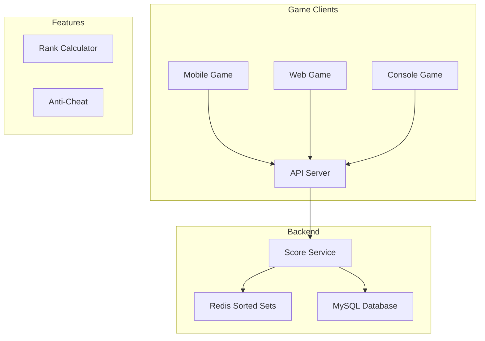
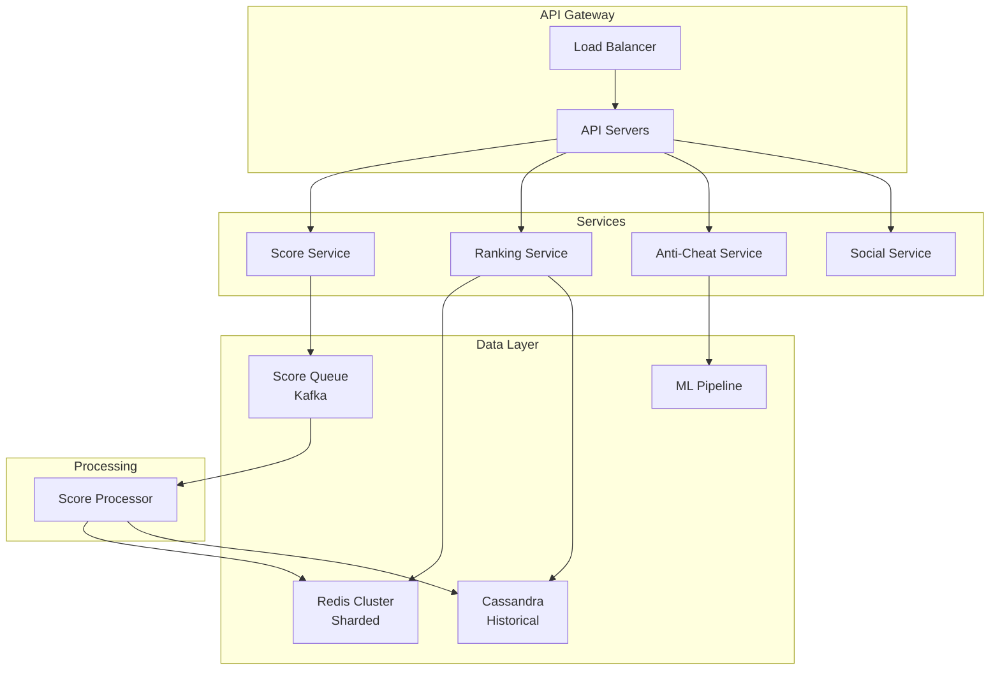
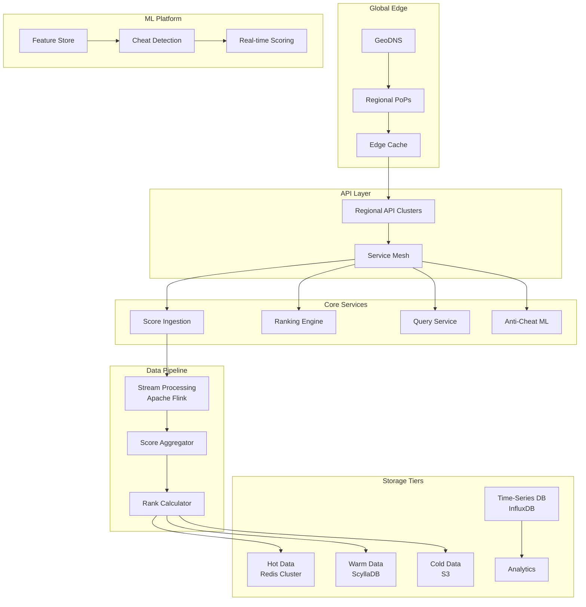
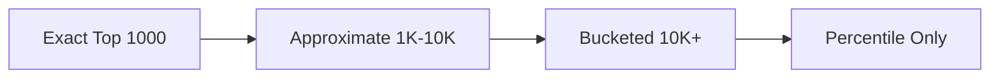

# Gaming Leaderboard - System Design Case Study

## 1. Problem Statement

Design a real-time gaming leaderboard system that can:
- Handle millions of concurrent players across multiple games
- Update scores in real-time with <100ms latency
- Support various leaderboard types (global, regional, friends, time-based)
- Prevent cheating and score manipulation
- Scale to billions of score updates per day
- Provide accurate rankings for any player instantly

### Real-World Context
- **Candy Crush**: 270M+ monthly active players
- **PUBG Mobile**: 1B+ downloads, 50M+ daily active users
- **Clash Royale**: Real-time PvP with instant leaderboards
- **Fortnite**: 400M+ registered players, massive concurrent events

## 2. Requirements Analysis

### Functional Requirements
1. **Score Management**
   - Submit scores with validation
   - Update player rankings in real-time
   - Support incremental and absolute scores
   - Handle score decay over time
   - Batch score updates for efficiency

2. **Leaderboard Types**
   - Global leaderboards (top N players)
   - Regional/country-based leaderboards
   - Friend leaderboards
   - Guild/clan leaderboards
   - Time-based (daily, weekly, seasonal)

3. **Query Operations**
   - Get player rank and score
   - Get top N players
   - Get players around a specific rank
   - Get percentile ranking
   - Search players by name

4. **Anti-Cheat Measures**
   - Score validation and bounds checking
   - Anomaly detection
   - Rate limiting
   - Replay validation
   - Statistical analysis

5. **Social Features**
   - Friend leaderboards
   - Push notifications for rank changes
   - Achievements and badges
   - Historical rank tracking
   - Tournament support

### Non-Functional Requirements
- **Scale**: 100M+ active players, 1B+ score updates/day
- **Latency**: <100ms for rank queries, <500ms for updates
- **Accuracy**: Exact rankings, no approximations
- **Availability**: 99.99% uptime
- **Consistency**: Eventually consistent within seconds
- **Fair Play**: Robust anti-cheat mechanisms

### Law Mapping
- **Law 2 (Asynchronous Reality )**: Real-time updates critical for engagement
- **Law 4 (Multidimensional Optimization )**: Memory constraints for millions of players
- **Law 1 (Correlated Failure )**: Graceful degradation during failures
- **Law 3 (Emergent Chaos )**: Handle concurrent score updates
- **Law 4 (Multidimensional Optimization )**: Distributed ranking coordination
- **Law 5 (Distributed Knowledge )**: Track cheating patterns
- **Law 6 (Cognitive Load )**: Simple API for game integration
- **Law 7 (Economic Reality )**: Cost-effective at scale

## 3. Architecture Evolution

### Stage 1: Basic Leaderboard (10K players)


### Stage 2: Distributed System (1M players)


### Stage 3: Global Scale Architecture (100M+ players)


## 4. Detailed Component Design

### 4.1 High-Performance Ranking Engine
```python
import asyncio
from typing import List, Dict, Optional, Tuple
import redis.asyncio as redis
from dataclasses import dataclass
import time
import numpy as np

@dataclass
class ScoreUpdate:
    player_id: str
    game_id: str
    score: int
    timestamp: int
    metadata: Dict[str, any]

class DistributedRankingEngine:
    """Manages player rankings across distributed Redis clusters"""
    
    def __init__(self, redis_clusters: Dict[str, redis.RedisCluster]):
        self.redis_clusters = redis_clusters
        self.sharding_strategy = ConsistentHashing(virtual_nodes=150)
        self.write_buffer = WriteBuffer(flush_interval=100)  # 100ms
        
    async def update_score(self, update: ScoreUpdate) -> RankingResult:
        """Update player score with batching for efficiency"""
        
# Add to write buffer for batching
        self.write_buffer.add(update)
        
# Get immediate result for response (may be slightly stale)
        current_rank = await self._get_player_rank_fast(
            update.game_id,
            update.player_id
        )
        
        return RankingResult(
            player_id=update.player_id,
            score=update.score,
            rank=current_rank,
            percentile=self._estimate_percentile(current_rank, update.game_id)
        )
    
    async def flush_score_updates(self):
        """Background task to flush buffered updates"""
        
        while True:
            updates = self.write_buffer.get_batch()
            
            if updates:
# Group by game and shard
                grouped_updates = self._group_updates_by_shard(updates)
                
# Process each group in parallel
                tasks = []
                for shard_key, shard_updates in grouped_updates.items():
                    task = self._process_shard_updates(shard_key, shard_updates)
                    tasks.append(task)
                
                await asyncio.gather(*tasks)
            
            await asyncio.sleep(0.1)  # 100ms flush interval
    
    async def _process_shard_updates(self, shard_key: str, 
                                    updates: List[ScoreUpdate]):
        """Process batch of updates for a single shard"""
        
        redis_client = self._get_redis_client(shard_key)
        
# Use pipeline for atomic batch update
        pipe = redis_client.pipeline()
        
        for update in updates:
# Update main leaderboard
            leaderboard_key = f"lb:{update.game_id}:global"
            pipe.zadd(leaderboard_key, {update.player_id: update.score})
            
# Update time-based leaderboards
            daily_key = f"lb:{update.game_id}:daily:{self._get_day_key()}"
            pipe.zadd(daily_key, {update.player_id: update.score})
            pipe.expire(daily_key, 86400 * 8)  # Keep for 8 days
            
            weekly_key = f"lb:{update.game_id}:weekly:{self._get_week_key()}"
            pipe.zadd(weekly_key, {update.player_id: update.score})
            pipe.expire(weekly_key, 86400 * 35)  # Keep for 5 weeks
            
# Update player metadata
            player_key = f"player:{update.game_id}::{update.player_id}"
            pipe.hset(player_key, mapping={
                'score': update.score,
                'last_update': update.timestamp,
                'metadata': json.dumps(update.metadata)
            })
            
# Track score history for anti-cheat
            history_key = f"history:{update.game_id}:{update.player_id}"
            pipe.zadd(history_key, {f"{update.timestamp}:{update.score}": update.timestamp})
            pipe.zremrangebyscore(history_key, 0, time.time() - 86400 * 7)  # 7 days
        
# Execute pipeline
        await pipe.execute()
        
# Trigger rank update notifications if needed
        await self._check_rank_changes(updates)
    
    async def get_leaderboard(self, game_id: str, 
                             leaderboard_type: str = "global",
                             start_rank: int = 0,
                             count: int = 100) -> List[PlayerScore]:
        """Get leaderboard with caching and sharding"""
        
# Check cache first
        cache_key = f"cache:lb:{game_id}:{leaderboard_type}:{start_rank}:{count}"
        cached = await self._get_from_cache(cache_key)
        if cached:
            return cached
        
# Determine which shards to query
        if leaderboard_type == "global":
# Global leaderboard may span multiple shards
            shard_results = await self._query_all_shards(
                game_id,
                start_rank,
                count
            )
            merged_results = self._merge_shard_results(shard_results)
        else:
# Time-based or regional leaderboards on single shard
            leaderboard_key = self._get_leaderboard_key(game_id, leaderboard_type)
            shard = self._get_shard_for_key(leaderboard_key)
            
            redis_client = self._get_redis_client(shard)
            results = await redis_client.zrevrange(
                leaderboard_key,
                start_rank,
                start_rank + count - 1,
                withscores=True
            )
            
            merged_results = [
                PlayerScore(
                    player_id=player_id,
                    score=int(score),
                    rank=start_rank + i + 1
                )
                for i, (player_id, score) in enumerate(results)
            ]
        
# Cache results
        await self._cache_results(cache_key, merged_results, ttl=60)
        
        return merged_results
    
    async def get_player_ranking(self, game_id: str, 
                                player_id: str,
                                include_surrounding: bool = False) -> PlayerRanking:
        """Get player's ranking with optional surrounding players"""
        
# Get player's score and rank from appropriate shard
        shard = self._get_shard_for_player(game_id, player_id)
        redis_client = self._get_redis_client(shard)
        
        leaderboard_key = f"lb:{game_id}:global"
        
# Get score
        score = await redis_client.zscore(leaderboard_key, player_id)
        if score is None:
            return None
        
# Get rank (Redis returns 0-based, we want 1-based)
        rank = await redis_client.zrevrank(leaderboard_key, player_id)
        rank = rank + 1 if rank is not None else None
        
# Get total players for percentile
        total_players = await redis_client.zcard(leaderboard_key)
        percentile = ((total_players - rank) / total_players) * 100 if rank else 0
        
        result = PlayerRanking(
            player_id=player_id,
            score=int(score),
            rank=rank,
            percentile=round(percentile, 2),
            total_players=total_players
        )
        
# Get surrounding players if requested
        if include_surrounding and rank:
# Get 5 players above and below
            start = max(0, rank - 6)
            end = rank + 5
            
            surrounding = await redis_client.zrevrange(
                leaderboard_key,
                start,
                end,
                withscores=True
            )
            
            result.surrounding_players = [
                PlayerScore(
                    player_id=pid,
                    score=int(sc),
                    rank=start + i + 1
                )
                for i, (pid, sc) in enumerate(surrounding)
                if pid != player_id
            ]
        
        return result
    
    def _get_shard_for_player(self, game_id: str, player_id: str) -> str:
        """Determine which shard holds a player's data"""
        
# Use consistent hashing for player distribution
        shard_key = f"{game_id}:{player_id}"
        return self.sharding_strategy.get_node(shard_key)
    
    async def _merge_shard_results(self, 
                                  shard_results: List[List[Tuple[str, float]]]) -> List[PlayerScore]:
        """Merge results from multiple shards maintaining order"""
        
# Use heap to efficiently merge sorted lists
        import heapq
        
# Create heap entries (score, player_id, shard_index, position)
        heap = []
        for shard_idx, results in enumerate(shard_results):
            if results:
# Redis returns highest scores first, so negate for min heap
                score = -results[0][1]
                heapq.heappush(heap, (score, results[0][0], shard_idx, 0))
        
        merged = []
        rank = 1
        
        while heap and len(merged) < 1000:  # Limit to prevent memory issues
            score, player_id, shard_idx, pos = heapq.heappop(heap)
            
            merged.append(PlayerScore(
                player_id=player_id,
                score=int(-score),  # Restore original score
                rank=rank
            ))
            rank += 1
            
# Add next item from the same shard
            if pos + 1 < len(shard_results[shard_idx]):
                next_item = shard_results[shard_idx][pos + 1]
                next_score = -next_item[1]
                heapq.heappush(heap, (next_score, next_item[0], shard_idx, pos + 1))
        
        return merged
```

### 4.2 Real-Time Score Processing Pipeline
```python
from kafka import KafkaConsumer, KafkaProducer
import apache_beam as beam
from apache_beam.options.pipeline_options import PipelineOptions

class ScoreProcessingPipeline:
    """Apache Beam pipeline for real-time score processing"""
    
    def __init__(self):
        self.pipeline_options = PipelineOptions([
            '--runner=FlinkRunner',
            '--streaming',
            '--parallelism=100',
            '--checkpoint_interval=60000'
        ])
        
    def build_pipeline(self):
        """Build the score processing pipeline"""
        
        with beam.Pipeline(options=self.pipeline_options) as pipeline:
            
# Read from Kafka
            scores = (
                pipeline
                | 'ReadFromKafka' >> beam.io.ReadFromKafka(
                    consumer_config={
                        'bootstrap.servers': 'kafka:9092',
                        'group.id': 'score-processor'
                    },
                    topics=['game-scores']
                )
                | 'ParseScores' >> beam.Map(self.parse_score_event)
            )
            
# Validate scores
            valid_scores, invalid_scores = (
                scores
                | 'ValidateScores' >> beam.Partition(
                    self.validate_score, 2
                )
            )
            
# Process invalid scores
            (
                invalid_scores
                | 'LogInvalid' >> beam.Map(self.log_invalid_score)
                | 'SendToDeadLetter' >> beam.io.WriteToKafka(
                    producer_config={'bootstrap.servers': 'kafka:9092'},
                    topic='invalid-scores'
                )
            )
            
# Window valid scores
            windowed_scores = (
                valid_scores
                | 'AddTimestamp' >> beam.Map(
                    lambda x: beam.window.TimestampedValue(x, x['timestamp'])
                )
                | 'Window' >> beam.WindowInto(
                    beam.window.FixedWindows(60)  # 1-minute windows
                )
            )
            
# Calculate aggregates per player
            player_aggregates = (
                windowed_scores
                | 'KeyByPlayer' >> beam.Map(
                    lambda x: ((x['game_id'], x['player_id']), x)
                )
                | 'GroupByPlayer' >> beam.GroupByKey()
                | 'AggregateScores' >> beam.Map(self.aggregate_player_scores)
            )
            
# Detect anomalies
            anomalies = (
                player_aggregates
                | 'DetectAnomalies' >> beam.FlatMap(self.detect_anomalies)
            )
            
# Update leaderboards
            (
                player_aggregates
                | 'FilterNormal' >> beam.Filter(
                    lambda x: x[1]['anomaly_score'] < 0.8
                )
                | 'UpdateLeaderboard' >> beam.Map(self.update_leaderboard)
            )
            
# Handle anomalies
            (
                anomalies
                | 'ProcessAnomalies' >> beam.Map(self.process_anomaly)
                | 'AlertOnAnomalies' >> beam.Map(self.send_anomaly_alert)
            )
            
# Calculate statistics
            stats = (
                windowed_scores
                | 'CalculateStats' >> beam.CombineGlobally(
                    self.calculate_window_stats
                ).without_defaults()
                | 'WriteStats' >> beam.Map(self.write_statistics)
            )
    
    def parse_score_event(self, kafka_message):
        """Parse Kafka message to score event"""
        
        try:
            data = json.loads(kafka_message.value)
            return {
                'game_id': data['game_id'],
                'player_id': data['player_id'],
                'score': int(data['score']),
                'timestamp': data['timestamp'],
                'session_id': data.get('session_id'),
                'platform': data.get('platform'),
                'version': data.get('version'),
                'metadata': data.get('metadata', {})
            }
        except Exception as e:
            logging.error(f"Failed to parse score event: {e}")
            return None
    
    def validate_score(self, score_event):
        """Validate score event"""
        
        if not score_event:
            return 1  # Invalid partition
        
# Check required fields
        required_fields = ['game_id', 'player_id', 'score', 'timestamp']
        if not all(field in score_event for field in required_fields):
            return 1
        
# Check score bounds
        if score_event['score'] < 0 or score_event['score'] > 999999999:
            return 1
        
# Check timestamp (not future, not too old)
        current_time = time.time()
        if score_event['timestamp'] > current_time + 300:  # 5 min future
            return 1
        if score_event['timestamp'] < current_time - 86400:  # 1 day old
            return 1
        
        return 0  # Valid partition
    
    def detect_anomalies(self, player_aggregate):
        """Detect anomalous scoring patterns"""
        
        key, scores = player_aggregate
        game_id, player_id = key
        
        anomalies = []
        
# Sort scores by timestamp
        sorted_scores = sorted(scores, key=lambda x: x['timestamp'])
        
# Check for impossible score jumps
        for i in range(1, len(sorted_scores)):
            prev_score = sorted_scores[i-1]['score']
            curr_score = sorted_scores[i]['score']
            time_diff = sorted_scores[i]['timestamp'] - sorted_scores[i-1]['timestamp']
            
            score_rate = (curr_score - prev_score) / max(time_diff, 1)
            
# Game-specific thresholds
            max_rate = self.get_max_score_rate(game_id)
            
            if score_rate > max_rate:
                anomalies.append({
                    'type': 'impossible_score_rate',
                    'player_id': player_id,
                    'game_id': game_id,
                    'score_rate': score_rate,
                    'max_allowed': max_rate,
                    'timestamp': sorted_scores[i]['timestamp']
                })
        
# Check for suspicious patterns
        if len(scores) > 10:
            score_values = [s['score'] for s in sorted_scores]
            
# Check for identical scores (bot behavior)
            unique_scores = len(set(score_values))
            if unique_scores == 1 and len(score_values) > 5:
                anomalies.append({
                    'type': 'identical_scores',
                    'player_id': player_id,
                    'game_id': game_id,
                    'count': len(score_values)
                })
            
# Check for mathematical patterns
            if self.has_mathematical_pattern(score_values):
                anomalies.append({
                    'type': 'mathematical_pattern',
                    'player_id': player_id,
                    'game_id': game_id,
                    'scores': score_values
                })
        
        return anomalies
    
    def aggregate_player_scores(self, player_data):
        """Aggregate scores for a player in a window"""
        
        key, scores = player_data
        game_id, player_id = key
        
        scores_list = list(scores)
        
# Calculate aggregates
        total_score = sum(s['score'] for s in scores_list)
        max_score = max(s['score'] for s in scores_list)
        avg_score = total_score / len(scores_list)
        score_variance = np.var([s['score'] for s in scores_list])
        
# Calculate anomaly score
        anomaly_score = self.calculate_anomaly_score(scores_list)
        
        return key, {
            'player_id': player_id,
            'game_id': game_id,
            'total_score': total_score,
            'max_score': max_score,
            'avg_score': avg_score,
            'score_variance': score_variance,
            'update_count': len(scores_list),
            'anomaly_score': anomaly_score,
            'timestamp': max(s['timestamp'] for s in scores_list)
        }
```

### 4.3 Anti-Cheat System
```python
import tensorflow as tf
from sklearn.ensemble import IsolationForest
import pandas as pd

class AntiCheatEngine:
    """ML-based anti-cheat system for leaderboards"""
    
    def __init__(self):
        self.anomaly_detector = self._load_anomaly_model()
        self.pattern_classifier = self._load_pattern_classifier()
        self.statistical_analyzer = StatisticalAnalyzer()
        self.replay_validator = ReplayValidator()
        
    async def analyze_player_behavior(self, player_id: str, 
                                     game_id: str) -> CheatAnalysis:
        """Comprehensive cheat analysis for a player"""
        
# Get player's recent history
        history = await self._get_player_history(player_id, game_id, days=7)
        
# Extract features
        features = self._extract_behavioral_features(history)
        
# Run anomaly detection
        anomaly_score = self.anomaly_detector.decision_function(
            features.reshape(1, -1)
        )[0]
        
# Check for known cheat patterns
        pattern_probabilities = self.pattern_classifier.predict_proba(
            features.reshape(1, -1)
        )[0]
        
# Statistical analysis
        statistical_flags = self.statistical_analyzer.analyze(history)
        
# Replay validation (if replays available)
        replay_valid = True
        if history.get('replays'):
            replay_valid = await self.replay_validator.validate_replays(
                history['replays']
            )
        
# Combine signals
        cheat_probability = self._combine_signals(
            anomaly_score,
            pattern_probabilities,
            statistical_flags,
            replay_valid
        )
        
# Determine action
        action = self._determine_action(cheat_probability)
        
        return CheatAnalysis(
            player_id=player_id,
            game_id=game_id,
            cheat_probability=cheat_probability,
            anomaly_score=anomaly_score,
            detected_patterns=self._get_detected_patterns(pattern_probabilities),
            statistical_flags=statistical_flags,
            replay_valid=replay_valid,
            recommended_action=action,
            confidence=self._calculate_confidence(features)
        )
    
    def _extract_behavioral_features(self, history: Dict) -> np.array:
        """Extract features for ML models"""
        
        features = []
        
        scores = history['scores']
        timestamps = history['timestamps']
        
# Time-based features
        play_sessions = self._identify_sessions(timestamps)
        features.extend([
            len(play_sessions),  # Number of sessions
            np.mean([len(s) for s in play_sessions]),  # Avg session length
            np.std([len(s) for s in play_sessions]),  # Session length variance
            self._calculate_play_regularity(timestamps),  # How regular they play
        ])
        
# Score progression features
        features.extend([
            np.mean(scores),
            np.std(scores),
            np.max(scores),
            self._calculate_score_velocity(scores, timestamps),
            self._calculate_score_acceleration(scores, timestamps),
            self._detect_score_jumps(scores)
        ])
        
# Pattern detection features
        features.extend([
            self._has_round_number_bias(scores),
            self._has_sequential_pattern(scores),
            self._calculate_entropy(scores),
            self._detect_automation_patterns(timestamps)
        ])
        
# Performance consistency features
        if 'game_metrics' in history:
            metrics = history['game_metrics']
            features.extend([
                self._calculate_aim_consistency(metrics),
                self._calculate_reaction_time_variance(metrics),
                self._detect_superhuman_performance(metrics)
            ])
        
        return np.array(features)
    
    def _load_anomaly_model(self):
        """Load pre-trained anomaly detection model"""
        
# In production, load actual trained model
# For demo, using Isolation Forest
        model = IsolationForest(
            n_estimators=100,
            contamination=0.01,
            random_state=42
        )
        
# Train on historical normal player data
# model.fit(normal_player_features)
        
        return model
    
    def _load_pattern_classifier(self):
        """Load pattern classification model"""
        
# In production, this would be a trained neural network
# that classifies different types of cheating patterns
        
        model = tf.keras.Sequential([
            tf.keras.layers.Dense(64, activation='relu'),
            tf.keras.layers.Dropout(0.3),
            tf.keras.layers.Dense(32, activation='relu'),
            tf.keras.layers.Dropout(0.3),
            tf.keras.layers.Dense(5, activation='softmax')  # 5 cheat types
        ])
        
# model.load_weights('cheat_classifier.h5')
        
        return model
    
    def _detect_automation_patterns(self, timestamps: List[float]) -> float:
        """Detect automated play patterns from timestamps"""
        
        if len(timestamps) < 10:
            return 0.0
        
# Calculate intervals between actions
        intervals = np.diff(sorted(timestamps))
        
# Check for suspiciously regular intervals (bot behavior)
        interval_variance = np.var(intervals)
        interval_mean = np.mean(intervals)
        
# Low variance relative to mean suggests automation
        if interval_mean > 0:
            regularity_score = 1 - (interval_variance / interval_mean)
        else:
            regularity_score = 0
        
# Check for exact repeated intervals
        unique_intervals = len(np.unique(np.round(intervals, 2)))
        repetition_score = 1 - (unique_intervals / len(intervals))
        
        return (regularity_score + repetition_score) / 2
    
    def _determine_action(self, cheat_probability: float) -> str:
        """Determine action based on cheat probability"""
        
        if cheat_probability < 0.3:
            return "none"
        elif cheat_probability < 0.6:
            return "monitor"
        elif cheat_probability < 0.8:
            return "flag_for_review"
        elif cheat_probability < 0.95:
            return "shadow_ban"
        else:
            return "ban"
```

### 4.4 Friend and Social Leaderboards
```python
class SocialLeaderboardManager:
    """Manages friend-based and social leaderboards"""
    
    def __init__(self, social_graph: SocialGraphService,
                 ranking_engine: DistributedRankingEngine):
        self.social_graph = social_graph
        self.ranking_engine = ranking_engine
        self.friend_cache = FriendCache()
        
    async def get_friend_leaderboard(self, player_id: str,
                                     game_id: str,
                                     include_self: bool = True) -> List[PlayerScore]:
        """Get leaderboard of player's friends"""
        
# Get friend list with caching
        cache_key = f"friends:{player_id}"
        friends = await self.friend_cache.get(cache_key)
        
        if not friends:
            friends = await self.social_graph.get_friends(player_id)
            await self.friend_cache.set(cache_key, friends, ttl=3600)
        
# Include self if requested
        if include_self:
            friends.append(player_id)
        
# Get scores for all friends in parallel
        score_tasks = []
        for friend_id in friends:
            task = self.ranking_engine.get_player_score(game_id, friend_id)
            score_tasks.append(task)
        
        scores = await asyncio.gather(*score_tasks, return_exceptions=True)
        
# Filter out errors and None results
        valid_scores = []
        for friend_id, score_result in zip(friends, scores):
            if not isinstance(score_result, Exception) and score_result:
                valid_scores.append(PlayerScore(
                    player_id=friend_id,
                    score=score_result.score,
                    rank=None  # Will be calculated
                ))
        
# Sort by score descending
        valid_scores.sort(key=lambda x: x.score, reverse=True)
        
# Assign friend ranks
        for i, player_score in enumerate(valid_scores):
            player_score.rank = i + 1
            player_score.friend_rank = i + 1
            
# Get global rank
            global_ranking = await self.ranking_engine.get_player_ranking(
                game_id,
                player_score.player_id
            )
            if global_ranking:
                player_score.global_rank = global_ranking.rank
        
        return valid_scores
    
    async def get_guild_leaderboard(self, guild_id: str,
                                   game_id: str) -> GuildLeaderboard:
        """Get leaderboard for a guild/clan"""
        
# Get guild members
        guild_members = await self.social_graph.get_guild_members(guild_id)
        
# Get individual scores
        member_scores = []
        total_score = 0
        
        for member_id in guild_members:
            score_data = await self.ranking_engine.get_player_score(
                game_id,
                member_id
            )
            
            if score_data:
                member_scores.append({
                    'player_id': member_id,
                    'score': score_data.score,
                    'contribution': score_data.score  # Could be weighted
                })
                total_score += score_data.score
        
# Sort members by contribution
        member_scores.sort(key=lambda x: x['contribution'], reverse=True)
        
# Get guild's rank among other guilds
        guild_rank = await self._get_guild_rank(guild_id, game_id, total_score)
        
        return GuildLeaderboard(
            guild_id=guild_id,
            total_score=total_score,
            guild_rank=guild_rank,
            member_count=len(member_scores),
            top_contributors=member_scores[:10],
            average_score=total_score / len(member_scores) if member_scores else 0
        )
    
    async def notify_rank_changes(self, player_id: str,
                                 old_rank: int,
                                 new_rank: int,
                                 game_id: str):
        """Send notifications for significant rank changes"""
        
# Determine if change is significant
        rank_change = old_rank - new_rank  # Positive means improvement
        
        if abs(rank_change) < 10 and new_rank > 100:
            return  # Not significant enough
        
# Get friends who might be interested
        friends = await self.social_graph.get_friends(player_id)
        
# Check which friends play this game
        game_friends = []
        for friend_id in friends:
            if await self._plays_game(friend_id, game_id):
                game_friends.append(friend_id)
        
# Create notification
        notification = {
            'type': 'rank_change',
            'player_id': player_id,
            'game_id': game_id,
            'old_rank': old_rank,
            'new_rank': new_rank,
            'change': rank_change,
            'timestamp': time.time()
        }
        
# Send to interested friends
        if rank_change > 0:  # Improved rank
# Notify friends if player passed them
            for friend_id in game_friends:
                friend_rank = await self._get_player_rank(friend_id, game_id)
                if friend_rank and new_rank < friend_rank <= old_rank:
                    await self._send_notification(
                        friend_id,
                        f"{player_id} just passed you in {game_id}!"
                    )
        
# Achievement notifications
        if new_rank <= 10:
            await self._send_achievement_notification(
                player_id,
                f"You reached Top 10 in {game_id}!"
            )
        elif new_rank <= 100 and old_rank > 100:
            await self._send_achievement_notification(
                player_id,
                f"You reached Top 100 in {game_id}!"
            )
```

### 4.5 Tournament System
```python
class TournamentManager:
    """Manages competitive tournaments with leaderboards"""
    
    def __init__(self):
        self.active_tournaments = {}
        self.ranking_engine = TournamentRankingEngine()
        self.prize_distributor = PrizeDistributor()
        
    async def create_tournament(self, config: TournamentConfig) -> Tournament:
        """Create a new tournament"""
        
        tournament = Tournament(
            id=str(uuid.uuid4()),
            game_id=config.game_id,
            name=config.name,
            type=config.tournament_type,
            start_time=config.start_time,
            end_time=config.end_time,
            entry_fee=config.entry_fee,
            prize_pool=config.prize_pool,
            max_participants=config.max_participants,
            rules=config.rules
        )
        
# Initialize tournament leaderboard
        await self.ranking_engine.initialize_tournament(tournament)
        
# Store tournament
        self.active_tournaments[tournament.id] = tournament
        
# Schedule tournament phases
        await self._schedule_tournament_phases(tournament)
        
        return tournament
    
    async def join_tournament(self, tournament_id: str,
                            player_id: str) -> JoinResult:
        """Player joins a tournament"""
        
        tournament = self.active_tournaments.get(tournament_id)
        if not tournament:
            return JoinResult(success=False, error="Tournament not found")
        
# Check eligibility
        eligibility = await self._check_eligibility(tournament, player_id)
        if not eligibility.is_eligible:
            return JoinResult(success=False, error=eligibility.reason)
        
# Process entry fee
        if tournament.entry_fee > 0:
            payment_result = await self._process_entry_fee(
                player_id,
                tournament.entry_fee
            )
            if not payment_result.success:
                return JoinResult(success=False, error="Payment failed")
        
# Add to tournament
        await self.ranking_engine.add_participant(tournament_id, player_id)
        
# Update participant count
        tournament.current_participants += 1
        
        return JoinResult(
            success=True,
            tournament_id=tournament_id,
            start_time=tournament.start_time
        )
    
    async def update_tournament_score(self, tournament_id: str,
                                    player_id: str,
                                    score: int):
        """Update player's tournament score"""
        
        tournament = self.active_tournaments.get(tournament_id)
        if not tournament:
            return
        
# Validate tournament is active
        current_time = datetime.utcnow()
        if current_time < tournament.start_time or current_time > tournament.end_time:
            return  # Tournament not active
        
# Validate player is participant
        if not await self._is_participant(tournament_id, player_id):
            return
        
# Update score with special tournament rules
        adjusted_score = self._apply_tournament_rules(
            score,
            tournament.rules
        )
        
# Update in tournament leaderboard
        await self.ranking_engine.update_tournament_score(
            tournament_id,
            player_id,
            adjusted_score
        )
        
# Check for milestones
        await self._check_tournament_milestones(
            tournament,
            player_id,
            adjusted_score
        )
    
    async def finalize_tournament(self, tournament_id: str):
        """Finalize tournament and distribute prizes"""
        
        tournament = self.active_tournaments.get(tournament_id)
        if not tournament:
            return
        
# Get final rankings
        final_rankings = await self.ranking_engine.get_tournament_final_rankings(
            tournament_id
        )
        
# Determine winners based on tournament type
        if tournament.type == "TOP_N":
            winners = final_rankings[:tournament.prize_positions]
        elif tournament.type == "BRACKET":
            winners = await self._determine_bracket_winners(tournament_id)
        elif tournament.type == "THRESHOLD":
            winners = [p for p in final_rankings 
                      if p.score >= tournament.score_threshold]
        
# Distribute prizes
        prize_distribution = await self.prize_distributor.distribute_prizes(
            tournament.prize_pool,
            winners,
            tournament.prize_structure
        )
        
# Record results
        tournament_result = TournamentResult(
            tournament_id=tournament_id,
            final_rankings=final_rankings,
            winners=winners,
            prize_distribution=prize_distribution,
            statistics=await self._calculate_tournament_stats(tournament_id)
        )
        
# Store results
        await self._store_tournament_results(tournament_result)
        
# Notify participants
        await self._notify_tournament_results(tournament_result)
        
# Clean up
        del self.active_tournaments[tournament_id]
        
        return tournament_result
```

## 5. Advanced Features

### 5.1 Real-Time Rank Change Notifications
```python
class RankChangeNotifier:
    """Real-time notifications for rank changes"""
    
    def __init__(self):
        self.websocket_manager = WebSocketManager()
        self.push_service = PushNotificationService()
        self.rank_tracker = RankTracker()
        
    async def track_rank_changes(self):
        """Monitor for significant rank changes"""
        
        while True:
# Get recent score updates
            recent_updates = await self.get_recent_updates()
            
# Group by game
            games_affected = {}
            for update in recent_updates:
                if update.game_id not in games_affected:
                    games_affected[update.game_id] = []
                games_affected[update.game_id].append(update.player_id)
            
# Check rank changes for each game
            for game_id, affected_players in games_affected.items():
                await self._process_game_rank_changes(game_id, affected_players)
            
            await asyncio.sleep(5)  # Check every 5 seconds
    
    async def _process_game_rank_changes(self, game_id: str,
                                        affected_players: List[str]):
        """Process rank changes for a game"""
        
# Get current top 100
        current_top_100 = await self.ranking_engine.get_leaderboard(
            game_id,
            start_rank=0,
            count=100
        )
        
# Get previous top 100
        previous_top_100 = await self.rank_tracker.get_previous_ranks(
            game_id,
            'top_100'
        )
        
# Find changes
        current_dict = {p.player_id: p.rank for p in current_top_100}
        previous_dict = {p.player_id: p.rank for p in previous_top_100}
        
# New entries to top 100
        new_entries = set(current_dict.keys()) - set(previous_dict.keys())
        for player_id in new_entries:
            await self._notify_player(
                player_id,
                f"Congratulations! You entered Top 100 at rank {current_dict[player_id]}!"
            )
        
# Rank improvements
        for player_id in current_dict:
            if player_id in previous_dict:
                old_rank = previous_dict[player_id]
                new_rank = current_dict[player_id]
                
                if new_rank < old_rank:  # Improved
                    improvement = old_rank - new_rank
                    if improvement >= 10:  # Significant improvement
                        await self._notify_player(
                            player_id,
                            f"Great job! You climbed {improvement} ranks to #{new_rank}!"
                        )
                    
# Check if passed friends
                    await self._check_friend_overtakes(
                        player_id,
                        game_id,
                        old_rank,
                        new_rank
                    )
        
# Update tracker
        await self.rank_tracker.update_ranks(game_id, 'top_100', current_top_100)
```

### 5.2 Seasonal Leaderboards
```python
class SeasonalLeaderboardManager:
    """Manages seasonal competitive leaderboards"""
    
    def __init__(self):
        self.season_config = SeasonConfiguration()
        self.reward_system = SeasonRewardSystem()
        self.rank_decay = RankDecayEngine()
        
    async def start_new_season(self, game_id: str, 
                              season_config: SeasonConfig) -> Season:
        """Start a new competitive season"""
        
        season = Season(
            id=str(uuid.uuid4()),
            game_id=game_id,
            season_number=season_config.number,
            start_date=season_config.start_date,
            end_date=season_config.end_date,
            theme=season_config.theme,
            rewards=season_config.rewards
        )
        
# Archive previous season
        if season_config.number > 1:
            await self._archive_previous_season(game_id, season_config.number - 1)
        
# Reset seasonal leaderboards
        await self._reset_seasonal_leaderboards(game_id)
        
# Initialize placement matches if required
        if season_config.placement_matches:
            await self._initialize_placement_system(game_id)
        
# Apply rank reset/soft reset
        if season_config.rank_reset_type == "SOFT":
            await self._apply_soft_reset(game_id, season_config.reset_factor)
        elif season_config.rank_reset_type == "HARD":
            await self._apply_hard_reset(game_id)
        
# Store season
        await self._store_season(season)
        
# Notify players
        await self._notify_season_start(game_id, season)
        
        return season
    
    async def calculate_seasonal_rewards(self, game_id: str,
                                       season_id: str) -> Dict[str, Rewards]:
        """Calculate end-of-season rewards"""
        
# Get final rankings
        final_rankings = await self.ranking_engine.get_seasonal_leaderboard(
            game_id,
            season_id
        )
        
        rewards_by_player = {}
        
        for ranking in final_rankings:
            player_rewards = []
            
# Rank-based rewards
            if ranking.rank == 1:
                player_rewards.extend(self.reward_system.get_champion_rewards())
            elif ranking.rank <= 10:
                player_rewards.extend(self.reward_system.get_top_10_rewards())
            elif ranking.rank <= 100:
                player_rewards.extend(self.reward_system.get_top_100_rewards())
            elif ranking.rank <= 1000:
                player_rewards.extend(self.reward_system.get_top_1000_rewards())
            
# Percentile-based rewards
            if ranking.percentile >= 99:
                player_rewards.append(Reward(
                    type="TITLE",
                    value="Top 1% Player"
                ))
            elif ranking.percentile >= 95:
                player_rewards.append(Reward(
                    type="BADGE",
                    value="Elite Player"
                ))
            
# Participation rewards
            if ranking.games_played >= 100:
                player_rewards.append(Reward(
                    type="CURRENCY",
                    value=1000
                ))
            
            rewards_by_player[ranking.player_id] = player_rewards
        
        return rewards_by_player
    
    async def apply_rank_decay(self, game_id: str):
        """Apply rank decay for inactive players"""
        
# Get all players with last activity
        player_activities = await self._get_player_activities(game_id)
        
        current_time = datetime.utcnow()
        decay_updates = []
        
        for player_id, last_activity in player_activities.items():
            days_inactive = (current_time - last_activity).days
            
            if days_inactive > 7:  # Start decay after 7 days
                current_score = await self.ranking_engine.get_player_score(
                    game_id,
                    player_id
                )
                
                if current_score:
# Calculate decay amount
                    decay_rate = self.rank_decay.calculate_decay_rate(
                        current_score.score,
                        days_inactive,
                        current_score.rank
                    )
                    
                    new_score = max(
                        0,
                        current_score.score - decay_rate
                    )
                    
                    decay_updates.append({
                        'player_id': player_id,
                        'old_score': current_score.score,
                        'new_score': new_score,
                        'decay_amount': decay_rate
                    })
        
# Apply decay updates in batch
        if decay_updates:
            await self._apply_decay_updates(game_id, decay_updates)
```

### 5.3 Cross-Game Leaderboards
```python
class CrossGameLeaderboardSystem:
    """Manages leaderboards across multiple games"""
    
    def __init__(self):
        self.game_registry = GameRegistry()
        self.universal_ranking = UniversalRankingEngine()
        self.achievement_tracker = AchievementTracker()
        
    async def calculate_universal_score(self, player_id: str) -> UniversalScore:
        """Calculate player's universal score across all games"""
        
# Get all games player has participated in
        player_games = await self.game_registry.get_player_games(player_id)
        
        game_scores = []
        total_weighted_score = 0
        total_weight = 0
        
        for game_id in player_games:
# Get player's ranking in this game
            ranking = await self.ranking_engine.get_player_ranking(
                game_id,
                player_id
            )
            
            if ranking:
# Get game metadata
                game_meta = await self.game_registry.get_game_metadata(game_id)
                
# Calculate normalized score (0-1000 scale)
                normalized_score = self._normalize_score(
                    ranking.score,
                    ranking.percentile,
                    game_meta
                )
                
# Weight by game popularity and competitive level
                weight = self._calculate_game_weight(game_meta)
                
                game_scores.append({
                    'game_id': game_id,
                    'score': ranking.score,
                    'normalized_score': normalized_score,
                    'percentile': ranking.percentile,
                    'weight': weight
                })
                
                total_weighted_score += normalized_score * weight
                total_weight += weight
        
# Calculate universal score
        universal_score = total_weighted_score / total_weight if total_weight > 0 else 0
        
# Calculate universal rank
        universal_rank = await self.universal_ranking.get_rank(
            player_id,
            universal_score
        )
        
        return UniversalScore(
            player_id=player_id,
            universal_score=round(universal_score, 2),
            universal_rank=universal_rank,
            game_scores=game_scores,
            total_games=len(game_scores),
            achievements=await self.achievement_tracker.get_cross_game_achievements(player_id)
        )
    
    def _normalize_score(self, score: int, percentile: float, 
                        game_meta: GameMetadata) -> float:
        """Normalize score to 0-1000 scale"""
        
# Use percentile-based normalization
# Top 1% = 900-1000
# Top 10% = 700-900
# Top 50% = 300-700
# Rest = 0-300
        
        if percentile >= 99:
            return 900 + (percentile - 99) * 100
        elif percentile >= 90:
            return 700 + (percentile - 90) * 20
        elif percentile >= 50:
            return 300 + (percentile - 50) * 8
        else:
            return percentile * 6
```

## 6. Performance Optimizations

### 6.1 Caching Strategy
```python
class LeaderboardCacheManager:
    """Multi-layer caching for leaderboard data"""
    
    def __init__(self):
        self.edge_cache = EdgeCache()  # CDN level
        self.redis_cache = RedisCache()  # Application level
        self.local_cache = LocalLRUCache(max_size=10000)  # Process level
        
    async def get_cached_leaderboard(self, cache_key: str) -> Optional[List]:
        """Get leaderboard from cache hierarchy"""
        
# L1: Local cache (microseconds)
        result = self.local_cache.get(cache_key)
        if result:
            return result
        
# L2: Redis cache (milliseconds)
        result = await self.redis_cache.get(cache_key)
        if result:
            self.local_cache.set(cache_key, result, ttl=10)
            return result
        
# L3: Edge cache (tens of milliseconds)
        result = await self.edge_cache.get(cache_key)
        if result:
            await self.redis_cache.set(cache_key, result, ttl=60)
            self.local_cache.set(cache_key, result, ttl=10)
            return result
        
        return None
    
    async def cache_leaderboard(self, cache_key: str, 
                               data: List,
                               ttl: int = 60):
        """Cache leaderboard data at all levels"""
        
# Cache at all levels with different TTLs
        self.local_cache.set(cache_key, data, ttl=min(ttl, 10))
        await self.redis_cache.set(cache_key, data, ttl=ttl)
        await self.edge_cache.set(cache_key, data, ttl=ttl * 2)
```

### 6.2 Sharding Strategy
```python
class LeaderboardShardingStrategy:
    """Intelligent sharding for leaderboards"""
    
    def __init__(self, num_shards: int = 64):
        self.num_shards = num_shards
        self.shard_map = ConsistentHashMap(virtual_nodes=150)
        
    def get_shard_for_game(self, game_id: str) -> int:
        """Determine shard for a game"""
        
# Use consistent hashing
        return self.shard_map.get_shard(game_id) % self.num_shards
    
    def get_shards_for_query(self, query_type: str, 
                           game_id: str) -> List[int]:
        """Determine which shards to query"""
        
        if query_type == "global_top_n":
# Need to query all shards for global leaderboard
            return list(range(self.num_shards))
        elif query_type == "player_rank":
# Only need the game's primary shard
            return [self.get_shard_for_game(game_id)]
        elif query_type == "friend_leaderboard":
# May need multiple shards for friends
# This is optimized by co-locating friends when possible
            return self._get_friend_shards(game_id)
```

## 7. Monitoring and Analytics

### 7.1 Real-Time Metrics
```python
class LeaderboardMetrics:
    """Comprehensive metrics for leaderboard system"""
    
    def __init__(self):
        self.metrics_collector = MetricsCollector()
        self.anomaly_detector = AnomalyDetector()
        
    async def track_operation(self, operation: str, 
                            game_id: str,
                            latency: float,
                            success: bool):
        """Track leaderboard operations"""
        
# Record metrics
        await self.metrics_collector.record({
            'operation': operation,
            'game_id': game_id,
            'latency': latency,
            'success': success,
            'timestamp': time.time()
        })
        
# Check for anomalies
        if latency > 1000:  # 1 second
            await self.anomaly_detector.report_slow_operation(
                operation,
                game_id,
                latency
            )
        
# Update dashboards
        await self._update_grafana_metrics(operation, latency, success)
```

### 7.2 Cheat Detection Analytics
```python
class CheatAnalytics:
    """Analytics for anti-cheat system"""
    
    async def analyze_cheat_patterns(self, game_id: str) -> CheatReport:
        """Analyze cheating patterns in a game"""
        
# Get recent cheat detections
        recent_cheats = await self.get_recent_detections(game_id, days=7)
        
# Analyze patterns
        report = CheatReport(game_id=game_id)
        
# Time-based analysis
        report.peak_cheat_hours = self._analyze_temporal_patterns(recent_cheats)
        
# Score distribution analysis
        report.suspicious_score_ranges = self._analyze_score_patterns(recent_cheats)
        
# Player behavior clusters
        report.cheat_clusters = self._identify_cheat_clusters(recent_cheats)
        
# Effectiveness metrics
        report.detection_accuracy = await self._calculate_detection_accuracy(game_id)
        report.false_positive_rate = await self._calculate_false_positive_rate(game_id)
        
        return report
```

## 8. Failure Scenarios and Recovery

### 8.1 Handling Redis Cluster Failure
```python
class RedisFailoverHandler:
    """Handle Redis cluster failures gracefully"""
    
    async def handle_redis_failure(self, failed_cluster: str):
        """Coordinate failover when Redis cluster fails"""
        
        logger.critical(f"Redis cluster {failed_cluster} failed")
        
# Switch to backup cluster
        backup_cluster = self.get_backup_cluster(failed_cluster)
        
# Redirect traffic
        await self.load_balancer.redirect_traffic(
            from_cluster=failed_cluster,
            to_cluster=backup_cluster
        )
        
# Start recovery process
        asyncio.create_task(self._recover_failed_cluster(failed_cluster))
        
# Notify operations team
        await self.alert_manager.send_critical_alert(
            f"Redis cluster {failed_cluster} failed, switched to {backup_cluster}"
        )
```

### 8.2 Score Corruption Recovery
```python
class ScoreCorruptionRecovery:
    """Recover from score data corruption"""
    
    async def detect_and_fix_corruption(self, game_id: str):
        """Detect and fix corrupted scores"""
        
# Get score snapshots
        current_scores = await self.get_current_scores(game_id)
        historical_scores = await self.get_historical_scores(game_id, hours_ago=1)
        
        corrupted_players = []
        
        for player_id, current_score in current_scores.items():
            historical_score = historical_scores.get(player_id, 0)
            
# Check for impossible score jumps
            if current_score > historical_score * 100:  # 100x increase
                corrupted_players.append({
                    'player_id': player_id,
                    'current_score': current_score,
                    'historical_score': historical_score
                })
        
# Fix corrupted scores
        for player in corrupted_players:
# Restore from backup
            await self.restore_player_score(
                game_id,
                player['player_id'],
                player['historical_score']
            )
            
# Log incident
            await self.incident_logger.log_corruption(
                game_id,
                player['player_id'],
                player
            )
```

## 9. Real-World Patterns and Lessons

### 9.1 Clash Royale's Trophy System
Supercell's Clash Royale uses a trophy-based system with:
- **Trophy Road**: Rewards at specific trophy milestones
- **Season Reset**: Soft reset above 4000 trophies
- **Trophy Inflation**: Controlled through win/loss ratios
- **Regional Leaderboards**: Separate by country

### 9.2 Fortnite's Arena Mode
Epic Games' competitive system features:
- **Hype Points**: Accumulative scoring system
- **Bus Fare**: Points deducted for playing (anti-inflation)
- **Division System**: Bronze through Champion leagues
- **Skill-Based Matchmaking**: Based on current points

## 10. Alternative Architectures

### 10.1 Approximate Rankings
For massive scale, consider approximate algorithms:


### 10.2 Blockchain Leaderboards
- **Immutable Scores**: Can't be tampered
- **Decentralized Validation**: No central authority
- **Smart Contract Rewards**: Automatic prize distribution
- **Challenges**: Cost, speed, complexity

## 11. Industry Insights

### Key Design Decisions
1. **Real-time vs Batch**: Balance latency and efficiency
2. **Exact vs Approximate**: Trade accuracy for scale
3. **Global vs Sharded**: Balance consistency and performance
4. **Prevention vs Detection**: Anti-cheat strategy
5. **Social vs Competitive**: Feature focus

### Future Trends
- **AI-Powered Matchmaking**: Better competitive balance
- **Cross-Platform Leaderboards**: Unified gaming ecosystem
- **Blockchain Integration**: Decentralized competitive gaming
- **VR/AR Leaderboards**: Spatial competitions
- **Predictive Anti-Cheat**: ML-based prevention

*"The leaderboard is not just a ranking system; it's the heartbeat of competitive gaming."* - Clash Royale Team