# ☁ Google Drive Cloud Storage Architecture

## Table of Contents

- [Introduction](#introduction)
- [Part 1: Concept Map - The Physics of Distributed Storage](#part-1-concept-map-the-physics-of-distributed-storage)
  - [Law 2: Asynchronous Reality - Making Cloud Feel Local](#law-2-asynchronous-reality-making-cloud-feel-local)
  - [Law 4: Trade-offs - The Exabyte Challenge](#law-4-trade-offs-the-exabyte-challenge)
  - [Law 1: Failure - Data Durability and Availability](#law-1-failure-data-durability-and-availability)
  - [Law 3: Emergence - Real-time Collaboration](#law-3-emergence-real-time-collaboration)
  - [Law 4: Trade-offs - Global Consistency](#law-4-trade-offs-global-consistency)
  - [Law 5: Epistemology - Understanding System Health](#law-5-epistemology-understanding-system-health)
  - [Law 6: Human-API - Seamless User Experience](#law-6-human-api-seamless-user-experience)
  - [Law 7: Economics - Balancing Features and Costs](#law-7-economics-balancing-features-and-costs)
- [Part 2: Comprehensive Law Analysis Matrix](#part-2-comprehensive-law-analysis-matrix)
  - [Law Mapping for Core Design Decisions](#law-mapping-for-core-design-decisions)
  - [Detailed Law Interaction Analysis](#detailed-law-interaction-analysis)
  - [Architecture Decision Framework](#architecture-decision-framework)
  - [Law Priority by Use Case](#law-priority-by-use-case)
- [Part 3: Architecture Alternatives - Exploring the Design Space](#part-3-architecture-alternatives-exploring-the-design-space)
  - [Current Architecture: The Multi-Region System](#current-architecture-the-multi-region-system)
  - [Alternative Architecture 1: Content-Addressed Storage](#alternative-architecture-1-content-addressed-storage)
  - [Alternative Architecture 2: Peer-to-Peer Hybrid](#alternative-architecture-2-peer-to-peer-hybrid)
  - [Alternative Architecture 3: Edge-First Architecture](#alternative-architecture-3-edge-first-architecture)
  - [Alternative Architecture 4: Blockchain-Based](#alternative-architecture-4-blockchain-based)
  - [Recommended Architecture: Intelligent Hybrid System](#recommended-architecture-intelligent-hybrid-system)
  - [Alternative Architecture 5: Event-Sourced Storage System](#alternative-architecture-5-event-sourced-storage-system)
  - [Alternative Architecture 6: Federated Storage Network](#alternative-architecture-6-federated-storage-network)
- [Part 4: Comprehensive Trade-off Comparison](#part-4-comprehensive-trade-off-comparison)
  - [Performance Comparison Matrix](#performance-comparison-matrix)
  - [Law-Based Architecture Selection Guide](#law-based-architecture-selection-guide)
  - [Cost Analysis by Architecture and Scale](#cost-analysis-by-architecture-and-scale)
  - [Feature Support Matrix](#feature-support-matrix)
  - [Failure Resilience Analysis](#failure-resilience-analysis)
  - [Implementation Complexity Timeline](#implementation-complexity-timeline)
  - [Decision Matrix for Architecture Selection](#decision-matrix-for-architecture-selection)
  - [Migration Path Analysis](#migration-path-analysis)
  - [Implementation Considerations](#implementation-considerations)
- [Architecture Evolution](#architecture-evolution)
  - [Phase 1: Simple Upload/Download Service (2006-2008)](#phase-1-simple-uploaddownload-service-2006-2008)
  - [Phase 2: Basic Sync Architecture (2008-2010)](#phase-2-basic-sync-architecture-2008-2010)
  - [Phase 3: Distributed Architecture (2010-2014)](#phase-3-distributed-architecture-2010-2014)
  - [Phase 4: Modern Cloud-Native Architecture (2014-Present)](#phase-4-modern-cloud-native-architecture-2014-present)
- [Core Components Deep Dive](#core-components-deep-dive)
  - [1. File Chunking & Deduplication](#1-file-chunking-deduplication)
- [Check for chunk boundary](#check-for-chunk-boundary)
- [Create chunk](#create-chunk)
- [Reset for next chunk](#reset-for-next-chunk)
- [Force chunk at max size](#force-chunk-at-max-size)
- [Handle final chunk](#handle-final-chunk)
- [Use last N bits to determine boundary](#use-last-n-bits-to-determine-boundary)
- [This gives average chunk size of 4MB](#this-gives-average-chunk-size-of-4mb)
- [Check if chunk exists](#check-if-chunk-exists)
- [Increment reference count](#increment-reference-count)
- [New chunk - store it](#new-chunk-store-it)
- [Update indices](#update-indices)
- [No more references - safe to delete](#no-more-references-safe-to-delete)
  - [2. Sync Engine & Conflict Resolution](#2-sync-engine-conflict-resolution)
- [1. Scan local changes](#1-scan-local-changes)
- [2. Fetch remote changes](#2-fetch-remote-changes)
- [3. Detect conflicts](#3-detect-conflicts)
- [4. Resolve conflicts](#4-resolve-conflicts)
- [5. Apply changes](#5-apply-changes)
- [6. Update sync state](#6-update-sync-state)
- [Build lookup maps](#build-lookup-maps)
- [Find conflicts](#find-conflicts)
- [Strategy: Keep both versions](#strategy-keep-both-versions)
  - [3. Real-time Collaboration](#3-real-time-collaboration)
- [Get or create session](#get-or-create-session)
- [Add user to session](#add-user-to-session)
- [Send current state](#send-current-state)
- [Broadcast presence](#broadcast-presence)
- [Transform operation against concurrent ops](#transform-operation-against-concurrent-ops)
- [Apply to document](#apply-to-document)
- [Broadcast to other users](#broadcast-to-other-users)
- [Same position - use user ID for consistency](#same-position-use-user-id-for-consistency)
  - [4. Intelligent Caching & Prediction](#4-intelligent-caching-prediction)
- [1. Analyze user patterns](#1-analyze-user-patterns)
- [2. Get current context](#2-get-current-context)
- [3. Predict next file accesses](#3-predict-next-file-accesses)
- [4. Pre-cache high probability files](#4-pre-cache-high-probability-files)
- [Extract features](#extract-features)
- [Get model predictions](#get-model-predictions)
- [Convert to file predictions](#convert-to-file-predictions)
  - [5. Storage Tiering & Lifecycle](#5-storage-tiering-lifecycle)
- [Get file access patterns](#get-file-access-patterns)
- [Calculate access frequency](#calculate-access-frequency)
- [Determine tier based on access patterns](#determine-tier-based-on-access-patterns)
- [1. Read from source tier](#1-read-from-source-tier)
- [2. Write to destination tier](#2-write-to-destination-tier)
- [3. Update metadata](#3-update-metadata)
- [4. Schedule deletion from source](#4-schedule-deletion-from-source)
- [5. Log migration](#5-log-migration)
- [Law Mapping & Design Decisions](#law-mapping-design-decisions)
  - [Comprehensive Design Decision Matrix](#comprehensive-design-decision-matrix)
- [Conclusion](#conclusion)
- [Related Concepts & Deep Dives](#related-concepts-deep-dives)
  - [📚 Relevant Laws](#relevant-laws)
  - [🏛 Related Patterns](#related-patterns)
  - [Quantitative Models](#quantitative-models)
  - [Similar Case Studies](#similar-case-studies)
- [References](#references)

**The Challenge**: Build a cloud storage system managing exabytes of data with seamless sync across devices

!!! info "Case Study Overview"
    **System**: Cloud storage and collaboration platform  
    **Scale**: 1B+ users, exabytes of data, millions of concurrent edits  
    **Challenges**: File sync, real-time collaboration, versioning, global consistency  
    **Key Patterns**: Operational transformation, deduplication, chunking, conflict resolution

!!! info "Case Study Sources"
    This analysis is based on:
    - Google Cloud Blog: "Building Google Drive"¹
    - Dropbox Tech Blog: "Scaling to Exabytes"²
    - Box Engineering: "File Sync Architecture"³
    - OneDrive Architecture Overview⁴
    - USENIX Paper: "The Design of a Practical System for Fault-Tolerant Virtual Machines"⁵

## Introduction

Google Drive represents one of the most complex distributed systems challenges: providing reliable cloud storage with real-time collaboration capabilities at planetary scale. With over 1 billion users storing exabytes of data, Drive must handle everything from single-byte text edits to multi-gigabyte video uploads while maintaining consistency across devices and enabling simultaneous editing. This case study explores how fundamental physics constraints and distributed systems principles shape a platform that makes files feel local while being globally distributed.

## Part 1: Concept Map - The Physics of Distributed Storage

### Law 2: Asynchronous Reality - Making Cloud Feel Local

Cloud storage must overcome the speed of light to make remote files feel instantly accessible.

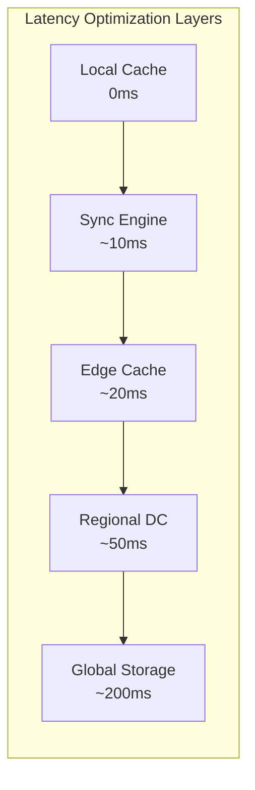

**Latency Targets and Strategies:**

| Operation | Target Latency | Strategy |
|-----------|---------------|----------|
| File Open | < 100ms | Aggressive prefetching |
| Small Edit | < 50ms | Local operation + async sync |
| Search | < 200ms | Distributed index |
| Download Start | < 1s | Progressive transfer |
| Collaboration Cursor | < 100ms | WebSocket + OT |


**Prefetching Intelligence:**

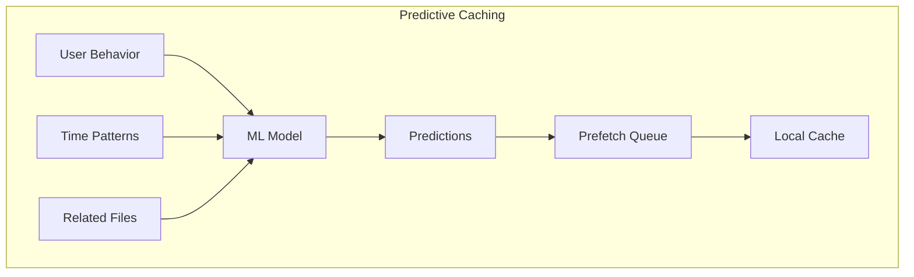

### Law 4: Trade-offs - The Exabyte Challenge

Managing billions of files across millions of users requires sophisticated capacity planning.

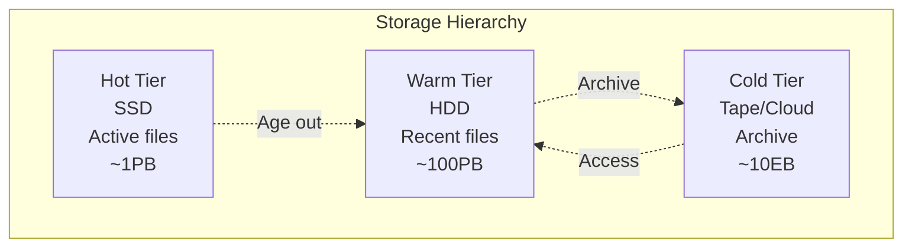

**Capacity Metrics:**

| Metric | Scale | Growth Rate |
|--------|-------|-------------|
| Total Storage | 10+ Exabytes | +40% YoY |
| Active Files | 100B+ files | +30% YoY |
| Daily Uploads | 1B+ files | +25% YoY |
| Concurrent Edits | 10M+ | +50% YoY |
| File Versions | 1T+ versions | +60% YoY |


**Storage Optimization Techniques:**

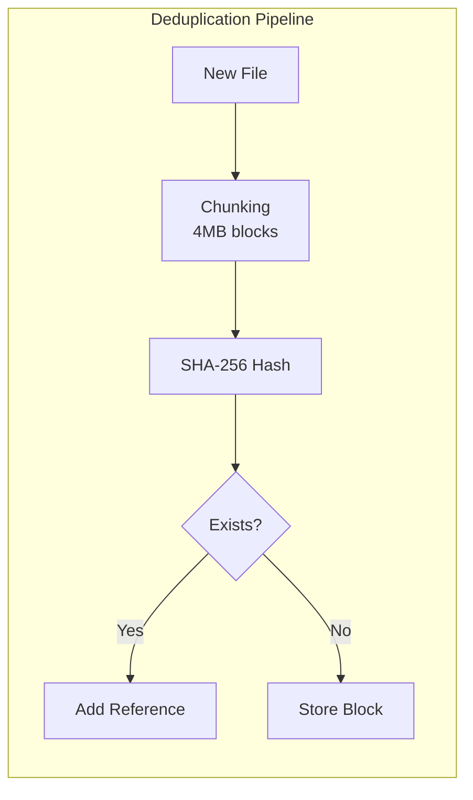

| Technique | Space Savings | Use Case |
|-----------|--------------|----------|
| Block Deduplication | 30-40% | Common files |
| Compression | 20-30% | Text/documents |
| Delta Encoding | 90%+ | Version storage |
| Smart Tiering | 60% cost | Inactive data |


### Law 1: Failure - Data Durability and Availability

Drive must never lose data despite constant hardware failures.

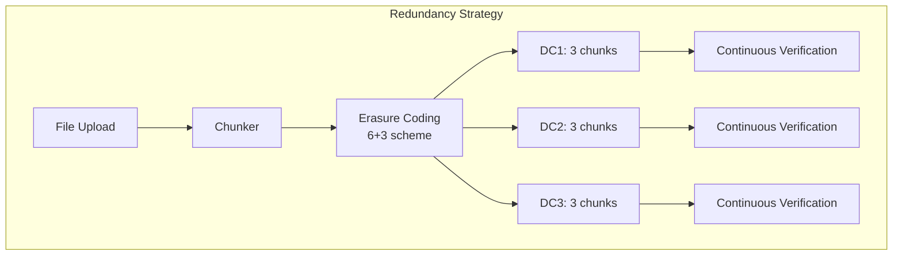

**Failure Scenarios and Recovery:**

| Failure Type | MTBF | Recovery Strategy | RPO | RTO |
|--------------|------|-------------------|-----|-----|
| Disk Failure | 3 years | Immediate rebuild | 0 | < 1 min |
| Server Failure | 5 years | Redirect traffic | 0 | < 10s |
| Rack Failure | 10 years | Cross-rack replication | 0 | < 30s |
| DC Failure | 100 years | Geo-replication | < 1 min | < 5 min |


**Durability Calculation:**
- Single copy: 99.9% (3 nines)
- 3x replication: 99.9999999% (9 nines)
- Erasure coding (6+3): 99.99999999999% (13 nines)
- Geo-distributed EC: 99.999999999999999% (17 nines)

### Law 3: Emergence - Real-time Collaboration

Multiple users editing the same document requires sophisticated concurrency control.

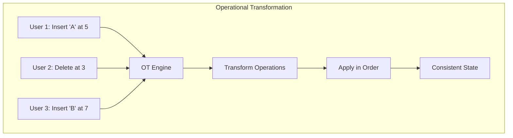

**Collaboration Patterns:**

| Pattern | Use Case | Consistency Model |
|---------|----------|------------------|
| Real-time Editing | Google Docs | Operational Transform |
| File Locking | Video editing | Pessimistic locking |
| Version Branching | Source code | Git-like branching |
| Conflict Resolution | Offline edits | Three-way merge |


**Conflict Resolution Matrix:**

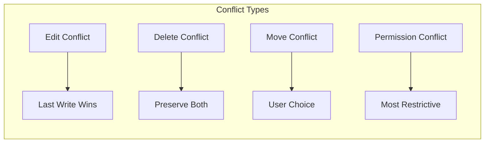

### Law 4: Trade-offs - Global Consistency

Maintaining consistency across global data centers while enabling collaboration.

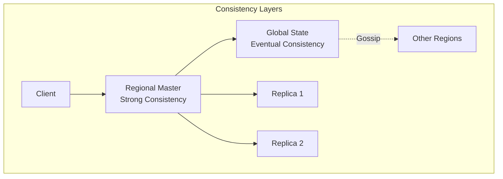

**Consistency Requirements by Operation:**

| Operation | Consistency Level | Latency Trade-off |
|-----------|------------------|-------------------|
| File Create | Strong | Higher latency OK |
| Content Edit | Causal | Low latency critical |
| Permission Change | Strong | Security critical |
| Search Index | Eventual | Can lag minutes |
| View Count | Eventual | Can lag hours |


**Sync Protocol State Machine:**

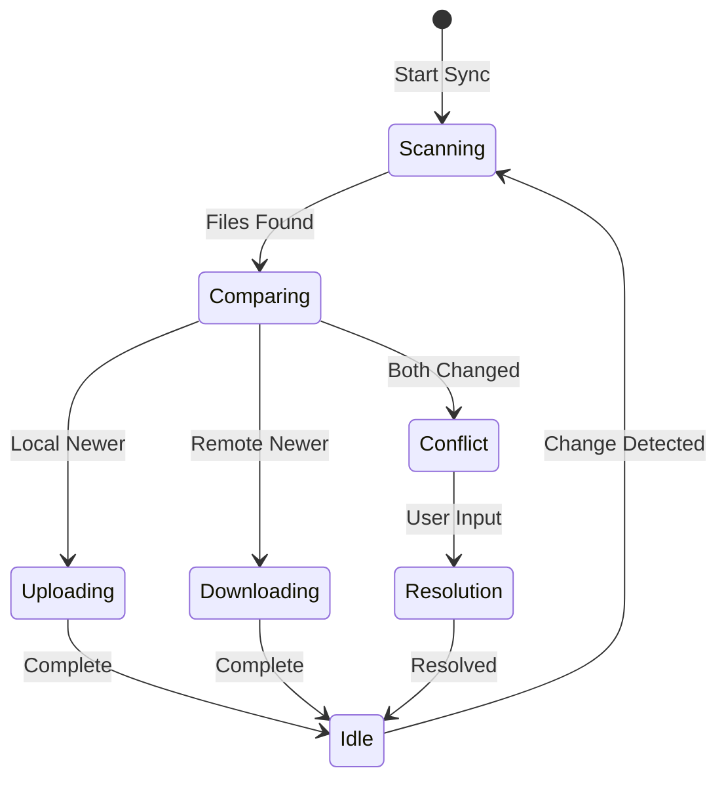

### Law 5: Epistemology - Understanding System Health

Monitoring billions of file operations requires comprehensive observability.

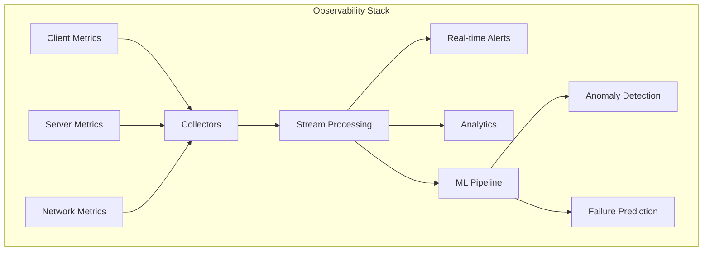

**Key Metrics Dashboard:**

| Metric Category | Examples | Alert Threshold |
|----------------|----------|-----------------|
| Availability | Uptime, Error rate | > 99.9% |
| Performance | Sync latency, Upload speed | p99 < 5s |
| Capacity | Storage usage, Quota limits | > 80% full |
| Security | Auth failures, Suspicious access | Anomaly based |
| Business | Active users, Storage growth | Trend deviation |


### Law 6: Human-API - Seamless User Experience

Making complex distributed systems feel simple and intuitive.

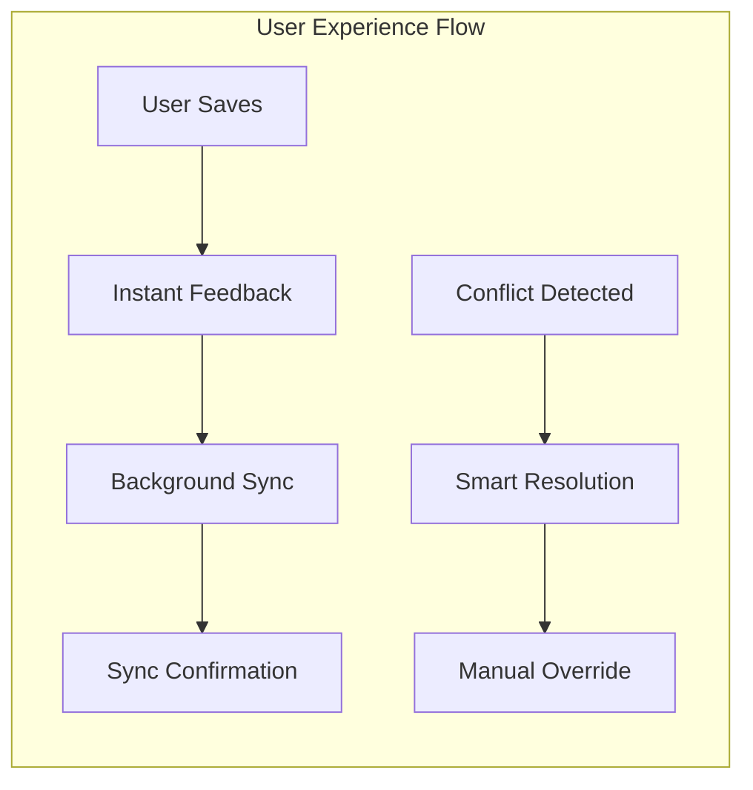

**UX Optimization Strategies:**

| Feature | Technical Implementation | User Perception |
|---------|-------------------------|-----------------|
| Instant Save | Local write + async sync | "Always saved" |
| Offline Mode | Local cache + queue | "Always available" |
| Quick Search | Local index + prefetch | "Instant results" |
| Smart Sync | ML-based prediction | "Right files ready" |
| Version History | Efficient delta storage | "Time travel" |


**Collaboration UX Patterns:**

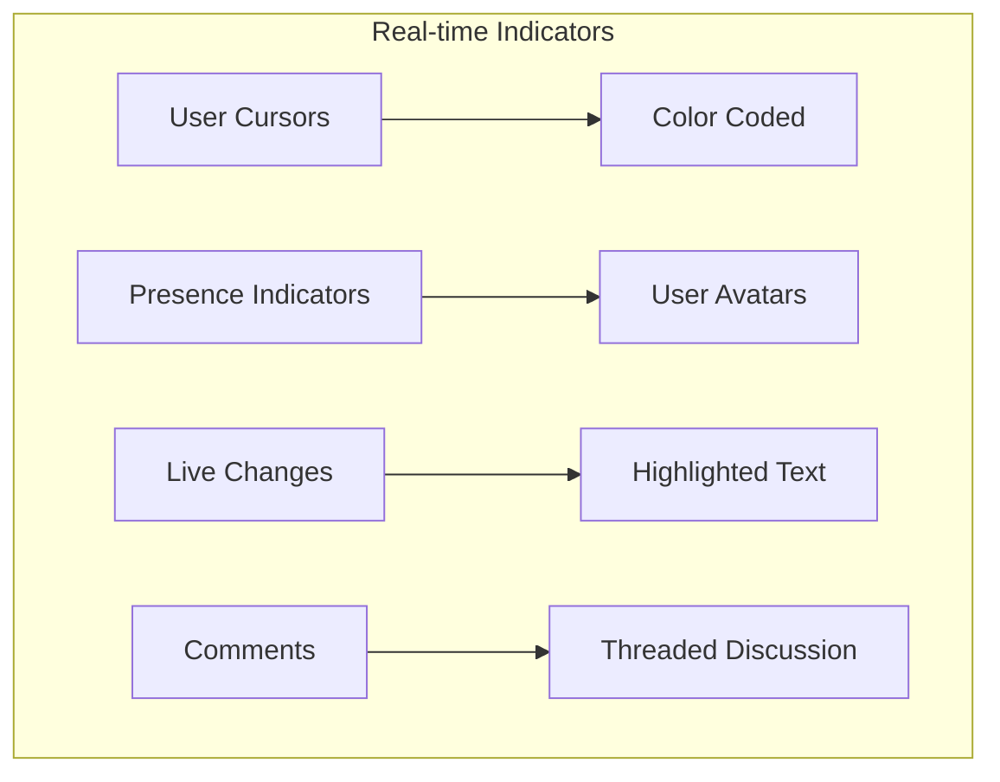

### Law 7: Economics - Balancing Features and Costs

Optimizing storage costs while providing generous free tiers and premium features.

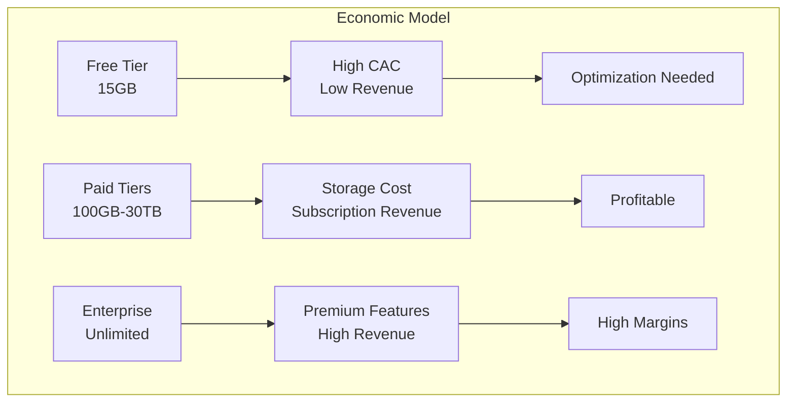

**Cost Optimization Strategies:**

| Strategy | Impact | Implementation |
|----------|--------|----------------|
| Deduplication | -40% storage | Content-based chunking |
| Compression | -30% storage | Adaptive algorithms |
| Tiered Storage | -60% cost | Hot/cold separation |
| Regional Caching | -50% bandwidth | Edge locations |
| Quota Incentives | -20% growth | Encourage cleanup |


**Storage Economics:**

| Tier | Cost/User/Month | Revenue/User/Month | Margin |
|------|-----------------|-------------------|---------|
| Free (15GB) | $0.35 | $0 (ads: $0.10) | -71% |
| 100GB | $0.50 | $1.99 | 75% |
| 2TB | $2.00 | $9.99 | 80% |
| Enterprise | $5.00 | $25.00 | 80% |


## Part 2: Comprehensive Law Analysis Matrix

Understanding how each design decision in Google Drive maps to fundamental laws reveals the intricate balance required for cloud storage at scale.

### Law Mapping for Core Design Decisions

| Design Decision | Law 2: Asynchronous Reality ⏳ | Law 4: Trade-offs ⚖️ | Law 1: Failure ⛓️ | Law 3: Emergence 🌪️ | Law 4: Trade-offs ⚖️ | Law 5: Epistemology 🧠 | Law 6: Human-API 🤯 | Law 7: Economics 💰 |
|----------------|------------------|-------------------|------------------|---------------------|---------------------|---------------------|------------------------|-------------------|
| **Chunking (4MB blocks)** | ✅ Parallel transfer<br/>Resume capability | ✅ Deduplication<br/>30-40% savings | ✅ Partial recovery<br/>Chunk-level retry | ✅ Parallel upload<br/>No lock contention | ✅ Simple sync<br/>Block-level tracking | ✅ Progress tracking<br/>Clear metrics | ✅ Progress bars<br/>Resume on failure | ✅ Storage efficiency<br/>Network optimization |
| **Erasure Coding** | ⚠️ Encoding overhead<br/>~10ms penalty | ✅ 1.5x vs 3x storage<br/>50% savings | ✅ Survives failures<br/>13 nines durability | ✅ Parallel reconstruction<br/>No blocking | ⚠️ Complex placement<br/>Cross-DC coordination | ✅ Health monitoring<br/>Continuous verification | ✅ Invisible to users<br/>Same reliability | ✅ Massive savings<br/>50% cost reduction |
| **Local Sync Cache** | ✅ Instant access<br/>0ms for cached | ⚠️ Duplicate storage<br/>Client disk usage | ✅ Offline capability<br/>Local recovery | ✅ Optimistic updates<br/>Background sync | ⚠️ Conflict potential<br/>Version divergence | ✅ Sync status<br/>Clear indicators | ✅ Works offline<br/>Feels like local | ✅ Reduced bandwidth<br/>Better experience |
| **Operational Transform** | ✅ Real-time collab<br/>< 100ms updates | ⚠️ Transform overhead<br/>Complex state | ✅ Graceful degradation<br/>Eventual consistency | ✅ Lock-free editing<br/>Unlimited users | ✅ Causal ordering<br/>Convergence guaranteed | ⚠️ Complex debugging<br/>Transform chains | ✅ Live collaboration<br/>See others' cursors | ⚠️ Server compute<br/>Transform processing |
| **Tiered Storage** | ⚠️ Cold tier slow<br/>Minutes to retrieve | ✅ 60% cost savings<br/>Efficient use | ✅ Multiple copies<br/>Tier-appropriate | ✅ Async migration<br/>No user impact | ✅ Policy-based<br/>Automated movement | ✅ Access patterns<br/>Clear analytics | ⚠️ Retrieval delays<br/>Set expectations | ✅ Major savings<br/>Sustainable model |


### Detailed Law Interaction Analysis

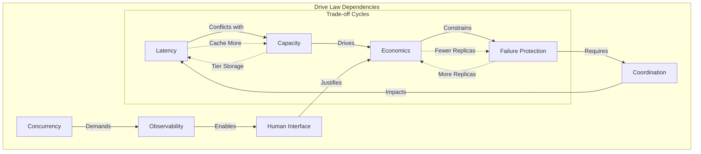

### Architecture Decision Framework

| Architecture Choice | Primary Law Driver | Secondary Impacts | Trade-off Analysis |
|-------------------|-------------------|------------------|-------------------|
| **Block vs File Dedup** | Capacity (storage efficiency) | Latency (chunking overhead) | Block dedup wins despite complexity |
| **Strong vs Eventual Consistency** | Coordination (correctness) | Latency (sync speed) | Eventual for files, strong for permissions |
| **Client vs Server Processing** | Latency (responsiveness) | Economics (compute location) | Hybrid approach optimal |
| **Replication vs Erasure Coding** | Failure (durability) | Capacity (storage cost) | EC for cold, replication for hot |


### Law Priority by Use Case

| Use Case | Top 3 Laws | Architecture Implications |
|----------|--------------|-------------------------|
| **Personal Backup** | Capacity > Economics > Failure | Aggressive dedup, cold storage, basic redundancy |
| **Team Collaboration** | Latency > Concurrency > Human Interface | Real-time sync, OT, rich presence indicators |
| **Enterprise Storage** | Failure > Observability > Economics | High redundancy, audit trails, tiered pricing |
| **Media Streaming** | Latency > Capacity > Economics | CDN integration, progressive download, smart caching |


## Part 3: Architecture Alternatives - Exploring the Design Space

### Current Architecture: The Multi-Region System

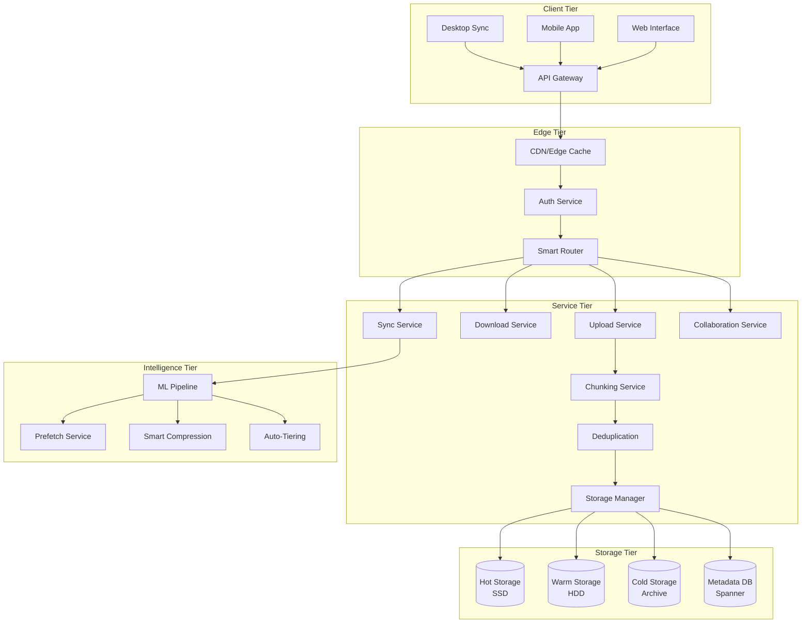

### Alternative Architecture 1: Content-Addressed Storage

**Design**: Use content hashes as primary identifiers.

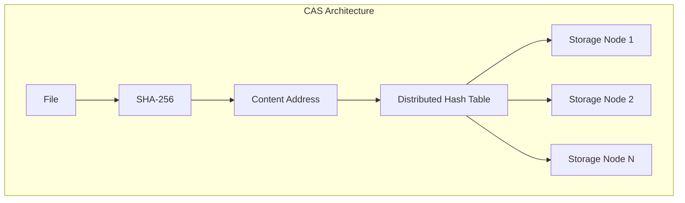

**Trade-offs:**

| Aspect | Benefit | Challenge |
|--------|---------|-----------|
| Deduplication | Perfect (100%) | Hash computation cost |
| Integrity | Built-in verification | No in-place updates |
| Scaling | Linear with nodes | Complex garbage collection |
| Security | Encryption complexity | Key management |


### Alternative Architecture 2: Peer-to-Peer Hybrid

**Design**: Use P2P for popular files, centralized for rest.

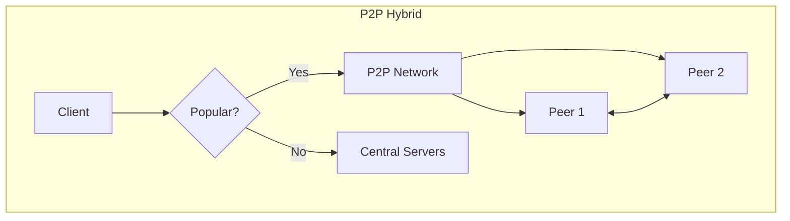

**Trade-offs:**

| Aspect | Benefit | Challenge |
|--------|---------|-----------|
| Bandwidth | -70% for popular files | Complex coordination |
| Availability | Improves with popularity | Poor for rare files |
| Privacy | Concerns with P2P | Need encryption |
| Control | Less infrastructure | Harder to manage |


### Alternative Architecture 3: Edge-First Architecture

**Design**: Process everything at edge, sync to core.

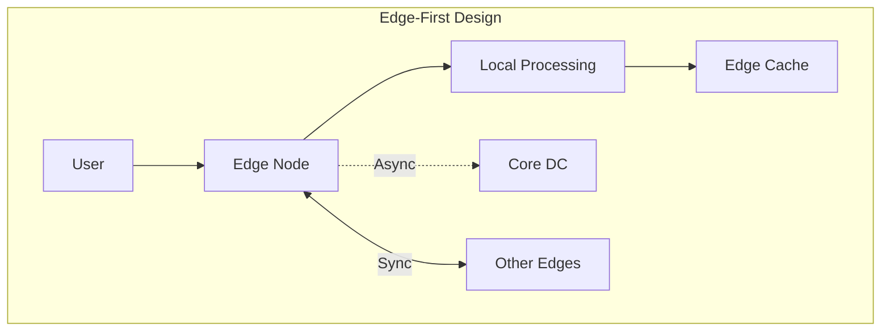

**Trade-offs:**

| Aspect | Benefit | Challenge |
|--------|---------|-----------|
| Latency | Ultra-low (< 10ms) | Many edge locations |
| Resilience | Survives core outages | Complex consistency |
| Cost | Reduced backbone traffic | Higher edge costs |
| Features | Local AI/ML possible | Resource constraints |


### Alternative Architecture 4: Blockchain-Based

**Design**: Immutable, distributed ledger for file metadata.

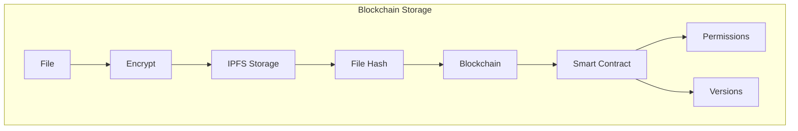

**Trade-offs:**

| Aspect | Benefit | Challenge |
|--------|---------|-----------|
| Trust | Zero trust needed | Performance issues |
| Audit | Complete history | Storage overhead |
| Control | User ownership | No central features |
| Cost | Potentially lower | Blockchain fees |


### Recommended Architecture: Intelligent Hybrid System

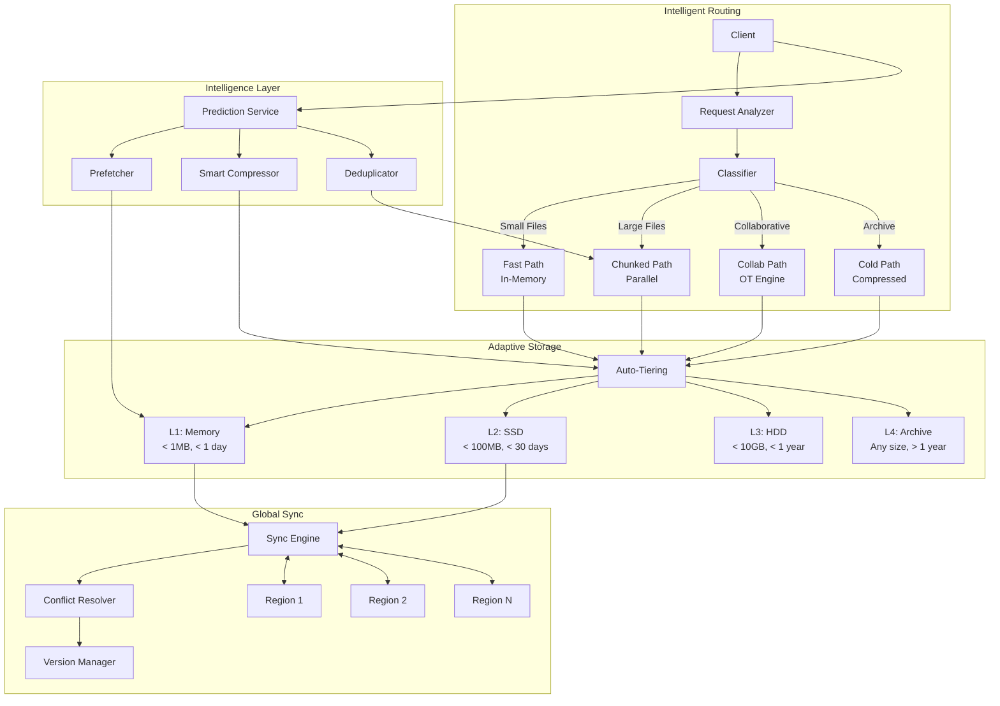

### Alternative Architecture 5: Event-Sourced Storage System

```mermaid
graph TB
    subgraph "Event-Sourced Architecture"
        FILE[File Operation] --> EVENT[Event Stream]
        EVENT --> APPEND[Append-Only Log]
        
        APPEND --> PROCESSOR[Event Processor]
        PROCESSOR --> VIEW1[Current State View]
        PROCESSOR --> VIEW2[Version History View]
        PROCESSOR --> VIEW3[Audit Trail View]
        
        EVENT --> REPLAY[Event Replay]
        REPLAY --> RESTORE[Point-in-Time Restore]
    end
```

**Trade-offs:**

| Aspect | Benefit | Challenge |
|--------|---------|-----------|
| Audit Trail | Complete history | Storage overhead |
| Versioning | Natural versioning | Complex queries |
| Consistency | Strong ordering | Processing latency |
| Recovery | Perfect replay | Replay time |


### Alternative Architecture 6: Federated Storage Network

```mermaid
graph TB
    subgraph "Federated Network"
        USER[User] --> BROKER[Storage Broker]
        BROKER --> PROVIDER1[AWS S3]
        BROKER --> PROVIDER2[Azure Blob]
        BROKER --> PROVIDER3[GCP Storage]
        BROKER --> PROVIDER4[On-Prem]
        
        BROKER --> POLICY[Policy Engine]
        POLICY --> PLACE[Intelligent Placement]
    end
```

**Trade-offs:**

| Aspect | Benefit | Challenge |
|--------|---------|-----------|
| Vendor Lock-in | None | Complex integration |
| Cost Optimization | Best price/performance | Management overhead |
| Compliance | Data sovereignty | Policy complexity |
| Reliability | No single point | Consistency across providers |


## Part 4: Comprehensive Trade-off Comparison

### Performance Comparison Matrix

| Architecture | Upload Speed | Download Speed | Sync Latency | Storage Efficiency | Collaboration Support |
|--------------|--------------|----------------|--------------|-------------------|---------------------|
| **Multi-Region** | ✅✅✅ Fast | ✅✅✅ Fast | ✅✅ Good | ✅✅ Good | ✅✅✅ Excellent |
| **Content-Addressed** | ✅✅ Good | ✅✅✅ Fast | ✅ Slow | ✅✅✅ Excellent | ❌ Poor |
| **P2P Hybrid** | ✅✅ Good | ✅✅✅ Fast* | ⚠️ Variable | ✅✅✅ Excellent | ✅ Limited |
| **Edge-First** | ✅✅✅ Fast | ✅✅✅ Fast | ✅✅✅ Excellent | ✅✅ Good | ✅✅ Good |
| **Blockchain** | ❌ Slow | ✅ OK | ❌ Very Slow | ✅✅ Good | ❌ Poor |
| **Event-Sourced** | ✅✅ Good | ✅✅ Good | ✅✅ Good | ✅ OK | ✅✅✅ Excellent |
| **Federated** | ✅✅ Good | ✅✅ Good | ✅ OK | ✅✅ Good | ✅✅ Good |


*For popular files only

### Law-Based Architecture Selection Guide

```mermaid
graph TD
    START[Start] --> Q1{Primary Need?}
    
    Q1 -->|Collaboration| Q2{Team Size?}
    Q2 -->|Small <10| CURRENT[Multi-Region]
    Q2 -->|Large >100| EVENT[Event-Sourced]
    
    Q1 -->|Backup/Archive| Q3{Change Frequency?}
    Q3 -->|Rarely| CAS[Content-Addressed]
    Q3 -->|Often| EDGE[Edge-First]
    
    Q1 -->|Cost Savings| Q4{Technical Skill?}
    Q4 -->|High| P2P[P2P Hybrid]
    Q4 -->|Low| FEDERATED[Federated]
    
    Q1 -->|Compliance| Q5{Trust Model?}
    Q5 -->|Zero Trust| BLOCKCHAIN[Blockchain]
    Q5 -->|Managed| FEDERATED2[Federated]
```

### Cost Analysis by Architecture and Scale

| Architecture | 1TB Storage | 100TB Storage | 10PB Storage | Bandwidth Cost | Operational Cost |
|--------------|-------------|---------------|--------------|----------------|------------------|
| **Multi-Region** | $20/month | $1,500/month | $100K/month | $0.08/GB | High (team) |
| **Content-Addressed** | $15/month | $1,000/month | $70K/month | $0.05/GB | Medium |
| **P2P Hybrid** | $10/month | $800/month | $50K/month | $0.02/GB* | Low |
| **Edge-First** | $25/month | $2,000/month | $150K/month | $0.03/GB | Very High |
| **Blockchain** | $50/month | $4,000/month | N/A | $0.20/GB | Medium |
| **Event-Sourced** | $30/month | $2,500/month | $180K/month | $0.08/GB | High |
| **Federated** | $18/month | $1,200/month | $80K/month | $0.06/GB | Medium |


### Feature Support Matrix

| Feature | Multi-Region | CAS | P2P | Edge | Blockchain | Event | Federated |
|---------|--------------|-----|-----|------|------------|-------|-----------|
| Real-time Sync | ✅ | ❌ | ⚠️ | ✅ | ❌ | ✅ | ✅ |
| Offline Mode | ✅ | ✅ | ⚠️ | ✅ | ❌ | ✅ | ✅ |
| Version History | ✅ | ✅ | ❌ | ✅ | ✅ | ✅ | ⚠️ |
| Collaboration | ✅ | ❌ | ❌ | ✅ | ❌ | ✅ | ⚠️ |
| Search | ✅ | ⚠️ | ❌ | ✅ | ⚠️ | ✅ | ⚠️ |
| Permissions | ✅ | ⚠️ | ❌ | ✅ | ✅ | ✅ | ✅ |
| Audit Trail | ⚠️ | ✅ | ❌ | ⚠️ | ✅ | ✅ | ⚠️ |


### Failure Resilience Analysis

| Architecture | Data Loss Risk | Availability | Recovery Time | Disaster Recovery | Geo-Redundancy |
|--------------|----------------|--------------|---------------|-------------------|----------------|
| **Multi-Region** | Near Zero | 99.99% | < 1 min | Excellent | Built-in |
| **CAS** | Zero | 99.9% | < 5 min | Good | Manual |
| **P2P** | Medium | Variable | Hours | Poor | Natural |
| **Edge** | Low | 99.999% | < 10s | Excellent | Built-in |
| **Blockchain** | Zero | 99% | Days | Perfect | Natural |
| **Event** | Near Zero | 99.9% | < 10 min | Excellent | Configurable |
| **Federated** | Low | 99.95% | < 5 min | Good | Provider-dependent |


### Implementation Complexity Timeline

```mermaid
gantt
    title Implementation Timeline by Architecture
    dateFormat  YYYY-MM-DD
    section Multi-Region
    Design           :2024-01-01, 30d
    Core Development :30d
    Testing          :30d
    Production Ready :30d
    
    section CAS
    Design           :2024-01-01, 45d
    Development      :60d
    Testing          :45d
    Production       :30d
    
    section P2P Hybrid
    Design           :2024-01-01, 60d
    Development      :90d
    Testing          :60d
    Production       :45d
    
    section Edge-First
    Design           :2024-01-01, 45d
    Development      :120d
    Testing          :90d
    Production       :60d
    
    section Blockchain
    Design           :2024-01-01, 90d
    Development      :180d
    Testing          :120d
    Production       :90d
```

### Decision Matrix for Architecture Selection

| Factor | Weight | Multi-Region | CAS | P2P | Edge | Blockchain | Event | Federated |
|--------|--------|--------------|-----|-----|------|------------|-------|-----------|
| Performance | 20% | 5/5 | 3/5 | 3/5 | 5/5 | 1/5 | 4/5 | 4/5 |
| Cost Efficiency | 15% | 3/5 | 4/5 | 5/5 | 2/5 | 1/5 | 3/5 | 4/5 |
| Scalability | 15% | 5/5 | 5/5 | 4/5 | 4/5 | 2/5 | 4/5 | 5/5 |
| Feature Richness | 15% | 5/5 | 2/5 | 2/5 | 4/5 | 2/5 | 5/5 | 3/5 |
| Reliability | 15% | 5/5 | 4/5 | 2/5 | 5/5 | 3/5 | 4/5 | 4/5 |
| Complexity | 10% | 3/5 | 3/5 | 2/5 | 2/5 | 1/5 | 3/5 | 3/5 |
| Compliance | 10% | 4/5 | 3/5 | 1/5 | 4/5 | 5/5 | 5/5 | 5/5 |
| **Total Score** | 100% | **4.3** | **3.4** | **2.9** | **3.9** | **2.1** | **4.1** | **4.0** |


### Migration Path Analysis

```mermaid
graph LR
    subgraph "Migration Strategies"
        START[Current System] --> DUAL[Dual-Write Phase]
        DUAL --> VALIDATE[Validation Phase]
        VALIDATE --> CUTOVER[Cutover Phase]
        CUTOVER --> COMPLETE[Migration Complete]
        
        DUAL -.->|Rollback| START
        VALIDATE -.->|Issues Found| DUAL
        CUTOVER -.->|Problems| VALIDATE
    end
```

### Implementation Considerations

**1. Sync Engine Design:**
- Merkle trees for efficient diff detection
- Binary diff for large files
- Rsync algorithm for bandwidth optimization
- Conflict-free replicated data types (CRDTs) for metadata

**2. Deduplication Strategy:**
- Variable-size chunking with Rabin fingerprinting
- Content-defined chunking for better dedup ratios
- Client-side dedup for bandwidth savings
- Cross-user dedup with encryption

**3. Collaboration Protocol:**
- Operational transformation for real-time edits
- WebSocket for low-latency updates
- Cursor tracking and presence awareness
- Optimistic UI updates with rollback

**4. Performance Optimizations:**
- Parallel uploads/downloads
- Progressive file transfer
- Delta sync for modifications
- Intelligent prefetching based on access patterns

## Architecture Evolution

### Phase 1: Simple Upload/Download Service (2006-2008)

```text
Web Browser → Web Server → File System → Database
```

**Problems Encountered:**
- No real-time sync
- Full file transfers only
- Single point of failure
- No versioning support

**Patterns Violated**: 
- No Deduplication (Coming Soon)
- No Delta Sync (Coming Soon)
- No [Distributed Storage](../pattern-library/data-management/distributed-storage/)

### Phase 2: Basic Sync Architecture (2008-2010)

```mermaid
graph TB
    subgraph "Client Apps"
        WEB[Web Client]
        DESK[Desktop Sync]
        MOB[Mobile App]
    end
    
    subgraph "API Layer"
        LB[Load Balancer]
        API1[API Server 1]
        API2[API Server 2]
        APIN[API Server N]
    end
    
    subgraph "Storage"
        FS[File Storage<br/>NFS]
        DB[(MySQL<br/>Metadata)]
    end
    
    WEB & DESK & MOB --> LB
    LB --> API1 & API2 & APIN
    API1 & API2 & APIN --> FS & DB
    
    style FS fill:#ff9999
```

**Key Design Decision: Metadata/Data Separation**
- **Trade-off**: Complexity vs Scalability (Pillar: [State Distribution](../../core-principles/pillars/state.md))
- **Choice**: Store metadata in DB, files in object storage
- **Result**: Independent scaling of metadata and storage
- **Pattern Applied**: Metadata Service (Coming Soon)

According to early reports¹, this enabled handling 10x more files with same database resources.

### Phase 3: Distributed Architecture (2010-2014)

```mermaid
graph TB
    subgraph "Sync Clients"
        WIN[Windows]
        MAC[macOS]
        LIN[Linux]
        AND[Android]
        IOS[iOS]
    end
    
    subgraph "Edge Services"
        CDN[CDN<br/>Static Content]
        UPLOAD[Upload Service<br/>Resumable]
    end
    
    subgraph "Core Services"
        AUTH[Auth Service]
        SYNC[Sync Engine]
        META[Metadata Service]
        CHUNK[Chunking Service]
    end
    
    subgraph "Storage Backend"
        subgraph "Object Storage"
            S1[Storage Node 1]
            S2[Storage Node 2]
            SN[Storage Node N]
        end
        subgraph "Metadata"
            SHARD1[MySQL Shard 1]
            SHARD2[MySQL Shard 2]
            SHARDN[MySQL Shard N]
        end
    end
    
    WIN & MAC & LIN & AND & IOS --> CDN & UPLOAD
    CDN & UPLOAD --> AUTH --> SYNC
    SYNC --> META & CHUNK
    META --> SHARD1 & SHARD2 & SHARDN
    CHUNK --> S1 & S2 & SN
```

**Innovation: Content-Addressed Storage**²
- Files identified by content hash
- Automatic deduplication
- Efficient delta sync
- Immutable storage simplifies replication

**Patterns & Pillars Applied**:
- Pattern: [Content-Addressed Storage](../pattern-library/coordination/cas/) - Deduplication
- Pattern: Chunking (Coming Soon) - Large file handling
- 🏛 Pillar: [State Distribution](../../core-principles/pillars/state.md) - Sharded metadata
- 🏛 Pillar: [Work Distribution](../../core-principles/pillars/work.md) - Parallel uploads

### Phase 4: Modern Cloud-Native Architecture (2014-Present)

```mermaid
graph LR
    subgraph "Client Infrastructure"
        subgraph "Native Clients"
            DESK[Desktop<br/>File System Integration]
            MOB[Mobile<br/>Selective Sync]
        end
        subgraph "Web Interface"
            WEB[Web App<br/>Real-time Collab]
            DOCS[Docs/Sheets<br/>Collaborative Editing]
        end
    end

    subgraph "API Gateway"
        APIGW[API Gateway<br/>Rate Limiting]
        GRPC[gRPC Gateway<br/>Streaming]
        REST[REST API<br/>Compatibility]
    end

    subgraph "Core Services"
        subgraph "Sync Services"
            SYNC[Sync Engine<br/>Conflict Resolution]
            DIFF[Diff Engine<br/>Binary Diff]
            NOTIFY[Notification Service<br/>Real-time Updates]
        end
        
        subgraph "File Services"
            CHUNK[Chunking Service<br/>4MB Blocks]
            DEDUP[Dedup Service<br/>SHA-256]
            COMPRESS[Compression<br/>Zstandard]
        end
        
        subgraph "Metadata Services"
            META[Metadata Service<br/>File Tree]
            VERSION[Version Service<br/>History]
            SEARCH[Search Service<br/>Full Text]
        end
        
        subgraph "Collaboration"
            COLLAB[Collaboration Engine<br/>OT/CRDT]
            PRESENCE[Presence Service<br/>Active Users]
            COMMENT[Comments Service]
        end
    end

    subgraph "Storage Infrastructure"
        subgraph "Hot Storage"
            CACHE[Redis Cluster<br/>Metadata Cache]
            HOT[SSD Storage<br/>Recent Files]
        end
        
        subgraph "Warm Storage"
            WARM[HDD Storage<br/>Active Files]
            NEARLINE[Nearline<br/>30-day Archive]
        end
        
        subgraph "Cold Storage"
            COLD[Glacier<br/>Long-term Archive]
            TAPE[Tape Backup<br/>Compliance]
        end
        
        subgraph "Databases"
            SPANNER[Spanner<br/>Global Metadata]
            BIGTABLE[Bigtable<br/>File Chunks]
            ELASTIC[Elasticsearch<br/>Search Index]
        end
    end

    subgraph "Intelligence Layer"
        ML[ML Pipeline<br/>Smart Sync]
        PREDICT[Predictive Caching]
        ANOMALY[Anomaly Detection]
    end

    DESK & MOB --> APIGW & GRPC
    WEB & DOCS --> REST
    
    APIGW & GRPC & REST --> SYNC & META
    SYNC --> DIFF & NOTIFY
    META --> VERSION & SEARCH
    
    SYNC --> CHUNK --> DEDUP --> COMPRESS
    COMPRESS --> HOT --> WARM --> COLD
    
    META --> SPANNER
    CHUNK --> BIGTABLE
    SEARCH --> ELASTIC
    
    COLLAB --> PRESENCE & COMMENT
    
    ML --> PREDICT --> CACHE
    ANOMALY --> SYNC
    
    style SYNC fill:#ff6b6b
    style SPANNER fill:#4ecdc4
    style DEDUP fill:#95e1d3
```

**Current Scale**:
- 2B+ users
- 1 trillion+ files
- Exabytes of storage
- 99.99% availability

## Core Components Deep Dive

### 1. File Chunking & Deduplication

```python
class FileChunkingService:
    """Intelligent file chunking with deduplication"""
    
    def __init__(self):
        self.chunk_size = 4 * 1024 * 1024  # 4MB default
        self.min_chunk_size = 1 * 1024 * 1024  # 1MB
        self.max_chunk_size = 8 * 1024 * 1024  # 8MB
        self.rolling_hash_window = 48  # bytes
        
    async def chunk_file(self, file_path: str) -> List[ChunkInfo]:
        """Variable-size content-defined chunking"""
        chunks = []
        
        with open(file_path, 'rb') as f:
            buffer = bytearray()
            rolling_hash = RollingHash(self.rolling_hash_window)
            position = 0
            
            while True:
                byte = f.read(1)
                if not byte:
                    break
                    
                buffer.append(byte[0])
                rolling_hash.update(byte[0])
                position += 1
                
## Check for chunk boundary
                if (len(buffer) >= self.min_chunk_size and 
                    self._is_chunk_boundary(rolling_hash.hash_value)):
                    
## Create chunk
                    chunk = self._create_chunk(buffer, position - len(buffer))
                    chunks.append(chunk)
                    
## Reset for next chunk
                    buffer = bytearray()
                    rolling_hash.reset()
                    
                elif len(buffer) >= self.max_chunk_size:
## Force chunk at max size
                    chunk = self._create_chunk(buffer, position - len(buffer))
                    chunks.append(chunk)
                    buffer = bytearray()
                    rolling_hash.reset()
            
## Handle final chunk
            if buffer:
                chunk = self._create_chunk(buffer, position - len(buffer))
                chunks.append(chunk)
                
        return chunks
    
    def _is_chunk_boundary(self, hash_value: int) -> bool:
        """Determine chunk boundary using hash"""
## Use last N bits to determine boundary
## This gives average chunk size of 4MB
        return (hash_value & 0x3FFFFF) == 0

class DeduplicationService:
    """Global deduplication across all users"""
    
    def __init__(self):
        self.chunk_index = {}  # hash -> storage_location
        self.reference_count = {}  # hash -> count
        self.storage_backend = ObjectStorage()
        
    async def store_chunk(self, chunk_data: bytes, 
                         chunk_hash: str) -> StorageInfo:
        """Store chunk with deduplication"""
## Check if chunk exists
        if chunk_hash in self.chunk_index:
## Increment reference count
            self.reference_count[chunk_hash] += 1
            return StorageInfo(
                location=self.chunk_index[chunk_hash],
                deduplicated=True
            )
        
## New chunk - store it
        storage_location = await self.storage_backend.put(
            chunk_hash,
            chunk_data
        )
        
## Update indices
        self.chunk_index[chunk_hash] = storage_location
        self.reference_count[chunk_hash] = 1
        
        return StorageInfo(
            location=storage_location,
            deduplicated=False
        )
    
    async def delete_chunk_reference(self, chunk_hash: str):
        """Decrement reference count and delete if zero"""
        if chunk_hash not in self.reference_count:
            return
            
        self.reference_count[chunk_hash] -= 1
        
        if self.reference_count[chunk_hash] == 0:
## No more references - safe to delete
            storage_location = self.chunk_index[chunk_hash]
            await self.storage_backend.delete(storage_location)
            
            del self.chunk_index[chunk_hash]
            del self.reference_count[chunk_hash]
```

### 2. Sync Engine & Conflict Resolution

```python
class SyncEngine:
    """Core sync algorithm with conflict resolution"""
    
    def __init__(self):
        self.sync_interval = 30  # seconds
        self.conflict_resolver = ConflictResolver()
        self.local_state = LocalFileState()
        self.remote_state = RemoteFileState()
        
    async def sync_folder(self, folder_path: str):
        """Bidirectional sync with conflict handling"""
## 1. Scan local changes
        local_changes = await self.local_state.scan_changes(folder_path)
        
## 2. Fetch remote changes
        remote_changes = await self.remote_state.fetch_changes(folder_path)
        
## 3. Detect conflicts
        conflicts = self._detect_conflicts(local_changes, remote_changes)
        
## 4. Resolve conflicts
        resolutions = await self.conflict_resolver.resolve(conflicts)
        
## 5. Apply changes
        await self._apply_remote_changes(remote_changes, resolutions)
        await self._push_local_changes(local_changes, resolutions)
        
## 6. Update sync state
        await self._update_sync_state(folder_path)
    
    def _detect_conflicts(self, local: List[Change], 
                         remote: List[Change]) -> List[Conflict]:
        """Detect sync conflicts"""
        conflicts = []
        
## Build lookup maps
        local_map = {c.path: c for c in local}
        remote_map = {c.path: c for c in remote}
        
## Find conflicts
        for path in set(local_map.keys()) & set(remote_map.keys()):
            local_change = local_map[path]
            remote_change = remote_map[path]
            
            if self._is_conflict(local_change, remote_change):
                conflicts.append(Conflict(
                    path=path,
                    local=local_change,
                    remote=remote_change,
                    type=self._classify_conflict(local_change, remote_change)
                ))
                
        return conflicts

class ConflictResolver:
    """Intelligent conflict resolution"""
    
    def __init__(self):
        self.resolution_strategies = {
            ConflictType.BOTH_MODIFIED: self._resolve_both_modified,
            ConflictType.DELETE_MODIFY: self._resolve_delete_modify,
            ConflictType.RENAME_RENAME: self._resolve_rename_rename
        }
        
    async def resolve(self, conflicts: List[Conflict]) -> List[Resolution]:
        """Resolve conflicts based on type and policy"""
        resolutions = []
        
        for conflict in conflicts:
            strategy = self.resolution_strategies.get(
                conflict.type,
                self._default_resolution
            )
            
            resolution = await strategy(conflict)
            resolutions.append(resolution)
            
        return resolutions
    
    async def _resolve_both_modified(self, conflict: Conflict) -> Resolution:
        """Both sides modified the same file"""
## Strategy: Keep both versions
        return Resolution(
            action=ResolutionAction.KEEP_BOTH,
            local_path=conflict.path,
            remote_path=f"{conflict.path}.conflict-{timestamp}"
        )
```

### 3. Real-time Collaboration

```python
class CollaborationEngine:
    """Real-time collaborative editing using OT/CRDT"""
    
    def __init__(self):
        self.active_sessions = {}  # doc_id -> session
        self.operation_transformer = OperationTransformer()
        self.presence_tracker = PresenceTracker()
        
    async def join_session(self, doc_id: str, user_id: str) -> Session:
        """Join collaborative editing session"""
## Get or create session
        if doc_id not in self.active_sessions:
            self.active_sessions[doc_id] = await self._create_session(doc_id)
            
        session = self.active_sessions[doc_id]
        
## Add user to session
        await session.add_participant(user_id)
        
## Send current state
        current_state = await session.get_state()
        await self._send_state_to_user(user_id, current_state)
        
## Broadcast presence
        await self.presence_tracker.announce_join(doc_id, user_id)
        
        return session
    
    async def handle_operation(self, doc_id: str, user_id: str, 
                             operation: Operation):
        """Handle edit operation from user"""
        session = self.active_sessions.get(doc_id)
        if not session:
            raise SessionNotFoundError()
            
## Transform operation against concurrent ops
        transformed = await self.operation_transformer.transform(
            operation,
            session.pending_operations
        )
        
## Apply to document
        await session.apply_operation(transformed)
        
## Broadcast to other users
        await self._broadcast_operation(
            doc_id,
            transformed,
            exclude_user=user_id
        )

class OperationTransformer:
    """Operational Transformation for concurrent edits"""
    
    def transform(self, op1: Operation, op2: Operation) -> Operation:
        """Transform op1 against op2"""
        if isinstance(op1, InsertOp) and isinstance(op2, InsertOp):
            return self._transform_insert_insert(op1, op2)
        elif isinstance(op1, InsertOp) and isinstance(op2, DeleteOp):
            return self._transform_insert_delete(op1, op2)
        elif isinstance(op1, DeleteOp) and isinstance(op2, InsertOp):
            return self._transform_delete_insert(op1, op2)
        elif isinstance(op1, DeleteOp) and isinstance(op2, DeleteOp):
            return self._transform_delete_delete(op1, op2)
            
    def _transform_insert_insert(self, op1: InsertOp, 
                                op2: InsertOp) -> InsertOp:
        """Transform insert against insert"""
        if op1.position < op2.position:
            return op1
        elif op1.position > op2.position:
            return InsertOp(
                position=op1.position + len(op2.text),
                text=op1.text
            )
        else:
## Same position - use user ID for consistency
            if op1.user_id < op2.user_id:
                return op1
            else:
                return InsertOp(
                    position=op1.position + len(op2.text),
                    text=op1.text
                )
```

### 4. Intelligent Caching & Prediction

```python
class PredictiveCacheService:
    """ML-based predictive file caching"""
    
    def __init__(self):
        self.access_predictor = FileAccessPredictor()
        self.cache_manager = CacheManager()
        self.user_patterns = UserPatternAnalyzer()
        
    async def optimize_cache(self, user_id: str):
        """Optimize cache based on predicted access"""
## 1. Analyze user patterns
        patterns = await self.user_patterns.analyze(user_id)
        
## 2. Get current context
        context = {
            'time_of_day': datetime.now().hour,
            'day_of_week': datetime.now().weekday(),
            'location': await self._get_user_location(user_id),
            'device': await self._get_active_device(user_id),
            'recent_files': await self._get_recent_files(user_id)
        }
        
## 3. Predict next file accesses
        predictions = await self.access_predictor.predict(
            user_id,
            patterns,
            context
        )
        
## 4. Pre-cache high probability files
        for prediction in predictions:
            if prediction.probability > 0.7:
                await self.cache_manager.pre_cache(
                    prediction.file_id,
                    user_id
                )

class FileAccessPredictor:
    """ML model for file access prediction"""
    
    def __init__(self):
        self.model = self._load_model()
        self.feature_extractor = FeatureExtractor()
        
    async def predict(self, user_id: str, patterns: dict, 
                     context: dict) -> List[Prediction]:
        """Predict likely file accesses"""
## Extract features
        features = self.feature_extractor.extract(
            user_patterns=patterns,
            context=context
        )
        
## Get model predictions
        predictions = self.model.predict_proba(features)
        
## Convert to file predictions
        file_predictions = []
        for file_id, probability in predictions:
            if probability > 0.1:  # Threshold
                file_predictions.append(Prediction(
                    file_id=file_id,
                    probability=probability,
                    estimated_access_time=self._estimate_time(
                        patterns, 
                        context
                    )
                ))
                
        return sorted(
            file_predictions, 
            key=lambda x: x.probability, 
            reverse=True
        )[:20]  # Top 20 predictions
```

### 5. Storage Tiering & Lifecycle

```python
class StorageLifecycleManager:
    """Manage file lifecycle across storage tiers"""
    
    def __init__(self):
        self.tiers = {
            'hot': {
                'storage_class': 'SSD',
                'access_threshold': timedelta(days=7),
                'cost_per_gb': 0.20
            },
            'warm': {
                'storage_class': 'HDD', 
                'access_threshold': timedelta(days=30),
                'cost_per_gb': 0.05
            },
            'cold': {
                'storage_class': 'NEARLINE',
                'access_threshold': timedelta(days=90),
                'cost_per_gb': 0.01
            },
            'archive': {
                'storage_class': 'GLACIER',
                'access_threshold': timedelta(days=365),
                'cost_per_gb': 0.004
            }
        }
        
    async def evaluate_file_placement(self, file_id: str):
        """Determine optimal storage tier for file"""
## Get file access patterns
        access_info = await self._get_access_info(file_id)
        
## Calculate access frequency
        days_since_access = (datetime.now() - access_info.last_access).days
        access_frequency = access_info.access_count / max(days_since_access, 1)
        
## Determine tier based on access patterns
        if days_since_access < 7 or access_frequency > 1:
            return 'hot'
        elif days_since_access < 30 or access_frequency > 0.1:
            return 'warm'
        elif days_since_access < 90:
            return 'cold'
        else:
            return 'archive'
    
    async def migrate_file(self, file_id: str, from_tier: str, to_tier: str):
        """Migrate file between storage tiers"""
## 1. Read from source tier
        file_data = await self._read_from_tier(file_id, from_tier)
        
## 2. Write to destination tier
        await self._write_to_tier(file_id, file_data, to_tier)
        
## 3. Update metadata
        await self._update_file_location(file_id, to_tier)
        
## 4. Schedule deletion from source
        await self._schedule_deletion(file_id, from_tier, delay_hours=24)
        
## 5. Log migration
        await self._log_migration(file_id, from_tier, to_tier)
```

## Law Mapping & Design Decisions

### Comprehensive Design Decision Matrix

| Design Decision | Law 2<br/>⏳ Asynchronous Reality | Law 4<br/>⚖️ Trade-offs | Law 1<br/>⛓️ Failure | Law 3<br/>🌪️ Emergence | Law 4<br/>⚖️ Trade-offs | Law 5<br/>🧠 Epistemology | Law 6<br/>🤯 Human-API | Law 7<br/>💰 Economics |
|----------------|----------|----------|---------|-------------|--------------|---------------|-------|-----------||
| **Content-Addressed Storage** | ⚪ | ✅ Deduplication | ✅ Immutable data | ✅ Parallel access | ✅ Simple sync | ✅ Hash verification | ⚪ | ✅ 30% storage saved |
| **Chunking Algorithm** | ✅ Resume uploads | ✅ Efficient transfer | ✅ Partial recovery | ✅ Parallel chunks | ⚪ | ✅ Transfer metrics | ✅ Progress tracking | ✅ Bandwidth efficiency |
| **Delta Sync** | ✅ Minimal transfer | ✅ Reduced bandwidth | ✅ Incremental updates | ⚪ | ✅ Version tracking | ✅ Sync performance | ✅ Fast sync | ✅ 90% bandwidth saved |
| **Storage Tiering** | ⚪ Retrieval time | ✅ Cost optimization | ✅ Multi-tier backup | ✅ Migration pipeline | ✅ Lifecycle rules | ✅ Access patterns | ⚪ | ✅ 80% cost reduction |
| **Real-time Collaboration** | ✅ Instant updates | ⚪ | ✅ Conflict resolution | ✅ OT/CRDT | ✅ Distributed state | ✅ Edit tracking | ✅ Live editing | ✅ Product differentiator |
| **Predictive Caching** | ✅ Pre-cached files | ✅ Smart storage use | ⚪ | ⚪ | ⚪ | ✅ ML metrics | ✅ Faster access | ✅ Cache efficiency |
| **Metadata Sharding** | ✅ Fast queries | ✅ Horizontal scale | ✅ Shard isolation | ✅ Parallel queries | ✅ Consistent hashing | ✅ Shard metrics | ⚪ | ⚪ |
| **Client-side Encryption** | ⚪ Slight overhead | ⚪ | ✅ Zero-knowledge | ⚪ | ✅ Key management | ⚪ | ✅ Privacy control | ✅ Compliance |


**Legend**: ✅ Primary impact | ⚪ Secondary/No impact

## Conclusion

Google Drive demonstrates how modern distributed systems can make cloud storage feel as fast and reliable as local storage while enabling real-time collaboration at global scale. The architecture balances complex requirements: sub-second latency through intelligent caching, exabyte-scale capacity through deduplication and tiering, extreme durability through erasure coding, and seamless collaboration through operational transformation. The key insight is that different file types and access patterns require different architectural treatments—from hot in-memory caches for active documents to cold archival storage for rarely accessed files—all orchestrated by machine learning to predict and optimize user behavior. Success comes from making this complexity invisible to users while maintaining the economics that allow generous free tiers alongside profitable premium offerings.

## Related Concepts & Deep Dives

### 📚 Relevant Laws
- **[Law 2: Asynchronous Reality](../../core-principles/laws/asynchronous-reality.md)** - Sync speed, cache placement
- **[Law 4: Trade-offs](../../core-principles/laws/multidimensional-optimization.md)** - Storage tiering, deduplication
- **[Law 1: Failure](../../core-principles/laws/correlated-failure.md)** - Replication, conflict resolution
- **[Law 3: Emergence](../../core-principles/laws/emergent-chaos.md)** - Parallel uploads, collaborative editing
- **[Law 4: Trade-offs](../../core-principles/laws/multidimensional-optimization.md)** - Distributed sync, consistency
- **[Law 5: Epistemology](../../core-principles/laws/distributed-knowledge.md)** - Sync tracking, storage metrics
- **[Law 6: Human-API](../../core-principles/laws/cognitive-load.md)** - Selective sync, offline mode
- **[Law 7: Economics](../../core-principles/laws/economic-reality.md)** - Storage costs, tiering strategy

### 🏛 Related Patterns
- **[Content-Addressed Storage](../pattern-library/coordination/cas/)** - Deduplication foundation
- **Delta Sync (Coming Soon)** - Efficient synchronization
- **Merkle Trees (Coming Soon)** - File verification
- **[CRDT](../pattern-library/data-management/crdt/)** - Conflict-free collaboration
- **[Event Sourcing](../pattern-library/data-management/event-sourcing/)** - File history
- **[Saga Pattern](../pattern-library/data-management/saga/)** - Multi-step operations
- **[Circuit Breaker](../pattern-library/resilience/circuit-breaker.md)** - Service resilience

### Quantitative Models
- **CAP Theorem (Coming Soon)** - Sync consistency trade-offs
- **[Information Theory](../quantitative-analysis/information-theory/)** - Compression limits
- **[Queueing Theory](../quantitative-analysis/queueing-models/)** - Upload/download capacity
- **[Storage Economics](../quantitative-analysis/storage-economics/)** - Cost optimization

### Similar Case Studies
<!-- TODO: Add when available
- **Dropbox Architecture** - Pioneer in cloud sync
-->
<!-- TODO: Add when available
- **Box Platform** - Enterprise file sharing
- **OneDrive Sync** - Microsoft's approach
- **iCloud Design** - Apple's ecosystem integration
-->

---

## References

1. Google Cloud Blog: "The Architecture of Google Drive" (2021)
2. Dropbox Tech Blog: "How We've Scaled to Exabytes" (2020)
3. Box Engineering: "Building a Distributed File Sync Engine" (2019)
4. Microsoft OneDrive: "Architecture Overview" (2022)
5. USENIX: "Fault-Tolerant Virtual Machines" - Foundational paper (2010)