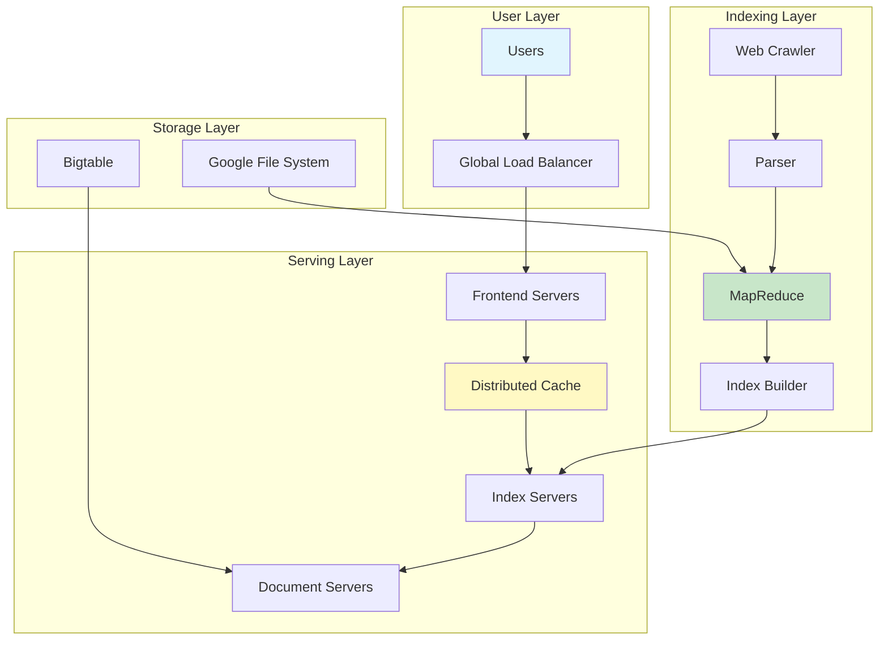
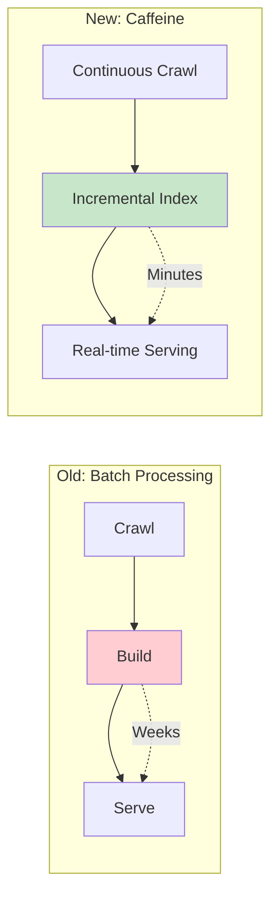
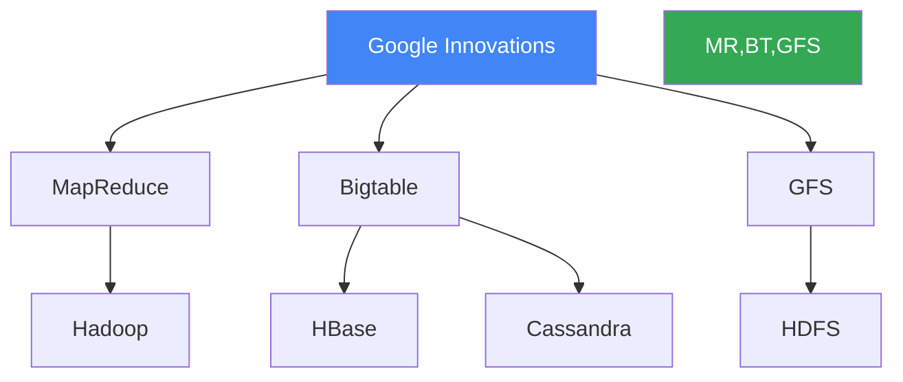

# Google Search Infrastructure: Indexing the World's Information

!!! success "Excellence Badge"
    🥇 **Gold Tier**: Battle-tested at internet scale with proven reliability

!!! abstract "Quick Facts"
    | Metric | Value |
    |--------|-------|
    | **Scale** | 100K+ queries/second |
    | **Index Size** | 100+ billion pages |
    | **Response Time** | <100ms globally |
    | **Infrastructure** | 2.5M+ servers |
    | **Availability** | 99.999% uptime |

## Executive Summary

Google Search processes over 8.5 billion searches daily, indexing the entire web and returning results in under 100 milliseconds. Through innovations like MapReduce, Bigtable, and distributed caching, Google built infrastructure that handles internet-scale data processing while maintaining sub-second response times. Their architecture demonstrates how to build systems that process exabytes of data daily while serving billions of users.

## System Architecture

### High-Level Overview



### Key Components

| Component | Purpose | Scale |
|-----------|---------|-------|
| **Web Crawler** | Discovers and fetches web pages | 50B+ pages/day |
| **MapReduce** | Distributed processing framework | 100PB+ daily |
| **Bigtable** | Structured storage system | Exabytes of data |
| **Index Servers** | Serve search queries | 100K+ servers |
| **Cache Layer** | Reduce latency | 90%+ hit rate |

## Technical Deep Dive

### Indexing Pipeline

=== "Crawling"
    ```python
    # Simplified crawler logic
    class GoogleCrawler:
        def crawl(self, seed_urls):
            frontier = PriorityQueue(seed_urls)
            
            while not frontier.empty():
                url = frontier.get()
                if self.should_crawl(url):
                    content = self.fetch(url)
                    new_urls = self.extract_links(content)
                    frontier.extend(new_urls)
                    self.store_content(url, content)
    ```

=== "MapReduce Processing"
    ```python
    # Inverted index building
    def map(doc_id, content):
        words = tokenize(content)
        for word in words:
            emit(word, doc_id)
    
    def reduce(word, doc_ids):
        posting_list = compress(doc_ids)
        emit(word, posting_list)
    ```

=== "Query Serving"
    ```python
    # Query processing pipeline
    def search(query):
        # Check cache first
        if result := cache.get(query):
            return result
        
        # Parse and expand query
        terms = parse_query(query)
        synonyms = expand_terms(terms)
        
        # Retrieve postings
        postings = index.get_postings(synonyms)
        
        # Rank results
        results = rank_documents(postings)
        
        # Cache and return
        cache.set(query, results)
        return results
    ```

### Performance Optimizations

| Optimization | Impact | Implementation |
|--------------|--------|-----------------|
| **Distributed Caching** | 90% queries from cache | Multi-level cache hierarchy |
| **Index Compression** | 10x storage reduction | Custom compression algorithms |
| **Parallel Processing** | 100x speedup | MapReduce across clusters |
| **Early Termination** | 50% latency reduction | Stop after enough results |
| **Proximity Routing** | 30% latency reduction | Anycast to nearest DC |

## Scaling Challenges

### Challenge 1: Index Freshness



### Challenge 2: Global Consistency

| Region | Replication Strategy | Update Latency |
|--------|---------------------|----------------|
| Primary DC | Synchronous | Immediate |
| Regional DC | Asynchronous | <1 minute |
| Edge Cache | Pull-based | <5 minutes |

## Innovations and Impact

### Key Innovations

1. **PageRank Algorithm**
   - Revolutionary relevance ranking
   - O(n log n) complexity at web scale
   - Foundation for modern search

2. **MapReduce Framework**
   - Simplified distributed computing
   - Inspired Hadoop ecosystem
   - Processes exabytes daily

3. **Bigtable**
   - Sparse, distributed storage
   - Inspired NoSQL movement
   - Scales to trillions of rows

### Industry Impact



## Lessons for Practitioners

### Architecture Principles

!!! tip "Key Takeaways"
    1. **Commodity Hardware**: 1000 cheap machines > 1 supercomputer
    2. **Failure as Normal**: Design for failure, not around it
    3. **Simple Abstractions**: MapReduce enables complex processing
    4. **Cache Everything**: Memory is 1000x faster than disk

### Production Checklist

- [ ] Implement multi-level caching strategy
- [ ] Design for horizontal scaling from day one
- [ ] Build monitoring into every component
- [ ] Automate failure recovery
- [ ] Plan for 10x growth
- [ ] Optimize for the common case
- [ ] Measure everything

## Related Resources

- [MapReduce Pattern](../../../pattern-library/mapreduce.md)
- [Distributed Cache Pattern](../../../pattern-library/distributed-cache.md)
- [Sharding Pattern](../../../pattern-library/scaling/sharding.md)
- [Google Papers](https://research.google/pubs/)

---

*"The best way to predict the future is to invent it." - Google's approach to infrastructure*