# Real-Time Chat System Architecture

**The Challenge**: Build a messaging system handling 100B+ messages/day with end-to-end encryption and global reach

!!! info "Case Study Sources"
    WhatsApp Engineering¹, Signal Protocol², Erlang at WhatsApp³, Facebook Messenger⁴, Discord Engineering⁵

## Introduction

Real-time chat: Ultra-low latency, perfect ordering, offline sync. WhatsApp: 100B messages/day. Balance CAP theorem for instantaneous, reliable experience connecting billions.

## Architecture Evolution

### Phase 1: Simple Client-Server Model (2009-2010)

```text
Mobile App → XMPP Server → MySQL → Mobile App
```

**Problems**: XMPP overhead, DB bottleneck, no offline delivery, battery drain
**Missing**: Message queue, connection pooling, async delivery

### Phase 2: Custom Protocol & Erlang (2010-2012)


**Key Decision**: Erlang/OTP for core infrastructure
**Result**: 2M connections per server (1M concurrent users¹)
**Pattern**: Actor Model

### Phase 3: End-to-End Encryption (2012-2016)


**Innovation: Signal Protocol Implementation**²
- Double Ratchet Algorithm
- Perfect Forward Secrecy
- Future Secrecy
- Deniable Authentication

**Patterns & Pillars Applied**:
- Pattern: End-to-End Encryption (Coming Soon)
- Pattern: Key Management (Coming Soon)
- 🏛 Pillar: [Truth Distribution](../core-principles/pillars/truth-distribution/index.md) - Cryptographic guarantees
- 🏛 Pillar: [Control Distribution](../core-principles/pillars/control-distribution/index.md) - Secure message routing

### Phase 4: Global Scale Architecture (2016-Present)


**Scale Achievements**:
- 100B+ messages/day
- 2B+ monthly active users
- 1M+ concurrent voice calls
- 99.99% message delivery rate

## Part 1: Concept Map - The Physics of Real-Time Communication

### Law 2: Asynchronous Reality - Racing Against Human Perception

In chat systems, latency directly impacts conversation flow. Human perception requires sub-200ms response times for interactions to feel "instant."

#### Latency Sources and Optimization


**Production Numbers**: WhatsApp achieves 200ms median latency with 15+ edge locations using custom MQTT protocol.

### Law 4: Trade-offs - The Quadratic Connection Problem

Chat systems face O(N²) potential connections between N users, requiring sophisticated capacity management and sharding strategies.

#### Infrastructure Scaling Analysis

| User Scale | Concurrent Connections | WebSocket Servers | Message Routers | Storage Requirement | Monthly Cost Estimate |
|------------|----------------------|-------------------|-----------------|--------------------|--------------------|
| **10K Users** | 6K active | 1 server | 1 router | 10GB/day | $2,000 |
| **100K Users** | 60K active | 2-3 servers | 2 routers | 100GB/day | $8,000 |
| **1M Users** | 600K active | 15-20 servers | 10 routers | 1TB/day | $35,000 |
| **10M Users** | 6M active | 150-200 servers | 60 routers | 10TB/day | $200,000 |
| **100M Users** | 60M active | 1,500+ servers | 400+ routers | 100TB/day | $1,500,000 |

#### Message Sharding Strategies

```mermaid
graph TB
    subgraph "Sharding Approaches"
        USER_SHARD[User-based Sharding<br/>- Hash(user_id)<br/>- Session affinity<br/>- Hot user problem]
        CONV_SHARD[Conversation Sharding<br/>- Hash(conversation_id)<br/>- Natural boundaries<br/>- Cross-shard queries]
        TIME_SHARD[Time-based Sharding<br/>- Monthly partitions<br/>- Archive strategy<br/>- Query complexity]
        HYBRID_SHARD[Hybrid Sharding<br/>- Multi-dimensional<br/>- Adaptive strategy<br/>- Rebalancing logic]
    end
    
    subgraph "Shard Management"
        CONSISTENT[Consistent Hashing<br/>- Minimal redistribution<br/>- Virtual nodes<br/>- Load balancing]
        DIRECTORY[Shard Directory<br/>- Lookup service<br/>- Caching layer<br/>- Failover logic]
        MIGRATION[Shard Migration<br/>- Live migration<br/>- Zero-downtime<br/>- Data consistency]
    end
    
    USER_SHARD --> CONSISTENT
    CONV_SHARD --> DIRECTORY
    TIME_SHARD --> MIGRATION
    HYBRID_SHARD --> CONSISTENT & DIRECTORY & MIGRATION
    
    style HYBRID_SHARD fill:#4ecdc4
    style CONSISTENT fill:#95e1d3
    style DIRECTORY fill:#ffd93d
```

**Real Numbers**: Discord handles 4B messages/day, 150M MAU with sophisticated conversation-based sharding.

### Law 1: Failure - Messages Must Not Be Lost

Chat systems implement multi-layered reliability guarantees to ensure zero message loss even during network partitions and server failures.

#### Message Reliability Architecture


#### Reliability Guarantees Table

| Reliability Level | Delivery Guarantee | Durability | Consistency | Latency Impact | Use Case |
|-------------------|-------------------|------------|-------------|----------------|----------|
| **At-most-once** | May lose messages | None | Strong | Minimal | Status updates |
| **At-least-once** | Duplicate possible | WAL + Replication | Eventual | Low | Chat messages |
| **Exactly-once** | No loss, no dupes | Multi-phase commit | Strong | High | Financial transfers |
| **Causal ordering** | Ordered delivery | Persistent | Causal | Medium | Group conversations |

### Law 3: Emergence - Handling Simultaneous Conversations

Multiple users typing, sending messages, and updating status simultaneously creates complex concurrency scenarios requiring careful coordination.

#### Concurrency Control Mechanisms


### Law 5: Epistemology - Global Message Ordering and System Observability

Ensuring consistent message ordering across distributed servers while maintaining comprehensive system observability.

#### Message Ordering Comparison

```mermaid
graph TB
    subgraph "Ordering Strategies"
        CLIENT_TS[Client Timestamps<br/>✓ Simple<br/>✗ Clock skew<br/>✗ Manipulation risk]
        SERVER_TS[Server Timestamps<br/>✓ Consistent<br/>✗ Network latency<br/>✓ Authoritative]
        VECTOR_CLOCK[Vector Clocks<br/>✓ Causal ordering<br/>✗ Complex<br/>✓ Distributed]
        HYBRID_CLOCK[Hybrid Logical Clocks<br/>✓ Best of both<br/>✓ Production ready<br/>✓ Scalable]
    end
    
    subgraph "System Observability"
        METRICS[Metrics Collection<br/>- Message latency<br/>- Delivery rates<br/>- Connection health]
        TRACING[Distributed Tracing<br/>- Request flows<br/>- Bottleneck detection<br/>- Error tracking]
        LOGGING[Structured Logging<br/>- Event correlation<br/>- Debugging context<br/>- Audit trails]
        ALERTING[Intelligent Alerting<br/>- Anomaly detection<br/>- Escalation policies<br/>- Context-aware]
    end
    
    CLIENT_TS --> HYBRID_CLOCK
    SERVER_TS --> HYBRID_CLOCK
    VECTOR_CLOCK --> HYBRID_CLOCK
    
    METRICS --> TRACING --> LOGGING --> ALERTING
    
    style HYBRID_CLOCK fill:#4ecdc4
    style METRICS fill:#95e1d3
    style ALERTING fill:#ffd93d
```



#### System Health Monitoring Dashboard

| Metric Category | Key Indicators | Warning Threshold | Critical Threshold | Business Impact |
|-----------------|----------------|------------------|-------------------|-----------------|
| **Latency** | P50: 50ms, P95: 200ms, P99: 500ms | P99 > 1s | P99 > 2s | User experience |
| **Throughput** | 100K msg/s, 99.9% delivery rate | Rate < 99% | Rate < 95% | Message loss |
| **Connections** | 2M active, 50K/server max | 80% capacity | 95% capacity | Service degradation |
| **Errors** | <0.1% error rate | >1% errors | >5% errors | System reliability |
| **Storage** | 1TB/day growth, 85% utilization | >90% full | >95% full | Service outage |

### Law 6: Human-API - Optimizing for Natural Conversation Flow

Chat systems must adapt to human communication patterns with intelligent features and responsive interfaces.

#### Smart Notification Architecture


### Law 7: Economics - Balancing Cost and Features

Chat systems optimize operational costs while maintaining rich feature sets through intelligent resource management.

#### Cost Optimization Strategies

```mermaid
graph TB
    subgraph "Storage Optimization"
        TIERING[Storage Tiering<br/>- Hot: Redis (recent)<br/>- Warm: PostgreSQL<br/>- Cold: S3 Glacier]
        COMPRESSION[Data Compression<br/>- Message content<br/>- Media files<br/>- Archive data]
        RETENTION[Retention Policies<br/>- User preferences<br/>- Regulatory requirements<br/>- Auto-archiving]
    end
    
    subgraph "Compute Optimization"
        AUTOSCALE[Auto-scaling<br/>- Demand-based<br/>- Predictive scaling<br/>- Resource pooling]
        CACHE[Intelligent Caching<br/>- Multi-level cache<br/>- Cache warming<br/>- TTL optimization]
        BATCH[Batch Processing<br/>- Message batching<br/>- Write coalescing<br/>- Bulk operations]
    end
    
    subgraph "Feature Cost Analysis"
        E2E[E2E Encryption<br/>+30% CPU overhead<br/>+Key management<br/>-Server features]
        SEARCH[Message Search<br/>+Elasticsearch cost<br/>+Indexing overhead<br/>+Storage 2x]
        MEDIA[Media Processing<br/>+Transcoding cost<br/>+CDN bandwidth<br/>+Storage scaling]
    end
    
    TIERING --> COMPRESSION --> RETENTION
    AUTOSCALE --> CACHE --> BATCH
    E2E --> SEARCH --> MEDIA
    
    style TIERING fill:#4ecdc4
    style AUTOSCALE fill:#95e1d3
    style SEARCH fill:#ffd93d
```

#### Cost Per User Analysis

| User Tier | Monthly Messages | Storage Usage | Compute Cost | Network Cost | Total Cost/User |
|-----------|------------------|---------------|--------------|--------------|-----------------|
| **Light User** | 100 messages | 10MB | $0.02 | $0.01 | $0.05 |
| **Regular User** | 1,000 messages | 100MB | $0.15 | $0.08 | $0.35 |
| **Heavy User** | 5,000 messages | 500MB | $0.60 | $0.35 | $1.20 |
| **Power User** | 20,000 messages | 2GB | $2.10 | $1.25 | $4.50 |

## Core Components Deep Dive

### 1. Connection Management


**Connection Lifecycle Architecture**

```mermaid
graph TB
    subgraph "Connection States"
        INIT[Initial Connect]
        AUTH[Authenticating]
        ACTIVE[Active Connection]
        IDLE[Idle State]
        DISC[Disconnected]
    end
    
    subgraph "Management Components"
        CM[Connection Manager<br/>- Track connections<br/>- Handle lifecycle]
        CP[Connection Pool<br/>- Region-based<br/>- Resource limits]
        HB[Heartbeat Service<br/>- Adaptive intervals<br/>- Network monitoring]
    end
    
    INIT --> AUTH: Validate token
    AUTH --> ACTIVE: Success
    AUTH --> DISC: Failed
    ACTIVE --> IDLE: No activity
    IDLE --> ACTIVE: Message received
    IDLE --> DISC: Timeout
    ACTIVE --> DISC: Disconnect
    
    CM --> CP: Manage pools
    CM --> HB: Monitor health
    
    style ACTIVE fill:#4caf50
    style DISC fill:#f44336
```

**Adaptive Heartbeat Configuration**

| Network Quality Score | Heartbeat Interval | Battery Impact | Reliability |
|----------------------|-------------------|----------------|------------|
| > 0.8 (Excellent) | 60s | Low | High |
| 0.6 - 0.8 (Good) | 30-45s | Medium | High |
| 0.4 - 0.6 (Fair) | 20-30s | Medium-High | Medium |
| < 0.4 (Poor) | 10-20s | High | Low |


**Key Connection Metrics**
- Concurrent connections: 2M+ per server
- Heartbeat overhead: < 0.5% bandwidth
- Reconnection time: < 3 seconds
- Session restoration: < 100ms

### 2. Message Routing & Delivery


### 3. End-to-End Encryption Implementation

**Signal Protocol Architecture**


**Encryption Security Guarantees**

| Property | Description | Benefit |
|----------|-------------|---------|
| **Forward Secrecy** | Past messages safe if keys compromised | Historical privacy |
| **Future Secrecy** | Future messages safe after compromise | Automatic recovery |
| **Deniability** | Messages can't be cryptographically attributed | Plausible deniability |
| **Message Ordering** | Detects reordering/replay attacks | Integrity protection |
| **Break-in Recovery** | Self-heals after temporary compromise | Resilience |


### 4. Media Handling

**Media Processing Pipeline**


**Media Size Limits & Formats**

| Media Type | Max Size | Supported Formats | Compression |
|------------|----------|-------------------|-------------|
| **Images** | 16 MB | JPG, PNG, GIF, WebP | WebP conversion |
| **Videos** | 100 MB | MP4, MOV, AVI | H.264/H.265 |
| **Voice** | 10 MB | MP3, AAC, Opus | Opus @ 16kbps |
| **Documents** | 100 MB | PDF, DOC, DOCX | ZIP if needed |


### 5. Group Chat Architecture


**Group Chat Configuration**

| Group Size | Delivery Strategy | Fanout Type | Performance Impact |
|------------|------------------|-------------|-------------------|
| 1-50 members | Direct Fanout | Parallel | Low latency, high resource |
| 51-100 members | Batched Fanout | Server-grouped | Balanced |
| 101-256 members | Optimized Fanout | Multi-tier | High efficiency |


## Law Mapping Analysis - Design Decisions vs Fundamental Constraints

### Comprehensive Design Decision Matrix

Every architectural choice in a chat system must respect all 7 fundamental laws. This comprehensive mapping shows how each design decision impacts and is impacted by each law:

| Design Decision | Law 2: Asynchronous Reality | Law 4: Trade-offs | Law 1: Failure | Law 3: Emergence | Law 5: Epistemology | Law 5: Epistemology | Law 6: Human-API |
|----------------|------------------|-------------------|------------------|---------------------|---------------------|----------------------|------------------------|-------------------|
| **WebSocket Connections** | ✅ Real-time delivery<br/>❌ Connection overhead | ❌ Limited connections per server<br/>✅ Efficient for active users | ❌ Connection drops<br/>✅ Instant failure detection | ✅ Full-duplex communication<br/>❌ State management complexity | ✅ Direct message ordering<br/>❌ Cross-connection sync | ✅ Connection health monitoring<br/>✅ Real-time metrics | ✅ Instant feedback<br/>✅ Natural conversation flow |
| **Message Queuing** | ❌ Added hop latency<br/>✅ Batch processing | ✅ Decouples producers/consumers<br/>✅ Elastic scaling | ✅ Durable message storage<br/>✅ Retry mechanisms | ✅ Natural buffering<br/>✅ Rate limiting | ✅ FIFO guarantees<br/>✅ Distributed ordering | ✅ Queue depth metrics<br/>✅ Processing rates | ❌ Perceived delays<br/>✅ Reliable delivery indication |
| **Edge Caching** | ✅ Sub-10ms reads<br/>✅ Geographic distribution | ✅ Reduces origin load<br/>❌ Cache invalidation overhead | ✅ Fallback to origin<br/>❌ Stale data risk | ✅ Read scaling<br/>❌ Write consistency | ❌ Cache coherence issues<br/>✅ Eventually consistent | ✅ Cache hit rates<br/>✅ Regional performance | ✅ Faster message history<br/>✅ Offline access |
| **End-to-End Encryption** | ❌ Crypto overhead (5-10ms)<br/>❌ No server caching | ❌ Larger message sizes<br/>❌ No compression | ✅ Forward secrecy<br/>❌ No server-side recovery | ✅ Client-side only<br/>❌ Key exchange complexity | ❌ No server validation<br/>✅ Client trust model | ❌ Limited server visibility<br/>✅ Client-side metrics only | ✅ User privacy<br/>❌ No server features |
| **Message Routing** | ✅ Direct paths<br/>❌ Route computation | ❌ Routing table memory<br/>✅ Efficient multicast | ✅ Multiple path options<br/>✅ Automatic rerouting | ✅ Parallel routing<br/>❌ Route consistency | ✅ Ordered delivery paths<br/>❌ Global coordination | ✅ Route performance<br/>✅ Bottleneck detection | ✅ Group chat efficiency<br/>✅ @ mention routing |
| **Offline Sync** | ❌ Sync delay on reconnect<br/>✅ Background sync | ❌ Storage for offline messages<br/>❌ Sync bandwidth spikes | ✅ Message durability<br/>✅ Conflict resolution | ✅ Optimistic updates<br/>❌ Merge conflicts | ✅ Vector clock sync<br/>✅ Causal ordering | ✅ Sync progress tracking<br/>✅ Conflict metrics | ✅ Seamless experience<br/>✅ Work offline |
| **Read Receipts** | ✅ Instant feedback<br/>❌ Extra round trips | ❌ Receipt storage<br/>❌ Delivery tracking overhead | ✅ Delivery confirmation<br/>❌ Receipt delivery failures | ✅ Async receipt processing<br/>✅ Batch updates | ✅ Receipt ordering<br/>❌ Cross-device sync | ✅ Delivery analytics<br/>✅ Read rate metrics | ✅ Conversation awareness<br/>❌ Privacy concerns |
| **Typing Indicators** | ✅ Real-time feedback<br/>❌ Frequent updates | ❌ High message volume<br/>✅ Ephemeral data | ✅ Best effort delivery<br/>✅ No persistence needed | ✅ Debounced updates<br/>✅ Client aggregation | ❌ No ordering needed<br/>✅ Latest value only | ✅ Engagement metrics<br/>❌ Noise in monitoring | ✅ Natural conversation<br/>✅ Presence awareness |
| **Media Handling** | ❌ Upload/download time<br/>✅ CDN distribution | ❌ Storage intensive<br/>❌ Bandwidth heavy | ✅ Separate media pipeline<br/>✅ Progressive download | ✅ Async upload<br/>✅ Parallel processing | ✅ Media before message<br/>✅ Reference architecture | ✅ Media pipeline metrics<br/>✅ CDN performance | ✅ Progress indicators<br/>✅ Preview generation |
| **Group Chats** | ❌ Fan-out latency<br/>❌ Member count impact | ❌ O(N) delivery<br/>❌ State per group | ✅ Partial delivery OK<br/>❌ Consistency challenges | ✅ Concurrent speakers<br/>❌ Message ordering | ❌ Total order required<br/>❌ Distributed consensus | ✅ Group health metrics<br/>✅ Member analytics | ✅ Active discussions<br/>❌ Notification overload |


### Decision Framework Matrix

When designing your chat system, use this matrix to evaluate trade-offs:

| Architecture Choice | Best For | Avoid When | Law Alignment Score |
|-------------------|----------|------------|---------------------|
| **Pure WebSocket** | < 10K users, Gaming chat, Trading platforms | Large scale, Mobile apps, Poor connectivity | Latency: 5/5<br/>Scale: 2/5<br/>Reliability: 2/5 |
| **Queue-Based** | Enterprise, Compliance required, Async communication | Real-time gaming, Video chat sync, Low latency critical | Latency: 2/5<br/>Scale: 5/5<br/>Reliability: 5/5 |
| **CRDT-Based** | Collaborative editing, Offline-first, P2P | Simple messaging, Centralized control needed | Latency: 4/5<br/>Scale: 4/5<br/>Reliability: 4/5 |
| **Actor Model** | Channel-based, Isolated conversations, Gaming guilds | Global state needed, Cross-conversation queries | Latency: 4/5<br/>Scale: 4/5<br/>Reliability: 3/5 |
| **Hybrid (Recommended)** | General purpose, Scale + real-time, Production systems | Simple prototypes, Specific regulatory requirements | Latency: 4/5<br/>Scale: 5/5<br/>Reliability: 4/5 |


## Part 2: Complete System Architecture

### Comprehensive Chat System Architecture


### Message Flow Architecture - 1-to-1 Chat


### Message Flow Architecture - Group Chat


### Broadcast Message Flow


### Data Model Visualizations

#### Message Data Model

```mermaid
erDiagram
    MESSAGE {
        string message_id PK
        string conversation_id FK
        string sender_id FK
        string content
        timestamp created_at
        timestamp updated_at
        string message_type
        json metadata
        string status
        string reply_to_id FK
        int sequence_number
        json attachments
        json mentions
        boolean is_edited
        timestamp edited_at
        string encryption_key_id
    }
    
    CONVERSATION {
        string conversation_id PK
        string conversation_type
        string title
        json participants
        timestamp created_at
        timestamp last_activity
        json settings
        string created_by FK
        boolean is_archived
        json encryption_settings
        int message_count
        string last_message_id FK
    }
    
    USER {
        string user_id PK
        string username
        string display_name
        string email
        string phone_number
        timestamp created_at
        timestamp last_seen
        string status
        json profile_data
        json privacy_settings
        json notification_settings
        string public_key
        boolean is_verified
    }
    
    CONVERSATION_MEMBER {
        string conversation_id FK
        string user_id FK
        string role
        timestamp joined_at
        timestamp last_read_at
        json permissions
        boolean is_muted
        string added_by FK
        timestamp left_at
    }
    
    MESSAGE_STATUS {
        string message_id FK
        string user_id FK
        string status
        timestamp status_at
        string device_id
        json metadata
    }
    
    ATTACHMENT {
        string attachment_id PK
        string message_id FK
        string file_name
        string content_type
        int file_size
        string storage_path
        string thumbnail_path
        json metadata
        timestamp uploaded_at
        string encryption_key
    }
    
    MESSAGE ||--o{ MESSAGE_STATUS : "has delivery status"
    MESSAGE ||--o{ ATTACHMENT : "contains"
    MESSAGE }o--|| CONVERSATION : "belongs to"
    MESSAGE }o--|| USER : "sent by"
    CONVERSATION ||--o{ CONVERSATION_MEMBER : "has members"
    CONVERSATION_MEMBER }o--|| USER : "is user"
    USER ||--o{ MESSAGE : "sends"
    
    %% Indexes
    MESSAGE }|--|| idx_conversation_timestamp : "conversation_id, created_at"
    MESSAGE }|--|| idx_sender_timestamp : "sender_id, created_at"
    MESSAGE_STATUS }|--|| idx_message_user : "message_id, user_id"
    CONVERSATION_MEMBER }|--|| idx_user_conversations : "user_id, joined_at"
```

#### User and Group Data Model

```mermaid
erDiagram
    USER {
        string user_id PK
        string username UK
        string display_name
        string email UK
        string phone_number UK
        timestamp created_at
        timestamp last_seen
        string status
        json profile_data
        json privacy_settings
        json notification_settings
        string public_key
        boolean is_verified
        string device_tokens
        json preferences
    }
    
    GROUP {
        string group_id PK
        string group_name
        string description
        string group_type
        int max_members
        timestamp created_at
        string created_by FK
        string avatar_url
        json settings
        boolean is_public
        string invite_code
        json encryption_settings
        int member_count
    }
    
    GROUP_MEMBER {
        string group_id FK
        string user_id FK
        string role
        timestamp joined_at
        timestamp last_read_at
        json permissions
        boolean is_muted
        string added_by FK
        boolean is_admin
        string invite_code_used
    }
    
    CONTACT {
        string owner_id FK
        string contact_id FK
        string display_name
        timestamp added_at
        boolean is_blocked
        boolean is_favorite
        json custom_settings
        string relationship_type
    }
    
    DEVICE {
        string device_id PK
        string user_id FK
        string device_type
        string device_token
        string platform
        string app_version
        timestamp last_active
        boolean is_active
        json capabilities
        string public_key
    }
    
    USER_SESSION {
        string session_id PK
        string user_id FK
        string device_id FK
        timestamp started_at
        timestamp expires_at
        string connection_id
        json session_data
        string ip_address
        string user_agent
        boolean is_active
    }
    
    PRESENCE {
        string user_id FK
        string status
        timestamp last_seen
        string status_message
        boolean is_online
        json activity_data
        string current_device FK
        timestamp status_updated
    }
    
    USER ||--o{ GROUP_MEMBER : "member of groups"
    GROUP ||--o{ GROUP_MEMBER : "has members"
    USER ||--o{ CONTACT : "has contacts"
    USER ||--o{ DEVICE : "owns devices"
    USER ||--o{ USER_SESSION : "has sessions"
    USER ||--|| PRESENCE : "has presence"
    DEVICE ||--o{ USER_SESSION : "used in sessions"
    GROUP }o--|| USER : "created by"
    GROUP_MEMBER }o--|| USER : "added by"
    CONTACT }o--|| USER : "contact user"
    
    %% Indexes
    USER }|--|| idx_username : "username"
    USER }|--|| idx_email : "email"
    USER }|--|| idx_phone : "phone_number"
    GROUP_MEMBER }|--|| idx_group_user : "group_id, user_id"
    GROUP_MEMBER }|--|| idx_user_groups : "user_id, joined_at"
    USER_SESSION }|--|| idx_user_active : "user_id, is_active"
    PRESENCE }|--|| idx_status_update : "status, status_updated"
```

### WebSocket Connection Management Architecture

```mermaid
graph TB
    subgraph "Connection Lifecycle Management"
        INIT[Initial Connection<br/>- TLS Handshake<br/>- Protocol Negotiation<br/>- Authentication]
        AUTH[Authentication Phase<br/>- JWT Validation<br/>- User Verification<br/>- Device Registration]
        ACTIVE[Active Connection<br/>- Message Handling<br/>- Presence Updates<br/>- Heartbeat Management]
        IDLE[Idle State<br/>- Reduced Heartbeat<br/>- Background Sync<br/>- Power Optimization]
        RECONN[Reconnection<br/>- Exponential Backoff<br/>- Session Recovery<br/>- State Synchronization]
        CLOSE[Connection Closure<br/>- Graceful Shutdown<br/>- Cleanup Resources<br/>- Offline Status]
    end
    
    subgraph "Connection Pool Management"
        POOL[Connection Pool<br/>- Server Selection<br/>- Load Distribution<br/>- Health Monitoring]
        BALANCE[Load Balancing<br/>- Consistent Hashing<br/>- Session Affinity<br/>- Regional Routing]
        SCALE[Auto Scaling<br/>- Demand-based<br/>- Resource Monitoring<br/>- Capacity Planning]
    end
    
    subgraph "Health Monitoring"
        PING[Ping/Pong System<br/>- Adaptive Intervals<br/>- Network Quality<br/>- Battery Awareness]
        DETECT[Connection Detection<br/>- Timeout Handling<br/>- Failure Recognition<br/>- Recovery Triggers]
        METRICS[Connection Metrics<br/>- Latency Tracking<br/>- Throughput Monitoring<br/>- Error Rates]
    end
    
    subgraph "State Management"
        SESSION[Session State<br/>- User Context<br/>- Connection Metadata<br/>- Subscription List]
        SYNC[State Sync<br/>- Multi-device Sync<br/>- Conversation State<br/>- Message Ordering]
        PERSIST[Persistence<br/>- Session Storage<br/>- Recovery Data<br/>- Offline Queue]
    end
    
    %% Connection Flow
    INIT --> AUTH
    AUTH --> ACTIVE
    ACTIVE --> IDLE
    IDLE --> ACTIVE
    ACTIVE --> RECONN
    RECONN --> AUTH
    IDLE --> CLOSE
    ACTIVE --> CLOSE
    
    %% Pool Management
    INIT --> POOL
    POOL --> BALANCE
    BALANCE --> SCALE
    
    %% Health Monitoring
    ACTIVE --> PING
    PING --> DETECT
    DETECT --> METRICS
    METRICS --> RECONN
    
    %% State Management
    AUTH --> SESSION
    SESSION --> SYNC
    SYNC --> PERSIST
    PERSIST --> RECONN
    
    style ACTIVE fill:#4ecdc4
    style RECONN fill:#ff6b6b
    style POOL fill:#95e1d3
    style PING fill:#ffd93d
```

### Connection Scaling Architecture

```mermaid
graph TB
    subgraph "Regional Distribution"
        US_EAST[US East<br/>- New York<br/>- 500K connections<br/>- Primary Region]
        US_WEST[US West<br/>- California<br/>- 300K connections<br/>- Secondary Region]
        EU_WEST[EU West<br/>- London<br/>- 400K connections<br/>- GDPR Compliant]
        ASIA_PAC[Asia Pacific<br/>- Singapore<br/>- 600K connections<br/>- High Growth]
    end
    
    subgraph "Connection Servers per Region"
        subgraph "US East Cluster"
            USE_WS1[WebSocket Server 1<br/>50K connections<br/>16 CPU, 64GB RAM]
            USE_WS2[WebSocket Server 2<br/>50K connections<br/>Load Balanced]
            USE_WSN[WebSocket Server N<br/>Auto Scaling Group<br/>Min: 8, Max: 20]
        end
        
        subgraph "Load Distribution"
            USE_LB[Regional LB<br/>Health Checks<br/>Session Affinity<br/>Circuit Breaker]
            USE_DNS[GeoDNS<br/>Latency Routing<br/>Health Monitoring<br/>Failover Logic]
        end
    end
    
    subgraph "Scaling Metrics & Triggers"
        CPU_MET[CPU Utilization<br/>Target: <70%<br/>Scale Trigger: >80%<br/>Scale Down: <40%]
        CONN_MET[Connection Count<br/>Max per Server: 50K<br/>Scale at: 40K<br/>Buffer: 20%]
        LAT_MET[Latency Metrics<br/>P99 Target: <200ms<br/>Alert: >500ms<br/>Scale: >300ms]
        MEM_MET[Memory Usage<br/>Target: <80%<br/>Scale Trigger: >85%<br/>Alert: >90%]
    end
    
    subgraph "Auto-scaling Logic"
        MONITOR[Monitoring Agent<br/>CloudWatch/Datadog<br/>Custom Metrics<br/>Health Checks]
        DECISION[Scaling Decision<br/>Predictive Scaling<br/>Rule-based Logic<br/>Manual Override]
        ACTION[Scaling Action<br/>Instance Launch<br/>Connection Drain<br/>Load Rebalance]
    end
    
    %% Regional Connections
    US_EAST --> USE_LB
    USE_LB --> USE_WS1 & USE_WS2 & USE_WSN
    USE_DNS --> USE_LB
    
    %% Cross-region Replication
    US_EAST <--> US_WEST
    US_WEST <--> EU_WEST
    EU_WEST <--> ASIA_PAC
    ASIA_PAC <--> US_EAST
    
    %% Metrics Collection
    USE_WS1 & USE_WS2 & USE_WSN --> CPU_MET & CONN_MET & LAT_MET & MEM_MET
    CPU_MET & CONN_MET & LAT_MET & MEM_MET --> MONITOR
    
    %% Scaling Flow
    MONITOR --> DECISION
    DECISION --> ACTION
    ACTION --> USE_WSN
    
    style USE_WS1 fill:#4ecdc4
    style CPU_MET fill:#ff6b6b
    style DECISION fill:#ffd93d
    style ACTION fill:#95e1d3
```

### Performance Characteristics Tables

#### WebSocket Performance Benchmarks

| Server Configuration | Concurrent Connections | CPU Usage | Memory Usage | Network I/O | Latency P99 |
|---------------------|----------------------|-----------|--------------|-------------|-------------|
| **2 vCPU, 4GB RAM** | 5,000 | 45% | 2.1GB | 50 Mbps | 180ms |
| **4 vCPU, 8GB RAM** | 15,000 | 60% | 5.2GB | 150 Mbps | 150ms |
| **8 vCPU, 16GB RAM** | 35,000 | 70% | 11.8GB | 350 Mbps | 120ms |
| **16 vCPU, 32GB RAM** | 50,000 | 65% | 22.4GB | 500 Mbps | 95ms |
| **32 vCPU, 64GB RAM** | 75,000 | 55% | 45.1GB | 750 Mbps | 85ms |

#### Message Processing Performance

| Component | Throughput | Latency | Resource Usage | Scaling Factor |
|-----------|------------|---------|----------------|----------------|
| **Message Router** | 100K msg/s | 5ms | 4 vCPU, 8GB | Linear |
| **Validation Service** | 80K msg/s | 12ms | 2 vCPU, 4GB | Near Linear |
| **Enrichment Service** | 60K msg/s | 18ms | 4 vCPU, 16GB | Sub-linear |
| **Cassandra Write** | 200K writes/s | 8ms | Cluster | Horizontal |
| **Redis Cache** | 1M ops/s | 1ms | 8GB RAM | Memory Bound |
| **Elasticsearch Index** | 50K docs/s | 25ms | 16GB RAM | CPU Bound |

#### Storage Performance Characteristics

| Storage Type | Read IOPS | Write IOPS | Latency | Throughput | Cost per GB/Month |
|--------------|-----------|------------|---------|------------|-------------------|
| **Redis (Hot)** | 100K | 80K | <1ms | 1GB/s | $0.50 |
| **PostgreSQL (SSD)** | 20K | 15K | 5ms | 500MB/s | $0.15 |
| **Cassandra (SSD)** | 50K | 40K | 3ms | 800MB/s | $0.12 |
| **S3 Standard** | 3.5K | 5.5K | 100ms | 100MB/s | $0.023 |
| **S3 Glacier** | 1 | 1 | 12h | 1MB/s | $0.004 |

#### Regional Latency Matrix

| Source Region | US East | US West | EU West | Asia Pacific | Latency Impact |
|---------------|---------|---------|---------|--------------|----------------|
| **US East** | 20ms | 60ms | 80ms | 180ms | WebSocket RTT |
| **US West** | 60ms | 15ms | 140ms | 120ms | Message Routing |
| **EU West** | 80ms | 140ms | 25ms | 200ms | Presence Updates |
| **Asia Pacific** | 180ms | 120ms | 200ms | 30ms | Push Notifications |

### Presence System Architecture

```mermaid
graph TB
    subgraph "Presence Detection"
        DETECT[Connection Events<br/>- WebSocket Connect<br/>- WebSocket Disconnect<br/>- Heartbeat Timeout<br/>- Mobile Background]
        AGGREGATE[Event Aggregation<br/>- Debounce Logic<br/>- Status Calculation<br/>- Multi-device Merge]
        VALIDATE[Status Validation<br/>- Timestamp Ordering<br/>- Device Priority<br/>- Conflict Resolution]
    end
    
    subgraph "Presence Storage"
        REDIS_PRES[Redis Presence<br/>- User Status Hash<br/>- TTL Management<br/>- Atomic Updates<br/>- Pub/Sub Events]
        CASS_HIST[Cassandra History<br/>- Status Timeline<br/>- Analytics Data<br/>- Long-term Storage]
    end
    
    subgraph "Real-time Distribution"
        FANOUT[Presence Fanout<br/>- Contact List Lookup<br/>- Permission Check<br/>- Batch Distribution]
        WS_BROAD[WebSocket Broadcast<br/>- Active Connections<br/>- Selective Update<br/>- Rate Limiting]
        PUSH_PRES[Push Updates<br/>- Offline Users<br/>- Background Sync<br/>- Silent Notifications]
    end
    
    subgraph "Presence Optimization"
        BATCH[Batching Logic<br/>- Time Windows<br/>- Update Coalescence<br/>- Network Efficiency]
        PRIVACY[Privacy Controls<br/>- Visibility Settings<br/>- Contact Filtering<br/>- Status Masking]
        SMART[Smart Updates<br/>- Change Detection<br/>- Priority Routing<br/>- Adaptive Frequency]
    end
    
    subgraph "Status Types"
        ONLINE[Online Status<br/>- Active<br/>- Last Seen<br/>- Activity Type]
        CUSTOM[Custom Status<br/>- User Message<br/>- Emoji Status<br/>- Expiration Time]
        AUTO[Auto Status<br/>- Away/Idle<br/>- Do Not Disturb<br/>- Meeting Mode]
    end
    
    %% Detection Flow
    DETECT --> AGGREGATE --> VALIDATE
    
    %% Storage Flow
    VALIDATE --> REDIS_PRES
    REDIS_PRES --> CASS_HIST
    
    %% Distribution Flow
    REDIS_PRES --> FANOUT
    FANOUT --> WS_BROAD & PUSH_PRES
    
    %% Optimization
    FANOUT --> BATCH & PRIVACY & SMART
    BATCH --> WS_BROAD
    PRIVACY --> FANOUT
    SMART --> BATCH
    
    %% Status Management
    VALIDATE --> ONLINE & CUSTOM & AUTO
    
    style REDIS_PRES fill:#4ecdc4
    style WS_BROAD fill:#95e1d3
    style PRIVACY fill:#ffd93d
    style BATCH fill:#74b9ff
```

### Consistency Model for Message Ordering

```mermaid
graph TB
    subgraph "Message Ordering Strategies"
        CLIENT_TS[Client Timestamp<br/>- Simple Implementation<br/>- Clock Skew Issues<br/>- Manipulation Risk]
        SERVER_TS[Server Timestamp<br/>- Consistent Ordering<br/>- Network Latency<br/>- Single Point Truth]
        VECTOR[Vector Clocks<br/>- Causal Ordering<br/>- Complex Implementation<br/>- Distributed Truth]
        HLC[Hybrid Logical Clocks<br/>- Best of Both<br/>- Production Ready<br/>- Balanced Complexity]
    end
    
    subgraph "Ordering Guarantees"
        CAUSAL[Causal Consistency<br/>- Message Dependencies<br/>- Happens-Before<br/>- Partial Ordering]
        TOTAL[Total Ordering<br/>- Global Sequence<br/>- Strong Consistency<br/>- Performance Impact]
        EVENTUAL[Eventual Consistency<br/>- Local Ordering<br/>- Network Partition<br/>- High Availability]
    end
    
    subgraph "Implementation Details"
        LAMPORT[Lamport Timestamps<br/>- Logical Time<br/>- Event Ordering<br/>- Causality Detection]
        SEQUENCE[Sequence Numbers<br/>- Per-conversation<br/>- Gap Detection<br/>- Reordering Logic]
        MERKLE[Merkle Trees<br/>- Message Integrity<br/>- Synchronization<br/>- Conflict Resolution]
    end
    
    subgraph "Conflict Resolution"
        LWW[Last Writer Wins<br/>- Timestamp Based<br/>- Simple Logic<br/>- Data Loss Risk]
        CRDT[CRDTs<br/>- Conflict-free<br/>- Automatic Merge<br/>- Complex Structure]
        MANUAL[Manual Resolution<br/>- User Choice<br/>- UI Complexity<br/>- Perfect Accuracy]
    end
    
    %% Strategy Relationships
    CLIENT_TS --> EVENTUAL
    SERVER_TS --> TOTAL
    VECTOR --> CAUSAL
    HLC --> CAUSAL & TOTAL
    
    %% Implementation Mapping
    CAUSAL --> LAMPORT
    TOTAL --> SEQUENCE
    EVENTUAL --> MERKLE
    
    %% Conflict Resolution
    LAMPORT --> LWW
    SEQUENCE --> CRDT
    MERKLE --> MANUAL
    
    style HLC fill:#4ecdc4
    style CAUSAL fill:#95e1d3
    style CRDT fill:#ffd93d
    style MANUAL fill:#ff6b6b
```

#### Message Ordering Performance Comparison

| Ordering Strategy | Latency Overhead | Memory Usage | Network Overhead | Conflict Resolution | Best For |
|-------------------|------------------|--------------|------------------|-------------------|----------|
| **Client Timestamp** | 0ms | Minimal | None | Manual | Prototypes, Low Scale |
| **Server Timestamp** | 5-15ms | Low | Minimal | Automatic | Most Applications |
| **Vector Clocks** | 10-25ms | High | High | Complex | Research, P2P |
| **Hybrid Logical** | 3-8ms | Medium | Low | Semi-automatic | Production Scale |
| **Total Ordering** | 15-50ms | Medium | Medium | Perfect | Financial Systems |

### Multi-Region Deployment Architecture

```mermaid
graph TB
    subgraph "Global Infrastructure"
        subgraph "North America"
            NA_PRIMARY[US East Primary<br/>- Full Stack<br/>- Write Master<br/>- 40% Traffic]
            NA_SECONDARY[US West Secondary<br/>- Read Replica<br/>- Failover Ready<br/>- 20% Traffic]
        end
        
        subgraph "Europe"
            EU_PRIMARY[EU West Primary<br/>- Full Stack<br/>- Regional Master<br/>- 25% Traffic]
            EU_SECONDARY[EU Central<br/>- Read Replica<br/>- GDPR Compliance<br/>- 10% Traffic]
        end
        
        subgraph "Asia Pacific"
            ASIA_PRIMARY[Singapore Primary<br/>- Full Stack<br/>- Regional Master<br/>- 35% Traffic]
            ASIA_SECONDARY[Tokyo Secondary<br/>- Read Replica<br/>- Disaster Recovery<br/>- 15% Traffic]
        end
    end
    
    subgraph "Data Replication"
        ASYNC_REP[Asynchronous Replication<br/>- Message History<br/>- User Profiles<br/>- Media Files]
        SYNC_REP[Synchronous Replication<br/>- Account Data<br/>- Payment Info<br/>- Security Events]
        CONFLICT_RES[Conflict Resolution<br/>- Vector Clocks<br/>- Last Writer Wins<br/>- Manual Merge]
    end
    
    subgraph "Cross-Region Communication"
        VPN_MESH[VPN Mesh Network<br/>- Encrypted Tunnels<br/>- Low Latency<br/>- High Bandwidth]
        MESSAGE_SYNC[Message Synchronization<br/>- Event Streaming<br/>- Order Preservation<br/>- Retry Logic]
        STATE_SYNC[State Synchronization<br/>- User Presence<br/>- Conversation State<br/>- Cache Invalidation]
    end
    
    subgraph "Regional Services"
        REGIONAL_AUTH[Regional Auth<br/>- Local Identity<br/>- SSO Integration<br/>- Compliance]
        REGIONAL_MEDIA[Regional Media<br/>- CDN Distribution<br/>- Local Storage<br/>- Processing]
        REGIONAL_PUSH[Regional Push<br/>- FCM/APNS<br/>- Local Providers<br/>- Compliance]
    end
    
    subgraph "Disaster Recovery"
        BACKUP_STRAT[Backup Strategy<br/>- Cross-region Backup<br/>- Point-in-time Recovery<br/>- Automated Restore]
        FAILOVER[Failover Logic<br/>- Health Monitoring<br/>- Automatic Failover<br/>- Manual Override]
        DATA_SYNC[Data Synchronization<br/>- Real-time Sync<br/>- Catch-up Sync<br/>- Conflict Resolution]
    end
    
    %% Regional Connections
    NA_PRIMARY <--> EU_PRIMARY
    EU_PRIMARY <--> ASIA_PRIMARY
    ASIA_PRIMARY <--> NA_PRIMARY
    
    %% Secondary Connections
    NA_PRIMARY --> NA_SECONDARY
    EU_PRIMARY --> EU_SECONDARY
    ASIA_PRIMARY --> ASIA_SECONDARY
    
    %% Replication
    NA_PRIMARY --> ASYNC_REP & SYNC_REP
    EU_PRIMARY --> ASYNC_REP & SYNC_REP
    ASIA_PRIMARY --> ASYNC_REP & SYNC_REP
    ASYNC_REP & SYNC_REP --> CONFLICT_RES
    
    %% Cross-region Communication
    NA_PRIMARY & EU_PRIMARY & ASIA_PRIMARY --> VPN_MESH
    VPN_MESH --> MESSAGE_SYNC & STATE_SYNC
    
    %% Regional Services
    NA_PRIMARY --> REGIONAL_AUTH & REGIONAL_MEDIA & REGIONAL_PUSH
    EU_PRIMARY --> REGIONAL_AUTH & REGIONAL_MEDIA & REGIONAL_PUSH
    ASIA_PRIMARY --> REGIONAL_AUTH & REGIONAL_MEDIA & REGIONAL_PUSH
    
    %% Disaster Recovery
    NA_SECONDARY & EU_SECONDARY & ASIA_SECONDARY --> BACKUP_STRAT
    BACKUP_STRAT --> FAILOVER & DATA_SYNC
    
    style NA_PRIMARY fill:#4ecdc4
    style EU_PRIMARY fill:#95e1d3
    style ASIA_PRIMARY fill:#ffd93d
    style SYNC_REP fill:#ff6b6b
    style FAILOVER fill:#74b9ff
```

#### Multi-Region Performance Metrics

| Region Pair | Network Latency | Replication Delay | Consistency Window | Failover Time |
|-------------|-----------------|-------------------|-------------------|---------------|
| **US East ↔ US West** | 65ms | 150ms | 200ms | 30s |
| **US East ↔ EU West** | 85ms | 200ms | 300ms | 45s |
| **US East ↔ Asia Pacific** | 180ms | 400ms | 500ms | 60s |
| **EU West ↔ Asia Pacific** | 200ms | 450ms | 550ms | 60s |
| **Cross-AZ (Same Region)** | 3ms | 10ms | 15ms | 10s |

#### Regional Compliance & Data Residency

| Region | Data Residency | Compliance Requirements | Encryption Standards | Audit Requirements |
|--------|----------------|------------------------|---------------------|-------------------|
| **North America** | US/Canada | SOC2, HIPAA | AES-256, RSA-4096 | Annual Audit |
| **Europe** | EU Only | GDPR, ISO 27001 | AES-256, ECC-P384 | Quarterly Review |
| **Asia Pacific** | Country-specific | Local Regulations | AES-256, SM2/SM3 | Bi-annual Audit |
| **Global Services** | Multi-region | Cross-border Rules | End-to-End Only | Continuous Monitoring |

## Architecture Alternatives - Five Distinct Approaches

### Alternative Architecture 1: Pure Peer-to-Peer (P2P)

**Design**: Direct peer-to-peer connections using WebRTC for communication.

```mermaid
graph TB
    subgraph "P2P Mesh Network"
        U1[User 1] <--> U2[User 2]
        U1 <--> U3[User 3]
        U1 <--> U4[User 4]
        U2 <--> U3
        U2 <--> U4
        U3 <--> U4
    end
    
    subgraph "Signaling Server"
        SIG[Signaling Server<br/>NAT Traversal]
        U1 -.-> SIG
        U2 -.-> SIG
        U3 -.-> SIG
        U4 -.-> SIG
    end
    
    subgraph "DHT Storage"
        DHT[Distributed Hash Table<br/>Offline Messages]
        U1 --> DHT
        U2 --> DHT
        U3 --> DHT
        U4 --> DHT
    end
```

```python
class P2PChatArchitecture:
    def __init__(self):
        self.peers = {}  # peer_id -> RTCPeerConnection
        self.dht = DistributedHashTable()
        
    async def send_message(self, message):
        peer_id = message['recipient_id']
        
        if peer_id in self.peers and self.peers[peer_id].connected:
# Direct P2P delivery
            await self.peers[peer_id].send(message)
        else:
# Store in DHT for later retrieval
            await self.dht.put(f"msg:{peer_id}", message)
            
    async def establish_connection(self, peer_id):
# WebRTC connection establishment
        connection = RTCPeerConnection()
        offer = await connection.createOffer()
        
# Signal through server
        await self.signal_server.send({
            'type': 'offer',
            'to': peer_id,
            'offer': offer
        })
```

**Trade-offs**:
- True end-to-end encryption
- No central point of failure
- Minimal infrastructure costs
- NAT traversal complexity
- No message history without DHT
- Poor mobile battery life
- Difficult group chats (O(N²) connections)

### Alternative Architecture 2: Centralized Server

**Design**: Traditional client-server architecture with central message routing.

```mermaid
graph TB
    subgraph "Clients"
        C1[Mobile Client 1]
        C2[Web Client 2]
        C3[Desktop Client 3]
        C4[Mobile Client 4]
    end
    
    subgraph "API Gateway"
        LB[Load Balancer]
        C1 --> LB
        C2 --> LB
        C3 --> LB
        C4 --> LB
    end
    
    subgraph "Application Servers"
        LB --> AS1[App Server 1]
        LB --> AS2[App Server 2]
        LB --> AS3[App Server 3]
    end
    
    subgraph "Data Layer"
        AS1 --> DB[(Primary Database)]
        AS2 --> DB
        AS3 --> DB
        DB --> REP[(Read Replicas)]
        AS1 --> CACHE[(Redis Cache)]
        AS2 --> CACHE
        AS3 --> CACHE
    end
    
    subgraph "Push Services"
        AS1 --> PUSH[Push Notification Service]
        PUSH --> C1
        PUSH --> C3
        PUSH --> C4
    end
```

```python
class CentralizedChatArchitecture:
    def __init__(self):
        self.db = PostgreSQLPool()
        self.cache = RedisCache()
        self.push_service = PushNotificationService()
        
    async def handle_message(self, message):
# Validate and persist
        message_id = await self.db.insert_message(message)
        
# Update cache
        await self.cache.add_to_conversation(
            message['conversation_id'], 
            message
        )
        
# Get recipient status
        recipients = await self.db.get_conversation_members(
            message['conversation_id']
        )
        
# Deliver to online users
        online_delivered = 0
        for recipient in recipients:
            if await self.cache.is_user_online(recipient):
                await self.deliver_realtime(recipient, message)
                online_delivered += 1
            else:
# Queue for push notification
                await self.push_service.queue_notification(
                    recipient, message
                )
                
        return {
            'message_id': message_id,
            'delivered': online_delivered,
            'queued': len(recipients) - online_delivered
        }
```

**Trade-offs**:
- Simple to implement and reason about
- Consistent data model
- Easy to add features
- Single point of failure (mitigated by HA)
- Scaling limitations
- All traffic through central servers

### Alternative Architecture 3: Federated (Matrix Protocol)

**Design**: Decentralized federation where servers communicate via standardized protocol.

```mermaid
graph TB
    subgraph "Organization A"
        UA1[User A1] --> SA[Server A<br/>matrix.org]
        UA2[User A2] --> SA
        SA --> DBA[(Database A)]
    end
    
    subgraph "Organization B"
        UB1[User B1] --> SB[Server B<br/>company.com]
        UB2[User B2] --> SB
        SB --> DBB[(Database B)]
    end
    
    subgraph "Organization C"
        UC1[User C1] --> SC[Server C<br/>university.edu]
        UC2[User C2] --> SC
        SC --> DBC[(Database C)]
    end
    
    subgraph "Federation Protocol"
        SA <--> SB
        SB <--> SC
        SA <--> SC
        SA --> ROOM[Room State<br/>Consensus]
        SB --> ROOM
        SC --> ROOM
    end
```

```python
class FederatedChatArchitecture:
    def __init__(self, server_name):
        self.server_name = server_name
        self.federation_client = FederationClient()
        self.room_states = {}  # room_id -> state
        
    async def send_message(self, message):
        room_id = message['room_id']
        
# Add to local timeline
        await self.append_to_room(room_id, message)
        
# Get participating servers
        servers = await self.get_room_servers(room_id)
        
# Federate to other servers
        federation_tasks = []
        for server in servers:
            if server != self.server_name:
                task = self.federation_client.send_event(
                    server, room_id, message
                )
                federation_tasks.append(task)
                
# Wait for majority acknowledgment
        results = await asyncio.gather(
            *federation_tasks, 
            return_exceptions=True
        )
        
        success_count = sum(
            1 for r in results 
            if not isinstance(r, Exception)
        )
        
        return {
            'event_id': message['event_id'],
            'federated_to': success_count,
            'total_servers': len(servers)
        }
        
    async def handle_federation_event(self, event, origin_server):
# Validate event signature
        if not await self.verify_signature(event, origin_server):
            raise SecurityError("Invalid signature")
            
# Check authorization
        if not await self.is_authorized(event):
            raise AuthorizationError("Not authorized")
            
# Apply to room state
        await self.apply_event(event)
        
# Forward to local users
        await self.distribute_to_local_users(event)
```

**Trade-offs**:
- No vendor lock-in
- Privacy preserving (data stays on chosen server)
- Interoperability between organizations
- Complex state resolution
- Higher latency for federation
- Storage duplication across servers

### Alternative Architecture 4: Blockchain-Based

**Design**: Messages as immutable blockchain transactions.

```mermaid
graph TB
    subgraph "Clients"
        C1[Client 1<br/>Wallet: 0x123...]
        C2[Client 2<br/>Wallet: 0x456...]
        C3[Client 3<br/>Wallet: 0x789...]
    end
    
    subgraph "Blockchain Layer"
        C1 --> NODE1[Node 1<br/>Full Node]
        C2 --> NODE2[Node 2<br/>Light Client]
        C3 --> NODE3[Node 3<br/>Full Node]
        
        NODE1 --> BC[Blockchain<br/>Immutable Ledger]
        NODE2 --> BC
        NODE3 --> BC
    end
    
    subgraph "Smart Contracts"
        BC --> MSG[Message Contract<br/>Store & Validate]
        BC --> ROOM[Room Contract<br/>Access Control]
        BC --> ENC[Encryption Contract<br/>Key Management]
    end
    
    subgraph "Off-chain Storage"
        MSG --> IPFS[IPFS<br/>Message Content]
        MSG --> ARWEAVE[Arweave<br/>Permanent Archive]
    end
    
    subgraph "Indexing Layer"
        BC --> GRAPH[The Graph<br/>Query Protocol]
        GRAPH --> API[GraphQL API]
        C1 --> API
        C2 --> API
        C3 --> API
    end
```

```python
class BlockchainChatArchitecture:
    def __init__(self):
        self.web3 = Web3(Web3.HTTPProvider('http://localhost:8545'))
        self.message_contract = self.load_contract('MessageStorage')
        self.ipfs_client = ipfshttpclient.connect()
        
    async def send_message(self, message, private_key):
# Encrypt message content
        encrypted_content = await self.encrypt_message(
            message['content'],
            message['recipient_public_key']
        )
        
# Store encrypted content on IPFS
        ipfs_hash = await self.ipfs_client.add_json({
            'content': encrypted_content,
            'timestamp': message['timestamp'],
            'attachments': message.get('attachments', [])
        })
        
# Create blockchain transaction
        tx = self.message_contract.functions.sendMessage(
            recipient=message['recipient_address'],
            ipfsHash=ipfs_hash,
            messageType=message['type']
        ).buildTransaction({
            'from': message['sender_address'],
            'gas': 200000,
            'gasPrice': self.web3.toWei('20', 'gwei')
        })
        
# Sign and send transaction
        signed_tx = self.web3.eth.account.sign_transaction(
            tx, private_key
        )
        tx_hash = await self.web3.eth.send_raw_transaction(
            signed_tx.rawTransaction
        )
        
# Wait for confirmation
        receipt = await self.web3.eth.wait_for_transaction_receipt(
            tx_hash
        )
        
        return {
            'tx_hash': receipt['transactionHash'].hex(),
            'block_number': receipt['blockNumber'],
            'gas_used': receipt['gasUsed'],
            'ipfs_hash': ipfs_hash
        }
        
    async def get_messages(self, user_address, from_block=0):
# Query blockchain events
        filter = self.message_contract.events.MessageSent.createFilter(
            fromBlock=from_block,
            argument_filters={'recipient': user_address}
        )
        
        messages = []
        for event in filter.get_all_entries():
# Retrieve from IPFS
            ipfs_data = await self.ipfs_client.get_json(
                event['args']['ipfsHash']
            )
            
# Decrypt if possible
            decrypted = await self.decrypt_message(
                ipfs_data['content'],
                user_private_key
            )
            
            messages.append({
                'sender': event['args']['sender'],
                'content': decrypted,
                'block_number': event['blockNumber'],
                'timestamp': ipfs_data['timestamp']
            })
            
        return messages
```

**Trade-offs**:
- Immutable message history
- No central authority
- Cryptographic guarantees
- Censorship resistant
- High latency (block time)
- Transaction fees per message
- Poor scalability
- Complex key management

### Alternative Architecture 5: Event Sourcing + CQRS

**Design**: All changes as immutable events with separate read/write models.

```mermaid
graph TB
    subgraph "Write Side"
        CLIENT[Client] --> CMD[Command API]
        CMD --> VAL[Command Validator]
        VAL --> ES[Event Store<br/>Append Only]
        ES --> PROJ[Event Projector]
    end
    
    subgraph "Events"
        ES --> E1[MessageSent]
        ES --> E2[MessageEdited]
        ES --> E3[MessageDeleted]
        ES --> E4[UserJoined]
        ES --> E5[UserLeft]
    end
    
    subgraph "Read Side"
        PROJ --> CONV[(Conversation View)]
        PROJ --> USER[(User Timeline)]
        PROJ --> SEARCH[(Search Index)]
        PROJ --> ANALYTICS[(Analytics Store)]
        
        CONV --> QAPI[Query API]
        USER --> QAPI
        SEARCH --> QAPI
        QAPI --> CLIENT
    end
    
    subgraph "Real-time Updates"
        ES --> STREAM[Event Stream]
        STREAM --> WS[WebSocket Handler]
        WS --> CLIENT
    end
```

```python
class EventSourcingChatArchitecture:
    def __init__(self):
        self.event_store = EventStore()
        self.command_handler = CommandHandler()
        self.projection_manager = ProjectionManager()
        self.query_handler = QueryHandler()
        
    async def handle_send_message_command(self, command):
# Validate command
        validation = await self.validate_command(command)
        if not validation.is_valid:
            return {'error': validation.errors}
            
# Generate events
        events = [
            MessageSentEvent(
                conversation_id=command.conversation_id,
                message_id=generate_id(),
                sender_id=command.sender_id,
                content=command.content,
                timestamp=datetime.utcnow()
            )
        ]
        
# Store events
        stream_id = f"conversation-{command.conversation_id}"
        version = await self.event_store.append_events(
            stream_id, events
        )
        
# Update projections asynchronously
        await self.projection_manager.project_events(events)
        
# Stream to connected clients
        await self.stream_events_to_clients(events)
        
        return {
            'message_id': events[0].message_id,
            'version': version,
            'timestamp': events[0].timestamp
        }
        
    async def get_conversation_messages(self, conversation_id, 
                                      from_timestamp=None):
# Query from read model (not event store)
        return await self.query_handler.get_messages(
            conversation_id,
            from_timestamp
        )
        
    async def rebuild_conversation_view(self, conversation_id):
# Replay events to rebuild state
        events = await self.event_store.get_stream_events(
            f"conversation-{conversation_id}"
        )
        
        state = ConversationState()
        for event in events:
            state = self.apply_event(state, event)
            
        return state

class ProjectionManager:
    def __init__(self):
        self.projections = {
            'conversation_view': ConversationProjection(),
            'user_timeline': UserTimelineProjection(),
            'search_index': SearchIndexProjection()
        }
        
    async def project_events(self, events):
# Update all projections in parallel
        tasks = []
        for projection in self.projections.values():
            tasks.append(projection.handle_events(events))
            
        await asyncio.gather(*tasks)
```

**Trade-offs**:
- Complete audit trail
- Time travel debugging
- Flexible read models
- Natural event streaming
- Eventually consistent reads
- Complex implementation
- Storage overhead

## Comparative Trade-off Analysis

### Architecture Comparison Matrix

| Criteria | P2P | Centralized | Federated | Blockchain | Event Sourcing | Hybrid |
|----------|-----|-------------|-----------|------------|----------------|---------|
| **Latency** | 10-50ms | 20-100ms | 50-200ms | 1-15 sec | 30-150ms | 20-80ms |
| **Scalability** | Poor (O(N²)) | Good | Excellent | Poor | Excellent | Excellent |
| **Reliability** | Low | High | High | Highest | High | High |
| **Privacy** | Excellent | Poor | Good | Good | Moderate | Moderate |
| **Cost per User** | $0.01 | $0.10 | $0.15 | $1-10 | $0.20 | $0.12 |
| **Dev Complexity** | High | Low | High | Very High | High | Medium |
| **Offline Support** | Excellent | Poor | Good | Good | Good | Good |
| **Compliance** | Difficult | Easy | Moderate | Complex | Easy | Easy |


### Feature Support Comparison

| Feature | P2P | Centralized | Federated | Blockchain | Event Sourcing | Hybrid |
|---------|-----|-------------|-----------|------------|----------------|---------|
| **1-on-1 Chat** | ✅ Excellent | ✅ Excellent | ✅ Good | ❌ Poor | ✅ Good | ✅ Excellent |
| **Group Chat** | ❌ Poor | ✅ Excellent | ✅ Good | ❌ Poor | ✅ Excellent | ✅ Excellent |
| **Message History** | ❌ Limited | ✅ Full | ✅ Full | ✅ Immutable | ✅ Complete | ✅ Full |
| **Search** | ❌ Local only | ✅ Full | ⚠️ Per-server | ⚠️ Limited | ✅ Flexible | ✅ Full |
| **Media Sharing** | ⚠️ Direct only | ✅ CDN | ✅ CDN | ❌ Expensive | ✅ CDN | ✅ CDN |
| **Presence** | ✅ Real-time | ✅ Real-time | ⚠️ Delayed | ❌ Not suitable | ✅ Real-time | ✅ Real-time |
| **Typing Indicators** | ✅ Direct | ✅ Easy | ⚠️ Complex | ❌ Too expensive | ✅ Natural | ✅ Easy |
| **Read Receipts** | ⚠️ Complex | ✅ Simple | ✅ Good | ⚠️ On-chain | ✅ Event-based | ✅ Simple |
| **E2E Encryption** | ✅ Native | ⚠️ Retrofit | ✅ Good | ✅ Native | ⚠️ Complex | ✅ Supported |
| **Moderation** | ❌ None | ✅ Central | ⚠️ Per-server | ❌ Impossible | ✅ Audit trail | ✅ Flexible |


### Scale and Performance Characteristics

| Metric | P2P | Centralized | Federated | Blockchain | Event Sourcing | Hybrid |
|--------|-----|-------------|-----------|------------|----------------|---------|
| **Max Users** | ~1K | ~100M | Unlimited | ~10K | ~1B | ~1B |
| **Messages/sec** | 100 | 1M | 100K | 10 | 500K | 1M |
| **Storage Growth** | O(N) | O(N) | O(N×Servers) | O(N×Nodes) | O(N×Views) | O(N) |
| **Network Usage** | High | Moderate | High | Very High | Moderate | Moderate |
| **CPU Usage** | High | Low | Moderate | Very High | Moderate | Low |
| **Operational Cost** | Minimal | Linear | Sub-linear | Exponential | Linear | Sub-linear |


### Decision Framework

Choose your architecture based on these primary factors:

| If You Need... | Choose... | Because... |
|----------------|-----------|------------|
| Absolute privacy | P2P | No servers see messages |
| Simple implementation | Centralized | Well-understood patterns |
| Multi-organization | Federated | Each org controls data |
| Audit compliance | Event Sourcing | Complete history |
| Proof of authenticity | Blockchain | Cryptographic guarantees |
| Production scale | Hybrid | Balanced trade-offs |


### Recommended Hybrid Architecture

Combining the best approaches for production scale:

```mermaid
graph TB
    subgraph "Edge Layer"
        C1[Client] --> EDGE1[Edge Node<br/>WebSocket]
        C2[Client] --> EDGE2[Edge Node<br/>WebSocket]
    end
    
    subgraph "Routing Layer"
        EDGE1 --> ROUTER[Smart Router<br/>User Location Aware]
        EDGE2 --> ROUTER
        ROUTER --> AFFINITY[Affinity Router]
    end
    
    subgraph "Processing Layer"
        AFFINITY --> CONV1[Conversation<br/>Actor 1]
        AFFINITY --> CONV2[Conversation<br/>Actor 2]
        AFFINITY --> CONVN[Conversation<br/>Actor N]
    end
    
    subgraph "Persistence Layer"
        CONV1 --> WAL[Write-Ahead Log]
        WAL --> CASS[(Cassandra<br/>Long-term)]
        WAL --> REDIS[(Redis<br/>Hot Data)]
    end
    
    subgraph "Delivery Layer"
        CONV1 --> PUSH[Push Gateway]
        CONV1 --> SYNC[Sync Service]
        SYNC --> EDGE1
        SYNC --> EDGE2
    end
```

### Implementation Details

```python
class HybridChatArchitecture:
    """Production-ready hybrid chat system"""
    
    def __init__(self):
        self.edge_nodes = {}
        self.conversation_actors = {}
        self.message_pipeline = MessagePipeline()
        
    async def handle_message(self, message: Message) -> Dict:
        """Process message through hybrid pipeline"""
# 1. Validate and enrich
        enriched = await self._enrich_message(message)
        
# 2. Route to conversation actor
        actor = self._get_conversation_actor(enriched.recipient_id)
        
# 3. Process in actor (isolated state)
        result = await actor.process_message(enriched)
        
# 4. Persist asynchronously
        asyncio.create_task(self._persist_message(enriched))
        
# 5. Fan out to recipients
        delivery_results = await self._fanout_message(enriched, result['recipients'])
        
# 6. Handle offline recipients
        for recipient, delivered in delivery_results.items():
            if not delivered:
                await self._queue_for_offline_delivery(recipient, enriched)
        
        return {
            'message_id': enriched.id,
            'delivered_to': sum(1 for d in delivery_results.values() if d),
            'queued_for': sum(1 for d in delivery_results.values() if not d),
            'latency_ms': (time.time() - message.timestamp.timestamp()) * 1000
        }
    
    async def _fanout_message(self, message: Message, 
                            recipients: List[str]) -> Dict[str, bool]:
        """Efficiently deliver to online recipients"""
        delivery_tasks = []
        
        for recipient in recipients:
            if recipient in self.edge_nodes:
# Online - deliver immediately
                task = self._deliver_to_edge(recipient, message)
            else:
# Offline - will be queued
                task = asyncio.create_task(self._check_online_status(recipient))
            
            delivery_tasks.append((recipient, task))
        
# Parallel delivery
        results = {}
        for recipient, task in delivery_tasks:
            try:
                results[recipient] = await task
            except Exception:
                results[recipient] = False
        
        return results
```

## Architecture Selection Guide

### Quick Decision Tree

```mermaid
graph TD
    START[Start: Define Requirements] --> SCALE{Expected Scale?}
    
    SCALE -->|< 1K users| SIMPLE[Simple Architecture]
    SCALE -->|1K - 100K users| MEDIUM[Medium Scale]
    SCALE -->|> 100K users| LARGE[Large Scale]
    
    SIMPLE --> PRIVACY1{Privacy Critical?}
    PRIVACY1 -->|Yes| P2P[P2P Architecture]
    PRIVACY1 -->|No| CENTRAL[Centralized]
    
    MEDIUM --> ORGS{Multi-Organization?}
    ORGS -->|Yes| FED[Federated]
    ORGS -->|No| AUDIT{Audit Required?}
    AUDIT -->|Yes| ES[Event Sourcing]
    AUDIT -->|No| HYBRID1[Hybrid]
    
    LARGE --> CRYPTO{Crypto Proof Needed?}
    CRYPTO -->|Yes| BLOCKCHAIN[Blockchain]
    CRYPTO -->|No| HYBRID2[Hybrid]
```

### Use Case Mapping

| Use Case | Recommended Architecture | Key Requirements |
|----------|-------------------------|------------------|
| **Startup MVP** | Centralized | Fast development, iterate quickly |
| **Enterprise Slack** | Event Sourcing + CQRS | Audit trail, compliance, search |
| **Gaming Chat** | Hybrid (WebSocket heavy) | Ultra-low latency, voice integration |
| **Secure Messenger** | P2P with DHT | E2E encryption, no metadata |
| **Government Comms** | Federated | Data sovereignty, interop |
| **DAO Governance** | Blockchain | Transparent, immutable, public |
| **WhatsApp Clone** | Hybrid | Scale, reliability, mobile-first |


### Architecture Evolution Path

```mermaid
graph LR
    MVP[MVP<br/>Centralized] --> SCALE1[Growth<br/>Add Queue]
    SCALE1 --> SCALE2[Scale<br/>Shard Database]
    SCALE2 --> GLOBAL[Global<br/>Edge Servers]
    GLOBAL --> MATURE[Mature<br/>Hybrid Architecture]
    
    MVP -.->|If Privacy Focus| P2P[P2P First]
    MVP -.->|If Enterprise| ES[Event Sourcing]
```

## Performance & Monitoring

### Key Metrics Dashboard

```mermaid
graph TB
    subgraph "Real-time Metrics"
        LAT[Latency Tracking]
        THRU[Throughput Monitoring]
        CONN[Connection Health]
        ERR[Error Tracking]
    end
    
    subgraph "Metric Types"
        HIST[Histograms<br/>P50, P95, P99]
        COUNT[Counters<br/>Messages, Errors]
        GAUGE[Gauges<br/>Active Users]
    end
    
    subgraph "Alerting Thresholds"
        A1[Latency > 5s]
        A2[Error Rate > 1%]
        A3[Connections Drop > 10%]
    end
    
    LAT --> HIST
    THRU --> COUNT
    CONN --> GAUGE
    ERR --> COUNT
    
    HIST --> A1
    COUNT --> A2
    GAUGE --> A3
    
    style LAT fill:#4ecdc4
    style A1 fill:#ff6b6b
```

**System Performance Metrics**

| Metric Category | Key Indicators | Alert Thresholds |
|-----------------|----------------|------------------|
| **Latency** | P50: 50ms<br/>P95: 200ms<br/>P99: 500ms | P99 > 1s |
| **Throughput** | Messages/sec: 100K<br/>Delivery rate: 99.9% | Rate < 99% |
| **Connections** | Active: 2M<br/>New/sec: 10K | Drops > 10% |
| **Errors** | Delivery failures<br/>Timeout errors | Error rate > 1% |
| **Business** | DAU: 10M<br/>Messages/user: 50 | DAU drop > 5% |


**Monitoring Stack Architecture**

```mermaid
graph LR
    subgraph "Data Collection"
        APP[Application<br/>Metrics]
        SYS[System<br/>Metrics]
        LOG[Application<br/>Logs]
    end
    
    subgraph "Processing"
        KAFKA[Kafka<br/>Streaming]
        FLINK[Flink<br/>Aggregation]
    end
    
    subgraph "Storage & Viz"
        PROM[Prometheus<br/>Time Series]
        GRAF[Grafana<br/>Dashboards]
        ALERT[AlertManager<br/>Notifications]
    end
    
    APP & SYS & LOG --> KAFKA
    KAFKA --> FLINK
    FLINK --> PROM
    PROM --> GRAF
    PROM --> ALERT
    
    style KAFKA fill:#4ecdc4
    style PROM fill:#ffd93d
    style GRAF fill:#95e1d3
```

## Failure Scenarios & Recovery

### Common Failure Modes

```mermaid
graph TB
    subgraph "Failure Types"
        F1[Regional Network Partition]
        F2[Database Shard Failure]
        F3[Mass Reconnection Storm]
        F4[Redis Cache Failure]
        F5[Message Queue Overflow]
    end
    
    subgraph "Detection"
        D1[Health Checks]
        D2[Circuit Breakers]
        D3[Anomaly Detection]
    end
    
    subgraph "Recovery Actions"
        R1[Traffic Rerouting]
        R2[Replica Promotion]
        R3[Rate Limiting]
        R4[Graceful Degradation]
        R5[Auto-scaling]
    end
    
    F1 --> D1 --> R1
    F2 --> D2 --> R2
    F3 --> D3 --> R3
    F4 --> D2 --> R4
    F5 --> D3 --> R5
    
    style F1 fill:#ff6b6b
    style F2 fill:#ff6b6b
    style F3 fill:#ff6b6b
```

**Failure Recovery Procedures**

| Failure Type | Detection Method | Recovery Time | Recovery Action |
|--------------|------------------|---------------|----------------|
| **Regional Partition** | Ping failures > 3 | < 30s | DNS failover to healthy region |
| **Shard Failure** | Replication lag > 5s | < 60s | Promote replica, update routing |
| **Connection Storm** | Rate > 10x normal | < 10s | Enable backpressure, scale out |
| **Cache Failure** | Circuit breaker open | < 5s | Fallback to database |
| **Queue Overflow** | Depth > 1M messages | < 120s | Spill to S3, add consumers |


## Key Implementation Considerations

### 1. Message Ordering Strategy

| Strategy | Use When | Trade-offs |
|----------|----------|------------|
| **Client Timestamp** | Trusting clients | Simple but manipulable |
| **Server Timestamp** | Central authority | Consistent but ignores latency |
| **Vector Clocks** | Distributed systems | Complex but accurate |
| **Hybrid Logical Clocks** | Best of both | Recommended for production |


### 2. Storage Strategy

| Data Type | Hot Storage | Warm Storage | Cold Storage |
|-----------|-------------|--------------|--------------|
| **Recent Messages** | Redis/Memory | PostgreSQL | - |
| **Message History** | - | Cassandra | S3/Glacier |
| **Media Files** | CDN Cache | S3 Standard | S3 Glacier |
| **Search Index** | Elasticsearch | - | - |


### 3. Scaling Triggers

| Metric | Warning Threshold | Action Required |
|--------|------------------|-----------------|
| **Message Latency** | > 200ms p99 | Add edge servers |
| **Connection Count** | > 40K/server | Add WebSocket servers |
| **Queue Depth** | > 10K messages | Add workers |
| **DB CPU** | > 70% sustained | Shard database |
| **Storage Growth** | > 1TB/day | Implement archival |


## Key Design Insights

### 1. **Real-time Requires Custom Protocols**
XMPP too heavy; custom binary saves 60% bandwidth; adaptive heartbeat for battery

### 2. 🔐 **E2E Encryption is Non-negotiable**
Signal Protocol for forward secrecy; server can't read messages; key management critical

### 3. **Mobile-First Design Essential**
Battery optimization; push notifications for offline; adaptive media quality

### 4. **Global Scale Needs Federation**
Regional servers reduce latency; cross-region replication; compliance ready

### 5. **Erlang/Elixir for Concurrent Connections**
2M connections/server; actor model; let-it-crash philosophy

## Related Concepts & Deep Dives

### 📚 Relevant Laws
- **[Law 2: Asynchronous Reality](../../../core-principles/laws/asynchronous-reality/)** - WebSocket for real-time, regional servers
- **[Law 4: Trade-offs](../../../core-principles/laws/multidimensional-optimization/)** - Connection pooling, message queuing
- **[Law 1: Failure](../../../core-principles/laws/correlated-failure/)** - Offline queue, retry mechanisms
- **[Law 3: Emergence](../../../core-principles/laws/emergent-chaos/)** - Actor model, parallel delivery
- **[Law 5: Epistemology](../../../core-principles/laws/distributed-knowledge/)** - Group state sync, message ordering, and monitoring
- **[Law 6: Human-API](../../../core-principles/laws/cognitive-load/)** - Typing indicators, read receipts

### 🏛 Related Patterns
- **WebSocket (Coming Soon)** - Persistent connections
- **Distributed Queue (Coming Soon)** - Reliable delivery
- **Actor Model (Coming Soon)** - Concurrent message handling
- **[Circuit Breaker](../../../pattern-library/resilience/circuit-breaker.md)** - Service protection
- **[Event Sourcing](../../../pattern-library/data-management/event-sourcing.md)** - Message history
- **[CRDT](../../../pattern-library/data-management/crdt.md)** - Distributed state sync
- **[Saga Pattern](../../../pattern-library/data-management/saga.md)** - Group operations

### Quantitative Models
- **[Little's Law](../../quantitative-analysis/littles-law.md)** - Connection pool sizing
- **[Queueing Theory](../../quantitative-analysis/queueing-models.md)** - Message queue capacity
- **CAP Theorem (Coming Soon)** - Consistency vs availability
- **[Network Theory](../quantitative-analysis/network-theory.md)** - Optimal server placement

### Similar Case Studies
<!-- TODO: Add when available
- **Discord Architecture** - Gaming chat at scale
- **Slack's Infrastructure** - Enterprise messaging
- **Telegram's MTProto** - Custom protocol design
-->
<!-- TODO: Add when available
- **Signal's Architecture** - Privacy-first messaging
-->

## Conclusion

Building instant-feeling chat at billions-scale requires hybrid architecture: WebSockets for real-time, actors for isolation, queues for reliability.

Key insights:
1. **No single architecture fits all** - Choose based on privacy, scale, features
2. **Design impacts all 7 laws** - Every choice affects latency, capacity, failures, and more
3. **Hybrid architectures dominate** - Blend patterns for different message types
4. **Start simple, evolve deliberately** - Begin centralized, add distribution as needed

Best architecture meets user needs while respecting distributed systems physics.

---

## References

1. WhatsApp Engineering: "The WhatsApp Architecture" - Engineering Blog (2022)
2. Signal Protocol Documentation - Open Whisper Systems (2021)
3. "Erlang at WhatsApp" - Code Beam Conference (2019)
4. Facebook Messenger Scale - F8 Conference (2020)
5. Discord Engineering Blog: "How Discord Stores Billions of Messages" (2021)