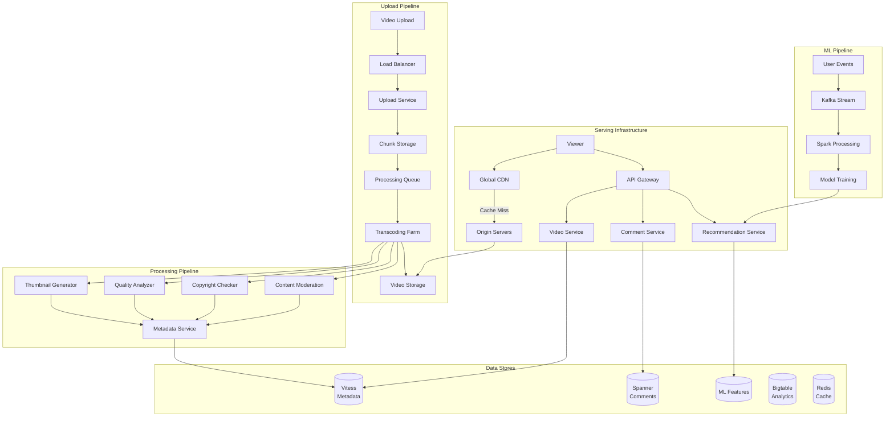
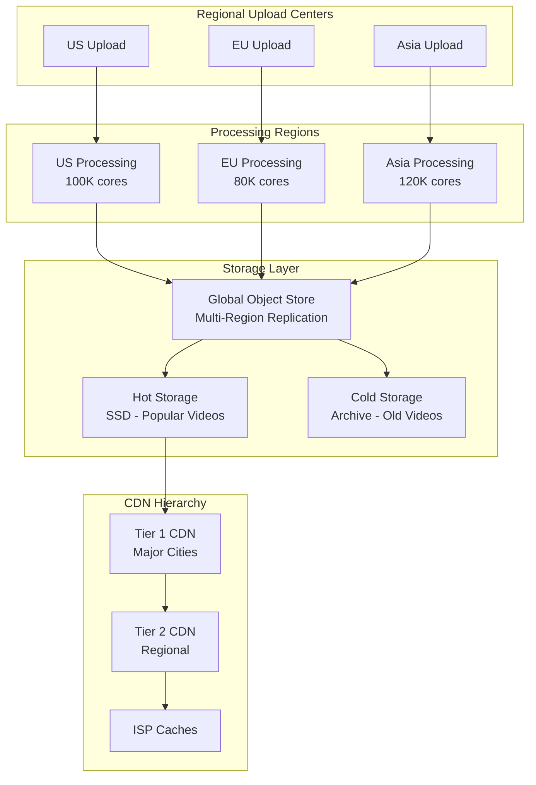
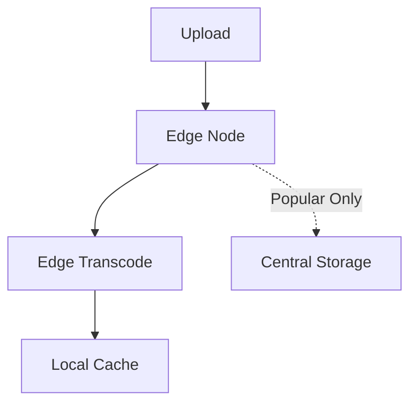
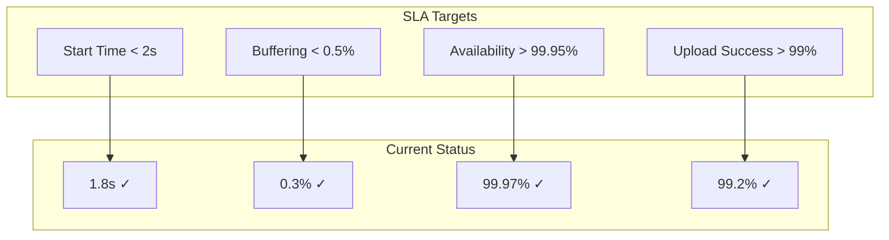

# Design YouTube

## Problem Statement

Design a video streaming platform that can:
- Handle 500+ hours of video uploads per minute
- Stream to 2 billion+ users globally
- Support multiple video qualities (144p to 8K)
- Provide personalized recommendations
- Enable real-time comments and interactions
- Monetize through ads and subscriptions

## 1. Problem Clarification Questions

**Functional Requirements:**
- Q: What video formats should we support? (MP4, AVI, MOV, etc.)
- Q: Do we need live streaming capabilities?
- Q: Should we support video editing features?
- Q: What about monetization - ads, subscriptions, super chat?
- Q: Do we need content moderation and copyright detection?

**Scale Requirements:**
- Q: How many active users? (2B+ monthly)
- Q: Video upload rate? (500 hours/minute)
- Q: Average video length? (10 minutes)
- Q: View to upload ratio? (1000:1)
- Q: Geographic distribution? (Global)

**Technical Requirements:**
- Q: Video quality requirements? (144p to 8K)
- Q: Acceptable startup time? (<2 seconds)
- Q: Buffering tolerance? (<0.5% of playback time)
- Q: Mobile vs desktop split? (70% mobile)
- Q: Offline download support?

## 2. Functional Requirements

Core features to implement:

1. **Video Upload** - Accept and process video uploads
2. **Video Processing** - Transcode to multiple qualities
3. **Video Streaming** - Adaptive bitrate streaming
4. **Search & Discovery** - Find videos by title, channel, tags
5. **Recommendations** - Personalized video suggestions
6. **Interactions** - Comments, likes, subscriptions
7. **Analytics** - View counts, watch time, demographics

## 3. Non-Functional Requirements

- **Scale**: 2B+ users, 500hrs/min uploads, 1B+ hours watched daily
- **Performance**: <2s video start, <0.5% rebuffering
- **Availability**: 99.95% uptime
- **Global**: CDN presence worldwide
- **Storage**: Exabyte-scale video storage
- **Cost**: Optimize bandwidth and storage costs

## 4. Capacity Estimation

### Storage Requirements

```
Video Storage:
- Upload rate: 500 hours/minute = 30,000 hours/hour
- Average bitrate (all qualities): 5 Mbps
- Storage per hour of video: 5 Mbps × 3600s = 2.25 GB
- Daily uploads: 30,000 × 24 × 2.25 GB = 1.62 PB/day
- Yearly uploads: 1.62 PB × 365 = 591 PB/year

With multiple qualities (5 versions average):
- Total yearly storage: 591 PB × 5 = 2.95 EB/year
- Historical data (10 years): ~30 EB total

Metadata Storage:
- 1B videos × 10KB metadata = 10 TB
- Comments: 100B × 1KB = 100 TB
- User data: 2B × 1MB = 2 PB
```

### Bandwidth Requirements

```
Video Streaming:
- Daily video views: 5B
- Average video length: 10 minutes
- Average bitrate: 2 Mbps (adaptive)
- Daily bandwidth: 5B × 10min × 2Mbps = 16.7 EB/day
- Peak bandwidth: 16.7 EB / 86400s × 3 (peak factor) = 580 Tbps

Upload Bandwidth:
- 500 hours/min × 60min × 10 Mbps (original) = 300 Gbps constant
```

### Compute Requirements

```
Video Transcoding:
- 500 hours/minute input
- 5 quality levels × 2x realtime = 10x compute
- 5000 CPU-hours/minute = 300,000 cores

Recommendation System:
- 2B users × 10 recommendations × 100ms = 200B CPU-seconds/day
- ~2.3M CPU-seconds/second = 2,300 cores

Streaming Servers:
- 10M concurrent viewers × 1 CPU per 1000 streams = 10,000 cores
```

## 5. API Design

### Video Upload API

```python
# Upload initiation
POST /api/v1/videos/upload/init
Headers: Authorization: Bearer {token}
Body: {
  "title": "My Video",
  "description": "Description",
  "tags": ["tag1", "tag2"],
  "category": "Education",
  "privacy": "public",  # public, unlisted, private
  "file_size": 1073741824,  # 1GB
  "file_type": "video/mp4"
}

Response: {
  "upload_id": "abc123",
  "upload_url": "https://upload.youtube.com/...",
  "chunk_size": 10485760,  # 10MB chunks
  "expires_at": "2024-01-20T10:00:00Z"
}

# Chunk upload
PUT /api/v1/videos/upload/{upload_id}/chunk/{chunk_number}
Headers: 
  Content-Type: application/octet-stream
  Content-Range: bytes 0-10485759/1073741824
Body: [Binary chunk data]

# Complete upload
POST /api/v1/videos/upload/{upload_id}/complete
Response: {
  "video_id": "dQw4w9WgXcQ",
  "status": "processing",
  "estimated_time": 300  # seconds
}
```

### Video Streaming API

```python
# Get video metadata
GET /api/v1/videos/{video_id}
Response: {
  "video_id": "dQw4w9WgXcQ",
  "title": "Video Title",
  "channel": {
    "id": "UC123",
    "name": "Channel Name"
  },
  "duration": 212,
  "views": 1234567890,
  "likes": 9876543,
  "upload_date": "2024-01-15T10:00:00Z",
  "available_qualities": ["144p", "360p", "720p", "1080p"],
  "dash_manifest_url": "https://cdn.youtube.com/manifest/...",
  "hls_manifest_url": "https://cdn.youtube.com/hls/..."
}

# Get video manifest (DASH)
GET /manifest/{video_id}.mpd
Response: [DASH MPD XML with multiple bitrates]

# Get video segment
GET /video/{video_id}/{quality}/{segment_number}.m4s
Response: [Binary video segment]
```

### Interaction APIs

```python
# Post comment
POST /api/v1/videos/{video_id}/comments
Body: {
  "text": "Great video!",
  "parent_id": null  # for replies
}

# Like/Unlike video
POST /api/v1/videos/{video_id}/like
DELETE /api/v1/videos/{video_id}/like

# Subscribe to channel
POST /api/v1/channels/{channel_id}/subscribe
DELETE /api/v1/channels/{channel_id}/subscribe

# Get recommendations
GET /api/v1/recommendations?limit=20
Response: {
  "videos": [
    {
      "video_id": "abc123",
      "title": "Recommended Video",
      "thumbnail_url": "...",
      "duration": 300,
      "channel_name": "...",
      "views": 1000000
    }
  ]
}
```

## 6. Data Model

### Video Metadata

```python
# Main video table (Spanner/Vitess)
class Video:
    video_id: str  # 11 chars, base64
    channel_id: str
    title: str
    description: str
    tags: List[str]
    category: str
    upload_time: datetime
    duration: int  # seconds
    status: str  # processing, active, deleted
    privacy: str  # public, unlisted, private
    
# Video statistics (Bigtable - time series)
class VideoStats:
    video_id: str
    timestamp: datetime
    views: int
    likes: int
    dislikes: int
    comments: int
    watch_time_hours: float
    
# Video files (Cloud Storage metadata)
class VideoFile:
    video_id: str
    quality: str  # 144p, 360p, 720p, etc
    codec: str  # h264, h265, av1
    bitrate: int
    file_size: int
    storage_path: str
    cdn_url: str
```

### User Data

```python
# User profile (Spanner)
class User:
    user_id: str
    email: str
    username: str
    created_at: datetime
    channel_id: str
    subscription_count: int
    
# Watch history (Bigtable)
class WatchHistory:
    user_id: str
    video_id: str
    timestamp: datetime
    watch_duration: int
    device_type: str
    
# Subscriptions (Spanner)
class Subscription:
    user_id: str
    channel_id: str
    subscribed_at: datetime
    notification_enabled: bool
```

## 7. High-Level Architecture



## 8. Detailed Design

### Video Upload and Processing

```python
class VideoUploadService:
    def __init__(self):
        self.chunk_store = ChunkStore()
        self.metadata_store = MetadataStore()
        self.queue = ProcessingQueue()
        
    async def initiate_upload(self, request: UploadRequest) -> UploadSession:
        """Initialize resumable upload session"""
# Generate unique upload ID
        upload_id = self._generate_upload_id()
        
# Create upload session
        session = UploadSession(
            upload_id=upload_id,
            user_id=request.user_id,
            file_size=request.file_size,
            chunk_size=10 * 1024 * 1024,  # 10MB chunks
            total_chunks=math.ceil(request.file_size / chunk_size),
            uploaded_chunks=set()
        )
        
# Store session
        await self.session_store.save(session)
        
# Generate signed upload URL
        upload_url = self._generate_signed_url(upload_id)
        
        return session
    
    async def upload_chunk(self, upload_id: str, chunk_number: int, 
                          data: bytes) -> ChunkStatus:
        """Handle chunk upload with deduplication"""
# Verify session
        session = await self.session_store.get(upload_id)
        if not session:
            raise UploadSessionNotFound()
            
# Calculate chunk hash for deduplication
        chunk_hash = hashlib.sha256(data).hexdigest()
        
# Check if chunk already exists (deduplication)
        existing = await self.chunk_store.exists(chunk_hash)
        if existing:
# Just reference existing chunk
            await self._reference_chunk(session, chunk_number, chunk_hash)
        else:
# Store new chunk
            await self.chunk_store.put(chunk_hash, data)
            await self._reference_chunk(session, chunk_number, chunk_hash)
            
# Update session
        session.uploaded_chunks.add(chunk_number)
        await self.session_store.save(session)
        
        return ChunkStatus(
            chunks_uploaded=len(session.uploaded_chunks),
            total_chunks=session.total_chunks
        )
    
    async def complete_upload(self, upload_id: str) -> str:
        """Finalize upload and trigger processing"""
        session = await self.session_store.get(upload_id)
        
# Verify all chunks uploaded
        if len(session.uploaded_chunks) != session.total_chunks:
            raise IncompleteUpload()
            
# Generate video ID
        video_id = self._generate_video_id()
        
# Create processing job
        job = ProcessingJob(
            video_id=video_id,
            upload_id=upload_id,
            chunk_hashes=[session.chunks[i] for i in range(session.total_chunks)],
            user_id=session.user_id,
            metadata=session.metadata
        )
        
# Queue for processing
        await self.queue.enqueue(job, priority=self._calculate_priority(session))
        
        return video_id
```

### Video Transcoding Pipeline

```python
class TranscodingPipeline:
    def __init__(self):
        self.transcoder = DistributedTranscoder()
        self.quality_ladder = [
            {'resolution': '144p', 'bitrate': 100, 'codec': 'h264'},
            {'resolution': '360p', 'bitrate': 500, 'codec': 'h264'},
            {'resolution': '720p', 'bitrate': 2500, 'codec': 'h264'},
            {'resolution': '1080p', 'bitrate': 5000, 'codec': 'h264'},
            {'resolution': '1080p', 'bitrate': 3000, 'codec': 'av1'},  # Better compression
            {'resolution': '4K', 'bitrate': 15000, 'codec': 'h265'}
        ]
        
    async def process_video(self, job: ProcessingJob):
        """Process video through transcoding pipeline"""
        try:
# 1. Reconstruct original video from chunks
            original_path = await self._reconstruct_video(job.chunk_hashes)
            
# 2. Analyze video characteristics
            analysis = await self._analyze_video(original_path)
            
# 3. Determine optimal encoding ladder
            encoding_ladder = self._optimize_ladder(analysis, self.quality_ladder)
            
# 4. Parallel transcoding
            transcode_tasks = []
            for quality_profile in encoding_ladder:
                task = self._transcode_quality(
                    original_path,
                    job.video_id,
                    quality_profile
                )
                transcode_tasks.append(task)
                
            transcode_results = await asyncio.gather(*transcode_tasks)
            
# 5. Generate adaptive streaming manifests
            dash_manifest = await self._generate_dash_manifest(
                job.video_id,
                transcode_results
            )
            hls_manifest = await self._generate_hls_manifest(
                job.video_id,
                transcode_results
            )
            
# 6. Extract additional metadata
            thumbnails = await self._generate_thumbnails(original_path)
            subtitles = await self._extract_subtitles(original_path)
            
# 7. Update video status
            await self._update_video_status(
                job.video_id,
                status='ready',
                manifests={'dash': dash_manifest, 'hls': hls_manifest},
                thumbnails=thumbnails
            )
            
        except Exception as e:
            await self._handle_processing_error(job, e)
    
    async def _transcode_quality(self, input_path: str, video_id: str,
                                quality: dict) -> TranscodeResult:
        """Transcode video to specific quality"""
# Use hardware acceleration when available
        encoder = 'h264_nvenc' if quality['codec'] == 'h264' else quality['codec']
        
# FFmpeg command for segmented output (DASH/HLS compatible)
        output_pattern = f"{video_id}_{quality['resolution']}_%05d.m4s"
        
        cmd = [
            'ffmpeg',
            '-i', input_path,
            '-c:v', encoder,
            '-b:v', f"{quality['bitrate']}k",
            '-maxrate', f"{quality['bitrate'] * 1.5}k",
            '-bufsize', f"{quality['bitrate'] * 2}k",
            '-g', '48',  # GOP size
            '-keyint_min', '48',
            '-sc_threshold', '0',
            '-f', 'segment',
            '-segment_time', '4',  # 4 second segments
            '-segment_format', 'mp4',
            output_pattern
        ]
        
# Execute transcoding
        await self._execute_ffmpeg(cmd)
        
# Upload segments to storage
        segments = await self._upload_segments(video_id, quality['resolution'])
        
        return TranscodeResult(
            quality=quality['resolution'],
            codec=quality['codec'],
            bitrate=quality['bitrate'],
            segments=segments
        )
```

### CDN and Video Serving

```python
class VideoServingService:
    def __init__(self):
        self.cdn_manager = CDNManager()
        self.origin_store = OriginStore()
        self.cache = DistributedCache()
        
    async def get_video_manifest(self, video_id: str, 
                                format: str = 'dash') -> str:
        """Get adaptive streaming manifest"""
# Check cache first
        cache_key = f"manifest:{video_id}:{format}"
        cached = await self.cache.get(cache_key)
        if cached:
            return cached
            
# Generate manifest
        video_meta = await self._get_video_metadata(video_id)
        
        if format == 'dash':
            manifest = self._generate_dash_manifest(video_meta)
        else:  # HLS
            manifest = self._generate_hls_manifest(video_meta)
            
# Cache manifest
        await self.cache.set(cache_key, manifest, ttl=3600)
        
        return manifest
    
    def _generate_dash_manifest(self, video_meta: VideoMetadata) -> str:
        """Generate DASH MPD manifest"""
        mpd = f'''<?xml version="1.0" encoding="UTF-8"?>
<MPD xmlns="urn:mpeg:dash:schema:mpd:2011" 
     profiles="urn:mpeg:dash:profile:isoff-on-demand:2011"
     type="static"
     mediaPresentationDuration="PT{video_meta.duration}S">
  <Period start="PT0S">
    <AdaptationSet mimeType="video/mp4" segmentAlignment="true">'''
    
        for quality in video_meta.available_qualities:
            mpd += f'''
      <Representation id="{quality.quality}" 
                      bandwidth="{quality.bitrate * 1000}"
                      width="{quality.width}" 
                      height="{quality.height}">
        <BaseURL>{quality.base_url}/</BaseURL>
        <SegmentList timescale="1000" duration="4000">
          <Initialization sourceURL="init.mp4"/>'''
            
            for i, segment in enumerate(quality.segments):
                mpd += f'''
          <SegmentURL media="segment_{i}.m4s"/>'''
                
            mpd += '''
        </SegmentList>
      </Representation>'''
            
        mpd += '''
    </AdaptationSet>
  </Period>
</MPD>'''
        
        return mpd
    
    async def serve_video_segment(self, video_id: str, quality: str,
                                 segment: int) -> bytes:
        """Serve individual video segment with CDN optimization"""
        segment_key = f"{video_id}/{quality}/segment_{segment}.m4s"
        
# Try CDN cache first
        cdn_url = self.cdn_manager.get_edge_url(segment_key)
        
# For this design, we'll return the CDN URL
# In practice, the CDN would handle the actual serving
        return cdn_url
```

### Recommendation System

```python
class RecommendationEngine:
    def __init__(self):
        self.collaborative_filter = CollaborativeFiltering()
        self.content_based = ContentBasedFiltering()
        self.deep_model = DeepRecommendationModel()
        self.feature_store = FeatureStore()
        
    async def get_recommendations(self, user_id: str, 
                                 context: dict) -> List[VideoRecommendation]:
        """Generate personalized video recommendations"""
# 1. Get user features
        user_features = await self._get_user_features(user_id)
        
# 2. Get candidate videos from multiple sources
        candidates = []
        
# Recent uploads from subscriptions
        subscription_videos = await self._get_subscription_videos(user_id, limit=100)
        candidates.extend(subscription_videos)
        
# Collaborative filtering candidates
        cf_videos = await self.collaborative_filter.get_similar_users_videos(
            user_id, 
            limit=200
        )
        candidates.extend(cf_videos)
        
# Content-based candidates (based on watch history)
        cb_videos = await self.content_based.get_similar_videos(
            user_features.watch_history[-10:],  # Last 10 videos
            limit=200
        )
        candidates.extend(cb_videos)
        
# Trending videos
        trending = await self._get_trending_videos(
            region=context.get('region'),
            limit=50
        )
        candidates.extend(trending)
        
# 3. Remove duplicates and already watched
        candidates = self._deduplicate(candidates)
        candidates = await self._filter_watched(candidates, user_id)
        
# 4. Feature extraction for ranking
        features = await self._extract_ranking_features(
            user_id,
            candidates,
            context
        )
        
# 5. Score with deep learning model
        scores = await self.deep_model.predict(features)
        
# 6. Re-rank with business rules
        final_rankings = self._apply_business_rules(
            candidates,
            scores,
            user_features
        )
        
# 7. Diversify results
        diversified = self._diversify_results(final_rankings)
        
        return diversified[:20]
    
    async def _extract_ranking_features(self, user_id: str, 
                                       videos: List[Video],
                                       context: dict) -> np.ndarray:
        """Extract features for ranking model"""
        features = []
        
        for video in videos:
            video_features = {
# Video features
                'video_age_hours': (datetime.now() - video.upload_time).total_seconds() / 3600,
                'video_duration': video.duration,
                'video_views': video.views,
                'video_likes_ratio': video.likes / (video.likes + video.dislikes + 1),
                'channel_subscribers': video.channel.subscribers,
                
# User-video interaction features
                'user_channel_affinity': await self._get_channel_affinity(user_id, video.channel_id),
                'category_match_score': await self._get_category_preference(user_id, video.category),
                'language_match': video.language == context.get('language'),
                
# Contextual features
                'time_of_day': context.get('hour', 0),
                'day_of_week': context.get('day_of_week', 0),
                'device_type': context.get('device', 'unknown'),
                
# Collaborative signals
                'co_view_score': await self._get_coview_score(user_id, video.video_id),
                
# Freshness
                'is_new_upload': video.upload_time > datetime.now() - timedelta(hours=24),
                'from_subscription': video.channel_id in user_features.subscriptions
            }
            
            features.append(list(video_features.values()))
            
        return np.array(features)
```

### Real-time Analytics

```python
class VideoAnalyticsPipeline:
    def __init__(self):
        self.kafka_producer = KafkaProducer()
        self.view_aggregator = ViewAggregator()
        self.trending_detector = TrendingDetector()
        
    async def track_view(self, view_event: ViewEvent):
        """Process video view event"""
# 1. Send to Kafka for stream processing
        await self.kafka_producer.send(
            'video-views',
            key=view_event.video_id,
            value=view_event.to_json()
        )
        
# 2. Update real-time counters
        await self.view_aggregator.increment(
            video_id=view_event.video_id,
            timestamp=view_event.timestamp
        )
        
# 3. Update user history (for recommendations)
        await self._update_user_history(
            user_id=view_event.user_id,
            video_id=view_event.video_id,
            watch_time=view_event.watch_duration
        )
        
# 4. Check for trending signals
        if await self.trending_detector.is_spike(view_event.video_id):
            await self._mark_as_trending(view_event.video_id)
    
    async def get_video_analytics(self, video_id: str) -> VideoAnalytics:
        """Get comprehensive analytics for a video"""
# Real-time metrics
        realtime = await self.view_aggregator.get_realtime_stats(video_id)
        
# Historical data from Bigtable
        historical = await self._get_historical_stats(video_id)
        
# Demographics from aggregated data
        demographics = await self._get_viewer_demographics(video_id)
        
# Traffic sources
        sources = await self._get_traffic_sources(video_id)
        
        return VideoAnalytics(
            total_views=realtime.total_views,
            watch_time_hours=realtime.watch_time_hours,
            average_view_duration=realtime.avg_duration,
            likes=realtime.likes,
            comments=realtime.comments,
            retention_curve=historical.retention_curve,
            demographics=demographics,
            traffic_sources=sources,
            trending_rank=realtime.trending_rank
        )
```

### Live Streaming Support

```python
class LiveStreamingService:
    def __init__(self):
        self.rtmp_servers = RTMPServerPool()
        self.transcoder = LiveTranscoder()
        self.hls_packager = HLSPackager()
        
    async def start_stream(self, channel_id: str) -> StreamSession:
        """Initialize live streaming session"""
# Allocate RTMP ingestion server
        rtmp_server = self.rtmp_servers.allocate()
        
# Generate stream key
        stream_key = self._generate_stream_key()
        
# Create session
        session = StreamSession(
            session_id=str(uuid.uuid4()),
            channel_id=channel_id,
            stream_key=stream_key,
            rtmp_url=f"rtmp://{rtmp_server}/live/{stream_key}",
            status='waiting_for_stream'
        )
        
# Setup transcoding pipeline
        await self.transcoder.setup_pipeline(
            session_id=session.session_id,
            qualities=['360p', '720p', '1080p', 'source']
        )
        
        return session
    
    async def process_live_stream(self, session_id: str):
        """Process incoming live stream"""
        while True:
# Get chunk from RTMP
            chunk = await self.rtmp_servers.get_chunk(session_id)
            if not chunk:
                break
                
# Transcode to multiple qualities
            transcoded = await self.transcoder.transcode_chunk(chunk)
            
# Package as HLS segments
            for quality, data in transcoded.items():
                segment = await self.hls_packager.create_segment(
                    session_id,
                    quality,
                    data
                )
                
# Push to CDN
                await self._push_to_cdn(segment)
                
# Update manifest
            await self._update_live_manifest(session_id)
```

## 9. Scale Considerations

### Global Architecture



### Database Sharding Strategy

```python
class DatabaseSharding:
    """YouTube uses Vitess for MySQL sharding"""
    
    def __init__(self):
        self.shard_count = 10000  # Number of shards
        
    def get_video_shard(self, video_id: str) -> int:
        """Shard by video_id for even distribution"""
        return hash(video_id) % self.shard_count
        
    def get_user_shard(self, user_id: str) -> int:
        """Shard by user_id for user data"""
        return hash(user_id) % self.shard_count
        
    def get_comment_shards(self, video_id: str) -> List[int]:
        """Comments sharded by video_id with replication"""
        primary = self.get_video_shard(video_id)
# Return primary and replica shards
        return [primary, (primary + 1) % self.shard_count]
```

### Caching Strategy

```python
class MultiLayerCache:
    """Hierarchical caching for YouTube"""
    
    def __init__(self):
        self.browser_cache_ttl = 3600  # 1 hour
        self.cdn_cache_ttl = 86400  # 1 day
        self.app_cache_ttl = 300  # 5 minutes
        
    async def get_video_metadata(self, video_id: str):
# L1: Application cache (Redis)
        cached = await self.redis.get(f"meta:{video_id}")
        if cached:
            return cached
            
# L2: Database with caching
        metadata = await self.db.get_video(video_id)
        
# Cache in Redis
        await self.redis.set(
            f"meta:{video_id}", 
            metadata,
            ttl=self.app_cache_ttl
        )
        
        return metadata
    
    def get_cache_headers(self, content_type: str) -> dict:
        """CDN and browser cache headers"""
        if content_type == 'video_segment':
            return {
                'Cache-Control': f'public, max-age={self.cdn_cache_ttl}',
                'Vary': 'Accept-Encoding'
            }
        elif content_type == 'manifest':
            return {
                'Cache-Control': f'public, max-age={60}',  # 1 minute
                'Vary': 'Accept-Encoding'
            }
```

## 10. Trade-offs and Alternatives

### Key Design Decisions

| Decision | Choice | Alternative | Trade-off |
|----------|--------|-------------|-----------|
| **Storage** | Object Storage + CDN | Distributed File System | Simplicity vs Control |
| **Database** | Vitess (Sharded MySQL) | NoSQL (Cassandra) | ACID vs Scale |
| **Video Format** | DASH + HLS | Single Format | Compatibility vs Complexity |
| **Transcoding** | Pre-transcode all | On-demand transcoding | Storage vs Latency |
| **ML Platform** | Custom TensorFlow | Off-the-shelf | Control vs Development Time |


### Alternative Architectures

#### Alternative 1: Peer-to-Peer CDN


**Pros**: Reduced bandwidth costs, scales with popularity
**Cons**: Quality control, security concerns, reliability

#### Alternative 2: Edge Computing


**Pros**: Reduced latency, local content
**Cons**: Hardware costs, management complexity

## 11. Monitoring and Operations

### Key Metrics Dashboard

```python
class YouTubeMetrics:
    def __init__(self):
        self.metrics = {
# User Experience
            'video_start_time': Histogram('video_start_seconds'),
            'rebuffering_ratio': Gauge('rebuffer_percentage'),
            'video_quality': Histogram('bitrate_bps'),
            
# System Health
            'upload_success_rate': Gauge('upload_success_percent'),
            'transcoding_queue_depth': Gauge('transcode_queue_size'),
            'cdn_hit_ratio': Gauge('cdn_cache_hit_percent'),
            
# Business Metrics
            'daily_active_users': Counter('dau'),
            'watch_time_hours': Counter('watch_hours'),
            'ad_revenue': Counter('revenue_usd')
        }
```

### SLA Monitoring



## 12. Security and Content Considerations

### Security Measures
- **Authentication**: OAuth 2.0 for API access
- **DRM**: Widevine/FairPlay for premium content
- **Rate Limiting**: Per-user upload/API limits
- **Encryption**: TLS for transport, AES for storage

### Content Protection
- **Copyright Detection**: Content ID system
- **DMCA Compliance**: Automated takedown process
- **Age Restrictions**: ML-based content classification
- **Spam Prevention**: Upload limits, reputation system

## Conclusion

This YouTube design demonstrates how to build a global video platform that:
- Handles 500+ hours of uploads per minute through distributed processing
- Serves billions of hours daily via intelligent CDN architecture
- Provides <2 second start times through adaptive bitrate streaming
- Scales to exabytes of storage with cost-effective tiering
- Delivers personalized recommendations using sophisticated ML

Key architectural insights:
1. **Chunked uploads** enable resumability and deduplication
2. **Pre-transcoding** trades storage for instant playback
3. **Hierarchical CDN** with ISP partnerships reduces costs
4. **Sharded databases** (Vitess) provide horizontal scaling
5. **ML-driven everything** from encoding to recommendations

### Interview Tips

When presenting this design:
1. Start with the scale numbers to set context
2. Explain the upload → process → serve pipeline clearly
3. Deep dive into 1-2 components (usually video serving or recommendations)
4. Discuss CDN strategy and cost optimizations
5. Don't forget about live streaming if asked