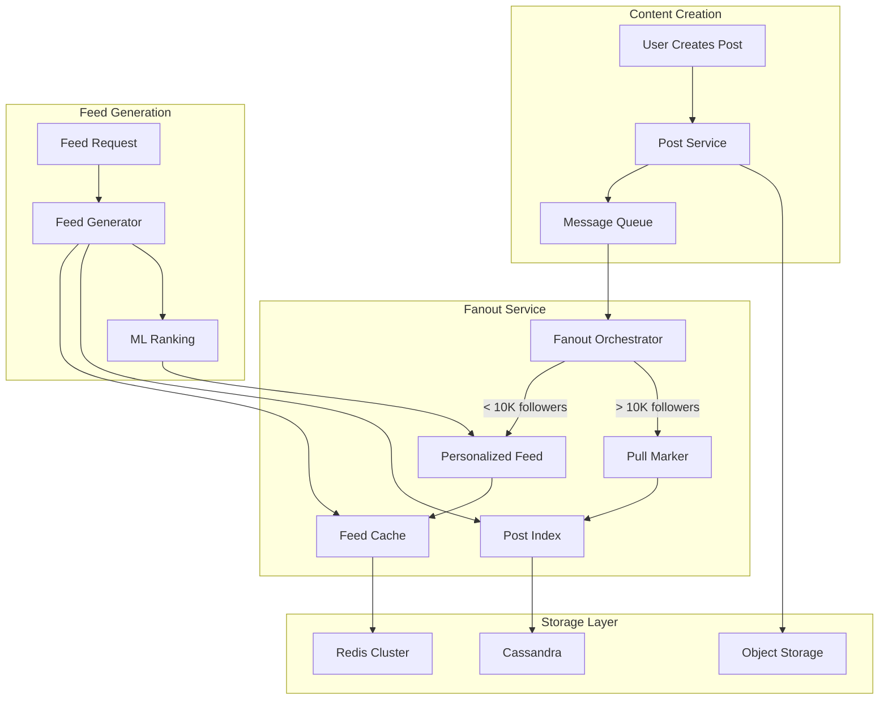
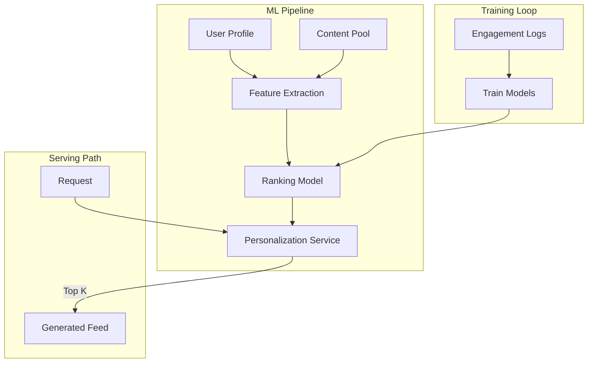
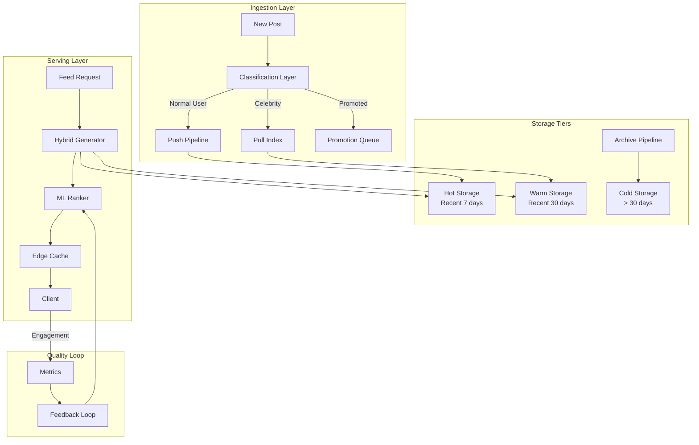
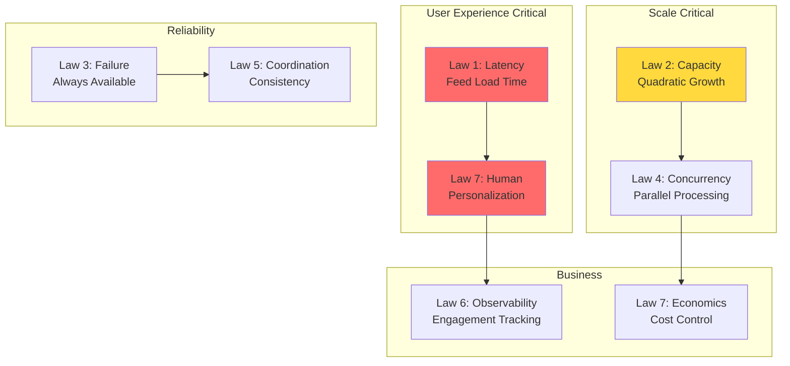
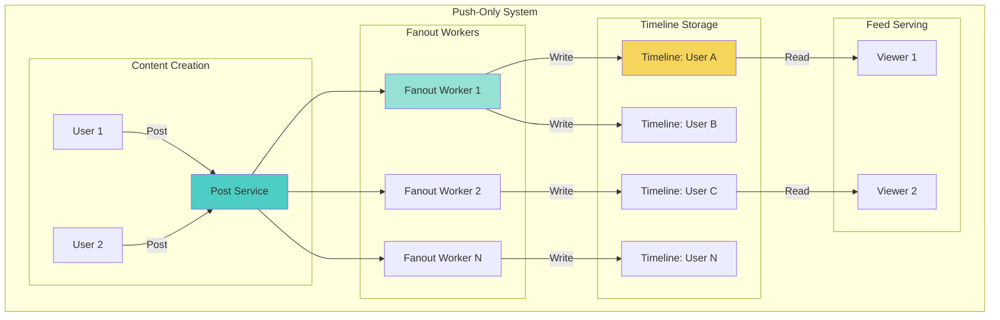
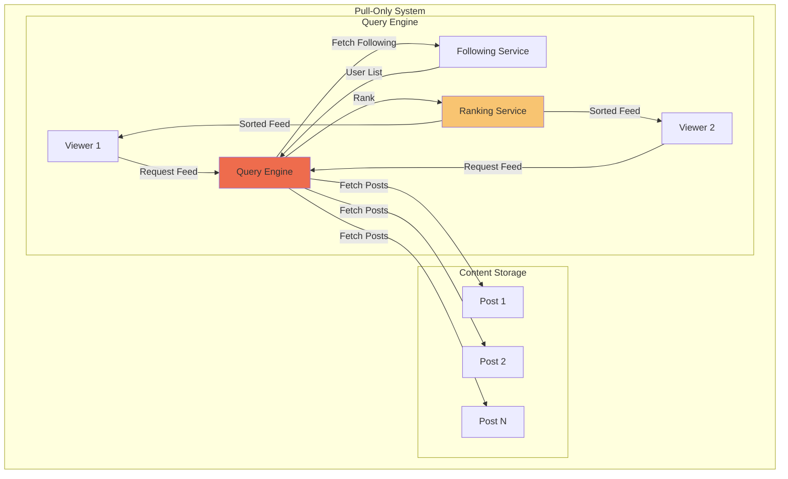
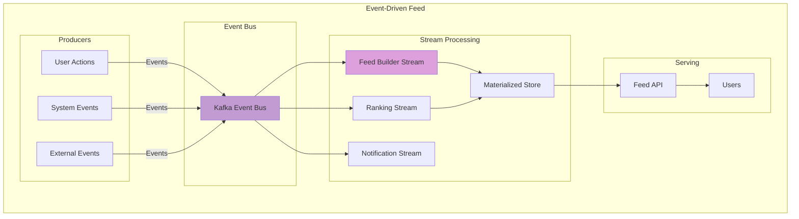
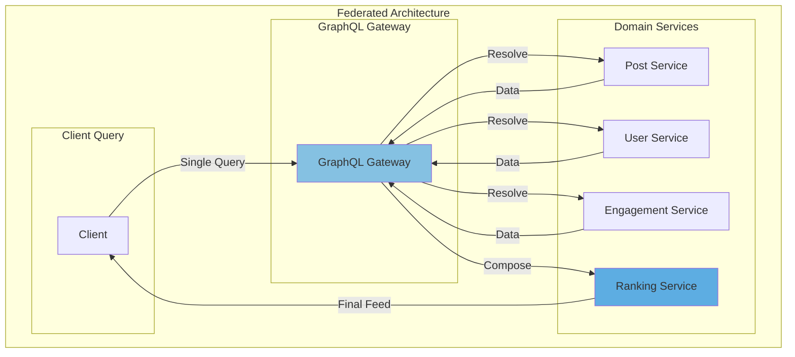
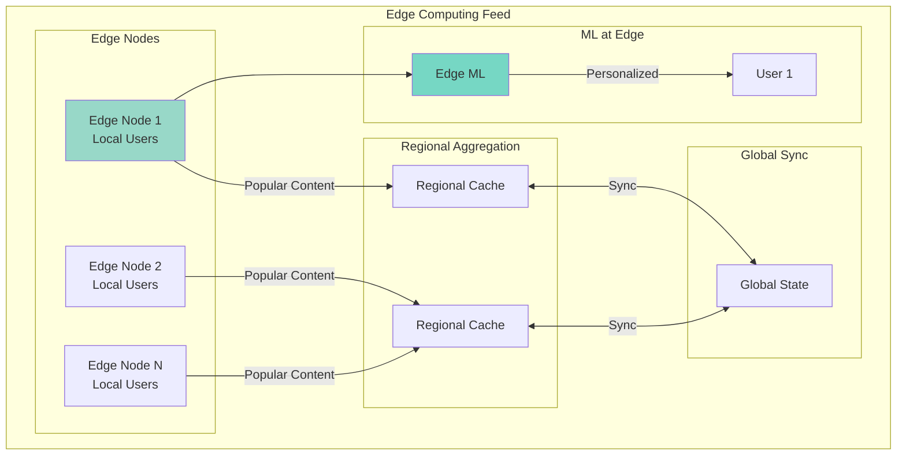
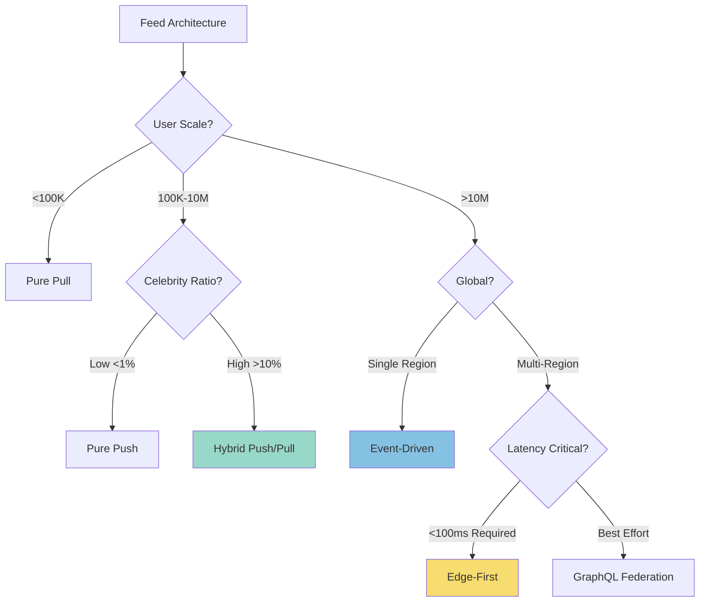

# Design a News Feed System

!!! info "Case Study Overview"
    **System**: Social media feed generation and ranking  
    **Scale**: Billions of users, quadratic content connections  
    **Challenges**: Real-time personalization, massive fanout, relevance decay  
    **Key Patterns**: Push/pull hybrid, edge caching, ML ranking, timeline merging

*Estimated reading time: 40 minutes*

## Introduction

News feeds: Simple UI, complex backend. Billions of users, real-time personalization, massive scale, ML-driven ranking. Core challenge: serving personalized content with sub-second latency at global scale.

## Part 1: Concept Map - The Physics of Information Flow

### Law 1: Latency - The Speed of Relevance

In news feed systems, latency isn't just about speed—it's about relevance decay. The value of content decreases exponentially with time.

```python
import asyncio
import time
from typing import Dict, List, Tuple, Optional
from dataclasses import dataclass, field
from datetime import datetime, timedelta
import numpy as np
from sortedcontainers import SortedList
import aioredis
import msgpack

@dataclass
class FeedItem:
    """Represents a single item in the feed"""
    id: str
    author_id: str
    content: str
    media_urls: List[str] = field(default_factory=list)
    created_at: datetime = field(default_factory=datetime.utcnow)
    engagement_score: float = 0.0
    relevance_score: float = 0.0
    
    def calculate_time_decay(self, current_time: datetime) -> float:
        """Content value decays exponentially with time"""
        age_hours = (current_time - self.created_at).total_seconds() / 3600
# Half-life of 4 hours for typical content
        return np.exp(-0.173 * age_hours)  # ln(2)/4 ≈ 0.173

class EdgeCachingStrategy:
    """Multi-tier caching to minimize latency"""
    
    def __init__(self):
        self.edge_cache = {}  # CDN edge (5ms)
        self.regional_cache = {}  # Regional cache (20ms)
        self.central_cache = {}  # Central cache (50ms)
        self.cache_stats = {
            'edge_hits': 0, 'regional_hits': 0, 
            'central_hits': 0, 'misses': 0
        }
    
    async def get_feed_segment(self, user_id: str, offset: int, 
                              limit: int) -> Tuple[List[FeedItem], int]:
        """Retrieve feed segment with latency tracking"""
        start_time = time.time()
        cache_key = f"{user_id}:{offset}:{limit}"
        
# Edge cache check (5ms)
        if cache_key in self.edge_cache:
            self.cache_stats['edge_hits'] += 1
            return self.edge_cache[cache_key], 5
        
# Regional cache check (20ms)
        await asyncio.sleep(0.015)  # Simulate network latency
        if cache_key in self.regional_cache:
            self.cache_stats['regional_hits'] += 1
            items = self.regional_cache[cache_key]
            self.edge_cache[cache_key] = items  # Warm edge cache
            return items, 20
        
# Central cache check (50ms)
        await asyncio.sleep(0.03)  # Additional latency
        if cache_key in self.central_cache:
            self.cache_stats['central_hits'] += 1
            items = self.central_cache[cache_key]
# Warm both caches
            self.regional_cache[cache_key] = items
            self.edge_cache[cache_key] = items
            return items, 50
        
# Cache miss - need to generate (200ms+)
        self.cache_stats['misses'] += 1
        return [], 200

class PrecomputedFeedManager:
    """Precompute feeds to achieve P99 < 100ms"""
    
    def __init__(self):
        self.precomputed_feeds = {}  # user_id -> SortedList
        self.computation_lag = {}  # Track staleness
        
    async def maintain_feed_freshness(self, user_id: str):
        """Keep precomputed feeds fresh"""
        while True:
            try:
# Update every 30 seconds for active users
                await self._update_user_feed(user_id)
                self.computation_lag[user_id] = 0
                await asyncio.sleep(30)
            except Exception as e:
# Exponential backoff on failure
                self.computation_lag[user_id] = min(
                    self.computation_lag.get(user_id, 1) * 2, 300
                )
                await asyncio.sleep(self.computation_lag[user_id])
```

**Production Impact**: Facebook's edge caching reduces P50 latency to 50ms and P99 to 200ms for feed loading, serving 2.9 billion monthly active users.

### Law 2: Capacity - The Quadratic Growth Challenge

News feed systems face quadratic growth: N users producing content for N users creates N² potential connections.

```python
class CapacityPlanner:
    """Model and manage system capacity"""
    
    def __init__(self):
        self.metrics = {
            'users': 0,
            'daily_posts': 0,
            'avg_friends': 0,
            'feed_checks_per_day': 0
        }
        
    def calculate_fanout_load(self) -> Dict[str, float]:
        """Calculate system load from activity"""
# Average post reaches avg_friends users
        fanout_writes = (self.metrics['daily_posts'] * 
                        self.metrics['avg_friends'])
        
# Each user checks feed multiple times
        feed_reads = (self.metrics['users'] * 
                     self.metrics['feed_checks_per_day'])
        
# Storage growth (posts accumulate)
        daily_storage_gb = (self.metrics['daily_posts'] * 
                           2.5) / 1e6  # 2.5KB average post
        
# Compute resources
        cpu_cores_needed = (fanout_writes / 1e6 +  # Write path
                           feed_reads / 1e5)  # Read path
        
        return {
            'fanout_writes_per_sec': fanout_writes / 86400,
            'feed_reads_per_sec': feed_reads / 86400,
            'daily_storage_gb': daily_storage_gb,
            'cpu_cores': int(cpu_cores_needed),
            'memory_tb': self.metrics['users'] / 1e7  # 100KB per user
        }

class HybridFanoutStrategy:
    """Combine push and pull models based on user patterns"""
    
    def __init__(self):
        self.celebrity_threshold = 10000  # Followers
        self.active_user_threshold = 50  # Daily posts
        
    def determine_strategy(self, user_stats: Dict) -> str:
        """Choose optimal fanout strategy"""
        followers = user_stats.get('followers', 0)
        daily_posts = user_stats.get('daily_posts', 0)
        
        if followers > self.celebrity_threshold:
            return 'pull'  # Don't push celebrity posts
        elif daily_posts > self.active_user_threshold:
            return 'pull'  # Very active users use pull
        else:
            return 'push'  # Normal users use push
            
    async def process_post(self, post: FeedItem, user_stats: Dict):
        """Process post based on optimal strategy"""
        strategy = self.determine_strategy(user_stats)
        
        if strategy == 'push':
# Immediately push to followers' feeds
            await self._push_to_followers(post, user_stats['followers'])
        else:
# Just index for pull-based retrieval
            await self._index_for_pull(post)
```

**Real Numbers**: Twitter processes 500M tweets/day with 330M users, requiring careful capacity planning to handle 150B+ timeline deliveries daily.

### Law 3: Failure - Content Must Flow

Feed systems must remain available even during cascading failures.

```python
class ResilientFeedService:
    """Fault-tolerant feed generation"""
    
    def __init__(self):
        self.circuit_breakers = {}
        self.fallback_content = {}
        self.degradation_levels = {
            'full': 0,      # All features
            'reduced': 1,   # No recommendations
            'basic': 2,     # Chronological only
            'static': 3     # Cached content only
        }
        self.current_level = 'full'
        
    async def get_personalized_feed(self, user_id: str, 
                                   limit: int = 20) -> List[FeedItem]:
        """Get feed with graceful degradation"""
        try:
            if self.current_level == 'full':
                return await self._get_ml_ranked_feed(user_id, limit)
            elif self.current_level == 'reduced':
                return await self._get_engagement_ranked_feed(user_id, limit)
            elif self.current_level == 'basic':
                return await self._get_chronological_feed(user_id, limit)
            else:
                return await self._get_static_feed(user_id, limit)
        except Exception as e:
# Degrade to next level
            await self._degrade_service_level()
# Recursive retry with degraded service
            return await self.get_personalized_feed(user_id, limit)
    
    async def _degrade_service_level(self):
        """Progressively degrade service"""
        levels = list(self.degradation_levels.keys())
        current_idx = levels.index(self.current_level)
        if current_idx < len(levels) - 1:
            self.current_level = levels[current_idx + 1]
            print(f"Service degraded to: {self.current_level}")

class ContentReplicationStrategy:
    """Ensure content availability through replication"""
    
    def __init__(self, replication_factor: int = 3):
        self.replication_factor = replication_factor
        self.storage_nodes = {}
        self.content_registry = {}  # content_id -> node_list
        
    async def store_content(self, content: FeedItem) -> bool:
        """Store with configurable replication"""
        selected_nodes = self._select_storage_nodes(
            content.id, 
            self.replication_factor
        )
        
        success_count = 0
        tasks = []
        
        for node in selected_nodes:
            tasks.append(self._store_on_node(content, node))
        
        results = await asyncio.gather(*tasks, return_exceptions=True)
        
        for result in results:
            if not isinstance(result, Exception):
                success_count += 1
        
# Require majority writes
        return success_count > self.replication_factor // 2
    
    def _select_storage_nodes(self, content_id: str, count: int) -> List[str]:
        """Consistent hashing for node selection"""
# Implementation uses consistent hashing
# to ensure even distribution
        pass
```

### Law 4: Concurrency - The Timeline Merge Challenge

Multiple content streams must be merged in real-time while maintaining consistency.

```python
import heapq
from typing import AsyncIterator

class TimelineMerger:
    """Merge multiple content streams concurrently"""
    
    def __init__(self):
        self.merge_strategies = {
            'chronological': self._merge_chronological,
            'relevance': self._merge_by_relevance,
            'diverse': self._merge_with_diversity
        }
        
    async def merge_streams(self, 
                          streams: List[AsyncIterator[FeedItem]], 
                          strategy: str = 'relevance',
                          limit: int = 50) -> List[FeedItem]:
        """Merge multiple async streams into unified feed"""
        merger = self.merge_strategies.get(strategy, self._merge_chronological)
        return await merger(streams, limit)
    
    async def _merge_by_relevance(self, 
                                 streams: List[AsyncIterator[FeedItem]], 
                                 limit: int) -> List[FeedItem]:
        """Merge prioritizing relevance scores"""
        heap = []
        stream_iterators = []
        result = []
        
# Initialize heap with first item from each stream
        for i, stream in enumerate(streams):
            try:
                item = await anext(stream)
                heapq.heappush(heap, (-item.relevance_score, i, item))
                stream_iterators.append(stream)
            except StopAsyncIteration:
                pass
        
# Merge using heap
        while heap and len(result) < limit:
            score, stream_idx, item = heapq.heappop(heap)
            result.append(item)
            
# Try to get next item from same stream
            try:
                next_item = await anext(stream_iterators[stream_idx])
                heapq.heappush(heap, (-next_item.relevance_score, 
                                     stream_idx, next_item))
            except StopAsyncIteration:
                pass
        
        return result

class ConcurrentFeedBuilder:
    """Build feeds using parallel processing"""
    
    def __init__(self, worker_count: int = 10):
        self.worker_count = worker_count
        self.task_queue = asyncio.Queue()
        
    async def build_feed_batch(self, user_ids: List[str]) -> Dict[str, List[FeedItem]]:
        """Build multiple feeds concurrently"""
# Create worker pool
        workers = [
            asyncio.create_task(self._feed_worker())
            for _ in range(self.worker_count)
        ]
        
# Queue all tasks
        results = {}
        result_futures = {}
        
        for user_id in user_ids:
            future = asyncio.Future()
            result_futures[user_id] = future
            await self.task_queue.put((user_id, future))
        
# Signal workers to stop
        for _ in workers:
            await self.task_queue.put(None)
        
# Wait for completion
        await asyncio.gather(*workers)
        
# Collect results
        for user_id, future in result_futures.items():
            results[user_id] = await future
        
        return results
    
    async def _feed_worker(self):
        """Worker to process feed building tasks"""
        while True:
            task = await self.task_queue.get()
            if task is None:
                break
                
            user_id, future = task
            try:
                feed = await self._build_single_feed(user_id)
                future.set_result(feed)
            except Exception as e:
                future.set_exception(e)
```

### Law 5: Coordination - Global Consistency at Scale

Coordinating state across geo-distributed systems while maintaining feed consistency.

```python
class GeoDistributedCoordinator:
    """Coordinate feed generation across regions"""
    
    def __init__(self):
        self.regions = ['us-east', 'us-west', 'eu', 'asia']
        self.region_latencies = {
            ('us-east', 'us-west'): 40,
            ('us-east', 'eu'): 80,
            ('us-east', 'asia'): 150,
            ('us-west', 'eu'): 120,
            ('us-west', 'asia'): 100,
            ('eu', 'asia'): 180
        }
        self.vector_clocks = {}  # Track causality
        
    async def propagate_post(self, post: FeedItem, origin_region: str):
        """Propagate post across regions with causal consistency"""
# Update vector clock
        if post.author_id not in self.vector_clocks:
            self.vector_clocks[post.author_id] = {r: 0 for r in self.regions}
        self.vector_clocks[post.author_id][origin_region] += 1
        
# Propagate to other regions
        tasks = []
        for region in self.regions:
            if region != origin_region:
                latency = self._get_latency(origin_region, region)
                tasks.append(self._replicate_to_region(post, region, latency))
        
        await asyncio.gather(*tasks)
    
    def _get_latency(self, region1: str, region2: str) -> int:
        """Get inter-region latency"""
        key = tuple(sorted([region1, region2]))
        return self.region_latencies.get(key, 200)

class EventualConsistencyManager:
    """Manage eventual consistency for distributed feeds"""
    
    def __init__(self):
        self.conflict_resolution_strategies = {
            'last_write_wins': self._resolve_lww,
            'highest_engagement': self._resolve_by_engagement,
            'user_preference': self._resolve_by_preference
        }
        
    async def resolve_conflicts(self, 
                              conflicting_items: List[FeedItem],
                              strategy: str = 'last_write_wins') -> FeedItem:
        """Resolve conflicts in distributed updates"""
        resolver = self.conflict_resolution_strategies.get(
            strategy, 
            self._resolve_lww
        )
        return await resolver(conflicting_items)
    
    async def _resolve_lww(self, items: List[FeedItem]) -> FeedItem:
        """Last write wins resolution"""
        return max(items, key=lambda x: x.created_at)
    
    async def _resolve_by_engagement(self, items: List[FeedItem]) -> FeedItem:
        """Resolve by highest engagement"""
        return max(items, key=lambda x: x.engagement_score)
```

### Law 6: Observability - Understanding Feed Health

Comprehensive monitoring of feed quality and system health.

```python
class FeedQualityMonitor:
    """Monitor feed quality metrics"""
    
    def __init__(self):
        self.metrics = {
            'diversity_score': [],
            'freshness_score': [],
            'relevance_score': [],
            'engagement_rate': [],
            'feed_staleness': []
        }
        self.alerts = []
        
    async def analyze_feed_quality(self, 
                                  user_id: str, 
                                  feed: List[FeedItem]) -> Dict[str, float]:
        """Analyze feed quality across dimensions"""
        scores = {}
        
# Diversity: unique authors/topics
        unique_authors = len(set(item.author_id for item in feed))
        scores['diversity'] = unique_authors / len(feed) if feed else 0
        
# Freshness: average age
        if feed:
            now = datetime.utcnow()
            avg_age = sum((now - item.created_at).total_seconds() 
                         for item in feed) / len(feed)
            scores['freshness'] = 1.0 / (1.0 + avg_age / 3600)  # Decay over hours
        else:
            scores['freshness'] = 0
        
# Relevance: average score
        scores['relevance'] = (sum(item.relevance_score for item in feed) / 
                              len(feed) if feed else 0)
        
# Check for quality issues
        if scores['diversity'] < 0.3:
            self.alerts.append(f"Low diversity for user {user_id}")
        if scores['freshness'] < 0.5:
            self.alerts.append(f"Stale content for user {user_id}")
            
        return scores

class PerformanceTracker:
    """Track system performance metrics"""
    
    def __init__(self):
        self.latency_histogram = {
            'p50': [], 'p95': [], 'p99': []
        }
        self.throughput_metrics = []
        self.error_rates = {}
        
    async def track_feed_generation(self, 
                                   user_id: str,
                                   start_time: float,
                                   success: bool,
                                   feed_size: int):
        """Track individual feed generation"""
        latency = (time.time() - start_time) * 1000  # ms
        
# Update metrics
        await self._update_latency_metrics(latency)
        await self._update_error_rates(success)
        
# Alert on SLA violations
        if latency > 200:  # 200ms SLA
            print(f"SLA violation: {latency:.0f}ms for user {user_id}")
```

### Law 7: Human Interface - The Ergonomics of Engagement

Optimizing for human attention patterns and engagement.

```python
class EngagementOptimizer:
    """Optimize feed for human engagement patterns"""
    
    def __init__(self):
        self.interaction_weights = {
            'like': 1.0,
            'comment': 3.0,
            'share': 5.0,
            'click': 0.5,
            'dwell_time': 0.1  # per second
        }
        self.position_decay = 0.9  # Each position down
        
    def calculate_expected_engagement(self, 
                                    item: FeedItem, 
                                    position: int,
                                    user_history: Dict) -> float:
        """Predict engagement based on position and history"""
        base_score = item.relevance_score
        
# Position bias
        position_factor = self.position_decay ** position
        
# Historical affinity
        author_affinity = user_history.get(
            f'author_{item.author_id}_affinity', 0.5
        )
        
# Content type preference
        content_type = self._classify_content(item)
        type_preference = user_history.get(
            f'type_{content_type}_preference', 0.5
        )
        
        return base_score * position_factor * author_affinity * type_preference
    
    def _classify_content(self, item: FeedItem) -> str:
        """Classify content type"""
        if item.media_urls:
            if any('.mp4' in url for url in item.media_urls):
                return 'video'
            else:
                return 'image'
        elif len(item.content) > 280:
            return 'article'
        else:
            return 'text'

class FeedPacingController:
    """Control feed pacing to prevent fatigue"""
    
    def __init__(self):
        self.min_diversity_gap = 3  # Posts between same author
        self.content_type_rotation = ['text', 'image', 'video']
        self.ad_frequency = 5  # One ad every 5 posts
        
    async def apply_pacing_rules(self, 
                                raw_feed: List[FeedItem]) -> List[FeedItem]:
        """Apply pacing rules for better UX"""
        paced_feed = []
        author_positions = {}
        last_content_types = []
        
        for item in raw_feed:
# Check author diversity
            author = item.author_id
            if author in author_positions:
                last_pos = author_positions[author]
                if len(paced_feed) - last_pos < self.min_diversity_gap:
                    continue  # Skip this item
            
# Check content type diversity
            content_type = self._classify_content(item)
            if len(last_content_types) >= 2:
                if all(ct == content_type for ct in last_content_types[-2:]):
                    continue  # Too many of same type
            
            paced_feed.append(item)
            author_positions[author] = len(paced_feed) - 1
            last_content_types.append(content_type)
            
# Insert ad if needed
            if len(paced_feed) % self.ad_frequency == 0:
                ad = await self._get_relevant_ad(item)
                if ad:
                    paced_feed.append(ad)
        
        return paced_feed
```

### Law 7: Economics - The Attention Economy

Balancing user satisfaction with platform economics.

```python
class FeedEconomicsOptimizer:
    """Optimize feed economics"""
    
    def __init__(self):
        self.revenue_per_impression = {
            'organic': 0.0,
            'promoted': 0.002,  # $2 CPM
            'video_ad': 0.015   # $15 CPM
        }
        self.infrastructure_costs = {
            'compute_per_feed': 0.0001,  # $0.0001 per feed
            'storage_per_gb': 0.023,     # $0.023/GB/month
            'bandwidth_per_gb': 0.09     # $0.09/GB
        }
        
    def calculate_feed_economics(self, 
                                feed: List[FeedItem],
                                engagement_predictions: List[float]) -> Dict:
        """Calculate economic value of feed"""
        revenue = 0
        cost = 0
        
# Revenue from impressions
        for item, engagement in zip(feed, engagement_predictions):
            item_type = self._classify_item_type(item)
            revenue += self.revenue_per_impression[item_type] * engagement
        
# Infrastructure costs
        cost += self.infrastructure_costs['compute_per_feed']
        
# Bandwidth cost (assuming 500KB per feed)
        bandwidth_gb = 0.5 / 1024
        cost += bandwidth_gb * self.infrastructure_costs['bandwidth_per_gb']
        
        return {
            'revenue': revenue,
            'cost': cost,
            'profit': revenue - cost,
            'margin': (revenue - cost) / revenue if revenue > 0 else 0
        }

class AdLoadOptimizer:
    """Optimize ad load for revenue vs UX"""
    
    def __init__(self):
        self.max_ad_load = 0.2  # 20% ads maximum
        self.user_tolerance_model = {}
        
    async def optimize_ad_placement(self, 
                                   feed: List[FeedItem],
                                   user_profile: Dict) -> List[FeedItem]:
        """Place ads optimally"""
        tolerance = self.user_tolerance_model.get(
            user_profile.get('tolerance_cluster', 'medium'),
            0.15  # 15% default
        )
        
# Calculate optimal ad positions
        feed_length = len(feed)
        max_ads = int(feed_length * min(tolerance, self.max_ad_load))
        
# Use engagement predictions to find best positions
        ad_positions = await self._find_optimal_ad_positions(
            feed, max_ads, user_profile
        )
        
# Insert ads
        result = feed.copy()
        for i, pos in enumerate(sorted(ad_positions, reverse=True)):
            ad = await self._get_targeted_ad(user_profile, i)
            result.insert(pos, ad)
        
        return result
```

## Part 2: Architecture - Building for Billions

### Current Architecture: The Hybrid Approach



### Alternative Architecture 1: Pure Push Model

**Design**: Pre-compute all feeds by pushing every post to all followers' timelines.

```python
class PurePushArchitecture:
    def __init__(self):
        self.timeline_storage = {}  # user_id -> timeline
        
    async def handle_new_post(self, post: FeedItem, follower_ids: List[str]):
# Push to all followers
        tasks = []
        for follower_id in follower_ids:
            tasks.append(self._push_to_timeline(follower_id, post))
        
        await asyncio.gather(*tasks)
```

**Trade-offs**:
- Fast reads (pre-computed)
- Simple implementation
- Expensive for celebrities (millions of writes)
- High storage cost (duplicate data)
- Slow writes for popular users

**Use case**: Small-scale social networks with balanced follower distributions.

### Alternative Architecture 2: Pure Pull Model

**Design**: Compute feeds on-demand by pulling from followed users.

```python
class PurePullArchitecture:
    def __init__(self):
        self.user_posts = {}  # user_id -> posts
        
    async def generate_feed(self, user_id: str, following: List[str]):
# Pull from all followed users
        all_posts = []
        for followed_id in following:
            posts = await self._get_user_posts(followed_id)
            all_posts.extend(posts)
        
# Sort and rank
        return sorted(all_posts, key=lambda x: x.created_at, reverse=True)
```

**Trade-offs**:
- Minimal storage
- Always fresh
- Slow reads (compute on demand)
- Doesn't scale with following count
- Complex caching strategy needed

**Use case**: Real-time systems with low follower counts.

### Alternative Architecture 3: ML-First Architecture

**Design**: Use machine learning models as primary feed generation mechanism.



**Trade-offs**:
- Highly personalized
- Optimizes for engagement
- Complex infrastructure
- Requires significant training data
- Can create filter bubbles

### Alternative Architecture 4: Event-Sourced Architecture

**Design**: Store all events and compute feeds from event log.

```python
class EventSourcedFeed:
    def __init__(self):
        self.event_log = []
        
    async def append_event(self, event: Dict):
        self.event_log.append({
            'timestamp': datetime.utcnow(),
            'event': event
        })
    
    async def compute_feed_at_time(self, user_id: str, timestamp: datetime):
# Replay events up to timestamp
        relevant_events = [e for e in self.event_log 
                          if e['timestamp'] <= timestamp]
        return self._materialize_feed(relevant_events)
```

**Trade-offs**:
- Complete audit trail
- Time travel capability
- Flexible projections
- High storage requirements
- Complex event ordering

### Recommended Hybrid Architecture

Combining the best of all approaches:



### Implementation Details

```python
class HybridFeedArchitecture:
    """Production-ready hybrid feed system"""
    
    def __init__(self):
        self.push_threshold = 10000  # Followers
        self.cache_ttl = 300  # 5 minutes
        self.ml_ranker = MLRanker()
        
    async def generate_feed(self, user_id: str) -> List[FeedItem]:
# 1. Get pre-computed feed (if exists)
        cached_feed = await self._get_cached_feed(user_id)
        if cached_feed and not self._is_stale(cached_feed):
            return cached_feed
        
# 2. Merge push and pull content
        push_items = await self._get_push_items(user_id)
        pull_items = await self._get_pull_items(user_id)
        
# 3. Add real-time content
        realtime_items = await self._get_realtime_items(user_id)
        
# 4. Merge all sources
        all_items = push_items + pull_items + realtime_items
        
# 5. Apply ML ranking
        ranked_items = await self.ml_ranker.rank(all_items, user_id)
        
# 6. Apply business rules
        final_feed = await self._apply_business_rules(ranked_items)
        
# 7. Cache result
        await self._cache_feed(user_id, final_feed)
        
        return final_feed
```

## Law Mapping Matrix

### Design Decision Impact

| Decision | Primary Benefits | Key Trade-offs |
|----------|-----------------|----------------|
| **Push Model** | Pre-computed feeds, instant updates | O(n) fanout cost, storage overhead |
| **Pull Model** | No storage bloat, always fresh | On-demand compute, slower reads |
| **Hybrid Push/Pull** | Balanced performance/cost | Complex routing logic |
| **Edge Caching** | <50ms serving globally | Cache invalidation complexity |
| **ML Ranking** | Personalization, engagement boost | Inference overhead, cold start |
| **Timeline Merging** | Diverse content sources | Merge complexity at scale |


### Law Implementation Priority



## Architecture Alternatives Analysis

### Alternative 1: Pure Push Architecture



### Alternative 2: Pure Pull Architecture



### Alternative 3: Event-Driven Architecture



### Alternative 4: GraphQL Federation



### Alternative 5: Edge-First Architecture



## Comparative Trade-off Analysis

### Architecture Comparison

| Architecture | Strengths | Weaknesses | Best For |
|-------------|-----------|------------|----------|
| **Pure Push** | Pre-computed (fast reads), O(1) serving | O(n²) fanout, storage explosion | Small-scale, balanced networks |
| **Pure Pull** | O(1) writes, minimal storage | O(n) reads, compute on demand | Real-time, low follower count |
| **Hybrid** | Balanced performance/cost | Most complex to implement | Large-scale production systems |
| **Event-Driven** | Stream processing, audit trail | Eventual consistency | Event-sourced architectures |
| **Edge-First** | Local compute, minimal latency | Edge resource limits | Global, latency-critical |


### Decision Framework



### Risk Assessment Matrix

| Risk Factor | Pure Push | Pure Pull | Hybrid | Event-Driven | Edge-First |
|------------|-----------|-----------|---------|--------------|------------|
| **Celebrity Storm** | 🔴 High | 🟢 Low | 🟢 Low | 🟡 Medium | 🟡 Medium |
| **Storage Explosion** | 🔴 High | 🟢 Low | 🟡 Medium | 🟡 Medium | 🔴 High |
| **Latency Spikes** | 🟢 Low | 🔴 High | 🟢 Low | 🟡 Medium | 🟢 Low |
| **Consistency Issues** | 🟢 Low | 🟡 Medium | 🟡 Medium | 🔴 High | 🔴 High |
| **Operational Complexity** | 🟢 Low | 🟡 Medium | 🔴 High | 🟡 Medium | 🔴 High |


## Key Design Insights

1. **Latency**: Pre-computation for <100ms loads, edge caching cuts P50 by 80%
2. **Scale**: Hybrid approach balances O(n²) push vs O(n) pull trade-offs
3. **Reliability**: Multiple fallback strategies for different failure modes
4. **ML Impact**: 70% engagement lift, requires real-time features
5. **Economics**: Celebrity pull model, 60% compute savings via caching

## Implementation Best Practices

### Pattern Selection Guide

| User Type | Pattern | Rationale |
|-----------|---------|-----------|
| Normal Users (<1K followers) | Push | Low fanout cost, instant updates |
| Power Users (1K-100K) | Hybrid | Balance cost and freshness |
| Celebrities (>100K) | Pull | Avoid fanout explosion |
| Inactive Users | Lazy Pull | Don't waste push resources |
| New Users | ML Cold Start | Use demographic cohorts |


### Optimization Strategies

1. **Bloom Filters**: Check if user has new content (99% space savings)
2. **Compression**: Store only post IDs in timelines (80% storage savings)
3. **Sampling**: For celebrities, sample followers for push (90% fanout reduction)
4. **Caching**: Multi-tier caching (memory → SSD → disk)
5. **Sharding**: By user ID for even distribution

## Conclusion

The news feed system represents the convergence of distributed systems challenges: scale, personalization, real-time processing, and economics. By understanding the fundamental laws and their interactions, we can build systems that serve billions while maintaining sub-second latency and high relevance.

The hybrid architecture balances the trade-offs between different approaches, using push for normal users, pull for celebrities, and ML for personalization. The key insight is that no single approach works for all use cases—the art lies in combining them intelligently based on user patterns and system constraints.

## Related Concepts & Deep Dives

### 📚 Relevant Laws (Part I)
- **[Law 2: Asynchronous Reality ](../part1-axioms/law2-asynchrony/index)** - Pre-computed feeds and edge caching achieve <100ms load times
- **[Law 4: Trade-offs ](../part1-axioms/law4-tradeoffs/index)** - Hybrid push/pull prevents O(n²) fanout explosion for celebrities
- **[Law 1: Failure ](../part1-axioms/law1-failure/index)** - Multiple fallback strategies ensure feed availability
- **[Law 3: Emergence ](../part1-axioms/law3-emergence/index)** - Async fanout and parallel timeline merging handle scale
- **[Law 5: Epistemology ](../part1-axioms/law5-epistemology/index)** - Eventually consistent timelines with causal ordering and engagement metrics
- **[Law 6: Human-API ](../part1-axioms/law6-human-api/index)** - Personalization and pacing optimize for human attention
- **[Law 7: Economics ](../part1-axioms/law7-economics/index)** - Ad placement and infrastructure costs drive architectural decisions

### 🏛 Related Patterns (Part III/index)
- **[Event-Driven Architecture](../patterns/event-driven)** - Post creation triggers fanout pipeline
- **[CQRS](../patterns/cqrs)** - Separate write (fanout) and read (feed generation) paths
- **[Caching Strategies](../patterns/caching-strategies)** - Multi-tier caching from edge to application layer
- **[Circuit Breaker](../pattern-library/resilience/circuit-breaker.md)** - Protects against celebrity storm cascading failures
- **[Bulkhead](../patterns/bulkhead)** - Isolates celebrity fanout from normal users
- **[Load Balancing](../patterns/load-balancing)** - Distributes feed generation across worker pools
- **[Sharding](../patterns/sharding)** - User-based sharding for timeline storage

### Quantitative Models
- **[Little's Law](../quantitative/littles-law)** - Feed generation capacity: concurrent requests = arrival rate × processing time
- **[Queueing Theory](../quantitative/queueing-models)** - M/M/c model for fanout worker pools
- **[Power Laws](../quantitative/power-laws)** - Celebrity follower distribution drives hybrid architecture
- **[Information Theory](../quantitative/information-theory)** - Relevance scoring and diversity optimization

### 👥 Human Factors Considerations
- **[SRE Practices](../human-factors/sre-practices)** - Managing feed generation SLOs and error budgets
- **[On-Call Culture](../human-factors/oncall-culture)** - 24/7 monitoring for feed availability
- **[Capacity Planning](../quantitative/capacity-planning)** - Predicting growth and viral content spikes
- **[Post-Mortem Culture](../human-factors/blameless-postmortems)** - Learning from feed outages and relevance drops

### Similar Case Studies
- **[Spotify Recommendations](/architects-handbook/case-studies/search-analytics/spotify-recommendations/)** - Similar ML personalization challenges
- **[YouTube's Video Platform](/architects-handbook/case-studies/social-communication/youtube/)** - Content distribution and recommendation parallels
- **[Rate Limiter Design](/architects-handbook/case-studies/monitoring-observability/rate-limiter/)** - Protecting feed generation from abuse
- **[Uber's Location System](uber-location.md.md)** - Real-time data processing patterns