# Distributed Notification System

## Table of Contents

- [Challenge Statement](#challenge-statement)
- [System Scale Visualization](#system-scale-visualization)
- [Part 1: Concept Map](#part-1-concept-map)
  - [🗺 System Overview](#-system-overview)
  - [High-Level System Architecture](#high-level-system-architecture)
  - [Law Analysis](#law-analysis)
    - [Law 1 (Latency): Speed of Notification](#law-1-latency-speed-of-notification)
  - [Detailed Notification Flow](#detailed-notification-flow)
  - [Channel-Specific Processing Flow](#channel-specific-processing-flow)
  - [Priority Queue Architecture](#priority-queue-architecture)
  - [Latency Optimization Strategies](#latency-optimization-strategies)
- [Multi-level queue system](#multi-level-queue-system)
- [Channel-specific handlers](#channel-specific-handlers)
  - [Connection pools](#connection-pools)
- [WebSocket connections for real-time](#websocket-connections-for-real-time)
- [Performance tracking](#performance-tracking)
- [Validate and enrich notification](#validate-and-enrich-notification)
- [Check if immediate delivery needed](#check-if-immediate-delivery-needed)
- [Bypass queue for critical notifications](#bypass-queue-for-critical-notifications)
- [Queue for batch processing](#queue-for-batch-processing)
- [Track latency](#track-latency)
- [Parallel sending across channels](#parallel-sending-across-channels)
- [Real-time delivery via WebSocket](#real-time-delivery-via-websocket)
- [Direct send through handler](#direct-send-through-handler)
- [Wait for all channels](#wait-for-all-channels)
- [Record results](#record-results)
- [Record delivery](#record-delivery)
- [Connection lost - queue for later](#connection-lost-queue-for-later)
- [Non-blocking put with timeout](#non-blocking-put-with-timeout)
- [Queue full - send to overflow handling](#queue-full-send-to-overflow-handling)
- [Process each priority level](#process-each-priority-level)
- [Batch size based on priority](#batch-size-based-on-priority)
- [Collect batch](#collect-batch)
- [Small delay to prevent CPU spinning](#small-delay-to-prevent-cpu-spinning)
- [Group by channel for efficient sending](#group-by-channel-for-efficient-sending)
- [Check expiration](#check-expiration)
- [Process each channel in parallel](#process-each-channel-in-parallel)
  - [Connection pools](#connection-pools)
- [Get user's device tokens](#get-users-device-tokens)
- [Prepare message](#prepare-message)
- [Send to all devices in parallel](#send-to-all-devices-in-parallel)
- [Group by user for token lookup efficiency](#group-by-user-for-token-lookup-efficiency)
- [Batch fetch device tokens](#batch-fetch-device-tokens)
- [Prepare all messages](#prepare-all-messages)
- [Send in batches](#send-in-batches)
- [FCM supports up to 1000 messages per batch](#fcm-supports-up-to-1000-messages-per-batch)
- [Prepare multicast message](#prepare-multicast-message)
- [Process results](#process-results)
  - [💾 Law 2 (Capacity): Scale Management](#-law-2-capacity-scale-management)
  - [Sharding Architecture](#sharding-architecture)
  - [Storage Architecture](#storage-architecture)
  - [Capacity Monitoring Dashboard](#capacity-monitoring-dashboard)
- [Sharding configuration](#sharding-configuration)
- [Initialize sharded storage](#initialize-sharded-storage)
- [User preference cache](#user-preference-cache)
- [Template cache](#template-cache)
  - [Capacity tracking](#capacity-tracking)
- [Check shard capacity](#check-shard-capacity)
- [Try overflow shard](#try-overflow-shard)
- [Store notification](#store-notification)
  - [Update capacity metrics](#update-capacity-metrics)
- [Check cache first](#check-cache-first)
- [Get from shard](#get-from-shard)
- [Cache for future use](#cache-for-future-use)
- [Find hot shards](#find-hot-shards)
- [RocksDB for persistent storage](#rocksdb-for-persistent-storage)
- [In-memory indices](#in-memory-indices)
  - [Capacity tracking](#capacity-tracking)
- [Serialize notification](#serialize-notification)
- [Check capacity](#check-capacity)
- [Store in RocksDB](#store-in-rocksdb)
- [Update indices](#update-indices)
- [Update capacity](#update-capacity)
- [Trigger compaction if needed](#trigger-compaction-if-needed)
- [Find old notifications using time index](#find-old-notifications-using-time-index)
- [Delete in batches](#delete-in-batches)
- [Get size before deletion](#get-size-before-deletion)
- [Remove from user index](#remove-from-user-index)
- [Apply batch delete](#apply-batch-delete)
  - [Update indices and capacity](#update-indices-and-capacity)
- [Store template](#store-template)
- [Compile template for performance](#compile-template-for-performance)
- [Get active template version](#get-active-template-version)
- [Render for each channel](#render-for-each-channel)
- [Use cached compiled template if available](#use-cached-compiled-template-if-available)
- [Simple replacement for now](#simple-replacement-for-now)
  - [Law 3 (Failure): Reliable Delivery](#law-3-failure-reliable-delivery)
  - [Comprehensive Failure Handling Architecture](#comprehensive-failure-handling-architecture)
- [Don't retry old messages](#dont-retry-old-messages)
- [Don't retry permanent errors](#dont-retry-permanent-errors)
- [Check if should transition to half-open](#check-if-should-transition-to-half-open)
- [Allow limited requests in half-open state](#allow-limited-requests-in-half-open-state)
- [Transition to closed after successful requests](#transition-to-closed-after-successful-requests)
- [Reset failure count on success](#reset-failure-count-on-success)
- [Open circuit breaker](#open-circuit-breaker)
- [Failure in half-open state - reopen](#failure-in-half-open-state-reopen)
  - [🔀 Law 4 (Concurrency): Parallel Processing](#-law-4-concurrency-parallel-processing)
    - [🤝 Law 5 (Coordination): Multi-Channel Orchestration](#-law-5-coordination-multi-channel-orchestration)
  - [Channel Selection Decision Engine](#channel-selection-decision-engine)
  - [Multi-Channel Delivery Strategies](#multi-channel-delivery-strategies)
- [Rules engine implementation details...](#rules-engine-implementation-details)
  - [👁 Law 6 (Observability): Analytics & Monitoring](#-law-6-observability-analytics-monitoring)
  - [Comprehensive Analytics Pipeline](#comprehensive-analytics-pipeline)
  - [Real-time Monitoring Dashboard](#real-time-monitoring-dashboard)
- [Analytics engine implementation details...](#analytics-engine-implementation-details)
  - [👤 Law 7 (Human Interface): User Control](#-law-7-human-interface-user-control)
    - [Law 8 (Economics): Cost Optimization](#law-8-economics-cost-optimization)
  - [Cost Analysis Dashboard](#cost-analysis-dashboard)
  - [Channel Cost Optimization Engine](#channel-cost-optimization-engine)
  - [Comprehensive Law Mapping](#comprehensive-law-mapping)
  - [Architecture Alternatives](#architecture-alternatives)
    - [1. Traditional Monolithic Queue Architecture](#1-traditional-monolithic-queue-architecture)
    - [2. Microservices Channel Architecture](#2-microservices-channel-architecture)
    - [3. Event-Driven Streaming Architecture](#3-event-driven-streaming-architecture)
    - [4. Serverless Fan-out Architecture](#4-serverless-fan-out-architecture)
    - [5. Edge-First Global Architecture](#5-edge-first-global-architecture)
  - [Trade-off Analysis](#trade-off-analysis)
  - [Architecture Selection Criteria](#architecture-selection-criteria)
  - [Cost Comparison](#cost-comparison)
  - [Migration Strategy](#migration-strategy)
  - [🏛 Pillar Mapping](#-pillar-mapping)
    - [Work Distribution](#work-distribution)
    - [State Management](#state-management)
    - [Truth & Consistency](#truth-consistency)
    - [Control Mechanisms](#control-mechanisms)
    - [Intelligence Layer](#intelligence-layer)
  - [Pattern Application](#pattern-application)
- [Part 2: Architecture & Trade-offs](#part-2-architecture-trade-offs)
  - [Global Deployment Architecture](#global-deployment-architecture)
  - [Core Architecture](#core-architecture)
  - [Key Design Trade-offs](#key-design-trade-offs)
  - [Alternative Architectures](#alternative-architectures)
    - [Option 1: Simple Queue-Based](#option-1-simple-queue-based)
    - [Option 2: Lambda/Serverless](#option-2-lambdaserverless)
    - [Option 3: Event Streaming](#option-3-event-streaming)
    - [Option 4: Service Mesh](#option-4-service-mesh)
  - [Performance Characteristics](#performance-characteristics)
  - [🎓 Key Lessons](#-key-lessons)
  - [🔗 Related Concepts & Deep Dives](#-related-concepts-deep-dives)
    - [Prerequisite Laws](#prerequisite-laws)
    - [Advanced Topics](#advanced-topics)
    - [Related Case Studies](#related-case-studies)
    - [Implementation Patterns](#implementation-patterns)
  - [System Evolution Path](#system-evolution-path)
  - [Key Success Metrics](#key-success-metrics)
  - [📚 References](#-references)


## Challenge Statement
Design a notification system for 10B+ daily notifications across push/email/SMS/in-app with delivery guarantees, preferences, rate limiting, analytics, and failure handling.

## System Scale Visualization


## Part 1: Concept Map

### 🗺 System Overview
Distributed system orchestrating message delivery across channels with preferences, priorities, rate limiting, templates, reliable delivery, and tracking.

**Requirements:** 10B+ daily volume, <1s critical latency, at-least-once delivery, templates/personalization, preferences, rate limiting, analytics, multi-channel

### High-Level System Architecture


### Law Analysis

#### Law 1 (Latency): Speed of Notification
```text
Latency: Critical <1s, Push <5s, Email <30s, SMS <10s, In-app <100ms
Optimizations: Priority queues, regional deployment, connection pooling, batching, WebSocket, edge servers
```

### Detailed Notification Flow


### Channel-Specific Processing Flow


### Priority Queue Architecture


### Latency Optimization Strategies


**Implementation:**
```python
import asyncio
import aioredis
import aiokafka
from typing import Dict, List, Optional
import time
from enum import Enum
from dataclasses import dataclass
import websockets

class NotificationPriority(Enum):
    CRITICAL = 1  # System alerts, security
    HIGH = 2      # Time-sensitive updates
    MEDIUM = 3    # Regular notifications
    LOW = 4       # Promotional, digest

class Channel(Enum):
    PUSH = "push"
    EMAIL = "email"
    SMS = "sms"
    IN_APP = "in_app"
    WEBHOOK = "webhook"

@dataclass
class Notification:
    id: str
    user_id: str
    channels: List[Channel]
    priority: NotificationPriority
    template_id: str
    data: Dict
    scheduled_at: Optional[float] = None
    expires_at: Optional[float] = None
    metadata: Dict = None

class HighPerformanceNotificationSystem:
    def __init__(self):
## Multi-level queue system
        self.priority_queues = {
            NotificationPriority.CRITICAL: asyncio.Queue(maxsize=10000),
            NotificationPriority.HIGH: asyncio.Queue(maxsize=50000),
            NotificationPriority.MEDIUM: asyncio.Queue(maxsize=100000),
            NotificationPriority.LOW: asyncio.Queue(maxsize=200000)
        }
        
## Channel-specific handlers
        self.channel_handlers = {
            Channel.PUSH: PushNotificationHandler(),
            Channel.EMAIL: EmailHandler(),
            Channel.SMS: SMSHandler(),
            Channel.IN_APP: InAppHandler(),
            Channel.WEBHOOK: WebhookHandler()
        }
        
### Connection pools
        self.redis_pool = None
        self.kafka_producer = None
        
## WebSocket connections for real-time
        self.websocket_connections = {}
        
## Performance tracking
        self.latency_tracker = LatencyTracker()
        
    async def send_notification(self, notification: Notification) -> str:
        """Send notification with minimal latency"""
        start_time = time.perf_counter()
        
## Validate and enrich notification
        notification = await self._enrich_notification(notification)
        
## Check if immediate delivery needed
        if notification.priority == NotificationPriority.CRITICAL:
## Bypass queue for critical notifications
            await self._send_immediate(notification)
        else:
## Queue for batch processing
            await self._queue_notification(notification)
        
## Track latency
        latency_ms = (time.perf_counter() - start_time) * 1000
        self.latency_tracker.record(notification.priority, latency_ms)
        
        return notification.id
    
    async def _send_immediate(self, notification: Notification):
        """Send critical notification immediately"""
## Parallel sending across channels
        tasks = []
        
        for channel in notification.channels:
            handler = self.channel_handlers[channel]
            
            if channel == Channel.IN_APP:
## Real-time delivery via WebSocket
                task = self._send_realtime(notification)
            else:
## Direct send through handler
                task = handler.send_immediate(notification)
            
            tasks.append(task)
        
## Wait for all channels
        results = await asyncio.gather(*tasks, return_exceptions=True)
        
## Record results
        for i, result in enumerate(results):
            if isinstance(result, Exception):
                await self._handle_send_failure(
                    notification, 
                    notification.channels[i], 
                    result
                )
    
    async def _send_realtime(self, notification: Notification):
        """Send real-time notification via WebSocket"""
        user_id = notification.user_id
        
        if user_id in self.websocket_connections:
            ws = self.websocket_connections[user_id]
            
            message = {
                'type': 'notification',
                'id': notification.id,
                'data': notification.data,
                'timestamp': time.time()
            }
            
            try:
                await ws.send(json.dumps(message))
                
## Record delivery
                await self._record_delivery(
                    notification.id,
                    Channel.IN_APP,
                    'delivered',
                    latency_ms=1
                )
            except websockets.exceptions.ConnectionClosed:
## Connection lost - queue for later
                await self._queue_for_retry(notification, Channel.IN_APP)
    
    async def _queue_notification(self, notification: Notification):
        """Queue notification for batch processing"""
        queue = self.priority_queues[notification.priority]
        
        try:
## Non-blocking put with timeout
            await asyncio.wait_for(
                queue.put(notification),
                timeout=0.1
            )
        except asyncio.TimeoutError:
## Queue full - send to overflow handling
            await self._handle_overflow(notification)
    
    async def process_queues(self):
        """Process notification queues with priority"""
        while True:
## Process each priority level
            for priority in NotificationPriority:
                queue = self.priority_queues[priority]
                
## Batch size based on priority
                batch_size = {
                    NotificationPriority.CRITICAL: 1,
                    NotificationPriority.HIGH: 10,
                    NotificationPriority.MEDIUM: 100,
                    NotificationPriority.LOW: 1000
                }[priority]
                
## Collect batch
                batch = []
                for _ in range(batch_size):
                    try:
                        notification = queue.get_nowait()
                        batch.append(notification)
                    except asyncio.QueueEmpty:
                        break
                
                if batch:
                    await self._process_batch(batch)
            
## Small delay to prevent CPU spinning
            await asyncio.sleep(0.01)
    
    async def _process_batch(self, notifications: List[Notification]):
        """Process batch of notifications efficiently"""
## Group by channel for efficient sending
        by_channel = defaultdict(list)
        
        for notification in notifications:
## Check expiration
            if notification.expires_at and time.time() > notification.expires_at:
                await self._record_expired(notification)
                continue
            
            for channel in notification.channels:
                by_channel[channel].append(notification)
        
## Process each channel in parallel
        tasks = []
        for channel, channel_notifications in by_channel.items():
            handler = self.channel_handlers[channel]
            task = handler.send_batch(channel_notifications)
            tasks.append(task)
        
        await asyncio.gather(*tasks, return_exceptions=True)

class PushNotificationHandler:
    """Handler for push notifications (FCM, APNS)"""
    
    def __init__(self):
        self.fcm_client = FCMClient()
        self.apns_client = APNSClient()
        
### Connection pools
        self.fcm_pool = ConnectionPool(max_connections=1000)
        self.apns_pool = ConnectionPool(max_connections=500)
        
    async def send_immediate(self, notification: Notification) -> dict:
        """Send single push notification immediately"""
## Get user's device tokens
        tokens = await self._get_device_tokens(notification.user_id)
        
        if not tokens:
            return {'status': 'no_devices'}
        
## Prepare message
        message = self._prepare_push_message(notification)
        
## Send to all devices in parallel
        tasks = []
        for token in tokens:
            if token['platform'] == 'android':
                task = self._send_fcm(token['token'], message)
            else:  # iOS
                task = self._send_apns(token['token'], message)
            
            tasks.append(task)
        
        results = await asyncio.gather(*tasks, return_exceptions=True)
        
        return {
            'sent': len([r for r in results if not isinstance(r, Exception)]),
            'failed': len([r for r in results if isinstance(r, Exception)])
        }
    
    async def send_batch(self, notifications: List[Notification]):
        """Send batch of push notifications"""
## Group by user for token lookup efficiency
        by_user = defaultdict(list)
        for notification in notifications:
            by_user[notification.user_id].append(notification)
        
## Batch fetch device tokens
        all_user_ids = list(by_user.keys())
        tokens_map = await self._batch_get_device_tokens(all_user_ids)
        
## Prepare all messages
        fcm_messages = []
        apns_messages = []
        
        for user_id, user_notifications in by_user.items():
            tokens = tokens_map.get(user_id, [])
            
            for notification in user_notifications:
                message = self._prepare_push_message(notification)
                
                for token in tokens:
                    if token['platform'] == 'android':
                        fcm_messages.append({
                            'token': token['token'],
                            'message': message,
                            'notification_id': notification.id
                        })
                    else:
                        apns_messages.append({
                            'token': token['token'],
                            'message': message,
                            'notification_id': notification.id
                        })
        
## Send in batches
        await asyncio.gather(
            self._batch_send_fcm(fcm_messages),
            self._batch_send_apns(apns_messages)
        )
    
    async def _batch_send_fcm(self, messages: List[dict]):
        """Batch send to FCM"""
## FCM supports up to 1000 messages per batch
        batch_size = 1000
        
        for i in range(0, len(messages), batch_size):
            batch = messages[i:i + batch_size]
            
## Prepare multicast message
            tokens = [msg['token'] for msg in batch]
            
            try:
                response = await self.fcm_client.send_multicast(
                    tokens=tokens,
                    data=batch[0]['message']  # Same message for batch
                )
                
## Process results
                for j, result in enumerate(response.results):
                    notification_id = batch[j]['notification_id']
                    
                    if result.success:
                        await self._record_success(notification_id, 'fcm')
                    else:
                        await self._record_failure(
                            notification_id, 
                            'fcm', 
                            result.error
                        )
                        
            except Exception as e:
                logger.error(f"FCM batch send failed: {e}")
```

### 💾 Law 2 (Capacity): Scale Management
```text
Scale Requirements:
- 10B notifications/day = 115K/second average
- Peak: 500K notifications/second
- 100M active users
- 5 channels per notification average
- 30-day retention for analytics

Storage Needs:
- Notification data: 10B × 1KB = 10TB/day
- User preferences: 100M × 10KB = 1TB
- Templates: 10K × 100KB = 1GB
- Analytics: 10B × 100 bytes = 1TB/day
- Total: ~350TB/month

Capacity Planning:
- Message queues: 10M messages in flight
- WebSocket connections: 10M concurrent
- Database connections: 10K
- Cache memory: 500GB
```

### Sharding Architecture


### Storage Architecture


### Capacity Monitoring Dashboard

```mermaid
graph TB
    subgraph "Real-time Metrics"
        QD[Queue Depth<br/>Current: 2.5M<br/>Max: 10M]
        WS[WebSocket Connections<br/>Current: 8.2M<br/>Max: 10M]
        DB[DB Connections<br/>Current: 7.5K<br/>Max: 10K]
        CM[Cache Memory<br/>Current: 380GB<br/>Max: 500GB]
    end
    
    subgraph "Storage Metrics"
        SU[Storage Usage<br/>Current: 315TB<br/>Growth: 10TB/day]
        SR[Shard Distribution<br/>Hot: 5<br/>Normal: 90<br/>Cold: 5]
        RT[Retention Status<br/>Active: 30 days<br/>Archive: 365 days]
    end
    
    subgraph "Alerts"
        A1[⚠️ Queue > 80%]
        A2[🔴 Storage > 90%]
        A3[⚠️ Hot Shard Detected]
        A4[✅ All Systems Normal]
    end
    
    QD --> A1
    SU --> A2
    SR --> A3
    
    style A1 fill:#fff3e0
    style A2 fill:#ffcdd2
    style A3 fill:#fff3e0
    style A4 fill:#c8e6c9
```



**Implementation:**
```python
import hashlib
from dataclasses import dataclass
from typing import Set, Dict
import rocksdb

class NotificationCapacityManager:
    def __init__(self):
## Sharding configuration
        self.num_shards = 100
        self.shards = []
        
## Initialize sharded storage
        for i in range(self.num_shards):
            shard = NotificationShard(i)
            self.shards.append(shard)
        
## User preference cache
        self.preference_cache = LRUCache(maxsize=1_000_000)
        
## Template cache
        self.template_cache = {}
        
### Capacity tracking
        self.capacity_monitor = CapacityMonitor()
        
    def get_shard(self, user_id: str) -> 'NotificationShard':
        """Get shard for user using consistent hashing"""
        hash_value = int(hashlib.md5(user_id.encode()).hexdigest(), 16)
        shard_id = hash_value % self.num_shards
        return self.shards[shard_id]
    
    async def store_notification(self, notification: Notification) -> bool:
        """Store notification in appropriate shard"""
        shard = self.get_shard(notification.user_id)
        
## Check shard capacity
        if not shard.has_capacity():
## Try overflow shard
            overflow_shard = self._get_overflow_shard()
            if overflow_shard and overflow_shard.has_capacity():
                shard = overflow_shard
            else:
                raise CapacityExceededException("No available capacity")
        
## Store notification
        stored = await shard.store(notification)
        
### Update capacity metrics
        if stored:
            self.capacity_monitor.record_write(shard.shard_id)
        
        return stored
    
    async def get_user_preferences(self, user_id: str) -> dict:
        """Get user notification preferences with caching"""
## Check cache first
        preferences = self.preference_cache.get(user_id)
        if preferences:
            return preferences
        
## Get from shard
        shard = self.get_shard(user_id)
        preferences = await shard.get_user_preferences(user_id)
        
## Cache for future use
        if preferences:
            self.preference_cache.put(user_id, preferences)
        
        return preferences
    
    def calculate_storage_distribution(self) -> dict:
        """Calculate current storage distribution across shards"""
        distribution = {}
        total_size = 0
        
        for shard in self.shards:
            shard_stats = shard.get_stats()
            distribution[shard.shard_id] = {
                'notifications': shard_stats['notification_count'],
                'size_gb': shard_stats['size_bytes'] / (1024**3),
                'capacity_used': shard_stats['capacity_percentage']
            }
            total_size += shard_stats['size_bytes']
        
## Find hot shards
        avg_size = total_size / self.num_shards
        hot_shards = []
        cold_shards = []
        
        for shard_id, stats in distribution.items():
            shard_size = stats['size_gb'] * (1024**3)
            if shard_size > avg_size * 1.5:
                hot_shards.append(shard_id)
            elif shard_size < avg_size * 0.5:
                cold_shards.append(shard_id)
        
        return {
            'distribution': distribution,
            'total_size_gb': total_size / (1024**3),
            'hot_shards': hot_shards,
            'cold_shards': cold_shards,
            'rebalance_needed': len(hot_shards) > 0
        }

class NotificationShard:
    """Individual shard for notification storage"""
    
    def __init__(self, shard_id: int):
        self.shard_id = shard_id
        self.max_size = 100 * 1024 * 1024 * 1024  # 100GB per shard
        
## RocksDB for persistent storage
        opts = rocksdb.Options()
        opts.create_if_missing = True
        opts.compression = rocksdb.CompressionType.zstd_compression
        
        self.db = rocksdb.DB(f"notifications_shard_{shard_id}.db", opts)
        
## In-memory indices
        self.user_index = defaultdict(list)  # user_id -> notification_ids
        self.time_index = []  # Sorted by timestamp
        
### Capacity tracking
        self.current_size = 0
        self.notification_count = 0
    
    async def store(self, notification: Notification) -> bool:
        """Store notification in shard"""
## Serialize notification
        serialized = self._serialize_notification(notification)
        size = len(serialized)
        
## Check capacity
        if self.current_size + size > self.max_size:
            return False
        
## Store in RocksDB
        key = f"notif:{notification.id}".encode()
        self.db.put(key, serialized)
        
## Update indices
        self.user_index[notification.user_id].append(notification.id)
        self.time_index.append((notification.created_at, notification.id))
        
## Update capacity
        self.current_size += size
        self.notification_count += 1
        
## Trigger compaction if needed
        if self.notification_count % 10000 == 0:
            asyncio.create_task(self._compact())
        
        return True
    
    def has_capacity(self) -> bool:
        """Check if shard has capacity"""
        return self.current_size < self.max_size * 0.9  # 90% threshold
    
    async def get_user_notifications(self, user_id: str, limit: int = 100) -> List[dict]:
        """Get notifications for user"""
        notification_ids = self.user_index.get(user_id, [])[-limit:]
        
        notifications = []
        for notif_id in notification_ids:
            key = f"notif:{notif_id}".encode()
            data = self.db.get(key)
            
            if data:
                notification = self._deserialize_notification(data)
                notifications.append(notification)
        
        return notifications
    
    async def cleanup_old_notifications(self, retention_days: int = 30):
        """Clean up old notifications"""
        cutoff_time = time.time() - (retention_days * 86400)
        
## Find old notifications using time index
        to_delete = []
        new_time_index = []
        
        for timestamp, notif_id in self.time_index:
            if timestamp < cutoff_time:
                to_delete.append(notif_id)
            else:
                new_time_index.append((timestamp, notif_id))
        
## Delete in batches
        batch = rocksdb.WriteBatch()
        deleted_size = 0
        
        for notif_id in to_delete:
            key = f"notif:{notif_id}".encode()
            
## Get size before deletion
            data = self.db.get(key)
            if data:
                deleted_size += len(data)
                batch.delete(key)
            
## Remove from user index
            for user_id, notif_ids in self.user_index.items():
                if notif_id in notif_ids:
                    notif_ids.remove(notif_id)
        
## Apply batch delete
        self.db.write(batch)
        
### Update indices and capacity
        self.time_index = new_time_index
        self.current_size -= deleted_size
        self.notification_count -= len(to_delete)
        
        return len(to_delete)

class TemplateManager:
    """Manage notification templates with versioning"""
    
    def __init__(self):
        self.templates = {}
        self.template_versions = defaultdict(list)
        self.compiled_templates = {}  # Cache compiled templates
        
    def register_template(self, template_id: str, template: dict):
        """Register new template version"""
        version = len(self.template_versions[template_id]) + 1
        
        template_data = {
            'id': template_id,
            'version': version,
            'created_at': time.time(),
            'template': template,
            'active': True
        }
        
## Store template
        self.templates[f"{template_id}:v{version}"] = template_data
        self.template_versions[template_id].append(version)
        
## Compile template for performance
        self._compile_template(template_id, version, template)
        
        return version
    
    def render_notification(self, template_id: str, data: dict, 
                          channels: List[Channel]) -> dict:
        """Render notification for multiple channels"""
## Get active template version
        active_version = self._get_active_version(template_id)
        template_key = f"{template_id}:v{active_version}"
        
        if template_key not in self.templates:
            raise TemplateNotFoundException(f"Template {template_id} not found")
        
        template = self.templates[template_key]['template']
        rendered = {}
        
## Render for each channel
        for channel in channels:
            channel_template = template.get(channel.value, {})
            
            if channel == Channel.PUSH:
                rendered['push'] = {
                    'title': self._render_string(channel_template.get('title', ''), data),
                    'body': self._render_string(channel_template.get('body', ''), data),
                    'icon': channel_template.get('icon'),
                    'actions': channel_template.get('actions', [])
                }
            
            elif channel == Channel.EMAIL:
                rendered['email'] = {
                    'subject': self._render_string(channel_template.get('subject', ''), data),
                    'html_body': self._render_html(channel_template.get('html_body', ''), data),
                    'text_body': self._render_string(channel_template.get('text_body', ''), data),
                    'from': channel_template.get('from'),
                    'reply_to': channel_template.get('reply_to')
                }
            
            elif channel == Channel.SMS:
                rendered['sms'] = {
                    'body': self._render_string(channel_template.get('body', ''), data),
                    'sender_id': channel_template.get('sender_id')
                }
            
            elif channel == Channel.IN_APP:
                rendered['in_app'] = {
                    'type': channel_template.get('type', 'banner'),
                    'title': self._render_string(channel_template.get('title', ''), data),
                    'body': self._render_string(channel_template.get('body', ''), data),
                    'cta': channel_template.get('cta'),
                    'priority': channel_template.get('priority', 'medium')
                }
        
        return rendered
    
    def _render_string(self, template: str, data: dict) -> str:
        """Render template string with data"""
## Use cached compiled template if available
        compiled = self.compiled_templates.get(template)
        
        if compiled:
            return compiled.render(**data)
        
## Simple replacement for now
        result = template
        for key, value in data.items():
            result = result.replace(f"{{ '{' }}{key}{{ '}' }}", str(value))
        
        return result
```

### Law 3 (Failure): Reliable Delivery
```text
Failure Modes:
1. Channel provider outages (FCM, APNS, SendGrid)
2. Network failures
3. Invalid tokens/addresses
4. Rate limit exceeded
5. User preference changes mid-flight
6. Template rendering errors
7. Queue overflow

Mitigation Strategies:
- Multi-provider redundancy
- Exponential backoff retry
- Dead letter queues
- Circuit breakers per provider
- Graceful degradation
- Idempotency keys
- At-least-once delivery
```

### Comprehensive Failure Handling Architecture


**Failure Handling & Recovery:**


**Provider Failover Strategy:**


**Retry Configuration:**

| Attempt | Delay | Total Time | Action |
|---------|-------|------------|--------|
| 1 | 0s | 0s | Immediate send |
| 2 | 2s | 2s | First retry |
| 3 | 4s | 6s | Second retry |
| 4 | 8s | 14s | Third retry |
| 5 | 16s | 30s | To DLQ |
| DLQ | 60s | - | Background retry |


**Dead Letter Queue Processing:**


**Idempotency & Deduplication:**

```mermaid
graph LR
    subgraph "Idempotency Key Generation"
        N[Notification] --> K[Key = Hash(ID + Channel + Version)]
    end
    
    subgraph "Cache Check"
        K --> C{In Cache?}
        C -->|Yes| D[Return Duplicate]
        C -->|No| S[Send & Cache]
    end
    
    subgraph "TTL Management"
        S --> T[TTL = 1 hour]
        T --> E[Auto-expire]
    end
```
        age = time.time() - dlq_message['timestamp']
        
## Don't retry old messages
        if age > 86400:  # 24 hours
            return False
        
## Don't retry permanent errors
        permanent_errors = [
            'invalid_recipient',
            'unsubscribed',
            'blocked',
            'invalid_template'
        ]
        
        for permanent_error in permanent_errors:
            if permanent_error in error.lower():
                return False
        
        return True

class CircuitBreaker:
    """Circuit breaker for provider failure handling"""
    
    def __init__(self, failure_threshold=5, recovery_timeout=60, half_open_requests=3):
        self.failure_threshold = failure_threshold
        self.recovery_timeout = recovery_timeout
        self.half_open_requests = half_open_requests
        
        self.failure_count = 0
        self.last_failure_time = 0
        self.state = 'closed'  # closed, open, half_open
        self.half_open_count = 0
        
    def is_open(self):
        """Check if circuit breaker is open"""
        if self.state == 'closed':
            return False
        
        if self.state == 'open':
## Check if should transition to half-open
            if time.time() - self.last_failure_time > self.recovery_timeout:
                self.state = 'half_open'
                self.half_open_count = 0
                return False
            return True
        
        if self.state == 'half_open':
## Allow limited requests in half-open state
            return self.half_open_count >= self.half_open_requests
    
    def record_success(self):
        """Record successful request"""
        if self.state == 'half_open':
            self.half_open_count += 1
            
## Transition to closed after successful requests
            if self.half_open_count >= self.half_open_requests:
                self.state = 'closed'
                self.failure_count = 0
        
        elif self.state == 'closed':
## Reset failure count on success
            self.failure_count = 0
    
    def record_failure(self):
        """Record failed request"""
        self.failure_count += 1
        self.last_failure_time = time.time()
        
        if self.state == 'closed' and self.failure_count >= self.failure_threshold:
## Open circuit breaker
            self.state = 'open'
            logger.warning(f"Circuit breaker opened after {self.failure_count} failures")
        
        elif self.state == 'half_open':
## Failure in half-open state - reopen
            self.state = 'open'
            logger.warning("Circuit breaker reopened after failure in half-open state")
```

### 🔀 Law 4 (Concurrency): Parallel Processing
```text
Concurrency Challenges:
- Millions of concurrent notifications
- Channel-specific rate limits
- User preference locks
- Template rendering bottlenecks
- Analytics aggregation
- WebSocket connection management

Optimization Strategies:
- Channel-based worker pools
- Lock-free data structures
- Batch processing
- Read-write locks for preferences
- Async I/O throughout
- Connection multiplexing
```

**Concurrent Processing Architecture:**


**Processing Flow Diagram:**


**Worker Pool Architecture:**

| Component | Configuration | Purpose |
|-----------|--------------|---------|
| **Channel Workers** | | |
| Push | 50 workers, 1000 concurrent | High-volume mobile notifications |
| Email | 30 workers, 500 concurrent | SMTP delivery with attachments |
| SMS | 20 workers, 200 concurrent | Limited by carrier rates |
| In-App | 40 workers, 5000 concurrent | WebSocket/SSE delivery |
| Webhook | 10 workers, 100 concurrent | External API calls |
| **Execution Pools** | | |
| Process Pool | 8 workers | Template rendering, Markdown processing |
| Thread Pool | 20 workers | Database queries, API calls |
| **Rate Limiters** | | |
| Token Bucket | Per-channel limits | Prevent provider throttling |


**Concurrency Control Patterns:**


**Template Rendering Optimization:**


#### 🤝 Law 5 (Coordination): Multi-Channel Orchestration
```text
Requirements: Preferences, delivery order, deduplication, rate limits, failover, DND rules
Strategies: Central preferences, distributed locks, priority ordering, global rate tracking, leader election
```

### Channel Selection Decision Engine


### Multi-Channel Delivery Strategies


**Multi-Channel Orchestration Architecture:**

```mermaid
graph TB
    subgraph "Orchestrator Components"
        NO[Notification Orchestrator]
        ZK[Zookeeper<br/>Coordination]
        R[Redis<br/>State & Dedup]
        
        subgraph "Channel Coordinators"
            PC[Push Coordinator]
            EC[Email Coordinator]
            SC[SMS Coordinator]
            IC[In-App Coordinator]
            WC[Webhook Coordinator]
        end
        
        RE[Rules Engine]
        DM[Dedup Manager]
    end
    
    NO --> ZK
    NO --> R
    NO --> PC
    NO --> EC
    NO --> SC
    NO --> IC
    NO --> WC
    NO --> RE
    NO --> DM
```

**Orchestration Flow:**

```mermaid
sequenceDiagram
    participant C as Client
    participant O as Orchestrator
    participant UP as User Preferences
    participant RE as Rules Engine
    participant DM as Dedup Manager
    participant CC as Channel Coordinators
    
    C->>O: orchestrate_notification()
    O->>UP: Get user preferences
    O->>RE: Get applicable rules
    
    O->>O: Determine eligible channels
    Note over O: Check preferences<br/>Check rules<br/>Check DND
    
    O->>DM: Check & mark duplicate
    alt Is Duplicate
        DM-->>O: Duplicate ID
        O-->>C: Return duplicate result
    else Not Duplicate
        DM-->>O: OK
        O->>O: Order channels by priority
        O->>O: Create delivery plan
        
        loop Execute Plan
            O->>CC: Send via channel
            CC-->>O: Delivery result
        end
        
        O-->>C: Return delivery results
    end
```

**Channel Eligibility Decision Tree:**

```mermaid
graph TD
    Start[Channel Check] --> E1{Channel Enabled?}
    E1 -->|No| Skip[Skip Channel]
    E1 -->|Yes| E2{Type Enabled?}
    
    E2 -->|No| Skip
    E2 -->|Yes| E3{Global Rules Pass?}
    
    E3 -->|No| Skip
    E3 -->|Yes| E4{DND Active?}
    
    E4 -->|Yes| Skip
    E4 -->|No| Add[Add to Eligible]
    
    subgraph "Global Rules"
        R1[Rate Limit Check]
        R2[Quiet Hours Check]
        R3[Content Filter Check]
    end
    
    E3 -.-> R1
    E3 -.-> R2
    E3 -.-> R3
```

**Delivery Strategy Patterns:**

| Strategy | Behavior | Use Case |
|----------|----------|----------|
| **Parallel** | Send to all channels simultaneously | Time-critical notifications |
| **Cascade** | Send with delays between channels | Gradual escalation |
| **Fallback** | Only send to next if previous fails | Cost optimization |


**Delivery Plan Execution:**

```mermaid
stateDiagram-v2
    [*] --> CheckCondition
    
    CheckCondition --> Skip: Condition not met
    CheckCondition --> ApplyDelay: Condition met
    
    ApplyDelay --> Send: Delay elapsed
    Send --> RecordResult
    
    RecordResult --> CheckStop: Success & stop_on_success
    RecordResult --> NextStep: Continue
    
    CheckStop --> [*]: Stop execution
    NextStep --> CheckCondition: More steps
    NextStep --> [*]: No more steps
```

**Deduplication Mechanism:**

```mermaid
graph LR
    subgraph "Dedup Key Generation"
        N[Notification] --> H[Hash Components]
        H --> UK[User ID]
        H --> TK[Template ID]
        H --> DF[Dedup Fields]
        UK --> SHA[SHA256]
        TK --> SHA
        DF --> SHA
        SHA --> DK[Dedup Key]
    end
    
    subgraph "Redis Operations"
        DK --> SET[SET NX<br/>If not exists]
        SET -->|Success| Mark[Mark as sent]
        SET -->|Fail| Dup[Return duplicate]
        
        Mark --> PC[Per-channel keys]
    end
```

**Coordination Services Integration:**

```mermaid
graph TB
    subgraph "Service Discovery"
        ZK[Zookeeper]
        ZK --> SD[Service Registry]
        SD --> PC[Push Services]
        SD --> EC[Email Services]
        SD --> SC[SMS Services]
    end
    
    subgraph "State Management"
        R[Redis]
        R --> DQ[Dedup Queue]
        R --> RL[Rate Limits]
        R --> UP[User Preferences]
        R --> GR[Global Rules]
    end
    
    subgraph "Leader Election"
        ZK --> LE[Leader Election]
        LE --> PS[Primary Scheduler]
        LE --> BS[Backup Scheduler]
    end
```
## Rules engine implementation details...
```

### 👁 Law 6 (Observability): Analytics & Monitoring
```text
Monitoring: Delivery rates, latency percentiles, failures, engagement, provider performance, costs, abuse
Analytics: Real-time dashboards, receipts, click/open tracking, unsubscribes, A/B testing
```

### Comprehensive Analytics Pipeline

```mermaid
graph TB
    subgraph "Event Generation"
        SE[Send Events]
        DE[Delivery Events]
        EE[Engagement Events]
        FE[Failure Events]
        UE[User Events]
    end
    
    subgraph "Event Processing Pipeline"
        subgraph "Stream Processing"
            KS[Kafka Streams]
            FL[Flink Jobs]
            SP[Spark Streaming]
        end
        
        subgraph "Real-time Processing"
            RA[Real-time Aggregator]
            WA[Window Aggregates]
            AL2[Alerting Engine]
        end
        
        subgraph "Batch Processing"
            BP[Batch Processor]
            DW[Data Warehouse]
            ML[ML Pipeline]
        end
    end
    
    subgraph "Storage Layer"
        TS2[Time Series DB<br/>Prometheus]
        AS2[Analytics Store<br/>ClickHouse]
        CS2[Cache Store<br/>Redis]
        HS2[Historical Store<br/>S3]
    end
    
    subgraph "Analytics Outputs"
        RD[Real-time Dashboard]
        AR[Analytics Reports]
        AL3[Alerts]
        AB[A/B Test Results]
        PS2[Predictive Scores]
    end
    
    SE & DE & EE & FE & UE --> KS
    KS --> FL & SP
    
    FL --> RA & BP
    SP --> WA & ML
    
    RA --> TS2 & CS2
    WA --> AL2
    BP --> DW
    DW --> AS2 & HS2
    ML --> PS2
    
    TS2 --> RD & AL3
    AS2 --> AR & AB
    
    style KS fill:#e3f2fd
    style RA fill:#fff3e0
    style RD fill:#c8e6c9
```

### Real-time Monitoring Dashboard

```mermaid
graph LR
    subgraph "System Health"
        subgraph "Infrastructure"
            CPU[CPU Usage<br/>45%]
            MEM[Memory<br/>72%]
            NET[Network<br/>3.2 Gbps]
            DSK[Disk I/O<br/>450 MB/s]
        end
        
        subgraph "Application"
            QPS[Queries/Sec<br/>115K]
            LAT[P99 Latency<br/>45ms]
            ERR[Error Rate<br/>0.02%]
            THR[Throughput<br/>485K/s]
        end
    end
    
    subgraph "Channel Performance"
        subgraph "Delivery Rates"
            PDR[Push: 98.5%]
            EDR[Email: 97.2%]
            SDR[SMS: 99.1%]
            IDR[In-App: 99.9%]
        end
        
        subgraph "Latency (P95)"
            PLT[Push: 3.2s]
            ELT[Email: 18s]
            SLT[SMS: 6.5s]
            ILT[In-App: 85ms]
        end
    end
    
    subgraph "Business Metrics"
        subgraph "Engagement"
            CTR[Click Rate<br/>12.5%]
            OPR[Open Rate<br/>28.3%]
            CNV[Conversion<br/>3.8%]
            UNS[Unsub Rate<br/>0.4%]
        end
        
        subgraph "Volume"
            DAY[Today: 8.2B]
            WEK[Week: 52B]
            MON[Month: 215B]
            CST[Cost: $18.5K]
        end
    end
    
    style QPS fill:#e3f2fd
    style PDR fill:#c8e6c9
    style CTR fill:#fff3e0
```

**Analytics Architecture:**

```mermaid
graph TB
    subgraph "Metrics Collection"
        PM[Prometheus Metrics]
        SL[Structured Logs]
        AS[Analytics Store]
        RA[Real-time Aggregator]
    end
    
    subgraph "Metric Types"
        C[Counters<br/>notifications_sent<br/>channel_errors]
        H[Histograms<br/>delivery_latency<br/>processing_time]
        G[Gauges<br/>active_connections<br/>queue_depth]
    end
    
    subgraph "Analytics Pipeline"
        ET[Event Tracking]
        EP[Event Processing]
        ES[Event Storage]
        EQ[Event Query]
    end
    
    PM --> C
    PM --> H
    PM --> G
    
    ET --> EP
    EP --> ES
    ES --> EQ
```

**Notification Tracking Flow:**

```mermaid
sequenceDiagram
    participant N as Notification
    participant A as Analytics
    participant P as Prometheus
    participant L as Logger
    participant S as Storage
    participant RA as Real-time Aggregator
    
    N->>A: track_notification()
    
    par Update Metrics
        A->>P: Increment counters
        A->>P: Record latency
    and Log Event
        A->>L: Structured log entry
    and Store Analytics
        A->>S: Store event data
    and Update Aggregates
        A->>RA: Update real-time stats
    end
    
    Note over A: Async operations complete
```

**Metrics Dashboard Layout:**

| Metric | Type | Labels | Purpose |
|--------|------|--------|---------|
| **notifications_sent_total** | Counter | channel, priority, status | Track delivery volume |
| **delivery_latency_seconds** | Histogram | channel, priority | Monitor performance |
| **channel_errors_total** | Counter | channel, error_type, provider | Error tracking |
| **active_connections** | Gauge | region | WebSocket monitoring |
| **queue_depth** | Gauge | priority, channel | Backlog monitoring |
| **click_rate** | Counter | channel, template_id | Engagement tracking |
| **open_rate** | Counter | channel, template_id | Email effectiveness |


**Analytics Data Flow:**

```mermaid
graph LR
    subgraph "Event Sources"
        DE[Delivery Events]
        EE[Engagement Events]
        FE[Failure Events]
        UE[Unsubscribe Events]
    end
    
    subgraph "Processing"
        EP[Event Processor]
        AG[Aggregator]
        EN[Enrichment]
    end
    
    subgraph "Storage"
        TS[Time Series DB]
        AS[Analytics Store]
        CS[Cache Store]
    end
    
    subgraph "Consumption"
        RT[Real-time Dashboard]
        AR[Analytics Reports]
        AL[Alerting]
    end
    
    DE --> EP
    EE --> EP
    FE --> EP
    UE --> EP
    
    EP --> AG
    EP --> EN
    
    AG --> TS
    EN --> AS
    AG --> CS
    
    TS --> RT
    AS --> AR
    TS --> AL
```

**Engagement Tracking:**

```mermaid
stateDiagram-v2
    [*] --> ReceiveEvent
    
    ReceiveEvent --> ValidateNotification
    ValidateNotification --> NotFound: Invalid
    ValidateNotification --> EnrichData: Valid
    
    EnrichData --> StoreEvent
    StoreEvent --> UpdateMetrics
    
    UpdateMetrics --> ClickMetric: event_type == 'click'
    UpdateMetrics --> OpenMetric: event_type == 'open'
    UpdateMetrics --> UnsubMetric: event_type == 'unsubscribe'
    
    ClickMetric --> [*]
    OpenMetric --> [*]
    UnsubMetric --> [*]
    NotFound --> [*]
```

**Analytics Query Performance:**

```mermaid
graph TB
    subgraph "Query Optimization"
        Q[Query Request]
        CI[Check Index]
        CC[Check Cache]
        
        CI -->|Hit| RI[Read Index]
        CI -->|Miss| FS[Full Scan]
        
        CC -->|Hit| RC[Return Cached]
        CC -->|Miss| EQ[Execute Query]
        
        EQ --> AG[Aggregate Data]
        AG --> CP[Calculate Percentiles]
        CP --> UC[Update Cache]
        UC --> RR[Return Results]
    end
```

**Real-time Analytics Dashboard:**

```mermaid
graph LR
    subgraph "Channel Performance"
        CP[Channel Metrics]
        CP --> DR[Delivery Rate]
        CP --> LT[Latency]
        CP --> ER[Error Rate]
    end
    
    subgraph "Engagement Metrics"
        EM[User Engagement]
        EM --> CTR[Click Rate]
        EM --> OR[Open Rate]
        EM --> UR[Unsub Rate]
    end
    
    subgraph "System Health"
        SH[System Status]
        SH --> QD[Queue Depth]
        SH --> AC[Active Connections]
        SH --> PU[Provider Uptime]
    end
```
    
## Analytics engine implementation details...
```

### 👤 Law 7 (Human Interface): User Control
```text
User Control Requirements:
- Preference management UI
- Unsubscribe mechanisms  
- Notification history
- Channel management
- Do not disturb settings
- Frequency controls

Admin Requirements:
- Template management
- Campaign creation
- Analytics dashboards
- User segmentation
- A/B testing
```

**User Interface Architecture:**

```mermaid
graph TB
    subgraph "User APIs"
        UA[User API]
        PA[Preferences API]
        HA[History API]
        SA[Settings API]
    end
    
    subgraph "Admin APIs"
        AA[Admin API]
        TA[Template API]
        CA[Campaign API]
        AN[Analytics API]
    end
    
    subgraph "Core Services"
        PS[Preference Service]
        HS[History Service]
        TS[Template Service]
        AS[Analytics Service]
    end
    
    UA --> PA
    UA --> HA
    UA --> SA
    
    AA --> TA
    AA --> CA
    AA --> AN
    
    PA --> PS
    HA --> HS
    TA --> TS
    AN --> AS
```

**User Preference Management Flow:**

```mermaid
sequenceDiagram
    participant U as User
    participant API as API Gateway
    participant Auth as Auth Service
    participant PS as Preference Service
    participant DB as Database
    participant Cache as Cache
    
    U->>API: GET /preferences
    API->>Auth: Validate token
    Auth-->>API: User context
    
    API->>PS: Get preferences
    PS->>Cache: Check cache
    
    alt Cache Hit
        Cache-->>PS: Return preferences
    else Cache Miss
        PS->>DB: Query preferences
        DB-->>PS: Preference data
        PS->>Cache: Update cache
    end
    
    PS-->>API: Preferences
    API-->>U: Return preferences
```
**API Endpoint Structure:**

| Endpoint | Method | Purpose | Auth Required |
|----------|--------|---------|---------------|
| **User APIs** | | | |
| `/api/v1/preferences` | GET | Get notification preferences | Yes |
| `/api/v1/preferences` | PUT | Update preferences | Yes |
| `/api/v1/unsubscribe` | POST | Unsubscribe from notifications | Token |
| `/api/v1/history` | GET | Get notification history | Yes |
| `/api/v1/dnd` | POST | Set do not disturb | Yes |
| `/api/v1/stats` | GET | Get user statistics | Yes |
| **Admin APIs** | | | |
| `/api/v1/templates` | POST | Create notification template | Admin |
| `/api/v1/campaigns` | POST | Create campaign | Admin |
| `/api/v1/analytics/overview` | GET | Get analytics overview | Admin |
| `/api/v1/segments` | POST | Create user segment | Admin |
| `/api/v1/ab-tests` | POST | Create A/B test | Admin |


**Preference Update Flow:**

```mermaid
stateDiagram-v2
    [*] --> ValidateAuth
    ValidateAuth --> ValidatePrefs: Authenticated
    ValidateAuth --> Unauthorized: Failed
    
    ValidatePrefs --> UpdateDB: Valid
    ValidatePrefs --> BadRequest: Invalid
    
    UpdateDB --> InvalidateCache
    InvalidateCache --> LogChange
    LogChange --> ReturnSuccess
    
    ReturnSuccess --> [*]
    Unauthorized --> [*]
    BadRequest --> [*]
```

**Unsubscribe Mechanism:**

```mermaid
sequenceDiagram
    participant U as User
    participant E as Email Link
    participant API as API
    participant T as Token Validator
    participant PS as Preference Service
    participant A as Analytics
    
    U->>E: Click unsubscribe
    E->>API: POST /unsubscribe
    API->>T: Verify token
    
    alt Valid Token
        T-->>API: User context
        API->>PS: Disable channel/all
        PS-->>API: Updated
        API->>A: Track event
        API-->>U: Success + resubscribe link
    else Invalid Token
        T-->>API: Invalid
        API-->>U: Error
    end
```

**Interface Components:**

```mermaid
graph TB
    subgraph "Management Tools"
        TM[Template Manager]
        CM[Campaign Creator]
        AD[Analytics Dashboard]
        AB[A/B Testing]
    end
    
    subgraph "User Controls"
        UP[User Preferences]
        CH[Channel Settings]
        DND[DND Rules]
        HI[History View]
    end
```

#### Law 8 (Economics): Cost Optimization
```text
Cost Components:
- Push notifications: $0.001/notification (FCM/APNS)
- Email: $0.0001/email (SES)
- SMS: $0.01/SMS (Twilio)
- Infrastructure: $5000/month base
- Bandwidth: $0.05/GB
- Storage: $0.023/GB/month

Optimization Strategies:
- Batching for efficiency
- Channel cost routing
- Provider negotiation
- Delivery time optimization
- Template caching
- Compression
```

### Cost Analysis Dashboard

```mermaid
graph TB
    subgraph "Daily Cost Breakdown"
        TC[Total Daily Cost<br/>$18,500]
        
        subgraph "Channel Costs"
            PC2[Push: $2,500<br/>2.5B msgs]
            EC2[Email: $300<br/>3B msgs]
            SC2[SMS: $10,000<br/>1M msgs]
            IC[In-App: $200<br/>Infrastructure]
        end
        
        subgraph "Infrastructure"
            SV2[Servers: $3,000]
            ST[Storage: $1,500]
            BW[Bandwidth: $800]
            CD[CDN: $200]
        end
    end
    
    subgraph "Optimization Opportunities"
        subgraph "Batching Savings"
            EB2[Email Batch<br/>Save: $150/day]
            PB2[Push Multicast<br/>Save: $500/day]
            SB2[SMS Concat<br/>Save: $200/day]
        end
        
        subgraph "Channel Routing"
            CR2[Smart Routing<br/>Save: $2,000/day]
            TM[Time Shifting<br/>Save: $300/day]
            CO2[Channel Opt<br/>Save: $800/day]
        end
        
        subgraph "Volume Discounts"
            VT[Tier Upgrade<br/>Save: $1,500/day]
            NP[Negotiate Price<br/>Save: $1,000/day]
        end
    end
    
    subgraph "Monthly Projection"
        CM2[Current: $555K]
        OM[Optimized: $420K]
        SV3[Savings: $135K]
        ROI[ROI: 242%]
    end
    
    TC --> PC2 & EC2 & SC2 & IC
    TC --> SV2 & ST & BW & CD
    
    EB2 & PB2 & SB2 --> SV3
    CR2 & TM & CO2 --> SV3
    VT & NP --> SV3
    
    style TC fill:#ffcdd2
    style SV3 fill:#c8e6c9
    style ROI fill:#fff3e0
```

### Channel Cost Optimization Engine

```mermaid
graph LR
    subgraph "Cost Calculator"
        N2[Notification] --> CC2[Channel Costs]
        CC2 --> PC3[Push: $0.001]
        CC2 --> EC3[Email: $0.0001]
        CC2 --> SC3[SMS: $0.01]
        CC2 --> IC2[In-App: $0.00001]
    end
    
    subgraph "Effectiveness Score"
        H[History Data] --> ES[Engagement Score]
        ES --> PE[Push: 0.85]
        ES --> EE2[Email: 0.65]
        ES --> SE2[SMS: 0.95]
        ES --> IE[In-App: 0.75]
    end
    
    subgraph "Value Calculation"
        VC[Value = Effect/Cost]
        VC --> PV[Push: 850]
        VC --> EV[Email: 6500]
        VC --> SV4[SMS: 95]
        VC --> IV[In-App: 75000]
    end
    
    subgraph "Decision"
        D[Channel Selection]
        D --> O1[1st: In-App]
        D --> O2[2nd: Email]
        D --> O3[3rd: Push]
        D --> O4[4th: SMS]
    end
    
    PC3 & PE --> PV
    EC3 & EE2 --> EV
    SC3 & SE2 --> SV4
    IC2 & IE --> IV
    
    PV & EV & SV4 & IV --> D
    
    style VC fill:#e3f2fd
    style IV fill:#c8e6c9
    style D fill:#fff3e0
```

**Cost Optimization Architecture:**

```mermaid
graph TB
    subgraph "Cost Components"
        CC[Channel Costs]
        PT[Provider Tiers]
        BM[Budget Manager]
        CT[Cost Tracker]
    end
    
    subgraph "Optimization Strategies"
        CS[Channel Selection]
        BN[Batch Notifications]
        TO[Timing Optimization]
        VD[Volume Discounts]
    end
    
    subgraph "Reporting"
        CR[Cost Reports]
        SA[Savings Analysis]
        RC[Recommendations]
        PR[Projections]
    end
    
    CC --> CS
    PT --> VD
    BM --> CS
    
    CS --> CT
    BN --> CT
    TO --> CT
    VD --> CT
    
    CT --> CR
    CT --> SA
    SA --> RC
    CR --> PR
```

**Channel Cost Structure:**

| Channel | Base Cost | Volume Tiers | Off-Peak Discount |
|---------|-----------|--------------|-------------------|
| **Push** | $0.001 | 1M: $0.001<br/>10M: $0.0008<br/>100M: $0.0005 | N/A |
| **Email** | $0.0001 | 10K: $0.0001<br/>1M: $0.00008<br/>10M: $0.00005 | 10% |
| **SMS** | $0.01 | 10K: $0.01<br/>100K: $0.008<br/>1M: $0.006 | 15% |
| **In-App** | $0.00001 | Infrastructure only | N/A |
| **Webhook** | $0.00005 | Bandwidth cost | N/A |


**Cost-Based Channel Selection:**

```mermaid
graph LR
    subgraph "Evaluation"
        N[Notification] --> EH[Engagement History]
        EH --> ES[Effectiveness Score]
        
        N --> CC[Channel Cost]
        CC --> CT[Current Tier]
        
        ES --> VS[Value Score<br/>Effectiveness/Cost]
        CT --> VS
    end
    
    subgraph "Selection"
        VS --> SO[Sort by Value]
        SO --> BC[Budget Check]
        BC --> SC[Selected Channels]
    end
    
    subgraph "Tracking"
        SC --> TC[Track Cost]
        TC --> US[Update Savings]
    end
```

**Batching Strategy:**

```mermaid
sequenceDiagram
    participant N as Notifications
    participant B as Batcher
    participant E as Email Batch
    participant P as Push Batch
    participant T as Cost Tracker
    
    N->>B: Incoming notifications
    B->>B: Group by channel/template
    
    par Email Batching
        B->>E: Create email batches (50 max)
        E->>E: Send via SES batch API
        E->>T: Record savings
    and Push Batching
        B->>P: Create push batches (1000 max)
        P->>P: Send via FCM multicast
        P->>T: Record savings
    end
    
    T->>T: Calculate total savings
```

**Delivery Time Optimization:**

```mermaid
stateDiagram-v2
    [*] --> CheckPriority
    
    CheckPriority --> HighPriority: Critical/High
    CheckPriority --> CheckTime: Medium/Low
    
    HighPriority --> SendNow
    
    CheckTime --> PeakHours: 6AM-10PM
    CheckTime --> OffPeak: 10PM-6AM
    
    PeakHours --> CalculateDelay
    OffPeak --> SendNow
    
    CalculateDelay --> DelayValid: Delay <= 6hrs
    CalculateDelay --> SendNow: Delay > 6hrs
    
    DelayValid --> ScheduleOffPeak
    ScheduleOffPeak --> RecordSavings
    
    SendNow --> [*]
    RecordSavings --> [*]
```

**Cost Report Dashboard:**

```mermaid
graph TB
    subgraph "Current Month"
        TC[Total Cost: $X]
        BR[Budget Remaining: $Y]
        BU[Utilization: Z%]
    end
    
    subgraph "Channel Breakdown"
        CB[Channel Costs]
        CV[Channel Volume]
        CA[Avg Cost/Message]
    end
    
    subgraph "Savings"
        BS[Batching: $A]
        OS[Off-peak: $B]
        CO[Optimization: $C]
        TS[Total Saved: $D]
    end
    
    subgraph "Recommendations"
        VT[Volume Tier<br/>Opportunities]
        CE[Channel<br/>Effectiveness]
        PA[Provider<br/>Alternatives]
    end
```

**Volume Tier Optimization:**

```mermaid
graph LR
    subgraph "Current State"
        CV[Current Volume]
        CC[Current Cost]
        CT[Current Tier]
    end
    
    subgraph "Analysis"
        NT[Next Tier]
        VG[Volume Gap]
        PS[Potential Savings]
    end
    
    subgraph "Recommendation"
        RA[Required Action]
        ES[Expected Savings]
        PR[Priority Level]
    end
    
    CV --> VG
    CT --> NT
    NT --> VG
    
    VG --> PS
    CC --> PS
    
    PS --> RA
    PS --> ES
    ES --> PR
```

### Comprehensive Law Mapping

| Design Decision | Latency | Capacity | Failure | Concurrency | Coordination | Observability | Human Interface | Economics |
|-----------------|---------|----------|---------|-------------|--------------|---------------|-----------------|-----------|
| **Multi-level Priority Queues** | Critical < 1s, High < 5s, Medium < 30s, Low < 5m | Separate queue sizes prevent blocking | Overflow handling to prevent loss | Parallel queue processing | Priority-based coordination | Queue depth metrics | Priority preferences | Cost-based routing |
| **Channel-specific Handlers** | Push: 5s, Email: 30s, SMS: 10s, In-app: 100ms | Connection pooling per channel | Provider failover strategy | Independent channel processing | Channel orchestration logic | Per-channel metrics | Channel preferences | Channel cost optimization |
| **WebSocket Real-time Delivery** | Sub-100ms for in-app | 10M concurrent connections | Connection recovery | Non-blocking I/O | Session management | Connection tracking | Real-time UI updates | Minimal bandwidth cost |
| **Batching Strategy** | Trade latency for throughput | Process 1K low-priority at once | Batch failure isolation | Concurrent batch processing | Batch coordination | Batch size metrics | Batch notification settings | 90% cost reduction |
| **Multi-provider Redundancy** | Primary provider latency | Load distribution | Automatic failover | Provider pools | Provider selection | Provider health metrics | Provider status visibility | Competitive pricing |
| **Template Management** | Pre-compiled templates | 10K templates cached | Template versioning | Thread-safe rendering | Version control | Template usage analytics | Template preview | Rendering efficiency |
| **User Preference Cache** | Sub-ms preference lookup | 100M users in cache | Cache invalidation | Concurrent access | Preference sync | Cache hit rates | Preference management UI | Reduced DB queries |
| **Delivery Tracking** | Async tracking | 10B events/day | At-least-once delivery | Event streaming | Delivery confirmation | End-to-end tracking | Delivery status | Analytics insights |
| **Rate Limiting** | Immediate rejection | Per-user/channel limits | Graceful degradation | Token bucket algorithm | Distributed rate limits | Rate limit metrics | Limit notifications | Prevent abuse costs |
| **Circuit Breakers** | Fast failure detection | Prevent cascading failures | Auto-recovery | Per-provider isolation | State synchronization | Circuit state monitoring | Provider status alerts | Cost protection |


### Architecture Alternatives

#### 1. Traditional Monolithic Queue Architecture
```mermaid
graph TB
    API[API Gateway]
    Queue[Single Message Queue]
    Workers[Worker Pool]
    DB[(Database)]
    
    subgraph Providers
        Email[Email Provider]
        SMS[SMS Provider]
        Push[Push Provider]
    end
    
    API --> Queue
    Queue --> Workers
    Workers --> Email
    Workers --> SMS
    Workers --> Push
    Workers --> DB
    
    style Queue fill:#ff9999
    style Workers fill:#ffcc99
```

**Characteristics:**
- Single queue for all notifications
- Homogeneous worker pool
- Simple deployment
- Limited scalability

#### 2. Microservices Channel Architecture
```mermaid
graph TB
    Gateway[API Gateway]
    Router[Notification Router]
    
    subgraph Email Service
        EQ[Email Queue]
        EW[Email Workers]
        ET[Template Engine]
    end
    
    subgraph SMS Service
        SQ[SMS Queue]
        SW[SMS Workers]
        SP[Provider Pool]
    end
    
    subgraph Push Service
        PQ[Push Queue]
        PW[Push Workers]
        PM[Platform Manager]
    end
    
    subgraph Core Services
        Pref[Preference Service]
        Track[Tracking Service]
        Analytics[Analytics Service]
    end
    
    Gateway --> Router
    Router --> EQ
    Router --> SQ
    Router --> PQ
    
    EW --> ET
    SW --> SP
    PW --> PM
    
    Router --> Pref
    EW --> Track
    SW --> Track
    PW --> Track
    Track --> Analytics
    
    style Router fill:#99ccff
    style Pref fill:#99ff99
```

**Characteristics:**
- Channel isolation
- Independent scaling
- Service ownership
- Complex orchestration

#### 3. Event-Driven Streaming Architecture
```mermaid
graph TB
    Producer[Event Producers]
    
    subgraph Kafka Cluster
        T1[Priority Topic]
        T2[Email Topic]
        T3[SMS Topic]
        T4[Push Topic]
        T5[Analytics Topic]
    end
    
    subgraph Stream Processing
        Enricher[Enrichment Processor]
        Router[Channel Router]
        Batcher[Batch Aggregator]
    end
    
    subgraph Delivery Layer
        ED[Email Delivery]
        SD[SMS Delivery]
        PD[Push Delivery]
        RD[Real-time Delivery]
    end
    
    Producer --> T1
    T1 --> Enricher
    Enricher --> Router
    Router --> T2
    Router --> T3
    Router --> T4
    
    T2 --> Batcher
    Batcher --> ED
    T3 --> SD
    T4 --> PD
    
    ED --> T5
    SD --> T5
    PD --> T5
    
    style T1 fill:#ff9999
    style Enricher fill:#99ff99
    style Batcher fill:#ffcc99
```

**Characteristics:**
- Event sourcing
- Stream processing
- Horizontal scalability
- Complex debugging

#### 4. Serverless Fan-out Architecture
```mermaid
graph TB
    API[API Gateway]
    
    subgraph AWS Services
        SNS[SNS Topics]
        SQS1[Critical Queue]
        SQS2[Standard Queue]
        SQS3[Bulk Queue]
    end
    
    subgraph Lambda Functions
        R[Router Lambda]
        E[Email Lambda]
        S[SMS Lambda]
        P[Push Lambda]
        A[Analytics Lambda]
    end
    
    subgraph Storage
        S3[S3 Templates]
        DDB[DynamoDB Prefs]
        TS[Timestream Analytics]
    end
    
    API --> R
    R --> SNS
    SNS --> SQS1
    SNS --> SQS2
    SNS --> SQS3
    
    SQS1 --> E
    SQS1 --> S
    SQS1 --> P
    
    E --> S3
    S --> DDB
    P --> DDB
    
    E --> A
    S --> A
    P --> A
    A --> TS
    
    style SNS fill:#ffcc99
    style R fill:#99ccff
    style A fill:#99ff99
```

**Characteristics:**
- Pay-per-use
- Auto-scaling
- Managed services
- Vendor lock-in

#### 5. Edge-First Global Architecture
```mermaid
graph TB
    subgraph Edge Locations
        E1[US Edge]
        E2[EU Edge]
        E3[APAC Edge]
    end
    
    subgraph Regional Clusters
        subgraph US Region
            USQ[US Queue]
            USW[US Workers]
            USC[US Cache]
        end
        
        subgraph EU Region
            EUQ[EU Queue]
            EUW[EU Workers]
            EUC[EU Cache]
        end
        
        subgraph APAC Region
            APQ[APAC Queue]
            APW[APAC Workers]
            APC[APAC Cache]
        end
    end
    
    subgraph Global Services
        GR[Global Router]
        GS[Global State]
        GA[Global Analytics]
    end
    
    E1 --> USQ
    E2 --> EUQ
    E3 --> APQ
    
    USW --> USC
    EUW --> EUC
    APW --> APC
    
    USC --> GS
    EUC --> GS
    APC --> GS
    
    USW --> GA
    EUW --> GA
    APW --> GA
    
    style E1 fill:#99ccff
    style E2 fill:#99ccff
    style E3 fill:#99ccff
    style GS fill:#ff9999
```

**Characteristics:**
- Geographic distribution
- Low latency globally
- Data sovereignty
- Complex consistency

### Trade-off Analysis

| Architecture | Latency | Throughput | Reliability | Complexity | Cost | Flexibility |
|--------------|---------|------------|-------------|------------|------|-------------|
| **Monolithic Queue** | Medium (5-10s) | Limited (100K/s) | Single point of failure | Low | Low ($5K/mo) | Poor |
| **Microservices** | Low (1-5s) | High (500K/s) | Channel isolation | High | Medium ($20K/mo) | Excellent |
| **Event Streaming** | Very Low (<1s) | Very High (1M/s) | Event replay capability | Very High | High ($30K/mo) | Good |
| **Serverless** | Variable (1-30s) | Auto-scaling | Managed reliability | Medium | Usage-based ($10-50K) | Good |
| **Edge-First** | Ultra Low (<500ms) | Region-limited | Regional failover | Very High | Very High ($50K/mo) | Excellent |


### Architecture Selection Criteria

```mermaid
graph LR
    Start[Start] --> Volume{Volume?}
    
    Volume -->|<10K/s| Mono[Monolithic]
    Volume -->|10K-100K/s| Micro[Microservices]
    Volume -->|>100K/s| Stream{Latency Critical?}
    
    Stream -->|Yes| Edge[Edge-First]
    Stream -->|No| Event{Cost Sensitive?}
    
    Event -->|Yes| Server[Serverless]
    Event -->|No| Streaming[Event Streaming]
    
    style Start fill:#99ff99
    style Mono fill:#ffcc99
    style Micro fill:#99ccff
    style Edge fill:#ff9999
    style Server fill:#ffff99
    style Streaming fill:#cc99ff
```

### Cost Comparison

```mermaid
graph LR
    subgraph Monthly Costs at Scale
        A[Monolithic: $5K]
        B[Microservices: $20K]
        C[Streaming: $30K]
        D[Serverless: $10-50K]
        E[Edge: $50K+]
    end
    
    subgraph Cost Breakdown
        Infra[Infrastructure: 40%]
        Provider[Providers: 35%]
        Ops[Operations: 15%]
        Dev[Development: 10%]
    end
    
    A --> Infra
    B --> Provider
    C --> Infra
    D --> Provider
    E --> Infra
```

### Migration Strategy

```mermaid
graph TB
    subgraph Phase 1
        M1[Monolithic System]
        Q1[Add Priority Queues]
        M1 --> Q1
    end
    
    subgraph Phase 2
        Q1 --> C1[Extract Email Service]
        C1 --> C2[Extract SMS Service]
        C2 --> C3[Extract Push Service]
    end
    
    subgraph Phase 3
        C3 --> S1[Add Stream Processing]
        S1 --> S2[Implement Event Sourcing]
    end
    
    subgraph Phase 4
        S2 --> E1[Deploy Edge Nodes]
        E1 --> E2[Global Distribution]
    end
    
    style M1 fill:#ff9999
    style Q1 fill:#ffcc99
    style C3 fill:#99ff99
    style S2 fill:#99ccff
    style E2 fill:#cc99ff
```

### 🏛 Pillar Mapping

#### Work Distribution
- **Channel Routing**: Notifications distributed by channel type
- **Priority Queues**: Work prioritized by urgency
- **Batch Processing**: Group notifications for efficiency
- **Worker Pools**: Dedicated workers per channel

#### State Management
- **User Preferences**: Centralized preference store
- **Notification History**: Event log storage
- **Template Cache**: Compiled template storage
- **Delivery Status**: Real-time tracking

#### Truth & Consistency
- **Preference Authority**: User preferences as source of truth
- **Delivery Confirmation**: At-least-once guarantee
- **Deduplication**: Cross-channel duplicate prevention
- **Audit Trail**: Complete notification history

#### Control Mechanisms
- **Rate Limiting**: Per-channel and global limits
- **Circuit Breakers**: Provider failure handling
- **Orchestration**: Multi-channel coordination
- **Flow Control**: Backpressure management

#### Intelligence Layer
- **Smart Routing**: Cost and effectiveness based
- **Engagement Prediction**: ML-based optimization
- **Anomaly Detection**: Pattern recognition
- **A/B Testing**: Continuous improvement

### Pattern Application

**Primary Patterns:**
- **Pub-Sub**: Event-driven architecture
- **Queue-Based**: Reliable delivery
- **Circuit Breaker**: Provider resilience
- **Bulkhead**: Channel isolation

**Supporting Patterns:**
- **Retry with Backoff**: Transient failure handling
- **Dead Letter Queue**: Failed message handling
- **Rate Limiting**: Resource protection
- **Caching**: Template and preference caching

## Part 2: Architecture & Trade-offs

### Global Deployment Architecture

```mermaid
graph TB
    subgraph "Global Infrastructure"
        subgraph "US Region"
            US_LB[Load Balancer]
            US_API[API Servers<br/>20 instances]
            US_ORCH[Orchestrators<br/>10 instances]
            US_WORK[Workers<br/>100 instances]
            US_DB[(Database<br/>Master)]
            US_CACHE[(Cache<br/>50GB)]
        end
        
        subgraph "EU Region"
            EU_LB[Load Balancer]
            EU_API[API Servers<br/>15 instances]
            EU_ORCH[Orchestrators<br/>8 instances]
            EU_WORK[Workers<br/>80 instances]
            EU_DB[(Database<br/>Replica)]
            EU_CACHE[(Cache<br/>40GB)]
        end
        
        subgraph "APAC Region"
            AP_LB[Load Balancer]
            AP_API[API Servers<br/>15 instances]
            AP_ORCH[Orchestrators<br/>8 instances]
            AP_WORK[Workers<br/>80 instances]
            AP_DB[(Database<br/>Replica)]
            AP_CACHE[(Cache<br/>40GB)]
        end
        
        subgraph "Cross-Region Services"
            GKA[Global Kafka<br/>Multi-region]
            GS3[Global S3<br/>Cross-region replication]
            GDN[Global CDN<br/>Edge locations]
        end
    end
    
    US_LB --> US_API --> US_ORCH --> US_WORK
    EU_LB --> EU_API --> EU_ORCH --> EU_WORK
    AP_LB --> AP_API --> AP_ORCH --> AP_WORK
    
    US_DB -.->|Replication| EU_DB
    US_DB -.->|Replication| AP_DB
    
    US_WORK & EU_WORK & AP_WORK --> GKA
    US_WORK & EU_WORK & AP_WORK --> GS3
    
    style US_DB fill:#ffcdd2
    style GKA fill:#e3f2fd
    style GDN fill:#c8e6c9
```

### Core Architecture

```mermaid
graph TB
    subgraph "Input Layer"
        API[REST API]
        SDK[SDKs]
        INT[Internal Events]
    end
    
    subgraph "Processing Layer"
        subgraph "Orchestration"
            OM[Orchestration Manager]
            PE[Preference Engine]
            RE[Rules Engine]
        end
        
        subgraph "Queues"
            PQ[Priority Queue]
            CQ[Channel Queues]
            DLQ[Dead Letter Queue]
        end
    end
    
    subgraph "Delivery Layer"
        subgraph "Channel Handlers"
            PH[Push Handler]
            EH[Email Handler]
            SH[SMS Handler]
            IH[In-App Handler]
            WH[Webhook Handler]
        end
        
        subgraph "Providers"
            FCM[FCM/APNS]
            ESP[Email Service]
            SMS[SMS Gateway]
            WS[WebSocket Server]
        end
    end
    
    subgraph "Data Layer"
        PS[(Preference Store)]
        HS[(History Store)]
        TS[(Template Store)]
        AS[(Analytics Store)]
    end
    
    subgraph "Monitoring"
        PM[Prometheus]
        GF[Grafana]
        AL[Alerting]
    end
    
    API & SDK & INT --> OM
    OM --> PE & RE
    PE --> PS
    RE --> PQ
    
    PQ --> CQ
    CQ --> PH & EH & SH & IH & WH
    
    PH --> FCM
    EH --> ESP
    SH --> SMS
    IH --> WS
    
    PH & EH & SH & IH & WH --> HS
    PH & EH & SH & IH & WH --> AS
    
    CQ -.-> DLQ
    
    AS --> PM --> GF
    PM --> AL
    
    style OM fill:#e3f2fd
    style PQ fill:#fff9c4
    style DLQ fill:#ffccbc
```

### Key Design Trade-offs

| Decision | Option A | Option B | Choice & Rationale |
|----------|----------|----------|-------------------|
| **Architecture** | Monolithic | Microservices | **Microservices** - Independent scaling per channel, fault isolation |
| **Message Queue** | Kafka | RabbitMQ/SQS | **Kafka** - High throughput, replay capability, multi-consumer |
| **Delivery Guarantee** | At-most-once | At-least-once | **At-least-once** - Better to duplicate than miss critical notifications |
| **Storage** | SQL | NoSQL | **Hybrid** - SQL for preferences/config, NoSQL for history/analytics |
| **Real-time** | Polling | WebSocket/SSE | **WebSocket** - True real-time for in-app, efficient connection reuse |


### Alternative Architectures

#### Option 1: Simple Queue-Based
```mermaid
graph LR
    A[API] --> Q[Queue]
    Q --> W[Workers]
    W --> P[Providers]
```

**Pros**: Simple, easy to operate
**Cons**: No prioritization, limited features
**When to use**: Small scale, basic requirements

#### Option 2: Lambda/Serverless
```mermaid
graph LR
    E[Events] --> L[Lambda]
    L --> SNS[SNS]
    L --> SES[SES]
```

**Pros**: No servers, auto-scaling, pay-per-use
**Cons**: Cold starts, vendor lock-in
**When to use**: Variable load, cost-sensitive

#### Option 3: Event Streaming
```mermaid
graph LR
    E[Events] --> K[Kafka]
    K --> S1[Stream Processor]
    K --> S2[Stream Processor]
    S1 & S2 --> D[Delivery]
```

**Pros**: Real-time, replay capability, analytics friendly
**Cons**: Complex operations, higher latency
**When to use**: Event-driven architecture, analytics focus

#### Option 4: Service Mesh
```mermaid
graph TB
    SM[Service Mesh]
    N[Notification Service]
    P[Preference Service]
    T[Template Service]
    
    SM --> N & P & T
```

**Pros**: Advanced routing, observability, resilience
**Cons**: Operational complexity, overhead
**When to use**: Large microservices deployment

### Performance Characteristics

**Throughput:**
```text
Channel       Throughput    Latency    Provider Limits
Push          100K/sec      <5s        FCM: 10K/sec/app
Email         50K/sec       <30s       SES: 14/sec (sandbox)
SMS           1K/sec        <10s       Twilio: 100/sec
In-App        500K/sec      <100ms     WebSocket capacity
Webhook       10K/sec       <5s        Endpoint dependent
```

**Resource Requirements:**
```text
Component            CPU      Memory    Storage
Orchestrator         8 cores  16GB      -
Queue Workers        4 cores  8GB       -
Channel Handler      4 cores  8GB       -
Preference Service   2 cores  4GB       100GB
Analytics Service    8 cores  32GB      10TB
```

### 🎓 Key Lessons

1. **Channel Abstraction is Critical**: Users don't care about implementation. Abstract channel complexity behind clean APIs.

2. **Preferences are Complex**: Simple on/off isn't enough. Need time-based, frequency-based, and content-based preferences.

3. **Idempotency Saves the Day**: Network failures happen. Idempotent delivery prevents duplicate notifications.

4. **Analytics Drive Improvement**: Track everything. Delivery rates, engagement, and timing data inform optimization.

5. **Cost Optimization Matters**: At scale, small optimizations yield significant savings. Batch, compress, and route intelligently.

### 🔗 Related Concepts & Deep Dives

#### Prerequisite Laws
- **[Law 1: Failure ](../../core-principles/laws/correlated-failure.md)** - Foundation for reliable delivery
- **[Law 5: Epistemology ](../../core-principles/laws/distributed-knowledge.md)** - Multi-channel orchestration
- **[Law 2: Asynchronous Reality ](../../core-principles/laws/asynchronous-reality.md)** - Real-time delivery constraints
- **[Law 7: Economics ](../../core-principles/laws/economic-reality.md)** - Cost optimization strategies

#### Advanced Topics
- **[Event-Driven Architecture](../pattern-library/architecture/event-driven.md)** - Asynchronous notification processing
- **[Queue Systems](../pattern-library/scaling/queues-streaming.md)** - Message queue patterns
- **[Circuit Breakers](../pattern-library/resilience/circuit-breaker.md)** - Provider failure handling
- **[Rate Limiting](../pattern-library/scaling/rate-limiting.md)** - Preventing notification storms

#### Related Case Studies
- **[Chat System](../chat-system.md)** - Real-time messaging patterns
- **[Search Autocomplete](../architects-handbook/case-studies/search-analytics/search-autocomplete.md)** - Low-latency requirements
- **[Spotify Recommendations](spotify-recommendations.md)** - Personalization at scale
<!-- TODO: Add workflow engine case study -->

#### Implementation Patterns
- **Template Management** - Version control for notification content
- **Preference Service** - User control and consent management
- **Delivery Tracking** - End-to-end observability
- **Provider Abstraction** - Multi-provider failover strategies

### System Evolution Path

```mermaid
graph LR
    subgraph "Phase 1: MVP"
        MVP[Basic Queue<br/>Single Channel<br/>100K/day]
    end
    
    subgraph "Phase 2: Multi-Channel"
        MC[Add Channels<br/>Priority Queues<br/>1M/day]
    end
    
    subgraph "Phase 3: Scale"
        SC[Sharding<br/>Multi-Region<br/>100M/day]
    end
    
    subgraph "Phase 4: Intelligence"
        IN[ML Optimization<br/>Smart Routing<br/>1B/day]
    end
    
    subgraph "Phase 5: Platform"
        PL[Self-Service<br/>Analytics<br/>10B+/day]
    end
    
    MVP -->|3 months| MC
    MC -->|6 months| SC
    SC -->|9 months| IN
    IN -->|12 months| PL
    
    style MVP fill:#e8f5e9
    style MC fill:#e3f2fd
    style SC fill:#fff3e0
    style IN fill:#f3e5f5
    style PL fill:#ffebee
```

### Key Success Metrics

```mermaid
graph TB
    subgraph "Technical Excellence"
        TE[Technical KPIs]
        TE --> UP[Uptime: 99.99%]
        TE --> LT2[Latency: <1s critical]
        TE --> TP[Throughput: 500K/s]
        TE --> ER[Error Rate: <0.1%]
    end
    
    subgraph "Business Impact"
        BI[Business KPIs]
        BI --> EN[Engagement: +45%]
        BI --> CV[Conversion: +12%]
        BI --> CS3[Cost Savings: 35%]
        BI --> NP2[NPS: +20 points]
    end
    
    subgraph "Operational Excellence"
        OE[Operational KPIs]
        OE --> MT[MTTR: <5 min]
        OE --> AD[Auto-recovery: 95%]
        OE --> CD2[Deploy Freq: 50/day]
        OE --> TC2[Test Coverage: 90%]
    end
    
    style TE fill:#e3f2fd
    style BI fill:#c8e6c9
    style OE fill:#fff3e0
```

### 📚 References

**Industry Examples:**
- [Uber's Notification System](https://eng.uber.com/uber-notification-platform/)
- [Pinterest's Notification System](https://medium.com/pinterest-engineering/building-a-notification-system-86854982c38e/)
- [LinkedIn's Air Traffic Controller](https://engineering.linkedin.com/blog/2019/05/air-traffic-controller--how-we-developed-a-notification-system-f/)

**Open Source:**
- [Novu](https://github.com/novuhq/novu/) - Open-source notification infrastructure
- [Courier](https://www.courier.com/) - Notification orchestration
- [OneSignal](https://onesignal.com/) - Push notification service

**Related Patterns:**
- [Message Queue](../pattern-library/scaling/queues-streaming.md)
- [Circuit Breaker](../pattern-library/resilience/circuit-breaker.md)
- [Event-Driven Architecture](../pattern-library/architecture/event-driven.md)
- [Rate Limiting](../pattern-library/scaling/rate-limiting.md)
```