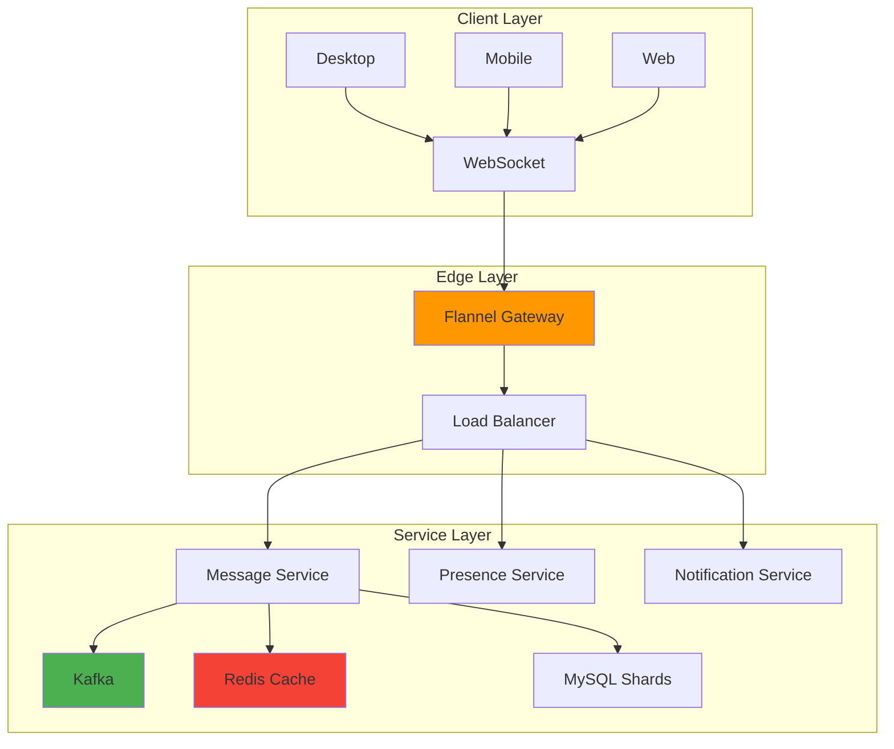
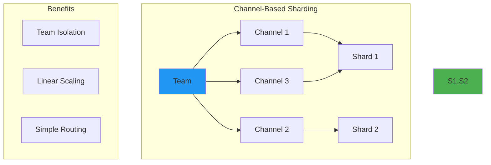
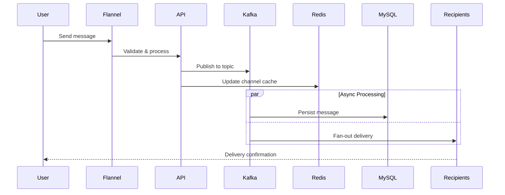
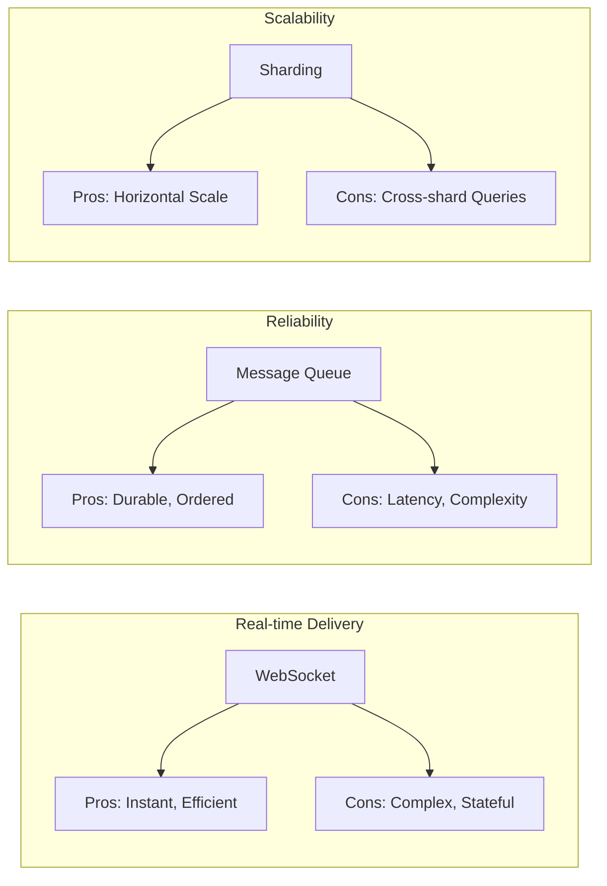
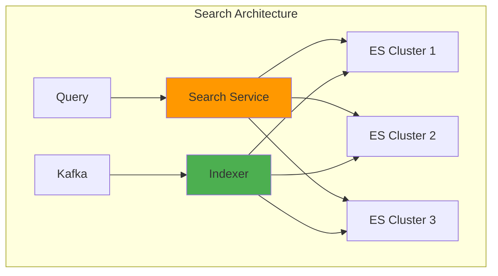
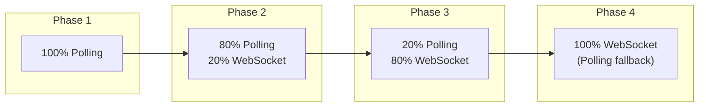

# Slack's Infrastructure: Real-time Messaging at Scale

!!! success "Excellence Badge"
    🥈 **Silver Tier**: Proven patterns with careful trade-off management

!!! abstract "Quick Facts"
    | Metric | Value |
    |--------|-------|
    | **Users** | 20M+ daily active |
    | **Messages** | 1B+ per day |
    | **Connections** | 10M+ concurrent |
    | **Teams** | 750K+ organizations |
    | **Latency** | <100ms p99 |

## Executive Summary

Slack transformed team communication by building a real-time messaging platform that feels instant. Through innovations like Flannel (their websocket gateway), channel-based sharding, and graceful degradation, Slack maintains millions of persistent connections while delivering messages in under 100ms. This case study explores how they built infrastructure that scales while maintaining the responsiveness users expect.

## System Architecture

### High-Level Overview



### Key Components

| Component | Purpose | Scale |
|-----------|---------|-------|
| **Flannel** | WebSocket gateway | 10M+ connections |
| **Kafka** | Message queue | 1B+ messages/day |
| **Redis** | Channel cache | 100K+ ops/sec |
| **MySQL** | Message storage | 100TB+ data |
| **Elasticsearch** | Message search | 1B+ documents |

## Technical Deep Dive

### WebSocket Management

=== "Connection Handling"
    ```go
    // Flannel gateway connection manager
    type ConnectionManager struct {
        connections map[string]*WSConnection
        mu sync.RWMutex
    }
    
    func (cm *ConnectionManager) HandleConnection(ws *websocket.Conn, userID string) {
        conn := &WSConnection{
            ws: ws,
            userID: userID,
            channels: make(map[string]bool),
            send: make(chan []byte, 256),
        }
        
        cm.mu.Lock()
        cm.connections[userID] = conn
        cm.mu.Unlock()
        
        // Start goroutines for read/write
        go conn.readPump()
        go conn.writePump()
    }
    ```

=== "Message Routing"
    ```python
    class MessageRouter:
        def route_message(self, message):
            # Determine target channels
            channel_id = message['channel_id']
            
            # Get channel members
            members = self.redis.smembers(f'channel:{channel_id}:members')
            
            # Find active connections
            for member in members:
                if connection := self.flannel.get_connection(member):
                    # Direct delivery via WebSocket
                    connection.send(message)
                else:
                    # Queue for offline delivery
                    self.queue_offline_message(member, message)
    ```

=== "Graceful Degradation"
    ```python
    class GracefulDegradation:
        def deliver_message(self, user_id, message):
            strategies = [
                self.websocket_delivery,
                self.long_polling_delivery,
                self.push_notification,
                self.email_notification
            ]
            
            for strategy in strategies:
                try:
                    if strategy(user_id, message):
                        return True
                except Exception as e:
                    logger.warning(f"Strategy {strategy} failed: {e}")
            
            return False
    ```

### Sharding Strategy



### Message Flow



## Performance Optimization

### Caching Strategy

| Cache Layer | Data | TTL | Hit Rate |
|-------------|------|-----|----------|
| **Connection Cache** | User -> Server mapping | 5 min | 95% |
| **Channel Cache** | Active channel members | 1 min | 90% |
| **Message Cache** | Recent messages | 30 min | 80% |
| **User Cache** | Profile data | 1 hour | 85% |

### Trade-off Analysis



## Operational Challenges

### Challenge 1: Connection Storms

**Problem**: Mass reconnections after outages

**Solution**:
```python
class ConnectionThrottler:
    def __init__(self, rate_limit=1000):
        self.rate_limit = rate_limit
        self.window = TokenBucket(rate_limit)
    
    def accept_connection(self, client_id):
        # Exponential backoff for reconnections
        backoff = self.calculate_backoff(client_id)
        
        if self.window.try_consume(1):
            return True, 0
        else:
            return False, backoff
```

### Challenge 2: Message Ordering

**Problem**: Messages arriving out of order across shards

**Solution**: Channel-scoped ordering with Kafka partitions

```python
def get_partition(channel_id):
    # All messages for a channel go to same partition
    return hash(channel_id) % NUM_PARTITIONS

# Kafka producer config
producer.send(
    topic='messages',
    key=channel_id,  # Ensures ordering
    value=message,
    partition=get_partition(channel_id)
)
```

### Challenge 3: Search at Scale



## Best Practices Implemented

### 1. Graceful Degradation

✅ **Multiple Delivery Paths**
- Primary: WebSocket
- Fallback 1: Long polling
- Fallback 2: Push notifications
- Fallback 3: Email digest

### 2. Resource Management

```python
# Connection limits per server
MAX_CONNECTIONS_PER_SERVER = 50000
CONNECTION_IDLE_TIMEOUT = 300  # 5 minutes
MESSAGE_BUFFER_SIZE = 256

# Memory optimization
class ConnectionPool:
    def __init__(self):
        self.pool = []
        self.max_size = 1000
    
    def get_connection(self):
        if self.pool:
            return self.pool.pop()
        return self.create_connection()
    
    def return_connection(self, conn):
        if len(self.pool) < self.max_size:
            conn.reset()
            self.pool.append(conn)
```

### 3. Monitoring and Alerting

| Metric | Alert Threshold | Response |
|--------|-----------------|----------|
| **Connection Count** | >45K per server | Scale out |
| **Message Latency** | >200ms p99 | Investigate bottleneck |
| **Kafka Lag** | >10K messages | Add consumers |
| **Cache Hit Rate** | <80% | Warm cache |
| **Error Rate** | >0.1% | Page on-call |

## Migration Path

### From Polling to WebSockets



## Lessons for Your Architecture

### When to Use This Approach

✅ **Good Fit**
- Real-time collaboration needs
- Millions of concurrent users
- Rich message history requirements
- Team/channel-based isolation

❌ **Consider Alternatives**
- Simple request/response patterns (use REST)
- Batch processing needs (use queues)
- Very high message rates (>1M/sec)
- Strict ordering across all messages

### Implementation Checklist

- [ ] Design connection management strategy
- [ ] Implement multiple delivery mechanisms
- [ ] Plan sharding strategy early
- [ ] Build comprehensive monitoring
- [ ] Test failure scenarios
- [ ] Plan for connection storms
- [ ] Implement message ordering
- [ ] Design cache warming strategy

## Related Resources

- [WebSocket Pattern](../../../pattern-library/communication/websocket.md)
- [Message Queue Pattern](../../../pattern-library/message-queue.md)
- [Sharding Pattern](../../../pattern-library/scaling/sharding.md)
- [Building Slack's Architecture](https://slack.engineering/)

---

*"Real-time messaging is not just about speed, it's about reliability at speed." - Slack Engineering*