# 🕸 Social Graph Architecture

**The Challenge**: Build a distributed social graph system serving billions of users with real-time friend recommendations and graph queries

!!! info "Case Study Overview"
 **System**: Distributed social graph and recommendation engine 
 **Scale**: 3B+ users, 500B+ edges, 100k+ QPS graph queries 
 **Challenges**: Graph partitioning, real-time updates, celebrity nodes, privacy 
 **Key Patterns**: Graph sharding, denormalization, caching, asynchronous processing 
 **Sources**: Facebook TAO¹, LinkedIn's Graph Database², Twitter FlockDB³, Pinterest Graph⁴

## Introduction

Social graphs represent the relationships between billions of users, generating massive, highly connected datasets that challenge traditional database architectures. Modern social platforms require real-time friend suggestions, mutual connections, and graph traversals at unprecedented scale.

The key insight: **treat the social graph as both a storage and computation problem**, requiring specialized data structures, intelligent partitioning, and aggressive caching to achieve acceptable performance.

## Part 1: The Physics of Social Networks

### Law 1: Growth - Power Law Distribution

!!! abstract "📈 Growth Law in Action"
 <p><strong>Social networks follow power laws</strong> - 80% of users have <200 friends, while 0.1% (celebrities) have >1M followers, creating extreme load imbalances.</p>


**Power Law Implications:**

| User Type | Population | Avg Connections | Storage Impact | Query Impact |
|-----------|------------|-----------------|----------------|---------------|
| Regular Users | 80% | 150 | 1KB/user | <10 QPS |
| Active Users | 19% | 1,000 | 10KB/user | 100 QPS |
| Influencers | 0.9% | 50,000 | 500KB/user | 10K QPS |
| Celebrities | 0.1% | 10M+ | 100MB/user | 1M+ QPS |
<td data-label="Population">0.1%</td>
<td data-label="Avg Connections">10M+</td>
<td data-label="Storage Impact">Extreme</td>
<td data-label="Query Impact">Hotspot risk</td>
</tr>
</tbody>
</table>


### Law 2: Concurrency - Six Degrees of Separation

!!! abstract "🔗 Concurrency Law in Action"
 <p><strong>Graph traversal requires massive parallelism</strong> - finding connections between any two users typically requires exploring millions of paths simultaneously.</p>


## Part 2: Graph Data Models and Storage

### Entity-Relationship Model


### Graph Storage Strategies

#### 1. Adjacency List Approach

!!! note "🎯 Design Decision: Adjacency Lists vs Edge Tables"
 <strong>Problem</strong>: How to efficiently store and query billions of graph edges?
 <strong>Solution</strong>: Use adjacency lists for fast neighbor lookups with edge tables for complex queries

```mermaid
graph LR
 subgraph "Adjacency List Storage"
 AL[User 12345<br/>Friends: [67890, 11111, 22222, ...]]
 ALI[Inverted Index<br/>67890: [12345, 33333, 44444, ...]]
 end
 
 subgraph "Edge Table Storage"
 ET[from_user | to_user | type | timestamp<br/>12345 | 67890 | friend | 2023-01-15<br/>67890 | 12345 | friend | 2023-01-15]
 end
 
 subgraph "Hybrid Approach"
 CACHE[Redis: Hot adjacency lists<br/>Fast O(1) friend lookups]
 DB[MySQL: Complete edge data<br/>Complex queries & analytics]
 
 CACHE <--> DB
 end
```

**Storage Comparison:**

| Approach | Read Performance | Write Performance | Storage Efficiency | Query Flexibility |
|----------|------------------|-------------------|-------------------|-------------------|
| Adjacency List | O(1) neighbor lookup | O(n) list updates | 60% overhead (pointers) | Limited to direct edges |
| Edge Table | O(log n) with index | O(1) insert | 95% efficient | Full SQL capabilities |
| Hybrid (TAO) | O(1) cache + O(log n) DB | O(1) + async sync | 80% with 10GB cache/node | Best of both worlds |


#### 2. Graph-Specific Data Structures

```python
# Compressed Sparse Row (CSR) representation
class CompressedSocialGraph:
 def __init__(self):
 self.row_ptr = [] # Offset into col_indices for each user
 self.col_indices = [] # Concatenated friend lists
 self.edge_data = [] # Edge metadata (optional)
 
 def get_friends(self, user_id):
 """O(1) friend list lookup"""
 start = self.row_ptr[user_id]
 end = self.row_ptr[user_id + 1]
 return self.col_indices[start:end]
 
 def add_edge(self, from_user, to_user):
 """O(n) insertion - requires rebuilding"""
# Expensive operation, typically done in batch
 pass

# Memory-efficient edge representation
class EdgeList:
 def __init__(self):
 self.edges = np.array([], dtype=[
 ('from_user', 'u8'), # 8-byte user ID
 ('to_user', 'u8'), # 8-byte user ID 
 ('edge_type', 'u1'), # 1-byte type enum
 ('timestamp', 'u4'), # 4-byte unix timestamp
 ('weight', 'f4') # 4-byte edge weight
 ])
 
 def memory_usage(self):
 """Calculate memory efficiency"""
 return len(self.edges) * 25 # bytes per edge
```

## Part 3: Distributed Graph Partitioning

### Partitioning Strategies

#### User-Based Partitioning (Vertical)

```mermaid
graph TB
 subgraph "User Hash Partitioning"
 P1[Shard 1<br/>Users 0-99M<br/>hash(user_id) % 4 = 0]
 P2[Shard 2<br/>Users 100-199M<br/>hash(user_id) % 4 = 1]
 P3[Shard 3<br/>Users 200-299M<br/>hash(user_id) % 4 = 2]
 P4[Shard 4<br/>Users 300-399M<br/>hash(user_id) % 4 = 3]
 end
 
 subgraph "Cross-Shard Challenges"
 C1[Friend in Shard 1<br/>Following user in Shard 3]
 C2[Cross-shard join<br/>Network latency]
 C3[Distributed transaction<br/>Consistency complexity]
 end
 
 classDef shard fill:#e3f2fd,stroke:#1976d2
 classDef challenge fill:#ffcdd2,stroke:#d32f2f
 
 class P1,P2,P3,P4 shard
 class C1,C2,C3 challenge
```

#### Edge-Based Partitioning (Horizontal)


### Facebook TAO Architecture

!!! info "💡 Insight: TAO's Three-Layer Architecture"
 Facebook's TAO (The Associations and Objects) uses a three-tier architecture: social graph API, cache layer, and persistent storage, handling 1B+ queries per second.


**TAO Query Patterns:**

```python
# TAO's three primary query types
class TAOQueries:
 def assoc_range(self, id1, atype, pos, limit):
 """Get edges of type atype from id1, paginated"""
# Example: Get friends of user 12345, limit 50
 return self.get_edges(user_id=12345, edge_type="friend", 
 offset=pos, limit=limit)
 
 def assoc_count(self, id1, atype):
 """Count edges of type atype from id1"""
# Example: Count followers of user 67890
 return self.count_edges(user_id=67890, edge_type="follower")
 
 def assoc_get(self, id1, atype, id2set):
 """Check if edges exist between id1 and id2set"""
# Example: Check if user 12345 is friends with [67890, 11111]
 return self.check_edges(from_user=12345, to_users=[67890, 11111], 
 edge_type="friend")
```

## Part 4: Friend Recommendation Algorithms

### Mutual Friends Algorithm

```mermaid
graph TB
 subgraph "Mutual Friends Discovery"
 U1[User A<br/>Friends: [B, C, D]]
 U2[User B<br/>Friends: [A, E, F]]
 U3[User C<br/>Friends: [A, E, G]]
 U4[User E<br/>Not friends with A<br/>Mutual: [B, C]]
 
 U1 --> U2
 U1 --> U3
 U2 --> U4
 U3 --> U4
 end
 
 subgraph "Recommendation Score"
 SCORE[Score(A, E) = <br/>mutual_friends * 2 +<br/>common_interests * 1 +<br/>geographic_proximity * 0.5]
 end
```

**Implementation with Set Intersection:**

```python
class FriendRecommendationEngine:
 def __init__(self, graph_store):
 self.graph = graph_store
 self.recommendation_cache = RedisCache()
 
 def get_mutual_friends_recommendations(self, user_id, limit=10):
 """Find friend recommendations based on mutual connections"""
 user_friends = set(self.graph.get_friends(user_id))
 
 candidate_scores = defaultdict(int)
 
# For each friend, look at their friends
 for friend_id in user_friends:
 friend_friends = set(self.graph.get_friends(friend_id))
 
# Find mutual connections (excluding user and existing friends)
 candidates = friend_friends - user_friends - {user_id}
 
 for candidate in candidates:
 candidate_scores[candidate] += 1 # Weight by mutual friends
 
# Sort by score and return top recommendations
 recommendations = sorted(candidate_scores.items(), 
 key=lambda x: x[1], reverse=True)
 return recommendations[:limit]
 
 def get_recommendations_with_features(self, user_id, limit=10):
 """Enhanced recommendations with multiple signals"""
 base_recs = self.get_mutual_friends_recommendations(user_id, limit*3)
 
 enhanced_recs = []
 for candidate_id, mutual_count in base_recs:
 score = mutual_count * 2.0 # Base mutual friends score
 
# Add additional signals
 score += self.get_interest_similarity(user_id, candidate_id) * 1.0
 score += self.get_geographic_proximity(user_id, candidate_id) * 0.5
 score += self.get_interaction_history(user_id, candidate_id) * 3.0
 
 enhanced_recs.append((candidate_id, score))
 
# Re-sort and return top results
 enhanced_recs.sort(key=lambda x: x[1], reverse=True)
 return enhanced_recs[:limit]
```

### Graph Embeddings for Recommendations

```mermaid
graph LR
 subgraph "Node2Vec Pipeline"
 GRAPH[Social Graph<br/>Nodes + Edges]
 WALK[Random Walks<br/>Generate sequences]
 EMBED[Skip-gram Model<br/>Learn embeddings]
 VECTOR[User Vectors<br/>128-dimensional]
 end
 
 subgraph "Similarity Computation"
 DOT[Dot Product<br/>similarity(u,v)]
 KNN[K-Nearest Neighbors<br/>Find similar users]
 FILTER[Privacy Filter<br/>Remove existing friends]
 RANK[Recommendation<br/>Ranking]
 end
 
 GRAPH --> WALK
 WALK --> EMBED 
 EMBED --> VECTOR
 VECTOR --> DOT
 DOT --> KNN
 KNN --> FILTER
 FILTER --> RANK
```

**Graph Embedding Implementation:**

```python
import numpy as np
from sklearn.metrics.pairwise import cosine_similarity

class GraphEmbeddingRecommender:
 def __init__(self, embedding_dim=128):
 self.embedding_dim = embedding_dim
 self.user_embeddings = {}
 
 def generate_random_walks(self, graph, user_id, walk_length=80, num_walks=10):
 """Generate random walks starting from user_id"""
 walks = []
 
 for _ in range(num_walks):
 walk = [user_id]
 current = user_id
 
 for _ in range(walk_length - 1):
 neighbors = graph.get_friends(current)
 if not neighbors:
 break
 
# Random walk with restart probability
 if np.random.random() < 0.15: # 15% restart chance
 current = user_id
 else:
 current = np.random.choice(neighbors)
 walk.append(current)
 
 walks.append(walk)
 
 return walks
 
 def train_embeddings(self, graph, all_users):
 """Train Node2Vec embeddings using Word2Vec"""
 from gensim.models import Word2Vec
 
# Generate walks for all users
 all_walks = []
 for user_id in all_users:
 walks = self.generate_random_walks(graph, user_id)
 all_walks.extend(walks)
 
# Convert to string sequences for Word2Vec
 walk_sequences = [[str(node) for node in walk] for walk in all_walks]
 
# Train Word2Vec model
 model = Word2Vec(walk_sequences, 
 vector_size=self.embedding_dim,
 window=10, 
 min_count=1, 
 workers=4,
 sg=1) # Skip-gram
 
# Extract embeddings
 for user_id in all_users:
 if str(user_id) in model.wv:
 self.user_embeddings[user_id] = model.wv[str(user_id)]
 
 def get_similar_users(self, user_id, top_k=50):
 """Find most similar users using cosine similarity"""
 if user_id not in self.user_embeddings:
 return []
 
 user_vector = self.user_embeddings[user_id].reshape(1, -1)
 similarities = []
 
 for other_user, other_vector in self.user_embeddings.items():
 if other_user == user_id:
 continue
 
 other_vector = other_vector.reshape(1, -1)
 similarity = cosine_similarity(user_vector, other_vector)[0][0]
 similarities.append((other_user, similarity))
 
# Sort by similarity and return top k
 similarities.sort(key=lambda x: x[1], reverse=True)
 return similarities[:top_k]
```

## Part 5: Real-Time Graph Updates

### Event-Driven Architecture

!!! danger "⚠️ Failure Scenario: Celebrity Following Spike"
 <strong>Problem</strong>: Celebrity gains 1M followers in 1 hour during viral event
 <strong>Impact</strong>: Graph update storm overwhelms database, friend recommendations lag
 <strong>Solution</strong>: Implement async processing with rate limiting and backpressure


**Asynchronous Graph Update System:**

```python
import asyncio
from dataclasses import dataclass
from typing import List, Optional
import aioredis
import aiomysql

@dataclass
class GraphEvent:
 event_type: str # "follow", "unfollow", "friend_request"
 from_user: int
 to_user: int
 timestamp: int
 metadata: dict

class AsyncGraphUpdater:
 def __init__(self):
 self.event_queue = asyncio.Queue(maxsize=10000)
 self.batch_size = 100
 self.batch_timeout = 1.0 # seconds
 
 async def process_follow_event(self, event: GraphEvent):
 """Process a single follow event with rate limiting"""
 
# Check if target user is a celebrity (>1M followers)
 follower_count = await self.get_follower_count(event.to_user)
 
 if follower_count > 1_000_000:
# Use special handling for celebrity accounts
 await self.process_celebrity_follow(event)
 else:
# Normal processing
 await self.process_normal_follow(event)
 
 async def process_celebrity_follow(self, event: GraphEvent):
 """Special handling for celebrity follows with batching"""
 
# Add to celebrity batch queue
 await self.celebrity_queue.put(event)
 
# Process in larger batches with rate limiting
 if self.celebrity_queue.qsize() >= 1000:
 batch = []
 for _ in range(1000):
 batch.append(await self.celebrity_queue.get())
 
 await self.batch_update_edges(batch)
 await asyncio.sleep(0.1) # Rate limiting
 
 async def batch_update_edges(self, events: List[GraphEvent]):
 """Batch update graph edges for efficiency"""
 
# Prepare batch insert
 edge_inserts = []
 cache_invalidations = []
 
 for event in events:
 edge_inserts.append((
 event.from_user, 
 event.to_user, 
 event.event_type,
 event.timestamp
 ))
 
 cache_invalidations.extend([
 f"user:{event.from_user}:following",
 f"user:{event.to_user}:followers",
 f"user:{event.from_user}:recommendations"
 ])
 
# Execute batch operations
 async with aiomysql.connect(**db_config) as conn:
 async with conn.cursor() as cursor:
 await cursor.executemany(
 "INSERT INTO edges (from_user, to_user, edge_type, created_at) "
 "VALUES (%s, %s, %s, FROM_UNIXTIME(%s))",
 edge_inserts
 )
 await conn.commit()
 
# Batch invalidate caches
 redis = await aioredis.from_url("redis://localhost")
 if cache_invalidations:
 await redis.delete(*cache_invalidations)
```

### Consistency and Conflict Resolution

```mermaid
graph TB
 subgraph "Graph Consistency Challenges"
 C1[Mutual friend<br/>recommendation race]
 C2[Follow/unfollow<br/>rapid toggles]
 C3[Celebrity hotspot<br/>write conflicts]
 C4[Cross-datacenter<br/>replication lag]
 end
 
 subgraph "Resolution Strategies"
 R1[Last-writer-wins<br/>with timestamps]
 R2[Conflict-free replicated<br/>data types (CRDTs)]
 R3[Eventually consistent<br/>with compensations]
 R4[Regional sharding<br/>with async sync]
 end
 
 C1 --> R1
 C2 --> R2
 C3 --> R3 
 C4 --> R4
```

## Part 6: Privacy and Security

### Privacy-Preserving Graph Queries

!!! note "🎯 Design Decision: Privacy-First Graph Traversal"
 <strong>Challenge</strong>: Enable friend discovery while respecting privacy settings
 <strong>Solution</strong>: Implement privacy-aware graph algorithms with access control at every step

```python
class PrivacyAwareGraphTraversal:
 def __init__(self, graph_store, privacy_engine):
 self.graph = graph_store
 self.privacy = privacy_engine
 
 def find_mutual_friends(self, user_a, user_b, requesting_user):
 """Find mutual friends with privacy filtering"""
 
# Check if requesting user can see both profiles
 if not (self.privacy.can_view_friends(requesting_user, user_a) and
 self.privacy.can_view_friends(requesting_user, user_b)):
 return []
 
 friends_a = set(self.graph.get_friends(user_a))
 friends_b = set(self.graph.get_friends(user_b))
 
 mutual_friends = friends_a & friends_b
 
# Filter out friends who don't want to be discoverable
 visible_mutual = []
 for friend_id in mutual_friends:
 if self.privacy.allow_mutual_friend_discovery(friend_id, requesting_user):
 visible_mutual.append(friend_id)
 
 return visible_mutual
 
 def suggest_friends_of_friends(self, user_id, limit=10):
 """Privacy-aware friend-of-friend recommendations"""
 user_friends = set(self.graph.get_friends(user_id))
 
 candidate_scores = defaultdict(int)
 
 for friend_id in user_friends:
# Check privacy: can this friend's network be used for recommendations?
 if not self.privacy.allow_network_suggestions(friend_id, user_id):
 continue
 
 friend_friends = set(self.graph.get_friends(friend_id))
 candidates = friend_friends - user_friends - {user_id}
 
 for candidate in candidates:
# Check if candidate allows discovery through mutual friends
 if self.privacy.allow_discoverability(candidate, user_id, friend_id):
 candidate_scores[candidate] += 1
 
# Sort and return recommendations
 recommendations = sorted(candidate_scores.items(), 
 key=lambda x: x[1], reverse=True)
 return recommendations[:limit]

class PrivacyEngine:
 def __init__(self):
 self.privacy_settings = {} # user_id -> privacy config
 
 def can_view_friends(self, viewer_id, target_id):
 """Check if viewer can see target's friend list"""
 settings = self.privacy_settings.get(target_id, {})
 friend_list_visibility = settings.get('friend_list_visibility', 'friends')
 
 if friend_list_visibility == 'public':
 return True
 elif friend_list_visibility == 'friends':
 return self.are_friends(viewer_id, target_id)
 elif friend_list_visibility == 'private':
 return viewer_id == target_id
 
 return False
 
 def allow_discoverability(self, candidate_id, requester_id, mutual_friend_id):
 """Check if candidate allows being discovered through mutual friend"""
 settings = self.privacy_settings.get(candidate_id, {})
 discovery_mode = settings.get('friend_discovery', 'friends_of_friends')
 
 if discovery_mode == 'disabled':
 return False
 elif discovery_mode == 'friends_only':
 return self.are_friends(candidate_id, requester_id)
 elif discovery_mode == 'friends_of_friends':
 return True # Already filtered by mutual friend logic
 
 return True
```

### Graph Anonymization and Differential Privacy

```mermaid
graph LR
 subgraph "Privacy Protection Techniques"
 DP[Differential Privacy<br/>Add statistical noise]
 KAN[k-Anonymity<br/>Group similar users]
 LDAP[Local Differential Privacy<br/>Client-side noise]
 HOM[Homomorphic Encryption<br/>Compute on encrypted data]
 end
 
 subgraph "Use Cases"
 ANALYTICS[Graph Analytics<br/>ε = 1.0 privacy budget]
 RECS[Recommendations<br/>ε = 0.1 privacy budget] 
 RESEARCH[Academic Research<br/>ε = 2.0 privacy budget]
 INSIGHTS[Business Insights<br/>ε = 0.5 privacy budget]
 end
 
 DP --> ANALYTICS
 DP --> RECS
 KAN --> RESEARCH
 LDAP --> INSIGHTS
```



## Part 7: Performance Optimization and Monitoring

### Caching Strategies

```mermaid
graph TB
 subgraph "Multi-Level Cache Hierarchy"
 L1[L1: Application Cache<br/>Hot user data, 1ms TTL]
 L2[L2: Redis Cluster<br/>Friend lists, 1hr TTL]
 L3[L3: CDN Edge Cache<br/>Public profiles, 24hr TTL]
 L4[L4: Database Buffer Pool<br/>Recent graph queries]
 end
 
 subgraph "Cache Invalidation Strategy"
 WRITE[Graph Write<br/>Follow/Unfollow]
 INV1[Invalidate user caches<br/>O(1) operations]
 INV2[Invalidate recommendation<br/>caches O(friends)]
 INV3[Async rebuild<br/>expensive computations]
 
 WRITE --> INV1
 INV1 --> INV2
 INV2 --> INV3
 end
```

**Cache Implementation:**

```python
class GraphCacheManager:
 def __init__(self):
 self.l1_cache = {} # In-memory cache
 self.l2_cache = Redis(host='redis-cluster')
 self.cache_stats = CacheStats()
 
 async def get_user_friends(self, user_id):
 """Multi-level cache lookup for user friends"""
 cache_key = f"friends:{user_id}"
 
# L1: Application memory cache
 if cache_key in self.l1_cache:
 self.cache_stats.record_hit('l1')
 return self.l1_cache[cache_key]
 
# L2: Redis cache
 friends_data = await self.l2_cache.get(cache_key)
 if friends_data:
 self.cache_stats.record_hit('l2')
# Populate L1 cache
 self.l1_cache[cache_key] = friends_data
 return friends_data
 
# L3: Database lookup
 self.cache_stats.record_miss()
 friends = await self.graph_db.get_friends(user_id)
 
# Populate caches
 await self.l2_cache.setex(cache_key, 3600, friends) # 1 hour TTL
 self.l1_cache[cache_key] = friends
 
 return friends
 
 async def invalidate_user_caches(self, user_id):
 """Invalidate all caches related to a user"""
 patterns_to_invalidate = [
 f"friends:{user_id}",
 f"followers:{user_id}",
 f"recommendations:{user_id}",
 f"mutual_friends:{user_id}:*"
 ]
 
# Clear L1 cache
 for pattern in patterns_to_invalidate:
 if pattern in self.l1_cache:
 del self.l1_cache[pattern]
 
# Clear L2 cache
 for pattern in patterns_to_invalidate:
 if '*' in pattern:
 keys = await self.l2_cache.keys(pattern)
 if keys:
 await self.l2_cache.delete(*keys)
 else:
 await self.l2_cache.delete(pattern)
```

### Monitoring and Alerting


**Monitoring Implementation:**

```python
import time
import logging
from collections import defaultdict, deque
from dataclasses import dataclass
from typing import Dict, List

@dataclass
class GraphMetrics:
 query_count: int = 0
 total_latency: float = 0.0
 error_count: int = 0
 cache_hits: int = 0
 cache_misses: int = 0
 hot_users: Dict[int, int] = None
 
 def __post_init__(self):
 if self.hot_users is None:
 self.hot_users = defaultdict(int)

class GraphMonitor:
 def __init__(self, window_size=60): # 60-second windows
 self.window_size = window_size
 self.metrics_history = deque(maxlen=window_size)
 self.current_metrics = GraphMetrics()
 self.alert_thresholds = {
 'error_rate': 0.01, # 1% error rate
 'p99_latency': 1000, # 1 second p99
 'cache_hit_rate': 0.80, # 80% cache hit rate
 'hot_user_qps': 1000 # 1000 QPS for single user
 }
 
 def record_query(self, user_id: int, latency_ms: float, success: bool):
 """Record a graph query with latency and success status"""
 self.current_metrics.query_count += 1
 self.current_metrics.total_latency += latency_ms
 
 if not success:
 self.current_metrics.error_count += 1
 
# Track hot users
 self.current_metrics.hot_users[user_id] += 1
 
# Check for immediate alerts
 if self.current_metrics.hot_users[user_id] > self.alert_thresholds['hot_user_qps']:
 self.trigger_hotspot_alert(user_id, self.current_metrics.hot_users[user_id])
 
 def record_cache_hit(self, cache_level: str):
 """Record cache hit by level"""
 self.current_metrics.cache_hits += 1
 
 def record_cache_miss(self):
 """Record cache miss"""
 self.current_metrics.cache_misses += 1
 
 def check_alerts(self):
 """Check all alert conditions and trigger notifications"""
 if self.current_metrics.query_count == 0:
 return
 
# Calculate rates
 error_rate = self.current_metrics.error_count / self.current_metrics.query_count
 avg_latency = self.current_metrics.total_latency / self.current_metrics.query_count
 total_cache_queries = self.current_metrics.cache_hits + self.current_metrics.cache_misses
 cache_hit_rate = (self.current_metrics.cache_hits / total_cache_queries 
 if total_cache_queries > 0 else 0)
 
# Check thresholds
 if error_rate > self.alert_thresholds['error_rate']:
 self.trigger_error_rate_alert(error_rate)
 
 if avg_latency > self.alert_thresholds['p99_latency']:
 self.trigger_latency_alert(avg_latency)
 
 if cache_hit_rate < self.alert_thresholds['cache_hit_rate']:
 self.trigger_cache_alert(cache_hit_rate)
 
 def trigger_hotspot_alert(self, user_id: int, qps: int):
 """Alert on user hotspot detection"""
 logging.warning(f"HOTSPOT ALERT: User {user_id} receiving {qps} QPS")
# Could trigger auto-scaling, additional caching, rate limiting
 
 def get_performance_summary(self) -> Dict:
 """Get current performance summary"""
 if self.current_metrics.query_count == 0:
 return {"status": "no_data"}
 
 total_cache = self.current_metrics.cache_hits + self.current_metrics.cache_misses
 
 return {
 "qps": self.current_metrics.query_count / self.window_size,
 "avg_latency_ms": self.current_metrics.total_latency / self.current_metrics.query_count,
 "error_rate": self.current_metrics.error_count / self.current_metrics.query_count,
 "cache_hit_rate": self.current_metrics.cache_hits / total_cache if total_cache > 0 else 0,
 "top_hot_users": sorted(self.current_metrics.hot_users.items(), 
 key=lambda x: x[1], reverse=True)[:10]
 }
```

## Part 8: Advanced Graph Algorithms

### Community Detection


**Community Detection Implementation:**

```python
import networkx as nx
import numpy as np
from collections import defaultdict

class CommunityDetector:
 def __init__(self, graph_store):
 self.graph = graph_store
 
 def detect_communities_louvain(self, user_subset, max_iterations=100):
 """Implement Louvain community detection algorithm"""
 
# Build NetworkX graph from user subset
 G = nx.Graph()
 
 for user_id in user_subset:
 friends = self.graph.get_friends(user_id)
 for friend_id in friends:
 if friend_id in user_subset: # Only include edges within subset
 G.add_edge(user_id, friend_id)
 
# Initialize: each node in its own community
 communities = {node: i for i, node in enumerate(G.nodes())}
 
 for iteration in range(max_iterations):
 improved = False
 
 for node in G.nodes():
# Calculate modularity gain for moving to neighbor communities
 best_community = communities[node]
 best_gain = 0
 
 neighbor_communities = set()
 for neighbor in G.neighbors(node):
 neighbor_communities.add(communities[neighbor])
 
 for community in neighbor_communities:
 gain = self.calculate_modularity_gain(G, node, community, communities)
 if gain > best_gain:
 best_gain = gain
 best_community = community
 
 if best_community != communities[node]:
 communities[node] = best_community
 improved = True
 
 if not improved:
 break
 
# Group users by community
 community_groups = defaultdict(list)
 for user_id, community_id in communities.items():
 community_groups[community_id].append(user_id)
 
 return dict(community_groups)
 
 def calculate_modularity_gain(self, G, node, target_community, communities):
 """Calculate modularity gain from moving node to target community"""
# Simplified modularity calculation
 m = G.number_of_edges()
 
# Edges from node to target community
 edges_to_community = 0
 for neighbor in G.neighbors(node):
 if communities[neighbor] == target_community:
 edges_to_community += 1
 
# Degree of node
 node_degree = G.degree(node)
 
# Total degree of target community
 community_degree = sum(G.degree(n) for n in G.nodes() 
 if communities[n] == target_community)
 
# Modularity gain approximation
 gain = edges_to_community / m - (node_degree * community_degree) / (2 * m * m)
 return gain
 
 def suggest_groups(self, user_id, min_community_size=10):
 """Suggest groups based on community detection"""
 
# Get user's extended network (2-hop neighbors)
 user_friends = set(self.graph.get_friends(user_id))
 extended_network = set(user_friends)
 
 for friend_id in user_friends:
 friend_friends = self.graph.get_friends(friend_id)
 extended_network.update(friend_friends[:50]) # Limit to avoid explosion
 
# Detect communities in extended network
 communities = self.detect_communities_louvain(list(extended_network))
 
# Find communities that contain user's friends but not the user
 suggested_groups = []
 
 for community_id, members in communities.items():
 if len(members) < min_community_size:
 continue
 
# Check if community contains user's friends but not user
 friend_overlap = len(set(members) & user_friends)
 if friend_overlap >= 3 and user_id not in members:
 suggested_groups.append({
 'community_id': community_id,
 'members': members,
 'friend_overlap': friend_overlap,
 'relevance_score': friend_overlap / len(members)
 })
 
# Sort by relevance and return top suggestions
 suggested_groups.sort(key=lambda x: x['relevance_score'], reverse=True)
 return suggested_groups[:5]
```

### Graph Neural Networks for Enhanced Recommendations

```python
import torch
import torch.nn as nn
import torch.nn.functional as F
from torch_geometric.nn import GCNConv, SAGEConv

class GraphSAGE(nn.Module):
 """GraphSAGE model for learning user embeddings"""
 
 def __init__(self, input_dim, hidden_dim, output_dim, num_layers=2):
 super(GraphSAGE, self).__init__()
 
 self.num_layers = num_layers
 self.convs = nn.ModuleList()
 
# First layer
 self.convs.append(SAGEConv(input_dim, hidden_dim))
 
# Hidden layers
 for _ in range(num_layers - 2):
 self.convs.append(SAGEConv(hidden_dim, hidden_dim))
 
# Output layer
 self.convs.append(SAGEConv(hidden_dim, output_dim))
 
 self.dropout = nn.Dropout(0.2)
 
 def forward(self, x, edge_index):
 """Forward pass through GraphSAGE layers"""
 
 for i, conv in enumerate(self.convs):
 x = conv(x, edge_index)
 
 if i < len(self.convs) - 1: # No activation on final layer
 x = F.relu(x)
 x = self.dropout(x)
 
 return x

class GNNRecommendationSystem:
 def __init__(self, graph_store, feature_dim=128, embedding_dim=64):
 self.graph = graph_store
 self.feature_dim = feature_dim
 self.embedding_dim = embedding_dim
 
# Initialize GraphSAGE model
 self.model = GraphSAGE(
 input_dim=feature_dim,
 hidden_dim=128,
 output_dim=embedding_dim,
 num_layers=3
 )
 
 self.optimizer = torch.optim.Adam(self.model.parameters(), lr=0.01)
 
 def prepare_training_data(self, user_ids, positive_edges, negative_edges):
 """Prepare training data for link prediction"""
 
# Create user features (profile data, activity patterns, etc.)
 user_features = self.extract_user_features(user_ids)
 
# Create edge index for graph structure
 edge_index = self.create_edge_index(positive_edges)
 
 return {
 'user_features': torch.FloatTensor(user_features),
 'edge_index': torch.LongTensor(edge_index),
 'positive_edges': torch.LongTensor(positive_edges),
 'negative_edges': torch.LongTensor(negative_edges)
 }
 
 def train_model(self, training_data, epochs=100):
 """Train GraphSAGE model for link prediction"""
 
 self.model.train()
 
 for epoch in range(epochs):
 self.optimizer.zero_grad()
 
# Forward pass: get node embeddings
 embeddings = self.model(
 training_data['user_features'],
 training_data['edge_index']
 )
 
# Calculate link prediction loss
 loss = self.link_prediction_loss(
 embeddings,
 training_data['positive_edges'],
 training_data['negative_edges']
 )
 
# Backward pass
 loss.backward()
 self.optimizer.step()
 
 if epoch % 10 == 0:
 print(f"Epoch {epoch}, Loss: {loss.item():.4f}")
 
 def link_prediction_loss(self, embeddings, positive_edges, negative_edges):
 """Calculate loss for link prediction task"""
 
# Positive edge scores
 pos_scores = []
 for edge in positive_edges:
 user1_emb = embeddings[edge[0]]
 user2_emb = embeddings[edge[1]]
 score = torch.dot(user1_emb, user2_emb)
 pos_scores.append(score)
 
# Negative edge scores
 neg_scores = []
 for edge in negative_edges:
 user1_emb = embeddings[edge[0]]
 user2_emb = embeddings[edge[1]]
 score = torch.dot(user1_emb, user2_emb)
 neg_scores.append(score)
 
 pos_scores = torch.stack(pos_scores)
 neg_scores = torch.stack(neg_scores)
 
# Binary cross-entropy loss
 pos_loss = -torch.log(torch.sigmoid(pos_scores)).mean()
 neg_loss = -torch.log(1 - torch.sigmoid(neg_scores)).mean()
 
 return pos_loss + neg_loss
 
 def get_recommendations(self, user_id, top_k=10):
 """Get friend recommendations using trained GNN"""
 
 self.model.eval()
 
 with torch.no_grad():
# Get all user embeddings
 all_features = self.extract_user_features(self.all_user_ids)
 edge_index = self.get_current_edge_index()
 
 embeddings = self.model(
 torch.FloatTensor(all_features),
 torch.LongTensor(edge_index)
 )
 
# Calculate similarity scores with target user
 target_embedding = embeddings[user_id]
 
 similarity_scores = []
 for other_user_id in self.all_user_ids:
 if other_user_id == user_id:
 continue
 
 other_embedding = embeddings[other_user_id]
 similarity = torch.dot(target_embedding, other_embedding).item()
 similarity_scores.append((other_user_id, similarity))
 
# Sort by similarity and return top-k
 similarity_scores.sort(key=lambda x: x[1], reverse=True)
 return similarity_scores[:top_k]
```

## Conclusion

Social graph architecture represents one of the most challenging problems in distributed systems, requiring innovative solutions across storage, computation, and privacy domains. The key insights:

**Scale Requires Specialization**: Traditional relational databases cannot handle billion-edge graphs efficiently. Purpose-built solutions like Facebook's TAO demonstrate the need for graph-specific architectures.

**Power Laws Demand Special Handling**: Celebrity nodes create extreme hotspots that require dedicated infrastructure, caching strategies, and rate limiting to prevent system overload.

**Privacy is Paramount**: Modern social graphs must implement privacy-by-design, with access controls at every layer and sophisticated anonymization for analytics.

**Real-time Updates at Scale**: Asynchronous processing, batching, and eventual consistency become essential for maintaining graph consistency while serving real-time queries.

The evolution from simple friend lists to sophisticated recommendation engines powered by graph neural networks illustrates how social graph systems continue to push the boundaries of distributed systems engineering.

Understanding social graph architecture provides valuable insights for any large-scale system dealing with relationships, recommendations, and real-time updates across massive user bases.

## Related Topics

### Axioms
- **Law 1 (Correlated Failure 🔥)**: Celebrity nodes create correlated failures across systems
- **Law 2 (Asynchronous Reality ⏱️)**: Graph updates propagate asynchronously across shards
- **Law 5 (Distributed Knowledge 🧠)**: Privacy requires distributed access control

### Pillars
- **State Distribution**: Graph sharding strategies and consistency models
- **Work Distribution**: Parallel graph algorithms and batch processing
- **Intelligence Distribution**: Distributed recommendation engines and ML pipelines

### Patterns
- [Sharding](../pattern-library/scaling/sharding.md): Graph partitioning strategies
- [Caching](../pattern-library/scaling/caching-strategies.md): Multi-level caching for hot nodes
- [Event Streaming](../pattern-library/architecture/event-streaming.md): Real-time graph updates
- [Privacy Patterns](../pattern-library/location-privacy): Access control and anonymization

## Next Steps

1. **Explore Graph Databases**: Compare Neo4j, Amazon Neptune, and specialized solutions
2. **Study Graph Algorithms**: PageRank, community detection, and path finding at scale
3. **Privacy Engineering**: Deep dive into differential privacy and secure multi-party computation
4. **ML on Graphs**: Graph neural networks and embedding techniques

---

*Continue your journey: [Social Media Feed Architecture](../../../architects-handbook/case-studies/social-communication/social-media-feed.md) | [Back to Case Studies](index.md.md)*