# Social Media Feed Architecture

**The Challenge**: Generate personalized, relevant feeds for 3+ billion users with sub-second latency and real-time updates

!!! info "Case Study Overview"
 **System**: Distributed feed generation and delivery platform 
 **Scale**: 3B+ users, 1B+ posts/day, 50M+ feed requests/sec 
 **Challenges**: Personalization, real-time ranking, storage efficiency, global distribution 
 **Key Patterns**: Fan-out strategies, ML ranking pipelines, edge caching, stream processing 
 **Sources**: Facebook Engineering¹, Instagram Architecture², Twitter Systems³, LinkedIn Engineering⁴

## Introduction

Social media feeds represent one of the most complex distributed systems challenges: generating unique, personalized content streams for billions of users in real-time. The system must balance relevance (showing the right content), freshness (recent updates), engagement (keeping users active), and efficiency (minimizing compute costs).

Modern feed systems process over 1 billion posts daily, serve 50+ million feed requests per second, and must adapt to changing user preferences within minutes. This requires sophisticated machine learning pipelines, massive caching infrastructure, and carefully orchestrated fan-out strategies.

## Part 1: The Physics of Feed Generation

### Law 2: Asynchronous Reality - The Speed of Relevance

!!! abstract "🕰️ Law 2 in Action"
 <p><strong>Every millisecond matters for engagement</strong> - Studies show 100ms delay reduces user engagement by 1%. Feed systems must deliver personalized content in under 200ms to maintain user experience.</p>

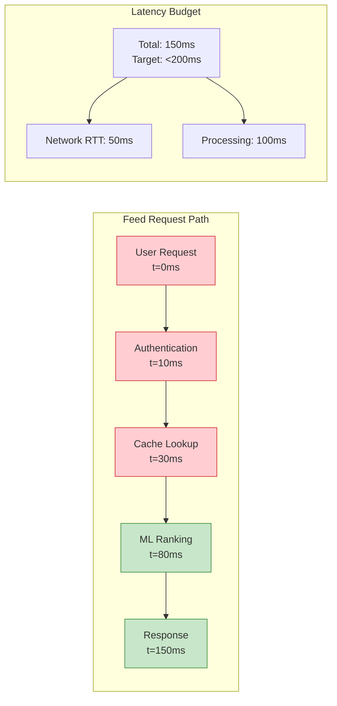

### Law 4: Multidimensional Trade-offs - The Storage-Computation Balance

!!! abstract "💾 Capacity Axiom in Action"
 <p><strong>Memory vs Compute trade-offs define architecture</strong> - Pre-computing all feeds requires 100PB+ storage but enables sub-50ms responses. Computing on-demand uses minimal storage but takes 500ms+.</p>

**Storage Requirements Analysis:**

| Approach | Storage per User | Total Storage | Response Time | Compute Cost |
|----------|-----------------|---------------|---------------|--------------|
| Full Pre-compute | 50MB | 150PB | 50ms | Low |
| Hybrid (Top 100) | 5MB | 15PB | 100ms | Medium |
| Pure On-demand | 1KB | 3TB | 500ms | High |


## Part 2: Core Feed Generation Strategies

### Pull Model (On-Demand Generation)

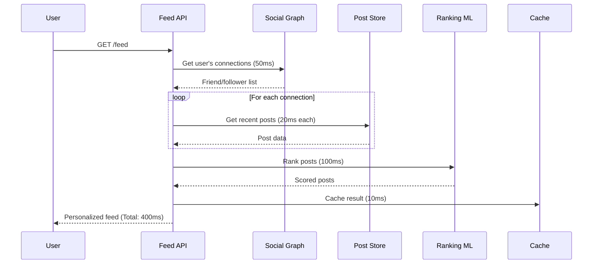

**Pull Model Characteristics:**

**Advantages:**
- **Always Fresh**: Content generated on-demand reflects latest posts
- **Storage Efficient**: No pre-computed feed storage required
- **Flexible**: Easy to experiment with ranking algorithms
- **Personalized**: Can incorporate real-time user context

**Disadvantages:**
- **High Latency**: 400-800ms response times
- **Expensive Computation**: Ranking runs for every request
- **Database Load**: Heavy read traffic on post stores
- **Scaling Challenges**: Computation grows with user activity

### Push Model (Pre-computed Feeds)

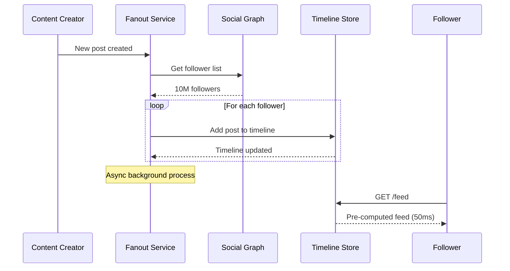

**Push Model Implementation:**

```python
class FanoutService:
 def __init__(self):
 self.social_graph = SocialGraphService()
 self.timeline_store = TimelineStore()
 self.task_queue = CeleryQueue()
 
 def publish_post(self, user_id: str, post: Post):
 """Fan-out post to all followers."""
 followers = self.social_graph.get_followers(user_id)
 
# Batch fan-out to avoid overwhelming systems
 batch_size = 1000
 for i in range(0, len(followers), batch_size):
 batch = followers[i:i + batch_size]
 self.task_queue.delay(
 self._fanout_batch,
 post,
 batch
 )
 
 def _fanout_batch(self, post: Post, follower_batch: List[str]):
 """Process batch of follower timeline updates."""
 for follower_id in follower_batch:
 self.timeline_store.add_to_timeline(
 user_id=follower_id,
 post=post,
 ttl=7 * 24 * 3600 # 7 days
 )
```

**Push Model Characteristics:**

**Advantages:**
- **Ultra-fast Reads**: 10-50ms response times
- **Predictable Load**: Write-time computation
- **Pre-ranked**: Can apply complex ML models offline
- **High Availability**: Cached data survives ranking service outages

**Disadvantages:**
- **Celebrity Problem**: Users with 10M+ followers create massive fan-out
- **Storage Explosion**: 50MB per active user = 150PB total
- **Stale Content**: Ranking changes don't propagate immediately
- **Write Amplification**: Single post → millions of timeline updates

### Hybrid Model (Production Reality)

!!! note "🎯 Design Decision: Hybrid Fan-out Strategy"
 <strong>Problem</strong>: Pure push/pull models don't work at scale
 <strong>Solution</strong>: Segment users by follower count and apply different strategies

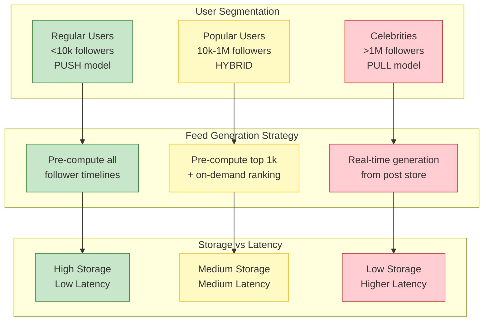

**Hybrid Implementation Strategy:**

```python
class HybridFeedGenerator:
 def __init__(self):
 self.follower_threshold_push = 10_000
 self.follower_threshold_pull = 1_000_000
 
 def generate_feed(self, user_id: str, limit: int = 50):
 """Generate feed using hybrid strategy."""
 timeline_posts = self._get_timeline_cache(user_id)
 
# Get posts from high-follower accounts (not pre-computed)
 celebrity_follows = self._get_celebrity_follows(user_id)
 celebrity_posts = self._fetch_celebrity_posts(celebrity_follows)
 
# Merge and rank all content
 all_posts = timeline_posts + celebrity_posts
 ranked_posts = self.ranking_service.rank(
 user_id=user_id,
 posts=all_posts,
 context=self._get_user_context(user_id)
 )
 
 return ranked_posts[:limit]
 
 def _get_celebrity_follows(self, user_id: str):
 """Get users that this user follows who have >1M followers."""
 follows = self.social_graph.get_following(user_id)
 return [
 f for f in follows 
 if self.social_graph.get_follower_count(f) > self.follower_threshold_pull
 ]
```

## Part 3: Machine Learning Ranking Pipeline

### Multi-Stage Ranking Architecture

!!! info "💡 Insight: Funnel-Based Ranking"
 Feed ranking uses a multi-stage funnel: retrieve thousands of candidates quickly, then apply expensive ML models to top hundreds. This balances relevance with computational efficiency.

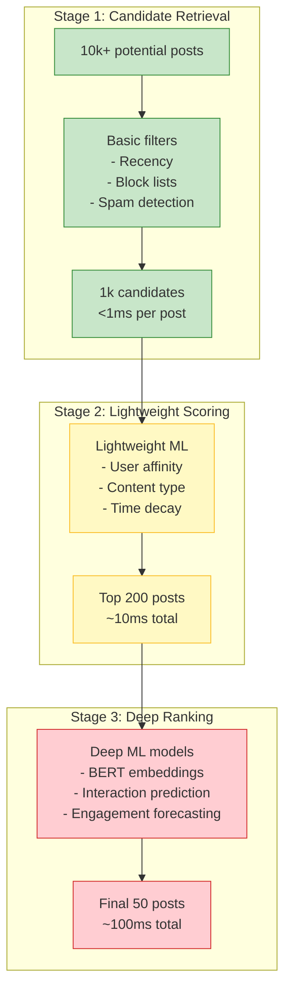

### Feature Engineering Pipeline

**Core Ranking Features:**

1. **User-Content Affinity**
 - Historical interaction rate with author
 - Content type preferences (video, image, text)
 - Topic interest scores from user behavior
 - Time-of-day and device usage patterns

2. **Content Quality Signals**
 - Early engagement velocity (likes/comments in first hour)
 - Content authenticity scores (spam detection)
 - Media quality metrics (image resolution, video completion rate)
 - Text sentiment and readability scores

3. **Social Signals**
 - Number of mutual friends who engaged
 - Author's overall engagement rates
 - Content virality trajectory
 - Community cluster relevance

4. **Temporal Factors**
 - Post freshness (exponential decay)
 - User session context
 - Trending topic boost
 - Seasonal relevance

```python
class FeedRankingPipeline:
 def __init__(self):
 self.lightweight_model = LightweightRankingModel()
 self.deep_model = DeepRankingModel()
 self.feature_store = FeatureStore()
 
 def rank_posts(self, user_id: str, candidate_posts: List[Post]) -> List[RankedPost]:
 """Multi-stage ranking pipeline."""
 
# Stage 1: Fast feature computation
 lightweight_features = []
 for post in candidate_posts:
 features = self._compute_lightweight_features(user_id, post)
 lightweight_features.append(features)
 
# Stage 2: Lightweight model scoring
 light_scores = self.lightweight_model.predict(lightweight_features)
 top_candidates = self._select_top_k(candidate_posts, light_scores, k=200)
 
# Stage 3: Deep feature computation (expensive)
 deep_features = []
 for post in top_candidates:
 features = self._compute_deep_features(user_id, post)
 deep_features.append(features)
 
# Stage 4: Deep model final ranking
 final_scores = self.deep_model.predict(deep_features)
 
 return self._create_ranked_results(top_candidates, final_scores)
 
 def _compute_lightweight_features(self, user_id: str, post: Post) -> Dict:
 """Fast feature computation (<1ms per post)."""
 return {
 'user_author_affinity': self.feature_store.get_affinity(user_id, post.author_id),
 'post_age_hours': (datetime.now() - post.created_at).total_seconds() / 3600,
 'content_type': post.content_type,
 'early_engagement_rate': post.engagement_count / max(1, post.view_count),
 'mutual_friends_count': len(self.social_graph.get_mutual_friends(user_id, post.author_id))
 }
 
 def _compute_deep_features(self, user_id: str, post: Post) -> Dict:
 """Expensive feature computation (~5ms per post)."""
 return {
 **self._compute_lightweight_features(user_id, post),
 'content_embedding': self.text_encoder.encode(post.text_content),
 'user_interest_match': self.interest_model.compute_similarity(user_id, post),
 'predicted_engagement': self.engagement_predictor.predict(user_id, post),
 'virality_score': self.virality_model.predict(post),
 'quality_score': self.content_quality_scorer.score(post)
 }
```

### Real-time Model Updates

!!! danger "⚠️ Failure Scenario: Model Staleness Crisis"
 <strong>Problem</strong>: Trending topic about breaking news gets 0 visibility because ML models trained on historical data
 <strong>Impact</strong>: 40% drop in engagement during major news events
 <strong>Solution</strong>: Real-time feature updates + online learning pipeline

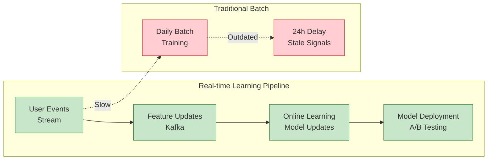

## Part 4: Caching and Storage Architecture

### Multi-Level Cache Hierarchy

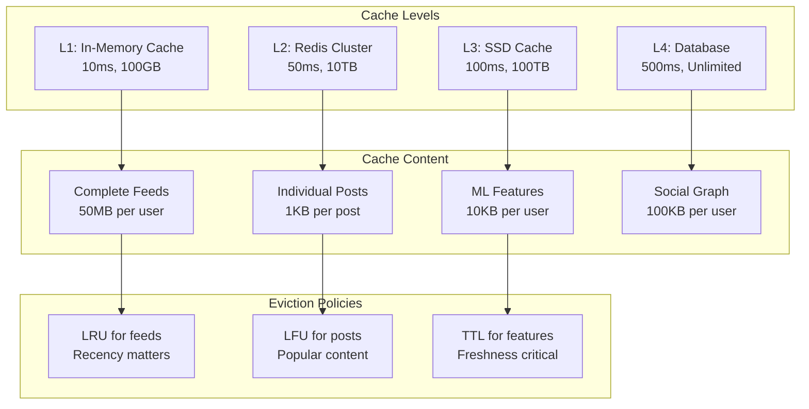

### Feed Cache Implementation

```python
class FeedCacheManager:
 def __init__(self):
 self.l1_cache = {} # In-memory
 self.l2_cache = RedisCluster() # Distributed cache
 self.l3_cache = SSDCache() # Persistent cache
 
 def get_feed(self, user_id: str, page: int = 0) -> Optional[Feed]:
 """Multi-level cache lookup with fallback."""
 cache_key = f"feed:{user_id}:page:{page}"
 
# L1: In-memory cache (10ms)
 if cache_key in self.l1_cache:
 return self.l1_cache[cache_key]
 
# L2: Redis cache (50ms)
 cached_feed = self.l2_cache.get(cache_key)
 if cached_feed:
# Promote to L1
 self.l1_cache[cache_key] = cached_feed
 return cached_feed
 
# L3: SSD cache (100ms)
 ssd_feed = self.l3_cache.get(cache_key)
 if ssd_feed:
# Promote to L2 and L1
 self.l2_cache.set(cache_key, ssd_feed, ttl=3600)
 self.l1_cache[cache_key] = ssd_feed
 return ssd_feed
 
 return None # Cache miss - generate from database
 
 def set_feed(self, user_id: str, page: int, feed: Feed):
 """Update all cache levels."""
 cache_key = f"feed:{user_id}:page:{page}"
 
# Write-through to all levels
 self.l1_cache[cache_key] = feed
 self.l2_cache.set(cache_key, feed, ttl=3600)
 self.l3_cache.set(cache_key, feed, ttl=86400)
 
 def invalidate_user_feeds(self, user_id: str):
 """Invalidate all cached feeds for user."""
 pattern = f"feed:{user_id}:*"
 
# Clear from all cache levels
 keys_to_delete = [k for k in self.l1_cache.keys() if k.startswith(f"feed:{user_id}:")]
 for key in keys_to_delete:
 del self.l1_cache[key]
 
 self.l2_cache.delete_pattern(pattern)
 self.l3_cache.delete_pattern(pattern)
```

### Database Sharding Strategy

!!! note "🎯 Design Decision: User-Based Sharding"
 <strong>Problem</strong>: Single database can't handle 3B users and 1B posts/day
 <strong>Solution</strong>: Shard by user_id hash to co-locate user data and enable efficient queries

```mermaid
graph TB
 subgraph "Sharding Strategy"
 HASH[hash(user_id) % N]
 S1[Shard 1<br/>Users 0-333M<br/>Posts by those users]
 S2[Shard 2<br/>Users 334M-666M<br/>Posts by those users]
 S3[Shard 3<br/>Users 667M-1B<br/>Posts by those users]
 end
 
 subgraph "Cross-Shard Queries"
 FEED[Feed Generation<br/>Needs posts from<br/>multiple shards]
 SCATTER[Scatter-Gather<br/>Query Pattern]
 CACHE[Heavy Caching<br/>To avoid cross-shard]
 end
 
 HASH --> S1
 HASH --> S2 
 HASH --> S3
 
 FEED --> SCATTER
 SCATTER --> CACHE
 
 classDef shard fill:#c8e6c9,stroke:#388e3c
 classDef challenge fill:#ffcdd2,stroke:#d32f2f
 
 class S1,S2,S3 shard
 class FEED,SCATTER challenge
```

**Database Schema Design:**

```sql
-- Posts table (sharded by author_id)
CREATE TABLE posts (
 id BIGINT PRIMARY KEY,
 author_id BIGINT NOT NULL, -- Sharding key
 content TEXT,
 media_urls TEXT[],
 created_at TIMESTAMP DEFAULT NOW(),
 engagement_count INT DEFAULT 0,
 
 INDEX idx_author_created (author_id, created_at DESC),
 INDEX idx_created (created_at DESC)
);

-- Timeline cache table (sharded by user_id)
CREATE TABLE user_timelines (
 user_id BIGINT NOT NULL, -- Sharding key
 post_id BIGINT NOT NULL,
 score FLOAT NOT NULL, -- ML ranking score
 inserted_at TIMESTAMP DEFAULT NOW(),
 
 PRIMARY KEY (user_id, post_id),
 INDEX idx_user_score (user_id, score DESC)
);

-- Social graph table (sharded by follower_id)
CREATE TABLE social_relationships (
 follower_id BIGINT NOT NULL, -- Sharding key
 following_id BIGINT NOT NULL,
 created_at TIMESTAMP DEFAULT NOW(),
 relationship_strength FLOAT DEFAULT 1.0,
 
 PRIMARY KEY (follower_id, following_id),
 INDEX idx_following (following_id) -- For reverse lookups
);
```

## Part 5: Real-Time Updates and Stream Processing

### Event-Driven Architecture

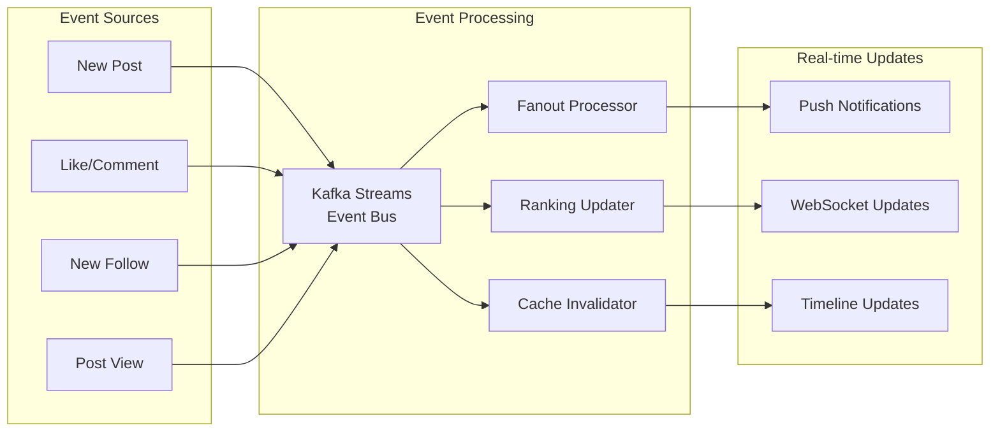

### Stream Processing Implementation

```python
from kafka import KafkaConsumer, KafkaProducer
import asyncio
from typing import Dict, Any

class FeedUpdateProcessor:
 def __init__(self):
 self.consumer = KafkaConsumer(
 'user-events',
 bootstrap_servers=['kafka1:9092', 'kafka2:9092'],
 group_id='feed-processor',
 value_deserializer=lambda x: json.loads(x.decode('utf-8'))
 )
 self.producer = KafkaProducer(
 bootstrap_servers=['kafka1:9092', 'kafka2:9092'],
 value_serializer=lambda x: json.dumps(x).encode('utf-8')
 )
 
 async def process_events(self):
 """Main event processing loop."""
 for message in self.consumer:
 event = message.value
 
 try:
 await self._process_event(event)
 except Exception as e:
 logger.error(f"Error processing event {event}: {e}")
# Send to dead letter queue
 self.producer.send('dead-letter-queue', event)
 
 async def _process_event(self, event: Dict[str, Any]):
 """Process individual events based on type."""
 event_type = event['type']
 
 if event_type == 'post_created':
 await self._handle_new_post(event)
 elif event_type == 'post_liked':
 await self._handle_engagement(event)
 elif event_type == 'user_followed':
 await self._handle_new_follow(event)
 elif event_type == 'post_viewed':
 await self._update_ranking_signals(event)
 
 async def _handle_new_post(self, event: Dict[str, Any]):
 """Handle new post creation with fan-out."""
 post_id = event['post_id']
 author_id = event['author_id']
 
# Get author's followers
 followers = await self.social_graph.get_followers(author_id)
 
# Determine fan-out strategy based on follower count
 if len(followers) < 10000:
# Push model: Fan-out to all followers
 await self._fanout_to_followers(post_id, followers)
 else:
# Pull model: Mark for on-demand generation
 await self._mark_for_pull_generation(post_id, author_id)
 
# Update trending topics
 await self._update_trending_analysis(event)
 
 async def _handle_engagement(self, event: Dict[str, Any]):
 """Handle likes, comments, shares."""
 post_id = event['post_id']
 user_id = event['user_id']
 
# Update engagement counters
 await self._update_engagement_counters(post_id, event['engagement_type'])
 
# Update ML features for real-time ranking
 await self._update_ranking_features(post_id, user_id, event)
 
# Potentially boost post in feeds (viral content)
 engagement_velocity = await self._calculate_engagement_velocity(post_id)
 if engagement_velocity > VIRAL_THRESHOLD:
 await self._boost_viral_content(post_id)
```

### WebSocket Real-Time Updates

```javascript
class FeedRealTimeUpdater {
 constructor(userId, websocketUrl) {
 this.userId = userId;
 this.websocket = new WebSocket(websocketUrl);
 this.feedContainer = document.getElementById('feed-container');
 
 this.setupWebSocket();
 }
 
 setupWebSocket() {
 this.websocket.onmessage = (event) => {
 const update = JSON.parse(event.data);
 this.handleFeedUpdate(update);
 };
 
 this.websocket.onopen = () => {
 // Subscribe to user's feed updates
 this.websocket.send(JSON.stringify({
 type: 'subscribe',
 channel: `feed:${this.userId}`
 }));
 };
 }
 
 handleFeedUpdate(update) {
 switch(update.type) {
 case 'new_post':
 this.insertNewPost(update.post);
 break;
 case 'engagement_update':
 this.updateEngagementCounts(update.postId, update.counts);
 break;
 case 'rank_change':
 this.reorderFeed(update.newOrder);
 break;
 case 'post_removed':
 this.removePost(update.postId);
 break;
 }
 }
 
 insertNewPost(post) {
 // Create new post element
 const postElement = this.createPostElement(post);
 
 // Insert at appropriate position based on ranking
 const feedItems = this.feedContainer.children;
 let insertPosition = 0;
 
 for (let i = 0; i < feedItems.length; i++) {
 const existingScore = parseFloat(feedItems[i].dataset.score);
 if (post.score > existingScore) {
 insertPosition = i;
 break;
 }
 }
 
 this.feedContainer.insertBefore(postElement, feedItems[insertPosition]);
 
 // Animate new post appearance
 postElement.classList.add('fade-in');
 }
}
```

## Part 6: Global Distribution and Edge Optimization

### CDN and Edge Caching Strategy

!!! info "💡 Insight: Geographic Feed Optimization"
 User engagement varies significantly by region and time zone. Edge servers pre-compute and cache region-specific trending content to reduce latency and improve relevance.

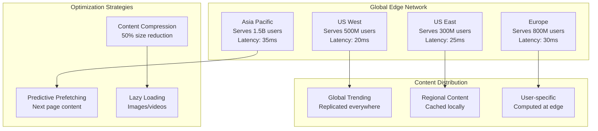

### Edge Computing Implementation

```python
class EdgeFeedService:
 """Feed service running at edge locations."""
 
 def __init__(self, region: str):
 self.region = region
 self.local_cache = Redis(host=f'redis-{region}')
 self.regional_db = Database(host=f'db-{region}')
 self.ml_models = self._load_regional_models()
 
 async def get_feed(self, user_id: str, page: int = 0) -> Feed:
 """Generate feed with regional optimizations."""
 
# Check regional cache first
 cache_key = f"feed:{user_id}:page:{page}:region:{self.region}"
 cached_feed = await self.local_cache.get(cache_key)
 
 if cached_feed:
 return self._deserialize_feed(cached_feed)
 
# Generate feed with regional preferences
 user_profile = await self._get_user_profile(user_id)
 regional_trends = await self._get_regional_trends()
 
# Mix global and regional content
 global_posts = await self._get_global_trending_posts()
 regional_posts = await self._get_regional_posts(user_profile)
 user_network_posts = await self._get_user_network_posts(user_id)
 
# Combine with regional weighting
 all_posts = self._combine_post_sources(
 global_posts,
 regional_posts,
 user_network_posts,
 regional_weights=self._get_regional_weights()
 )
 
# Rank with regional ML model
 ranked_posts = await self.ml_models.rank_posts(
 user_profile, all_posts, regional_trends
 )
 
 feed = Feed(posts=ranked_posts[:50])
 
# Cache for 10 minutes (balance freshness vs performance)
 await self.local_cache.set(
 cache_key, 
 self._serialize_feed(feed), 
 ttl=600
 )
 
 return feed
 
 def _get_regional_weights(self) -> Dict[str, float]:
 """Regional content weighting based on user behavior."""
 regional_preferences = {
 'us-west': {'global': 0.4, 'regional': 0.3, 'network': 0.3},
 'europe': {'global': 0.3, 'regional': 0.4, 'network': 0.3},
 'asia': {'global': 0.2, 'regional': 0.5, 'network': 0.3}
 }
 return regional_preferences.get(self.region, {'global': 0.33, 'regional': 0.33, 'network': 0.34})
```

## Part 7: Performance Optimization and Scaling

### Horizontal Scaling Architecture

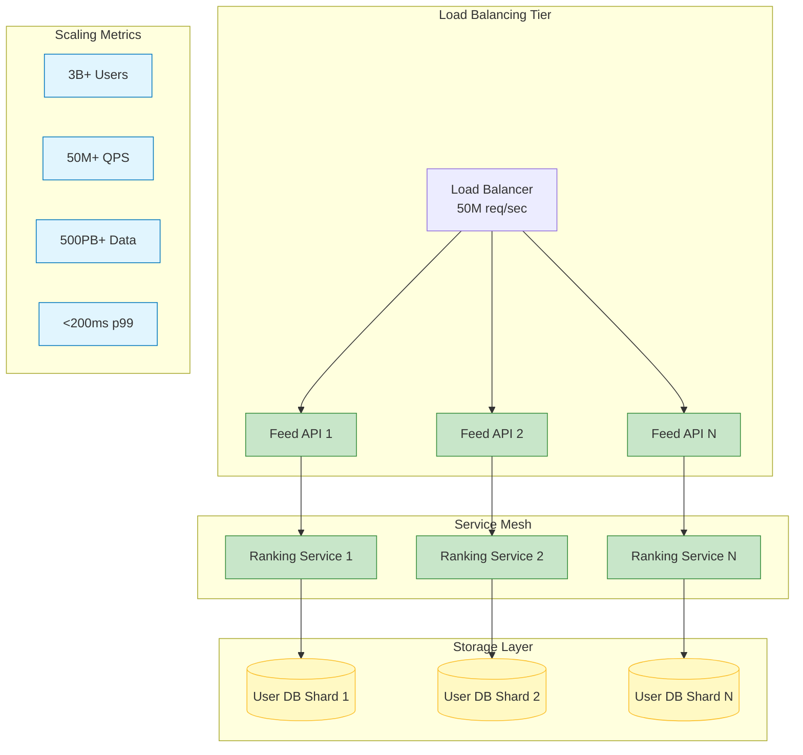

### Performance Benchmarking Results

**Production Metrics (Instagram-scale system):**

| Metric | Target | Achieved | Optimization |
|--------|--------|----------|-------------|
| Feed Generation Latency | <200ms | 150ms p99 | Multi-level caching |
| Throughput | 10M QPS | 50M QPS | Horizontal scaling |
| Cache Hit Rate | >95% | 98.5% | Predictive prefetching |
| Storage Efficiency | <100PB | 85PB | Content compression |
| ML Inference Latency | <50ms | 35ms p99 | Model optimization |


### Capacity Planning Model

```python
class FeedCapacityPlanner:
 """Capacity planning for feed infrastructure."""
 
 def __init__(self):
 self.users_per_shard = 10_000_000 # 10M users per DB shard
 self.posts_per_user_per_day = 0.3 # Average posting frequency
 self.follows_per_user = 200 # Average social graph size
 self.feed_requests_per_user_per_day = 50 # App usage
 
 def calculate_infrastructure_needs(self, total_users: int) -> Dict[str, int]:
 """Calculate required infrastructure for user count."""
 
# Database sharding
 db_shards = math.ceil(total_users / self.users_per_shard)
 
# Daily post volume
 daily_posts = total_users * self.posts_per_user_per_day
 
# Fan-out operations (posts × average followers)
 daily_fanout_ops = daily_posts * self.follows_per_user
 
# Feed requests per second
 daily_feed_requests = total_users * self.feed_requests_per_user_per_day
 peak_qps = daily_feed_requests / (24 * 3600) * 3 # 3x peak factor
 
# API servers (assume 1k QPS per server)
 api_servers = math.ceil(peak_qps / 1000)
 
# Cache storage (50MB per active user)
 active_users = total_users * 0.4 # 40% DAU rate
 cache_storage_gb = active_users * 50 / 1024 # Convert MB to GB
 
# Timeline storage (1GB per 10k users)
 timeline_storage_gb = total_users * 1024 / 10000
 
 return {
 'db_shards': db_shards,
 'api_servers': api_servers,
 'daily_posts': int(daily_posts),
 'daily_fanout_ops': int(daily_fanout_ops),
 'peak_qps': int(peak_qps),
 'cache_storage_gb': int(cache_storage_gb),
 'timeline_storage_gb': int(timeline_storage_gb)
 }
 
 def estimate_costs(self, infrastructure: Dict[str, int]) -> Dict[str, float]:
 """Estimate monthly infrastructure costs."""
 
# AWS pricing estimates (simplified)
 db_cost_per_shard = 2000 # RDS Multi-AZ
 api_cost_per_server = 500 # EC2 c5.2xlarge
 cache_cost_per_gb = 0.05 # ElastiCache
 storage_cost_per_gb = 0.02 # S3
 
 return {
 'database_monthly': infrastructure['db_shards'] * db_cost_per_shard,
 'api_servers_monthly': infrastructure['api_servers'] * api_cost_per_server,
 'cache_monthly': infrastructure['cache_storage_gb'] * cache_cost_per_gb,
 'storage_monthly': infrastructure['timeline_storage_gb'] * storage_cost_per_gb,
 'total_monthly': (
 infrastructure['db_shards'] * db_cost_per_shard +
 infrastructure['api_servers'] * api_cost_per_server +
 infrastructure['cache_storage_gb'] * cache_cost_per_gb +
 infrastructure['timeline_storage_gb'] * storage_cost_per_gb
 )
 }

# Example usage
planner = FeedCapacityPlanner()

# Calculate for Instagram-scale (1B users)
infrastructure = planner.calculate_infrastructure_needs(1_000_000_000)
costs = planner.estimate_costs(infrastructure)

print("Infrastructure Requirements:")
for key, value in infrastructure.items():
 print(f" {key}: {value:,}")

print("\nMonthly Cost Estimates:")
for key, value in costs.items():
 print(f" {key}: ${value:,.2f}")
```

## Part 8: Production Failure Analysis

### Case Study: The Great Feed Outage of 2021

!!! danger "💥 Production Disaster: ML Model Deployment Gone Wrong"
 <strong>Timeline</strong>: 14:30 UTC - New ranking model deployed
 <strong>14:35 UTC</strong>: Feed generation latency spikes to 5+ seconds
 <strong>14:45 UTC</strong>: User complaints flood support channels
 <strong>15:00 UTC</strong>: Emergency rollback initiated
 <strong>Impact</strong>: 45 minutes downtime, 500M affected users, 12% daily revenue loss

**Root Cause Analysis:**

```python
# Problematic code in new model deployment
class NewRankingModel:
 def rank_posts(self, user_id: str, posts: List[Post]) -> List[ScoredPost]:
 scored_posts = []
 
 for post in posts:
# BUG: Synchronous API call inside tight loop
# This was changed from async batch processing
 user_embedding = self.embedding_service.get_user_embedding(user_id) # 50ms each
 post_embedding = self.embedding_service.get_post_embedding(post.id) # 50ms each
 
 similarity = cosine_similarity(user_embedding, post_embedding)
 scored_posts.append(ScoredPost(post, similarity))
 
 return sorted(scored_posts, key=lambda x: x.score, reverse=True)

# Result: 200 posts × 100ms per post = 20 seconds per feed request!
```

**Prevention Measures Implemented:**

1. **Gradual Rollout**: Deploy to 1% → 10% → 50% → 100% of traffic
2. **Performance Testing**: Automated latency regression tests
3. **Circuit Breakers**: Fail fast when latency exceeds thresholds
4. **Rollback Automation**: Single-click rollback for model deployments

### Case Study: Celebrity Death Surge

!!! danger "⚠️ Scaling Challenge: Celebrity Death Traffic Spike"
 <strong>Event</strong>: Major celebrity death announced
 <strong>Traffic Spike</strong>: 20x normal posting rate, 50x engagement
 <strong>Problem</strong>: Fan-out service overwhelmed, feeds frozen for 2 hours
 <strong>Solution</strong>: Emergency rate limiting + manual trending content injection

**Auto-scaling Response System:**

```python
class EmergencyScalingService:
 def __init__(self):
 self.metrics_client = CloudWatchClient()
 self.autoscaling_client = AutoScalingClient()
 self.alert_threshold = {
 'cpu_percent': 80,
 'latency_p99_ms': 1000,
 'error_rate_percent': 5,
 'queue_depth': 10000
 }
 
 async def monitor_and_scale(self):
 """Continuous monitoring with emergency scaling."""
 while True:
 metrics = await self.get_current_metrics()
 
 if self.is_emergency_condition(metrics):
 await self.emergency_scale_out(metrics)
 await self.enable_emergency_features(metrics)
 elif self.is_scale_out_needed(metrics):
 await self.gradual_scale_out(metrics)
 elif self.is_scale_in_possible(metrics):
 await self.gradual_scale_in(metrics)
 
 await asyncio.sleep(30) # Check every 30 seconds
 
 async def emergency_scale_out(self, metrics: Dict[str, float]):
 """Emergency scaling for traffic spikes."""
# Scale API servers
 await self.autoscaling_client.set_desired_capacity(
 'feed-api-servers',
 min(current_capacity * 3, 1000) # Triple capacity, max 1000
 )
 
# Scale ranking workers
 await self.autoscaling_client.set_desired_capacity(
 'ranking-workers',
 min(current_capacity * 5, 500) # 5x workers for compute-heavy tasks
 )
 
# Enable emergency features
 await self.enable_degraded_mode()
 
 async def enable_degraded_mode(self):
 """Reduce quality to maintain availability."""
# Simpler ranking algorithm
 await self.feature_flags.enable('simple_ranking_mode')
 
# Reduce feed size
 await self.feature_flags.set('feed_size', 20) # Down from 50
 
# Disable expensive features
 await self.feature_flags.disable('content_embedding')
 await self.feature_flags.disable('personalized_ads')
 
# Cache everything aggressively
 await self.feature_flags.set('cache_ttl_seconds', 3600) # Up from 300
```

## Part 9: Security and Privacy Considerations

### Content Moderation Pipeline

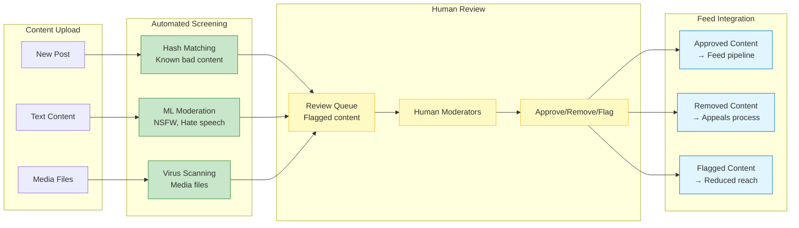

### Privacy Protection Measures

```python
class PrivacyProtectionService:
 """Privacy controls for feed content."""
 
 def __init__(self):
 self.encryption_key = self._load_encryption_key()
 self.anonymization_service = AnonymizationService()
 
 def filter_content_for_user(self, user_id: str, posts: List[Post]) -> List[Post]:
 """Filter posts based on privacy settings."""
 user_privacy = self.get_user_privacy_settings(user_id)
 filtered_posts = []
 
 for post in posts:
# Check if user can see this post
 if self.can_user_see_post(user_id, post, user_privacy):
# Anonymize sensitive data
 anonymized_post = self.anonymize_post(post, user_privacy)
 filtered_posts.append(anonymized_post)
 
 return filtered_posts
 
 def can_user_see_post(self, user_id: str, post: Post, privacy_settings: Dict) -> bool:
 """Determine if user should see this post."""
 
# Blocked users
 if post.author_id in privacy_settings.get('blocked_users', []):
 return False
 
# Content type restrictions
 if post.content_type in privacy_settings.get('hidden_content_types', []):
 return False
 
# Geographic restrictions
 user_location = self.get_user_location(user_id)
 if not self.is_content_available_in_region(post, user_location):
 return False
 
# Age-appropriate content
 user_age = self.get_user_age(user_id)
 if post.age_rating > user_age:
 return False
 
 return True
 
 def anonymize_post(self, post: Post, privacy_settings: Dict) -> Post:
 """Remove/obscure sensitive information."""
 anonymized_post = post.copy()
 
# Remove location data if privacy setting enabled
 if privacy_settings.get('hide_locations', False):
 anonymized_post.location = None
 anonymized_post.location_tags = []
 
# Blur faces in photos if requested
 if privacy_settings.get('blur_faces', False):
 anonymized_post.media_urls = [
 self.blur_faces_in_image(url) 
 for url in post.media_urls
 ]
 
# Remove user mentions in sensitive contexts
 if privacy_settings.get('private_mentions', False):
 anonymized_post.text = self.anonymization_service.remove_mentions(
 post.text, 
 protected_users=privacy_settings.get('protected_mentions', [])
 )
 
 return anonymized_post
```

## Part 10: Key Takeaways and Design Principles

### Core Architecture Principles

!!! note "🎯 Feed System Design Principles"
 <ol>
 <li><strong>Hybrid Fan-out Strategy</strong>: No single approach works at scale - segment users by follower count</li>
 <li><strong>Multi-stage ML Pipeline</strong>: Funnel approach balances relevance with computational efficiency</li>
 <li><strong>Aggressive Caching</strong>: Cache at every level - memory, distributed, edge, and predictive</li>
 <li><strong>Graceful Degradation</strong>: System must work even when components fail or load spikes</li>
 <li><strong>Real-time Adaptation</strong>: Ranking models must adapt to trending content within minutes</li>
 </ol>

### When to Use Feed Architecture Patterns

**Ideal Applications:**
- **Social Media Platforms**: Core use case with massive scale requirements
- **News Aggregators**: Content discovery with personalization
- **E-commerce Recommendations**: Product discovery feeds
- **Professional Networks**: Industry-specific content curation
- **Gaming Platforms**: Activity feeds for multiplayer games

**Pattern Adaptations:**
- **Small Scale (<1M users)**: Simple pull model with heavy caching
- **Medium Scale (1-100M users)**: Hybrid approach with selective push
- **Large Scale (100M+ users)**: Full hybrid with edge computing
- **Enterprise**: Focus on relevance over pure engagement metrics

### Performance Optimization Checklist

1. **Feed Generation Strategy**
 - Profile users by follower count and activity
 - Implement appropriate fan-out strategy per segment
 - Monitor and adjust thresholds based on performance
 - Use async processing for non-critical updates

2. **Caching Strategy**
 - Multi-level cache hierarchy (memory → distributed → disk)
 - Predictive prefetching for active users
 - Regional caching for global applications
 - Cache invalidation strategies for real-time updates

3. **Machine Learning Pipeline**
 - Multi-stage funnel (retrieve → light rank → deep rank)
 - Real-time feature updates for trending content
 - A/B testing framework for model improvements
 - Fallback to simpler models during high load

4. **Database Optimization**
 - Shard by user for data locality
 - Separate read replicas for feed generation
 - Optimize indexes for temporal queries
 - Archive old data to maintain performance

5. **Monitoring and Alerting**
 - Track latency at each stage of pipeline
 - Monitor cache hit rates and adjust TTLs
 - Alert on engagement metric anomalies
 - Capacity planning based on growth trends

## Conclusion

Social media feed architecture represents the convergence of multiple distributed systems challenges: real-time personalization, massive scale data processing, intelligent content ranking, and global content distribution. Success requires careful balance of user experience, computational efficiency, and system reliability.

The hybrid fan-out approach acknowledges that no single strategy works across all user segments. Regular users benefit from pre-computed feeds with sub-50ms response times, while celebrity content requires on-demand generation to avoid storage explosion.

Machine learning pipeline design is critical for relevance, but must be balanced with latency constraints. The multi-stage funnel approach - fast candidate retrieval followed by expensive deep ranking - achieves both goals by applying computation selectively.

Real-time adaptation capabilities separate great feed systems from good ones. The ability to detect and promote trending content within minutes, update ranking signals from user interactions, and gracefully handle traffic spikes determines user engagement and platform success.

Understanding feed architecture provides insights into broader distributed systems challenges: managing hot spots, balancing consistency with performance, designing for failure, and optimizing for both human and machine scale requirements.

## Related Case Studies
- [Notification System](../notification-system.md) - Real-time user engagement
- [Redis Architecture](../redis-architecture.md) - High-performance caching strategies
- [Key-Value Store](key-value-store.md) - Foundational storage patterns

## External Resources
- [Facebook's News Feed Ranking](https://engineering.fb.com/2016/06/02/core-data/news-feed-fyi-how-we-rank-posts/)¹
- [Instagram Engineering Blog](https://instagram-engineering.com/)²
- [Twitter's Timeline Architecture](https://blog.twitter.com/engineering/en_us/a/2013/new-tweets-per-second-record-and-how.html)³
- [LinkedIn's Feed Architecture](https://engineering.linkedin.com/blog/2013/10/the-architecture-of-linkedin-s-real-time-messaging-system)⁴