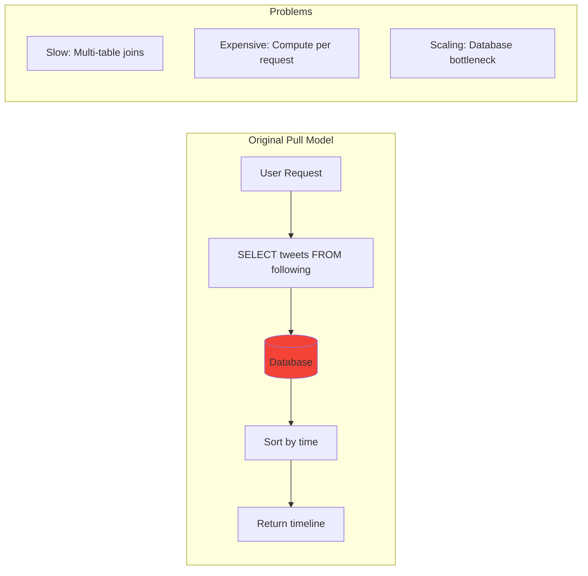
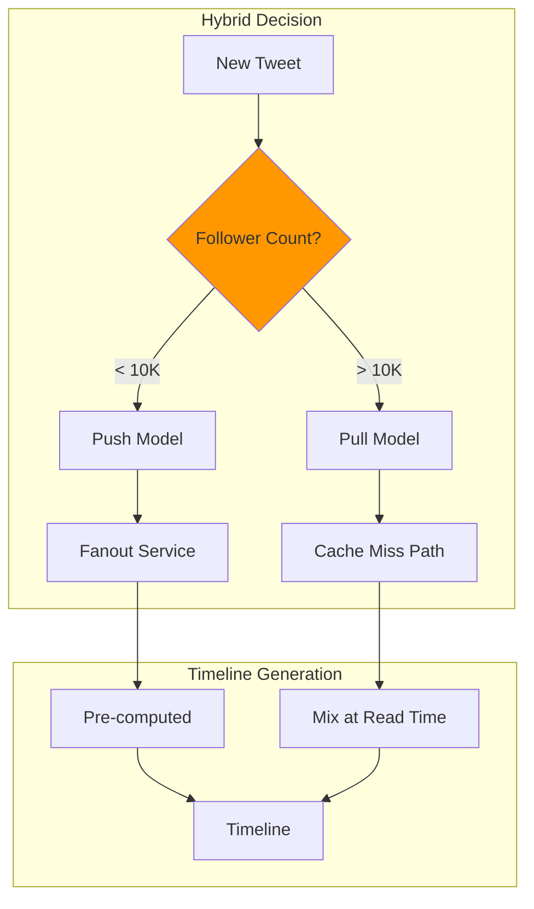
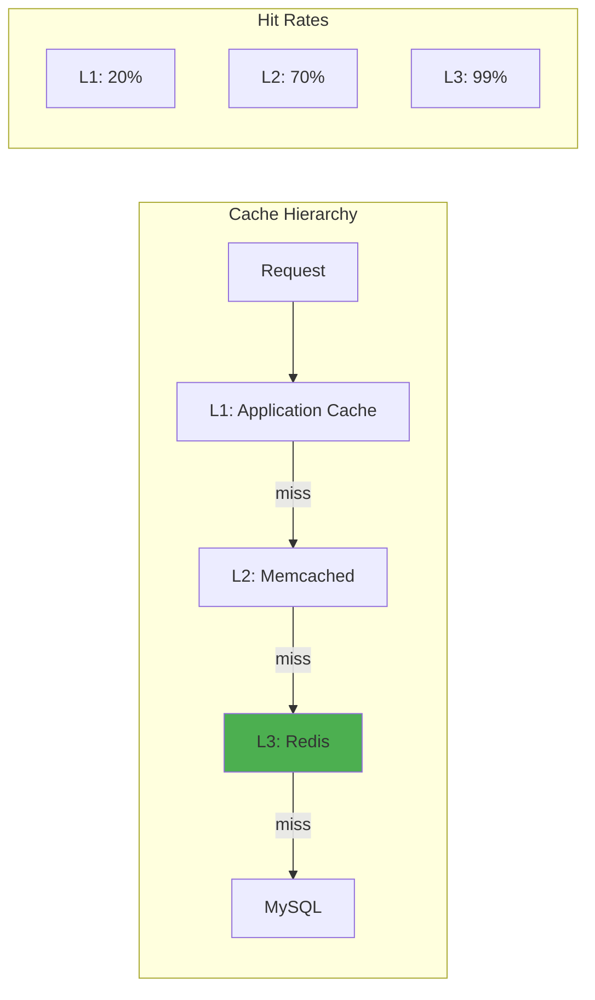
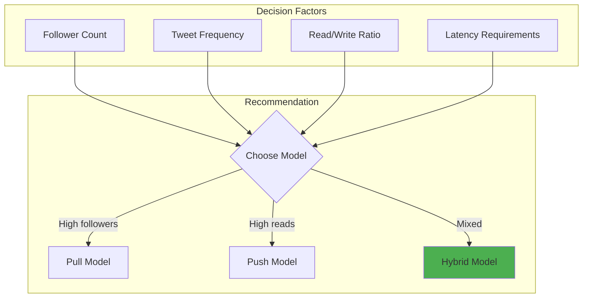

# Twitter Timeline: Scaling the Home Timeline

## Table of Contents

- [Executive Summary](#executive-summary)
- [The Evolution](#the-evolution)
  - [Phase 1: Pull Model (2006-2010)](#phase-1-pull-model-2006-2010)
  - [Phase 2: Push Model (2010-2012)](#phase-2-push-model-2010-2012)
  - [Phase 3: Hybrid Model (2012-Present)](#phase-3-hybrid-model-2012-present)
- [Architecture Deep Dive](#architecture-deep-dive)
  - [Core Components](#core-components)
  - [Timeline Storage Structure](#timeline-storage-structure)
  - [Fanout Process](#fanout-process)
- [Performance Optimizations](#performance-optimizations)
  - [Multi-Level Caching](#multi-level-caching)
  - [Write Amplification Analysis](#write-amplification-analysis)
  - [Optimization Techniques](#optimization-techniques)
- [Challenges and Solutions](#challenges-and-solutions)
  - [Challenge 1: Celebrity Tweet Storms](#challenge-1-celebrity-tweet-storms)
  - [Challenge 2: Thundering Herd](#challenge-2-thundering-herd)
- [Trade-off Analysis](#trade-off-analysis)
  - [Push vs Pull vs Hybrid](#push-vs-pull-vs-hybrid)
  - [Decision Matrix](#decision-matrix)
- [Lessons Learned](#lessons-learned)
  - [Key Insights](#key-insights)
  - [What Worked](#what-worked)
  - [What Didn't Work](#what-didnt-work)
- [Implementation Guide](#implementation-guide)
  - [For Your Application](#for-your-application)
  - [Monitoring Metrics](#monitoring-metrics)
- [Related Resources](#related-resources)


!!! success "Excellence Badge"
    🥈 **Silver Tier**: Proven patterns with careful trade-off management

!!! abstract "Quick Facts"
    | Metric | Value |
    |--------|-------|
    | **Scale** | 200M+ daily active users |
    | **Tweet Volume** | 500M+ tweets/day |
    | **Peak Load** | 140K tweets/second |
    | **Timeline Requests** | 2B+ per day |
    | **Response Time** | <100ms p99 |

## Executive Summary

Twitter's home timeline—showing tweets from people you follow—seems simple but represents one of the most challenging scaling problems in social media. Twitter evolved from a pull-based model that couldn't scale to a sophisticated hybrid push/pull architecture that pre-computes timelines for fast delivery while handling celebrities with millions of followers. This case study examines their journey and the trade-offs made.

## The Evolution

### Phase 1: Pull Model (2006-2010)



### Phase 2: Push Model (2010-2012)

```mermaid
graph TB
    subgraph "Fanout on Write"
        T[New Tweet] --> F[Fanout Service]
        F --> T1[Timeline 1]
        F --> T2[Timeline 2]
        F --> TN[Timeline N]
        
        T1 --> R1[Redis 1]
        T2 --> R2[Redis 2]
        TN --> RN[Redis N]
    end
    
    subgraph "Benefits"
        B1[Fast reads: O(1)]
        B2[Simple queries]
        B3[Predictable latency]
    end
    
    style F fill:#4caf50
```

### Phase 3: Hybrid Model (2012-Present)



## Architecture Deep Dive

### Core Components

| Component | Purpose | Technology | Scale |
|-----------|---------|------------|--------|
| **Timeline Service** | Serves home timelines | Scala/Finagle | 1000s of servers |
| **Fanout Service** | Distributes tweets | Ruby/Scala | 100s of servers |
| **Redis Clusters** | Timeline storage | Redis | 10000s of instances |
| **MySQL** | Tweet/user data | MySQL/Gizzard | 100s of shards |
| **Cache Layer** | Hot data | Memcached | 1000s of nodes |

### Timeline Storage Structure

```python
class TimelineStorage:
    def __init__(self):
        self.redis = RedisCluster()
        self.TIMELINE_SIZE = 800  # tweets
        self.TTL = 30 * 24 * 3600  # 30 days
    
    def add_tweet_to_timeline(self, user_id, tweet_id, timestamp):
        key = f"timeline:{user_id}"
        
        # Add to sorted set (score = timestamp)
        self.redis.zadd(key, {tweet_id: timestamp})
        
        # Trim to bounded size
        self.redis.zremrangebyrank(key, 0, -self.TIMELINE_SIZE-1)
        
        # Set TTL
        self.redis.expire(key, self.TTL)
    
    def get_timeline(self, user_id, count=200):
        key = f"timeline:{user_id}"
        # Get most recent tweets
        tweet_ids = self.redis.zrevrange(key, 0, count-1)
        return self.hydrate_tweets(tweet_ids)
```

### Fanout Process

=== "Regular User Fanout"
    ```python
    class FanoutService:
        def fanout_tweet(self, tweet):
            # Get followers
            followers = self.get_followers(tweet.user_id)
            
            # Batch fanout for efficiency
            for batch in chunks(followers, 1000):
                self.queue.push(FanoutJob(
                    tweet_id=tweet.id,
                    follower_ids=batch,
                    priority='normal'
                ))
        
        def process_fanout_job(self, job):
            # Parallel writes to Redis
            with ThreadPool(max_workers=10) as pool:
                pool.map(
                    lambda f: self.add_to_timeline(f, job.tweet_id),
                    job.follower_ids
                )
    ```

=== "Celebrity Handling"
    ```python
    class HybridTimeline:
        CELEBRITY_THRESHOLD = 10000
        
        def should_fanout(self, user):
            return user.follower_count < self.CELEBRITY_THRESHOLD
        
        def get_timeline(self, user_id):
            # Get pre-computed timeline
            timeline = self.redis.get_timeline(user_id)
            
            # Mix in celebrity tweets at read time
            celebrity_follows = self.get_celebrity_follows(user_id)
            if celebrity_follows:
                recent_celebrity_tweets = self.pull_celebrity_tweets(
                    celebrity_follows,
                    since=datetime.now() - timedelta(hours=24)
                )
                timeline = self.merge_timelines(
                    timeline,
                    recent_celebrity_tweets
                )
            
            return timeline[:200]  # Return top 200
    ```

=== "Timeline Mixing"
    ```python
    def merge_timelines(self, precomputed, realtime):
        # Merge and sort by timestamp
        merged = []
        i, j = 0, 0
        
        while i < len(precomputed) and j < len(realtime):
            if precomputed[i].timestamp > realtime[j].timestamp:
                merged.append(precomputed[i])
                i += 1
            else:
                merged.append(realtime[j])
                j += 1
        
        # Add remaining
        merged.extend(precomputed[i:])
        merged.extend(realtime[j:])
        
        return merged
    ```

## Performance Optimizations

### Multi-Level Caching



### Write Amplification Analysis

| User Type | Followers | Write Amplification | Storage Cost |
|-----------|-----------|--------------------|--------------|
| **Regular** | 100 | 100x | 800 bytes/tweet |
| **Power User** | 1K | 1,000x | 8 KB/tweet |
| **Minor Celebrity** | 10K | 10,000x | 80 KB/tweet |
| **Major Celebrity** | 1M+ | 0x (pull model) | 0 bytes |

### Optimization Techniques

1. **Bounded Timelines**
   ```python
   # Only store most recent 800 tweets
   TIMELINE_SIZE = 800
   # Covers 99% of users' reading patterns
   ```

2. **Intelligent Fanout**
   ```python
   def should_fanout_to_user(follower):
       # Skip inactive users
       if follower.last_active < 30.days.ago:
           return False
       # Skip users who never check timeline
       if follower.timeline_views_per_month < 1:
           return False
       return True
   ```

3. **Batch Processing**
   ```python
   # Batch timeline updates
   BATCH_SIZE = 1000
   BATCH_TIMEOUT = 100  # ms
   ```

## Challenges and Solutions

### Challenge 1: Celebrity Tweet Storms

**Problem**: Celebrity tweeting 100 times during an event

**Solution**: Rate limiting and sampling
```python
def handle_celebrity_timeline(celebrity_id, follower_id):
    # Only show top tweets by engagement
    all_tweets = self.get_celebrity_tweets(celebrity_id, hours=24)
    
    # Sample based on engagement
    top_tweets = sorted(all_tweets, key=lambda t: t.engagement_score)[:10]
    
    return top_tweets
```

### Challenge 2: Thundering Herd

**Problem**: Everyone refreshing during major events

**Solution**: Staggered updates and caching
```python
def get_timeline_with_jitter(user_id):
    # Add random jitter to prevent stampedes
    cache_key = f"timeline:{user_id}"
    ttl = 60 + random.randint(-10, 10)  # 50-70 seconds
    
    return cache.get_or_set(
        cache_key,
        lambda: self.build_timeline(user_id),
        ttl=ttl
    )
```

## Trade-off Analysis

### Push vs Pull vs Hybrid

| Approach | Read Latency | Write Cost | Storage | Best For |
|----------|--------------|------------|---------|----------|
| **Pull** | High (100s ms) | Low | Low | Few followers |
| **Push** | Low (10s ms) | High | High | Most users |
| **Hybrid** | Low | Medium | Medium | Mixed platform |

### Decision Matrix



## Lessons Learned

### Key Insights

!!! tip "Timeline Architecture Lessons"
    1. **No silver bullet** - Different users need different strategies
    2. **Pre-computation wins** - Trade storage for latency
    3. **Bound everything** - Infinite timelines don't scale
    4. **Cache aggressively** - Most users read recent tweets
    5. **Plan for celebrities** - They break normal assumptions

### What Worked

✅ **Successes**
- Hybrid model balances trade-offs well
- Redis perfect for timeline storage
- Fanout service scales horizontally
- Bounded timelines control costs

### What Didn't Work

❌ **Failures**
- Pure pull model couldn't scale
- Unbounded push too expensive
- Synchronous fanout caused delays
- Cache stampedes during events

## Implementation Guide

### For Your Application

1. **Start with pull model**
   - Simple to implement
   - Works for small scale
   - Easy to reason about

2. **Add push selectively**
   ```python
   if user.read_write_ratio > 10:
       enable_push_model(user)
   ```

3. **Implement bounds early**
   - Timeline size limits
   - Fanout limits
   - Rate limits

### Monitoring Metrics

- [ ] Timeline generation latency
- [ ] Fanout queue depth
- [ ] Redis memory usage
- [ ] Cache hit rates
- [ ] Celebrity tweet impact
- [ ] Read/write ratios
- [ ] Storage growth rate

## Related Resources

- [Fanout Pattern](../pattern-library/fanout.md)
- [Cache-aside Pattern](../scaling/caching-strategies.md)
- [Sharding Pattern](../pattern-library/scaling/sharding.md)
- [Twitter Engineering Blog](https://blog.twitter.com/engineering/)

---

*"The timeline is Twitter's most important product, and scaling it is our biggest challenge." - Twitter Engineering*
