# Blameless Postmortems

**Learning from failures without finger-pointing (Law 6: Human-API 🤯)**

> *"We seek to understand not who failed, but how the system allowed failure to occur - recognizing that human error often stems from cognitive overload."*

---

## What is a Blameless Postmortem?

Structured incident review focusing on systemic issues, not individual blame. Goal: learn and improve.

## Key Principles (Aligned with Law 6: Human-API)

### 1. Systems Thinking
- Focus on how system allowed error
- Look for contributing factors beyond individual capacity
- Recognize cognitive overload as a system failure

### 2. Psychological Safety
- Safe to share mistakes without blame
- Honest discussion → improvements
- Cognitive capacity drops 80% under stress - plan for it

### 3. Learning Culture
- Every incident = learning opportunity (Law 1: Failure)
- Share knowledge widely to distribute cognitive load (Law 5: Epistemology)
- Document learnings to offload from working memory

## Postmortem Process Decision Tree

```mermaid
flowchart TD
    A[Incident Resolved] --> B{Postmortem Required?}
    
    B -->|Customer Impact| C[Full Postmortem]
    B -->|SEV-1/2| C
    B -->|Data Loss| C
    B -->|Learning Value| D[Lightweight Postmortem]
    B -->|No Impact| E[Document Only]
    
    C --> F[Schedule Meeting<br/>Within 48 hours]
    F --> G[Prepare Data<br/>• Timeline<br/>• Metrics<br/>• Logs]
    G --> H[Conduct Meeting<br/>• Blameless focus<br/>• System issues<br/>• Learning]
    H --> I[Action Items<br/>• Owner assigned<br/>• Due dates<br/>• Priority]
    I --> J[Share Widely<br/>• Wiki/Confluence<br/>• Team channels<br/>• Company blog]
    
    D --> K[Async Review<br/>• Document findings<br/>• Quick actions<br/>• Share summary]
    
    E --> L[Update KB<br/>• Add to runbook<br/>• Tag for search]
    
    style C fill:#ffcdd2
    style D fill:#fff9c4
    style E fill:#c8e6c9
    style J fill:#e1bee7
```



## Postmortem Timeline Visualization Template

```mermaid
timeline
    title Production Incident Timeline Example
    
    section Detection Phase
        14:32 : 🚨 Alert triggered
                : Error rate spike to 15%
                : PagerDuty fired
        
        14:35 : 👤 On-call acknowledged
                : Initial assessment started
                : Slack channel created
    
    section Investigation Phase  
        14:40 : 🔍 Investigation began
                : Checked recent deployments
                : Analyzed error logs
        
        14:45 : 📊 Metrics correlation
                : Memory usage anomaly found
                : Database connection exhaustion
    
    section Resolution Phase
        14:52 : 💡 Root cause identified
                : Memory leak in v2.5.0
                : Payment validation issue
        
        15:10 : 🔧 Fix deployed
                : Rolled back to v2.4.9
                : Monitoring intensified
    
    section Recovery Phase
        15:25 : ✅ System normal
                : Error rate < 0.1%
                : Performance restored
```

## Postmortem Process

### 1. Incident Timeline
```markdown
## Timeline
- 14:32 - Alert fired for high error rate
- 14:35 - On-call engineer acknowledged
- 14:40 - Initial investigation began
- 14:52 - Root cause identified
- 15:10 - Fix deployed
- 15:25 - System returned to normal
```

### 2. The Five Whys
```text
Problem: Service outage lasted 53 minutes

Why? → The service ran out of memory
Why? → Memory leak in new feature
Why? → Missing memory profiling in testing
Why? → No automated memory testing in CI
Why? → Performance testing not prioritized
```

### 3. Contributing Factors
- Technical factors (code, infrastructure)
- Process factors (testing, deployment)
- Communication factors (alerts, escalation)
- Documentation factors (runbooks, knowledge)

## Postmortem Template

```markdown
# Incident Postmortem: [Title]

## Incident Summary
- **Date**:
- **Duration**:
- **Impact**:
- **Severity**:

## What Happened?
[Narrative description of the incident]

## Timeline
[Detailed timeline with timestamps]

## What Went Well
- Quick detection
- Effective communication
- Rapid remediation

## What Could Be Improved
- Earlier detection mechanisms
- Clearer runbook procedures
- Better testing coverage

## Action Items
| Action | Owner | Due Date | Status |
|--------|-------|----------|---------|
| Add memory monitoring | SRE Team | 2024-02-01 | In Progress |
| Update testing suite | Dev Team | 2024-02-15 | Not Started |


## Lessons Learned
[Key takeaways for the organization]
```

## Common Anti-Patterns

### 1. The Blame Game
❌ "John pushed bad code"
✅ "Our review process didn't catch the issue"

### 2. Single Root Cause
❌ "The database query was the root cause"
✅ "Multiple factors contributed: query optimization, lack of caching, missing alerts"

### 3. Individual Action Items
❌ "Sarah needs to be more careful"
✅ "We need automated checks to prevent this class of error"

## Creating Psychological Safety

1. **Leadership Example**: Leaders share mistakes
2. **No Punishment**: Honest mistakes unpunished
3. **Focus on Systems**: "How did system allow this?"
4. **Celebrate Learning**: Reward thorough postmortems

## Postmortem Metrics

- Time to complete
- Action items generated
- Action completion rate
- Repeat incident rate
- Team participation

## Tools and Automation

```python
class PostmortemAutomation:
    """Automate postmortem data collection"""

    def collect_incident_data(self, incident_id):
        return {
            'alerts': self.get_alert_history(incident_id),
            'deployments': self.get_recent_deployments(),
            'logs': self.get_relevant_logs(incident_id),
            'metrics': self.get_metric_snapshots(incident_id),
            'communications': self.get_slack_history(incident_id)
        }

    def generate_timeline(self, incident_data):
        """Auto-generate timeline from various sources"""
        events = []

# Add alerts
        for alert in incident_data['alerts']:
            events.append({
                'time': alert['timestamp'],
                'event': f"Alert: {alert['name']}",
                'source': 'monitoring'
            })

# Add deployments
        for deploy in incident_data['deployments']:
            events.append({
                'time': deploy['timestamp'],
                'event': f"Deployment: {deploy['service']}",
                'source': 'ci/cd'
            })

# Sort by time
        return sorted(events, key=lambda x: x['time'])
```

## Law Impact Analysis

Understanding how blameless postmortems relate to our fundamental laws:

| Law | Impact on Postmortems | Key Insights |
|-----|----------------------|--------------|
| **Law 2: Asynchronous Reality ⏱️** | Incident detection and response time | Faster detection through better monitoring reduces incident duration |
| **Law 4: Trade-offs 📊** | Resource constraints during incidents | Postmortems reveal capacity planning gaps and resource bottlenecks |
| **Law 1: Failure ⛓️** | Core focus - learning from failures | Every failure is a learning opportunity to build resilience |
| **Law 4: Trade-offs 🔐** | Inconsistent states often cause incidents | Postmortems uncover consistency violations and their impacts |
| **Law 5: Epistemology 🧠** | Incomplete system understanding | Postmortems reveal knowledge gaps and documentation needs |
| **Law 6: Human-API 🤯** | Human errors during incidents | Cognitive overload is a primary cause of operational mistakes |
| **Law 5: Epistemology 🤝** | Coordination failures during response | Poor handoffs and unclear ownership extend incident duration |
| **Law 7: Economics 💰** | Cost of incidents and prevention | Balance incident prevention cost against business impact |


## Postmortem Effectiveness Matrix

Evaluate your postmortem process maturity:

| Aspect | Level 1: Reactive | Level 2: Systematic | Level 3: Learning | Level 4: Predictive |
|--------|-------------------|---------------------|-------------------|---------------------|
| **Focus** | Find who broke it | Find what broke | Understand why it broke | Prevent similar breaks |
| **Participation** | Only on-call | Engineering team | Cross-functional | Organization-wide |
| **Actions** | Quick fixes | Bug fixes + monitoring | Systemic improvements | Architectural changes |
| **Sharing** | Team only | Department | Company-wide | Industry sharing |
| **Metrics** | Incident count | MTTR | Learning velocity | Prevention rate |
| **Culture** | Blame-oriented | Process-oriented | Learning-oriented | Innovation-oriented |


## Decision Framework: When to Conduct a Postmortem


## Contributing Factors Analysis Framework

### The Swiss Cheese Model
```text
┌─────────────┐ ┌─────────────┐ ┌─────────────┐ ┌─────────────┐
│   Process   │ │   Tools     │ │   People    │ │  External   │
│   Failures  │ │  Failures   │ │  Factors    │ │  Factors    │
│      ○      │ │      ○      │ │      ○      │ │      ○      │
│   ○     ○   │ │   ○     ○   │ │   ○     ○   │ │   ○     ○   │
│      ○      │ │      ○      │ │      ○      │ │      ○      │
└─────────────┘ └─────────────┘ └─────────────┘ └─────────────┘
       ↓              ↓              ↓              ↓
    When holes align, incidents occur →→→→→→→ INCIDENT
```

### Factor Categories Table

| Category | Common Factors | Prevention Strategies |
|----------|---------------|----------------------|
| **Technical** | Code bugs, Config errors, Resource limits | Testing, Validation, Monitoring |
| **Process** | Missing reviews, Unclear procedures, Skip steps | Automation, Checklists, Training |
| **Communication** | Handoff failures, Unclear alerts, Missing docs | Templates, Runbooks, Clear ownership |
| **Human** | Fatigue, Cognitive overload, Assumptions | Rotation limits, Clear procedures, Pairing |
| **External** | Vendor issues, Traffic spikes, Dependencies | SLAs, Capacity planning, Fallbacks |


## Cultural Transformation

1. **Start Small**: Minor incidents first
2. **Lead by Example**: Seniors go first
3. **Celebrate Honesty**: Thank mistake sharing
4. **Share Widely**: Visible postmortems
5. **Follow Through**: Complete actions

## Postmortem Quality Metrics Dashboard

Track the effectiveness of your postmortem process:

```text
┌─────────────────────────────────────────────────────────────┐
│                  Postmortem Quality Metrics                  │
├──────────────────┬──────────────────┬──────────────────────┤
│ Metric           │ Current Month    │ Target               │
├──────────────────┼──────────────────┼──────────────────────┤
│ Time to Complete │ 3.2 days         │ < 5 days            │
│ Participation    │ 87%              │ > 80%               │
│ Action Items/PM  │ 4.5              │ 3-6                 │
│ Actions Completed│ 72%              │ > 70%               │
│ Repeat Incidents │ 12%              │ < 15%               │
│ Shared Publicly  │ 45%              │ > 40%               │
└──────────────────┴──────────────────┴──────────────────────┘
```

## Action Item Prioritization Matrix

| Impact ↓ / Effort → | Low Effort | Medium Effort | High Effort |
|---------------------|------------|---------------|-------------|
| **High Impact** | 🟢 Do First<br>• Add alerts<br>• Update runbook<br>• Quick fixes | 🟡 Do Next<br>• Improve testing<br>• Add automation<br>• Training | 🟠 Plan<br>• Architecture changes<br>• Major refactors<br>• New systems |
| **Medium Impact** | 🟢 Quick Wins<br>• Documentation<br>• Small tools<br>• Config changes | 🟡 Consider<br>• Process updates<br>• Tool upgrades<br>• Monitoring | 🔴 Defer<br>• Nice-to-haves<br>• Major overhauls |
| **Low Impact** | 🟡 If Time<br>• Cleanup<br>• Minor updates | 🔴 Skip<br>• Low value work | 🔴 Skip<br>• Not worth it |


## Real-World Examples

### Example 1: Database Outage
Instead of: "DBA forgot to add index"
We found: "Our schema change process lacked automated performance testing"

### Example 2: Config Error
Instead of: "Engineer pushed wrong config"
We found: "Config validation was manual, no automated checks for common errors"

## References and Further Reading

- [Etsy's Debriefing Facilitation Guide](https://extfiles.etsy.com/DebriefingFacilitationGuide.pdf/index.md)
- [Google SRE Book: Postmortem Culture](https://sre.google/sre-book/blameless-postmortems.mdindex.md)
- [Jeli.io: Howie Guide to Post-Incident Analysis](https://www.jeli.io/howie/welcome/index.md)

---

---

*"Every incident is a gift of learning wrapped in the paper of failure."*
---

## 👥 Practical Application

### Exercise 1: Current State Assessment
**Time**: ~15 minutes
**Objective**: Evaluate your team's current practices related to Blameless Postmortems

**Self-Assessment**:
1. **Current Practice**: How does your team currently handle this area?
2. **Effectiveness**: What works well? What causes friction?
3. **Gaps**: Where do you see the biggest improvement opportunities?
4. **Cultural Fit**: How well would the practices from Blameless Postmortems fit your organization?

**Scoring**: Rate each area 1-5 and identify the top 2 areas for improvement.

### Exercise 2: Implementation Planning
**Time**: ~25 minutes
**Objective**: Create an actionable improvement plan

**Planning Framework**:
1. **Quick Wins** (< 1 month): What could you implement immediately?
2. **Medium-term Changes** (1-3 months): What requires some process changes?
3. **Cultural Shifts** (3-6 months): What needs sustained effort to change?

**For each timeframe**:
- Specific actions to take
- Success metrics
- Potential obstacles
- Required resources/support

### Exercise 3: Simulation Exercise
**Time**: ~30 minutes
**Objective**: Practice the concepts in a realistic scenario

**Scenario**: Your team just experienced a significant production incident related to Blameless Postmortems.

**Role-Play Elements**:
- You're leading the response/improvement effort
- Team members have different experience levels
- There's pressure to prevent recurrence quickly
- Budget and time constraints exist

**Your Response**:
1. **Immediate Actions**: What would you do in the first 24 hours?
2. **Investigation Process**: How would you analyze what went wrong?
3. **Improvement Plan**: What systematic changes would you implement?
4. **Communication**: How would you keep stakeholders informed?

---

## Process Development

### Team Workshop Design
**Goal**: Create a workshop to share these concepts with your team

**Workshop Structure** (90 minutes):
- **Opening** (15 min): Why this matters
- **Current State** (20 min): Team assessment
- **Concepts** (30 min): Key principles from Blameless Postmortems
- **Application** (20 min): How to apply in your context
- **Action Planning** (5 min): Next steps

**Facilitation Tips**:
- Keep it interactive and practical
- Use real examples from your team's experience
- Focus on actionable outcomes

### Measurement & Iteration
**Success Metrics**:
- How will you measure improvement in this area?
- What leading indicators will show progress?
- How often will you review and adjust?

**Continuous Learning**:
- What experiments will you run?
- How will you gather feedback?
- What would success look like in 6 months?

---

## Leadership Application

**For Individual Contributors**:
- How can you influence positive change without formal authority?
- What skills from Blameless Postmortems would make you more effective?
- How can you support team improvement efforts?

**For Team Leads**:
- What cultural changes would have the biggest impact?
- How do you balance individual and team needs?
- What systems would sustain these practices long-term?

**For Organizations**:
- How do these practices scale across multiple teams?
- What policies or standards would support adoption?
- How do you measure ROI on human factors improvements?

---