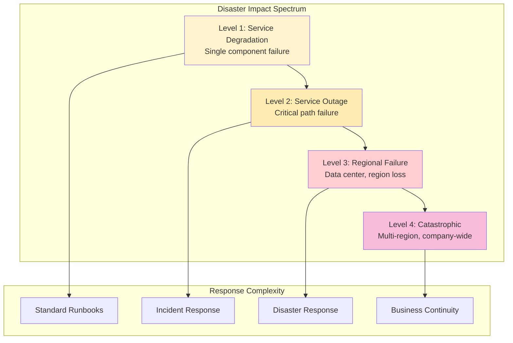
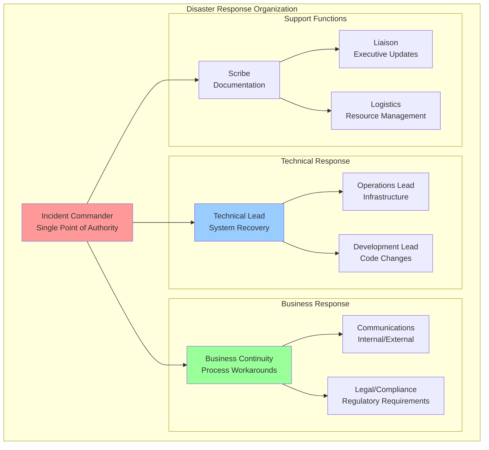

# Disaster Recovery Planning for Distributed Systems


## Overview

Disaster Recovery Planning for Distributed Systems
description: Comprehensive disaster recovery strategies, RTO/RPO optimization, chaos testing, GameDay practices, and organizational resilience patterns
type: human-factors
difficulty: advanced
reading_time: 35 min
prerequisites:
  - chaos-engineering. Disaster Recovery Planning for Distributed Systems

## Table of Contents

- [Understanding Disaster Recovery Scope](#understanding-disaster-recovery-scope)
  - [Disaster Categories](#disaster-categories)
  - [RTO/RPO Framework](#rtorpo-framework)
- [Advanced DR Architecture Patterns](#advanced-dr-architecture-patterns)
  - [Multi-Region Active-Active](#multi-region-active-active)
  - [Disaster Recovery Orchestration](#disaster-recovery-orchestration)
- [GameDay Disaster Scenarios](#gameday-disaster-scenarios)
  - [Scenario Design Framework](#scenario-design-framework)
- [Real GameDay Scenario Examples](#real-gameday-scenario-examples)
  - [GameDay Execution Framework](#gameday-execution-framework)
- [Organizational Disaster Response](#organizational-disaster-response)
  - [Crisis Management Structure](#crisis-management-structure)
  - [Decision Framework Under Extreme Pressure](#decision-framework-under-extreme-pressure)
- [Advanced Recovery Techniques](#advanced-recovery-techniques)
  - [Cross-Region Data Recovery](#cross-region-data-recovery)
  - [Real-Time Recovery Metrics](#real-time-recovery-metrics)
- [Disaster Recovery Culture and Training](#disaster-recovery-culture-and-training)
  - [Continuous DR Preparedness](#continuous-dr-preparedness)
  - [Psychological Preparedness](#psychological-preparedness)
- [ROI and Business Case for DR Investment](#roi-and-business-case-for-dr-investment)
  - [DR Investment Portfolio Analysis](#dr-investment-portfolio-analysis)
- [Measuring DR Program Success](#measuring-dr-program-success)
  - [Comprehensive DR Metrics Framework](#comprehensive-dr-metrics-framework)


**Building organizational and technical resilience for catastrophic failure scenarios**

> *"In disaster recovery, hope is not a strategy—preparation, practice, and process are.

**Reading time:** ~14 minutes

## Table of Contents

- [Understanding Disaster Recovery Scope](#understanding-disaster-recovery-scope)
  - [Disaster Categories](#disaster-categories)
  - [RTO/RPO Framework](#rtorpo-framework)
- [Advanced DR Architecture Patterns](#advanced-dr-architecture-patterns)
  - [Multi-Region Active-Active](#multi-region-active-active)
  - [Disaster Recovery Orchestration](#disaster-recovery-orchestration)
- [GameDay Disaster Scenarios](#gameday-disaster-scenarios)
  - [Scenario Design Framework](#scenario-design-framework)
- [Real GameDay Scenario Examples](#real-gameday-scenario-examples)
  - [GameDay Execution Framework](#gameday-execution-framework)
- [Organizational Disaster Response](#organizational-disaster-response)
  - [Crisis Management Structure](#crisis-management-structure)
  - [Decision Framework Under Extreme Pressure](#decision-framework-under-extreme-pressure)
- [Advanced Recovery Techniques](#advanced-recovery-techniques)
  - [Cross-Region Data Recovery](#cross-region-data-recovery)
  - [Real-Time Recovery Metrics](#real-time-recovery-metrics)
- [Disaster Recovery Culture and Training](#disaster-recovery-culture-and-training)
  - [Continuous DR Preparedness](#continuous-dr-preparedness)
  - [Psychological Preparedness](#psychological-preparedness)
- [ROI and Business Case for DR Investment](#roi-and-business-case-for-dr-investment)
  - [DR Investment Portfolio Analysis](#dr-investment-portfolio-analysis)
- [Measuring DR Program Success](#measuring-dr-program-success)
  - [Comprehensive DR Metrics Framework](#comprehensive-dr-metrics-framework)


**Building organizational and technical resilience for catastrophic failure scenarios**

> *"In disaster recovery, hope is not a strategy—preparation, practice, and process are."*

---

## Understanding Disaster Recovery Scope

Disaster recovery extends beyond technical backup/restore to encompass organizational continuity under extreme stress.

### Disaster Categories



### RTO/RPO Framework

```python
class RecoveryObjectives:
    """Define and track recovery time and point objectives"""
    
    def __init__(self):
        self.service_tiers = {
            'tier_0_critical': {
                'rto': '15 minutes',
                'rpo': '1 minute',
                'examples': ['payment processing', 'user authentication'],
                'impact_per_hour': '$1M+',
                'recovery_investment': 'unlimited'
            },
            'tier_1_essential': {
                'rto': '1 hour',
                'rpo': '5 minutes',
                'examples': ['order processing', 'inventory'],
                'impact_per_hour': '$100K-1M',
                'recovery_investment': 'high'
            },
            'tier_2_important': {
                'rto': '4 hours',
                'rpo': '30 minutes',
                'examples': ['reporting', 'analytics'],
                'impact_per_hour': '$10K-100K',
                'recovery_investment': 'moderate'
            },
            'tier_3_deferrable': {
                'rto': '24 hours',
                'rpo': '2 hours',
                'examples': ['batch jobs', 'archival'],
                'impact_per_hour': '<$10K',
                'recovery_investment': 'minimal'
            }
        }
    
    def calculate_recovery_investment(self, service, current_rto, target_rto):
        """Economic analysis of RTO improvements"""
        
        tier = self.classify_service(service)
        impact_per_hour = self.service_tiers[tier]['impact_per_hour']
        
        # Calculate potential savings
        time_saved_hours = (current_rto - target_rto) / 60
        annual_incidents = self.estimate_annual_incidents(service)
        annual_savings = time_saved_hours * impact_per_hour * annual_incidents
        
        # Estimate investment required
        infrastructure_cost = self.estimate_infrastructure_cost(target_rto)
        operational_cost = self.estimate_operational_cost(target_rto)
        
        return {
            'annual_savings': annual_savings,
            'infrastructure_investment': infrastructure_cost,
            'operational_investment': operational_cost,
            'payback_period_months': (infrastructure_cost + operational_cost) / (annual_savings / 12),
            'roi_percentage': (annual_savings / (infrastructure_cost + operational_cost)) * 100
        }
    
    def optimize_rto_rpo_portfolio(self, budget_constraints):
        """Portfolio optimization across services"""
        
        services = self.get_all_services()
        optimization_options = []
        
        for service in services:
            current_rto = service.current_rto
            for target_rto in [15, 30, 60, 240, 1440]:  # minutes
                if target_rto < current_rto:
                    roi = self.calculate_recovery_investment(
                        service, current_rto, target_rto
                    )
                    optimization_options.append({
                        'service': service.name,
                        'current_rto': current_rto,
                        'target_rto': target_rto,
                        'investment': roi['infrastructure_investment'],
                        'roi': roi['roi_percentage'],
                        'priority_score': roi['roi_percentage'] / roi['infrastructure_investment']
                    })
        
        # Knapsack optimization within budget
        return self.knapsack_optimize(optimization_options, budget_constraints)
```

## Advanced DR Architecture Patterns

### Multi-Region Active-Active

```yaml
active_active_architecture:
  regions:
    primary:
      region: "us-east-1"
      traffic_percentage: 60
      capabilities:
        - full_read_write
        - real_time_processing
        - user_sessions
      
    secondary:
      region: "us-west-2"
      traffic_percentage: 40
      capabilities:
        - full_read_write
        - real_time_processing
        - user_sessions
      
  data_replication:
    strategy: "bidirectional_async"
    conflict_resolution: "last_writer_wins_with_vector_clocks"
    consistency_model: "eventual"
    
  traffic_management:
    dns_failover: "route53_health_checks"
    load_balancer: "global_load_balancer"
    session_affinity: "region_sticky_with_failover"
    
  failover_triggers:
    - region_health_check_failure
    - latency_threshold_breach
    - error_rate_spike
    - manual_override
```

### Disaster Recovery Orchestration

```python
class DisasterRecoveryOrchestrator:
    """Automate complex disaster recovery scenarios"""
    
    def __init__(self):
        self.recovery_workflows = {}
        self.state_machine = DRStateMachine()
        self.notification_manager = NotificationManager()
    
    def execute_recovery_scenario(self, scenario_type, severity_level):
        """Execute pre-defined recovery scenario"""
        
        workflow = self.recovery_workflows[scenario_type]
        
        # Initialize recovery state
        recovery_state = {
            'scenario': scenario_type,
            'severity': severity_level,
            'start_time': datetime.now(),
            'steps_completed': [],
            'current_step': None,
            'rollback_stack': [],
            'approval_required': severity_level >= 3
        }
        
        try:
            # Execute recovery steps
            for step in workflow.steps:
                if self.requires_approval(step, recovery_state):
                    approval = self.request_approval(step, recovery_state)
                    if not approval.approved:
                        raise RecoveryAborted(f"Approval denied: {approval.reason}")
                
                # Execute step with rollback capability
                result = self.execute_step(step, recovery_state)
                recovery_state['rollback_stack'].append({
                    'step': step,
                    'rollback_action': result.rollback_action,
                    'timestamp': datetime.now()
                })
                
                # Update progress
                recovery_state['steps_completed'].append(step)
                self.notify_progress(recovery_state)
                
                # Validation checkpoint
                if not self.validate_step_success(step, result):
                    raise RecoveryStepFailed(f"Step validation failed: {step.name}")
            
            # Final validation
            return self.complete_recovery(recovery_state)
            
        except Exception as e:
            # Automatic rollback on failure
            return self.rollback_recovery(recovery_state, e)
    
    def chaos_recovery_test(self, scenario, blast_radius='limited'):
        """Test recovery procedures with controlled chaos"""
        
        test_environment = self.create_test_environment(blast_radius)
        
        try:
            # Inject failure
            failure_injection = self.inject_failure(scenario, test_environment)
            
            # Measure detection time
            detection_time = self.measure_detection_time(failure_injection)
            
            # Execute recovery
            recovery_start = datetime.now()
            recovery_result = self.execute_recovery_scenario(scenario, severity_level=2)
            recovery_time = datetime.now() - recovery_start
            
            # Measure recovery effectiveness
            effectiveness_score = self.measure_recovery_effectiveness(
                test_environment, recovery_result
            )
            
            return {
                'scenario': scenario,
                'detection_time_seconds': detection_time.total_seconds(),
                'recovery_time_seconds': recovery_time.total_seconds(),
                'effectiveness_score': effectiveness_score,
                'issues_found': recovery_result.issues,
                'recommendations': recovery_result.recommendations
            }
            
        finally:
            self.cleanup_test_environment(test_environment)
```

## GameDay Disaster Scenarios

### Scenario Design Framework

```python
class GameDayScenarioDesigner:
    """Design realistic disaster recovery scenarios"""
    
    def __init__(self):
        self.scenario_templates = self.load_scenario_templates()
        self.complexity_levels = {
            'beginner': {
                'failure_points': 1,
                'cascading_failures': False,
                'time_pressure': 'low',
                'stakeholder_involvement': 'minimal'
            },
            'intermediate': {
                'failure_points': 2,
                'cascading_failures': True,
                'time_pressure': 'medium',
                'stakeholder_involvement': 'moderate'
            },
            'advanced': {
                'failure_points': 3,
                'cascading_failures': True,
                'time_pressure': 'high',
                'stakeholder_involvement': 'high'
            }
        }
    
    def create_scenario(self, business_context, complexity='intermediate'):
        """Generate contextual disaster scenario"""
        
        config = self.complexity_levels[complexity]
        
        # Base failure injection
        primary_failure = self.select_primary_failure(business_context)
        
        scenario = {
            'title': f"GameDay: {primary_failure.title}",
            'business_context': business_context,
            'complexity_level': complexity,
            'estimated_duration': '2-4 hours',
            
            'timeline': self.generate_timeline(primary_failure, config),
            'success_criteria': self.define_success_criteria(primary_failure),
            'participant_roles': self.assign_participant_roles(),
            'observer_checklist': self.create_observer_checklist(),
            'debrief_questions': self.prepare_debrief_questions(),
            
            'failure_injection_plan': {
                'primary': primary_failure,
                'cascading': self.plan_cascading_failures(primary_failure, config),
                'red_herrings': self.add_red_herrings(config)
            },
            
            'recovery_validation': {
                'technical_checks': self.define_technical_validation(),
                'business_impact_assessment': self.define_business_validation(),
                'communication_assessment': self.define_communication_validation()
            }
        }
        
        return scenario
    
    def generate_timeline(self, failure, config):
        """Create realistic failure progression timeline"""
        
        timeline = [
            {
                'time': 'T+0',
                'event': 'Initial failure occurs',
                'visibility': 'hidden',
                'description': failure.description
            }
        ]
        
        # Add detection delay based on monitoring maturity
        detection_delay = self.calculate_detection_delay(failure)
        timeline.append({
            'time': f'T+{detection_delay}m',
            'event': 'Failure symptoms become visible',
            'visibility': 'monitoring_alerts',
            'description': 'Metrics cross threshold, alerts fire'
        })
        
        # Add customer impact timeline
        customer_impact_delay = self.calculate_customer_impact_delay(failure)
        timeline.append({
            'time': f'T+{customer_impact_delay}m',
            'event': 'Customer impact begins',
            'visibility': 'customer_reports',
            'description': 'Support tickets, social media mentions'
        })
        
        # Add cascading failures if configured
        if config['cascading_failures']:
            for cascade in self.plan_cascading_failures(failure, config):
                timeline.append({
                    'time': f'T+{cascade.delay}m',
                    'event': f'Cascading failure: {cascade.component}',
                    'visibility': cascade.visibility,
                    'description': cascade.description
                })
        
        return timeline

## Real GameDay Scenario Examples
gameday_scenarios = {
    "payment_processor_outage": {
        "title": "Critical Payment Processor Failure During Black Friday",
        "business_impact": "High - Revenue critical period",
        "initial_symptoms": [
            "Payment success rate drops from 99.5% to 60%",
            "Customer complaints spike",
            "Revenue dashboard shows significant drop"
        ],
        "complexity_factors": [
            "High traffic period - 10x normal load",
            "Multiple payment providers affected differently", 
            "Marketing campaigns driving more traffic",
            "Limited staff due to holiday schedules"
        ],
        "red_herrings": [
            "CDN latency appears elevated",
            "Database connection pool shows higher usage",
            "Recent deployment occurred 6 hours prior"
        ],
        "learning_objectives": [
            "Multi-vendor failure handling",
            "Communication under extreme pressure",
            "Revenue impact prioritization",
            "Load balancing across providers"
        ]
    },
    
    "database_corruption_scenario": {
        "title": "Silent Data Corruption in Primary Database",
        "business_impact": "Critical - Data integrity at risk",
        "initial_symptoms": [
            "Data validation job failures increasing",
            "Customer reports of incorrect account balances",
            "Referential integrity errors in logs"
        ],
        "complexity_factors": [
            "Corruption affects only specific data patterns",
            "Backup systems may also be compromised",
            "Legal/compliance implications for data accuracy",
            "Distributed systems may have propagated corrupt data"
        ],
        "decision_points": [
            "Stop all writes vs continue with risk",
            "Point-in-time recovery vs selective repair",
            "Customer communication strategy",
            "Regulatory notification requirements"
        ]
    }
}
```

### GameDay Execution Framework

```python
class GameDayExecutor:
    """Execute and manage disaster recovery exercises"""
    
    def __init__(self):
        self.scenario_state = {}
        self.participant_tracker = ParticipantTracker()
        self.metrics_collector = MetricsCollector()
        self.communication_manager = CommunicationManager()
    
    def run_gameday(self, scenario, participants):
        """Execute complete GameDay exercise"""
        
        gameday_id = self.initialize_gameday(scenario, participants)
        
        try:
            # Pre-exercise briefing
            self.conduct_briefing(scenario, participants)
            
            # Initialize monitoring
            self.start_metrics_collection(gameday_id)
            
            # Execute scenario timeline
            for timeline_event in scenario['timeline']:
                self.execute_timeline_event(timeline_event, gameday_id)
                self.collect_response_metrics(timeline_event, gameday_id)
                
                # Check if exercise should continue
                if self.should_abort_exercise(gameday_id):
                    break
            
            # Post-exercise analysis
            results = self.analyze_gameday_results(gameday_id)
            
            # Conduct hot wash debrief
            debrief_results = self.conduct_debrief(scenario, results, participants)
            
            return {
                'gameday_id': gameday_id,
                'execution_results': results,
                'debrief_insights': debrief_results,
                'improvement_actions': self.generate_improvement_actions(results)
            }
            
        except Exception as e:
            # Emergency stop if exercise becomes dangerous
            self.emergency_stop_gameday(gameday_id, str(e))
            raise
        
        finally:
            # Always clean up test environment
            self.cleanup_gameday_environment(gameday_id)
    
    def analyze_response_effectiveness(self, gameday_id):
        """Comprehensive analysis of team response"""
        
        metrics = self.metrics_collector.get_gameday_metrics(gameday_id)
        
        analysis = {
            'detection_performance': {
                'time_to_detect': metrics['detection_time'],
                'detection_method': metrics['detection_source'],
                'false_positives': metrics['false_positive_investigations'],
                'missed_signals': metrics['overlooked_indicators']
            },
            
            'response_performance': {
                'time_to_response': metrics['response_time'],
                'escalation_effectiveness': metrics['escalation_timeline'],
                'decision_quality': metrics['decision_accuracy'],
                'coordination_effectiveness': metrics['communication_quality']
            },
            
            'technical_performance': {
                'diagnosis_accuracy': metrics['root_cause_accuracy'],
                'solution_effectiveness': metrics['fix_success_rate'],
                'rollback_capability': metrics['rollback_time'],
                'automation_usage': metrics['manual_vs_automated']
            },
            
            'communication_performance': {
                'internal_updates': metrics['team_communication_frequency'],
                'external_updates': metrics['stakeholder_communication'],
                'customer_communication': metrics['customer_notification_timing'],
                'transparency_level': metrics['information_sharing_quality']
            }
        }
        
        return analysis
```

## Organizational Disaster Response

### Crisis Management Structure



### Decision Framework Under Extreme Pressure

```python
class CrisisDecisionFramework:
    """Structured decision making during disasters"""
    
    def __init__(self):
        self.decision_templates = self.load_decision_templates()
        self.risk_assessment_matrix = self.load_risk_matrix()
        self.stakeholder_impact_map = self.load_stakeholder_map()
    
    def make_crisis_decision(self, situation, options, time_constraint):
        """Structured decision process for crisis situations"""
        
        # Rapid situation assessment
        assessment = {
            'severity': self.assess_severity(situation),
            'scope': self.assess_scope(situation),
            'trend': self.assess_trend(situation),
            'unknowns': self.identify_unknowns(situation)
        }
        
        # Rapid option analysis
        option_analysis = []
        for option in options:
            analysis = {
                'option': option,
                'technical_feasibility': self.assess_feasibility(option, time_constraint),
                'business_impact': self.assess_business_impact(option),
                'risk_level': self.assess_option_risks(option),
                'implementation_time': self.estimate_implementation_time(option),
                'rollback_capability': self.assess_rollback_capability(option)
            }
            option_analysis.append(analysis)
        
        # Decision recommendation
        recommendation = self.generate_recommendation(
            assessment, option_analysis, time_constraint
        )
        
        # Decision documentation
        decision_record = {
            'timestamp': datetime.now(),
            'situation_summary': assessment,
            'options_considered': option_analysis,
            'decision': recommendation['choice'],
            'rationale': recommendation['rationale'],
            'risks_accepted': recommendation['risks'],
            'success_criteria': recommendation['success_criteria'],
            'rollback_plan': recommendation['rollback_plan'],
            'review_timeline': recommendation['review_schedule']
        }
        
        return decision_record
    
    def crisis_communication_templates(self):
        """Pre-approved communication templates for speed"""
        
        return {
            'initial_alert': {
                'internal': """
                CRITICAL INCIDENT ALERT
                
                Summary: {brief_description}
                Impact: {customer_impact_level}
                Status: Investigation in progress
                ETA for update: {next_update_time}
                
                Response team has been assembled.
                Do not contact team members directly.
                
                Updates: {incident_channel}
                """,
                
                'executive': """
                Critical Incident Notification
                
                We are experiencing {issue_type} affecting {impact_scope}.
                
                Customer Impact: {customer_impact}
                Business Impact: {revenue_impact}
                Response Status: {response_status}
                
                Next Update: {next_update_time}
                Incident Commander: {ic_name}
                """,
                
                'customer': """
                Service Advisory
                
                We're currently experiencing {customer_friendly_description}.
                
                What we're doing: {response_actions}
                When to expect updates: {update_schedule}
                
                We apologize for any inconvenience.
                Status page: {status_page_url}
                """
            }
        }
```

## Advanced Recovery Techniques

### Cross-Region Data Recovery

```python
class CrossRegionRecoveryManager:
    """Manage complex cross-region data recovery scenarios"""
    
    def __init__(self):
        self.region_managers = {}
        self.data_consistency_checker = DataConsistencyChecker()
        self.recovery_orchestrator = RecoveryOrchestrator()
    
    def execute_cross_region_recovery(self, failed_region, target_region, recovery_scope):
        """Coordinate complex cross-region recovery"""
        
        # Pre-recovery validation
        pre_check_results = self.validate_recovery_preconditions(
            failed_region, target_region, recovery_scope
        )
        
        if not pre_check_results.safe_to_proceed:
            raise UnsafeRecoveryConditions(pre_check_results.blocking_issues)
        
        # Create recovery plan
        recovery_plan = self.create_recovery_plan(
            failed_region, target_region, recovery_scope
        )
        
        # Execute phased recovery
        recovery_results = {}
        for phase in recovery_plan.phases:
            phase_result = self.execute_recovery_phase(phase)
            recovery_results[phase.name] = phase_result
            
            # Validate phase completion
            validation = self.validate_phase_completion(phase, phase_result)
            if not validation.success:
                # Rollback phase if validation fails
                self.rollback_phase(phase, phase_result)
                raise PhaseRecoveryFailed(validation.errors)
            
            # Update global state
            self.update_global_recovery_state(phase, phase_result)
        
        # Final consistency validation
        consistency_check = self.validate_final_consistency(recovery_results)
        if not consistency_check.passed:
            # Log inconsistencies but don't fail - may be acceptable
            self.log_consistency_issues(consistency_check.issues)
        
        return {
            'recovery_plan': recovery_plan,
            'phase_results': recovery_results,
            'consistency_status': consistency_check,
            'total_recovery_time': recovery_plan.total_execution_time,
            'data_loss_assessment': self.assess_data_loss(recovery_results)
        }
    
    def create_recovery_plan(self, failed_region, target_region, scope):
        """Generate optimized cross-region recovery plan"""
        
        # Analyze data dependencies
        dependency_graph = self.analyze_data_dependencies(scope)
        
        # Optimize recovery order
        recovery_order = self.optimize_recovery_order(dependency_graph)
        
        # Create phased execution plan
        phases = []
        for phase_services in recovery_order:
            phase = RecoveryPhase(
                name=f"Phase-{len(phases)+1}",
                services=phase_services,
                parallel_execution=self.can_execute_in_parallel(phase_services),
                estimated_duration=self.estimate_phase_duration(phase_services),
                validation_criteria=self.define_phase_validation(phase_services),
                rollback_plan=self.create_phase_rollback_plan(phase_services)
            )
            phases.append(phase)
        
        return RecoveryPlan(
            source_region=failed_region,
            target_region=target_region,
            scope=scope,
            phases=phases,
            total_estimated_duration=sum(p.estimated_duration for p in phases),
            risk_assessment=self.assess_recovery_risks(phases)
        )
```

### Real-Time Recovery Metrics

```python
class RecoveryMetricsCollector:
    """Collect and analyze recovery performance metrics in real-time"""
    
    def __init__(self):
        self.metrics_store = MetricsStore()
        self.alert_manager = AlertManager()
        self.dashboard_manager = DashboardManager()
    
    def track_recovery_progress(self, recovery_id):
        """Real-time tracking of recovery progress"""
        
        recovery_session = self.create_recovery_session(recovery_id)
        
        while recovery_session.is_active():
            metrics = {
                'timestamp': datetime.now(),
                'recovery_id': recovery_id,
                
                # Progress metrics
                'completion_percentage': recovery_session.get_completion_percentage(),
                'phases_completed': recovery_session.get_phases_completed(),
                'current_phase': recovery_session.get_current_phase(),
                'estimated_time_remaining': recovery_session.get_eta(),
                
                # Performance metrics
                'data_recovery_rate_mbps': recovery_session.get_data_transfer_rate(),
                'service_restoration_rate': recovery_session.get_restoration_rate(),
                'error_rate': recovery_session.get_error_rate(),
                'retry_rate': recovery_session.get_retry_rate(),
                
                # Business impact metrics
                'services_restored': recovery_session.get_services_restored(),
                'customer_impact_level': recovery_session.assess_customer_impact(),
                'revenue_impact_reduction': recovery_session.calculate_revenue_recovery(),
                
                # Team performance metrics
                'response_team_size': recovery_session.get_team_size(),
                'decision_velocity': recovery_session.get_decision_velocity(),
                'communication_frequency': recovery_session.get_comm_frequency()
            }
            
            # Store metrics
            self.metrics_store.store_recovery_metrics(metrics)
            
            # Check for anomalies or issues
            anomalies = self.detect_recovery_anomalies(metrics, recovery_session)
            if anomalies:
                self.alert_manager.send_recovery_anomaly_alert(anomalies)
            
            # Update dashboards
            self.update_recovery_dashboards(metrics)
            
            time.sleep(30)  # Collect every 30 seconds
    
    def generate_recovery_report(self, recovery_id):
        """Generate comprehensive post-recovery analysis report"""
        
        metrics = self.metrics_store.get_recovery_metrics(recovery_id)
        recovery_session = self.get_recovery_session(recovery_id)
        
        report = {
            'executive_summary': {
                'total_recovery_time': recovery_session.total_duration,
                'services_affected': len(recovery_session.affected_services),
                'customer_impact_duration': recovery_session.customer_impact_duration,
                'estimated_revenue_impact': recovery_session.revenue_impact,
                'recovery_success_rate': recovery_session.success_rate
            },
            
            'technical_analysis': {
                'rto_performance': self.analyze_rto_performance(metrics),
                'rpo_performance': self.analyze_rpo_performance(metrics),
                'automation_effectiveness': self.analyze_automation_usage(metrics),
                'manual_intervention_points': self.identify_manual_interventions(metrics)
            },
            
            'organizational_analysis': {
                'response_time_breakdown': self.analyze_response_times(metrics),
                'decision_making_effectiveness': self.analyze_decision_quality(metrics),
                'communication_effectiveness': self.analyze_communication(metrics),
                'team_coordination_score': self.score_team_coordination(metrics)
            },
            
            'improvement_recommendations': {
                'technical_improvements': self.recommend_technical_improvements(metrics),
                'process_improvements': self.recommend_process_improvements(metrics),
                'training_needs': self.identify_training_needs(metrics),
                'investment_priorities': self.prioritize_investments(metrics)
            }
        }
        
        return report
```

## Disaster Recovery Culture and Training

### Continuous DR Preparedness

```yaml
dr_preparedness_program:
  training_tracks:
    new_engineer_dr_onboarding:
      duration: "2 weeks"
      format: "hands_on_simulations"
      topics:
        - Company DR philosophy and procedures
        - Service-specific recovery procedures
        - Communication protocols during incidents
        - Stress management and decision making
    
    quarterly_dr_refresher:
      duration: "4 hours"
      format: "tabletop_exercises"
      focus: "recent changes and lessons learned"
    
    annual_dr_certification:
      duration: "1 day"
      format: "practical_assessment"
      requirement: "all_engineering_staff"
  
  regular_exercises:
    monthly_service_level:
      scope: "individual_service_recovery"
      participants: "service_team"
      duration: "2 hours"
    
    quarterly_cross_service:
      scope: "multi_service_failure_scenario"
      participants: "multiple_teams"
      duration: "4 hours"
    
    annual_company_wide:
      scope: "business_continuity_exercise"
      participants: "all_critical_personnel"
      duration: "full_day"
```

### Psychological Preparedness

```python
class StressInoculationTraining:
    """Train teams to perform under extreme stress"""
    
    def __init__(self):
        self.stress_scenarios = self.load_stress_scenarios()
        self.performance_metrics = PerformanceMetrics()
        self.psychological_assessments = PsychAssessments()
    
    def conduct_stress_inoculation_session(self, team, scenario_type):
        """Progressive stress exposure training"""
        
        # Baseline performance measurement
        baseline = self.measure_baseline_performance(team, scenario_type)
        
        # Progressive stress introduction
        stress_levels = ['low', 'medium', 'high', 'extreme']
        
        results = {}
        for stress_level in stress_levels:
            # Create stress-enhanced scenario
            scenario = self.create_stressed_scenario(scenario_type, stress_level)
            
            # Execute scenario under stress
            session_result = self.execute_stressed_scenario(team, scenario)
            
            # Measure performance degradation
            performance = self.measure_performance_under_stress(
                team, session_result, baseline
            )
            
            # Psychological state assessment
            psych_state = self.assess_psychological_state(team, stress_level)
            
            results[stress_level] = {
                'performance_metrics': performance,
                'psychological_state': psych_state,
                'coping_strategies_used': session_result.coping_strategies,
                'team_cohesion_score': session_result.team_cohesion,
                'decision_quality_score': session_result.decision_quality
            }
            
            # Recovery period between stress levels
            self.conduct_recovery_period(team, session_result)
        
        # Generate training recommendations
        recommendations = self.analyze_stress_response_patterns(results)
        
        return {
            'baseline_performance': baseline,
            'stress_response_profile': results,
            'improvement_recommendations': recommendations,
            'next_training_plan': self.create_next_training_plan(results)
        }
    
    def create_stressed_scenario(self, base_scenario, stress_level):
        """Enhance scenarios with stress-inducing factors"""
        
        stress_enhancers = {
            'low': {
                'time_pressure': 'normal_timeline_with_updates',
                'information_clarity': 'mostly_clear_with_some_ambiguity',
                'stakeholder_pressure': 'concerned_but_patient',
                'resource_constraints': 'adequate_resources'
            },
            'medium': {
                'time_pressure': 'compressed_timeline',
                'information_clarity': 'mixed_signals_and_red_herrings',
                'stakeholder_pressure': 'frequent_status_requests',
                'resource_constraints': 'limited_expert_availability'
            },
            'high': {
                'time_pressure': 'very_tight_deadline',
                'information_clarity': 'conflicting_information',
                'stakeholder_pressure': 'executive_pressure_calls',
                'resource_constraints': 'key_experts_unavailable'
            },
            'extreme': {
                'time_pressure': 'impossible_timeline_demands',
                'information_clarity': 'massive_information_overload',
                'stakeholder_pressure': 'media_attention_and_customer_anger',
                'resource_constraints': 'skeleton_crew_available'
            }
        }
        
        enhanced_scenario = base_scenario.copy()
        enhanced_scenario.update(stress_enhancers[stress_level])
        
        return enhanced_scenario
```

## ROI and Business Case for DR Investment

### DR Investment Portfolio Analysis

```python
class DRInvestmentAnalyzer:
    """Analyze ROI of disaster recovery investments"""
    
    def __init__(self):
        self.historical_incidents = self.load_incident_history()
        self.business_impact_model = BusinessImpactModel()
        self.cost_model = CostModel()
    
    def calculate_dr_investment_roi(self, investment_options, time_horizon_years=3):
        """Comprehensive ROI analysis for DR investments"""
        
        analysis_results = {}
        
        for option in investment_options:
            # Calculate investment costs
            costs = self.calculate_total_investment_cost(option, time_horizon_years)
            
            # Calculate risk reduction benefits
            risk_reduction = self.calculate_risk_reduction(option)
            
            # Calculate operational benefits
            operational_benefits = self.calculate_operational_benefits(option, time_horizon_years)
            
            # Calculate intangible benefits
            intangible_benefits = self.estimate_intangible_benefits(option)
            
            # Monte Carlo simulation for uncertainty
            roi_distribution = self.monte_carlo_roi_analysis(
                costs, risk_reduction, operational_benefits, intangible_benefits
            )
            
            analysis_results[option.name] = {
                'investment_cost': costs,
                'annual_benefits': risk_reduction + operational_benefits,
                'payback_period_months': costs['total'] / (risk_reduction + operational_benefits) * 12,
                'roi_3_year': roi_distribution['mean'],
                'roi_confidence_interval': roi_distribution['confidence_interval'],
                'risk_adjusted_roi': roi_distribution['risk_adjusted'],
                'intangible_benefits_value': intangible_benefits
            }
        
        # Portfolio optimization
        optimal_portfolio = self.optimize_investment_portfolio(
            investment_options, analysis_results
        )
        
        return {
            'individual_analysis': analysis_results,
            'optimal_portfolio': optimal_portfolio,
            'sensitivity_analysis': self.perform_sensitivity_analysis(investment_options),
            'recommendation': self.generate_investment_recommendation(analysis_results)
        }
    
    def monte_carlo_roi_analysis(self, costs, risk_benefits, operational_benefits, intangible_benefits, simulations=10000):
        """Monte Carlo simulation for ROI uncertainty analysis"""
        
        import numpy as np
        from scipy import stats
        
        roi_results = []
        
        for _ in range(simulations):
            # Sample from uncertainty distributions
            sampled_costs = {
                'infrastructure': np.random.normal(costs['infrastructure'], costs['infrastructure'] * 0.2),
                'operational': np.random.normal(costs['operational'], costs['operational'] * 0.15),
                'training': np.random.normal(costs['training'], costs['training'] * 0.3)
            }
            
            sampled_benefits = {
                'risk_reduction': np.random.normal(risk_benefits, risk_benefits * 0.4),
                'operational': np.random.normal(operational_benefits, operational_benefits * 0.25),
                'intangible': np.random.triangular(0, intangible_benefits * 0.5, intangible_benefits)
            }
            
            total_investment = sum(sampled_costs.values())
            total_annual_benefit = sum(sampled_benefits.values())
            
            roi = (total_annual_benefit * 3 - total_investment) / total_investment * 100
            roi_results.append(roi)
        
        return {
            'mean': np.mean(roi_results),
            'median': np.median(roi_results),
            'std': np.std(roi_results),
            'confidence_interval': (np.percentile(roi_results, 5), np.percentile(roi_results, 95)),
            'probability_positive_roi': sum(1 for roi in roi_results if roi > 0) / len(roi_results),
            'risk_adjusted': np.mean(roi_results) - np.std(roi_results)  # Risk-adjusted return
        }
```

## Measuring DR Program Success

### Comprehensive DR Metrics Framework

```yaml
dr_success_metrics:
  technical_metrics:
    rto_achievement:
      measurement: "actual_recovery_time / target_rto"
      target: "> 95% within target"
      frequency: "per_incident"
    
    rpo_achievement:
      measurement: "actual_data_loss / target_rpo"
      target: "> 98% within target"
      frequency: "per_incident"
    
    automation_coverage:
      measurement: "automated_recovery_steps / total_recovery_steps"
      target: "> 80%"
      frequency: "quarterly"
    
    recovery_success_rate:
      measurement: "successful_recoveries / total_recovery_attempts"
      target: "> 95%"
      frequency: "monthly"
  
  organizational_metrics:
    team_readiness:
      measurement: "team_members_dr_certified / total_team_members"
      target: "> 90%"
      frequency: "quarterly"
    
    response_time:
      measurement: "time_to_assemble_response_team"
      target: "< 15 minutes"
      frequency: "per_exercise"
    
    decision_velocity:
      measurement: "critical_decisions_made / response_time_hours"
      target: "> 4 decisions/hour"
      frequency: "per_incident"
    
    communication_effectiveness:
      measurement: "stakeholder_satisfaction_score"
      target: "> 4.0/5.0"
      frequency: "post_incident_survey"
  
  business_metrics:
    business_continuity:
      measurement: "business_processes_maintained_during_dr"
      target: "> 80%"
      frequency: "per_major_incident"
    
    customer_impact_reduction:
      measurement: "customer_impact_duration_vs_total_outage"
      target: "< 30% of total outage"
      frequency: "per_customer_facing_incident"
    
    financial_impact:
      measurement: "actual_revenue_loss_vs_predicted"
      target: "< predicted impact"
      frequency: "per_revenue_affecting_incident"
```

This comprehensive disaster recovery planning framework provides organizations with the tools, processes, and mindset needed to handle catastrophic failures effectively. The combination of technical automation, organizational preparedness, and psychological resilience creates a robust foundation for maintaining business continuity under extreme conditions.

Key implementation priorities:
1. Start with RTO/RPO optimization for critical services
2. Implement automated recovery orchestration
3. Establish regular GameDay practice with realistic scenarios
4. Build organizational muscle memory through stress inoculation training
5. Measure and continuously improve both technical and human aspects of disaster recovery

Remember: The goal isn't just to recover from disasters—it's to build an organization that becomes stronger and more resilient through each challenge it faces.