# Observability Stacks


## Overview

Observability Stacks
description: Making distributed knowledge visible while respecting cognitive limits
  - Laws 5 & 6 in practice
type: human-factors
difficulty: beginner
reading_time: 25 min
prerequisites:
- core-principles/laws/distributed-knowledge
- core-principles/laws/cognitive-load
status: complete
last_updated: 2025-07-23
---


# Observability Stacks

## Table of Contents

- [The Observability Triad (Laws 5 & 6 United)](#the-observability-triad-laws-5-6-united)
- [Modern Observability Stack](#modern-observability-stack)
  - [Metrics Layer](#metrics-layer)
  - [Logging Layer](#logging-layer)
  - [Tracing Layer](#tracing-layer)
- [Reference Architecture](#reference-architecture)
- [Implementation Guide](#implementation-guide)
  - [1. Instrument Applications](#1-instrument-applications)
  - [2.

**Reading time:** ~10 minutes

## Table of Contents

- [The Observability Triad (Laws 5 & 6 United)](#the-observability-triad-laws-5-6-united)
- [Modern Observability Stack](#modern-observability-stack)
  - [Metrics Layer](#metrics-layer)
  - [Logging Layer](#logging-layer)
  - [Tracing Layer](#tracing-layer)
- [Reference Architecture](#reference-architecture)
- [Implementation Guide](#implementation-guide)
  - [1. Instrument Applications](#1-instrument-applications)
  - [2. Optimize Collection](#2-optimize-collection)
  - [3. Design Dashboards](#3-design-dashboards)
- [Observability Patterns](#observability-patterns)
  - [1. Correlation IDs](#1-correlation-ids)
  - [2. Service Dependency Mapping](#2-service-dependency-mapping)
  - [3. Anomaly Detection](#3-anomaly-detection)
- [Cost Optimization](#cost-optimization)
  - [Metrics Costs](#metrics-costs)
  - [Log Costs](#log-costs)
  - [Trace Costs](#trace-costs)
- [Troubleshooting with Observability](#troubleshooting-with-observability)
  - [Investigation Flow](#investigation-flow)
- [Observability Maturity (Laws 5 & 6 Progression)](#observability-maturity-laws-5-6-progression)
  - [Level 1: Reactive (High Cognitive Load)](#level-1-reactive-high-cognitive-load)
  - [Level 2: Proactive (Reducing Load)](#level-2-proactive-reducing-load)
  - [Level 3: Predictive (Cognitive Optimization)](#level-3-predictive-cognitive-optimization)
  - [Level 4: Prescriptive (Cognitive Augmentation)](#level-4-prescriptive-cognitive-augmentation)
- [Best Practices (Respecting Laws 5 & 6)](#best-practices-respecting-laws-5-6)
- [Key Takeaways](#key-takeaways)


**You can't fix what you can't see - Making Law 5 (Distributed Knowledge) comprehensible via Law 6 (Cognitive Load)**

## The Observability Triad (Laws 5 & 6 United)

```mermaid
graph TB
    subgraph "The Observability Triad - Distributed Knowledge Made Comprehensible"
        M[Metrics<br/>What is broken?<br/>(Aggregated knowledge)]
        L[Logs<br/>Why is it broken?<br/>(Local truth)]
        T[Traces<br/>Where is it broken?<br/>(Causal chain)]
        
        M <--> I[INSIGHTS<br/>Within Cognitive Limits]
        L <--> I
        T <--> I
        
        M <--> L
        L <--> T
        T <--> M
    end
    
    subgraph "Law 5: Epistemology"
        DK[Each node has partial truth]
    end
    
    subgraph "Law 6: Human-API"
        CL[Must fit in human head]
    end
    
    DK --> I
    CL --> I
    
    style I fill:#ffd54f,stroke:#333,stroke-width:3px
    style M fill:#e3f2fd
    style L fill:#e8f5e9
    style T fill:#fff3e0
```

## Modern Observability Stack

### Metrics Layer

Collection → Storage → Query → Visualization → Alerting

**Popular Stack:**
- Collection: Prometheus exporters, StatsD
- Storage: Prometheus, InfluxDB, M3
- Query: PromQL, Flux
- Visualization: Grafana
- Alerting: Alertmanager

**Key Decisions:**
- Push vs Pull model
- Retention period (15d default)
- Cardinality limits
- Aggregation strategy

### Logging Layer

Generation → Collection → Processing → Storage → Analysis

**Popular Stack:**
- Generation: Structured logging (JSON)
- Collection: Fluentd, Logstash, Vector
- Processing: Stream processing
- Storage: Elasticsearch, Loki, S3
- Analysis: Kibana, Grafana

**Key Decisions:**
- Structured vs unstructured
- Sampling rate
- Retention policy
- Index strategy

### Tracing Layer

Instrumentation → Collection → Storage → Analysis

**Popular Stack:**
- Instrumentation: OpenTelemetry
- Collection: Jaeger agent, OTLP
- Storage: Cassandra, Elasticsearch
- Analysis: Jaeger UI, Grafana Tempo

**Key Decisions:**
- Sampling strategy
- Trace context propagation
- Storage retention
- Head vs tail sampling

## Reference Architecture

```mermaid
flowchart TD
    subgraph "Reference Architecture"
        A[Applications] --> B[OpenTelemetry SDK/Agents]
        B --> C[Metrics]
        B --> D[Logs]
        B --> E[Traces]
        
        C --> F[OTLP Collector Cluster]
        D --> F
        E --> F
        
        F --> G[Prometheus]
        F --> H[Loki]
        F --> I[Jaeger/Tempo]
        
        G --> J[Grafana]
        H --> J
        I --> J
        
        J --> K[📊 Dashboards]
        J --> L[🚨 Alerts]
        J --> M[🔍 Exploration]
    end
    
    style A fill:#e3f2fd
    style F fill:#fff3cd
    style J fill:#c8e6c9
```



## Implementation Guide

### 1. Instrument Applications

**Metrics Implementation Pattern:**


**Key Metrics to Track:**

| Metric Type | Name | Labels | Purpose |
|------------|------|--------|------|
| **Histogram** | request_duration | method, route, status | Latency distribution |
| **Counter** | requests_total | method, route, status | Request rate |
| **Gauge** | concurrent_requests | service | Current load |
| **Summary** | response_size | endpoint | Payload analysis |


**Structured Logging Best Practices:**


**Essential Log Fields:**

| Field | Type | Purpose | Example |
|-------|------|---------|------|
| timestamp | ISO8601 | When it happened | 2024-03-15T10:23:45Z |
| level | string | Severity | ERROR, WARN, INFO |
| service | string | Source service | payment-api |
| trace_id | string | Correlation | 7f3a2b1c-4d5e-6f7a |
| user_id | string | Who affected | user_12345 |
| duration | number | Performance | 145.23 (ms) |
| error | object | Error details | {"type": "timeout"} |


```mermaid
flowchart TD
    subgraph "Distributed Tracing Flow"
        A[Client Request] --> B[API Gateway<br/>Span: gateway]
        B --> C[Auth Service<br/>Span: auth]
        B --> D[Payment Service<br/>Span: payment]
        
        C --> B
        
        D --> E[Database<br/>Span: db_query]
        D --> F[External API<br/>Span: stripe_api]
        
        E --> D
        F --> D
        D --> B
        B --> G[Client Response]
        
        H[Trace Timeline:<br/>gateway (200ms)<br/>├─ auth (30ms)<br/>└─ payment (150ms)<br/>    ├─ db_query (20ms)<br/>    └─ stripe_api (120ms)]
    end
    
    style A fill:#e3f2fd
    style G fill:#c8e6c9
    style H fill:#fff3cd
```

**Trace Attribute Standards:**

| Category | Attributes | Example |
|----------|-----------|------|
| **HTTP** | http.method, http.status_code, http.url | GET, 200, /api/v1/users |
| **Database** | db.system, db.statement, db.operation | postgresql, SELECT * FROM..., SELECT |
| **Messaging** | messaging.system, messaging.operation | kafka, publish |
| **Custom** | business.amount, business.user_tier | 99.99, premium |


### 2. Optimize Collection


**Optimization Configuration Guide:**

| Processor | Purpose | Config | Impact |
|-----------|---------|--------|--------|
| **Batch** | Reduce network calls | size: 1000, timeout: 10s | 90% fewer requests |
| **Memory Limiter** | Prevent OOM | limit: 512MB | Stability |
| **Sampling** | Control volume | ratio: 0.1 | 90% data reduction |
| **Resource** | Add metadata | host.name, service.name | Context |
| **Filter** | Remove noise | drop health checks | Relevant data only |


### 3. Design Dashboards

**Dashboard Hierarchy:**
1. **Service Overview**: RED metrics (Rate, Errors, Duration)
2. **Infrastructure**: CPU/Memory/Disk/Network, saturation, capacity
3. **Business**: Conversion rates, revenue impact, UX scores
4. **Debugging**: Log aggregations, trace analysis, error breakdowns

## Observability Patterns

### 1. Correlation IDs


**Correlation ID Best Practices:**

| Practice | Do | Don't | Why |
|----------|----|----|-----|
| **Generation** | Use UUID v4 | Sequential IDs | Avoid collisions |
| **Propagation** | HTTP headers | Query params | Security |
| **Storage** | Logs & traces | Metrics labels | Cardinality |
| **Format** | Standard header | Custom per service | Consistency |


### 2. Service Dependency Mapping

Automatic discovery through:
- Trace analysis (who calls whom)
- Network traffic analysis
- Service mesh data
- DNS queries

Visualization:
- Force-directed graphs
- Sankey diagrams
- Heat maps for call volume

### 3. Anomaly Detection

**Statistical approach:**
- Baseline normal behavior
- Detect deviations (3-sigma)
- Seasonal adjustment
- Trend analysis

**ML approach:**
- Train on historical data
- Predict expected values
- Alert on anomalies
- Reduce false positives

## Cost Optimization

### Metrics Costs

**Factors:**
- Cardinality (unique label combinations)
- Retention period
- Query frequency

**Optimizations:**
**Metrics Cost Optimization Strategies:**


**Cost Reduction Checklist:**

| Strategy | Implementation | Savings | Impact |
|----------|---------------|---------|--------|
| Limit cardinality | Remove high-cardinality labels | 60-80% | None |
| Pre-aggregate | Recording rules for common queries | 20-30% | Faster queries |
| Downsample | Reduce resolution over time | 70-85% | Lose precision |
| Drop metrics | Remove unused metrics | 10-30% | None |


**Example savings:**
- Before: 10M series × 15d = $5000/month
- After: 1M series × 15d + aggregates = $800/month

### Log Costs

**Factors:**
- Volume (GB/day)
- Retention
- Indexing

**Optimizations:**


**Log Optimization Matrix:**

| Log Level | Sample Rate | Retention | Index Fields | Use Case |
|-----------|------------|-----------|--------------|----------|
| ERROR | 100% | 90 days | All fields | Debugging |
| WARN | 100% | 30 days | Most fields | Monitoring |
| INFO | 10% | 7 days | Key fields | Analytics |
| DEBUG | 0% (dev only) | 1 day | Minimal | Development |


**Example savings:**
- Before: 1TB/day × 30d = $15000/month
- After: 100GB/day × 7d hot + S3 = $2000/month

### Trace Costs

**Factors:**
- Trace volume
- Span cardinality
- Retention

**Optimizations:**


**Sampling Strategy Comparison:**

| Strategy | Keep Rate | Pros | Cons | Best For |
|----------|-----------|------|------|-------|
| Head-based | Fixed % | Simple, predictable cost | Might miss errors | High volume |
| Tail-based | Dynamic | Keeps interesting traces | Higher complexity | Quality over quantity |
| Adaptive | Variable | Adjusts to load | Complex to implement | Variable traffic |
| Always-on | 100% errors + sample | Catches all issues | Storage cost | Production systems |


**Example savings:**
- Before: 100% traces = $8000/month
- After: 1% baseline + errors = $1200/month

## Troubleshooting with Observability

### Investigation Flow

```mermaid
flowchart TD
    subgraph "Troubleshooting Flow"
        A[🚨 Alert: High Error Rate] --> B[📊 Check Metrics]
        B --> C[Error: 15%<br/>Latency: 5s<br/>Start: 10:42]
        
        C --> D[📝 Query Logs]
        D --> E["Database timeout"<br/>From: payment-db-2]
        
        E --> F[🔍 Analyze Traces]
        F --> G[DB query: 5s<br/>Stuck at database]
        
        G --> H[🖥️ Check Infrastructure]
        H --> I[CPU: 100%<br/>Disk I/O: Saturated<br/>Cause: Backup job]
        
        I --> J[💡 Resolution]
        J --> K[Kill backup<br/>Reschedule off-peak]
        
        K --> L[✅ Service Recovered]
    end
    
    style A fill:#ffcdd2
    style L fill:#c8e6c9
    style J fill:#fff3cd
```



**Investigation Checklist:**

| Step | Tool | What to Look For | Time |
|------|------|-----------------|------|  
| 1. Metrics | Grafana | Error rate, latency spike | 30s |
| 2. Logs | Kibana/Loki | Error messages, patterns | 2min |
| 3. Traces | Jaeger | Slow spans, failures | 2min |
| 4. Infrastructure | Prometheus | CPU, memory, disk | 1min |
| 5. Dependencies | Service map | Upstream/downstream | 1min |


## Observability Maturity (Laws 5 & 6 Progression)

### Level 1: Reactive (High Cognitive Load)
- Basic logging to files (Law 5: Local truth only)
- Manual log searching (Exceeds Law 6: Too much data)
- CPU/memory graphs (Limited context)
- Email alerts (No prioritization)

### Level 2: Proactive (Reducing Load)
- Centralized logging (Law 5: Aggregating partial truths)
- Basic dashboards (Law 6: Visual chunking)
- Threshold alerts (Clear mental models)
- Some tracing (Causal understanding)

### Level 3: Predictive (Cognitive Optimization)
- Full observability stack (Law 5: Complete knowledge graph)
- Correlation across signals (Law 6: Automated pattern matching)
- Anomaly detection (Reduces monitoring burden)
- SLO-based alerts (Business-aligned mental models)

### Level 4: Prescriptive (Cognitive Augmentation)
- AIOps integration (Law 5: Machine-assisted truth finding)
- Automated remediation (Law 6: Reduces operator decisions)
- Predictive scaling (Proactive vs reactive)
- Cost optimization (Clear trade-off visibility)

## Best Practices (Respecting Laws 5 & 6)

1. **Structured Everything (Law 5: Knowledge Format)**
   - JSON logs (machine-parseable partial truths)
   - Tagged metrics (queryable distributed state)
   - Attributed traces (causal chains across nodes)

2. **Correlation is Key (Law 5: Connecting Partial Truths)**
   - Use correlation IDs (link distributed events)
   - Link metrics to traces (multiple perspectives)
   - Connect logs to requests (complete story)

3. **Sample Intelligently (Law 6: Cognitive Limits)**
   - Keep all errors (important for mental models)
   - Sample success cases (reduce noise)
   - Adaptive sampling (focus on anomalies)

4. **Dashboard Discipline (Law 6: 7±2 Rule)**
   - Standard layouts (recognition over recall)
   - Consistent naming (reduce cognitive load)
   - Regular review (prune unused metrics)

5. **Alert Thoughtfully (Law 6: Attention Management)**
   - SLO-based alerts (clear mental models)
   - Business impact focus (meaningful context)
   - Actionable messages (reduce decision fatigue)

## Key Takeaways

- **Three pillars work together** - Metrics, logs, and traces complement each other
- **Standards matter** - OpenTelemetry provides vendor-neutral instrumentation
- **Cost grows quickly** - Plan for optimization from day one
- **Correlation enables debugging** - Connect the dots across signals
- **Culture drives adoption** - Teams must value observability

Remember: Observability bridges Law 5 (Distributed Knowledge) and Law 6 (Cognitive Load) - it makes partial, distributed truths comprehensible to human operators within their cognitive limits.