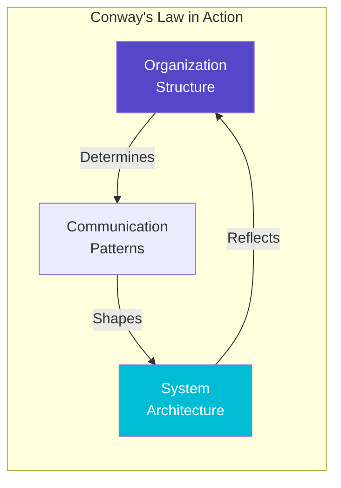
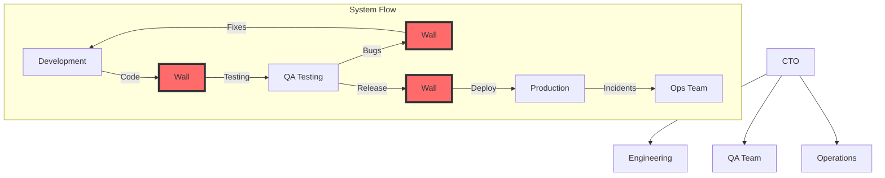
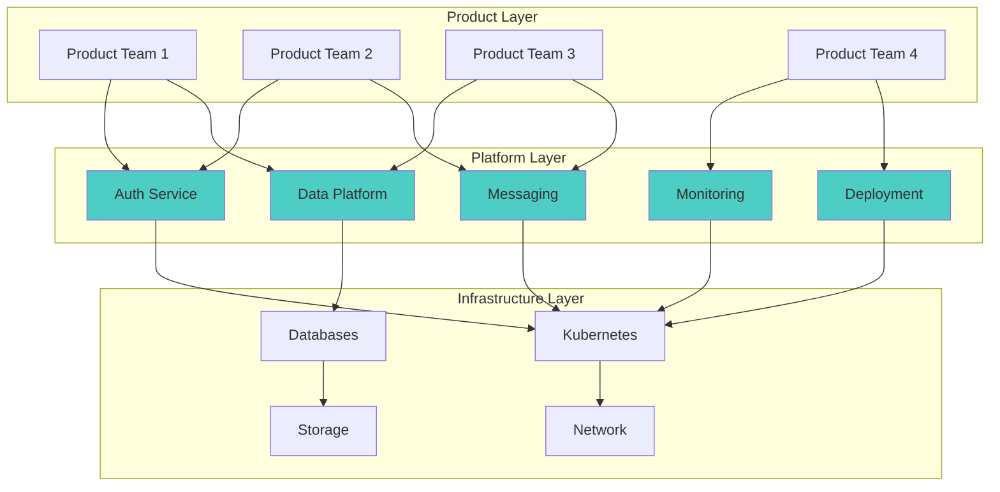

# Org-Structure Physics

**Conway's Law in action: You ship your org chart**

## Conway's Law

"Organizations produce designs that copy their communication structures." - Conway, 1967

Not a suggestion. It's physics.

## Why Conway's Law is Inevitable

### Communication Bandwidth Reality

| Communication Type | Bandwidth | Latency | Example |
|-------------------|-----------|---------|----------|
| **Same Desk** | 100 Mbps | ~0ms | Tap shoulder, instant response |
| **Same Team** | 10 Mbps | <5min | Slack DM, quick call |
| **Cross-Team** | 1 Mbps | <1hr | Scheduled meeting, JIRA ticket |
| **Cross-Org** | 100 Kbps | <1day | Email chains, formal requests |
| **Cross-Company** | 10 Kbps | <1week | Contracts, SLAs, APIs |

### The Physics of Organizational Gravity



| Organizational Distance | Interface Type | Coordination Cost | Change Velocity |
|------------------------|----------------|-------------------|------------------|
| **Same Team** | Function call | Minutes | Hours |
| **Adjacent Teams** | Internal API | Hours | Days |
| **Different Divisions** | Versioned API | Days | Weeks |
| **External Partners** | Public API + SLA | Weeks | Months |

## Organizational Patterns

### 1. Functional Organization



**System Architecture:**
- Dev throws code over wall to QA
- QA throws bugs back to Dev
- Ops throws incidents back to everyone

**Result:** Waterfall process, slow delivery

### 2. Product Teams

```mermaid
graph TB
    PO[Product Organization]
    
    subgraph "Cross-Functional Teams"
        subgraph "Team A"
            A_FE[Frontend]
            A_BE[Backend]
            A_DB[Database]
            A_OPS[DevOps]
        end
        
        subgraph "Team B"
            B_FE[Frontend]
            B_BE[Backend]
            B_DB[Database]
            B_OPS[DevOps]
        end
        
        subgraph "Team C"
            C_FE[Frontend]
            C_BE[Backend]
            C_DB[Database]
            C_OPS[DevOps]
        end
    end
    
    PO --> Team A
    PO --> Team B
    PO --> Team C
    
    subgraph "System Architecture"
        SA[Service A] <-->|API| SB[Service B]
        SB <-->|API| SC[Service C]
        SA <-->|API| SC
    end
    
    Team A -.->|Owns| SA
    Team B -.->|Owns| SB
    Team C -.->|Owns| SC
    
    style SA fill:#95e1d3
    style SB fill:#f7dc6f
    style SC fill:#bb8fce
```

**System Architecture:**
- Service A (owned by Team A)
- Service B (owned by Team B)
- Service C (owned by Team C)
- APIs between services

**Result:** Microservices, clear ownership

### 3. Platform Model



**System Architecture:**
- Standardized platform APIs
- Self-service infrastructure
- Clear abstraction layers

**Result:** Scalable development

### 4. Matrix Organization

```text
   Feature Teams ←→ Component Teams
        ↓               ↓
   Product Focus    Technical Focus
```

**System Architecture:**
- Shared components
- Complex dependencies
- Conflicting priorities

**Result:** Coordination overhead

## Team Topologies

### Stream-Aligned Teams
**Purpose:** Deliver value streams
- Own entire feature/product
- Direct customer value
- 5-9 people
- One domain focus

### Platform Teams
**Purpose:** Enable stream teams
- Build internal products
- Self-service APIs
- Success = adoption rate

### Enabling Teams
**Purpose:** Help teams adopt practices
- Coaching mode
- 3-6 month engagements
- Goal: self-sufficiency

### Complicated Subsystem Teams
**Purpose:** Own complex domains
- Deep expertise (ML, crypto, codecs)
- Simple API hiding complexity

## Communication Patterns

### Team Interaction Modes

**1. Collaboration**: Fuzzy boundaries, innovation
**2. X-as-a-Service**: Clear API, execution
**3. Facilitating**: Coaching, temporary

### Choosing Interaction Modes

```python
def select_interaction_mode(context):
    if context.exploring_new_tech:
        return "collaboration"
    elif context.established_pattern:
        return "x-as-a-service"
    elif context.capability_gap:
        return "facilitating"
```

## The Inverse Conway Maneuver

### Definition

Deliberately structuring teams to achieve desired architecture.

### Process

1. **Design target architecture**
   ```text
   Ideal System Architecture
   ├── User Service
   ├── Order Service
   ├── Payment Service
   └── Notification Service
   ```

2. **Create matching org structure**
   ```
   Engineering Organization
   ├── User Team
   ├── Order Team
   ├── Payment Team
   └── Notification Team
   ```

3. **Let Conway's Law work**
   - Teams naturally build their services
   - Interfaces emerge at team boundaries
   - Architecture follows organization

### Example: Monolith to Microservices

**Before:**
```
Single Team → Monolith
```
**Transition:**
```python
# 1. Identify bounded contexts
contexts = [
    "user_management",
    "order_processing",
    "payment_handling",
    "notifications"
]

# 2. Create teams per context
for context in contexts:
    create_team(
        name=f"{context}_team",
        members=5,
        ownership=context
    )

# 3. Teams extract their services
# Architecture emerges naturally
```

**After:**
```
User Team → User Service
Order Team → Order Service  
Payment Team → Payment Service
Notification Team → Notification Service
```
## Anti-Patterns Recognition Matrix

| Anti-Pattern | Symptoms | Impact | Fix |
|--------------|----------|--------|-----|
| **Misaligned Architecture** | • Cross-team deps everywhere<br/>• Constant coordination meetings<br/>• Blocked on other teams | 5-10x slower delivery | Align boundaries |
| **Shared Ownership** | • "Everyone" owns it<br/>• No one on-call<br/>• Decays until crisis | Zero accountability | Single owner |
| **Cognitive Overload** | • Team owns 10+ services<br/>• Different domains<br/>• Context switching | 80% efficiency loss | Focus domains |
| **Ping-Pong Handoffs** | • Work crosses 5+ teams<br/>• 6-month features<br/>• Blame game | 10x cycle time | Stream-aligned teams |

### Visual Anti-Pattern Detection

```mermaid
graph TB
    subgraph "🔴 Anti-Pattern: Shared Service"
        S[Shared Service] --> T1[Team 1: 30% ownership]
        S --> T2[Team 2: 30% ownership]
        S --> T3[Team 3: 40% ownership]
        S --> FAIL[❌ No one accountable]
    end
    
    subgraph "✅ Pattern: Clear Ownership"
        S2[Service] --> OT[Owner Team: 100%]
        OT --> API[Clear API for others]
    end
    
    style FAIL fill:#ff5252,color:#fff
    style OT fill:#4caf50,color:#fff
```



## Scaling Patterns

### Dunbar's Number

Cognitive limit for relationships: ~150 people

**Implications:**
```
Team: 5-9 people (deep trust)
  ↓
Tribe: 50-150 people (know everyone)
  ↓
Division: 500-1500 people (know of everyone)
  ↓
Company: Federated divisions
```bash
### Scaling Models

**1. Spotify Model**
```
Squad (team) → Tribe (collection) → Guild (practice)
                                    ↓
                                Chapter (expertise)
```text
**2. Amazon Model**
```
Two-Pizza Team → Single-threaded owner → Full P&L
                                         ↓
                                    Service API
```text
**3. Google Model**
```
Small Team → Tech Lead/Manager → Director → VP
             ↓
        Engineering Excellence (SRE, EngProd)
```bash
## Organizational Health Dashboard

### Team Effectiveness Metrics

| Metric | Elite | High | Medium | Low | Your Team |
|--------|-------|------|--------|-----|----------|
| **Deploy Frequency** | Multiple/day | Daily | Weekly | Monthly | _____|
| **Lead Time** | <1 hour | <1 day | <1 week | >1 month | _____|
| **MTTR** | <1 hour | <1 day | <1 week | >1 week | _____|
| **Change Failure** | <5% | <10% | <15% | >15% | _____|
| **Meeting Load** | <20% | <30% | <40% | >40% | _____|
| **Cross-team Deps** | 0-1 | 2-3 | 4-5 | >5 | _____|

### Communication Overhead Analysis

```mermaid
graph LR
    subgraph "Meeting Load by Team Type"
        A[Stream-aligned<br/>20% meetings] --> GOOD[✅ High velocity]
        B[Platform<br/>30% meetings] --> OK[⚠️ Acceptable]
        C[Matrix org<br/>60% meetings] --> BAD[❌ Low output]
    end
    
    style GOOD fill:#4caf50,color:#fff
    style OK fill:#ff9800,color:#fff
    style BAD fill:#f44336,color:#fff
```



### Conway Alignment Score

| Alignment Indicator | Score | Status |
|-------------------|-------|--------|
| **Single service ownership** | +10 | ✅ |
| **Team owns full stack** | +10 | ✅ |
| **<3 external dependencies** | +10 | ✅ |
| **Clear API boundaries** | +10 | ✅ |
| **Shared service ownership** | -20 | ❌ |
| **Cross-team blockers** | -15 | ❌ |
| **>5 team dependencies** | -25 | ❌ |

**Total Score: _____ / 40** (Target: >30)
## Best Practices

1. **Design Organization Intentionally**: Org = architecture, plan together

2. **Minimize Cognitive Load**: One team, one domain, clear boundaries

3. **Optimize Communication**: Colocate for collab, APIs for execution

4. **Enable Team Autonomy**: Full ownership, minimal dependencies

5. **Evolve Thoughtfully**: Changes expensive, plan carefully

## Case Study: Ride-Sharing Transformation

### Before: Functional Silos

```mermaid
graph LR
    subgraph "❌ 3-Month Feature Cycle"
        REQ[Feature Request] --> MOBILE[Mobile Team<br/>2 weeks]
        MOBILE --> BACKEND[Backend Team<br/>4 weeks wait + 2 weeks work]
        BACKEND --> DATA[Data Team<br/>3 weeks wait + 1 week work]
        DATA --> QA[QA Team<br/>2 weeks]
        QA --> RELEASE[Finally Released]
    end
    
    style REQ fill:#ff5252
    style RELEASE fill:#ff5252
```



### After: Stream-Aligned Teams

```mermaid
graph TB
    subgraph "✅ 2-Week Feature Cycle"
        subgraph "Rider Team"
            RM[Mobile Dev]
            RB[Backend Dev]
            RD[Data Engineer]
            RM <--> RB <--> RD
        end
        
        subgraph "Services"
            RS[Rider Service]
            DS[Driver Service]
            MS[Matching Service]
        end
        
        "Rider Team" --> RS
    end
    
    style RS fill:#4caf50,color:#fff
```

### Transformation Metrics

| Metric | Before (Functional) | After (Stream-aligned) | Improvement |
|--------|---------------------|------------------------|-------------|
| **Feature Cycle** | 12 weeks | 2 weeks | 6x faster |
| **Deploy Frequency** | Monthly | Daily | 30x more |
| **Team Handoffs** | 6-8 per feature | 0-1 per feature | 87% fewer |
| **Meeting Hours/Week** | 15 hours | 5 hours | 67% less |
| **Team Satisfaction** | 6.0/10 | 8.5/10 | 42% higher |
| **Incident Response** | 2 hours | 15 minutes | 8x faster |

## Key Takeaways

- **Conway's Law is inevitable** - Work with it, not against it
- **Team Topologies matter** - Choose patterns that fit your goals
- **Cognitive load is real** - Respect human limitations
- **Architecture follows organization** - Design both together
- **Communication paths define systems** - Optimize for flow

Remember: You can't fight Conway's Law, but you can use it to your advantage. Design your organization to build the system you want.
