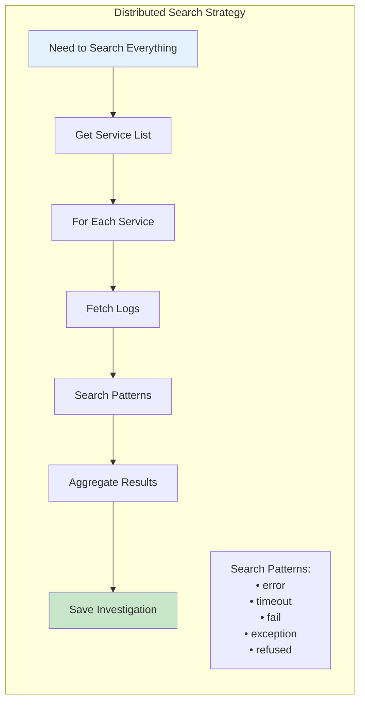
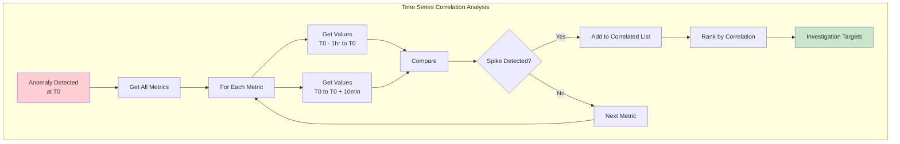
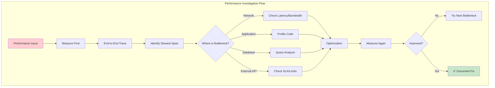
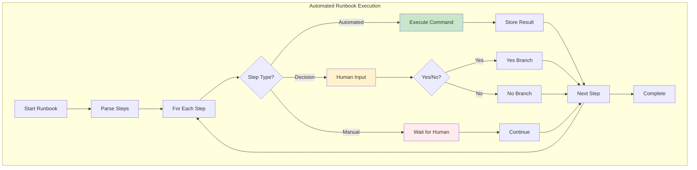
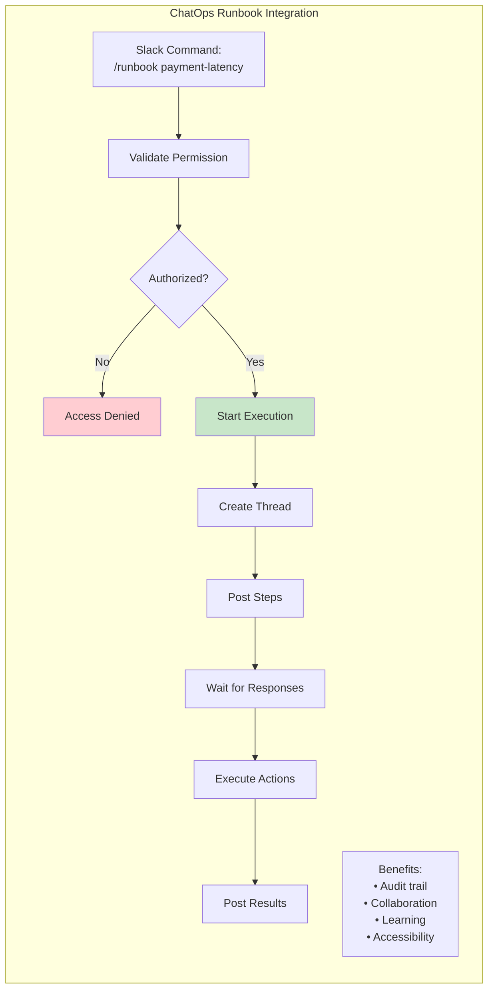
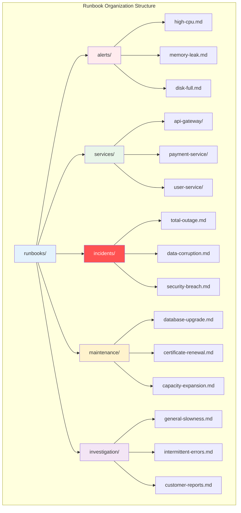
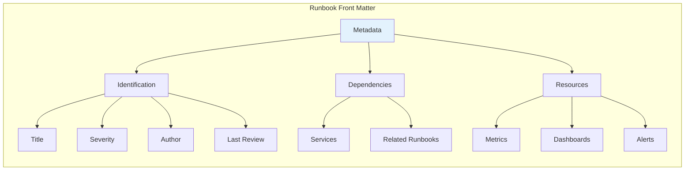
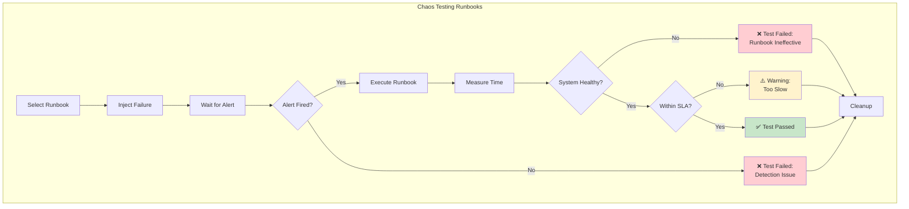
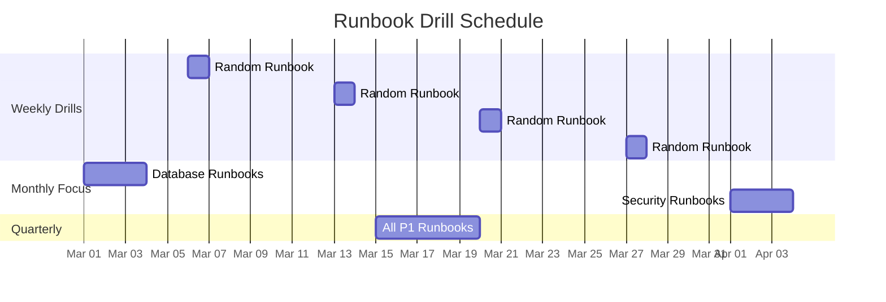

# Runbooks & Playbooks


## Overview

Runbooks & Playbooks
description: 'Think: Runbook = Recipe, Playbook = Cooking principles'
type: human-factors
difficulty: intermediate
reading_time: 55 min
prerequisites:
- laws/axiom4-tradeoffs
- laws/axiom6-human-api
- laws/axiom7-economics
status: complete
last_updated: 2025-07-20
---


# Runbooks & Playbooks

## Table of Contents

- [What's the Difference? Anatomy of a Great Runbook](#anatomy-of-a-great-runbook)
  - [Essential Components](#essential-components)
- [Service: Payment Gateway High Latency](#service-payment-gateway-high-latency)
- [Quick Actions (First 5 minutes)](#quick-actions-first-5-minutes)
- [Symptoms](#symptoms)
- [Immediate Mitigation](#immediate-mitigation)
- [1.

**Reading time:** ~13 minutes

## Table of Contents

- [What's the Difference?](#whats-the-difference)
- [Anatomy of a Great Runbook](#anatomy-of-a-great-runbook)
  - [Essential Components](#essential-components)
- [Service: Payment Gateway High Latency](#service-payment-gateway-high-latency)
- [Quick Actions (First 5 minutes)](#quick-actions-first-5-minutes)
- [Symptoms](#symptoms)
- [Immediate Mitigation](#immediate-mitigation)
- [1. Increase timeout temporarily](#1-increase-timeout-temporarily)
- [2. Enable circuit breaker](#2-enable-circuit-breaker)
- [3. Switch to degraded mode](#3-switch-to-degraded-mode)
- [Investigation Steps](#investigation-steps)
- [Resolution Paths](#resolution-paths)
  - [Path A: Database Overload](#path-a-database-overload)
  - [Path B: Third-party API Degradation](#path-b-third-party-api-degradation)
  - [Path C: Memory Pressure](#path-c-memory-pressure)
- [Rollback Procedures](#rollback-procedures)
- [Revert to last known good version](#revert-to-last-known-good-version)
- [Verification](#verification)
- [Follow-up Actions](#follow-up-actions)
  - [Key Elements](#key-elements)
- [Runbook Best Practices](#runbook-best-practices)
  - [1. Test Under Stress](#1-test-under-stress)
- [Commands must be copy-pasteable](#commands-must-be-copy-pasteable)
- [Links must work](#links-must-work)
- [Conditions must be measurable](#conditions-must-be-measurable)
  - [2. Keep Updated](#2-keep-updated)
- [runbook-freshness.yaml](#runbook-freshnessyaml)
- [Check all runbooks for staleness](#check-all-runbooks-for-staleness)
- [Verify all commands still valid](#verify-all-commands-still-valid)
  - [3. Runbook Driven Development](#3-runbook-driven-development)
- [1. Write runbook](#1-write-runbook)
- [2. Implement monitoring from runbook](#2-implement-monitoring-from-runbook)
- [3. Build dashboards](#3-build-dashboards)
- [4. Implement feature](#4-implement-feature)
- [5. Verify runbook](#5-verify-runbook)
- [Playbook Patterns](#playbook-patterns)
  - [Investigation Playbook](#investigation-playbook)
- [General Investigation Playbook](#general-investigation-playbook)
- [Start Wide, Narrow Down](#start-wide-narrow-down)
  - [1. Establish Timeline](#1-establish-timeline)
  - [2. What Changed?](#2-what-changed)
- [Recent deploys](#recent-deploys)
- [Config changes](#config-changes)
- [Infrastructure events](#infrastructure-events)
  - [3. Blast Radius](#3-blast-radius)
  - [4. Correlation Hunt](#4-correlation-hunt)
- [Investigation Tools](#investigation-tools)
  - [Distributed Grep](#distributed-grep)
  - [Time Series Correlation](#time-series-correlation)
  - [Hypothesis Testing](#hypothesis-testing)
  - [Performance Playbook](#performance-playbook)
- [Performance Investigation Playbook](#performance-investigation-playbook)
- [Measure First](#measure-first)
  - [2. Component Breakdown](#2-component-breakdown)
  - [3. Resource Saturation](#3-resource-saturation)
- [Common Bottlenecks](#common-bottlenecks)
  - [N+1 Queries](#n1-queries)
  - [Lock Contention](#lock-contention)
  - [GC Pauses](#gc-pauses)
- [Check GC logs](#check-gc-logs)
  - [Incident Command Playbook](#incident-command-playbook)
- [Major Incident Commander Playbook](#major-incident-commander-playbook)
- [Immediate Actions (First 5 Minutes)](#immediate-actions-first-5-minutes)
- [Running the Incident](#running-the-incident)
  - [Battle Rhythm](#battle-rhythm)
  - [Decision Framework](#decision-framework)
  - [Communication Templates](#communication-templates)
- [Incident Roles](#incident-roles)
  - [Incident Commander](#incident-commander)
  - [Tech Lead](#tech-lead)
  - [Scribe](#scribe)
  - [Communications Lead](#communications-lead)
- [Automation Integration](#automation-integration)
  - [Executable Runbooks](#executable-runbooks)
  - [Executable Runbooks](#executable-runbooks)
  - [ChatOps Integration](#chatops-integration)
  - [ChatOps Integration](#chatops-integration)
- [Runbook Library Structure](#runbook-library-structure)
  - [Organization](#organization)
- [Runbook Library Structure](#runbook-library-structure)
  - [Organization](#organization)
  - [Runbook Metadata](#runbook-metadata)
  - [Runbook Metadata](#runbook-metadata)
- [Testing Runbooks](#testing-runbooks)
  - [Chaos Day Validation](#chaos-day-validation)
- [Testing Runbooks](#testing-runbooks)
  - [Chaos Day Validation](#chaos-day-validation)
  - [Regular Drills](#regular-drills)
  - [Regular Drills](#regular-drills)
- [Best Practices](#best-practices)
- [Metrics for Runbooks](#metrics-for-runbooks)
- [Key Takeaways](#key-takeaways)


**Turning chaos into checklist**

## What's the Difference?

**Runbook**: Step-by-step for specific scenarios ("If X, do Y")
**Playbook**: Strategic guide for problem classes ("For X-like situations, consider Y, Z")

Runbook = Recipe, Playbook = Cooking principles

## Anatomy of a Great Runbook

### Essential Components

```markdown
## Service: Payment Gateway High Latency

## Quick Actions (First 5 minutes)
1. Check dashboard: https://dash.internal/payments
2. Verify not a monitoring false positive
3. Page secondary on-call if >1000ms p99

## Symptoms
- Alert: "payment_gateway_p99_latency > 500ms"
- User reports: "Checkout is slow"
- Metrics: Latency spike on payment-service

## Immediate Mitigation
```bash
## 1. Increase timeout temporarily
kubectl set env deployment/api-gateway PAYMENT_TIMEOUT=5000

## 2. Enable circuit breaker
curl -X POST https://admin/circuit-breaker/payment/enable

## 3. Switch to degraded mode
./scripts/enable-cached-payment-tokens.sh
```proto
## Investigation Steps
1. **Check upstream dependencies**
   ```sql
   SELECT service, avg(latency), count(*)
   FROM traces
   WHERE parent_service = 'payment-gateway'
   AND timestamp > NOW() - INTERVAL '10 minutes'
   GROUP BY service
   ORDER BY avg(latency) DESC;
   ```

2. **Examine error logs**
   ```bash
   kubectl logs -l app=payment-gateway --since=10m | grep ERROR
   ```

3. **Database connection pool**
   ```bash
   curl https://payment-gateway:9090/metrics | grep db_connections
   ```

## Resolution Paths

### Path A: Database Overload
If: Connection pool exhausted or DB CPU > 80%
Then:
1. Increase connection pool: `POOL_SIZE=100`
2. Enable read replicas: `USE_READ_REPLICA=true`
3. Kill long-running queries: `SELECT pg_terminate_backend(pid) FROM pg_stat_activity WHERE query_time > interval '5 minutes'`

### Path B: Third-party API Degradation
If: External payment processor latency > 2s
Then:
1. Switch to secondary processor
2. Enable async processing mode
3. Contact vendor: support@processor.com

### Path C: Memory Pressure
If: Memory usage > 90%
Then:
1. Trigger garbage collection
2. Restart with higher heap
3. Investigate memory leak

## Rollback Procedures
Last resort if mitigation fails:
```bash
## Revert to last known good version
./deploy/rollback.sh payment-gateway

## Verification
curl https://payment-gateway/health | jq .version
```bash
## Follow-up Actions
- [ ] Create incident ticket
- [ ] Update status page
- [ ] Schedule postmortem
- [ ] Check SLO impact
```

### Key Elements

1. **Urgency gradient**: Quick actions first
2. **Clear symptoms**: Recognition patterns
3. **Copy-paste commands**: No thinking
4. **Decision trees**: If-then logic
5. **Rollback procedures**: Escape hatch
6. **Follow-up**: Post-fire actions

## Runbook Best Practices

### 1. Test Under Stress

Your brain at 3 AM needs:

```python
class RunbookValidator:
    def test_runbook(self, runbook_path):
        checks = []

## Commands must be copy-pasteable
        commands = extract_code_blocks(runbook_path)
        for cmd in commands:
            if has_placeholder(cmd):
                checks.append(f"Command has placeholder: {cmd}")

## Links must work
        links = extract_links(runbook_path)
        for link in links:
            if not is_reachable(link):
                checks.append(f"Dead link: {link}")

## Conditions must be measurable
        if_thens = extract_conditionals(runbook_path)
        for condition in if_thens:
            if not is_measurable(condition):
                checks.append(f"Vague condition: {condition}")

        return checks
```

### 2. Keep Updated

```yaml
## runbook-freshness.yaml
apiVersion: batch/v1
kind: CronJob
metadata:
  name: runbook-freshness-check
spec:
  schedule: "0 9 * * MON"  # Weekly
  jobTemplate:
    spec:
      template:
        spec:
          containers:
          - name: checker
            image: runbook-validator:latest
            command:
            - python
            - -c
            - |
## Check all runbooks for staleness
              for runbook in /runbooks/*.md:
                  last_modified = get_last_modified(runbook)
                  if days_ago(last_modified) > 90:
                      alert_team(f"{runbook} not updated in 90+ days")

## Verify all commands still valid
                  test_runbook_commands(runbook)
```

### 3. Runbook Driven Development

Write runbook first:

```python
def implement_feature(feature_name):
## 1. Write runbook
    runbook = write_operational_guide(feature_name)

## 2. Implement monitoring from runbook
    for alert in runbook.alerts_needed:
        implement_alert(alert)

## 3. Build dashboards
    for metric in runbook.key_metrics:
        add_to_dashboard(metric)

## 4. Implement feature
    implement_actual_feature(feature_name)

## 5. Verify runbook
    chaos_test_with_runbook(feature_name, runbook)
```

## Playbook Patterns

### Investigation Playbook

For when you don't know what's wrong:

```markdown
## General Investigation Playbook

## Start Wide, Narrow Down

### 1. Establish Timeline
- When did it start? Check:
  - Alert history
  - Deploy log
  - User reports
  - Metric discontinuities

### 2. What Changed?
```bash
## Recent deploys
kubectl get deployments -A -o json | \
  jq '.items[] | select(.metadata.creationTimestamp > (now - 3600))'

## Config changes
git log --since="2 hours ago" -- config/

## Infrastructure events
aws ec2 describe-instances --filters "Name=launch-time,Values=>2024-01-01"
```bash
### 3. Blast Radius
- Which services affected?
- Which regions?
- Which customers?
- Percentage impact?

### 4. Correlation Hunt
Look for patterns:
- Time correlation (every hour? daily?)
- Load correlation (traffic spikes?)
- Dependency correlation (after X, Y fails?)
- Customer correlation (specific accounts?)

## Investigation Tools

### Distributed Grep
When you need to search everywhere:



**Distributed Search Commands:**

| Scope | Command | Use Case |
|-------|---------|----------|  
| **All Services** | `for svc in $(kubectl get deploy -o name); do kubectl logs -l app=$svc --since=1h \| grep -i "error\|timeout"; done` | Unknown error source |
| **By Namespace** | Add `-n namespace` | Isolate to environment |
| **Time Window** | `--since=2h` | Recent issues only |
| **Severity** | Add `\| grep -E 'CRITICAL\|ERROR'` | High priority only |
| **Save Results** | `\| tee investigation-$(date +%s).log` | Document findings |

### Time Series Correlation



**Correlation Detection Patterns:**

| Pattern | Detection Method | Likely Cause |
|---------|-----------------|---------------|
| **Simultaneous Spike** | Same timestamp ±30s | Direct causation |
| **Cascade Pattern** | Sequential spikes | Dependency chain |
| **Inverse Correlation** | One up, one down | Resource competition |
| **Periodic Match** | Same frequency | Shared root cause |

### Hypothesis Testing
1. Form hypothesis: "DB connection exhaustion"
2. Make prediction: "Connection count = max"
3. Test: Check metric
4. If false, next hypothesis
```

### Performance Playbook

When things are slow:

```markdown
## Performance Investigation Playbook

## Measure First
Never assume - always measure:



**Performance Measurement Commands:**

| Layer | Command | Measures |
|-------|---------|----------|  
| **End-to-End** | `curl -w "@curl-format.txt" -o /dev/null URL` | Total time breakdown |
| **Network** | `mtr --report URL` | Packet loss, latency |
| **Application** | Enable profiler endpoint | CPU, memory hotspots |
| **Database** | `EXPLAIN ANALYZE query` | Query execution plan |
| **External APIs** | Check APM traces | Third-party latency |

### 2. Component Breakdown
- Network time (DNS, TLS, transfer)
- Gateway processing
- Service processing
- Database query time
- Response serialization

### 3. Resource Saturation
Check the USE method:
- **Utilization**: How busy?
- **Saturation**: How much queuing?
- **Errors**: What's failing?

For each resource:
- CPU: %used, run queue, throttles
- Memory: %used, page faults, OOM kills
- Disk: %busy, queue depth, errors
- Network: %bandwidth, drops, retransmits

## Common Bottlenecks

### N+1 Queries
Symptom: Linear performance degradation

```mermaid
flowchart LR
    subgraph "N+1 Query Detection"
        A[Performance Degradation] --> B[Linear with Load?]
        B -->|Yes| C[Check Query Logs]
        C --> D[Group by Template]
        D --> E{Repeated Queries?}
        E -->|Yes| F[N+1 Problem Found]
        F --> G[Fix: Batch Loading]
        
        H[Example Pattern:<br/>SELECT * FROM users WHERE id = ?<br/>Called 100 times<br/>Should be: WHERE id IN (?, ?, ...)]
    end
    
    style F fill:#ffcdd2
    style G fill:#c8e6c9
```

**Common Performance Bottlenecks:**

| Bottleneck | Symptoms | Detection Query | Fix |
|------------|----------|----------------|-----|
| **N+1 Queries** | Linear degradation | Count query frequency | Batch fetch |
| **Lock Contention** | Spiky latency | Check pg_locks | Reduce lock scope |
| **GC Pauses** | Periodic freezes | GC logs analysis | Tune heap size |
| **Connection Exhaustion** | Timeouts | Pool metrics | Increase pool |

### Lock Contention
Symptom: Spiky latency
```sql
-- PostgreSQL lock analysis
SELECT
    waiting.pid AS waiting_pid,
    waiting.query AS waiting_query,
    blocking.pid AS blocking_pid,
    blocking.query AS blocking_query
FROM pg_stat_activity AS waiting
JOIN pg_stat_activity AS blocking
    ON blocking.pid = ANY(pg_blocking_pids(waiting.pid))
WHERE waiting.wait_event_type = 'Lock';
```bash
### GC Pauses
Symptom: Periodic freezes
```bash
## Check GC logs
grep "Full GC" app.log | awk '{print $10}' | stats
```bash
```

### Incident Command Playbook

For managing major incidents:

```markdown
## Major Incident Commander Playbook

## Immediate Actions (First 5 Minutes)

1. **Assess Severity**
   - Customer impact (how many?)
   - Revenue impact ($$$/minute?)
   - Data risk (any corruption?)
   - Security risk (breach possible?)

2. **Establish Command**
   - Declare self as IC
   - Start incident channel/bridge
   - Assign roles:
     - Technical lead
     - Communications lead
     - Scribe

3. **Communicate**
   - Status page: "Investigating issues"
   - Stakeholder notification
   - Support team briefing

## Running the Incident

### Battle Rhythm
Every 15 minutes:
1. Status check from tech lead
2. Update stakeholders
3. Re-assess severity
4. Check on team health

### Decision Framework
For any proposed action:
- What's the risk?
- What's the rollback?
- How long to implement?
- How long to verify?

### Communication Templates

**Initial Report:**
"We are investigating [ISSUE] affecting [SERVICE].
Impact: [CUSTOMER IMPACT].
Started: [TIME].
Team is engaged.
Updates every 15 min."

**Update:**
"[TIME] update on [ISSUE]:
Current status: [WHAT WE KNOW]
Actions taken: [WHAT WE DID]
Next steps: [WHAT'S NEXT]
ETA: [REALISTIC ESTIMATE]"

**Resolution:**
"[ISSUE] has been resolved as of [TIME].
Root cause: [BRIEF EXPLANATION]
Duration: [TOTAL TIME]
Impact: [FINAL NUMBERS]
Postmortem to follow."

## Incident Roles

### Incident Commander
- Makes decisions
- Manages priorities
- External communication
- DOES NOT debug

### Tech Lead
- Leads investigation
- Coordinates fixers
- Reports to IC
- DOES debug

### Scribe
- Documents everything
- Maintains timeline
- Captures decisions
- Silent observer

### Communications Lead
- Updates status page
- Handles stakeholders
- Drafts messaging
- Shields tech team
```bash
## Automation Integration

### Executable Runbooks

```python
### Executable Runbooks



**Runbook Automation Levels:**

| Level | Description | Human Involvement | Example |
|-------|-------------|------------------|------|
| **Full Auto** | No human needed | Monitor only | Restart service |
| **Semi-Auto** | Human decisions | Key decisions | Database failover |
| **Guided Manual** | Human executes | Follow prompts | Complex recovery |
| **Reference Only** | Human interprets | Full control | Investigation |

### ChatOps Integration

### ChatOps Integration



**ChatOps Commands:**

| Command | Purpose | Permission | Example |
|---------|---------|------------|------|
| `/runbook list` | Show available | Read | Lists all runbooks |
| `/runbook <name>` | Execute runbook | Execute | Start guided execution |
| `/runbook status` | Check progress | Read | Show active runbooks |
| `/runbook abort` | Stop execution | Execute | Emergency stop |

## Runbook Library Structure

### Organization

```
## Runbook Library Structure

### Organization



**Runbook Naming Convention:**

| Category | Format | Example | When to Use |
|----------|--------|---------|-------------|  
| **Alerts** | `<metric>-<condition>.md` | `cpu-high.md` | Alert fired |
| **Services** | `<service>/<scenario>.md` | `payment/latency.md` | Service issue |
| **Incidents** | `<severity>-<type>.md` | `sev1-outage.md` | Major incident |
| **Maintenance** | `<task>-<frequency>.md` | `backup-daily.md` | Planned work |
| **Investigation** | `<symptom>-investigation.md` | `slow-api-investigation.md` | Unknown issue |

### Runbook Metadata

### Runbook Metadata

**Runbook Metadata Template:**



| Field | Purpose | Example | Required |
|-------|---------|---------|----------|
| **title** | Human-readable name | "Payment Service High Latency" | Yes |
| **severity** | Priority level | P1, P2, P3 | Yes |
| **services** | Affected services | [payment, gateway] | Yes |
| **author** | Team ownership | payment-team | Yes |
| **last_reviewed** | Freshness tracking | 2024-03-01 | Yes |
| **related_runbooks** | See also | [db-issues, api-timeout] | No |
| **metrics** | Key indicators | [p99_latency, error_rate] | Yes |
| **dashboards** | Visual tools | [grafana links] | Yes |

## Testing Runbooks

### Chaos Day Validation

## Testing Runbooks

### Chaos Day Validation



**Chaos Test Schedule:**

| Runbook Type | Test Frequency | Environment | Duration |
|--------------|---------------|-------------|----------|  
| **Critical (P1)** | Weekly | Staging | < 5 min |
| **Important (P2)** | Bi-weekly | Staging | < 15 min |
| **Standard (P3)** | Monthly | Dev | < 30 min |
| **New Runbooks** | Before merge | All | Varies |
| **Post-Incident** | Within 48hr | Staging | Match SLA |

### Regular Drills

### Regular Drills



**Drill Execution Protocol:**

| Phase | Action | Time | Success Criteria |
|-------|--------|------|------------------|
| **Announce** | "Drill starting in 5 min" | T-5 | Team aware |
| **Start** | Trigger scenario | T+0 | Alert fires |
| **Execute** | Follow runbook | T+5 | Steps completed |
| **Verify** | Check resolution | T+20 | System healthy |
| **Debrief** | Lessons learned | T+30 | Improvements noted |
| **Update** | Fix runbook issues | T+60 | PR submitted |

## Best Practices

1. **Write for Tired Self**: Zero context, copy-paste commands, verification steps

2. **Test Regularly**: Monthly review, quarterly drill, post-incident updates

3. **Version Control**: Git, tags, reviews

4. **Link Everything**: Dashboards, related runbooks, docs

5. **Measure Success**: TTR, usage rate, success rate

## Metrics for Runbooks

```sql
-- Runbook effectiveness
SELECT
    runbook_name,
    COUNT(*) as times_used,
    AVG(time_to_resolution) as avg_ttr,
    SUM(CASE WHEN outcome = 'success' THEN 1 ELSE 0 END) / COUNT(*) as success_rate,
    MAX(last_updated) as last_update
FROM runbook_executions
WHERE timestamp > NOW() - INTERVAL '90 days'
GROUP BY runbook_name
ORDER BY times_used DESC;
```

## Key Takeaways

- **Runbooks save lives** - And sleep, and weekends
- **Test under stress** - 3 AM you is not smart
- **Automate what you can** - But keep human judgment
- **Update constantly** - Stale runbooks are dangerous
- **Practice makes perfect** - Regular drills matter

Remember: The best runbook is the one you don't need because you automated the problem away. The second best is the one that works at 3 AM when you're half asleep.