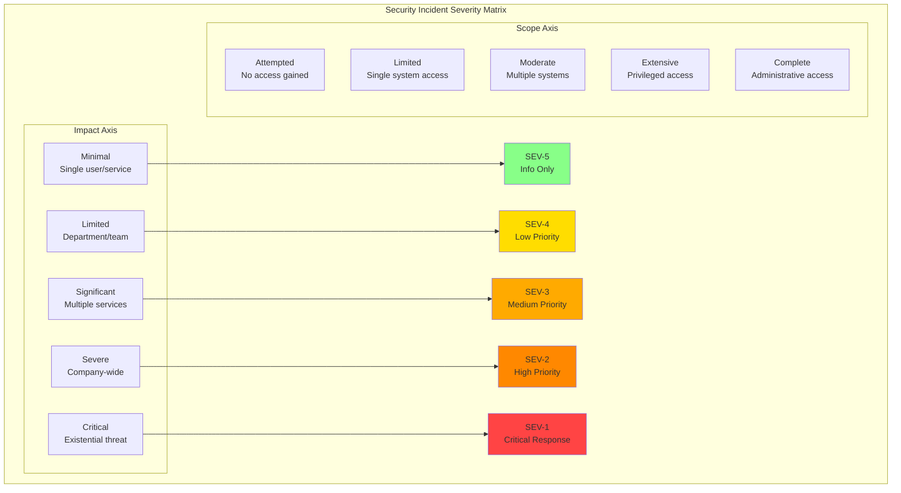

# Security Incident Response for Distributed Systems

**Building comprehensive security incident response capabilities for modern distributed architectures**

> *"In security incident response, speed and accuracy are equally critical—move fast but preserve evidence, contain damage but maintain forensic integrity."*

---

## Security Incident Response Framework

Security incidents in distributed systems require specialized response procedures that balance rapid containment with forensic preservation.

### Security Incident Classification



### Security Incident Types in Distributed Systems

```python
class SecurityIncidentClassifier:
    """Classify and route security incidents based on distributed system context"""
    
    def __init__(self):
        self.incident_patterns = self.load_incident_patterns()
        self.threat_intelligence = ThreatIntelligenceEngine()
        self.system_topology = SystemTopologyAnalyzer()
    
    def classify_incident(self, incident_data):
        """Classify security incident and determine response requirements"""
        
        # Extract incident characteristics
        characteristics = self.extract_incident_characteristics(incident_data)
        
        # Match against known attack patterns
        attack_pattern = self.identify_attack_pattern(characteristics)
        
        # Assess distributed system specific risks
        distributed_risks = self.assess_distributed_risks(incident_data)
        
        # Determine response requirements
        response_requirements = self.determine_response_requirements(
            attack_pattern, distributed_risks, characteristics
        )
        
        classification = {
            'incident_type': attack_pattern.type,
            'severity': self.calculate_severity(characteristics, distributed_risks),
            'scope': self.assess_scope(incident_data),
            'threat_actor': self.identify_threat_actor(characteristics),
            
            'distributed_system_risks': {
                'lateral_movement_risk': distributed_risks.lateral_movement,
                'data_exfiltration_risk': distributed_risks.data_exfiltration,
                'service_disruption_risk': distributed_risks.service_disruption,
                'supply_chain_risk': distributed_risks.supply_chain
            },
            
            'response_requirements': {
                'forensic_preservation': response_requirements.forensics,
                'immediate_containment': response_requirements.containment,
                'threat_hunting': response_requirements.hunting,
                'external_notifications': response_requirements.notifications,
                'legal_involvement': response_requirements.legal
            },
            
            'estimated_impact': {
                'business_impact': self.estimate_business_impact(incident_data),
                'customer_impact': self.estimate_customer_impact(incident_data),
                'compliance_impact': self.assess_compliance_impact(incident_data),
                'reputation_impact': self.assess_reputation_impact(incident_data)
            }
        }
        
        return classification

# Common distributed systems security incident types
security_incident_types = {
    "lateral_movement": {
        "description": "Attacker moving between services/containers",
        "indicators": ["unusual service-to-service calls", "privilege escalation", "credential usage patterns"],
        "distributed_risks": ["full infrastructure compromise", "data access across services"],
        "response_priority": "high",
        "containment_strategy": "micro-segmentation_enforcement"
    },
    
    "supply_chain_compromise": {
        "description": "Compromised dependencies or build pipeline",
        "indicators": ["unexpected package changes", "build artifact tampering", "dependency confusion"],
        "distributed_risks": ["widespread deployment", "backdoor distribution"],
        "response_priority": "critical",
        "containment_strategy": "artifact_quarantine_and_rollback"
    },
    
    "api_abuse": {
        "description": "Malicious API usage or abuse",
        "indicators": ["unusual API patterns", "rate limiting bypass", "data enumeration"],
        "distributed_risks": ["data exfiltration", "service overload"],
        "response_priority": "medium",
        "containment_strategy": "api_rate_limiting_and_blocking"
    },
    
    "container_escape": {
        "description": "Container breakout to host system",
        "indicators": ["container runtime exploitation", "namespace escape", "host filesystem access"],
        "distributed_risks": ["node compromise", "cluster takeover"],
        "response_priority": "high",
        "containment_strategy": "node_isolation_and_reimaging"
    },
    
    "data_breach": {
        "description": "Unauthorized access to sensitive data",
        "indicators": ["unusual data access patterns", "bulk data downloads", "database anomalies"],
        "distributed_risks": ["multi-database exposure", "cross-service data correlation"],
        "response_priority": "critical",
        "containment_strategy": "data_access_revocation"
    }
}
```

## SOAR Integration and Automation

### Security Orchestration Platform

```python
class SecurityOrchestrationPlatform:
    """Integrate security tools and automate incident response"""
    
    def __init__(self):
        self.security_tools = self.initialize_security_tools()
        self.playbook_engine = PlaybookEngine()
        self.case_management = CaseManagement()
        self.threat_intel = ThreatIntelligence()
    
    def execute_automated_response(self, incident, playbook_name):
        """Execute automated security response playbook"""
        
        # Load and validate playbook
        playbook = self.playbook_engine.load_playbook(playbook_name)
        execution_context = self.create_execution_context(incident)
        
        # Initialize case in SOAR platform
        case = self.case_management.create_case(incident, playbook)
        
        try:
            # Execute playbook steps
            for step in playbook.steps:
                step_result = self.execute_playbook_step(step, execution_context)
                
                # Update case with step results
                case.add_step_result(step, step_result)
                
                # Check for human intervention requirements
                if step.requires_approval and not step_result.auto_approved:
                    approval = self.request_human_approval(step, step_result, case)
                    if not approval.granted:
                        case.add_note(f"Step {step.name} approval denied: {approval.reason}")
                        break
                
                # Update execution context with results
                execution_context.update(step_result.outputs)
                
                # Check for early termination conditions
                if step_result.terminate_playbook:
                    case.add_note(f"Playbook terminated early: {step_result.termination_reason}")
                    break
            
            # Generate executive summary
            summary = self.generate_executive_summary(case, incident)
            
            return {
                'case_id': case.id,
                'execution_status': 'completed',
                'steps_executed': len(case.completed_steps),
                'automation_rate': case.automation_percentage,
                'human_interventions': len(case.human_interventions),
                'executive_summary': summary,
                'artifacts_collected': case.collected_artifacts,
                'iocs_identified': case.identified_iocs
            }
            
        except Exception as e:
            # Handle execution errors
            case.mark_as_failed(str(e))
            self.escalate_to_human_analyst(case, e)
            raise
    
    def create_custom_playbook(self, incident_type, organization_requirements):
        """Generate custom playbooks for specific environments"""
        
        # Load base playbook template
        base_template = self.get_base_template(incident_type)
        
        # Customize for organization
        customizations = {
            'notification_channels': organization_requirements.notification_preferences,
            'approval_workflows': organization_requirements.approval_processes,
            'tool_integrations': organization_requirements.available_tools,
            'compliance_requirements': organization_requirements.compliance_frameworks,
            'escalation_procedures': organization_requirements.escalation_matrix
        }
        
        # Generate custom playbook
        custom_playbook = self.playbook_engine.customize_playbook(
            base_template, customizations
        )
        
        # Validate playbook
        validation_results = self.validate_playbook(custom_playbook)
        if not validation_results.valid:
            raise InvalidPlaybookConfiguration(validation_results.errors)
        
        return custom_playbook

# Example SOAR playbook for lateral movement detection
lateral_movement_playbook = {
    "name": "Lateral Movement Response",
    "trigger_conditions": [
        "unusual_service_calls",
        "privilege_escalation_detected",
        "suspicious_network_traffic"
    ],
    "steps": [
        {
            "name": "immediate_triage",
            "type": "automated",
            "actions": [
                "collect_affected_service_logs",
                "snapshot_network_connections",
                "gather_process_information",
                "check_recent_deployments"
            ],
            "timeout": "5 minutes"
        },
        {
            "name": "threat_assessment",
            "type": "automated",
            "actions": [
                "correlate_with_threat_intelligence",
                "identify_attack_patterns",
                "assess_potential_impact",
                "calculate_blast_radius"
            ],
            "requires_approval": False
        },
        {
            "name": "containment_decision",
            "type": "human_decision",
            "decision_criteria": [
                "Is active compromise confirmed?",
                "Is lateral movement actively occurring?",
                "What is the business impact of containment?"
            ],
            "escalation_timeout": "15 minutes"
        },
        {
            "name": "automated_containment",
            "type": "automated",
            "condition": "containment_approved",
            "actions": [
                "isolate_affected_services",
                "revoke_suspicious_credentials",
                "block_malicious_network_connections",
                "snapshot_affected_systems"
            ]
        },
        {
            "name": "forensic_preservation",
            "type": "automated",
            "actions": [
                "preserve_container_images",
                "collect_memory_dumps",
                "preserve_log_data",
                "document_system_state"
            ]
        },
        {
            "name": "threat_hunting",
            "type": "mixed",
            "actions": [
                "hunt_for_similar_indicators",
                "check_historical_data",
                "validate_other_services",
                "update_detection_rules"
            ]
        }
    ]
}
```

## Digital Forensics for Distributed Systems

### Distributed Forensics Framework

```python
class DistributedForensicsOrchestrator:
    """Coordinate forensic activities across distributed infrastructure"""
    
    def __init__(self):
        self.evidence_manager = EvidenceManager()
        self.forensic_tools = ForensicToolset()
        self.chain_of_custody = ChainOfCustodyTracker()
        self.timeline_analyzer = TimelineAnalyzer()
    
    def initiate_forensic_investigation(self, incident_scope, preservation_priority):
        """Begin comprehensive forensic investigation"""
        
        investigation = ForensicInvestigation(
            incident_id=incident_scope.incident_id,
            start_time=datetime.now(),
            scope=incident_scope,
            priority=preservation_priority
        )
        
        # Identify evidence sources across distributed infrastructure
        evidence_sources = self.identify_evidence_sources(incident_scope)
        
        # Prioritize evidence collection based on volatility and importance
        collection_plan = self.create_collection_plan(evidence_sources, preservation_priority)
        
        # Execute parallel evidence collection
        collection_results = self.execute_parallel_collection(collection_plan)
        
        # Establish forensic timeline
        timeline = self.construct_incident_timeline(collection_results)
        
        # Perform distributed system specific analysis
        distributed_analysis = self.perform_distributed_analysis(
            collection_results, timeline
        )
        
        return {
            'investigation_id': investigation.id,
            'evidence_collected': collection_results,
            'forensic_timeline': timeline,
            'distributed_analysis': distributed_analysis,
            'chain_of_custody': self.chain_of_custody.get_records(investigation.id),
            'next_steps': self.recommend_next_steps(distributed_analysis)
        }
    
    def collect_container_evidence(self, container_id, collection_type='full'):
        """Specialized container forensics collection"""
        
        evidence_items = []
        
        if collection_type in ['full', 'runtime']:
            # Container runtime state
            runtime_state = self.forensic_tools.collect_container_runtime_state(container_id)
            evidence_items.append({
                'type': 'container_runtime_state',
                'source': container_id,
                'data': runtime_state,
                'collection_time': datetime.now(),
                'hash': self.calculate_evidence_hash(runtime_state)
            })
        
        if collection_type in ['full', 'filesystem']:
            # Container filesystem
            filesystem_image = self.forensic_tools.create_container_filesystem_image(container_id)
            evidence_items.append({
                'type': 'container_filesystem',
                'source': container_id,
                'data': filesystem_image,
                'collection_time': datetime.now(),
                'hash': self.calculate_evidence_hash(filesystem_image)
            })
        
        if collection_type in ['full', 'network']:
            # Network connections and traffic
            network_data = self.forensic_tools.collect_container_network_data(container_id)
            evidence_items.append({
                'type': 'container_network',
                'source': container_id,
                'data': network_data,
                'collection_time': datetime.now(),
                'hash': self.calculate_evidence_hash(network_data)
            })
        
        if collection_type in ['full', 'logs']:
            # Container logs
            container_logs = self.forensic_tools.collect_container_logs(container_id)
            evidence_items.append({
                'type': 'container_logs',
                'source': container_id,
                'data': container_logs,
                'collection_time': datetime.now(),
                'hash': self.calculate_evidence_hash(container_logs)
            })
        
        # Record chain of custody for all evidence
        for evidence in evidence_items:
            self.chain_of_custody.record_collection(
                evidence_id=evidence['hash'],
                collector=self.get_current_analyst(),
                collection_method=f"automated_container_collection_{collection_type}",
                source_system=container_id,
                collection_time=evidence['collection_time']
            )
        
        return evidence_items
    
    def analyze_distributed_attack_timeline(self, evidence_collection):
        """Construct attack timeline across distributed services"""
        
        # Extract timestamps from all evidence sources
        timeline_events = []
        
        for evidence in evidence_collection:
            if evidence['type'] == 'container_logs':
                log_events = self.extract_timeline_from_logs(evidence['data'])
                timeline_events.extend(log_events)
            
            elif evidence['type'] == 'network_traffic':
                network_events = self.extract_timeline_from_network(evidence['data'])
                timeline_events.extend(network_events)
            
            elif evidence['type'] == 'api_logs':
                api_events = self.extract_timeline_from_api_logs(evidence['data'])
                timeline_events.extend(api_events)
            
            elif evidence['type'] == 'database_logs':
                db_events = self.extract_timeline_from_database(evidence['data'])
                timeline_events.extend(db_events)
        
        # Normalize timestamps across time zones and clock skew
        normalized_events = self.normalize_timestamps(timeline_events)
        
        # Correlate events across services
        correlated_timeline = self.correlate_cross_service_events(normalized_events)
        
        # Identify attack progression patterns
        attack_progression = self.identify_attack_progression(correlated_timeline)
        
        return {
            'raw_timeline': normalized_events,
            'correlated_timeline': correlated_timeline,
            'attack_progression': attack_progression,
            'timeline_gaps': self.identify_timeline_gaps(correlated_timeline),
            'confidence_scores': self.calculate_timeline_confidence(correlated_timeline)
        }
```

### Cloud-Native Forensics Tools

```python
class CloudNativeForensicsToolkit:
    """Specialized forensic tools for cloud-native environments"""
    
    def __init__(self):
        self.k8s_client = kubernetes.client.ApiClient()
        self.container_runtime = ContainerRuntimeInterface()
        self.cloud_apis = CloudProviderAPIs()
        self.log_aggregator = LogAggregator()
    
    def collect_kubernetes_cluster_evidence(self, cluster_id, namespace=None):
        """Comprehensive Kubernetes cluster forensics"""
        
        evidence_collection = {
            'cluster_metadata': self.collect_cluster_metadata(cluster_id),
            'node_information': self.collect_node_information(cluster_id),
            'pod_information': self.collect_pod_information(cluster_id, namespace),
            'service_information': self.collect_service_information(cluster_id, namespace),
            'network_policies': self.collect_network_policies(cluster_id, namespace),
            'rbac_configuration': self.collect_rbac_configuration(cluster_id, namespace),
            'audit_logs': self.collect_kubernetes_audit_logs(cluster_id),
            'event_log': self.collect_kubernetes_events(cluster_id, namespace)
        }
        
        # Collect persistent volume information
        if self.has_persistent_volumes(cluster_id, namespace):
            evidence_collection['persistent_volumes'] = self.collect_pv_information(
                cluster_id, namespace
            )
        
        # Collect ingress and load balancer configuration
        evidence_collection['ingress_config'] = self.collect_ingress_configuration(
            cluster_id, namespace
        )
        
        # Collect secrets and config maps (metadata only for security)
        evidence_collection['secrets_metadata'] = self.collect_secrets_metadata(
            cluster_id, namespace
        )
        
        return evidence_collection
    
    def perform_memory_analysis_on_containers(self, container_ids):
        """Memory forensics for containerized applications"""
        
        memory_analysis_results = {}
        
        for container_id in container_ids:
            try:
                # Create memory dump
                memory_dump = self.create_container_memory_dump(container_id)
                
                # Analyze memory dump
                memory_analysis = {
                    'process_list': self.analyze_running_processes(memory_dump),
                    'network_connections': self.analyze_memory_network_connections(memory_dump),
                    'loaded_modules': self.analyze_loaded_modules(memory_dump),
                    'memory_strings': self.extract_memory_strings(memory_dump),
                    'crypto_keys': self.search_for_crypto_keys(memory_dump),
                    'malware_indicators': self.scan_for_malware_signatures(memory_dump)
                }
                
                memory_analysis_results[container_id] = memory_analysis
                
            except Exception as e:
                memory_analysis_results[container_id] = {
                    'error': str(e),
                    'collection_failed': True
                }
        
        return memory_analysis_results
    
    def reconstruct_attack_from_audit_logs(self, audit_logs, time_window):
        """Reconstruct attack sequence from Kubernetes audit logs"""
        
        # Filter audit logs to time window
        relevant_logs = self.filter_logs_by_time(audit_logs, time_window)
        
        # Categorize audit events
        categorized_events = {
            'authentication': [],
            'authorization': [],
            'resource_access': [],
            'configuration_changes': [],
            'suspicious_activities': []
        }
        
        for log_entry in relevant_logs:
            category = self.categorize_audit_event(log_entry)
            categorized_events[category].append(log_entry)
        
        # Identify suspicious patterns
        suspicious_patterns = self.identify_suspicious_patterns(categorized_events)
        
        # Reconstruct attack timeline
        attack_timeline = self.reconstruct_timeline(categorized_events, suspicious_patterns)
        
        # Generate attack narrative
        attack_narrative = self.generate_attack_narrative(attack_timeline)
        
        return {
            'categorized_events': categorized_events,
            'suspicious_patterns': suspicious_patterns,
            'attack_timeline': attack_timeline,
            'attack_narrative': attack_narrative,
            'recommended_searches': self.recommend_additional_searches(suspicious_patterns)
        }
```

## Advanced Threat Hunting

### Hypothesis-Driven Threat Hunting

```python
class ThreatHuntingFramework:
    """Systematic threat hunting for distributed systems"""
    
    def __init__(self):
        self.data_sources = DataSourceManager()
        self.analytics_engine = AnalyticsEngine()
        self.hypothesis_manager = HypothesisManager()
        self.threat_intelligence = ThreatIntelligence()
    
    def conduct_threat_hunt(self, hunting_hypothesis, time_range, scope):
        """Execute systematic threat hunting campaign"""
        
        hunt_campaign = HuntCampaign(
            hypothesis=hunting_hypothesis,
            start_time=datetime.now(),
            time_range=time_range,
            scope=scope
        )
        
        # Phase 1: Data Collection
        data_collection_plan = self.create_data_collection_plan(hunting_hypothesis, scope)
        collected_data = self.execute_data_collection(data_collection_plan, time_range)
        
        # Phase 2: Initial Analysis
        initial_analysis = self.perform_initial_analysis(collected_data, hunting_hypothesis)
        
        # Phase 3: Hypothesis Testing
        hypothesis_results = self.test_hypothesis(hunting_hypothesis, initial_analysis)
        
        # Phase 4: Deep Dive Investigation
        if hypothesis_results.requires_deep_dive:
            deep_dive_results = self.perform_deep_dive_investigation(
                hypothesis_results.interesting_findings, collected_data
            )
        else:
            deep_dive_results = None
        
        # Phase 5: Threat Intelligence Correlation
        threat_intel_correlation = self.correlate_with_threat_intelligence(
            hypothesis_results, deep_dive_results
        )
        
        # Phase 6: Results Documentation
        hunt_results = self.document_hunt_results(
            hunt_campaign, hypothesis_results, deep_dive_results, threat_intel_correlation
        )
        
        return hunt_results
    
    def create_distributed_system_hunting_hypotheses(self):
        """Generate hunting hypotheses specific to distributed systems"""
        
        hypotheses = [
            {
                'name': 'Container Escape and Lateral Movement',
                'description': 'Attackers breaking out of containers and moving laterally',
                'hunting_questions': [
                    'Are there unusual system calls from containers?',
                    'Are containers accessing host resources unexpectedly?',
                    'Are there new network connections between services?'
                ],
                'data_sources': ['container_runtime_logs', 'system_call_logs', 'network_traffic'],
                'analytics': ['anomaly_detection', 'behavioral_analysis', 'network_analysis'],
                'indicators_to_look_for': [
                    'privileged_container_creation',
                    'host_filesystem_access',
                    'unusual_network_connections',
                    'new_service_to_service_communication'
                ]
            },
            
            {
                'name': 'Supply Chain Compromise Detection',
                'description': 'Malicious code introduced through compromised dependencies',
                'hunting_questions': [
                    'Have any dependencies changed unexpectedly?',
                    'Are there new network connections from build processes?',
                    'Are applications making unexpected external connections?'
                ],
                'data_sources': ['build_logs', 'dependency_manifests', 'network_traffic', 'dns_logs'],
                'analytics': ['dependency_diff_analysis', 'network_baseline_deviation'],
                'indicators_to_look_for': [
                    'unexpected_dependency_changes',
                    'build_process_network_connections',
                    'new_external_communications',
                    'code_signature_anomalies'
                ]
            },
            
            {
                'name': 'API Abuse and Data Exfiltration',
                'description': 'Legitimate API credentials used for malicious data access',
                'hunting_questions': [
                    'Are there unusual API usage patterns?',
                    'Are large amounts of data being accessed?',
                    'Are APIs being called from unexpected locations?'
                ],
                'data_sources': ['api_logs', 'authentication_logs', 'database_access_logs'],
                'analytics': ['usage_pattern_analysis', 'geolocation_analysis', 'volume_analysis'],
                'indicators_to_look_for': [
                    'bulk_data_access_patterns',
                    'off_hours_api_usage',
                    'geographically_anomalous_access',
                    'privilege_escalation_attempts'
                ]
            }
        ]
        
        return hypotheses
    
    def perform_behavioral_analytics(self, data_sources, baseline_period, analysis_period):
        """Advanced behavioral analytics for anomaly detection"""
        
        # Establish baseline behavior
        baseline_models = {}
        for source in data_sources:
            baseline_data = self.data_sources.get_data(source, baseline_period)
            baseline_models[source] = self.analytics_engine.create_baseline_model(
                baseline_data, source
            )
        
        # Analyze current period against baseline
        anomalies = {}
        for source in data_sources:
            analysis_data = self.data_sources.get_data(source, analysis_period)
            anomalies[source] = self.analytics_engine.detect_anomalies(
                analysis_data, baseline_models[source]
            )
        
        # Cross-correlate anomalies across data sources
        correlated_anomalies = self.correlate_anomalies_across_sources(anomalies)
        
        # Score and prioritize anomalies
        scored_anomalies = self.score_and_prioritize_anomalies(correlated_anomalies)
        
        return {
            'baseline_models': baseline_models,
            'individual_anomalies': anomalies,
            'correlated_anomalies': correlated_anomalies,
            'prioritized_anomalies': scored_anomalies,
            'hunting_recommendations': self.generate_hunting_recommendations(scored_anomalies)
        }

# Example threat hunting queries for distributed systems
threat_hunting_queries = {
    "container_privilege_escalation": """
    SELECT 
        container_id,
        pod_name,
        namespace,
        privileged,
        capabilities,
        security_context,
        timestamp
    FROM kubernetes_audit_logs 
    WHERE verb = 'create' 
    AND objectRef.resource = 'pods'
    AND (
        requestObject.spec.securityContext.privileged = true
        OR requestObject.spec.securityContext.capabilities.add CONTAINS 'SYS_ADMIN'
        OR requestObject.spec.containers[].securityContext.privileged = true
    )
    AND timestamp > NOW() - INTERVAL 24 HOURS
    ORDER BY timestamp DESC
    """,
    
    "unusual_service_communication": """
    WITH service_baselines AS (
        SELECT 
            source_service,
            destination_service,
            COUNT(*) as baseline_connections,
            AVG(bytes_transferred) as avg_bytes
        FROM network_logs 
        WHERE timestamp BETWEEN NOW() - INTERVAL 30 DAYS AND NOW() - INTERVAL 1 DAY
        GROUP BY source_service, destination_service
    ),
    current_connections AS (
        SELECT 
            source_service,
            destination_service,
            COUNT(*) as current_connections,
            AVG(bytes_transferred) as current_avg_bytes
        FROM network_logs 
        WHERE timestamp > NOW() - INTERVAL 1 DAY
        GROUP BY source_service, destination_service
    )
    SELECT 
        c.source_service,
        c.destination_service,
        c.current_connections,
        COALESCE(b.baseline_connections, 0) as baseline_connections,
        c.current_avg_bytes,
        COALESCE(b.avg_bytes, 0) as baseline_avg_bytes,
        CASE 
            WHEN b.baseline_connections IS NULL THEN 'NEW_CONNECTION'
            WHEN c.current_connections > b.baseline_connections * 3 THEN 'HIGH_VOLUME'
            WHEN c.current_avg_bytes > b.avg_bytes * 5 THEN 'HIGH_DATA_TRANSFER'
            ELSE 'NORMAL'
        END as anomaly_type
    FROM current_connections c
    LEFT JOIN service_baselines b ON c.source_service = b.source_service 
                                  AND c.destination_service = b.destination_service
    WHERE (b.baseline_connections IS NULL 
           OR c.current_connections > b.baseline_connections * 2
           OR c.current_avg_bytes > b.avg_bytes * 3)
    ORDER BY anomaly_type, c.current_connections DESC
    """,
    
    "suspicious_api_patterns": """
    WITH user_api_baselines AS (
        SELECT 
            user_id,
            api_endpoint,
            AVG(requests_per_hour) as avg_requests,
            STDDEV(requests_per_hour) as stddev_requests,
            MAX(requests_per_hour) as max_requests
        FROM (
            SELECT 
                user_id,
                api_endpoint,
                DATE_TRUNC('hour', timestamp) as hour,
                COUNT(*) as requests_per_hour
            FROM api_logs 
            WHERE timestamp BETWEEN NOW() - INTERVAL 30 DAYS AND NOW() - INTERVAL 1 DAY
            GROUP BY user_id, api_endpoint, hour
        ) hourly_stats
        GROUP BY user_id, api_endpoint
    )
    SELECT 
        a.user_id,
        a.api_endpoint,
        COUNT(*) as current_hour_requests,
        b.avg_requests as baseline_avg,
        b.max_requests as baseline_max,
        (COUNT(*) - b.avg_requests) / NULLIF(b.stddev_requests, 0) as z_score,
        CASE 
            WHEN COUNT(*) > b.max_requests * 2 THEN 'EXTREME_VOLUME'
            WHEN COUNT(*) > b.avg_requests + 3 * b.stddev_requests THEN 'HIGH_VOLUME'
            WHEN b.avg_requests IS NULL THEN 'NEW_USER_ENDPOINT'
            ELSE 'NORMAL'
        END as anomaly_type
    FROM api_logs a
    LEFT JOIN user_api_baselines b ON a.user_id = b.user_id 
                                   AND a.api_endpoint = b.api_endpoint
    WHERE a.timestamp > NOW() - INTERVAL 1 HOUR
    GROUP BY a.user_id, a.api_endpoint, b.avg_requests, b.stddev_requests, b.max_requests
    HAVING (COUNT(*) > COALESCE(b.max_requests * 1.5, 100)
            OR b.avg_requests IS NULL)
    ORDER BY z_score DESC NULLS LAST
    """
}
```

## Post-Incident Security Analysis

### Security-Focused Post-Mortem Framework

```python
class SecurityPostMortemAnalyzer:
    """Specialized post-mortem analysis for security incidents"""
    
    def __init__(self):
        self.timeline_analyzer = TimelineAnalyzer()
        self.control_effectiveness = ControlEffectivenessAnalyzer()
        self.threat_model_updater = ThreatModelUpdater()
        self.lessons_learned = LessonsLearnedManager()
    
    def conduct_security_postmortem(self, incident, investigation_results):
        """Comprehensive security-focused post-incident analysis"""
        
        postmortem_analysis = {
            'incident_summary': self.create_incident_summary(incident),
            'attack_progression_analysis': self.analyze_attack_progression(investigation_results),
            'security_control_analysis': self.analyze_security_controls(incident, investigation_results),
            'detection_effectiveness': self.analyze_detection_effectiveness(incident),
            'response_effectiveness': self.analyze_response_effectiveness(incident),
            'business_impact_analysis': self.analyze_business_impact(incident),
            'threat_model_updates': self.identify_threat_model_updates(incident),
            'remediation_recommendations': self.generate_remediation_recommendations(incident),
            'lessons_learned': self.extract_lessons_learned(incident, investigation_results)
        }
        
        # Generate executive briefing
        executive_briefing = self.create_executive_briefing(postmortem_analysis)
        
        # Create technical deep-dive report
        technical_report = self.create_technical_report(postmortem_analysis, investigation_results)
        
        # Update organizational knowledge base
        self.update_knowledge_base(postmortem_analysis)
        
        return {
            'postmortem_analysis': postmortem_analysis,
            'executive_briefing': executive_briefing,
            'technical_report': technical_report,
            'follow_up_actions': self.prioritize_follow_up_actions(postmortem_analysis)
        }
    
    def analyze_security_controls(self, incident, investigation_results):
        """Analyze effectiveness of security controls during incident"""
        
        control_analysis = {}
        
        # Preventive controls analysis
        preventive_controls = self.identify_relevant_preventive_controls(incident)
        for control in preventive_controls:
            effectiveness = self.assess_control_effectiveness(control, incident, 'preventive')
            control_analysis[f"preventive_{control.name}"] = {
                'control_description': control.description,
                'expected_outcome': control.expected_outcome,
                'actual_outcome': effectiveness.actual_outcome,
                'effectiveness_score': effectiveness.score,
                'failure_reasons': effectiveness.failure_reasons,
                'improvement_recommendations': effectiveness.recommendations
            }
        
        # Detective controls analysis
        detective_controls = self.identify_relevant_detective_controls(incident)
        for control in detective_controls:
            effectiveness = self.assess_control_effectiveness(control, incident, 'detective')
            control_analysis[f"detective_{control.name}"] = {
                'control_description': control.description,
                'detection_time': effectiveness.detection_time,
                'detection_accuracy': effectiveness.accuracy,
                'false_positive_rate': effectiveness.false_positive_rate,
                'improvement_recommendations': effectiveness.recommendations
            }
        
        # Responsive controls analysis
        responsive_controls = self.identify_relevant_responsive_controls(incident)
        for control in responsive_controls:
            effectiveness = self.assess_control_effectiveness(control, incident, 'responsive')
            control_analysis[f"responsive_{control.name}"] = {
                'control_description': control.description,
                'response_time': effectiveness.response_time,
                'response_effectiveness': effectiveness.effectiveness,
                'automation_rate': effectiveness.automation_rate,
                'improvement_recommendations': effectiveness.recommendations
            }
        
        # Overall security posture assessment
        overall_assessment = self.assess_overall_security_posture(control_analysis)
        
        return {
            'individual_controls': control_analysis,
            'overall_assessment': overall_assessment,
            'security_gaps_identified': self.identify_security_gaps(control_analysis),
            'priority_improvements': self.prioritize_security_improvements(control_analysis)
        }
    
    def generate_threat_model_updates(self, incident, investigation_results):
        """Update threat models based on incident learnings"""
        
        # Identify new threat actors or techniques
        new_threats = self.identify_new_threats(incident, investigation_results)
        
        # Identify new attack vectors
        new_attack_vectors = self.identify_new_attack_vectors(incident, investigation_results)
        
        # Update existing threat ratings
        threat_rating_updates = self.update_threat_ratings(incident, investigation_results)
        
        # Generate updated threat model
        updated_threat_model = self.threat_model_updater.update_threat_model(
            new_threats, new_attack_vectors, threat_rating_updates
        )
        
        return {
            'new_threats_identified': new_threats,
            'new_attack_vectors': new_attack_vectors,
            'threat_rating_updates': threat_rating_updates,
            'updated_threat_model': updated_threat_model,
            'recommended_mitigations': self.recommend_new_mitigations(updated_threat_model)
        }
```

## Security Incident Communication

### Crisis Communication Framework

```python
class SecurityCrisisCommunitationManager:
    """Manage security incident communications with multiple stakeholders"""
    
    def __init__(self):
        self.stakeholder_matrix = self.load_stakeholder_matrix()
        self.communication_templates = self.load_communication_templates()
        self.approval_workflows = ApprovalWorkflowManager()
        self.media_monitor = MediaMonitor()
    
    def manage_security_incident_communications(self, incident, severity):
        """Coordinate all incident communications"""
        
        communication_plan = self.create_communication_plan(incident, severity)
        
        # Internal communications
        internal_comms = self.manage_internal_communications(incident, communication_plan)
        
        # Customer communications
        customer_comms = self.manage_customer_communications(incident, communication_plan)
        
        # Regulatory communications
        regulatory_comms = self.manage_regulatory_communications(incident, communication_plan)
        
        # Media and public communications
        public_comms = self.manage_public_communications(incident, communication_plan)
        
        # Partner and vendor communications
        partner_comms = self.manage_partner_communications(incident, communication_plan)
        
        return {
            'communication_plan': communication_plan,
            'internal_communications': internal_comms,
            'customer_communications': customer_comms,
            'regulatory_communications': regulatory_comms,
            'public_communications': public_comms,
            'partner_communications': partner_comms,
            'communication_effectiveness': self.measure_communication_effectiveness(
                [internal_comms, customer_comms, regulatory_comms, public_comms, partner_comms]
            )
        }
    
    def create_regulatory_notification_framework(self):
        """Framework for regulatory breach notifications"""
        
        notification_requirements = {
            'gdpr': {
                'notification_deadline': '72 hours',
                'required_information': [
                    'nature_of_breach',
                    'categories_and_approximate_numbers',
                    'likely_consequences',
                    'measures_taken_or_proposed'
                ],
                'notification_authority': 'data_protection_authority',
                'individual_notification_threshold': 'high_risk_to_rights_and_freedoms'
            },
            
            'hipaa': {
                'notification_deadline': '60 days',
                'required_information': [
                    'brief_description',
                    'types_of_information',
                    'steps_being_taken',
                    'contact_information'
                ],
                'notification_authority': 'hhs_ocr',
                'individual_notification_required': True
            },
            
            'pci_dss': {
                'notification_deadline': 'immediately_upon_discovery',
                'required_information': [
                    'account_ranges',
                    'compromised_data',
                    'preliminary_assessment',
                    'contact_information'
                ],
                'notification_authority': 'card_brands_and_acquirer',
                'forensic_investigation_required': True
            }
        }
        
        return notification_requirements

# Security incident communication templates
security_communication_templates = {
    "initial_internal_alert": {
        "subject": "SECURITY INCIDENT - {severity} - {incident_type}",
        "body": """
        SECURITY INCIDENT ALERT
        
        Incident ID: {incident_id}
        Severity: {severity}
        Type: {incident_type}
        
        INITIAL ASSESSMENT:
        - Affected Systems: {affected_systems}
        - Potential Impact: {potential_impact}
        - Customer Impact: {customer_impact_assessment}
        
        RESPONSE STATUS:
        - Incident Commander: {incident_commander}
        - Response Team: {response_team_members}
        - War Room: {war_room_location}
        - Next Update: {next_update_time}
        
        IMMEDIATE ACTIONS:
        {immediate_actions_list}
        
        DO NOT discuss this incident outside the response team until cleared by the Incident Commander.
        
        Incident Channel: {incident_slack_channel}
        """
    },
    
    "customer_security_advisory": {
        "subject": "Important Security Update",
        "body": """
        Dear {customer_name},
        
        We are writing to inform you of a security incident that may affect your account.
        
        WHAT HAPPENED:
        {customer_friendly_description}
        
        INFORMATION INVOLVED:
        {data_types_affected}
        
        WHAT WE'RE DOING:
        {response_actions}
        
        WHAT YOU SHOULD DO:
        {recommended_customer_actions}
        
        We sincerely apologize for any inconvenience this may cause. The security of your information is our top priority.
        
        Questions? Contact us at {security_contact_info}
        
        [Company Name] Security Team
        """
    },
    
    "regulatory_breach_notification": {
        "subject": "Data Breach Notification - {company_name}",
        "body": """
        [Regulatory Authority Name]
        
        Re: Data Breach Notification pursuant to [Relevant Regulation]
        
        [Company Name] is notifying [Authority] of a data breach discovered on [Discovery Date].
        
        1. NATURE OF THE BREACH:
        {breach_description}
        
        2. DATA INVOLVED:
        - Categories: {data_categories}
        - Approximate number of individuals: {affected_individual_count}
        - Approximate number of records: {affected_record_count}
        
        3. CIRCUMSTANCES OF THE BREACH:
        {breach_circumstances}
        
        4. LIKELY CONSEQUENCES:
        {consequences_assessment}
        
        5. MEASURES TAKEN:
        {remediation_measures}
        
        6. CONTACT INFORMATION:
        {contact_details}
        
        We will provide updates as our investigation progresses.
        
        Sincerely,
        [Name, Title]
        [Company Name]
        """
    }
}
```

## Measuring Security Incident Response Effectiveness

### Security Response Metrics Framework

```yaml
security_response_metrics:
  detection_metrics:
    mean_time_to_detection:
      definition: "Time from initial compromise to detection"
      target: "< 15 minutes for critical systems"
      measurement: "incident_start_time - detection_time"
      
    detection_source_distribution:
      definition: "How incidents are detected"
      target: "70% automated detection"
      categories: ["automated_alert", "human_analysis", "customer_report", "third_party"]
      
    false_positive_rate:
      definition: "Security alerts that are not actual incidents"
      target: "< 5% for critical alerts"
      measurement: "false_positives / total_alerts"
  
  response_metrics:
    mean_time_to_containment:
      definition: "Time from detection to initial containment"
      target: "< 1 hour for SEV-1 incidents"
      measurement: "containment_time - detection_time"
      
    mean_time_to_recovery:
      definition: "Time from detection to full service restoration"
      target: "< 4 hours for SEV-1 incidents"
      measurement: "recovery_time - detection_time"
      
    escalation_effectiveness:
      definition: "Appropriate escalation of security incidents"
      target: "> 95% appropriate escalations"
      measurement: "correct_escalations / total_escalations"
  
  investigation_metrics:
    forensic_evidence_preservation:
      definition: "Critical evidence successfully preserved"
      target: "100% for SEV-1/SEV-2 incidents"
      measurement: "evidence_preserved / evidence_required"
      
    root_cause_identification_rate:
      definition: "Incidents where root cause is definitively identified"
      target: "> 90%"
      measurement: "incidents_with_root_cause / total_incidents"
      
    threat_attribution_accuracy:
      definition: "Accuracy of threat actor attribution"
      target: "> 80% confidence level"
      measurement: "high_confidence_attributions / attempted_attributions"
  
  communication_metrics:
    stakeholder_notification_timeliness:
      definition: "Meeting notification deadlines"
      target: "100% within required timeframes"
      measurement: "timely_notifications / required_notifications"
      
    communication_accuracy:
      definition: "Accuracy of incident communications"
      target: "> 95% accurate information"
      measurement: "accurate_communications / total_communications"
  
  learning_metrics:
    remediation_implementation_rate:
      definition: "Security improvements actually implemented"
      target: "> 90% of high-priority recommendations"
      measurement: "implemented_remediations / recommended_remediations"
      
    repeat_incident_rate:
      definition: "Similar incidents recurring"
      target: "< 10% repeat rate"
      measurement: "repeat_incidents / total_incidents"
```

This comprehensive security incident response framework addresses the unique challenges of distributed systems while incorporating advanced techniques like SOAR automation, distributed forensics, hypothesis-driven threat hunting, and structured post-incident analysis. The framework emphasizes both technical capabilities and organizational readiness, recognizing that effective security incident response requires a balance of technology, process, and human expertise.

Key implementation priorities:
1. Establish security incident classification specific to distributed systems
2. Implement SOAR automation for rapid response
3. Develop distributed forensics capabilities
4. Create hypothesis-driven threat hunting program
5. Build comprehensive post-incident analysis processes
6. Establish clear communication frameworks for all stakeholders
7. Continuously measure and improve response effectiveness

The framework recognizes that security incidents in distributed systems often have cascading effects and require coordinated response across multiple teams, systems, and potentially organizations. Success depends on preparation, practice, and continuous learning from each incident.