# SRE Practices

**Running systems reliably at scale while respecting Law 6: Human-API 🤯**

## Core SRE Tenets (Aligned with Law 6: Human-API)

1. **Embrace Risk** - 100% reliability is wrong target and cognitively unsustainable
2. **Service Level Objectives** - Define and measure reliability within human comprehension
3. **Eliminate Toil** - Automate to reduce cognitive burden on operators
4. **Monitoring** - Measure what matters, display within 7±2 cognitive limit
5. **Release Engineering** - Make releases boring to preserve cognitive capacity
6. **Simplicity** - Complexity exceeds cognitive limits and causes failures

!!! quote "Ben Treynor Sloss, Google VP"
    "SRE is what happens when you ask a software engineer to design an operations team."
    - 50% cap on ops work (prevents cognitive overload)
    - Error budgets shared between teams (clear mental model)
    - Blameless culture (preserves cognitive function under stress)
    - 20% project time for reliability (cognitive recovery time)

## Error Budgets

### The Fundamental Equation


### Real-World Error Budget Examples

!!! example "Industry Examples"
    **Google Search**: 99.95% SLO = 21.9 min/month. 45-min outage → 2-week feature freeze
    
    **Stripe**: 99.99% SLO = 13 min/quarter. 8-min incident → API delay, timeout fixes
    
    **Netflix**: 99.9% SLO + 0.05% innovation budget for encoding experiments

### Using Error Budgets


### Error Budget Policy Decision Tree

```mermaid
flowchart TD
    A[Check Error Budget Status] --> B{Budget Level?}
    
    B -->|< 0%| C[🔴 CRITICAL]
    B -->|0-25%| D[🟠 WARNING]
    B -->|25-50%| E[🟡 CAUTION]
    B -->|50-100%| F[🟢 HEALTHY]
    
    C --> C1[Actions:<br/>• Stop all feature work<br/>• All hands on reliability<br/>• Executive escalation<br/>• Daily status updates]
    
    D --> D1[Actions:<br/>• High-risk deploys only<br/>• Reliability sprint<br/>• Double approvals<br/>• Enhanced monitoring]
    
    E --> E1[Actions:<br/>• Normal deploys + caution<br/>• Extra testing required<br/>• Monitor closely<br/>• Review at standup]
    
    F --> F1[Actions:<br/>• Normal operations<br/>• Innovation allowed<br/>• Experiment freely<br/>• Standard process]
    
    A --> G{Single Incident Impact?}
    G -->|> 10% budget| H[🚨 Major Incident Protocol<br/>• Mandatory postmortem<br/>• Executive briefing<br/>• Action plan required]
    
    style C fill:#ffcdd2
    style D fill:#ffe0b2
    style E fill:#fff9c4
    style F fill:#c8e6c9
    style H fill:#ff5252,color:#fff
```



**Budget Policy Decision Table:**

| Budget Remaining | Action Required | Team Response |
|-----------------|-----------------|---------------|
| < 0% | No feature launches | All hands on reliability |
| 0-25% | High risk deployments only | Reliability sprint |
| 25-50% | Normal deployments with caution | Enhanced monitoring |
| 50-100% | Normal operations | Innovation allowed |
| > 10% single incident | Major incident | Mandatory postmortem |


**Budget Policies:**
- No feature launches when budget exhausted
- All hands on reliability when <25% remains
- Postmortem for any incident >10% of budget

## SLI/SLO/SLA Hierarchy

### Visual Workflow: SLI/SLO/SLA Relationship


**SLI**: What we measure (latency, errors, availability)
**SLO**: Internal target (99.9% requests < 100ms)
**SLA**: External promise (Always looser than SLO: 99.9% → 99.5%)

### Choosing Good SLIs

**SLI Quality Comparison Table:**

| SLI Type | Example | Pros | Cons | Use When |
|----------|---------|------|------|----------|
| **Average** | avg(latency) | Simple to calculate | Hides outliers, misleading | Never for user-facing metrics |
| **Percentile** | p95, p99 latency | Shows tail latency | Still technical metric | API performance tracking |
| **User-Centric** | Successful page loads | Reflects actual user experience | More complex to measure | Customer-facing services |

```mermaid
graph TB
    subgraph "User-Centric SLI Components"
        A[Page Load Request] --> B{Latency < 1000ms?}
        B -->|Yes| C{No Errors?}
        B -->|No| F[Failed]
        C -->|Yes| D{All Resources Loaded?}
        C -->|No| F
        D -->|Yes| E[Success ✓]
        D -->|No| F
        
        E --> G[Count Successes]
        F --> H[Count Failures]
        
        G --> I[SLI = Successes / Total]
        H --> I
    end
    
    style E fill:#c8e6c9
    style F fill:#ffcdd2
```




### Setting SLOs

**Data-driven approach:**
1. Measure current performance
2. Look at historical data
3. Understand user expectations
4. Consider business requirements
5. Leave headroom for degradation

**Common SLO Targets:**
```yaml
User-facing: 99.9% (43.8 min/month)
Internal API: 99.95% (21.9 min/month)
Batch jobs: 99% (7.3 hours/month)
Data pipeline: 99.99% (4.4 min/month)
```

!!! warning "The Hidden Cost of Each Nine"
| Availability | Downtime/Year | Downtime/Month | Typical Use Case | Annual Cost* |
    |--------------|---------------|----------------|------------------|-------------|
    | 99% | 3.65 days | 7.3 hours | Dev/Test | $10K |
    | 99.9% | 8.77 hours | 43.8 minutes | Basic web apps | $100K |
    | 99.95% | 4.38 hours | 21.9 minutes | E-commerce | $500K |
    | 99.99% | 52.6 minutes | 4.38 minutes | Financial services | $2M |
    | 99.999% | 5.26 minutes | 26.3 seconds | Healthcare/Trading | $10M+ |


    *Rough infrastructure + engineering cost for typical 1000 req/s service

## Toil Elimination

!!! info "Toil Reduction Wins"
    **YouTube**: 70% → 30% toil in 18 months via automated failovers, self-service capacity, abuse detection
    
    **Gmail**: 95% reduction in manual spam updates. 8 SREs @ 50% → 1 SRE weekly review

### What is Toil?

- **Manual** - Human has to do it
- **Repetitive** - Done over and over
- **Automatable** - Could be scripted
- **Tactical** - No enduring value
- **Scales with service** - More traffic = more toil

### Toil Budget

Goal: <50% of SRE time on toil

```mermaid
flowchart LR
    subgraph "Toil Tracking Process"
        A[Log Toil Tasks] --> B[Track Duration]
        B --> C[Calculate Total Toil]
        C --> D[Analyze Percentage]
        D --> E{Toil > 50%?}
        E -->|Yes| F[🚨 Alert: Exceeds Target]
        E -->|No| G[✅ Within Target]
        
        D --> H[Sort by Time Spent]
        H --> I[Identify Top 5 Tasks]
        I --> J[Prioritize for Automation]
    end
    
    style F fill:#ffcdd2
    style G fill:#c8e6c9
    style J fill:#fff3cd
```



**Toil Analysis Dashboard:**

| Metric | Target | Current | Status |
|--------|--------|---------|--------|
| Total Toil % | < 50% | Variable | Monitor |
| Manual Deployments | 0 | Track | Automate |
| Cert Renewals | 0 | Track | Automate |
| Log Analysis | < 10% | Track | Tool needed |
| Incident Response | < 20% | Track | Improve docs |


### Automation Examples

**Before (Toil):**


**After (Automated):**


**Automation Benefits:**

| Metric | Manual Process | Automated | Improvement |
|--------|---------------|-----------|-------------|
| Time per renewal | 2 hours | 0 minutes | 100% reduction |
| Human errors | ~5% rate | 0% | Zero mistakes |
| Expired certs | 1-2 per year | 0 | No outages |
| Engineer interrupts | 52/year | 0 | Better focus |


## On-Call Excellence

### On-Call Principles

1. **Maximum 25% on-call** - Prevent burnout
2. **Minimum 6 people** - Sustainable rotation
3. **Equal distribution** - Fair load sharing
4. **Time-off post-incident** - Recovery time
5. **Compensated fairly** - Respect the burden

!!! example "On-Call Models"
    **Netflix**: Hero culture → sustainable model. Auto comp time, 90% reduction in night pages via chaos engineering
    
    **Airbnb**: L1 (product) → L2 (SRE) → L3 (staff). 50% false page reduction
    
    **Cloudflare**: Follow-the-sun (Singapore → London → SF). No night shifts

### Effective Handoffs (Cognitive Load Transfer)

```mermaid
flowchart TB
    subgraph "On-Call Handoff Process (Law 6 Aware)"
        A[Outgoing On-Call] --> B[Document Active Issues<br/>(Max 7±2 items)]
        B --> C[List Completed Incidents<br/>(Key learnings only)]
        C --> D[Note Pending Changes<br/>(Prioritized list)]
        D --> E[Highlight Watch Areas<br/>(Top 3-5 concerns)]
        E --> F[Share Learnings<br/>(Chunked for memory)]
        F --> G[Incoming On-Call]
        
        G --> H[Review & Ask Questions<br/>(Clarify mental model)]
        H --> I[Acknowledge Receipt<br/>(Confirm understanding)]
        I --> J[Update On-Call Schedule]
    end
    
    style A fill:#e3f2fd
    style G fill:#e3f2fd
    style J fill:#c8e6c9
```

**On-Call Handoff Checklist:**

| Category | Items to Cover | Status |
|----------|---------------|--------|
| **Active Issues** | • Severity level<br/>• Current status<br/>• Next actions<br/>• Relevant runbooks | ☐ |
| **Completed Incidents** | • Resolution summary<br/>• Follow-up needed<br/>• Postmortem scheduled | ☐ |
| **Pending Changes** | • Deployment schedule<br/>• Risk assessment<br/>• Rollback plans | ☐ |
| **Watch Areas** | • Trending metrics<br/>• Customer feedback<br/>• Resource usage | ☐ |
| **Knowledge Transfer** | • Updated runbooks<br/>• New alerts<br/>• Lessons learned | ☐ |


### Alert Quality (Respecting Cognitive Load)

**Good Alert (Law 6 Compliant):**
**Good Alert Configuration:**

| Component | Value | Purpose |
|-----------|-------|------|
| **Alert Name** | HighErrorRate | Clear, descriptive |
| **Condition** | 5xx errors > 5% for 2 minutes | Specific threshold with duration |
| **Severity** | page | Appropriate urgency |
| **Summary** | Includes instance details | Context for responder |
| **Impact** | "Users experiencing failures" | Business impact clear |
| **Dashboard** | Direct link | Quick investigation |
| **Runbook** | Direct link | Immediate action steps |


**Bad Alert:**
**Bad Alert Example:**

| Problem | Impact | Fix |
|---------|--------|-----|
| No duration requirement | Fires on brief spikes | Add `for: 5m` |
| No service context | Don't know what's affected | Add service label |
| No severity | Unclear urgency | Add severity label |
| No runbook | Don't know what to do | Link to runbook |
| Arbitrary threshold | May not indicate problem | Base on historical data |


## Postmortem Culture

### Blameless Postmortems

Focus on systems and processes, not people.

```mermaid
timeline
    title Payment Service Outage Timeline
    
    14:32 : Deploy v2.5.0 starts
    14:35 : Memory usage spikes 📈
    14:38 : First alerts fire 🚨
    14:45 : On-call engaged 👤
    14:52 : Root cause identified 🔍
    15:02 : Rollback initiated 🔄
    15:19 : Service recovered ✅
```

**Postmortem Analysis:**

| Section | Details |
|---------|------|
| **Impact** | • 15,000 failed transactions<br/>• 47 minutes downtime<br/>• ~$150,000 revenue impact |
| **Root Cause** | Memory leak in payment validation logic |
| **Contributing Factors** | • Load tests used different data<br/>• Staging memory limits differ from prod<br/>• 5-minute canary too short |
| **Detection** | Automated monitoring (3 min to alert) |
| **Resolution** | Rollback to previous version |


**Action Items with Owners:**

| Priority | Action | Owner | Due Date | Status |
|----------|--------|-------|----------|--------|
| P0 | Add memory leak detection to CI | Platform Team | 1 week | ⏳ |
| P0 | Align staging with prod configs | DevOps | 2 weeks | ⏳ |
| P1 | Extend canary to 30 minutes | Release Eng | 1 week | ⏳ |
| P1 | Add memory-based auto-rollback | SRE Team | 3 weeks | ⏳ |


### Postmortem Metrics (Cognitive Load Indicators)

Track improvement over time:
- MTTR by category (complexity indicator)
- Repeat incidents (mental model failures)
- Action item completion rate (cognitive capacity)
- Time to postmortem publication (learning efficiency)
- Cognitive load score during incident (stress multiplier)

## Change Management

### Safe Changes

**Change Risk Assessment Matrix:**

| Risk Factor | Low Risk (+0) | Medium Risk (+1-2) | High Risk (+3) |
|-------------|---------------|-------------------|----------------|
| **Code Size** | < 100 lines | 100-1000 lines | > 1000 lines |
| **Database Changes** | No changes | Schema read | Schema write |
| **API Changes** | No changes | Backward compatible | Breaking changes |
| **Dependencies** | No updates | Minor updates | Major updates |
| **Timing** | Off-peak weekday | Peak weekday | Friday/Weekend |


**Risk Mitigation Credits:**

| Mitigation | Risk Reduction | Benefit |
|------------|---------------|-------|
| Feature Flag | -1 point | Can disable without deploy |
| Canary Plan | -1 point | Gradual rollout |
| Automated Tests | -1 point | Confidence in changes |
| Rollback Plan | -1 point | Quick recovery |


### Progressive Rollouts


**Rollout Timing Guidelines:**

| Stage | Traffic % | Duration | Success Criteria |
|-------|-----------|----------|------------------|
| Dev | 0% | Immediate | All tests pass |
| Staging | 0% | 1 hour | No errors, performance baseline |
| Canary | 1% | 30 min | Error rate < 0.1% |
| Phase 1 | 10% | 2 hours | SLOs maintained |
| Phase 2 | 50% | 4 hours | No customer complaints |
| Full | 100% | Ongoing | Continuous monitoring |


## Capacity Planning

### Forecasting Model


**Capacity Forecast Table:**

| Timeframe | Average Load | Peak Load | Provision With Safety | Action Required |
|-----------|-------------|-----------|---------------------|----------------|
| **Current** | 1,000 req/s | 3,000 req/s | 4,200 req/s | Baseline |
| **3 Months** | 1,520 req/s | 4,560 req/s | 6,384 req/s | Plan scaling |
| **6 Months** | 2,313 req/s | 6,939 req/s | 9,715 req/s | Budget approval |
| **12 Months** | 5,350 req/s | 16,050 req/s | 22,470 req/s | Major expansion |


**Capacity Planning Decision Points:**


### Leading Indicators

Monitor trends before they become problems:

**Leading Indicators Dashboard:**

| Metric | Query Focus | Alert Threshold | Action |
|--------|-------------|----------------|--------|
| **Traffic Growth** | Week-over-week % | > 20% sustained | Scale planning |
| **Error Rate Trend** | 7-day moving avg | Increasing 3 days | Investigation |
| **Latency Creep** | P99 weekly change | > 10% increase | Performance review |
| **Resource Usage** | CPU/Memory trend | > 80% for 1 hour | Capacity add |


## SRE Tools & Practices

### Chaos Engineering
See: [Chaos Engineering Guide](/architects-handbook/human-factors/chaos-engineering/)

### Observability
See: [Observability Stacks](/architects-handbook/human-factors/observability-stacks/)

### Runbooks
See: [Runbooks & Playbooks](/architects-handbook/human-factors/runbooks-playbooks/)

## Best Practices (Law 6: Human-API Aware)

1. **Measure Wisely**: Only track what fits in operator mental models (7±2 key metrics)
2. **Gradual Rollouts**: Progressive disclosure prevents cognitive overload
3. **Practice Failures**: Build muscle memory when cognitive capacity is high
4. **Document for Stress**: Runbooks that work when capacity drops 80%
5. **Invest in Simplicity**: Tools that reduce, not increase, cognitive burden

## Key Takeaways (Grounded in Law 6)

- Reliability requires planning within cognitive constraints
- Error budgets provide clear mental models for trade-offs
- Automate toil to preserve cognitive capacity for complex problems
- Blameless culture prevents stress-induced cognitive collapse
- Sustainable reliability respects human cognitive limits
- Systems too complex for operators will fail through misoperation