# Architect's Handbook

Bridge theory to practice with real-world case studies, implementation guides, and quantitative tools.

## From Theory to Production: Your Journey

Understanding distributed systems theory is just the beginning. This handbook guides you through the complete journey from theoretical understanding to production-ready systems that serve millions of users.

## Your Learning Path

1. **🔍 Learn from the Best** - Study how Netflix, Uber, and Google solved complex distributed systems challenges
2. **📋 Plan Your Implementation** - Follow step-by-step playbooks for safe migrations and system evolution  
3. **📊 Quantify Your Decisions** - Use mathematical tools to size systems and analyze trade-offs
4. **👥 Master Human Factors** - Build teams and processes that operate systems reliably at scale

## 📚 Sections

- :material-book-open-variant:{ .lg } **[Case Studies](case-studies/index.md)** (80+ real systems)
    
    ---
    
    Learn how industry leaders architect systems that serve billions
    
    | Company | System | Scale Challenge |
    |---------|---------|-----------------|
    | Netflix | [Streaming Platform](....../architects-handbook/case-studies.md/messaging-streaming/netflix-streaming.md) | 200M+ users, 1B+ content hours |
    | Uber | [Location Services](....../architects-handbook/case-studies.md/location-services/uber-location.md) | Real-time tracking, geo-distributed |
    | Stripe | [Payment Processing](....../architects-handbook/case-studies.md/financial-commerce/payment-system.md) | Financial accuracy, regulatory compliance |

- :material-hammer-wrench:{ .lg } **[Implementation Playbooks](....../architects-handbook/implementation-playbooks.md/index.md)** (15+ guides)
    
    ---
    
    Step-by-step guides for implementing patterns safely in production
    
    **🚀 Popular**: [Monolith to Microservices](implementation-playbooks/index.mdindex.mdmonolith-decomposition/index.md), [Zero-Downtime Migrations](implementation-playbooks/index.mdindex.mdzero-downtime/index.md), [Multi-Region Deployment](implementation-playbooks/index.mdindex.mdglobal-expansion/index.md)

- :material-calculator:{ .lg } **[Quantitative Analysis](....../architects-handbook/quantitative-analysis.md/index.md)** (25+ tools)
    
    ---
    
    Mathematical foundations and interactive calculators for system design
    
    **🔢 Live Tools**: [Capacity Planner](....../architects-handbook/quantitative-analysis.md/capacity-planning.md), [Latency Calculator](../../tools/latency-calculator.md), [Cost Estimator](....../architects-handbook/quantitative-analysis.md/storage-economics.md)

- :material-account-hard-hat:{ .lg } **[Human Factors](....../architects-handbook/human-factors.md/index.md)** (12+ practices)
    
    ---
    
    Building teams and processes that operate complex systems reliably
    
    **🎯 Focus Areas**: SRE Practices, Incident Response, Team Topologies, On-Call Culture

## 🏆 Excellence Framework

Systematically evolve your systems from basic functionality to world-class operations.

```mermaid
graph TB
    subgraph "System Maturity Evolution"
        Starter[🌱 Starter<br/>Basic functionality] --> Scale[📈 Scale<br/>Growth handling]
        Scale --> Excellence[🏆 Excellence<br/>World-class ops]
    end
    
    subgraph "Assessment Areas"
        Reliability[Reliability]
        Performance[Performance] 
        Security[Security]
        Scalability[Scalability]
        Observability[Observability]
    end
    
    Excellence --> Reliability
    Excellence --> Performance
    Excellence --> Security
    Excellence --> Scalability
    Excellence --> Observability
```

### Maturity Progression

| Level | Characteristics | Key Metrics | Next Steps |
|-------|----------------|-------------|------------|
| 🌱 **Starter** | Single region, basic monitoring, manual processes | 99% uptime, <500ms latency | Add redundancy, automate deployments |
| 📈 **Scale** | Multi-region, automated scaling, structured monitoring | 99.9% uptime, <100ms latency | Implement chaos engineering, advanced observability |
| 🏆 **Excellence** | Global distribution, predictive scaling, full observability | 99.99% uptime, <50ms latency | Continuous optimization, innovation |

## 📊 Quick Tools

| Tool | Purpose |
|------|---------|
| [Capacity Planner](....../architects-handbook/quantitative-analysis.md/capacity-planning.md) | Size your infrastructure |
| [Pattern Selector](implementation-playbooks/index.mdindex.mdpattern-selection-wizard/index.md) | Choose the right patterns |
| [Migration Checklist](implementation-playbooks/index.mdindex.mdmigration-checklist/index.md) | Plan safe transitions |
| [Cost Calculator](....../architects-handbook/quantitative-analysis.md/storage-economics.md) | Estimate operational costs |

## 📖 Featured Resources

### Recent Case Studies
- **[Netflix: Handling 200M+ Users](....../architects-handbook/case-studies.md/messaging-streaming/netflix-streaming.md)** - Microservices at massive scale
- **[Uber: Real-time Location](....../architects-handbook/case-studies.md/location-services/uber-location.md)** - Geo-distributed systems
- **[Stripe: Payment Processing](....../architects-handbook/case-studies.md/financial-commerce/payment-system.md)** - Financial system reliability

### Popular Playbooks
- **[Monolith to Microservices](implementation-playbooks/index.mdindex.mdmonolith-to-microservices/index.md)** - Safe decomposition strategies
- **[Global Expansion](implementation-playbooks/index.mdindex.mdglobal-expansion/index.md)** - Multi-region deployment
- **[Zero-Downtime Migrations](implementation-playbooks/index.mdindex.mdzero-downtime/index.md)** - Change without disruption

---

*Start with [Case Studies](../index.md) to see how industry leaders solve distributed systems challenges.*