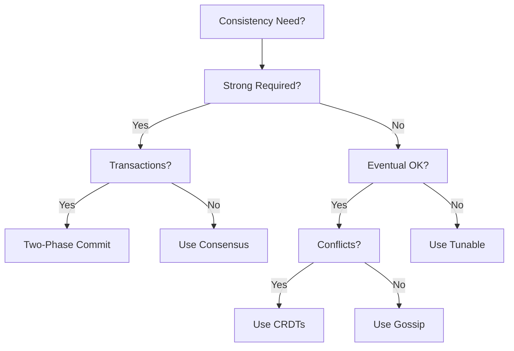

# Consistency & Coordination Learning Path

!!! abstract "Master Distributed Agreement"
 This focused path covers everything you need to know about consistency in distributed systems - from theoretical foundations to practical implementations. Perfect for engineers working on distributed databases, coordination services, or transactional systems.

## 🎯 Learning Objectives

By completing this path, you will:

- Understand consistency models and their trade-offs
- Implement consensus algorithms and coordination patterns
- Design systems with appropriate consistency guarantees
- Handle distributed transactions and state management
- Debug and resolve consistency issues in production

## 📚 Prerequisites

- Understanding of basic distributed systems concepts
- Experience with databases and transactions
- Familiarity with concurrent programming
- Basic knowledge of networking

## 🗺️ Consistency Journey

### Phase 1: Theoretical Foundations (1 week)

!!! info "Build Strong Foundations"
 Start with the theory that underpins all consistency mechanisms.

<div class="grid cards" markdown>

- **Core Concepts**
 
 Essential theory:
 
 - [CAP Theorem](quantitative/cap-theorem) - Fundamental trade-offs
 - [Consistency Models](quantitative/consistency-models) - From strong to eventual
 - [PACELC Theorem](quantitative/cap-theorem) - Extended CAP analysis

- **Distributed Time**
 
 Understanding ordering:
 
 - [Logical Clocks](../pattern-library/coordination/logical-clocks) - Lamport timestamps
 - [Vector Clocks](../pattern-library/coordination/vector-clocks) - Causality tracking
 - [Hybrid Logical Clocks](../pattern-library/coordination/hlc) - Best of both worlds

</div>

### Phase 2: Consensus Algorithms (2 weeks)

!!! warning "The Heart of Coordination"
 Master the algorithms that enable distributed agreement.

#### Week 2: Classical Consensus

=== "Raft"
 Understandable consensus algorithm:
 - Leader election mechanism
 - Log replication protocol
 - Safety properties
 - **Project**: Implement Raft in your language

=== "Paxos"
 The original consensus algorithm:
 - Basic Paxos protocol
 - Multi-Paxos optimization
 - Practical considerations
 - **Project**: Build a Paxos-based lock service

=== "Byzantine Consensus"
 Tolerating malicious failures:
 - PBFT algorithm
 - Blockchain consensus
 - BFT-SMaRT
 - **Project**: Simple blockchain implementation

#### Week 3: Coordination Patterns

- [Leader Election](../pattern-library/coordination/leader-election) - Choosing coordinators
- [Distributed Lock](../pattern-library/coordination/distributed-lock) - Mutual exclusion
- [Consensus](../pattern-library/coordination/consensus) - Agreement protocols
- [Two-Phase Commit](../pattern-library/coordination/two-phase-commit) - Atomic commits

### Phase 3: Consistency in Practice (2 weeks)

!!! success "Real-World Applications"
 Apply consistency concepts to production systems.

#### Week 4: Data Consistency

=== "Strong Consistency"
 When you need guarantees:
 - Linearizability implementation
 - Serializable transactions
 - External consistency (Spanner)
 - **Case Study**: [Google Spanner](../google-spanner)

=== "Tunable Consistency"
 Flexible guarantees:
 - Read/write quorums
 - Consistency levels (Cassandra)
 - Session guarantees
 - **Case Study**: [Amazon DynamoDB](../amazon-dynamo)

=== "Eventual Consistency"
 Convergence over time:
 - Anti-entropy protocols
 - Gossip dissemination
 - Conflict resolution
 - **Case Study**: [Amazon S3](../s3-object-storage-enhanced)

#### Week 5: Advanced Patterns

- [CRDT](../pattern-library/data-management/crdt) - Conflict-free replicated data types
- [Saga Pattern](../pattern-library/data-management/saga) - Distributed transactions
- [Event Sourcing](../pattern-library/data-management/event-sourcing) - Immutable event logs
- [Outbox Pattern](../pattern-library/data-management/outbox) - Reliable messaging

### Phase 4: Production Challenges (1 week)

!!! danger "Real-World Complications"
 Handle the complexities of consistency in production.

#### Week 6: Common Issues & Solutions

<div class="grid cards" markdown>

- **Split-Brain Scenarios**
 - [Split-Brain Pattern](../pattern-library/resilience/split-brain)
 - Quorum strategies
 - Fencing tokens
 - STONITH approaches

- **Clock Synchronization**
 - [Clock Sync Pattern](../pattern-library/coordination/clock-sync)
 - NTP configuration
 - Clock skew handling
 - Time-based ordering

- **Network Partitions**
 - Partition detection
 - Healing strategies
 - Client behavior
 - Consistency during partitions

- **Performance Impact**
 - Consistency overhead
 - Latency implications
 - Throughput trade-offs
 - Optimization techniques

</div>

## 📊 Hands-On Projects

### Project 1: Build a Distributed Lock Service
```python
# Implement these components:
1. Leader election using Raft
2. Lock acquisition protocol
3. Lease management
4. Failure detection
5. Client library
```

### Project 2: Implement Vector Clocks
```python
# Build a system that:
1. Tracks causality between events
2. Detects concurrent updates
3. Merges vector clocks
4. Visualizes event ordering
```

### Project 3: Design a Consistent Key-Value Store
```python
# Features to implement:
1. Tunable consistency levels
2. Read/write quorums
3. Hinted handoff
4. Read repair
5. Anti-entropy
```

## 🧪 Lab Exercises

### Exercise 1: CAP Theorem Exploration
- Set up a 3-node cluster
- Introduce network partitions
- Observe behavior under different consistency settings
- Document trade-offs

### Exercise 2: Consensus Performance
- Benchmark Raft vs Paxos
- Measure leader election time
- Test throughput under load
- Analyze failure recovery

### Exercise 3: Clock Skew Impact
- Introduce artificial clock skew
- Observe ordering violations
- Implement logical clocks
- Compare with wall-clock time

## 📈 Consistency Decision Framework

### Choosing Consistency Levels

| Use Case | Consistency Level | Rationale |
|----------|------------------|-----------|
| Financial transactions | Strong | ACID requirements |
| User profiles | Eventual | Read-heavy, updates rare |
| Inventory management | Tunable | Balance availability/accuracy |
| Analytics data | Weak | Approximations acceptable |
| Session data | Session | User-specific guarantees |


### Pattern Selection Guide



## 🔍 Debugging Consistency Issues

### Common Symptoms
- [ ] Stale reads after writes
- [ ] Lost updates
- [ ] Duplicate processing
- [ ] Out-of-order events
- [ ] Inconsistent query results

### Debugging Tools
- Distributed tracing (Jaeger)
- Logical clock visualization
- Consistency checkers
- Chaos testing tools
- Event ordering analysis

## 📚 Deep Dive Resources

### Papers
- "Paxos Made Simple" - Lamport
- "In Search of an Understandable Consensus Algorithm" - Raft
- "Time, Clocks, and the Ordering of Events" - Lamport
- "Dynamo: Amazon's Highly Available Key-value Store"

### Books
- "Designing Data-Intensive Applications" - Chapter 5, 7, 9
- "Database Internals" - Part II: Distributed Systems

### Courses
- MIT 6.824: Distributed Systems
- "Distributed Systems Concepts" - University of Illinois

## 💡 Expert Tips

!!! tip "Consistency Best Practices"
 1. **Start Simple**: Use strong consistency, optimize later
 2. **Measure Impact**: Quantify consistency overhead
 3. **Design for Partition**: Plan behavior during splits
 4. **Test Thoroughly**: Use chaos engineering
 5. **Monitor Violations**: Track consistency metrics

## ⏱️ Time Investment

- **Total Duration**: 6 weeks
- **Weekly Commitment**: 8-10 hours
- **Hands-on Projects**: 40% of time
- **Total Time**: ~50-60 hours

---

<div class="grid cards" markdown>

- :material-arrow-left:{ .lg .middle } **Previous**
 
 ---
 
 [Learning Paths Overview](../../architects-handbook/learning-paths/cost.md)

- :material-arrow-right:{ .lg .middle } **Next**
 
 ---
 
 [Performance & Scale Path](../../architects-handbook/learning-paths/performance.md)

</div>