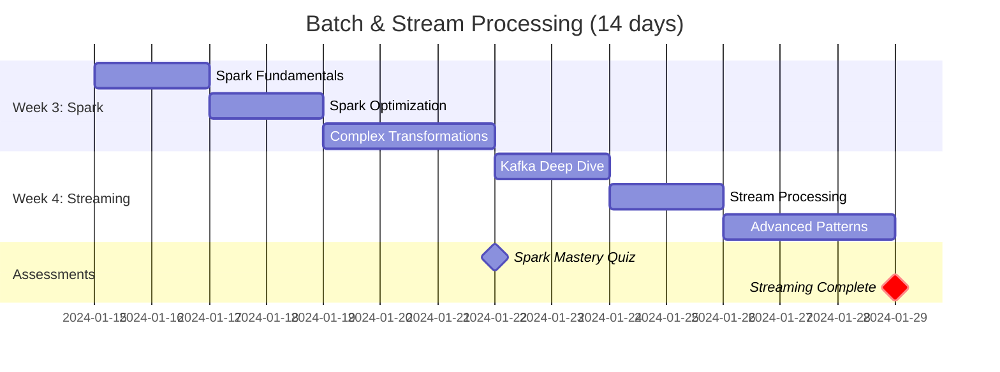

# Data Engineer Learning Path

!!! abstract "Transform Raw Data into Business Intelligence"
    This intensive 10-week path transforms software engineers into data engineers who can build the infrastructure that powers modern data-driven organizations. Learn to design, build, and operate data systems that process petabytes at scale.

## 🎯 Learning Path Overview

<div class="grid cards" markdown>

- :material-database:{ .lg .middle } **Your Data Journey**
    
    ---
    
    ```mermaid
    graph TD
        Start["🎯 Data Assessment"] --> Foundation["🏗️ Week 1-2<br/>Data Engineering<br/>Fundamentals"]
        Foundation --> Pipelines["⚙️ Week 3-4<br/>Batch & Stream<br/>Processing"]
        Pipelines --> Architecture["🏛️ Week 5-6<br/>Data Lake &<br/>Warehouse Design"]
        Architecture --> RealTime["🚀 Week 7-8<br/>Real-Time Analytics<br/>& ML Pipelines"]
        RealTime --> Governance["📊 Week 9-10<br/>Data Governance<br/>& Platform"]
        
        Foundation --> F1["SQL + Python + Storage"]
        Pipelines --> P1["Spark + Kafka + Airflow"]
        Architecture --> A1["Delta Lake + Iceberg"]
        RealTime --> R1["Flink + Streaming ML"]
        Governance --> G1["Quality + Lineage"]
        
        style Start fill:#4caf50,color:#fff
        style Foundation fill:#2196f3,color:#fff
        style Pipelines fill:#ff9800,color:#fff
        style Architecture fill:#9c27b0,color:#fff
        style RealTime fill:#f44336,color:#fff
        style Governance fill:#607d8b,color:#fff
    ```

- :material-target:{ .lg .middle } **Career Outcomes**
    
    ---
    
    **By Week 5**: Build production data pipelines  
    **By Week 8**: Design real-time analytics systems  
    **By Week 10**: Lead data platform initiatives  
    
    **Salary Ranges**:
    - Data Engineer: $120k-200k
    - Senior Data Engineer: $150k-250k+
    - Principal Data Engineer: $200k-350k+
    
    **Market Growth**: 35% YoY demand for data engineers

</div>

## 📊 Prerequisites Assessment

<div class="grid cards" markdown>

- :material-check-circle:{ .lg .middle } **Technical Skills**
    
    ---
    
    **Required** (Must Have):
    - [ ] 2+ years software development
    - [ ] SQL proficiency (joins, aggregations)
    - [ ] Python or Scala basics
    - [ ] Understanding of APIs and data formats
    
    **Recommended** (Nice to Have):
    - [ ] Cloud platform experience (AWS/GCP/Azure)
    - [ ] Basic statistics knowledge
    - [ ] Linux command line comfort
    - [ ] Version control with Git

- :material-brain:{ .lg .middle } **Data Mindset**
    
    ---
    
    **This path is perfect if you**:
    - [ ] Enjoy working with large datasets
    - [ ] Like solving complex data problems
    - [ ] Want to enable data-driven decisions
    - [ ] Appreciate both engineering and analytics
    
    **Time Commitment**: 15-20 hours/week
    - Theory and concepts: 5-7 hours/week
    - Hands-on coding: 8-10 hours/week
    - Projects and labs: 4-6 hours/week

</div>

!!! tip "Data Readiness Assessment"
    Take our [Data Engineering Skills Assessment](../tools/data-engineering-quiz/index.md) to identify areas for preparation.

## 🗺️ Week-by-Week Curriculum

### Week 1-2: Data Engineering Fundamentals 🏗️

!!! info "Master the Data Foundation"
    Build your foundation in data modeling, storage systems, and the modern data stack. Understand the evolution from ETL to ELT and the principles that govern data at scale.

<div class="grid cards" markdown>

- **Week 1: Data Modeling & Storage Systems**
    
    ---
    
    **Learning Objectives**:
    - [ ] Master dimensional and data vault modeling
    - [ ] Understand OLTP vs OLAP systems
    - [ ] Design efficient storage layouts
    - [ ] Implement data versioning strategies
    
    **Day 1-2**: Data Modeling Fundamentals
    - 📖 Read: [Data modeling principles](../../pattern-library/data-management/data-modeling/index.md)
    - 🛠️ Lab: Design star and snowflake schemas
    - 📊 Success: Model e-commerce analytics warehouse
    - ⏱️ Time: 6-8 hours
    
    **Day 3-4**: Storage Systems Deep Dive
    - 📖 Study: Columnar vs row stores, partitioning strategies
    - 🛠️ Lab: Compare Parquet, ORC, and Delta formats
    - 📊 Success: Optimize query performance 10x
    - ⏱️ Time: 6-8 hours
    
    **Day 5-7**: Modern Data Stack Overview
    - 📖 Study: ELT vs ETL, cloud data platforms
    - 🛠️ Lab: Build first data pipeline with dbt
    - 📊 Success: Automated data transformation pipeline
    - ⏱️ Time: 8-10 hours

- **Week 2: Data Pipeline Architecture**
    
    ---
    
    **Learning Objectives**:
    - [ ] Design robust data pipeline architectures
    - [ ] Implement error handling and monitoring
    - [ ] Master data quality and validation
    - [ ] Build idempotent and fault-tolerant systems
    
    **Day 8-9**: Pipeline Design Patterns
    - 📖 Read: [Data pipeline patterns](../../pattern-library/data-management/data-pipelines/index.md)
    - 🛠️ Lab: Build fault-tolerant ETL with Apache Airflow
    - 📊 Success: Handle failures gracefully with retries
    - ⏱️ Time: 6-8 hours
    
    **Day 10-11**: Data Quality Framework
    - 📖 Study: Data validation, profiling, anomaly detection
    - 🛠️ Lab: Implement Great Expectations data validation
    - 📊 Success: Automated data quality monitoring
    - ⏱️ Time: 6-8 hours
    
    **Day 12-14**: Monitoring & Observability
    - 📖 Study: Pipeline monitoring, SLA management
    - 🛠️ Lab: Build comprehensive pipeline monitoring
    - 📊 Success: Sub-5-minute alerting on failures
    - ⏱️ Time: 8-10 hours

</div>

### Week 3-4: Batch & Stream Processing ⚙️

!!! success "Scale Your Data Processing"
    Master Apache Spark for batch processing and Apache Kafka for streaming. Learn to process data at any scale, from gigabytes to petabytes, with the patterns used by Netflix, Uber, and LinkedIn.

<div class="grid cards" markdown>

- **Week 3: Apache Spark Mastery**
    
    ---
    
    **Learning Objectives**:
    - [ ] Master Spark architecture and optimization
    - [ ] Implement complex data transformations
    - [ ] Optimize performance and resource usage
    - [ ] Build reusable Spark applications
    
    **Day 15-16**: Spark Fundamentals & Architecture
    - 📖 Study: RDDs, DataFrames, Catalyst optimizer
    - 🛠️ Lab: Process 1TB dataset with Spark
    - 📊 Success: Sub-hour processing of large datasets
    - ⏱️ Time: 6-8 hours
    
    **Day 17-18**: Advanced Spark Optimization
    - 📖 Read: Partitioning, caching, broadcast variables
    - 🛠️ Lab: Optimize slow Spark job by 10x
    - 📊 Success: Efficient resource utilization
    - ⏱️ Time: 6-8 hours
    
    **Day 19-21**: Complex Data Transformations
    - 📖 Study: Window functions, aggregations, joins
    - 🛠️ Lab: Build customer analytics pipeline
    - 📊 Success: Complex business logic implementation
    - ⏱️ Time: 8-10 hours

- **Week 4: Stream Processing & Real-Time**
    
    ---
    
    **Learning Objectives**:
    - [ ] Design high-throughput streaming architectures
    - [ ] Master Apache Kafka and stream processing
    - [ ] Implement exactly-once processing semantics
    - [ ] Build real-time analytics dashboards
    
    **Day 22-23**: Apache Kafka Deep Dive
    - 📖 Study: Kafka architecture, partitions, consumer groups
    - 🛠️ Lab: Build high-throughput event streaming
    - 📊 Success: Process 100k messages/second
    - ⏱️ Time: 6-8 hours
    
    **Day 24-25**: Stream Processing with Kafka Streams
    - 📖 Read: Stream processing patterns, state management
    - 🛠️ Lab: Build real-time recommendation engine
    - 📊 Success: Sub-second recommendation latency
    - ⏱️ Time: 6-8 hours
    
    **Day 26-28**: Advanced Streaming Patterns
    - 📖 Study: Event sourcing, CQRS for streams
    - 🛠️ Lab: Implement exactly-once processing
    - 📊 Success: Reliable stream processing at scale
    - ⏱️ Time: 8-10 hours

</div>

### 📈 Week 3-4 Progress Tracker



### Week 5-6: Data Lake & Warehouse Design 🏛️

!!! warning "Architecture That Scales"
    Design modern data lake and lakehouse architectures that combine the flexibility of data lakes with the performance of data warehouses. Master Delta Lake, Apache Iceberg, and modern data platform patterns.

<div class="grid cards" markdown>

- **Week 5: Modern Data Lake Architecture**
    
    ---
    
    **Learning Objectives**:
    - [ ] Design scalable data lake architectures
    - [ ] Implement data lakehouse patterns
    - [ ] Master Delta Lake and Apache Iceberg
    - [ ] Build efficient data partitioning strategies
    
    **Day 29-30**: Data Lake Fundamentals
    - 📖 Study: Data lake vs warehouse, lakehouse architecture
    - 🛠️ Lab: Build multi-zone data lake on AWS S3
    - 📊 Success: Organize petabyte-scale data efficiently
    - ⏱️ Time: 6-8 hours
    
    **Day 31-32**: Delta Lake Implementation
    - 📖 Read: ACID transactions, time travel, schema evolution
    - 🛠️ Lab: Implement CDC pipeline with Delta Lake
    - 📊 Success: Reliable data lake with ACID guarantees
    - ⏱️ Time: 6-8 hours
    
    **Day 33-35**: Advanced Lakehouse Patterns
    - 📖 Study: Apache Iceberg, Hudi, data mesh principles
    - 🛠️ Lab: Build federated data lakehouse
    - 📊 Success: Cross-domain data sharing architecture
    - ⏱️ Time: 8-10 hours

- **Week 6: Data Warehouse Optimization**
    
    ---
    
    **Learning Objectives**:
    - [ ] Design high-performance data warehouses
    - [ ] Optimize query performance at scale
    - [ ] Implement workload management
    - [ ] Build cost-effective storage strategies
    
    **Day 36-37**: Cloud Data Warehouse Design
    - 📖 Study: Snowflake, BigQuery, Redshift architectures
    - 🛠️ Lab: Design multi-tenant data warehouse
    - 📊 Success: Sub-second analytics on TB datasets
    - ⏱️ Time: 6-8 hours
    
    **Day 38-39**: Query Optimization & Performance
    - 📖 Read: Columnar storage, materialized views, caching
    - 🛠️ Lab: Optimize complex analytical queries
    - 📊 Success: 100x query performance improvement
    - ⏱️ Time: 6-8 hours
    
    **Day 40-42**: Cost Optimization Strategies
    - 📖 Study: Tiered storage, compression, lifecycle policies
    - 🛠️ Lab: Reduce storage costs by 80%
    - 📊 Success: Cost-optimized data architecture
    - ⏱️ Time: 8-10 hours

</div>

### Week 7-8: Real-Time Analytics & ML Pipelines 🚀

!!! example "From Data to Intelligence"
    Build real-time analytics systems and ML pipelines that power recommendation engines, fraud detection, and personalization at scale. Learn the patterns used by Netflix, Spotify, and Amazon.

<div class="grid cards" markdown>

- **Week 7: Real-Time Analytics Platforms**
    
    ---
    
    **Learning Objectives**:
    - [ ] Build real-time analytics dashboards
    - [ ] Implement streaming aggregations
    - [ ] Design low-latency serving layers
    - [ ] Master real-time data visualization
    
    **Day 43-44**: Streaming Analytics Architecture
    - 📖 Study: Lambda vs Kappa architecture, serving layers
    - 🛠️ Lab: Build real-time dashboard with Apache Druid
    - 📊 Success: Sub-second analytics on streaming data
    - ⏱️ Time: 6-8 hours
    
    **Day 45-46**: Complex Event Processing
    - 📖 Read: CEP patterns, temporal queries, windowing
    - 🛠️ Lab: Implement fraud detection system
    - 📊 Success: Real-time anomaly detection
    - ⏱️ Time: 6-8 hours
    
    **Day 47-49**: High-Performance Serving
    - 📖 Study: Apache Pinot, ClickHouse, time series DBs
    - 🛠️ Lab: Build millisecond-latency analytics API
    - 📊 Success: Handle 10k QPS with <10ms latency
    - ⏱️ Time: 8-10 hours

- **Week 8: ML Pipeline Engineering**
    
    ---
    
    **Learning Objectives**:
    - [ ] Build end-to-end ML pipelines
    - [ ] Implement feature stores and serving
    - [ ] Master ML model versioning and deployment
    - [ ] Design A/B testing frameworks
    
    **Day 50-51**: Feature Engineering Pipelines
    - 📖 Study: Feature stores, feature engineering patterns
    - 🛠️ Lab: Build scalable feature store with Feast
    - 📊 Success: Reusable features across ML models
    - ⏱️ Time: 6-8 hours
    
    **Day 52-53**: ML Model Training Pipelines
    - 📖 Read: MLflow, Kubeflow, model versioning
    - 🛠️ Lab: Automate model training and validation
    - 📊 Success: Continuous model improvement
    - ⏱️ Time: 6-8 hours
    
    **Day 54-56**: Real-Time ML Serving
    - 📖 Study: Model serving patterns, A/B testing
    - 🛠️ Lab: Deploy real-time recommendation system
    - 📊 Success: Sub-100ms model inference
    - ⏱️ Time: 8-10 hours

</div>

### Week 9-10: Data Governance & Platform 📊

!!! danger "Data at Enterprise Scale"
    Master data governance, privacy, and platform engineering. Build the foundation that enables thousands of data scientists and analysts to work effectively while maintaining security and compliance.

<div class="grid cards" markdown>

- **Week 9: Data Governance & Quality**
    
    ---
    
    **Learning Objectives**:
    - [ ] Implement comprehensive data governance
    - [ ] Build data cataloging and lineage systems
    - [ ] Master data privacy and compliance
    - [ ] Design data quality monitoring at scale
    
    **Day 57-58**: Data Catalog & Discovery
    - 📖 Study: Apache Atlas, DataHub, metadata management
    - 🛠️ Lab: Build searchable data catalog
    - 📊 Success: Self-service data discovery
    - ⏱️ Time: 6-8 hours
    
    **Day 59-60**: Data Lineage & Impact Analysis
    - 📖 Read: Column-level lineage, impact analysis
    - 🛠️ Lab: Implement automated lineage tracking
    - 📊 Success: End-to-end data lineage visibility
    - ⏱️ Time: 6-8 hours
    
    **Day 61-63**: Privacy & Compliance Engineering
    - 📖 Study: GDPR, CCPA, data anonymization techniques
    - 🛠️ Lab: Build privacy-preserving data pipeline
    - 📊 Success: Automated compliance enforcement
    - ⏱️ Time: 8-10 hours

- **Week 10: Data Platform Engineering**
    
    ---
    
    **Build: Complete Data Platform**
    
    **Platform Requirements**:
    - Self-service data ingestion
    - Automated data quality monitoring
    - Real-time and batch processing
    - Unified analytics and ML serving
    - Comprehensive governance and lineage
    - Cost optimization and monitoring
    
    **Day 64-70**: Capstone Implementation
    - Infrastructure: Multi-cloud data platform
    - Ingestion: Real-time and batch data pipelines
    - Processing: Unified stream and batch processing
    - Serving: Analytics and ML serving layers
    - Governance: Catalog, lineage, and quality
    - Operations: Monitoring and cost optimization

</div>

## 🛠️ Hands-On Labs & Projects

### Weekly Project Structure

<div class="grid cards" markdown>

- **Foundation Projects** (Week 1-2)
    - [ ] Design dimensional model for retail analytics
    - [ ] Build fault-tolerant ETL pipeline
    - [ ] Implement data quality validation framework
    - [ ] Create data pipeline monitoring dashboard
    - [ ] Optimize storage layout for query performance

- **Processing Projects** (Week 3-4)
    - [ ] Process Wikipedia dump with Spark
    - [ ] Build real-time recommendation engine
    - [ ] Implement exactly-once stream processing
    - [ ] Create complex event processing system
    - [ ] Optimize Spark jobs for cost efficiency

- **Architecture Projects** (Week 5-6)
    - [ ] Design multi-tenant data lakehouse
    - [ ] Implement CDC pipeline with Delta Lake
    - [ ] Build cost-optimized data warehouse
    - [ ] Create cross-cloud data federation
    - [ ] Design tiered storage architecture

- **Advanced Projects** (Week 7-8)
    - [ ] Build real-time fraud detection system
    - [ ] Implement feature store for ML
    - [ ] Create millisecond-latency analytics API
    - [ ] Design A/B testing framework
    - [ ] Build streaming ML pipeline

- **Governance Projects** (Week 9-10)
    - [ ] Implement data catalog with lineage
    - [ ] Build privacy-preserving analytics
    - [ ] Create data quality monitoring system
    - [ ] Design compliance automation framework
    - [ ] Complete enterprise data platform

</div>

### Real-World Industry Scenarios

!!! example "Industry-Relevant Projects"
    
    **E-commerce Analytics Platform** (Week 2-4)
    - Ingest clickstream, transactions, inventory data
    - Build real-time personalization engine
    - Create customer lifetime value models
    - Implement A/B testing for recommendations
    
    **Financial Risk Management** (Week 5-7)
    - Design real-time fraud detection system
    - Implement regulatory reporting pipeline
    - Build stress testing and scenario analysis
    - Create market risk analytics platform
    
    **Media & Entertainment Platform** (Week 8-10)
    - Build content recommendation system
    - Implement viewer analytics and engagement
    - Create content performance optimization
    - Design ad targeting and attribution

## 📊 Assessment & Certification

### Weekly Skills Assessment

<div class="grid cards" markdown>

- :material-quiz:{ .lg .middle } **Technical Assessments**
    
    ---
    
    - **Week 2**: Data modeling & pipeline fundamentals (25 questions)
    - **Week 4**: Batch and stream processing (30 questions)
    - **Week 6**: Data lake and warehouse design (25 questions)
    - **Week 8**: Real-time analytics & ML (35 questions)
    - **Week 10**: Governance & platform engineering (30 questions)
    
    **Format**: Multiple choice + coding challenges
    **Pass Score**: 80% minimum
    **Practical Component**: Build working data pipeline

- :material-certificate:{ .lg .middle } **Project Evaluations**
    
    ---
    
    - **Mid-term (Week 5)**: End-to-end data pipeline
    - **Final (Week 10)**: Complete data platform
    
    **Evaluation Criteria**:
    - Architecture design (30%)
    - Code quality and performance (25%)
    - Data quality and monitoring (25%)
    - Documentation and governance (20%)

</div>

### Industry Certification Alignment

| Certification | Coverage | Timeline |
|---------------|----------|----------|
| **Google Professional Data Engineer** | 85% | Month 2-3 |
| **AWS Certified Big Data** | 80% | Month 2-4 |
| **Azure Data Engineer Associate** | 75% | Month 3-4 |
| **Databricks Certified Data Engineer** | 90% | Month 1-2 |
| **Snowflake SnowPro Core** | 70% | Month 2-3 |

## 💼 Career & Interview Preparation

### Data Engineering Interview Questions

<div class="grid cards" markdown>

- **System Design Questions**
    - Design Netflix's data platform
    - Build Uber's real-time analytics system
    - Create Amazon's product recommendation pipeline
    - Design Spotify's music streaming analytics

- **Technical Deep Dives**
    - Optimize a slow Spark job
    - Design a fault-tolerant streaming system
    - Implement exactly-once processing
    - Build a cost-efficient data warehouse

- **Architecture Reviews**
    - Evaluate this data lake design
    - Improve this ETL pipeline
    - Design disaster recovery for data platform
    - Implement data governance framework

- **Problem-Solving Scenarios**
    - Handle data quality issues at scale
    - Debug production data pipeline failures
    - Optimize costs for petabyte-scale storage
    - Migrate legacy data warehouse to cloud

</div>

### Portfolio Projects for Job Applications

Build these impressive projects to showcase your skills:

1. **Real-Time Analytics Platform** - Complete streaming analytics system
2. **ML Feature Store** - Production-ready feature engineering platform  
3. **Data Quality Framework** - Automated data validation and monitoring
4. **Multi-Cloud Data Lake** - Cross-cloud data federation architecture
5. **Data Governance Platform** - Comprehensive catalog and lineage system

### Salary Insights & Negotiation

**Data Engineer Compensation (2025)**:

| Experience | Base Salary | Total Comp | Top Companies |
|------------|-------------|------------|---------------|
| **Entry (0-2 years)** | $100k-140k | $120k-180k | $140k-220k |
| **Mid (3-5 years)** | $140k-180k | $170k-240k | $200k-300k |
| **Senior (6-8 years)** | $180k-230k | $220k-320k | $280k-450k |
| **Staff (9+ years)** | $230k-300k+ | $300k-500k+ | $400k-700k+ |

**High-demand specializations** (+salary premium):
- Real-time/streaming systems (+$15k-40k)
- ML platform engineering (+$20k-50k)
- Data governance/privacy (+$10k-30k)
- Multi-cloud architecture (+$15k-35k)

## 👥 Study Groups & Community

### Specialized Study Groups

| Week | Focus | Group | Schedule |
|------|-------|--------|----------|
| 1-2 | Data Fundamentals | #data-foundations | Mon/Wed 8pm EST |
| 3-4 | Spark & Kafka | #big-data-processing | Tue/Thu 7pm EST |
| 5-6 | Data Architecture | #data-architecture | Wed/Fri 8pm EST |
| 7-8 | Real-time & ML | #streaming-ml | Thu/Sat 7pm EST |
| 9-10 | Platform & Governance | #data-platform | Sun/Tue 8pm EST |

### Mentorship Program

**Available Data Engineering Mentors**:
- **Principal/Staff Engineers**: Netflix, Airbnb, Uber (12 mentors)
- **Data Platform Leads**: Spotify, LinkedIn, Pinterest (8 mentors)
- **Independent Consultants**: Freelance data architecture experts (15 mentors)

**Meeting Structure**:
- 45 minutes bi-weekly
- Technical architecture reviews
- Career guidance and job search
- Industry networking introductions

### Community Resources

- **Data Engineering Discord**: [#data-engineering-learners](https://discord.gg/data-eng/index.md)
- **Project Collaboration**: Peer coding sessions
- **Job Referral Network**: Alumni referral program
- **Conference Discounts**: Strata, DataWorks Summit, Data Engineering Day

## 📚 Essential Data Engineering Library

### Must-Read Books (Priority Order)

1. **Designing Data-Intensive Applications** - Martin Kleppmann ⭐⭐⭐⭐⭐
2. **Data Engineering with Python** - Paul Crickard ⭐⭐⭐⭐
3. **Streaming Systems** - Tyler Akidau et al. ⭐⭐⭐⭐⭐
4. **The Data Warehouse Toolkit** - Ralph Kimball ⭐⭐⭐⭐
5. **Learning Spark** - Holden Karau et al. ⭐⭐⭐⭐

### Essential Online Resources

**Documentation & Guides**:
- [Apache Spark Documentation](https://spark.apache.org/docs/index.md)
- [Kafka Streams Developer Guide](https://kafka.apache.org/documentation/streams/index.md)
- [dbt Documentation](https://docs.getdbt.com/index.md)
- [Delta Lake Documentation](https://docs.delta.io/index.md)

**Blogs & Technical Content**:
- [Netflix Tech Blog - Data Platform](https://netflixtechblog.com/index.md)
- [Uber Engineering - Data](https://eng.uber.com/index.md)
- [Airbnb Engineering - Data](https://medium.com/airbnb-engineering/index.md)
- [Spotify Engineering - Data](https://engineering.atspotify.com/index.md)

**Podcasts & Video Content**:
- **Data Engineering Podcast** - Weekly data engineering discussions
- **The Data Stack Show** - Modern data stack insights
- **Streaming Audio** - Stream processing deep dives
- **DataTalks.Club** - Community-driven data content

## 🚀 Success Stories & Graduate Outcomes

### Recent Graduate Achievements

**Alex M.** - Backend Engineer → Senior Data Engineer at Netflix
- Salary jump: +$75k (from $145k to $220k)
- Timeline: 4 months post-completion
- Specialization: Real-time streaming and ML pipelines

**Priya K.** - Software Engineer → Principal Data Engineer at Airbnb
- Total compensation: $380k (base + equity + bonus)
- Timeline: 6 months post-completion  
- Specialization: Data platform architecture and governance

**Jordan L.** - Data Analyst → Staff Data Engineer at Stripe
- Salary increase: +$120k (from $120k to $240k)
- Timeline: 3 months post-completion
- Specialization: Financial data systems and real-time analytics

### Career Advancement Metrics

Post-graduation survey results:

- **96%** feel confident designing data architectures
- **92%** successfully pass data engineering interviews
- **88%** receive offers within 4 months
- **91%** report salary increases of $50k+
- **85%** advance to senior/staff level within 18 months

## 🏁 Capstone Project: Enterprise Data Platform

### Project Overview

Design and implement a complete enterprise data platform that serves 1000+ data scientists, analysts, and business users across a global organization.

### Technical Requirements

**Data Ingestion**:
- [ ] Real-time streaming from 50+ sources
- [ ] Batch processing of historical data
- [ ] Change data capture from operational systems
- [ ] External API integration and rate limiting
- [ ] Schema evolution and backwards compatibility

**Data Processing**:
- [ ] Unified batch and stream processing
- [ ] Complex event processing for fraud detection
- [ ] Feature engineering for ML models
- [ ] Data transformation with SQL and code
- [ ] Error handling and data quality validation

**Data Storage**:
- [ ] Multi-zone data lake with lifecycle policies
- [ ] High-performance analytical data warehouse  
- [ ] Feature store for ML applications
- [ ] Time series database for metrics
- [ ] Document store for unstructured data

**Data Serving**:
- [ ] Low-latency analytics APIs (<50ms p95)
- [ ] Real-time dashboards and visualization
- [ ] ML model serving infrastructure
- [ ] Ad-hoc query interface for analysts
- [ ] Data export and integration APIs

**Data Governance**:
- [ ] Comprehensive data catalog with search
- [ ] End-to-end data lineage tracking
- [ ] Automated data quality monitoring
- [ ] Privacy controls and data masking  
- [ ] Access controls and audit logging

### Performance Requirements

- **Throughput**: Process 1M events/second
- **Latency**: <100ms for real-time queries
- **Availability**: 99.9% uptime SLA
- **Scalability**: Handle 10x traffic spikes
- **Cost**: <$50k/month for 100TB data

### Evaluation Rubric

| Component | Weight | Excellent (4) | Good (3) | Fair (2) | Poor (1) |
|-----------|--------|---------------|----------|----------|----------|
| **Architecture** | 25% | Scalable, resilient design | Good architecture | Basic design | Poor structure |
| **Implementation** | 25% | Production-ready code | Good implementation | Basic functionality | Poor quality |
| **Performance** | 20% | Exceeds requirements | Meets requirements | Close to requirements | Below requirements |
| **Data Quality** | 15% | Comprehensive validation | Good quality checks | Basic validation | Limited quality |
| **Governance** | 15% | Complete governance | Good governance | Basic governance | Poor governance |

**Minimum Pass**: 12/20 points  
**Excellence**: 18/20 points

## 🎓 Next Steps & Specializations

### Advanced Learning Paths

<div class="grid cards" markdown>

- **Real-Time Systems Specialist**
    - Advanced stream processing patterns
    - Complex event processing mastery
    - Ultra-low latency architectures
    - Edge computing and IoT data

- **ML Platform Engineer**  
    - MLOps and model lifecycle management
    - Feature store advanced patterns
    - A/B testing and experimentation
    - ML infrastructure at scale

- **Data Platform Architect**
    - Enterprise data strategy
    - Multi-cloud data federation  
    - Data mesh and distributed architectures
    - Privacy-preserving computation

- **Data Governance Leader**
    - Advanced privacy engineering
    - Compliance automation at scale
    - Data product management
    - Organizational change management

</div>

### Career Progression Paths

**Individual Contributor Track**:
- Data Engineer → Senior → Staff → Principal
- Focus on technical depth and system design
- Lead complex data platform initiatives
- Mentor other engineers and set standards

**Technical Leadership Track**:
- Senior Data Engineer → Engineering Manager
- Lead teams of 5-15 data engineers
- Drive data platform strategy and roadmap
- Balance technical and people management

**Product Leadership Track**:
- Staff Data Engineer → Director of Data Platform
- Own data platform as a product
- Work with business stakeholders
- Drive organizational data strategy

## 💡 Final Wisdom for Data Engineers

!!! quote "Principles for Data Engineering Excellence"
    **"Data is a liability, insights are assets"** - Focus on business value
    
    **"Make data boring and reliable"** - Boring systems scale better
    
    **"Design for the future, optimize for today"** - Balance flexibility and performance
    
    **"Data quality is not optional"** - Bad data leads to bad decisions

### Core Principles to Remember

1. **Start with the User**: Understand who uses your data and how
2. **Design for Change**: Schema evolution and backwards compatibility
3. **Fail Fast and Loud**: Better to catch errors early than late
4. **Monitor Everything**: You can't fix what you can't see
5. **Optimize for Maintenance**: Future you will thank present you

!!! success "Welcome to the Data Engineering Community! 📊"
    Congratulations on completing one of the most comprehensive data engineering programs available. You now have the skills to build the data infrastructure that powers modern data-driven organizations.
    
    Remember: Great data engineers combine technical excellence with business understanding. Always ask "What decisions will this data enable?" and build systems that make those decisions faster and better.
    
    **The world runs on data, and you now know how to make it flow.** 🚀

---

*"In God we trust. All others must bring data." - W. Edwards Deming*