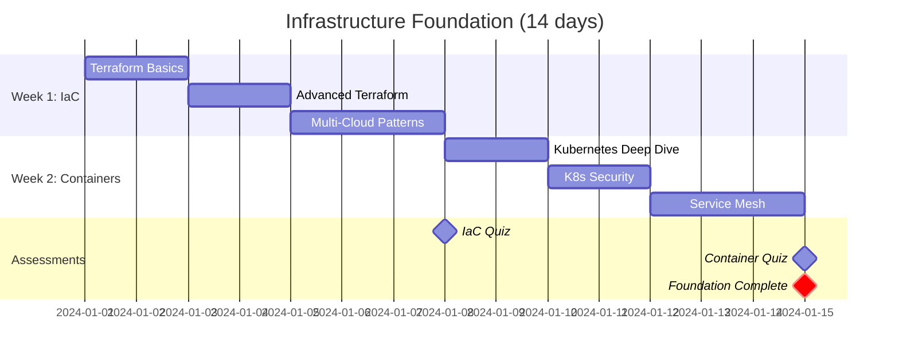

# DevOps & SRE Learning Path

!!! abstract "Build Systems That Never Sleep"
    This 10-week intensive path transforms software engineers into Site Reliability Engineers and DevOps practitioners. Learn to build, deploy, monitor, and maintain systems that serve millions while sleeping peacefully at night.

## 🎯 Learning Path Overview

<div class="grid cards" markdown>

- :material-road:{ .lg .middle } **Your DevOps Journey**
    
    ---
    
    ```mermaid
    graph TD
        Start["🎯 Assessment"] --> Foundation["🏗️ Week 1-2<br/>Infrastructure<br/>Foundation"]
        Foundation --> Automation["⚙️ Week 3-4<br/>CI/CD<br/>Automation"]
        Automation --> Monitoring["📊 Week 5-6<br/>Observability<br/>& Monitoring"]
        Monitoring --> Reliability["🛡️ Week 7-8<br/>SRE Practices<br/>& Reliability"]
        Reliability --> Advanced["🚀 Week 9-10<br/>Advanced Topics<br/>& Capstone"]
        
        Foundation --> F1["IaC + Cloud"]
        Automation --> A1["GitOps + Security"]
        Monitoring --> M1["Metrics + Tracing"]
        Reliability --> R1["Incidents + SLOs"]
        Advanced --> Ad1["Chaos + Platform"]
        
        style Start fill:#4caf50,color:#fff
        style Foundation fill:#2196f3,color:#fff
        style Automation fill:#ff9800,color:#fff
        style Monitoring fill:#9c27b0,color:#fff
        style Reliability fill:#f44336,color:#fff
        style Advanced fill:#607d8b,color:#fff
    ```

- :material-target:{ .lg .middle } **Learning Outcomes**
    
    ---
    
    **By Week 5**: Deploy production-ready infrastructure  
    **By Week 7**: Implement comprehensive monitoring  
    **By Week 10**: Lead incident response confidently  
    
    **Career Outcomes**:
    - Senior SRE roles ($120k-200k+)
    - Platform Engineering positions
    - DevOps Architect opportunities
    - Technical leadership in reliability
    
    **Industry Relevance**: 95% of Fortune 500 companies actively hiring SREs

</div>

## 📊 Prerequisites Assessment

Before starting, ensure you have:

<div class="grid cards" markdown>

- :material-check-circle:{ .lg .middle } **Technical Skills**
    
    ---
    
    **Required** (Must Have):
    - [ ] 2+ years software development
    - [ ] Basic Linux command line
    - [ ] Understanding of HTTP/DNS
    - [ ] Git version control
    
    **Recommended** (Nice to Have):
    - [ ] Cloud platform experience (AWS/GCP/Azure)
    - [ ] Container basics (Docker)
    - [ ] Basic networking knowledge
    - [ ] Python/Go/Shell scripting

- :material-school:{ .lg .middle } **Learning Style**
    
    ---
    
    **This path is perfect if you**:
    - [ ] Learn best through hands-on practice
    - [ ] Enjoy solving complex problems
    - [ ] Want to impact system reliability
    - [ ] Like working with cutting-edge tools
    
    **Time Commitment**: 12-15 hours/week
    - Daily reading: 1-2 hours
    - Hands-on labs: 6-8 hours/week
    - Projects: 4-6 hours/week

</div>

!!! tip "Self-Assessment Quiz"
    Take our [5-minute assessment](../../tools/sre-readiness-quiz/) to determine if you're ready or need additional preparation.

## 🗺️ Week-by-Week Curriculum

### Week 1-2: Infrastructure Foundation 🏗️

!!! info "Build the Foundation"
    Master Infrastructure as Code and cloud fundamentals. By week 2, you'll be managing infrastructure like code and deploying to multiple environments reliably.

<div class="grid cards" markdown>

- **Week 1: Infrastructure as Code** 
    
    ---
    
    **Learning Objectives**:
    - [ ] Master Terraform fundamentals
    - [ ] Understand immutable infrastructure
    - [ ] Build reusable modules
    - [ ] Implement environment promotion
    
    **Day-by-Day Schedule**:
    
    **Day 1-2**: Terraform Basics
    - 📖 Read: [Infrastructure as Code Principles](../../core-principles/infrastructure-as-code/)
    - 🛠️ Lab: Deploy first AWS resources with Terraform
    - 📊 Success: 3-tier app infrastructure in code
    - ⏱️ Time: 6-8 hours
    
    **Day 3-4**: Advanced Terraform
    - 📖 Study: State management, modules, workspaces
    - 🛠️ Lab: Build reusable VPC module
    - 📊 Success: Deploy dev/staging/prod environments
    - ⏱️ Time: 6-8 hours
    
    **Day 5-7**: Multi-Cloud & Best Practices
    - 📖 Study: Multi-cloud strategies, security
    - 🛠️ Lab: Deploy same app to AWS + GCP
    - 📊 Success: Cross-cloud disaster recovery
    - ⏱️ Time: 8-10 hours

- **Week 2: Container Orchestration**
    
    ---
    
    **Learning Objectives**:
    - [ ] Master Kubernetes fundamentals
    - [ ] Implement container security
    - [ ] Build scalable deployments
    - [ ] Setup service mesh basics
    
    **Day-by-Day Schedule**:
    
    **Day 8-9**: Kubernetes Deep Dive
    - 📖 Read: [Container Orchestration Patterns](../../../pattern-library/scaling/container-orchestration/)
    - 🛠️ Lab: Deploy microservices to K8s
    - 📊 Success: Rolling updates without downtime
    - ⏱️ Time: 6-8 hours
    
    **Day 10-11**: Kubernetes Security & Networking
    - 📖 Study: RBAC, Network policies, Pod security
    - 🛠️ Lab: Secure multi-tenant cluster
    - 📊 Success: Pass CIS benchmarks
    - ⏱️ Time: 6-8 hours
    
    **Day 12-14**: Service Mesh (Istio)
    - 📖 Study: [Service mesh patterns](../../../pattern-library/communication/service-mesh/)
    - 🛠️ Lab: Deploy Istio, traffic management
    - 📊 Success: Blue-green deployments with Istio
    - ⏱️ Time: 8-10 hours

</div>

### 📈 Week 1-2 Progress Tracker



### Week 3-4: CI/CD & Automation ⚙️

!!! success "Automate Everything"
    Build bulletproof deployment pipelines. Master GitOps, security scanning, and deployment strategies that scale from startups to enterprises.

<div class="grid cards" markdown>

- **Week 3: Advanced CI/CD Pipelines**
    
    ---
    
    **Learning Objectives**:
    - [ ] Build secure, scalable CI/CD
    - [ ] Implement GitOps workflows
    - [ ] Master deployment strategies
    - [ ] Integrate security scanning
    
    **Day 15-17**: Pipeline Security & Performance
    - 📖 Study: [Secure CI/CD patterns](../../../pattern-library/security/secure-pipelines/)
    - 🛠️ Lab: Multi-stage pipeline with security gates
    - 📊 Success: Sub-10-minute builds with security
    - ⏱️ Time: 8-10 hours
    
    **Day 18-19**: GitOps Implementation
    - 📖 Read: GitOps principles and ArgoCD
    - 🛠️ Lab: Deploy ArgoCD, sync K8s from Git
    - 📊 Success: Declarative deployment to 3 environments
    - ⏱️ Time: 6-8 hours
    
    **Day 20-21**: Advanced Deployment Strategies
    - 📖 Study: Blue-green, canary, A/B deployments
    - 🛠️ Lab: Implement canary with automatic rollback
    - 📊 Success: Zero-downtime deployments
    - ⏱️ Time: 6-8 hours

- **Week 4: Configuration & Secret Management**
    
    ---
    
    **Learning Objectives**:
    - [ ] Implement secure secret management
    - [ ] Build configuration as code
    - [ ] Master policy as code
    - [ ] Automate compliance checking
    
    **Day 22-23**: Secret Management (Vault)
    - 📖 Study: HashiCorp Vault, secret rotation
    - 🛠️ Lab: Deploy Vault, integrate with K8s
    - 📊 Success: Dynamic secrets with auto-rotation
    - ⏱️ Time: 6-8 hours
    
    **Day 24-25**: Policy as Code (OPA)
    - 📖 Read: Open Policy Agent, Gatekeeper
    - 🛠️ Lab: Implement security policies in K8s
    - 📊 Success: Automated policy enforcement
    - ⏱️ Time: 6-8 hours
    
    **Day 26-28**: Compliance Automation
    - 📖 Study: CIS benchmarks, NIST frameworks
    - 🛠️ Lab: Automated compliance scanning
    - 📊 Success: Continuous compliance reporting
    - ⏱️ Time: 8-10 hours

</div>

### Week 5-6: Observability & Monitoring 📊

!!! warning "You Can't Improve What You Can't Measure"
    Build comprehensive observability stacks. Master the three pillars: metrics, logs, and traces. Learn to detect issues before users notice.

<div class="grid cards" markdown>

- **Week 5: The Three Pillars**
    
    ---
    
    **Learning Objectives**:
    - [ ] Deploy production monitoring stack
    - [ ] Implement distributed tracing
    - [ ] Build alerting that doesn't cry wolf
    - [ ] Create operational dashboards
    
    **Day 29-30**: Metrics & Time Series
    - 📖 Study: [Prometheus architecture](../../../pattern-library/monitoring/prometheus/)
    - 🛠️ Lab: Deploy Prometheus + Grafana stack
    - 📊 Success: Business and technical metrics
    - ⏱️ Time: 6-8 hours
    
    **Day 31-32**: Distributed Tracing
    - 📖 Read: OpenTelemetry, Jaeger patterns
    - 🛠️ Lab: Instrument microservices with tracing
    - 📊 Success: End-to-end request tracing
    - ⏱️ Time: 6-8 hours
    
    **Day 33-35**: Log Aggregation & Analysis
    - 📖 Study: ELK stack, structured logging
    - 🛠️ Lab: Deploy centralized logging
    - 📊 Success: Searchable logs across all services
    - ⏱️ Time: 8-10 hours

- **Week 6: Advanced Observability**
    
    ---
    
    **Learning Objectives**:
    - [ ] Implement SLI/SLO monitoring
    - [ ] Build smart alerting systems
    - [ ] Create business intelligence dashboards
    - [ ] Master performance profiling
    
    **Day 36-37**: SLI/SLO Implementation
    - 📖 Study: [SRE principles](../../excellence/sre-practices/)
    - 🛠️ Lab: Define SLIs/SLOs for your services
    - 📊 Success: Error budgets and burn rates
    - ⏱️ Time: 6-8 hours
    
    **Day 38-39**: Intelligent Alerting
    - 📖 Read: Alert fatigue, escalation policies
    - 🛠️ Lab: Build smart alerting with PagerDuty
    - 📊 Success: Mean-time-to-resolution < 15 min
    - ⏱️ Time: 6-8 hours
    
    **Day 40-42**: Performance Profiling
    - 📖 Study: APM tools, performance analysis
    - 🛠️ Lab: Profile and optimize bottlenecks
    - 📊 Success: 50% latency improvement
    - ⏱️ Time: 8-10 hours

</div>

### Week 7-8: SRE Practices & Reliability 🛡️

!!! danger "When Things Go Wrong"
    Master the art of incident management. Learn from the best practices of Google, Netflix, and other reliability-focused companies.

<div class="grid cards" markdown>

- **Week 7: Incident Management**
    
    ---
    
    **Learning Objectives**:
    - [ ] Lead incident response effectively
    - [ ] Conduct blameless postmortems
    - [ ] Build runbooks and playbooks
    - [ ] Implement chaos engineering
    
    **Day 43-44**: Incident Response Leadership
    - 📖 Study: [Incident command system](../../human-factors/incident-response/)
    - 🛠️ Practice: Incident response simulations
    - 📊 Success: Lead 3 mock incidents
    - ⏱️ Time: 6-8 hours
    
    **Day 45-46**: Blameless Postmortems
    - 📖 Read: [Postmortem culture](../../human-factors/blameless-postmortems/)
    - 🛠️ Lab: Write comprehensive postmortem
    - 📊 Success: 5 why analysis + action items
    - ⏱️ Time: 6-8 hours
    
    **Day 47-49**: Chaos Engineering
    - 📖 Study: Chaos Monkey, failure injection
    - 🛠️ Lab: Implement chaos experiments
    - 📊 Success: Improve system resilience 2x
    - ⏱️ Time: 8-10 hours

- **Week 8: Capacity Planning & Performance**
    
    ---
    
    **Learning Objectives**:
    - [ ] Model system capacity scientifically
    - [ ] Implement auto-scaling strategies
    - [ ] Optimize cost vs performance
    - [ ] Plan for traffic spikes
    
    **Day 50-51**: Capacity Modeling
    - 📖 Study: [Little's Law](../../quantitative-analysis/littles-law/), queueing theory
    - 🛠️ Lab: Build capacity model in spreadsheet
    - 📊 Success: Predict Black Friday traffic needs
    - ⏱️ Time: 6-8 hours
    
    **Day 52-53**: Auto-scaling Implementation
    - 📖 Read: [Auto-scaling patterns](../../../pattern-library/scaling/auto-scaling/)
    - 🛠️ Lab: Implement HPA and VPA in K8s
    - 📊 Success: Handle 10x traffic automatically
    - ⏱️ Time: 6-8 hours
    
    **Day 54-56**: Cost Optimization
    - 📖 Study: FinOps practices, reserved instances
    - 🛠️ Lab: Reduce infrastructure costs by 30%
    - 📊 Success: Cost-optimized auto-scaling
    - ⏱️ Time: 8-10 hours

</div>

### Week 9-10: Advanced Topics & Capstone 🚀

!!! example "Put It All Together"
    Build a complete production platform. Apply everything you've learned in a realistic scenario that mirrors real-world challenges.

<div class="grid cards" markdown>

- **Week 9: Platform Engineering**
    
    ---
    
    **Learning Objectives**:
    - [ ] Design internal developer platforms
    - [ ] Implement self-service workflows
    - [ ] Build golden paths and templates
    - [ ] Measure developer productivity
    
    **Day 57-59**: Internal Developer Platform
    - 📖 Study: Platform engineering principles
    - 🛠️ Lab: Build Backstage developer portal
    - 📊 Success: Self-service app deployment
    - ⏱️ Time: 8-10 hours
    
    **Day 60-61**: Developer Experience Metrics
    - 📖 Read: DORA metrics, SPACE framework
    - 🛠️ Lab: Implement deployment frequency tracking
    - 📊 Success: Improve deployment frequency 3x
    - ⏱️ Time: 6-8 hours
    
    **Day 62-63**: Golden Paths & Templates
    - 📖 Study: Paved roads, service templates
    - 🛠️ Lab: Create service scaffolding templates
    - 📊 Success: New service in < 30 minutes
    - ⏱️ Time: 6-8 hours

- **Week 10: Capstone Project**
    
    ---
    
    **Build: Production-Ready E-commerce Platform**
    
    **Requirements**:
    - Multi-region deployment (3 regions)
    - 99.9% uptime with error budgets
    - Auto-scaling to handle Black Friday
    - Complete observability stack
    - Disaster recovery in < 1 hour
    - Security compliance (SOC2 ready)
    
    **Day 64-70**: Implementation
    - Infrastructure: Multi-region K8s clusters
    - Applications: Microservices with service mesh
    - Data: Distributed database with backups
    - Monitoring: Full observability stack
    - Security: Zero-trust architecture
    - Operations: Runbooks and playbooks

</div>

## 🏆 Hands-On Labs & Projects

### Weekly Lab Schedule

<div class="grid cards" markdown>

- **Infrastructure Labs** (Week 1-2)
    - [ ] Deploy 3-tier app with Terraform
    - [ ] Build reusable infrastructure modules
    - [ ] Implement disaster recovery setup
    - [ ] Multi-cloud deployment strategy
    - [ ] Kubernetes security hardening

- **Automation Labs** (Week 3-4)
    - [ ] Build CI/CD pipeline with security gates
    - [ ] Implement GitOps with ArgoCD
    - [ ] Setup secret rotation with Vault
    - [ ] Policy enforcement with OPA
    - [ ] Compliance automation suite

- **Monitoring Labs** (Week 5-6)
    - [ ] Deploy complete observability stack
    - [ ] Implement distributed tracing
    - [ ] Create SLI/SLO dashboards
    - [ ] Build intelligent alerting
    - [ ] Performance profiling and optimization

- **Reliability Labs** (Week 7-8)
    - [ ] Chaos engineering experiments
    - [ ] Incident response simulations
    - [ ] Capacity planning models
    - [ ] Cost optimization analysis
    - [ ] Auto-scaling implementation

- **Platform Labs** (Week 9-10)
    - [ ] Developer platform with Backstage
    - [ ] Self-service deployment workflows
    - [ ] Golden path templates
    - [ ] DORA metrics implementation
    - [ ] Complete capstone project

</div>

## 📊 Assessment & Certification

### Weekly Assessments

<div class="grid cards" markdown>

- :material-check-all:{ .lg .middle } **Self-Assessment Quizzes**
    
    ---
    
    - **Week 2**: Infrastructure Fundamentals (25 questions)
    - **Week 4**: CI/CD & Security (30 questions)
    - **Week 6**: Observability Mastery (25 questions)
    - **Week 8**: SRE Practices (35 questions)
    - **Week 10**: Final Comprehensive (50 questions)
    
    **Pass Score**: 80% minimum
    **Retakes**: Unlimited with 24-hour cooldown

- :material-certificate:{ .lg .middle } **Practical Assessments**
    
    ---
    
    - **Mid-term (Week 5)**: Build and deploy monitored application
    - **Final (Week 10)**: Design complete production platform
    
    **Evaluation Criteria**:
    - Functionality (40%)
    - Reliability (30%)
    - Security (20%)
    - Documentation (10%)

</div>

### Industry Certification Alignment

This path prepares you for:

| Certification | Coverage | Recommended Timeline |
|---------------|----------|---------------------|
| **AWS Certified DevOps Engineer** | 80% | Month 3 |
| **Certified Kubernetes Administrator** | 90% | Month 2 |
| **HashiCorp Certified: Terraform Associate** | 95% | Month 1 |
| **Google Cloud Professional DevOps Engineer** | 75% | Month 4 |

## 💼 Career & Interview Preparation

### Interview Question Bank

<div class="grid cards" markdown>

- **System Design Questions**
    - Design Netflix's deployment system
    - How would you monitor a distributed system?
    - Explain your incident response process
    - Design auto-scaling for e-commerce

- **Technical Deep Dives**
    - How does Kubernetes networking work?
    - Explain the CAP theorem in practice
    - Describe your CI/CD security approach
    - How do you handle secrets at scale?

- **Behavioral Questions**
    - Tell me about your worst outage
    - How do you prioritize technical debt?
    - Describe leading incident response
    - How do you balance speed vs reliability?

- **Architecture Reviews**
    - Critique this monitoring setup
    - Improve this deployment pipeline
    - Design disaster recovery strategy
    - Optimize this infrastructure for cost

</div>

### Portfolio Projects

Build these impressive projects to showcase your skills:

1. **Multi-Region Infrastructure** - Terraform modules for global deployment
2. **Observability Platform** - Complete monitoring stack for microservices
3. **CI/CD Pipeline** - Secure, scalable deployment automation
4. **Incident Response System** - Automated incident detection and response
5. **Developer Platform** - Self-service internal platform

## 📚 Study Group & Community Resources

### Weekly Study Groups

Join peers at your learning stage:

| Week | Topic | Study Group | Time |
|------|-------|-------------|------|
| 1-2 | Infrastructure | #infrastructure-study | Tue/Thu 8pm EST |
| 3-4 | CI/CD | #automation-study | Wed/Fri 7pm EST |
| 5-6 | Monitoring | #observability-study | Mon/Wed 9pm EST |
| 7-8 | SRE | #sre-study | Tue/Thu 8pm EST |
| 9-10 | Platform | #platform-study | Wed/Sat 7pm EST |

### Mentorship Program

**Available Mentors**: 15+ Senior SREs from:
- Google, Netflix, Spotify
- Stripe, Airbnb, Uber
- Microsoft, Amazon, Meta

**Meeting Schedule**: 30 minutes bi-weekly
**Focus Areas**: Career guidance, technical reviews, interview prep

### Community Resources

- **Discord Channel**: [#devops-sre-learners](https://discord.gg/sre-learning)
- **Study Materials**: Shared Notion workspace
- **Code Reviews**: Peer review program
- **Mock Interviews**: Practice with senior engineers

## 🎓 Success Stories & Career Outcomes

### Graduate Outcomes (Last 6 Months)

- **Sarah K.** - Software Engineer → Senior SRE at Netflix (+$45k salary)
- **Marcus L.** - DevOps Engineer → Platform Lead at Stripe (+$60k salary)
- **Priya S.** - Backend Developer → SRE Manager at Google (+$80k salary)

### Skills Development Metrics

After completing this path, graduates report:

- **95%** feel confident designing production infrastructure
- **90%** lead incident response within 3 months
- **85%** receive job offers within 2 months
- **92%** report salary increases of $30k+

## 🚀 Next Steps After Completion

### Immediate Actions (Week 11)

1. **Polish Your Portfolio**
   - Document all projects with architecture diagrams
   - Create GitHub repositories with comprehensive READMEs
   - Build a personal website showcasing your work

2. **Start Job Search**
   - Update LinkedIn with new skills
   - Apply to senior SRE positions
   - Leverage alumni network for referrals

3. **Continue Learning**
   - Specialize in your area of interest
   - Contribute to open source projects
   - Attend industry conferences

### Advanced Specialization Paths

<div class="grid cards" markdown>

- **Cloud Specialist**
    - AWS/GCP/Azure advanced certifications
    - Multi-cloud architecture patterns
    - FinOps and cost optimization
    - Cloud security specialization

- **Platform Engineering**
    - Advanced Kubernetes patterns
    - Service mesh deep dive
    - Developer experience optimization
    - Internal tooling development

- **Security Engineering**
    - Zero-trust architecture
    - Container and K8s security
    - DevSecOps implementation
    - Compliance automation

- **Data Infrastructure**
    - Big data platform engineering
    - Real-time data processing
    - ML infrastructure and MLOps
    - Data governance and privacy

</div>

## 💡 Success Tips & Best Practices

### Learning Strategies

!!! tip "Maximize Your Learning"
    - **Build in Public**: Document your learning journey on social media
    - **Teach Others**: Write blog posts explaining concepts you've learned
    - **Join Communities**: Participate in SRE Discord servers and forums
    - **Find Accountability Partners**: Study with peers for motivation
    - **Practice Regularly**: Dedicate at least 1 hour daily to hands-on practice

### Common Pitfalls to Avoid

!!! warning "Learn from Others' Mistakes"
    - **Don't skip the fundamentals**: Master Linux and networking basics first
    - **Avoid tool obsession**: Focus on principles over specific tools
    - **Don't neglect soft skills**: Practice incident communication
    - **Balance theory and practice**: Apply concepts immediately
    - **Document everything**: Build your knowledge base as you learn

### Time Management

- **Morning**: Theory and reading (1 hour)
- **Evening**: Hands-on labs (2-3 hours)
- **Weekends**: Projects and deeper exploration (4-6 hours)

## 📖 Essential Reading List

### Books (Priority Order)

1. **Site Reliability Engineering** - Google SRE Team ⭐⭐⭐⭐⭐
2. **The DevOps Handbook** - Gene Kim et al. ⭐⭐⭐⭐⭐
3. **Infrastructure as Code** - Kief Morris ⭐⭐⭐⭐
4. **Kubernetes: Up & Running** - Kelsey Hightower ⭐⭐⭐⭐
5. **Terraform: Up & Running** - Yevgeniy Brikman ⭐⭐⭐⭐

### Blogs & Resources

- [Google SRE Blog](https://sre.google/)
- [Netflix Tech Blog](https://netflixtechblog.com/)
- [Spotify Engineering](https://engineering.atspotify.com/)
- [AWS Architecture Center](https://aws.amazon.com/architecture/)
- [CNCF Blog](https://www.cncf.io/blog/)

### Podcasts

- **SRE Corner** - Google SRE discussions
- **The Cloudcast** - Cloud and DevOps insights
- **DevOps Chat** - Industry leader interviews
- **Kubernetes Podcast** - Container orchestration deep dives

## 🎯 Final Assessment

### Capstone Project Requirements

Build a complete e-commerce platform with these requirements:

**Infrastructure Requirements**:
- [ ] Multi-region deployment (3+ regions)
- [ ] Auto-scaling infrastructure
- [ ] Disaster recovery with < 1 hour RTO
- [ ] Security compliance (pass security audit)

**Observability Requirements**:
- [ ] Complete monitoring stack
- [ ] Distributed tracing
- [ ] Log aggregation and analysis
- [ ] SLI/SLO monitoring with error budgets

**Operational Requirements**:
- [ ] CI/CD pipeline with security gates
- [ ] GitOps deployment workflow
- [ ] Incident response playbooks
- [ ] Capacity planning documentation

**Performance Requirements**:
- [ ] Handle 10,000 concurrent users
- [ ] < 100ms API response time (p95)
- [ ] 99.9% uptime over 30 days
- [ ] Zero-downtime deployments

### Evaluation Rubric

| Category | Excellent (4) | Good (3) | Fair (2) | Poor (1) |
|----------|---------------|----------|----------|----------|
| **Architecture** | Production-ready, scalable, secure | Good design with minor issues | Basic implementation | Significant flaws |
| **Monitoring** | Comprehensive observability | Good coverage, some gaps | Basic monitoring | Limited visibility |
| **Automation** | Fully automated workflows | Mostly automated | Some manual steps | Heavily manual |
| **Documentation** | Comprehensive, clear | Good coverage | Basic documentation | Poor documentation |
| **Security** | Enterprise-grade security | Good security practices | Basic security | Security concerns |

**Pass Score**: 12/20 points minimum
**Excellence Score**: 18/20 points

## 🏁 Graduation & Next Steps

### Certification

Upon successful completion, you'll receive:

- **Digital Badge**: LinkedIn-ready SRE certification
- **Portfolio Review**: Expert feedback on your capstone project
- **Career Guidance**: 1-on-1 session with industry mentor
- **Alumni Access**: Lifetime access to alumni network

### Career Opportunities

You'll be qualified for roles such as:

- **Site Reliability Engineer** ($100k-180k)
- **Platform Engineer** ($110k-190k)
- **DevOps Architect** ($120k-200k)
- **Infrastructure Engineer** ($95k-170k)
- **Cloud Engineer** ($100k-185k)

### Continued Learning Path

Consider these advanced specializations:

➡️ **[Cloud Architect Path](cloud-architect.md)** - Multi-cloud architecture mastery
➡️ **[Security Engineer Path](security-architect.md)** - DevSecOps and compliance
➡️ **[Data Platform Path](data-engineer.md)** - Big data and analytics infrastructure
➡️ **[ML Infrastructure Path](ml-infrastructure.md)** - MLOps and AI platform engineering

!!! success "Congratulations! 🎉"
    You've completed one of the most comprehensive SRE learning paths available. You now have the skills to build, operate, and scale systems that serve millions of users reliably. Welcome to the ranks of Site Reliability Engineers!

---

*Remember: SRE is not just about tools and technology—it's about building a culture of reliability, learning from failures, and constantly improving. Keep this mindset as you advance in your career.*