# Learning Paths

!!! abstract "Choose Your Journey"
    Whether you're a new graduate or a seasoned architect, we have a structured path designed for your experience level. Each path builds on the previous knowledge while introducing new concepts at the right pace.

---

## 🎯 Find Your Starting Point

- :material-school:{ .lg .middle } **[New Graduate Path](../..../architects-handbook/learning-paths.md/new-graduate.md)**
    
    ---
    
    **For**: 0-2 years experience  
    **Duration**: 10-12 weeks  
    **Difficulty**: 🟢 Beginner → 🟡 Intermediate  
    
    **You'll Learn**:
    - 7 fundamental laws
    - 5 distribution pillars
    - Essential patterns
    - Interview preparation
    
    **Perfect if you**:
    - Just graduated or starting career
    - Want structured foundation
    - Preparing for first distributed systems role
    
    [**→ Start Your Journey**](../..../architects-handbook/learning-paths.md/new-graduate.md)

- :material-code-tags:{ .lg .middle } **[Senior Engineer Path](../..../architects-handbook/learning-paths.md/senior-engineer.md)**
    
    ---
    
    **For**: 3-5 years experience  
    **Duration**: 6-8 weeks  
    **Difficulty**: 🟡 Intermediate → 🔴 Advanced  
    
    **You'll Learn**:
    - Advanced patterns
    - Performance optimization
    - System design at scale
    - Architecture trade-offs
    
    **Perfect if you**:
    - Building production systems
    - Leading technical decisions
    - Moving to staff engineer role
    
    [**→ Level Up**](../..../architects-handbook/learning-paths.md/senior-engineer.md)

- :material-account-tie:{ .lg .middle } **[Engineering Manager Path](../..../architects-handbook/learning-paths.md/manager.md)**
    
    ---
    
    **For**: Team leads & managers  
    **Duration**: 4-6 weeks  
    **Difficulty**: 🟡 Intermediate  
    
    **You'll Focus On**:
    - Operational excellence
    - Team productivity
    - Cost optimization
    - Risk management
    
    **Perfect if you**:
    - Managing distributed teams
    - Making build vs buy decisions
    - Balancing tech debt
    
    [**→ Lead Effectively**](../..../architects-handbook/learning-paths.md/manager.md)

- :material-city:{ .lg .middle } **[System Architect Path](../..../architects-handbook/learning-paths.md/architect.md)**
    
    ---
    
    **For**: 5+ years experience  
    **Duration**: 8-10 weeks  
    **Difficulty**: 🔴 Advanced → 🟣 Expert  
    
    **You'll Master**:
    - Enterprise patterns
    - Multi-region architectures
    - Migration strategies
    - Future-proofing systems
    
    **Perfect if you**:
    - Designing company-wide systems
    - Leading architecture reviews
    - Setting technical direction
    
    [**→ Architect at Scale**](../..../architects-handbook/learning-paths.md/architect.md)

## 📊 Complete Learning Path Comparison

### Core Role-Based Paths

| Path | Prerequisites | Time/Week | Duration | Outcome |
|------|---------------|-----------|----------|---------|
| **New Graduate** | Basic programming | 10-15 hours | 10-12 weeks | Interview ready, junior role capable |
| **Senior Engineer** | Production experience | 8-10 hours | 6-8 weeks | Staff engineer ready, can lead design |
| **Manager** | Team lead experience | 5-8 hours | 4-6 weeks | Make informed decisions, guide teams |
| **Architect** | System design experience | 10-12 hours | 8-10 weeks | Design enterprise systems |

### High-Demand Career Paths

| Path | Prerequisites | Time/Week | Duration | Salary Range |
|------|---------------|-----------|----------|--------------|
| **DevOps & SRE** | 2+ years dev experience | 15-20 hours | 10 weeks | $150k-300k+ |
| **Security Architect** | 3+ years security | 15-20 hours | 8 weeks | $180k-400k+ |
| **Data Engineer** | 2+ years dev + SQL | 15-20 hours | 10 weeks | $180k-350k+ |
| **Platform Engineer** | 3+ years infrastructure | 15-20 hours | 8 weeks | $200k-450k+ |
| **ML Infrastructure** | 3+ years + ML basics | 16-20 hours | 8 weeks | $200k-500k+ |

### Specialized Domain Paths

| Path | Prerequisites | Time/Week | Duration | Specialty Focus |
|------|---------------|-----------|----------|----------------|
| **Real-Time Systems** | 4+ years systems prog | 20-25 hours | 10 weeks | Gaming, HFT, IoT |
| **Edge Computing** | 3+ years distributed | 15-18 hours | 8 weeks | 5G, fog, edge AI |
| **Blockchain Systems** | 3+ years + crypto | 18-22 hours | 8 weeks | DeFi, Web3, DLT |
| **Quantum-Resilient** | 5+ years security | 15-18 hours | 8 weeks | Post-quantum crypto |

## 🚀 New Specialized Architecture Paths

- :material-cloud:{ .lg .middle } **[Cloud Migration Architect Path](../..../architects-handbook/learning-paths.md/cloud-migration-architect.md)**
    
    ---
    
    **12 weeks** | **Intermediate to Expert**
    
    Master enterprise cloud migration strategies and multi-cloud architectures
    
    **You'll Design**:
    - Large-scale cloud migration strategies (lift-shift, re-architect, cloud-native)
    - Multi-cloud and hybrid architectures with disaster recovery
    - Cost optimization frameworks saving 40-60% on cloud spend
    - Zero-downtime migration patterns for mission-critical systems
    
    **Career Outcomes**: Cloud Solutions Architect ($140k-250k+), Migration Lead ($180k-300k+)
    
    [:octicons-arrow-right-24: Master Cloud Migrations](../..../architects-handbook/learning-paths.md/cloud-migration-architect.md){ .md-button .md-button--primary }

- :material-swap-horizontal:{ .lg .middle } **[Microservices Architect Path](../..../architects-handbook/learning-paths.md/microservices-architect.md)**
    
    ---
    
    **10 weeks** | **Intermediate to Expert**
    
    Design and scale microservices architectures for enterprise systems
    
    **You'll Master**:
    - Service decomposition strategies and domain-driven design
    - Inter-service communication patterns (sync/async, event-driven)
    - Data consistency in distributed systems (Saga, eventual consistency)
    - Microservices operation patterns (service mesh, observability)
    
    **Career Outcomes**: Microservices Architect ($150k-280k+), Distinguished Engineer ($250k-400k+)
    
    [:octicons-arrow-right-24: Build Microservices at Scale](../..../architects-handbook/learning-paths.md/microservices-architect.md){ .md-button .md-button--primary }

- :material-database-arrow-right:{ .lg .middle } **[Data Platform Architect Path](../..../architects-handbook/learning-paths.md/data-platform-architect.md)**
    
    ---
    
    **14 weeks** | **Advanced to Expert**
    
    Build modern data platforms supporting real-time analytics and ML at scale
    
    **You'll Architect**:
    - Modern data lakehouse architectures (Delta Lake, Iceberg)
    - Real-time streaming platforms handling billions of events
    - ML feature stores and model serving infrastructure
    - Data governance, lineage, and privacy-by-design systems
    
    **Career Outcomes**: Principal Data Architect ($200k-350k+), VP Engineering Data ($300k-500k+)
    
    [:octicons-arrow-right-24: Scale Data Systems](../..../architects-handbook/learning-paths.md/data-platform-architect.md){ .md-button .md-button--primary }

- :material-speedometer:{ .lg .middle } **[Performance Engineer Path](../..../architects-handbook/learning-paths.md/performance-engineer.md)**
    
    ---
    
    **8 weeks** | **Advanced to Expert**
    
    Master system performance optimization from microseconds to global scale
    
    **You'll Optimize**:
    - Sub-millisecond latency systems for HFT and gaming
    - Global content delivery and edge computing architectures
    - Database performance tuning and query optimization
    - Application and infrastructure performance monitoring
    
    **Career Outcomes**: Performance Engineer ($140k-250k+), HFT Engineer ($200k-500k+)
    
    [:octicons-arrow-right-24: Master Performance](../..../architects-handbook/learning-paths.md/performance-engineer.md){ .md-button .md-button--primary }

## 🚀 High-Demand Career Paths

- :material-server:{ .lg .middle } **[DevOps & SRE Path](../..../architects-handbook/learning-paths.md/devops-sre.md)**
    
    ---
    
    **10 weeks** | **Intermediate to Advanced**
    
    Master infrastructure automation, monitoring, and site reliability engineering
    
    **You'll Build**:
    - Production-ready infrastructure with IaC
    - Comprehensive observability stacks
    - Incident response and chaos engineering
    - Platform engineering capabilities
    
    **Career Outcomes**: Senior SRE ($150k-250k+), Platform Lead ($200k+)
    
    [:octicons-arrow-right-24: Build Reliable Systems](../..../architects-handbook/learning-paths.md/devops-sre.md){ .md-button .md-button--primary }

- :material-shield-lock:{ .lg .middle } **[Security Architect Path](../..../architects-handbook/learning-paths.md/security-architect.md)**
    
    ---
    
    **8 weeks** | **Advanced**
    
    Design zero-trust architectures and lead security initiatives
    
    **You'll Master**:
    - Threat modeling and risk assessment
    - Zero-trust security architecture
    - Compliance frameworks (SOC2, GDPR)
    - Privacy engineering patterns
    
    **Career Outcomes**: Security Architect ($180k-350k+), CISO track ($250k+)
    
    [:octicons-arrow-right-24: Secure Everything](../..../architects-handbook/learning-paths.md/security-architect.md){ .md-button .md-button--primary }

- :material-database:{ .lg .middle } **[Data Engineer Path](../..../architects-handbook/learning-paths.md/data-engineer.md)**
    
    ---
    
    **10 weeks** | **Intermediate to Advanced** 
    
    Build scalable data pipelines and analytics infrastructure
    
    **You'll Create**:
    - Real-time streaming data pipelines
    - Modern data lakehouse architectures
    - ML feature stores and serving
    - Data governance frameworks
    
    **Career Outcomes**: Senior Data Engineer ($180k-300k+), Principal ($250k+)
    
    [:octicons-arrow-right-24: Scale Data Systems](../..../architects-handbook/learning-paths.md/data-engineer.md){ .md-button .md-button--primary }

- :material-rocket-launch:{ .lg .middle } **[Platform Engineer Path](../..../architects-handbook/learning-paths.md/platform-engineer.md)**
    
    ---
    
    **8 weeks** | **Advanced**
    
    Build internal developer platforms that 10x team productivity
    
    **You'll Design**:
    - Self-service developer platforms
    - Golden paths and paved roads
    - Developer experience optimization
    - Platform-as-a-product systems
    
    **Career Outcomes**: Senior Platform Engineer ($200k-350k+), Director ($300k+)
    
    [:octicons-arrow-right-24: Accelerate Teams](../..../architects-handbook/learning-paths.md/platform-engineer.md){ .md-button .md-button--primary }

- :material-brain:{ .lg .middle } **[ML Infrastructure Path](../..../architects-handbook/learning-paths.md/ml-infrastructure.md)**
    
    ---
    
    **8 weeks** | **Advanced**
    
    Build the infrastructure that powers AI at scale
    
    **You'll Engineer**:
    - MLOps pipelines and model serving
    - Feature stores and ML data platforms
    - Real-time ML inference systems
    - LLM and generative AI infrastructure
    
    **Career Outcomes**: ML Infrastructure Engineer ($200k-400k+), AI Platform Lead ($350k+)
    
    [:octicons-arrow-right-24: Power AI Systems](../..../architects-handbook/learning-paths.md/ml-infrastructure.md){ .md-button .md-button--primary }

## 📚 Specialized Domain Paths

- :material-timer:{ .lg .middle } **[Real-Time Systems](../..../architects-handbook/learning-paths.md/real-time-systems.md)**
    
    ---
    
    **10 weeks** | **Expert Level**
    
    Master microsecond-level latency for gaming, trading, IoT
    
    **Domains**: Gaming infrastructure, HFT trading, autonomous systems, live streaming
    
    **Career Outcomes**: Gaming Infrastructure ($200k+), HFT Engineer ($300k-500k+)
    
    [:octicons-arrow-right-24: Master Real-Time](../..../architects-handbook/learning-paths.md/real-time-systems.md){ .md-button }

- :material-network:{ .lg .middle } **[Edge Computing](../..../architects-handbook/learning-paths.md/edge-computing.md)**
    
    ---
    
    **8 weeks** | **Advanced**
    
    Build distributed systems at the edge of networks
    
    **Focus Areas**: 5G/MEC, fog computing, edge AI, IoT platforms
    
    **Career Outcomes**: Edge Engineer ($160k-280k), 5G Architect ($200k-350k)
    
    [:octicons-arrow-right-24: Compute at the Edge](../..../architects-handbook/learning-paths.md/edge-computing.md){ .md-button }

- :material-currency-btc:{ .lg .middle } **[Blockchain Systems](../..../architects-handbook/learning-paths.md/blockchain-systems.md)**
    
    ---
    
    **8 weeks** | **Advanced**
    
    Design decentralized systems and Web3 infrastructure
    
    **Technologies**: DLT, smart contracts, DeFi, consensus mechanisms
    
    **Career Outcomes**: Blockchain Engineer ($200k-400k), DeFi Architect ($300k+)
    
    [:octicons-arrow-right-24: Build Decentralized](../..../architects-handbook/learning-paths.md/blockchain-systems.md){ .md-button }

- :material-atom:{ .lg .middle } **[Quantum-Resilient Systems](../..../architects-handbook/learning-paths.md/quantum-resilient.md)**
    
    ---
    
    **8 weeks** | **Expert Level**
    
    Future-proof systems against quantum computing threats
    
    **Focus**: Post-quantum cryptography, quantum-safe migration, QKD
    
    **Career Outcomes**: Quantum Security Engineer ($250k+), Critical Infrastructure Lead ($400k+)
    
    [:octicons-arrow-right-24: Secure the Future](../..../architects-handbook/learning-paths.md/quantum-resilient.md){ .md-button }

## 📚 Foundation & Topic Paths

- :material-sync:{ .lg .middle } **[Consistency & Coordination](../..../architects-handbook/learning-paths.md/consistency.md)**
    
    ---
    
    Master distributed consensus and data consistency
    
    **For:** Database engineers, FinTech developers
    
    [:octicons-arrow-right-24: Learn Consistency](../..../architects-handbook/learning-paths.md/consistency.md){ .md-button }

- :material-speedometer:{ .lg .middle } **[Performance & Scale](../..../architects-handbook/learning-paths.md/performance.md)**
    
    ---
    
    Optimize for billions of users
    
    **For:** Performance engineers, SREs
    
    [:octicons-arrow-right-24: Scale Systems](../..../architects-handbook/learning-paths.md/performance.md){ .md-button }

- :material-currency-usd:{ .lg .middle } **[Cost Optimization](../..../architects-handbook/learning-paths.md/cost.md)**
    
    ---
    
    Balance performance with economics
    
    **For:** FinOps, Engineering leaders
    
    [:octicons-arrow-right-24: Optimize Costs](../..../architects-handbook/learning-paths.md/cost.md){ .md-button }

- :material-shield-check:{ .lg .middle } **[Reliability & Resilience](../..../architects-handbook/learning-paths.md/reliability.md)**
    
    ---
    
    Build systems that never fail
    
    **For:** SREs, Platform teams
    
    [:octicons-arrow-right-24: Ensure Reliability](../..../architects-handbook/learning-paths.md/reliability.md){ .md-button }

## 🎯 Learning Strategies

=== "📖 Visual Learners"

    !!! tip "Start with visuals and work toward concepts"
        
        1. **Architecture Diagrams** in [Case Studies](../..../architects-handbook/case-studies.md/index.md)
        2. **Trade-off Matrices** in each pattern
        3. **Visual Decision Trees** throughout
        4. **Mermaid Diagrams** explaining concepts
        
        **Your Path:** Diagrams → Concepts → Implementation

=== "🔨 Hands-On Learners"

    !!! success "Learn by building and experimenting"
        
        1. **Code Exercises** in each law
        2. **Pattern Implementations** with examples
        3. **Interactive Calculators** in tools section
        4. **Failure Simulations** in case studies
        
        **Your Path:** Code → Theory → Architecture

=== "🧩 Problem Solvers"

    !!! example "Start with real problems and work backward"
        
        1. **Case Studies** matching your domain
        2. **Architecture Alternatives** analysis
        3. **Decision Frameworks** application
        4. **Trade-off Analysis** for your systems
        
        **Your Path:** Problems → Patterns → Principles

=== "📊 Analytical Minds"

    !!! info "Deep dive into mathematics and proofs"
        
        1. **Quantitative Analysis** sections
        2. **Mathematical Proofs** of impossibility
        3. **Performance Models** and calculations
        4. **Cost/Benefit Analysis** frameworks
        
        **Your Path:** Math → Theory → Application

## 🚀 Ready to Start?

!!! question "Which path is right for you?"
    
    === "By Experience"
        
        - **New to distributed systems?** → [New Graduate Path](../..../architects-handbook/learning-paths.md/new-graduate.md)
        - **Building services already?** → [Senior Engineer Path](../..../architects-handbook/learning-paths.md/senior-engineer.md)
        - **Leading teams?** → [Manager Path](../..../architects-handbook/learning-paths.md/manager.md)
        - **Designing architectures?** → [Architect Path](../..../architects-handbook/learning-paths.md/architect.md)
    
    === "By Topic"
        
        - **Need consistency?** → [Consistency Path](../..../architects-handbook/learning-paths.md/consistency.md)
        - **Need performance?** → [Performance Path](../..../architects-handbook/learning-paths.md/performance.md)
        - **Need reliability?** → [Reliability Path](../..../architects-handbook/learning-paths.md/reliability.md)
        - **Need cost control?** → [Cost Path](../..../architects-handbook/learning-paths.md/cost.md)
    
    === "By Time"
        
        - **1 hour/day** → Pick a topic path
        - **2+ hours/day** → Choose a role path
        - **Full time** → Complete foundation path
        - **Just browsing** → Start with [Case Studies](../..../architects-handbook/case-studies.md/index.md)

## 🗺️ Visual Learning Journey

```mermaid
graph TD
    Start[Choose Your Path] --> NewGrad[New Graduate<br/>10-12 weeks]
    Start --> Senior[Senior Engineer<br/>6-8 weeks]
    Start --> Manager[Manager<br/>4-6 weeks]
    Start --> Architect[Architect<br/>8-10 weeks]
    
    NewGrad --> Foundation[Foundation<br/>Laws & Pillars<br/>3 weeks]
    Foundation --> Patterns[Essential Patterns<br/>4 weeks]
    Patterns --> Practice[Practice & Projects<br/>3 weeks]
    Practice --> Interview[Interview Prep<br/>2 weeks]
    
    Senior --> AdvPatterns[Advanced Patterns<br/>3 weeks]
    AdvPatterns --> Scale[Scaling Systems<br/>2 weeks]
    Scale --> Leadership[Tech Leadership<br/>3 weeks]
    
    Manager --> Operations[Operations<br/>2 weeks]
    Operations --> Teams[Team Productivity<br/>2 weeks]
    Teams --> Strategy[Strategy & Planning<br/>2 weeks]
    
    Architect --> Enterprise[Enterprise Patterns<br/>4 weeks]
    Enterprise --> Global[Global Architecture<br/>3 weeks]
    Global --> Future[Future-Proofing<br/>3 weeks]
    
    Interview --> Job[💼 New Role]
    Leadership --> Staff[🌟 Staff Engineer]
    Strategy --> Lead[👥 Tech Lead]
    Future --> Principal[🏛️ Principal Architect]
    
    style Start fill:#5448C8,color:#fff
    style Job fill:#4caf50,color:#fff
    style Staff fill:#4caf50,color:#fff
    style Lead fill:#4caf50,color:#fff
    style Principal fill:#4caf50,color:#fff
```

## 📈 Comprehensive Skills Assessment & Progression

### Progressive Difficulty Framework

All learning paths use a consistent difficulty progression system:

- :material-school:{ .lg .middle } **🟢 Beginner Level**
    
    ---
    
    **Skills Focus**: Foundation building and concept understanding
    
    **Assessment Style**: 
    - Knowledge-based quizzes (20-30 questions)
    - Guided practical exercises (1-2 hours)
    - Concept explanation challenges
    
    **Pass Criteria**: 80% knowledge retention + concept demonstration
    **Time Commitment**: 8-12 hours per week

- :material-cogs:{ .lg .middle } **🟡 Intermediate Level**
    
    ---
    
    **Skills Focus**: Pattern application and system design
    
    **Assessment Style**:
    - Design challenges with multiple solutions (2-3 hours)
    - Implementation projects (4-6 hours)
    - Peer code/design reviews
    
    **Pass Criteria**: Working implementation + design justification
    **Time Commitment**: 12-15 hours per week

- :material-rocket:{ .lg .middle } **🔴 Advanced Level**
    
    ---
    
    **Skills Focus**: Complex problem solving and optimization
    
    **Assessment Style**:
    - End-to-end system design (6-8 hours)
    - Performance optimization challenges
    - Architecture review presentations
    
    **Pass Criteria**: Production-ready system + technical presentation
    **Time Commitment**: 15-18 hours per week

- :material-crown:{ .lg .middle } **🟣 Expert Level**
    
    ---
    
    **Skills Focus**: Leadership and innovation
    
    **Assessment Style**:
    - Comprehensive capstone projects (20-30 hours)
    - Executive presentation requirements
    - Mentoring assessment components
    
    **Pass Criteria**: Industry-ready expertise + leadership demonstration
    **Time Commitment**: 18-25 hours per week

### Skill Validation & Checkpoints

**Weekly Checkpoints**: 
- Quick assessments (30 minutes) validating week's learning
- Immediate feedback with personalized improvement suggestions
- Progress tracking with competency mapping

**Phase Assessments**: 
- Comprehensive skill evaluation at major milestones
- Hands-on projects demonstrating cumulative knowledge
- Peer and expert review components

**Final Mastery Validation**: 
- Capstone project showcasing all learned skills
- Technical presentation to industry expert panel
- Career readiness assessment and certification

## 🤝 Learning Community

### Study Together

- **Weekly Study Groups**: Join peers at your level
- **Office Hours**: Get help from mentors
- **Project Partners**: Find collaborators
- **Code Reviews**: Get feedback on implementations

### Resources by Path

| Learning Path | Discord Channel | Study Group | Mentor Pool |
|---------------|----------------|-------------|-------------|
| New Graduate | #new-grads | Mon/Wed 7pm | 20+ mentors |
| Senior Engineer | #senior-eng | Tue/Thu 8pm | 15+ architects |
| Manager | #eng-managers | Wed 6pm | 10+ directors |
| Architect | #architects | Fri 5pm | 5+ principals |

## 🚀 Quick Start Guide

1. **Assess Your Level**
   - Years of experience?
   - Current role?
   - Learning goals?

2. **Choose Your Path**
   - Match experience to path
   - Consider time commitment
   - Review prerequisites

3. **Set Your Pace**
   - Fast track: 2x speed
   - Regular: Recommended pace
   - Thorough: 0.5x with deep dives

4. **Track Progress**
   - Use built-in progress tracking
   - Complete exercises
   - Build projects

5. **Get Support**
   - Join Discord community
   - Attend office hours
   - Find study partners

## 💡 Success Tips

!!! tip "Maximize Your Learning"
    - **Consistency beats intensity**: 1 hour daily > 7 hours weekly
    - **Apply immediately**: Use patterns in current projects
    - **Teach others**: Explaining solidifies understanding
    - **Build portfolio**: Document your journey
    - **Stay curious**: Question everything

!!! success "Your First Step"
    
    No matter which path you choose, start with [Law 1: The Inevitability of Failure](../..../core-principles/laws.md/correlated-failure/index.md).
    It's the foundation everything else builds upon.
    
    [:octicons-arrow-right-24: Begin Your Journey](../..../core-principles/laws.md/correlated-failure/index.md){ .md-button .md-button--primary }