# Learning Paths

!!! abstract "Choose Your Journey"
    Whether you're a new graduate or a seasoned architect, we have a structured path designed for your experience level. Each path builds on the previous knowledge while introducing new concepts at the right pace.

```mermaid
graph TD
 Start["🎯 Start Here"] --> Assessment{"📊 What's Your Goal?"}
 
 Assessment -->|"Learn Fundamentals"| Foundation["📚 Foundation Path"]
 Assessment -->|"Build Systems"| Practice["🛠️ Practice Path"]
 Assessment -->|"Design Architecture"| Design["🏗️ Design Path"]
 Assessment -->|"Lead Teams"| Leadership["💼 Leadership Path"]
 
 Foundation --> Laws["⚖️ 7 Fundamental Laws"]
 Practice --> Patterns["🎨 20+ Patterns"]
 Design --> TradeOffs["📊 Trade-off Analysis"]
 Leadership --> Strategy["🚀 Strategic Decisions"]
 
 Laws --> Applied["💻 Apply to Real Systems"]
 Patterns --> Applied
 TradeOffs --> Applied
 Strategy --> Applied
 
 Applied --> Expert["🏆 Domain Expert"]
 
 style Start fill:#f9f,stroke:#333,stroke-width:4px
 style Expert fill:#9f9,stroke:#333,stroke-width:2px
```

---

## 🎯 Find Your Starting Point

- :material-school:{ .lg .middle } **[New Graduate Path](/architects-handbook/learning-paths/new-graduate/)**
    
    ---
    
    **For**: 0-2 years experience  
    **Duration**: 10-12 weeks  
    **Difficulty**: 🟢 Beginner → 🟡 Intermediate  
    
    **You'll Learn**:
    - 7 fundamental laws
    - 5 distribution pillars
    - Essential patterns
    - Interview preparation
    
    **Perfect if you**:
    - Just graduated or starting career
    - Want structured foundation
    - Preparing for first distributed systems role
    
    [**→ Start Your Journey**](/architects-handbook/learning-paths/new-graduate/)

- :material-code-tags:{ .lg .middle } **[Senior Engineer Path](/architects-handbook/learning-paths/senior-engineer/)**
    
    ---
    
    **For**: 3-5 years experience  
    **Duration**: 6-8 weeks  
    **Difficulty**: 🟡 Intermediate → 🔴 Advanced  
    
    **You'll Learn**:
    - Advanced patterns
    - Performance optimization
    - System design at scale
    - Architecture trade-offs
    
    **Perfect if you**:
    - Building production systems
    - Leading technical decisions
    - Moving to staff engineer role
    
    [**→ Level Up**](/architects-handbook/learning-paths/senior-engineer/)

- :material-account-tie:{ .lg .middle } **[Engineering Manager Path](/architects-handbook/learning-paths/manager/)**
    
    ---
    
    **For**: Team leads & managers  
    **Duration**: 4-6 weeks  
    **Difficulty**: 🟡 Intermediate  
    
    **You'll Focus On**:
    - Operational excellence
    - Team productivity
    - Cost optimization
    - Risk management
    
    **Perfect if you**:
    - Managing distributed teams
    - Making build vs buy decisions
    - Balancing tech debt
    
    [**→ Lead Effectively**](/architects-handbook/learning-paths/manager/)

- :material-city:{ .lg .middle } **[System Architect Path](/architects-handbook/learning-paths/architect/)**
    
    ---
    
    **For**: 5+ years experience  
    **Duration**: 8-10 weeks  
    **Difficulty**: 🔴 Advanced → 🟣 Expert  
    
    **You'll Master**:
    - Enterprise patterns
    - Multi-region architectures
    - Migration strategies
    - Future-proofing systems
    
    **Perfect if you**:
    - Designing company-wide systems
    - Leading architecture reviews
    - Setting technical direction
    
    [**→ Architect at Scale**](/architects-handbook/learning-paths/architect/)

## 📊 Learning Path Comparison

| Path | Prerequisites | Time/Week | Total Duration | Outcome |
|------|---------------|-----------|----------------|---------|
| **New Graduate** | Basic programming | 10-15 hours | 10-12 weeks | Interview ready, junior role capable |
| **Senior Engineer** | Production experience | 8-10 hours | 6-8 weeks | Staff engineer ready, can lead design |
| **Manager** | Team lead experience | 5-8 hours | 4-6 weeks | Make informed decisions, guide teams |
| **Architect** | System design experience | 10-12 hours | 8-10 weeks | Design enterprise systems |

## 📚 Learning Paths by Topic

- :material-sync:{ .lg .middle } **[Consistency & Coordination](/architects-handbook/learning-paths/consistency/)**
    
    ---
    
    Master distributed consensus and data consistency
    
    **For:** Database engineers, FinTech developers
    
    [:octicons-arrow-right-24: Learn Consistency](/architects-handbook/learning-paths/consistency/){ .md-button }

- :material-speedometer:{ .lg .middle } **[Performance & Scale](/architects-handbook/learning-paths/performance/)**
    
    ---
    
    Optimize for billions of users
    
    **For:** Performance engineers, SREs
    
    [:octicons-arrow-right-24: Scale Systems](/architects-handbook/learning-paths/performance/){ .md-button }

- :material-currency-usd:{ .lg .middle } **[Cost Optimization](/architects-handbook/learning-paths/cost/)**
    
    ---
    
    Balance performance with economics
    
    **For:** FinOps, Engineering leaders
    
    [:octicons-arrow-right-24: Optimize Costs](/architects-handbook/learning-paths/cost/){ .md-button }

- :material-shield-check:{ .lg .middle } **[Reliability & Resilience](/architects-handbook/learning-paths/reliability/)**
    
    ---
    
    Build systems that never fail
    
    **For:** SREs, Platform teams
    
    [:octicons-arrow-right-24: Ensure Reliability](/architects-handbook/learning-paths/reliability/){ .md-button }

## 🎯 Learning Strategies

=== "📖 Visual Learners"

    !!! tip "Start with visuals and work toward concepts"
        
        1. **Architecture Diagrams** in [Case Studies](/architects-handbook/case-studies/index)
        2. **Trade-off Matrices** in each pattern
        3. **Visual Decision Trees** throughout
        4. **Mermaid Diagrams** explaining concepts
        
        **Your Path:** Diagrams → Concepts → Implementation

=== "🔨 Hands-On Learners"

    !!! success "Learn by building and experimenting"
        
        1. **Code Exercises** in each law
        2. **Pattern Implementations** with examples
        3. **Interactive Calculators** in tools section
        4. **Failure Simulations** in case studies
        
        **Your Path:** Code → Theory → Architecture

=== "🧩 Problem Solvers"

    !!! example "Start with real problems and work backward"
        
        1. **Case Studies** matching your domain
        2. **Architecture Alternatives** analysis
        3. **Decision Frameworks** application
        4. **Trade-off Analysis** for your systems
        
        **Your Path:** Problems → Patterns → Principles

=== "📊 Analytical Minds"

    !!! info "Deep dive into mathematics and proofs"
        
        1. **Quantitative Analysis** sections
        2. **Mathematical Proofs** of impossibility
        3. **Performance Models** and calculations
        4. **Cost/Benefit Analysis** frameworks
        
        **Your Path:** Math → Theory → Application

## 🚀 Ready to Start?

!!! question "Which path is right for you?"
    
    === "By Experience"
        
        - **New to distributed systems?** → [New Graduate Path](/architects-handbook/learning-paths/new-graduate/)
        - **Building services already?** → [Senior Engineer Path](/architects-handbook/learning-paths/senior-engineer/)
        - **Leading teams?** → [Manager Path](/architects-handbook/learning-paths/manager/)
        - **Designing architectures?** → [Architect Path](/architects-handbook/learning-paths/architect/)
    
    === "By Topic"
        
        - **Need consistency?** → [Consistency Path](/architects-handbook/learning-paths/consistency/)
        - **Need performance?** → [Performance Path](/architects-handbook/learning-paths/performance/)
        - **Need reliability?** → [Reliability Path](/architects-handbook/learning-paths/reliability/)
        - **Need cost control?** → [Cost Path](/architects-handbook/learning-paths/cost/)
    
    === "By Time"
        
        - **1 hour/day** → Pick a topic path
        - **2+ hours/day** → Choose a role path
        - **Full time** → Complete foundation path
        - **Just browsing** → Start with [Case Studies](/architects-handbook/case-studies/index)

## 🗺️ Visual Learning Journey

```mermaid
graph TD
    Start[Choose Your Path] --> NewGrad[New Graduate<br/>10-12 weeks]
    Start --> Senior[Senior Engineer<br/>6-8 weeks]
    Start --> Manager[Manager<br/>4-6 weeks]
    Start --> Architect[Architect<br/>8-10 weeks]
    
    NewGrad --> Foundation[Foundation<br/>Laws & Pillars<br/>3 weeks]
    Foundation --> Patterns[Essential Patterns<br/>4 weeks]
    Patterns --> Practice[Practice & Projects<br/>3 weeks]
    Practice --> Interview[Interview Prep<br/>2 weeks]
    
    Senior --> AdvPatterns[Advanced Patterns<br/>3 weeks]
    AdvPatterns --> Scale[Scaling Systems<br/>2 weeks]
    Scale --> Leadership[Tech Leadership<br/>3 weeks]
    
    Manager --> Operations[Operations<br/>2 weeks]
    Operations --> Teams[Team Productivity<br/>2 weeks]
    Teams --> Strategy[Strategy & Planning<br/>2 weeks]
    
    Architect --> Enterprise[Enterprise Patterns<br/>4 weeks]
    Enterprise --> Global[Global Architecture<br/>3 weeks]
    Global --> Future[Future-Proofing<br/>3 weeks]
    
    Interview --> Job[💼 New Role]
    Leadership --> Staff[🌟 Staff Engineer]
    Strategy --> Lead[👥 Tech Lead]
    Future --> Principal[🏛️ Principal Architect]
    
    style Start fill:#5448C8,color:#fff
    style Job fill:#4caf50,color:#fff
    style Staff fill:#4caf50,color:#fff
    style Lead fill:#4caf50,color:#fff
    style Principal fill:#4caf50,color:#fff
```

## 📈 Progress Tracking

    <!-- Progress will be dynamically inserted by JavaScript -->

### Your Learning Checkpoints

- [ ] **Week 1-2**: Understand fundamental laws
- [ ] **Week 3-4**: Master distribution pillars
- [ ] **Week 5-6**: Apply essential patterns
- [ ] **Week 7-8**: Build real projects
- [ ] **Week 9-10**: Design complex systems
- [ ] **Week 11-12**: Interview preparation

## 🤝 Learning Community

### Study Together

- **Weekly Study Groups**: Join peers at your level
- **Office Hours**: Get help from mentors
- **Project Partners**: Find collaborators
- **Code Reviews**: Get feedback on implementations

### Resources by Path

| Learning Path | Discord Channel | Study Group | Mentor Pool |
|---------------|----------------|-------------|-------------|
| New Graduate | #new-grads | Mon/Wed 7pm | 20+ mentors |
| Senior Engineer | #senior-eng | Tue/Thu 8pm | 15+ architects |
| Manager | #eng-managers | Wed 6pm | 10+ directors |
| Architect | #architects | Fri 5pm | 5+ principals |

## 🚀 Quick Start Guide

1. **Assess Your Level**
   - Years of experience?
   - Current role?
   - Learning goals?

2. **Choose Your Path**
   - Match experience to path
   - Consider time commitment
   - Review prerequisites

3. **Set Your Pace**
   - Fast track: 2x speed
   - Regular: Recommended pace
   - Thorough: 0.5x with deep dives

4. **Track Progress**
   - Use built-in progress tracking
   - Complete exercises
   - Build projects

5. **Get Support**
   - Join Discord community
   - Attend office hours
   - Find study partners

## 💡 Success Tips

!!! tip "Maximize Your Learning"
    - **Consistency beats intensity**: 1 hour daily > 7 hours weekly
    - **Apply immediately**: Use patterns in current projects
    - **Teach others**: Explaining solidifies understanding
    - **Build portfolio**: Document your journey
    - **Stay curious**: Question everything

!!! success "Your First Step"
    
    No matter which path you choose, start with [Law 1: The Inevitability of Failure](../../core-principles/laws/correlated-failure.md).
    It's the foundation everything else builds upon.
    
    [:octicons-arrow-right-24: Begin Your Journey](../../core-principles/laws/correlated-failure.md){ .md-button .md-button--primary }