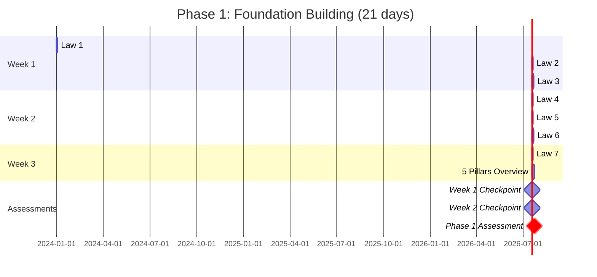

# New Graduate Learning Path

!!! abstract "Your Journey Begins"
 Welcome to distributed systems! This learning path is designed for recent graduates and engineers with 0-2 years of experience. You'll build a solid foundation in distributed systems principles before diving into real-world applications.

## 🎯 Learning Path Overview

<div class="grid cards" markdown>

- :material-map:{ .lg .middle } **Your Complete Journey**
    
    ---
    
    ```mermaid
    graph LR
        Start["fa:fa-graduation-cap Start"] --> Phase1["fa:fa-book Phase 1<br/>Foundations<br/>2-3 weeks"]
        Phase1 --> Phase2["fa:fa-tools Phase 2<br/>Patterns<br/>3-4 weeks"]
        Phase2 --> Phase3["fa:fa-rocket Phase 3<br/>Applications<br/>2-3 weeks"]
        Phase3 --> Phase4["fa:fa-briefcase Phase 4<br/>Interview Prep<br/>1-2 weeks"]
        Phase4 --> Next["fa:fa-star Next Level"]
        
        style Start fill:#4caf50,color:#fff
        style Phase1 fill:#2196f3,color:#fff
        style Phase2 fill:#ff9800,color:#fff
        style Phase3 fill:#9c27b0,color:#fff
        style Phase4 fill:#f44336,color:#fff
        style Next fill:#ffc107,color:#000
    ```

- :material-timer:{ .lg .middle } **Time & Difficulty**
    
    ---
    
    **Total Duration**: 10-12 weeks  
    **Daily Commitment**: 1-2 hours  
    **Difficulty Progress**:  
    🟢 Easy → 🟡 Medium → 🔴 Hard  
    
    **Milestones**:
    - Week 3: Understand core concepts
    - Week 6: Build first distributed app
    - Week 9: Design complete systems
    - Week 12: Interview ready!

</div>

## 🎯 Learning Objectives

By completing this path, you will:

- Understand the fundamental laws governing distributed systems
- Build intuition about trade-offs in system design
- Learn essential patterns used in production systems
- Develop skills to participate in system design discussions
- Prepare for distributed systems interviews

## 📚 Recommended Prerequisites

- Basic programming experience (any language)
- Understanding of data structures and algorithms
- Familiarity with networking concepts (TCP/IP, HTTP)
- Basic database knowledge (SQL, ACID properties)

## 🗺️ Your Learning Journey

### Phase 1: Foundations (2-3 weeks)

!!! tip "Start Here - Build Your Mental Models"
 Begin with the core concepts that govern all distributed systems. These aren't just theory - they explain why production systems fail and how to prevent it.

<div class="grid cards" markdown>

- **Week 1: The 7 Laws** 🟢 *Difficulty: Easy*
 
 ---
 
 **Day 1-2**: [Law 1: Correlated Failure](../../core-principles/laws/correlated-failure/index.md)
 - 🎯 Learn: Why redundancy isn't enough
 - 🛠️ Practice: Identify correlated failures in AWS outages
 - ⏱️ Time: 3-4 hours
 
 **Day 3-4**: [Law 2: Asynchronous Reality](../../core-principles/laws/asynchronous-reality/index.md)
 - 🎯 Learn: Network delays and timeouts
 - 🛠️ Practice: Build a timeout simulator
 - ⏱️ Time: 3-4 hours
 
 **Day 5-7**: [Law 3: Emergent Chaos](../../core-principles/laws/emergent-chaos/index.md)
 - 🎯 Learn: Complex behaviors from simple rules
 - 🛠️ Practice: Trace a cascade failure
 - ⏱️ Time: 4-5 hours

- **Week 2: Core Concepts** 🟡 *Difficulty: Medium*
 
 ---
 
 **Day 8-9**: [Law 4: Trade-offs](../../core-principles/laws/multidimensional-optimization/index.md)
 - 🎯 Learn: CAP theorem in depth
 - 🛠️ Practice: Design trade-off matrices
 - ⏱️ Time: 3-4 hours
 
 **Day 10-11**: [Law 5: Distributed Knowledge](../../core-principles/laws/distributed-knowledge/index.md)
 - 🎯 Learn: Consensus and coordination
 - 🛠️ Practice: Implement vector clocks
 - ⏱️ Time: 4-5 hours
 
 **Day 12-14**: [Law 6: Cognitive Load](../../core-principles/laws/cognitive-load/index.md)
 - 🎯 Learn: Why simple systems win
 - 🛠️ Practice: Simplify a complex design
 - ⏱️ Time: 3-4 hours

- **Week 3: Economics & Pillars** 🟡 *Difficulty: Medium*
 
 ---
 
 **Day 15-16**: [Law 7: Economic Reality](../../core-principles/laws/economic-reality/index.md)
 - 🎯 Learn: Cost-driven architecture
 - 🛠️ Practice: Calculate system costs
 - ⏱️ Time: 3-4 hours
 
 **Day 17-21**: [The 5 Pillars Overview](../../core-principles/pillars.md/index.md)
 - 🎯 Learn: Distribution strategies
 - 🛠️ Practice: Map pillars to real systems
 - ⏱️ Time: 8-10 hours
 
 **✅ Checkpoint**: Can you explain each law in 2 minutes?

</div>

### 📈 Phase 1 Progress Tracker



### 📊 Phase 1 Checkpoint Assessments

<div class="grid cards" markdown>

- **Week 1 Checkpoint: Basic Laws Mastery** 🟢 *Beginner Level*
    
    ---
    
    **Assessment Format**: Interactive quiz + practical exercise (90 minutes)
    
    **Skills Validated**:
    - [ ] Explain each of the first 3 laws in 2 minutes
    - [ ] Identify failure correlation in real AWS outage scenarios
    - [ ] Calculate timeout values for distributed service calls
    - [ ] Trace cascade failure through system dependencies
    
    **Practical Exercise**: Analyze Netflix 2021 outage and identify correlated failure patterns
    
    **Pass Score**: 80% on quiz + successful completion of practical exercise
    **Retake Policy**: Immediate retake available with different scenarios

- **Week 2 Checkpoint: Trade-offs & Coordination** 🟡 *Intermediate Level*
    
    ---
    
    **Assessment Format**: Design challenge + peer discussion (2 hours)
    
    **Skills Validated**:
    - [ ] Apply CAP theorem to real system design choices
    - [ ] Design consensus solution for simple distributed problem
    - [ ] Evaluate cognitive load of different architectures
    - [ ] Make informed trade-off decisions with reasoning
    
    **Design Challenge**: Choose between CP and AP system for order management
    
    **Pass Score**: Demonstrate clear reasoning for all design choices
    **Peer Review**: Present solution to learning cohort for feedback

- **Phase 1 Final Assessment: Foundations Mastery** 🟡 *Moving to Intermediate*
    
    ---
    
    **Assessment Format**: Comprehensive system analysis (3 hours)
    
    **Skills Validated**:
    - [ ] Apply all 7 laws to analyze existing system architecture
    - [ ] Map system components to the 5 distribution pillars
    - [ ] Identify potential failure modes and mitigation strategies
    - [ ] Calculate economic trade-offs for architectural decisions
    
    **Case Study**: Analyze Spotify's backend architecture using all learned principles
    
    **Deliverables**:
    - [ ] Written analysis (1500 words) applying all 7 laws
    - [ ] Architecture diagram mapping to 5 pillars
    - [ ] Risk assessment with mitigation strategies
    - [ ] Cost-benefit analysis of key architectural decisions
    
    **Pass Score**: 85% comprehensive understanding demonstrated
    **Success Indicator**: Ready to move to pattern learning phase

</div>

### Phase 2: Essential Patterns (3-4 weeks)

!!! info "Build Your Toolkit"
 Learn the patterns you'll use every day in distributed systems. Each pattern solves a specific problem you'll encounter.

<div class="grid cards" markdown>

- **Week 4-5: Resilience Patterns** 🟢 *Start Here*
 
 ---
 
 **Why First**: Every system needs these from day one
 
 **Pattern Schedule**:
 
 **Day 22-23**: [Timeout](../pattern-library/resilience/timeout/index.md)
 - 🎯 Problem: Hanging requests
 - 🛠️ Build: Timeout wrapper function
 - 📊 Success: Handle 95% of network issues
 
 **Day 24-25**: [Retry & Backoff](../pattern-library/resilience/retry-backoff/index.md)
 - 🎯 Problem: Transient failures
 - 🛠️ Build: Exponential backoff library
 - 📊 Success: Recover from 80% of failures
 
 **Day 26-28**: [Circuit Breaker](../pattern-library/resilience/circuit-breaker/index.md)
 - 🎯 Problem: Cascade failures
 - 🛠️ Build: Circuit breaker class
 - 📊 Success: Prevent system-wide outages
 
 **Day 29-30**: [Health Check](../pattern-library/resilience/health-check/index.md)
 - 🎯 Problem: Silent failures
 - 🛠️ Build: Health monitoring endpoint
 - 📊 Success: Detect issues in < 30s

- **Week 6: Data Patterns** 🟡 *Getting Deeper*
 
 ---
 
 **Why Next**: Handle data at scale
 
 **Pattern Schedule**:
 
 **Day 31-32**: [Caching Strategies](../pattern-library/scaling/caching-strategies/index.md)
 - 🎯 Problem: Slow repeated queries
 - 🛠️ Build: LRU cache with TTL
 - 📊 Success: 10x performance boost
 
 **Day 33-35**: [CQRS](../pattern-library/data-management/cqrs/index.md)
 - 🎯 Problem: Read/write conflicts
 - 🛠️ Build: Separate read/write models
 - 📊 Success: Scale reads independently
 
 **Day 36-37**: [Event Sourcing](../pattern-library/data-management/event-sourcing/index.md)
 - 🎯 Problem: Lost state changes
 - 🛠️ Build: Event log system
 - 📊 Success: Complete audit trail

- **Week 7: Coordination Patterns** 🟡 *Bringing It Together*
 
 ---
 
 **Why Last**: Connect your services
 
 **Pattern Schedule**:
 
 **Day 38-39**: [Load Balancing](../pattern-library/scaling/load-balancing/index.md)
 - 🎯 Problem: Uneven work distribution
 - 🛠️ Build: Round-robin balancer
 - 📊 Success: Even load across servers
 
 **Day 40-41**: [Service Discovery](../pattern-library/communication/service-discovery/index.md)
 - 🎯 Problem: Finding services
 - 🛠️ Build: Service registry
 - 📊 Success: Dynamic service location
 
 **Day 42**: [API Gateway](../pattern-library/communication/api-gateway/index.md)
 - 🎯 Problem: Multiple entry points
 - 🛠️ Build: Simple gateway
 - 📊 Success: Single API surface

</div>

### 📝 Phase 2 Hands-On Projects

!!! example "Build These Mini-Projects"
    **Week 4-5 Project**: Resilient HTTP Client
    - Implement all 4 resilience patterns
    - Test with chaos injection
    - Handle 99% of network failures
    
    **Week 6 Project**: Event-Driven Order System  
    - Use CQRS for orders
    - Event sourcing for history
    - Cache for performance
    
    **Week 7 Project**: Microservice Communication
    - Service discovery
    - Load balanced calls
    - API gateway frontend

### Phase 3: Real-World Applications (2-3 weeks)

!!! success "Apply Your Knowledge"
 See how theory meets practice in production systems. Analyze real architectures and build your own.

<div class="grid cards" markdown>

- **Week 8-9: Case Studies** 🟠 *Real Systems*
 
 ---
 
 **Learn from the Best**:
 
 **Days 43-46**: System Analysis
 - 📖 Study: [WhatsApp Architecture](../chat-system/index.md)
   - 2B users, 100B messages/day
   - Identify: Which patterns do they use?
   - Design: Your own chat system
 
 **Days 47-50**: Build Something
 - 🛠️ Project: [URL Shortener](../url-shortener/index.md)
   - Requirements: 100M URLs, < 50ms latency
   - Implement: Sharding, caching, analytics
   - Deploy: Actually run it!
 
 **Days 51-53**: Advanced Design
 - 🧩 Challenge: [Distributed KV Store](../key-value-store/index.md)
   - Like Redis but distributed
   - Consistent hashing, replication
   - Compare with DynamoDB

- **Week 10: Quantitative Skills** 🟡 *Do the Math*
 
 ---
 
 **Engineering is Numbers**:
 
 **Day 54**: [Latency Ladder](quantitative/latency-ladder/index.md)
 - 📊 Memorize: L1 cache = 1ns, Network = 150ms
 - 🛠️ Calculate: Your system's latency budget
 - 🎯 Goal: Estimate any operation's time
 
 **Day 55**: [Little's Law](../architects-handbook/quantitative-analysis/littles-law.mdindex.md)
 - 📊 Formula: L = λW
 - 🛠️ Apply: Size your thread pools
 - 🎯 Goal: Predict queue behavior
 
 **Day 56-57**: [CAP Theorem](quantitative/cap-theorem/index.md)
 - 📊 Understand: The triangle of trade-offs
 - 🛠️ Design: CP vs AP systems
 - 🎯 Goal: Make informed choices

</div>

### 🏆 Phase 3 Capstone Project

!!! example "Build a Complete System"
    **Multi-User Task Manager** (5 days)
    
    Requirements:
    - Real-time updates (WebSocket)
    - Offline support (Event sourcing)
    - Global scale (Multi-region)
    - 99.9% uptime (Circuit breakers)
    
    Architecture:
    - Frontend: React with offline sync
    - API: Gateway with rate limiting  
    - Services: Tasks, Users, Notifications
    - Data: Sharded PostgreSQL + Redis
    - Events: Kafka for real-time updates

### Phase 4: Interview Preparation (1-2 weeks)

!!! warning "Practice Makes Perfect"
 Transform your knowledge into interview success. Practice explaining complex concepts simply.

<div class="grid cards" markdown>

- **Week 11: Design Practice** 🔴 *Interview Mode*
 
 ---
 
 **Daily 45-min Mock Interviews**:
 
 **Day 58-59**: Foundation Review
 - 📋 Review all 7 laws (30 min)
 - 🎯 Practice explaining each in 2 min
 - 🛠️ Draw standard architectures
 
 **Day 60-61**: Pattern Application
 - 📋 Design: Instagram feed
 - 🎯 Include: Caching, sharding, CDN
 - ⏱️ Time limit: 45 minutes
 
 **Day 62-63**: Scale Challenges  
 - 📋 Design: Uber's location service
 - 🎯 Handle: 1M drivers, real-time
 - 📊 Calculate: Storage, bandwidth

- **Week 12: Final Polish** 🏁 *You're Ready!*
 
 ---
 
 **Interview Success Kit**:
 
 **Day 64-65**: Common Pitfalls
 - ⚠️ Avoid: Over-engineering
 - ⚠️ Avoid: Ignoring constraints
 - ⚠️ Avoid: No trade-off discussion
 
 **Day 66-67**: Your Toolkit
 - 📦 Build: Personal pattern library
 - 📈 Create: Capacity spreadsheet
 - 🎨 Draw: Go-to architectures
 
 **Day 68-70**: Mock Interviews
 - 👥 Practice with peers
 - 📹 Record yourself
 - 📝 Get feedback

</div>

### 🌟 Phase 4 Success Metrics

!!! success "You're Interview-Ready When:"
    ✅ Explain any law in 2 minutes  
    ✅ Draw 5 patterns from memory  
    ✅ Design a system in 45 minutes  
    ✅ Calculate capacity requirements  
    ✅ Discuss trade-offs confidently  
    ✅ Handle "what if" questions  
    ✅ Know when NOT to distribute

## 📊 Progress Tracking

Use this checklist to track your progress:

### Foundations Checklist
- [ ] Read all 7 Laws
- [ ] Complete Law exercises
- [ ] Understand the 5 Pillars
- [ ] Take the foundations quiz

### Patterns Checklist
- [ ] Implement retry with exponential backoff
- [ ] Build a simple circuit breaker
- [ ] Design a caching layer
- [ ] Create an event-driven system

### Case Studies Checklist
- [ ] Analyze 3 case studies
- [ ] Identify patterns used in each
- [ ] Draw system architecture diagrams
- [ ] Calculate capacity requirements

### Interview Prep Checklist
- [ ] Complete 5 mock designs
- [ ] Practice with a peer
- [ ] Review common mistakes
- [ ] Build your cheat sheet

## 🎓 Next Steps & Beyond

### 🚀 After Completing This Path

<div class="grid cards" markdown>

- :material-rocket:{ .lg .middle } **Immediate Actions**
    
    ---
    
    1. **Build Something Real**
       - Open source contribution
       - Side project with 3+ services
       - Blog about your learning
    
    2. **Join Communities**
       - [r/DistributedSystems](https://reddit.com/r/distributedsystems/index.md)
       - [System Design Discord](#)
       - Local meetups
    
    3. **Keep Learning**
       - Read one paper/week
       - Follow [Morning Paper](https://blog.acolyer.org/index.md)
       - Watch conference talks

- :material-trending-up:{ .lg .middle } **Your Next Path**
    
    ---
    
    **Ready for More?**
    
    ➡️ [Senior Engineer Path](../architects-handbook/learning-paths/senior-engineer.md)
    - Advanced patterns
    - Performance optimization  
    - Leading design reviews
    
    ➡️ [Specialization Tracks](../architects-handbook/learning-paths/specializations/index.md)
    - Cloud-native systems
    - Real-time architectures
    - Data infrastructure
    
    ➡️ [Architecture Path](../architects-handbook/learning-paths/architect.md)
    - Enterprise patterns
    - Cost optimization
    - Migration strategies

</div>

### 🎉 Congratulations!

!!! quote "You've Come So Far!"
    In 12 weeks, you've transformed from a beginner to someone who can:
    - Understand why distributed systems fail
    - Apply patterns to solve real problems
    - Design scalable architectures
    - Confidently discuss trade-offs
    
    **Remember**: The best engineers never stop learning. This is just the beginning of your distributed systems journey!

## 📚 Resources & Support

### 📖 Essential Reading List

<div class="grid cards" markdown>

- **Beginner Books**
    - 📕 "Designing Data-Intensive Applications" - Start with Ch 1-4
    - 📘 "Understanding Distributed Systems" - Great primer
    - 📙 "The Little Book of Semaphores" - Concurrency basics

- **Free Resources**  
    - 🎓 [MIT 6.824 Lectures](https://www.youtube.com/playlist?list=PLrw6a1wE39_tb2fErI4-WkMbsvGQk9_UB/index.md)
    - 📝 [High Scalability](http://highscalability.com/index.md)
    - 📡 [The Morning Paper](https://blog.acolyer.org/index.md)

- **Hands-On Labs**
    - 🛠️ [Distributed Systems Challenges](https://github.com/pingcap/talent-plan/index.md)
    - 🧪 [Build Your Own X](https://github.com/codecrafters-io/build-your-own-x/index.md)
    - 🎮 [Distributed Systems Course](https://pdos.csail.mit.edu/6.824/index.md)

</div>

### 🤝 Get Help

!!! tip "You're Not Alone!"
    - **Office Hours**: Weekly Q&A sessions
    - **Study Groups**: Find partners in Discord
    - **Mentorship**: Connect with senior engineers
    - **Code Reviews**: Get feedback on projects

## 💡 Tips for Success

!!! tip "Learning Strategies"
 1. **Draw Everything**: Visualize systems with diagrams
 2. **Question Assumptions**: Always ask "what if this fails?"
 3. **Start Small**: Build toy versions before studying complex systems
 4. **Pair Learning**: Discuss concepts with peers
 5. **Apply Immediately**: Use patterns in your current projects

## 🗓️ Time Commitment

- **Total Duration**: 10-12 weeks
- **Daily Commitment**: 1-2 hours
- **Weekly Projects**: 3-5 hours
- **Total Time**: ~120-150 hours

### 🎯 Final Advice

!!! quote "Words of Wisdom from Senior Engineers"
    **"Draw everything"** - Visualize before you code  
    **"Start simple"** - Complexity is earned, not assumed  
    **"Fail fast"** - Learn from small failures  
    **"Question why"** - Understand the problem before the solution  
    **"Build often"** - Theory without practice is incomplete  

Remember: This is a marathon, not a sprint. Take time to deeply understand each concept before moving forward. The goal isn't to rush through—it's to build a solid foundation that will serve you for years.

**You've got this! 🚀**

---

<div class="grid cards" markdown>

- :material-arrow-left:{ .lg .middle } **Previous**
 
 ---
 
 [Learning Paths Overview](../architects-handbook/learning-paths/cost.md)

- :material-arrow-right:{ .lg .middle } **Next**
 
 ---
 
 [Senior Engineer Path](../architects-handbook/learning-paths/senior-engineer.md)

</div>