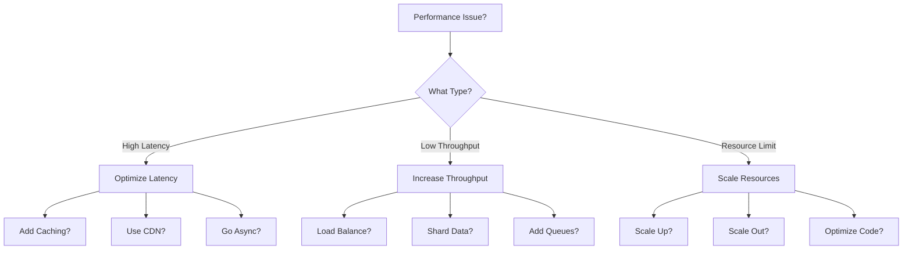

# Performance & Scale Learning Path

!!! abstract "Scale to Millions"
 This path focuses on building systems that perform at scale. Learn to optimize latency, maximize throughput, and scale systems from thousands to millions of users while maintaining performance.

## 🎯 Learning Objectives

By completing this path, you will:

- Understand performance fundamentals and bottlenecks
- Design systems that scale horizontally and vertically
- Optimize for latency, throughput, and resource utilization
- Implement caching, load balancing, and partitioning strategies
- Monitor and troubleshoot performance issues in production

## 📚 Prerequisites

- Strong programming background
- Experience with distributed systems basics
- Understanding of networking and databases
- Familiarity with cloud platforms
- Basic knowledge of monitoring tools

## 🗺️ Performance Journey

### Phase 1: Performance Foundations (1 week)

!!! info "Build Your Intuition"
 Start with the fundamentals of system performance.

<div class="grid cards" markdown>

- **Performance Theory**
 
 Essential concepts:
 
 - [Latency Ladder](quantitative/latency-ladder) - Know your numbers
 - [Little's Law](quantitative/littles-law) - Queue theory basics
 - [Universal Scalability Law](quantitative/universal-scalability) - Scaling limits

- **Measurement & Analysis**
 
 Quantify performance:
 
 - [Performance Modeling](quantitative/performance-modeling) - Predict behavior
 - [Queueing Models](quantitative/queueing-models) - Analyze bottlenecks
 - [Capacity Planning](quantitative/capacity-planning) - Resource estimation

</div>

### Phase 2: Optimization Techniques (2 weeks)

!!! warning "Core Performance Patterns"
 Master the patterns that deliver 10x improvements.

#### Week 2: Caching Strategies

=== "Cache Types"
 Different caching approaches:
 - [Cache Aside](../pattern-library/scaling/caching-strategies.md) - Lazy population
 - [Read Through Cache](../pattern-library/scaling/caching-strategies.md) - Transparent reads
 - [Write Through Cache](../pattern-library/scaling/caching-strategies.md) - Consistent writes
 - [Write Behind Cache](../pattern-library/scaling/caching-strategies.md) - Async writes

=== "Cache Design"
 Implementation considerations:
 - Cache hierarchy (L1, L2, CDN)
 - Eviction policies (LRU, LFU, TTL)
 - Cache coherence strategies
 - **Project**: Build a distributed cache

=== "Advanced Caching"
 Sophisticated techniques:
 - [Tile Caching](../pattern-library/scaling/tile-caching.md) - Spatial data
 - Predictive caching
 - Cache warming strategies
 - Multi-tier caching

#### Week 3: Load Distribution

- [Load Balancing](../patterns/load-balancing) - Traffic distribution
- [Sharding](../patterns/sharding) - Data partitioning
- [Request Routing](../patterns/request-routing) - Smart routing
- [Scatter Gather](../patterns/scatter-gather) - Parallel processing

### Phase 3: Scaling Strategies (2 weeks)

!!! success "Scale Without Limits"
 Learn to scale systems to handle massive load.

#### Week 4: Horizontal Scaling

=== "Service Scaling"
 Scale your application tier:
 - [Auto-Scaling](../patterns/auto-scaling) - Dynamic capacity
 - [Service Mesh](../patterns/service-mesh) - Service management
 - [Bulkhead](../patterns/bulkhead) - Resource isolation
 - **Case Study**: [Netflix Architecture](../netflix-streaming)

=== "Data Scaling"
 Scale your data tier:
 - [Geo-Replication](../patterns/geo-replication) - Global distribution
 - [Multi-Region](../patterns/multi-region) - Active-active
 - Database sharding strategies
 - **Case Study**: [Cassandra at Scale](../cassandra)

=== "Message Scaling"
 Scale your messaging layer:
 - [Event Streaming](../patterns/event-streaming) - High throughput
 - [Distributed Queue](../patterns/distributed-queue) - Work distribution
 - Partitioned topics (Kafka)
 - **Case Study**: [LinkedIn Kafka](../kafka)

#### Week 5: Performance Patterns

Advanced optimization patterns:

- [CQRS](../patterns/cqrs) - Optimize reads and writes separately
- [Event Sourcing](../patterns/event-sourcing) - Async processing
- [Lambda Architecture](../patterns/lambda-architecture) - Batch + real-time
- [Edge Computing](../patterns/edge-computing) - Move compute closer

### Phase 4: Production Performance (1 week)

!!! danger "Real-World Challenges"
 Handle performance in production environments.

#### Week 6: Monitoring & Optimization

<div class="grid cards" markdown>

- **Performance Monitoring**
 - [Observability](../patterns/observability)
 - Distributed tracing
 - Performance profiling
 - Anomaly detection

- **Bottleneck Analysis**
 - CPU profiling
 - Memory analysis
 - Network optimization
 - Disk I/O tuning

- **Optimization Techniques**
 - Query optimization
 - Connection pooling
 - Batch processing
 - Compression strategies

- **Capacity Management**
 - Resource forecasting
 - Cost optimization
 - Elasticity planning
 - Performance budgets

</div>

## 📊 Performance Projects

### Project 1: Build a High-Performance API
```yaml
requirements:
 - Handle 100K requests/second
 - P99 latency < 10ms
 - Horizontal scaling
 - Multi-region deployment

components:
 - Load balancer with health checks
 - Connection pooling
 - Response caching
 - Rate limiting
 - Performance monitoring
```

### Project 2: Optimize a Slow System
```yaml
scenario: E-commerce site with performance issues
tasks:
 1. Profile and identify bottlenecks
 2. Implement caching strategy
 3. Optimize database queries
 4. Add CDN for static assets
 5. Implement auto-scaling
 6. Achieve 10x performance improvement
```

### Project 3: Design a Real-Time Analytics System
```yaml
requirements:
 - Process 1M events/second
 - Real-time dashboards
 - Historical analysis
 - Sub-second query response

architecture:
 - Stream processing (Kafka + Flink)
 - Time-series database
 - Materialized views
 - WebSocket updates
```

## 🧪 Performance Labs

### Lab 1: Latency Optimization
```bash
# Measure baseline latency
wrk -t12 -c400 -d30s http://api.example.com/endpoint

# Implement optimizations:
1. Add caching layer
2. Optimize database queries
3. Enable connection pooling
4. Add response compression

# Measure improvement
# Target: 90% latency reduction
```

### Lab 2: Throughput Scaling
```python
# Load test with increasing concurrency
for concurrent_users in [100, 1000, 10000, 100000]:
 run_load_test(concurrent_users)
 measure_throughput()
 identify_bottlenecks()
 scale_resources()
```

### Lab 3: Cache Effectiveness
```yaml
experiment:
 - Implement various cache strategies
 - Measure hit rates
 - Analyze memory usage
 - Compare performance gains
 
metrics:
 - Cache hit ratio > 95%
 - Response time improvement > 80%
 - Memory efficiency
```

## 📈 Performance Decision Framework

### Optimization Priority Matrix

| Optimization | Impact | Effort | Priority |
|--------------|--------|--------|----------|
| Add caching | High | Low | Do First |
| Database indexing | High | Low | Do First |
| Query optimization | High | Medium | Do Second |
| Horizontal scaling | High | High | Plan Carefully |
| Code optimization | Medium | Medium | Do Third |
| Hardware upgrade | Medium | High | Last Resort |


### Scaling Decision Tree



## 🔍 Performance Debugging

### Common Performance Issues
- [ ] N+1 query problems
- [ ] Memory leaks
- [ ] Connection pool exhaustion
- [ ] Cache stampedes
- [ ] Hot partitions
- [ ] Cascading failures

### Performance Tools
```yaml
profiling:
 - CPU: pprof, flamegraphs
 - Memory: heapdump, MAT
 - Network: tcpdump, Wireshark
 - Application: APM tools

monitoring:
 - Metrics: Prometheus, Grafana
 - Tracing: Jaeger, Zipkin
 - Logs: ELK stack
 - Synthetic: Pingdom, StatusCake

load_testing:
 - Tools: JMeter, Gatling, Locust
 - Techniques: Spike, soak, stress testing
```

## 📚 Performance Resources

### Essential Reading
- "High Performance Browser Networking" - Ilya Grigorik
- "Systems Performance" - Brendan Gregg
- "The Art of Capacity Planning" - John Allspaw
- "Release It!" - Michael Nygard

### Papers & Articles
- "The Tail at Scale" - Google
- "Latency Numbers Every Programmer Should Know"
- "Scaling Memcache at Facebook"
- "TAO: Facebook's Distributed Data Store"

### Performance Blogs
- High Scalability
- Brendan Gregg's Blog
- Mechanical Sympathy
- Facebook Engineering

## 💡 Performance Best Practices

!!! tip "Performance Wisdom"
 1. **Measure First**: Never optimize without data
 2. **80/20 Rule**: Focus on the biggest bottlenecks
 3. **Cache Everything**: But invalidate carefully
 4. **Async When Possible**: Don't block on I/O
 5. **Monitor Always**: You can't improve what you don't measure

## 🏁 Performance Benchmarks

### Target Metrics
```yaml
latency_targets:
 p50: < 10ms
 p90: < 50ms
 p99: < 100ms
 p99.9: < 500ms

throughput_targets:
 minimum: 1000 req/s
 normal: 10000 req/s
 peak: 100000 req/s

efficiency_targets:
 cpu_utilization: 60-80%
 memory_usage: < 80%
 cache_hit_rate: > 90%
 error_rate: < 0.1%
```

## ⏱️ Time Investment

- **Total Duration**: 6 weeks
- **Weekly Commitment**: 10-12 hours
- **Hands-on Labs**: 50% of time
- **Total Time**: ~60-72 hours

---

<div class="grid cards" markdown>

- :material-arrow-left:{ .lg .middle } **Previous**
 
 ---
 
 [Consistency Path](/architects-handbook/learning-paths/consistency)

- :material-arrow-right:{ .lg .middle } **Next**
 
 ---
 
 [Cost Optimization Path](/architects-handbook/learning-paths/cost)

</div>