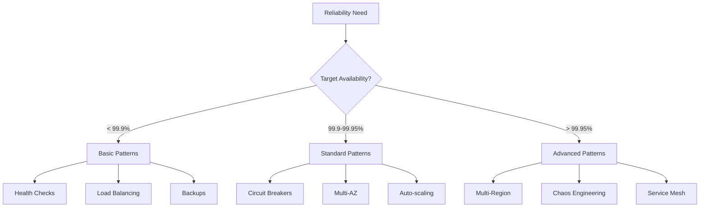

# Reliability & Resilience Learning Path

!!! abstract "Build Unbreakable Systems"
 This path teaches you to design and operate systems that stay up when everything goes wrong. Learn patterns, practices, and principles for achieving 99.99%+ availability in distributed systems.

## 🎯 Learning Objectives

By completing this path, you will:

- Design fault-tolerant distributed systems
- Implement resilience patterns and circuit breakers
- Build high availability architectures
- Create effective disaster recovery plans
- Establish SRE practices and incident response
- Achieve and maintain SLOs in production

## 📚 Prerequisites

- Strong distributed systems fundamentals
- Experience with production systems
- Understanding of networking and infrastructure
- Familiarity with monitoring and alerting
- Basic knowledge of statistics

## 🗺️ Reliability Journey

### Phase 1: Reliability Foundations (1 week)

!!! info "Understand Failure"
 Learn why systems fail and how to prevent it.

<div class="grid cards" markdown>

- **Failure Theory**
 
 Core concepts:
 
 - [Law 1: Correlated Failure](../../core-principles/laws/correlated-failure) - Why things fail together
 - [Failure Models](quantitative/failure-models) - Types of failures
 - [Availability Math](quantitative/availability-math) - Calculate uptime

- **Reliability Engineering**
 
 Quantitative approach:
 
 - [Reliability Theory](quantitative/reliability-theory) - MTBF, MTTR
 - [SRE Practices](../../architects-handbook/human-factors/sre-practices.md) - Google's approach
 - [Error Budgets](quantitative/error-budgets) - Managing risk

</div>

### Phase 2: Resilience Patterns (2 weeks)

!!! warning "Defense in Depth"
 Layer multiple patterns for maximum resilience.

#### Week 2: Core Resilience Patterns

=== "Failure Isolation"
 Prevent cascade failures:
 - [Circuit Breaker](../pattern-library/resilience/circuit-breaker) - Stop cascades
 - [Bulkhead](../pattern-library/resilience/bulkhead) - Resource isolation
 - [Timeout](../pattern-library/resilience/timeout) - Bounded waiting
 - **Project**: Implement circuit breaker library

=== "Recovery Patterns"
 Graceful failure handling:
 - [Retry & Backoff](../pattern-library/resilience/retry-backoff) - Transient failures
 - [Graceful Degradation](../pattern-library/resilience/graceful-degradation) - Feature flags
 - [Failover](../pattern-library/resilience/failover) - Automatic recovery
 - **Project**: Build retry with jitter

=== "Overload Protection"
 Handle traffic spikes:
 - [Rate Limiting](../pattern-library/scaling/rate-limiting) - Request caps
 - [Load Shedding](../pattern-library/resilience/load-shedding) - Selective drops
 - [Backpressure](../pattern-library/scaling/backpressure) - Flow control
 - **Project**: Implement adaptive rate limiter

#### Week 3: Advanced Patterns

System-level resilience:

- [Health Check](../pattern-library/resilience/health-check) - Liveness and readiness
- [Idempotent Receiver](../pattern-library/idempotent-receiver) - Safe retries
- [Split Brain](../pattern-library/resilience/split-brain) - Network partition handling
- [Chaos Engineering](../../architects-handbook/human-factors/chaos-engineering.md) - Proactive testing

### Phase 3: High Availability Architecture (2 weeks)

!!! success "Design for Five 9s"
 Build systems with 99.999% availability.

#### Week 4: HA Design Patterns

=== "Redundancy Strategies"
 Eliminate single points of failure:
 - Active-Active vs Active-Passive
 - N+1, N+2, and 2N redundancy
 - Geographic distribution
 - **Case Study**: [Netflix Multi-Region](../netflix-streaming)

=== "Data Resilience"
 Protect your data:
 - [Multi-Region](../pattern-library/scaling/multi-region) - Global deployment
 - [Geo-Replication](../pattern-library/scaling/geo-replication) - Data distribution
 - Backup and restore strategies
 - **Case Study**: [Amazon S3 Durability](../s3-object-storage-enhanced)

=== "Service Mesh"
 Infrastructure-level resilience:
 - [Service Mesh](../pattern-library/communication/service-mesh) - Istio/Linkerd
 - Automatic retries and timeouts
 - Circuit breaking at mesh level
 - **Project**: Deploy Istio with resilience policies

#### Week 5: Disaster Recovery

Prepare for the worst:

- RTO and RPO planning
- Backup strategies (3-2-1 rule)
- Disaster recovery testing
- Runbook automation

### Phase 4: Operational Excellence (2 weeks)

!!! danger "Keep Systems Reliable"
 Maintain reliability through operational practices.

#### Week 6: SRE Implementation

<div class="grid cards" markdown>

- **Monitoring & Alerting**
 - [Observability](../pattern-library/observability)
 - SLI/SLO/SLA definition
 - Alert fatigue reduction
 - Synthetic monitoring

- **Incident Management**
 - [Incident Response](../../architects-handbook/human-factors/incident-response.md)
 - On-call rotation
 - Runbook creation
 - War room protocols

- **Chaos Engineering**
 - [Chaos Practices](../../architects-handbook/human-factors/chaos-engineering.md)
 - Game days
 - Failure injection
 - Hypothesis testing

- **Post-Incident**
 - [Blameless Postmortems](../../architects-handbook/human-factors/blameless-postmortems.md)
 - Root cause analysis
 - Action item tracking
 - Knowledge sharing

</div>

#### Week 7: Continuous Improvement

Build reliability culture:

- Error budget policies
- Reliability reviews
- Capacity planning
- Performance testing

## 📊 Reliability Projects

### Project 1: Build a Resilient Microservice
```yaml
requirements:
 - 99.95% availability SLO
 - Graceful degradation
 - Zero data loss
 - Sub-second failover

implement:
 - Health checks
 - Circuit breakers
 - Retries with backoff
 - Distributed tracing
 - Comprehensive monitoring
```

### Project 2: Chaos Engineering Exercise
```yaml
scenario: E-commerce platform
experiments:
 1. Kill random instances
 2. Introduce network latency
 3. Fill up disk space
 4. Corrupt data packets
 5. Simulate region failure

measure:
 - System behavior
 - Recovery time
 - Data integrity
 - User impact
```

### Project 3: Multi-Region Deployment
```yaml
architecture:
 regions: [us-east-1, eu-west-1, ap-southeast-1]
 requirements:
 - Active-active configuration
 - Data consistency
 - Automatic failover
 - <100ms latency globally

challenges:
 - Cross-region replication
 - Split-brain scenarios
 - Cost optimization
 - Compliance requirements
```

## 🧪 Reliability Labs

### Lab 1: Failure Injection
```python
# Test resilience with controlled failures
def chaos_test():
 scenarios = [
 "network_partition",
 "high_latency",
 "service_crash",
 "disk_full",
 "cpu_spike"
 ]
 
 for scenario in scenarios:
 inject_failure(scenario)
 measure_impact()
 verify_recovery()
 document_findings()
```

### Lab 2: Load Testing to Failure
```yaml
test_plan:
 - Start at normal load (1x)
 - Gradually increase (2x, 5x, 10x)
 - Find breaking point
 - Observe failure modes
 - Test recovery mechanisms
 
metrics:
 - Response time degradation
 - Error rate increase
 - Resource saturation
 - Cascade failures
```

### Lab 3: Disaster Recovery Drill
```bash
# Simulate complete region failure
1. Document current state
2. Trigger region failure
3. Measure detection time
4. Execute failover procedure
5. Verify data integrity
6. Calculate RTO/RPO
7. Restore primary region
8. Document improvements
```

## 📈 Reliability Decision Framework

### Availability Target Selection

| Target | Downtime/Year | Use Case | Cost |
|--------|---------------|----------|------|
| 99% | 3.65 days | Internal tools | $ |
| 99.9% | 8.76 hours | Business apps | $$ |
| 99.95% | 4.38 hours | Customer-facing | $$$ |
| 99.99% | 52.56 minutes | Critical services | $$$$ |
| 99.999% | 5.26 minutes | Life-critical | $$$$$ |


### Pattern Selection Matrix



## 🔍 Troubleshooting Guide

### Common Reliability Issues
- [ ] Cascading failures
- [ ] Resource exhaustion
- [ ] Slow memory leaks
- [ ] Connection pool depletion
- [ ] Thundering herd
- [ ] Split-brain scenarios

### Debugging Tools
```yaml
monitoring:
 - Prometheus + Grafana
 - Datadog / New Relic
 - ELK Stack
 - Jaeger / Zipkin

testing:
 - Chaos Monkey (Netflix)
 - Gremlin
 - Litmus Chaos
 - Toxiproxy

analysis:
 - Distributed tracing
 - Flame graphs
 - Core dumps
 - Network analysis
```

## 📚 Reliability Resources

### Essential Reading
- "Site Reliability Engineering" - Google
- "Release It!" - Michael Nygard
- "The Checklist Manifesto" - Atul Gawande
- "Drift into Failure" - Sidney Dekker

### Key Papers
- "How Complex Systems Fail" - Richard Cook
- "The Network is Reliable" - Peter Bailis
- "Simple Testing Can Prevent Most Critical Failures" - Yuan et al
- "Why Do Internet Services Fail?" - Oppenheimer et al

### Communities
- SREcon conferences
- USENIX ;login: magazine
- SRE Weekly newsletter
- Local SRE meetups

## 💡 Reliability Wisdom

!!! tip "Hard-Won Lessons"
 1. **Everything Fails**: Design assuming failure
 2. **Test in Production**: That's where failures happen
 3. **Automate Recovery**: Humans are slow
 4. **Measure Everything**: Can't improve what you don't measure
 5. **Practice Failures**: Game days save real days

## 🎯 Reliability Metrics

### Key SRE Indicators
```yaml
availability_slis:
 - Request success rate
 - Uptime percentage
 - Data durability
 
latency_slis:
 - p50 response time
 - p95 response time
 - p99 response time
 
quality_slis:
 - Error rate
 - Data freshness
 - Feature availability

operational_metrics:
 - MTTR (Mean Time To Recover)
 - MTTD (Mean Time To Detect)
 - Incident frequency
 - Error budget burn rate
```

## ⏱️ Time Investment

- **Total Duration**: 7 weeks
- **Weekly Commitment**: 10-12 hours
- **Hands-on Labs**: 60% of time
- **Total Time**: ~70-84 hours

---

<div class="grid cards" markdown>

- :material-arrow-left:{ .lg .middle } **Previous**
 
 ---
 
 [Cost Optimization Path](../../architects-handbook/learning-paths/cost.md)

- :material-arrow-right:{ .lg .middle } **Next**
 
 ---
 
 [Learning Paths Overview](../../architects-handbook/learning-paths/cost.md)

</div>