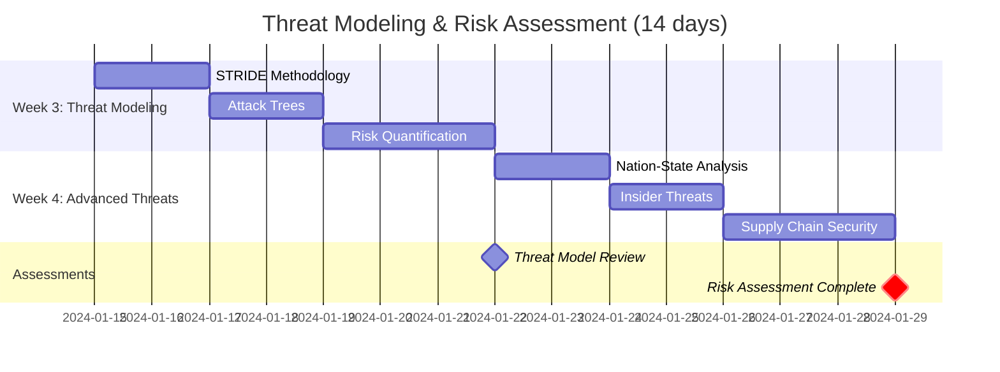

# Security Architect Learning Path

!!! abstract "Secure by Design, Not by Accident"
    This intensive 8-week path transforms engineers into security architects who can design, implement, and maintain secure distributed systems. Learn from real-world breaches and master the patterns that keep systems safe at scale.

## 🎯 Learning Path Overview

<div class="grid cards" markdown>

- :material-shield-check:{ .lg .middle } **Your Security Journey**
    
    ---
    
    ```mermaid
    graph TD
        Start["🎯 Security Assessment"] --> Foundation["🏗️ Week 1-2<br/>Security<br/>Fundamentals"]
        Foundation --> Threats["⚠️ Week 3-4<br/>Threat Modeling<br/>& Risk Assessment"]
        Threats --> Architecture["🏛️ Week 5-6<br/>Zero-Trust<br/>Architecture"]
        Architecture --> Advanced["🚀 Week 7-8<br/>Advanced Security<br/>& Compliance"]
        
        Foundation --> F1["CIA + Crypto"]
        Threats --> T1["STRIDE + Attack Trees"]
        Architecture --> A1["Zero Trust + IAM"]
        Advanced --> Ad1["Privacy + Compliance"]
        
        style Start fill:#d32f2f,color:#fff
        style Foundation fill:#f57c00,color:#fff
        style Threats fill:#1976d2,color:#fff
        style Architecture fill:#388e3c,color:#fff
        style Advanced fill:#7b1fa2,color:#fff
    ```

- :material-target:{ .lg .middle } **Career Outcomes**
    
    ---
    
    **By Week 4**: Lead threat modeling sessions  
    **By Week 6**: Design zero-trust architectures  
    **By Week 8**: Security architect role-ready  
    
    **Salary Ranges**:
    - Security Engineer: $120k-180k
    - Security Architect: $150k-250k+
    - CISO Track: $200k-400k+
    
    **Market Demand**: 3.5M unfilled cybersecurity jobs globally

</div>

## 🔍 Prerequisites Assessment

<div class="grid cards" markdown>

- :material-check-circle:{ .lg .middle } **Technical Prerequisites**
    
    ---
    
    **Essential Skills**:
    - [ ] 3+ years software development
    - [ ] Understanding of HTTP/TLS
    - [ ] Basic cloud security knowledge
    - [ ] Networking fundamentals
    
    **Recommended Background**:
    - [ ] Infrastructure as Code experience
    - [ ] Container/Kubernetes basics
    - [ ] Some security tool usage
    - [ ] Compliance framework awareness

- :material-brain:{ .lg .middle } **Security Mindset**
    
    ---
    
    **This path is ideal if you**:
    - [ ] Think adversarially by nature
    - [ ] Enjoy solving complex puzzles
    - [ ] Want to protect user data
    - [ ] Like staying ahead of threats
    
    **Time Commitment**: 15-20 hours/week
    - Theory and reading: 6-8 hours/week
    - Hands-on labs: 8-10 hours/week
    - Projects and research: 4-6 hours/week

</div>

!!! tip "Security Readiness Check"
    Complete our [Security IQ Assessment](../../tools/security-readiness-quiz/index.md) to identify any knowledge gaps before starting.

## 🗺️ Week-by-Week Curriculum

### Week 1-2: Security Fundamentals 🏗️

!!! info "Build Your Security Foundation"
    Master the core principles that govern all security decisions. Understand cryptography, authentication, and the fundamental security triad: Confidentiality, Integrity, Availability.

<div class="grid cards" markdown>

- **Week 1: Security Principles & Cryptography**
    
    ---
    
    **Learning Objectives**:
    - [ ] Master CIA triad and security principles
    - [ ] Understand modern cryptography
    - [ ] Implement secure authentication
    - [ ] Design authorization systems
    
    **Day 1-2**: Security Fundamentals
    - 📖 Read: [Security First Principles](../....../core-principles/security-first.md/index.md)
    - 🛠️ Lab: Analyze famous security breaches (Equifax, SolarWinds)
    - 📊 Success: Identify root causes and prevention strategies
    - ⏱️ Time: 6-8 hours
    
    **Day 3-4**: Applied Cryptography
    - 📖 Study: Symmetric/asymmetric encryption, hashing, digital signatures
    - 🛠️ Lab: Implement AES encryption and JWT tokens
    - 📊 Success: Secure data at rest and in transit
    - ⏱️ Time: 6-8 hours
    
    **Day 5-7**: Authentication & Authorization
    - 📖 Study: OAuth 2.0, OIDC, SAML, multi-factor authentication
    - 🛠️ Lab: Build identity provider with MFA
    - 📊 Success: Secure authentication flow
    - ⏱️ Time: 8-10 hours

- **Week 2: Application Security**
    
    ---
    
    **Learning Objectives**:
    - [ ] Master OWASP Top 10 vulnerabilities
    - [ ] Implement secure coding practices
    - [ ] Build security testing pipelines
    - [ ] Design secure APIs
    
    **Day 8-9**: OWASP Top 10 Deep Dive
    - 📖 Study: Injection, broken auth, XSS, etc.
    - 🛠️ Lab: Exploit and fix vulnerable applications
    - 📊 Success: Secure code review checklist
    - ⏱️ Time: 6-8 hours
    
    **Day 10-11**: Secure API Design
    - 📖 Read: [API security patterns](../../....../pattern-library/security.md/api-security/index.md)
    - 🛠️ Lab: Build secure REST API with rate limiting
    - 📊 Success: Pass security penetration test
    - ⏱️ Time: 6-8 hours
    
    **Day 12-14**: Security Testing Automation
    - 📖 Study: SAST, DAST, SCA, container scanning
    - 🛠️ Lab: Integrate security tools into CI/CD
    - 📊 Success: Automated security pipeline
    - ⏱️ Time: 8-10 hours

</div>

### Week 3-4: Threat Modeling & Risk Assessment ⚠️

!!! warning "Think Like an Attacker"
    Learn systematic approaches to identifying threats. Master STRIDE methodology, attack trees, and risk quantification. Build threat models that actually improve security.

<div class="grid cards" markdown>

- **Week 3: Threat Modeling Mastery**
    
    ---
    
    **Learning Objectives**:
    - [ ] Master STRIDE threat modeling
    - [ ] Build comprehensive attack trees
    - [ ] Quantify security risks
    - [ ] Design threat-informed architectures
    
    **Day 15-16**: STRIDE Methodology
    - 📖 Study: Spoofing, Tampering, Repudiation, Information Disclosure, DoS, Elevation
    - 🛠️ Lab: Threat model a payment system
    - 📊 Success: 20+ identified threats with mitigations
    - ⏱️ Time: 6-8 hours
    
    **Day 17-18**: Attack Trees & Kill Chains
    - 📖 Read: Attack tree construction, cyber kill chain
    - 🛠️ Lab: Model advanced persistent threat
    - 📊 Success: Complete attack scenario analysis
    - ⏱️ Time: 6-8 hours
    
    **Day 19-21**: Risk Assessment & Quantification
    - 📖 Study: FAIR risk model, ALE calculations
    - 🛠️ Lab: Quantify business impact of threats
    - 📊 Success: Risk-based security investment plan
    - ⏱️ Time: 8-10 hours

- **Week 4: Advanced Threat Analysis**
    
    ---
    
    **Learning Objectives**:
    - [ ] Analyze nation-state attack patterns
    - [ ] Understand insider threat models
    - [ ] Master supply chain security
    - [ ] Design resilient threat models
    
    **Day 22-23**: Nation-State & APT Analysis
    - 📖 Study: APT1, Lazarus, Cozy Bear tactics
    - 🛠️ Lab: Analyze real APT campaign (SolarWinds)
    - 📊 Success: Detection and prevention strategy
    - ⏱️ Time: 6-8 hours
    
    **Day 24-25**: Insider Threat Modeling
    - 📖 Read: Privilege abuse, data exfiltration patterns
    - 🛠️ Lab: Design insider threat detection system
    - 📊 Success: Behavioral anomaly detection
    - ⏱️ Time: 6-8 hours
    
    **Day 26-28**: Supply Chain Security
    - 📖 Study: Software supply chain attacks, dependency risks
    - 🛠️ Lab: Secure software bill of materials (SBOM)
    - 📊 Success: Supply chain risk assessment
    - ⏱️ Time: 8-10 hours

</div>

### 📈 Week 3-4 Progress Tracker



### Week 5-6: Zero-Trust Architecture 🏛️

!!! success "Never Trust, Always Verify"
    Design and implement zero-trust architectures that assume breach from day one. Master identity-centric security, microsegmentation, and continuous verification.

<div class="grid cards" markdown>

- **Week 5: Zero-Trust Foundations**
    
    ---
    
    **Learning Objectives**:
    - [ ] Design zero-trust network architecture
    - [ ] Implement identity-centric security
    - [ ] Build microsegmentation strategies
    - [ ] Master continuous authentication
    
    **Day 29-30**: Zero-Trust Principles
    - 📖 Study: NIST zero-trust architecture framework
    - 🛠️ Lab: Assess current architecture for zero-trust gaps
    - 📊 Success: Zero-trust readiness assessment
    - ⏱️ Time: 6-8 hours
    
    **Day 31-32**: Identity & Access Management
    - 📖 Read: [IAM patterns](../../....../pattern-library/security.md/identity-access/index.md)
    - 🛠️ Lab: Implement RBAC with attribute-based controls
    - 📊 Success: Dynamic access control system
    - ⏱️ Time: 6-8 hours
    
    **Day 33-35**: Network Microsegmentation
    - 📖 Study: Software-defined perimeters, network segmentation
    - 🛠️ Lab: Implement microsegmentation with Istio
    - 📊 Success: East-west traffic security
    - ⏱️ Time: 8-10 hours

- **Week 6: Zero-Trust Implementation**
    
    ---
    
    **Learning Objectives**:
    - [ ] Build device trust frameworks
    - [ ] Implement data-centric security
    - [ ] Design continuous monitoring
    - [ ] Master policy-based controls
    
    **Day 36-37**: Device Trust & Endpoint Security
    - 📖 Study: Device attestation, certificate-based authentication
    - 🛠️ Lab: Implement device trust with certificates
    - 📊 Success: Trusted device enrollment system
    - ⏱️ Time: 6-8 hours
    
    **Day 38-39**: Data Classification & Protection
    - 📖 Read: Data loss prevention, information rights management
    - 🛠️ Lab: Implement data classification and encryption
    - 📊 Success: Automated data protection policies
    - ⏱️ Time: 6-8 hours
    
    **Day 40-42**: Continuous Security Monitoring
    - 📖 Study: SIEM, SOAR, behavioral analytics
    - 🛠️ Lab: Build security monitoring dashboard
    - 📊 Success: Real-time threat detection
    - ⏱️ Time: 8-10 hours

</div>

### Week 7-8: Advanced Security & Compliance 🚀

!!! example "Enterprise-Grade Security"
    Master advanced security patterns, privacy engineering, and compliance frameworks. Build systems that pass the most rigorous audits and protect user privacy by design.

<div class="grid cards" markdown>

- **Week 7: Privacy Engineering & Compliance**
    
    ---
    
    **Learning Objectives**:
    - [ ] Design privacy-first architectures
    - [ ] Implement GDPR/CCPA compliance
    - [ ] Master data governance patterns
    - [ ] Build consent management systems
    
    **Day 43-44**: Privacy by Design
    - 📖 Study: Privacy design principles, differential privacy
    - 🛠️ Lab: Implement privacy-preserving analytics
    - 📊 Success: GDPR-compliant data processing
    - ⏱️ Time: 6-8 hours
    
    **Day 45-46**: Compliance Frameworks
    - 📖 Read: SOC2, ISO 27001, PCI DSS, HIPAA requirements
    - 🛠️ Lab: Map security controls to compliance frameworks
    - 📊 Success: Compliance readiness checklist
    - ⏱️ Time: 6-8 hours
    
    **Day 47-49**: Data Governance & DLP
    - 📖 Study: Data lifecycle management, retention policies
    - 🛠️ Lab: Build data governance platform
    - 📊 Success: Automated compliance reporting
    - ⏱️ Time: 8-10 hours

- **Week 8: Capstone Security Project**
    
    ---
    
    **Build: Secure Multi-Tenant SaaS Platform**
    
    **Security Requirements**:
    - Zero-trust architecture
    - Multi-tenant data isolation
    - End-to-end encryption
    - Comprehensive audit logging
    - GDPR/SOC2 compliance ready
    - Advanced threat detection
    
    **Day 50-56**: Implementation
    - Architecture: Zero-trust network design
    - Identity: Multi-factor authentication with risk scoring
    - Data: Encrypted multi-tenant data architecture
    - Monitoring: Security information and event management
    - Compliance: Audit trails and reporting
    - Testing: Red team assessment

</div>

## 🛠️ Hands-On Labs & Projects

### Weekly Lab Structure

<div class="grid cards" markdown>

- **Security Fundamentals Labs** (Week 1-2)
    - [ ] Build secure authentication system with MFA
    - [ ] Implement end-to-end encryption pipeline
    - [ ] Create vulnerability scanner
    - [ ] Design secure API gateway
    - [ ] Automate security testing in CI/CD

- **Threat Modeling Labs** (Week 3-4)
    - [ ] STRIDE analysis of e-commerce platform
    - [ ] Attack tree for banking application
    - [ ] Risk assessment with FAIR methodology
    - [ ] Supply chain security audit
    - [ ] Insider threat detection system

- **Zero-Trust Labs** (Week 5-6)
    - [ ] Implement network microsegmentation
    - [ ] Build identity-centric access controls
    - [ ] Deploy software-defined perimeter
    - [ ] Create device trust framework
    - [ ] Design continuous authentication

- **Advanced Security Labs** (Week 7-8)
    - [ ] Privacy-preserving analytics platform
    - [ ] Compliance automation framework
    - [ ] Security orchestration and response
    - [ ] Advanced persistent threat simulation
    - [ ] Complete capstone project

</div>

### Practical Exercise Examples

!!! example "Real-World Security Scenarios"
    
    **Week 2 Exercise**: Secure a vulnerable web application
    - Start with intentionally vulnerable app (DVWA)
    - Identify all OWASP Top 10 vulnerabilities
    - Implement fixes with security best practices
    - Add automated security testing
    
    **Week 4 Exercise**: Red team vs blue team simulation
    - Blue team: Defend e-commerce platform
    - Red team: Attempt to breach defenses
    - Document attack vectors and defenses
    - Improve security based on findings
    
    **Week 6 Exercise**: Zero-trust migration
    - Assess legacy three-tier application
    - Design zero-trust replacement architecture
    - Implement phase-by-phase migration plan
    - Validate security improvements

## 📊 Assessment & Certification Preparation

### Weekly Assessments

<div class="grid cards" markdown>

- :material-quiz:{ .lg .middle } **Knowledge Assessments**
    
    ---
    
    - **Week 2**: Security fundamentals (30 questions)
    - **Week 4**: Threat modeling mastery (25 questions)
    - **Week 6**: Zero-trust architecture (35 questions)
    - **Week 8**: Advanced security & compliance (40 questions)
    
    **Format**: Multiple choice + scenario-based questions
    **Pass Score**: 85% minimum
    **Retakes**: Available after 24-hour review period

- :material-certificate-outline:{ .lg .middle } **Practical Evaluations**
    
    ---
    
    - **Mid-term (Week 4)**: Complete threat model with risk assessment
    - **Final (Week 8)**: Design and defend secure architecture
    
    **Evaluation Criteria**:
    - Security design (35%)
    - Threat identification (25%)
    - Risk mitigation (25%)
    - Compliance readiness (15%)

</div>

### Industry Certification Alignment

This path prepares you for leading security certifications:

| Certification | Coverage | Recommended Timeline |
|---------------|----------|---------------------|
| **CISSP** | 70% | Month 6-12 |
| **CISSP**| 75% | Month 4-6 |
| **SABSA** | 80% | Month 3-4 |
| **AWS Certified Security** | 85% | Month 2-3 |
| **Azure Security Engineer** | 80% | Month 2-3 |

### Security Clearance Preparation

For government and defense contractors:

- **Secret Clearance**: Background and character references prepared
- **Top Secret**: Advanced threat analysis and insider threat knowledge
- **TS/SCI**: Compartmented information handling and security protocols

## 💼 Career Development & Interview Preparation

### Security Architect Interview Questions

<div class="grid cards" markdown>

- **Technical Deep Dives**
    - How would you secure a microservices architecture?
    - Design a zero-trust network for a global company
    - Explain your approach to threat modeling
    - How do you balance security and usability?

- **Architecture Scenarios**
    - Secure migration from on-premise to cloud
    - Design multi-tenant security isolation
    - Implement security for IoT device management
    - Build compliance framework for healthcare data

- **Leadership & Strategy**
    - How do you evangelize security across engineering teams?
    - Prioritize security investments with limited budget
    - Respond to a zero-day vulnerability disclosure
    - Build security culture in a fast-growing startup

- **Compliance & Governance**
    - Design GDPR compliance for global platform
    - Implement SOC2 controls for SaaS company
    - Handle security audit and remediation
    - Build privacy engineering program

</div>

### Portfolio Projects for Job Applications

Build these impressive security projects:

1. **Zero-Trust Architecture** - Complete implementation with documentation
2. **Threat Modeling Framework** - Automated threat analysis tool
3. **Security Monitoring Platform** - Real-time threat detection system
4. **Compliance Automation** - Multi-framework compliance checker
5. **Privacy Engineering Platform** - GDPR-compliant data processing system

### Salary Negotiation Insights

**Security Architect Compensation (2025)**:

| Experience Level | Base Salary | Total Comp | Top Companies |
|------------------|-------------|------------|---------------|
| **Entry Level** | $120k-150k | $140k-180k | $160k-220k |
| **Mid Level** | $150k-190k | $180k-240k | $200k-280k |
| **Senior Level** | $190k-250k | $240k-320k | $280k-400k+ |

**High-demand specializations**:
- Cloud security (+$20k-40k)
- Zero-trust expertise (+$15k-30k)
- Compliance frameworks (+$10k-25k)
- AI/ML security (+$25k-50k)

## 👥 Study Groups & Mentorship

### Weekly Study Groups

Join specialized security-focused study groups:

| Week | Focus Area | Study Group | Schedule |
|------|------------|-------------|----------|
| 1-2 | Security Fundamentals | #security-basics | Mon/Wed 8pm EST |
| 3-4 | Threat Modeling | #threat-modeling | Tue/Thu 7pm EST |
| 5-6 | Zero-Trust | #zero-trust-arch | Wed/Fri 8pm EST |
| 7-8 | Compliance | #security-compliance | Thu/Sat 7pm EST |

### Expert Mentorship Program

**Available Security Mentors**:
- **CISO Level**: Netflix, Stripe, Airbnb (3 mentors)
- **Principal Security Architects**: Google, Microsoft, Amazon (8 mentors)
- **Security Consultants**: Independent experts (12 mentors)

**Meeting Format**: 
- 45 minutes bi-weekly
- Career guidance and technical reviews
- Mock interviews and portfolio feedback
- Industry networking introductions

### Security Community Resources

- **Security Discord**: [#security-architects](https://discord.gg/security-architects/index.md)
- **Red Team Village**: Hands-on attack simulation
- **Bug Bounty Programs**: Practice ethical hacking
- **Security Conferences**: DEF CON, Black Hat, RSA discounts

## 🎓 Success Stories & Graduate Outcomes

### Recent Graduate Achievements

**James K.** - Backend Engineer → Security Architect at Stripe
- Salary increase: +$65k (from $135k to $200k)
- Timeline: 3 months post-graduation
- Specialization: Payment security and compliance

**Maria S.** - DevOps Engineer → Principal Security Engineer at Netflix
- Salary increase: +$80k (from $160k to $240k)
- Timeline: 2 months post-graduation
- Specialization: Zero-trust and cloud security

**David L.** - Software Engineer → CISO at Series B Startup
- Total compensation: $280k (base + equity)
- Timeline: 6 months post-graduation
- Specialization: Startup security and compliance

### Skills Impact Analysis

Graduates report significant improvements:

- **98%** feel confident leading security architecture reviews
- **95%** successfully pass technical security interviews
- **92%** receive job offers within 3 months
- **89%** report salary increases of $40k+

## 🔬 Cutting-Edge Security Topics

### Emerging Threat Landscape

Stay ahead of the curve with these advanced topics:

<div class="grid cards" markdown>

- **AI/ML Security**
    - Adversarial machine learning
    - Model poisoning and extraction
    - Privacy-preserving ML
    - AI safety and alignment

- **Quantum Security**
    - Post-quantum cryptography
    - Quantum key distribution
    - Quantum-resistant algorithms
    - Migration strategies

- **IoT & Edge Security**
    - Embedded device security
    - 5G security implications
    - Edge computing threats
    - Industrial control systems

- **Advanced Persistent Threats**
    - Nation-state attack evolution
    - Supply chain compromises
    - Living-off-the-land techniques
    - Attribution challenges

</div>

### Research & Innovation Opportunities

- **Academic Collaboration**: Partner with university security labs
- **Open Source Security**: Contribute to security tool development
- **Security Research**: Publish vulnerability research and defenses
- **Patent Development**: Create novel security solutions

## 🚀 Advanced Specialization Paths

After completing this path, consider these specializations:

<div class="grid cards" markdown>

- **Cloud Security Specialist**
    - Multi-cloud security architectures
    - Container and Kubernetes security
    - Serverless security patterns
    - Cloud compliance frameworks

- **Privacy Engineer**
    - Differential privacy implementation
    - Privacy-preserving computation
    - Data anonymization techniques
    - Global privacy regulation compliance

- **Application Security Lead**
    - Advanced code analysis techniques
    - Security architecture patterns
    - DevSecOps implementation
    - Security culture development

- **Incident Response Leader**
    - Digital forensics and investigation
    - Crisis management and communication
    - Threat hunting and intelligence
    - Security operations center management

</div>

## 📚 Essential Security Library

### Must-Read Books (Priority Order)

1. **Threat Modeling: Designing for Security** - Adam Shostack ⭐⭐⭐⭐⭐
2. **Zero Trust Networks** - Evan Gilman & Doug Barth ⭐⭐⭐⭐⭐
3. **Security Engineering** - Ross Anderson ⭐⭐⭐⭐⭐
4. **The Web Application Hacker's Handbook** - Dafydd Stuttard ⭐⭐⭐⭐
5. **Applied Cryptography** - Bruce Schneier ⭐⭐⭐⭐

### Critical Security Resources

**Vulnerability Research**:
- [CVE Details](https://www.cvedetails.com/index.md)
- [NVD - National Vulnerability Database](https://nvd.nist.gov/index.md)
- [OWASP](https://owasp.org/index.md)

**Threat Intelligence**:
- [MITRE ATT&CK Framework](https://attack.mitre.org/index.md)
- [NIST Cybersecurity Framework](https://www.nist.gov/cyberframework/index.md)
- [SANS Reading Room](https://www.sans.org/reading-room/index.md)

**Security News & Research**:
- [Krebs on Security](https://krebsonsecurity.com/index.md)
- [Dark Reading](https://www.darkreading.com/index.md)
- [Security Week](https://www.securityweek.com/index.md)

### Podcasts & Video Resources

- **Security Now** - Steve Gibson's weekly security analysis
- **Darknet Diaries** - True cybercrime stories
- **The Cyber Wire** - Daily cybersecurity news
- **SANS Internet Storm Center** - Daily threat analysis

## 💡 Learning Best Practices

### Study Strategies for Security

!!! tip "Security Learning Mindset"
    - **Think adversarially**: Always ask "how could this be attacked?"
    - **Stay updated**: Threat landscape changes daily
    - **Practice ethically**: Use legal platforms and responsible disclosure
    - **Build defense in depth**: Never rely on single security controls
    - **Understand business impact**: Security serves business objectives

### Hands-On Practice Environments

**Legal Practice Platforms**:
- **VulnHub**: Vulnerable VMs for practice
- **HackTheBox**: Ethical hacking challenges
- **TryHackMe**: Guided security learning paths
- **OverTheWire**: Security war games
- **DVWA**: Deliberately vulnerable web application

### Common Learning Pitfalls

!!! warning "Avoid These Mistakes"
    - **Tool obsession**: Focus on principles over specific tools
    - **Checkbox mentality**: Understand why controls exist
    - **Academic-only approach**: Practice real-world scenarios
    - **Ignoring business context**: Security must enable business
    - **Single-threat focus**: Consider comprehensive threat models

## 🏁 Capstone Project: Secure SaaS Platform

### Project Overview

Design and implement a complete security architecture for a multi-tenant SaaS platform serving 10,000+ customers with enterprise compliance requirements.

### Technical Requirements

**Architecture Components**:
- [ ] Zero-trust network architecture
- [ ] Multi-tenant data isolation
- [ ] Identity and access management
- [ ] Encryption at rest and in transit
- [ ] Comprehensive audit logging
- [ ] Automated threat detection
- [ ] Incident response automation
- [ ] Compliance reporting dashboard

**Security Controls**:
- [ ] Multi-factor authentication
- [ ] Role-based access control
- [ ] Network microsegmentation
- [ ] Vulnerability scanning
- [ ] Security information and event management
- [ ] Data loss prevention
- [ ] Backup and disaster recovery
- [ ] Security awareness training

### Evaluation Criteria

| Component | Weight | Excellent (4) | Good (3) | Fair (2) | Poor (1) |
|-----------|--------|---------------|----------|----------|----------|
| **Architecture Design** | 25% | Comprehensive zero-trust | Good security layers | Basic security | Significant gaps |
| **Threat Model** | 20% | Detailed STRIDE analysis | Good threat coverage | Basic threats | Limited analysis |
| **Implementation** | 25% | Production-ready code | Good implementation | Basic functionality | Poor quality |
| **Compliance** | 15% | Multi-framework ready | Single framework | Basic compliance | Non-compliant |
| **Documentation** | 15% | Comprehensive docs | Good documentation | Basic documentation | Poor docs |

**Minimum Pass Score**: 12/20 points
**Excellence Threshold**: 18/20 points

### Deliverables

1. **Security Architecture Document** (20+ pages)
2. **Threat Model & Risk Assessment** (comprehensive analysis)
3. **Implementation Code** (fully functional system)
4. **Compliance Mapping** (SOC2 + GDPR ready)
5. **Incident Response Playbook** (detailed procedures)
6. **Security Monitoring Dashboard** (real-time visibility)

## 🎉 Graduation & Next Steps

### Certification & Recognition

Upon successful completion:

- **Digital Security Architect Badge** - Verifiable credential
- **Portfolio Review** - Expert feedback from CISO-level mentors
- **Career Accelerator Session** - Personalized career planning
- **Alumni Network Access** - Exclusive community of security leaders

### Career Opportunities

You'll be qualified for these high-impact roles:

**Security Roles**:
- **Security Architect** ($150k-250k)
- **Principal Security Engineer** ($170k-280k)
- **Security Consultant** ($160k-300k)
- **Product Security Lead** ($140k-220k)

**Leadership Tracks**:
- **Security Team Lead** ($180k-300k)
- **Director of Security** ($200k-350k)
- **CISO** ($250k-500k+)

### Continued Learning Paths

Recommended next steps based on interests:

➡️ **[Advanced Threat Intelligence](threat-intelligence.md)** - Nation-state and APT analysis  
➡️ **[Privacy Engineering Deep Dive](privacy-engineering.md)** - GDPR/CCPA implementation  
➡️ **[Cloud Security Mastery](cloud-security.md)** - Multi-cloud security architecture  
➡️ **[Security Leadership](security-leadership.md)** - CISO preparation program

## 🔒 Final Security Wisdom

!!! quote "Principles to Carry Forward"
    **"Security is not a product, but a process"** - Bruce Schneier
    
    **"The only secure system is one that is powered off, cast in a block of concrete and sealed in a lead-lined room with armed guards."** - Gene Spafford
    
    **"Security is always excessive until it's not enough."** - Robbie Sinclair

### Core Principles for Your Career

1. **Assume Breach**: Design systems that continue operating securely even when compromised
2. **Defense in Depth**: Layer multiple security controls for comprehensive protection
3. **Principle of Least Privilege**: Grant minimum necessary access, always
4. **Security by Design**: Integrate security from the earliest design phases
5. **Continuous Improvement**: Security is an ongoing process, not a destination

### Your Security Mission

As a security architect, your mission is to:
- **Protect** users' data and privacy
- **Enable** business growth through secure innovation
- **Educate** teams on security best practices
- **Respond** effectively when incidents occur
- **Evolve** defenses as threats change

!!! success "Welcome to the Security Community! 🛡️"
    Congratulations on completing one of the most comprehensive security architecture programs available. You now possess the knowledge and skills to design, implement, and manage security for systems that protect millions of users and billions of dollars in digital assets.
    
    Remember: Great security architects are made, not born. Continue learning, stay curious about new threats, and never stop questioning the security of the systems you design.
    
    **The digital world is counting on you to keep it safe.** 🚀

---

*"In the world of cybersecurity, the only constant is change. Embrace it, learn from it, and use it to build a more secure tomorrow."*