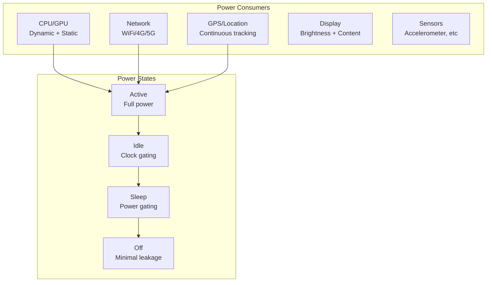
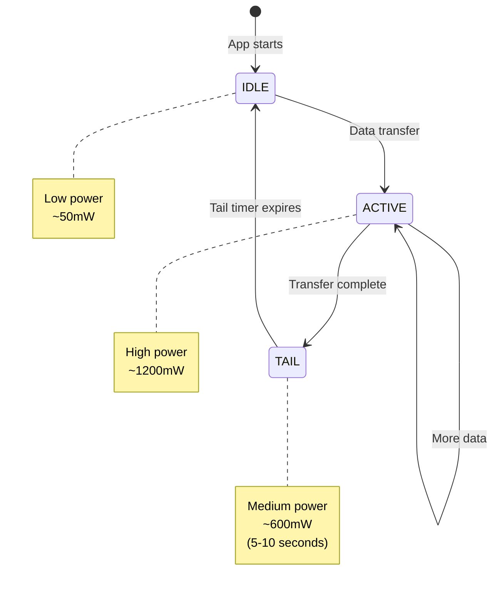

# Battery Models

> 🚧 This quantitative model documentation is planned for future development.

## Overview

Battery models quantify power consumption patterns in mobile and edge computing scenarios, crucial for distributed systems that include mobile clients or IoT devices. These models help optimize the trade-off between functionality, performance, and battery life in resource-constrained environments.

Modern distributed systems increasingly rely on mobile and edge devices, making battery optimization a critical system design consideration. Understanding power consumption patterns enables architects to design systems that balance user experience with device longevity.

## Core Concepts

### Power Consumption Components



### Battery Discharge Model

```python
class BatteryModel:
    """Simple battery discharge model for mobile devices."""
    
    def __init__(self, capacity_mah=3000, voltage=3.7):
        self.capacity_mah = capacity_mah
        self.voltage = voltage
        self.capacity_wh = (capacity_mah * voltage) / 1000
        
# Component power consumption (mW)
        self.power_profile = {
            'cpu_active': 2000,      # 2W active
            'cpu_idle': 100,         # 100mW idle
            'screen_on': 1000,       # 1W display
            'wifi_active': 800,      # 800mW transmitting
            'wifi_idle': 20,         # 20mW connected
            '4g_active': 1200,       # 1.2W transmitting
            '4g_idle': 50,          # 50mW connected
            'gps_active': 500,       # 500mW tracking
            'base_system': 50        # 50mW always-on
        }
    
    def calculate_battery_life(self, usage_pattern):
        """Calculate battery life based on usage pattern."""
        total_power = self.power_profile['base_system']
        
        for component, duty_cycle in usage_pattern.items():
            if component in self.power_profile:
                total_power += self.power_profile[component] * duty_cycle
        
# Battery life in hours
        battery_life_hours = (self.capacity_wh * 1000) / total_power
        return battery_life_hours
    
    def optimize_sync_interval(self, data_size_kb, latency_tolerance_s):
        """Optimize sync interval for battery vs latency trade-off."""
# Power cost of sync operation
        sync_duration = data_size_kb / 100  # Assume 100KB/s
        sync_energy = (
            self.power_profile['cpu_active'] * sync_duration +
            self.power_profile['wifi_active'] * sync_duration
        ) / 3600  # Convert to mWh
        
# Optimal interval balances energy and latency
        optimal_interval = min(
            latency_tolerance_s,
            max(60, sync_energy * 100)  # Heuristic
        )
        
        return optimal_interval
```

## Power State Transitions

### Mobile Radio State Machine



### Tail Energy Overhead

```python
def calculate_tail_energy(transfers_per_hour, tail_duration=10):
    """Calculate wasted energy from radio tail states."""
    tail_power = 600  # mW during tail state
    energy_per_tail = (tail_power * tail_duration) / 3600  # mWh
    total_tail_energy = energy_per_tail * transfers_per_hour
    
# Compare with batching
    batched_transfers = max(1, transfers_per_hour / 10)
    batched_tail_energy = energy_per_tail * batched_transfers
    
    savings_percent = (1 - batched_tail_energy / total_tail_energy) * 100
    
    return {
        'unbatched_energy_mwh': total_tail_energy,
        'batched_energy_mwh': batched_tail_energy,
        'savings_percent': savings_percent
    }
```

## Optimization Strategies

### 1. Batching and Coalescing

```python
class NetworkBatcher:
    """Batch network requests to minimize radio wake-ups."""
    
    def __init__(self, batch_window_ms=5000):
        self.batch_window_ms = batch_window_ms
        self.pending_requests = []
        self.timer = None
    
    def add_request(self, request):
        self.pending_requests.append(request)
        
        if not self.timer:
# Start batch timer
            self.timer = schedule_timer(
                self.batch_window_ms,
                self.flush_batch
            )
    
    def flush_batch(self):
        if not self.pending_requests:
            return
        
# Send all requests together
        batch = self.pending_requests
        self.pending_requests = []
        self.timer = None
        
# Single radio activation for multiple requests
        send_batch_request(batch)
```

### 2. Adaptive Synchronization

```python
class AdaptiveSync:
    """Adjust sync frequency based on battery and usage."""
    
    def __init__(self, battery_model):
        self.battery_model = battery_model
        self.min_interval = 60  # 1 minute
        self.max_interval = 3600  # 1 hour
        
    def calculate_sync_interval(self, battery_percent, is_charging, 
                               user_active, data_freshness_priority):
        """Dynamically adjust sync interval."""
        base_interval = self.min_interval
        
# Battery level factor
        if battery_percent < 20:
            base_interval *= 4
        elif battery_percent < 50:
            base_interval *= 2
        
# Charging state
        if is_charging:
            base_interval = self.min_interval
        
# User activity
        if not user_active:
            base_interval *= 3
        
# Data freshness
        base_interval /= data_freshness_priority
        
        return max(self.min_interval, min(self.max_interval, base_interval))
```

### 3. Location Services Optimization

```python
class LocationOptimizer:
    """Optimize location tracking for battery efficiency."""
    
    def __init__(self):
        self.location_providers = {
            'gps': {'accuracy': 5, 'power': 500},      # 5m, 500mW
            'wifi': {'accuracy': 20, 'power': 100},    # 20m, 100mW
            'cell': {'accuracy': 100, 'power': 50}     # 100m, 50mW
        }
    
    def select_provider(self, required_accuracy, battery_level):
        """Choose location provider based on requirements."""
        suitable_providers = [
            (name, info) for name, info in self.location_providers.items()
            if info['accuracy'] <= required_accuracy
        ]
        
        if not suitable_providers:
# Fallback to least accurate
            return 'cell'
        
        if battery_level < 20:
# Prioritize power efficiency
            return min(suitable_providers, key=lambda x: x[1]['power'])[0]
        else:
# Prioritize accuracy
            return min(suitable_providers, key=lambda x: x[1]['accuracy'])[0]
    
    def geofence_strategy(self, fence_radius, current_distance):
        """Adaptive location polling for geofencing."""
        if current_distance > fence_radius * 2:
# Far away - use cell towers
            return {'provider': 'cell', 'interval': 300}  # 5 min
        elif current_distance > fence_radius:
# Approaching - use WiFi
            return {'provider': 'wifi', 'interval': 60}   # 1 min
        else:
# Very close - use GPS
            return {'provider': 'gps', 'interval': 10}    # 10 sec
```

## Real-World Applications

### 1. Mobile Messaging App

```python
class MessagingBatteryOptimizer:
    """Battery optimization for messaging applications."""
    
    def __init__(self):
        self.message_queue = []
        self.high_priority_threshold = 10  # seconds
        
    def optimize_message_delivery(self, message, priority):
        """Optimize delivery based on priority and battery."""
        battery_level = get_battery_level()
        
        if priority == 'high' or battery_level > 80:
# Send immediately
            return self.send_now(message)
        
# Queue for batching
        self.message_queue.append(message)
        
        if len(self.message_queue) >= 10 or battery_level < 20:
# Flush queue
            return self.flush_message_queue()
        
# Schedule batch send
        schedule_batch_send(delay=30)
```

### 2. IoT Sensor Network

```yaml
# Power-optimized sensor configuration
sensor_profiles:
  ultra_low_power:
    sample_rate: 0.1  # Hz
    transmission: "batch_daily"
    sleep_between: true
    expected_battery_life: "2 years"
    
  balanced:
    sample_rate: 1.0  # Hz
    transmission: "batch_hourly"
    sleep_between: true
    expected_battery_life: "6 months"
    
  real_time:
    sample_rate: 10  # Hz
    transmission: "immediate"
    sleep_between: false
    expected_battery_life: "1 week"
```

### 3. Edge Computing Workload

```python
def decide_computation_location(task, battery_level, network_quality):
    """Decide whether to compute locally or offload to cloud."""
    
# Energy cost estimation
    local_energy = estimate_local_computation_energy(task)
    offload_energy = estimate_transmission_energy(task.data_size)
    
# Latency estimation
    local_latency = estimate_local_computation_time(task)
    offload_latency = (
        estimate_transmission_time(task.data_size, network_quality) +
        estimate_cloud_computation_time(task)
    )
    
# Decision matrix
    if battery_level < 20:
# Critical battery - minimize energy
        return 'cloud' if offload_energy < local_energy else 'local'
    elif network_quality < 0.3:
# Poor network - compute locally
        return 'local'
    elif local_latency > offload_latency * 2:
# Significant speed advantage in cloud
        return 'cloud'
    else:
# Default to local to save bandwidth
        return 'local'
```

## Mathematical Models

### Peukert's Law for Battery Capacity

```python
def peukert_capacity(nominal_capacity, nominal_current, actual_current, 
                    peukert_constant=1.3):
    """
    Calculate effective battery capacity at different discharge rates.
    Higher discharge rates reduce effective capacity.
    """
    capacity_ratio = (nominal_current / actual_current) ** (peukert_constant - 1)
    effective_capacity = nominal_capacity * capacity_ratio
    return effective_capacity

# Example: 3000mAh battery rated at 0.2C (600mA)
nominal = 3000  # mAh
rated_current = 600  # mA

# At high discharge (2000mA)
high_discharge_capacity = peukert_capacity(nominal, rated_current, 2000)
print(f"Effective capacity at 2A: {high_discharge_capacity:.0f}mAh")
# Output: ~2400mAh (20% reduction)
```

### Energy-Delay Product Optimization

```python
def energy_delay_product(frequency, voltage, task_cycles):
    """
    Optimize CPU frequency for best energy-delay product.
    E = C * V^2 * f * t
    t = cycles / f
    EDP = E * t = C * V^2 * cycles
    """
# Voltage scales with frequency (simplified)
    voltage = 0.6 + 0.4 * (frequency / 2.0)  # 0.6V to 1.0V
    
# Dynamic power
    capacitance = 1e-9  # 1nF simplified
    energy = capacitance * voltage**2 * task_cycles
    
# Execution time
    delay = task_cycles / (frequency * 1e9)
    
# Energy-delay product
    edp = energy * delay
    
    return {
        'frequency_ghz': frequency,
        'voltage': voltage,
        'energy_j': energy,
        'delay_s': delay,
        'edp': edp
    }
```

## Best Practices

### 1. Profile Power Consumption
- Measure actual device power usage
- Identify power-hungry operations
- Create device-specific profiles

### 2. Implement Progressive Degradation
- Reduce functionality as battery depletes
- Prioritize critical features
- Communicate state to users

### 3. Leverage Platform APIs
```python
# Android example
if battery_level < 15:
# Enter battery saver mode
    disable_background_sync()
    reduce_animation_frame_rate()
    dim_screen_brightness()
```

### 4. Design for Offline-First
- Cache aggressively
- Batch synchronization
- Handle disconnected operation

## Testing and Monitoring

### Battery Testing Framework

```python
class BatteryTestHarness:
    """Automated battery life testing."""
    
    def run_battery_test(self, test_scenario):
        """Execute battery drain test."""
        initial_level = get_battery_level()
        start_time = time.time()
        
# Run test scenario
        while get_battery_level() > 10:
            test_scenario.execute_iteration()
            
# Log power metrics
            self.log_metrics({
                'timestamp': time.time(),
                'battery_level': get_battery_level(),
                'cpu_usage': get_cpu_usage(),
                'network_bytes': get_network_stats(),
                'screen_on_time': get_screen_time()
            })
            
            time.sleep(60)  # Check every minute
        
# Calculate battery life
        duration_hours = (time.time() - start_time) / 3600
        drain_rate = (initial_level - 10) / duration_hours
        
        return {
            'battery_life_hours': duration_hours,
            'drain_rate_percent_per_hour': drain_rate
        }
```

## Related Models
- [Performance Modeling](/architects-handbook/quantitative-analysis/performance-modeling/) - CPU frequency scaling
- [Network Theory](/architects-handbook/quantitative-analysis/network-theory/) - Radio power models
- [Markov Chains](/architects-handbook/quantitative-analysis/markov-chains/) - State transition modeling
- [Queueing Theory](/architects-handbook/quantitative-analysis/queueing-theory/) - Request batching analysis

## References
- "Energy Efficient Mobile Computing" - Google Research
- "Power Consumption in Mobile Devices" - Perrucci et al. (2011)
- "Optimizing Mobile Application Power Consumption" - Zhang et al. (2010)
- "The Tail at Scale" - Dean & Barroso (2013)

> **Note**: This documentation is planned for future development with more detailed models and real-world case studies.