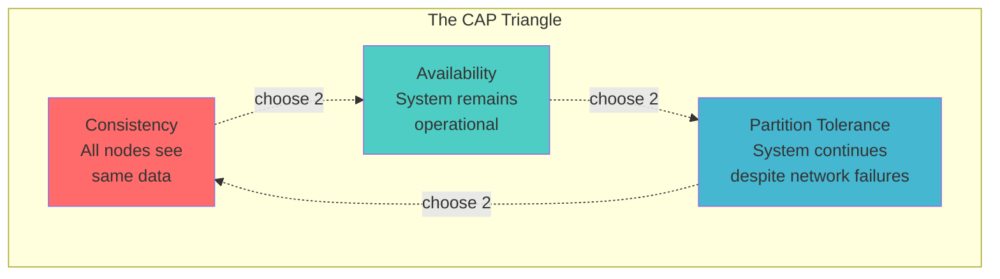
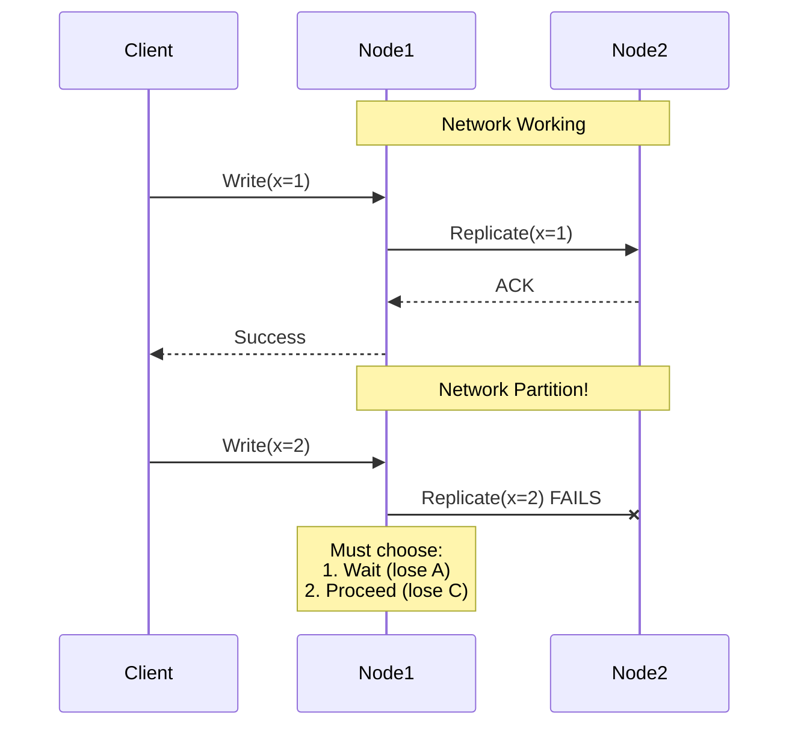
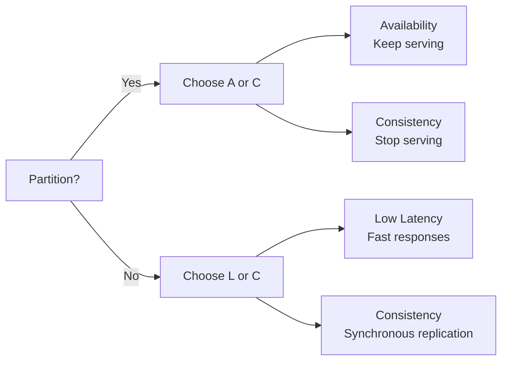

# CAP Theorem: The Fundamental Trade-off

<span class="path-icon">📐</span>
 <span class="path-name">Quantitative Foundations</span>
 <span class="path-progress">1/15</span>
 <div class="mini-progress">
</div>

!!! info
 <h4>📚 Before You Begin</h4>
 <p>Make sure you understand these concepts:</p>
 <ul>
 <li><a href="/introduction/getting-started/">Distributed Systems Basics</a></li>
 <li><a href="/introduction/networking-basics/">Network Fundamentals</a></li>
 </ul>

## The Essential Insight

**You can have at most two of: Consistency, Availability, and Partition tolerance.**

This isn't a design choice—it's a fundamental limitation proven by Eric Brewer and formalized by Gilbert and Lynch.

## Visual Understanding



## Formal Definitions

### Consistency (C)
> All nodes see the same data at the same time

More precisely: **Linearizability** - operations appear to execute atomically at some point between their start and completion.

```python
# Consistent system example
def read_after_write():
    write(key="x", value=1)  # Time: T1
    result = read(key="x")   # Time: T2 (T2 > T1)
    assert result == 1       # MUST be true in consistent system
```

### Availability (A)
> Every request receives a response (without guarantee it's the most recent data)

Formally: Every non-failing node returns a response for all read and write requests in a reasonable time.

```python
# Available system guarantees
def available_system():
    try:
        response = request(timeout=5000)  # 5 seconds
        # Always gets a response (may be stale)
        return response
    except TimeoutError:
        # This violates availability
        raise SystemNotAvailable()
```

### Partition Tolerance (P)
> System continues to operate despite network failures

The system can sustain any network failure that doesn't fail all nodes.



## The Proof (Intuitive)

### Why Can't We Have All Three?

Consider a system with nodes A and B during network partition:

1. **Client 1** writes value `v1` to node A
2. **Client 2** reads from node B

Now we must choose:
- **Consistency**: B must return `v1` → But A can't tell B about `v1` (partitioned) → B can't respond → **Not Available**
- **Availability**: B responds immediately → Returns old value → **Not Consistent**

Therefore: **During partition, must sacrifice either C or A**

## Real-World Trade-offs

### CP Systems (Consistency + Partition Tolerance)

Sacrifice availability for consistency during partitions.

| System | Use Case | Behavior During Partition |
|--------|----------|---------------------------|
| Zookeeper | Configuration management | Minority partition stops serving |
| HBase | Strong consistency storage | Regions unavailable |
| MongoDB | Document store (in CP mode) | Primary election may fail |

```python
class CPSystem:
    def write(self, key, value):
        if not self.have_quorum():
            raise ServiceUnavailable("Cannot reach quorum")
        
        # Only proceed with majority agreement
        return self.quorum_write(key, value)
```

### AP Systems (Availability + Partition Tolerance)

Sacrifice consistency for availability during partitions.

| System | Use Case | Behavior During Partition |
|--------|----------|---------------------------|
| Cassandra | High-volume writes | Eventual consistency |
| DynamoDB | Shopping carts | Conflict resolution later |
| DNS | Name resolution | Stale results acceptable |

```python
class APSystem:
    def write(self, key, value):
        # Always accept writes
        self.local_write(key, value)
        
        try:
            # Best effort replication
            self.async_replicate(key, value)
        except NetworkPartition:
            # Store for later reconciliation
            self.hint_handoff.store(key, value)
```

### CA Systems (Consistency + Availability)

Only possible without network partitions (single-node systems).

```python
class CASystem:
    """Only works on single node - not truly distributed"""
    def __init__(self):
        self.data = {}
        
    def write(self, key, value):
        self.data[key] = value  # Always consistent
        return "Success"        # Always available
        # But dies if node fails!
```

## Beyond CAP: Nuanced Choices

### 1. Tunable Consistency

Systems like Cassandra allow per-operation choice:

```python
# Strong consistency when needed
critical_balance = read(
    key="account_balance",
    consistency_level=QUORUM  # CP behavior
)

# Eventual consistency when acceptable  
user_preferences = read(
    key="theme_settings",
    consistency_level=ONE     # AP behavior
)
```

### 2. Partition Detection Strategies

```python
class PartitionDetector:
    def is_partitioned(self):
        # Heartbeat-based detection
        failed_heartbeats = self.check_heartbeats()
        
        # Quorum-based detection
        reachable_nodes = self.count_reachable()
        
        # External witness
        witness_opinion = self.consult_witness()
        
        return self.evaluate_partition(
            failed_heartbeats,
            reachable_nodes, 
            witness_opinion
        )
```

### 3. Graceful Degradation

```python
class GracefulDegradation:
    def handle_partition(self):
        if self.is_partitioned():
            # Reduce functionality, not availability
            self.enter_degraded_mode()
            
            # Serve read-only
            self.disable_writes()
            
            # Use cached data
            self.enable_stale_reads()
            
            # Queue writes for later
            self.enable_write_buffering()
```

## PACELC: The Extended Model

CAP doesn't address trade-offs when there's no partition:

**PACELC**: If Partition, then trade-off between Availability and Consistency; Else, trade-off between Latency and Consistency.



## Practical Implications

### 1. Design Decisions

```python
def choose_consistency_model(requirements):
    if requirements.financial_transactions:
        return "CP"  # Can't lose money
        
    elif requirements.social_media_feed:
        return "AP"  # Stale posts OK
        
    elif requirements.inventory_management:
        return "Tunable"  # Depends on operation
```

### 2. SLA Considerations

| Requirement | CP System | AP System |
|-------------|-----------|-----------|
| 99.99% uptime | Harder - partitions reduce availability | Easier - keeps serving |
| Consistent reads | Guaranteed | Best effort |
| Write availability | May reject during partition | Always accepts |
| Conflict resolution | Not needed | Required |

### 3. Operational Complexity

- **CP Systems**: Focus on minimizing partition duration
- **AP Systems**: Focus on conflict resolution mechanisms
- **Both**: Need excellent monitoring and alerting

## Common Misconceptions

!!! warning "Myth: CAP is about normal operations"
    CAP specifically addresses behavior **during network partitions**. Normal operation trade-offs are about latency vs consistency (see PACELC).

!!! warning "Myth: You must choose only two"
    Modern systems are more nuanced:
    - Different subsystems can make different choices
    - Consistency levels can be tunable
    - Graceful degradation is possible

!!! warning "Myth: Partitions are rare"
    Network partitions happen regularly:
    - Switch failures
    - Misconfiguration  
    - Congestion
    - Software bugs

## Testing CAP Behavior

### Jepsen Testing Framework

```python
def test_cap_behavior():
    # Start cluster
    cluster = start_nodes(count=5)
    
    # Create partition
    partition = cluster.partition(
        group1=[0, 1],
        group2=[2, 3, 4]
    )
    
    # Test writes to both sides
    client1.write(node=0, key="x", value="A")
    client2.write(node=2, key="x", value="B")
    
    # Heal partition
    partition.heal()
    
    # Check final state
    values = [node.read("x") for node in cluster]
    
    if all_equal(values):
        print("System chose consistency")
    else:
        print("System chose availability")
        print(f"Conflict resolution needed: {values}")
```

## Design Patterns

### Pattern 1: Saga Pattern (AP Alternative to Transactions)

```python
class DistributedSaga:
    """Maintain consistency without distributed transactions"""
    
    def execute(self, steps):
        completed = []
        
        for step in steps:
            try:
                result = step.execute()
                completed.append((step, result))
            except Exception as e:
                # Compensate in reverse order
                self.compensate(completed)
                raise
```

### Pattern 2: Write Quorums (Tunable Consistency)

```python
def quorum_parameters(N=5):
    """N = total replicas"""
    return {
        "strong_consistency": {
            "W": 3,  # Write quorum
            "R": 3,  # Read quorum  
            # W + R > N guarantees latest value
        },
        "read_heavy": {
            "W": 5,  # Write to all
            "R": 1,  # Read from one
            # Fast reads, slow writes
        },
        "write_heavy": {
            "W": 1,  # Write to one
            "R": 5,  # Read from all
            # Fast writes, slow reads
        }
    }
```

## Real-World Case Studies

<a href="/case-studies/cassandra.md" class="related-item">
 <span class="item-icon">💿</span>
 <span class="item-title">Cassandra (AP)</span>
 <span class="item-type">case-study</span>
 </a>
 <a href="/case-studies/zookeeper/" class="related-item">
 <span class="item-icon">🎯</span>
 <span class="item-title">Zookeeper (CP)</span>
 <span class="item-type">case-study</span>
 </a>
 <a href="/pattern-library/two-phase-commit/" class="related-item">
 <span class="item-icon">🤝</span>
 <span class="item-title">Two-Phase Commit</span>
 <span class="item-type">pattern</span>
 </a>
 <a href="/quantitative/pacelc/" class="related-item">
 <span class="item-icon">⚖️</span>
 <span class="item-title">PACELC Theorem</span>
 <span class="item-type">theory</span>
 </a>

## Interactive Tool

Try our [CAP Theorem Calculator](tools/cap-calculator) to explore trade-offs with different:
- Network partition probabilities
- Consistency requirements
- Availability SLAs
- Latency constraints

## Next Steps

<div class="step-card level-beginner">
 <span class="level-badge">Beginner</span>
 <h4><a href="/tools/cap-calculator/">CAP Theorem Calculator</a></h4>
 <p>Explore trade-offs interactively with different parameters.</p>
 
 <span class="level-badge">Intermediate</span>
 <h4><a href="/tutorials/cp-system-design/">Building CP Systems</a></h4>
 <p>Design and implement a consistent, partition-tolerant system.</p>
 
 <span class="level-badge">Advanced</span>
 <h4><a href="/tutorials/cap-production/">CAP in Production</a></h4>
 <p>Handle real-world partitions with monitoring and automation.</p>
</div>

## Key Takeaways

!!! success "Remember"
    1. **CAP is about partitions**: The theorem specifically addresses network failures
    2. **You must handle partitions**: They will happen in any distributed system
    3. **Choose based on requirements**: Financial = CP, Social = AP
    4. **Modern systems are flexible**: Tunable consistency is common
    5. **Test partition behavior**: Don't assume, verify with chaos testing

## References

- [Brewer's Original Conjecture (2000)](https://people.eecs.berkeley.edu/~brewer/cs262b-2004/PODC-keynote.pdf)
- [Gilbert & Lynch Proof (2002)](https://www.comp.nus.edu.sg/~gilbert/pubs/BrewersConjecture-SigAct.pdf)
- [CAP Twelve Years Later](https://www.infoq.com/articles/cap-twelve-years-later-how-the-rules-have-changed/)
- [Please Stop Calling Databases CP or AP](https://martin.kleppmann.com/2015/05/11/please-stop-calling-databases-cp-or-ap.html)

---

<div class="progress-bar">
 <div class="progress-fill">
 </div>
 Progress: 1 of 15 quantitative foundations completed
</div>