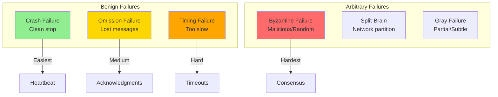
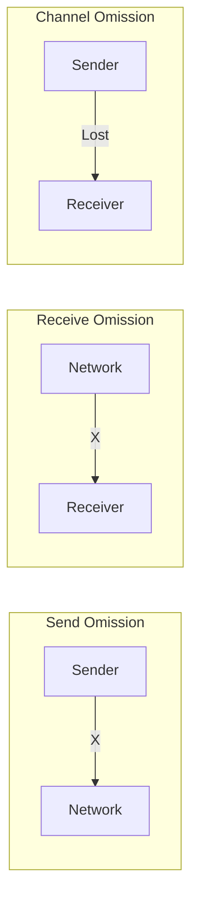
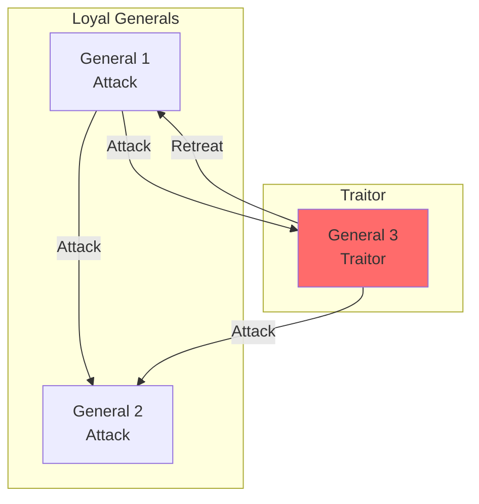
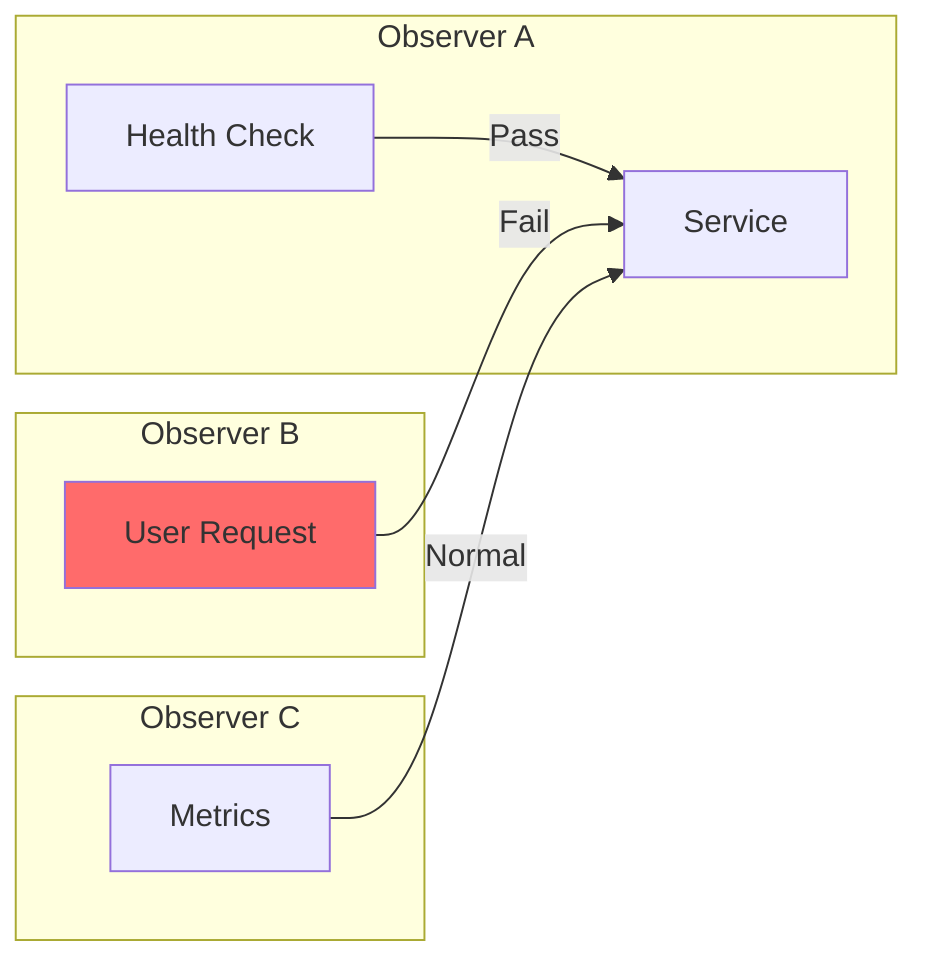
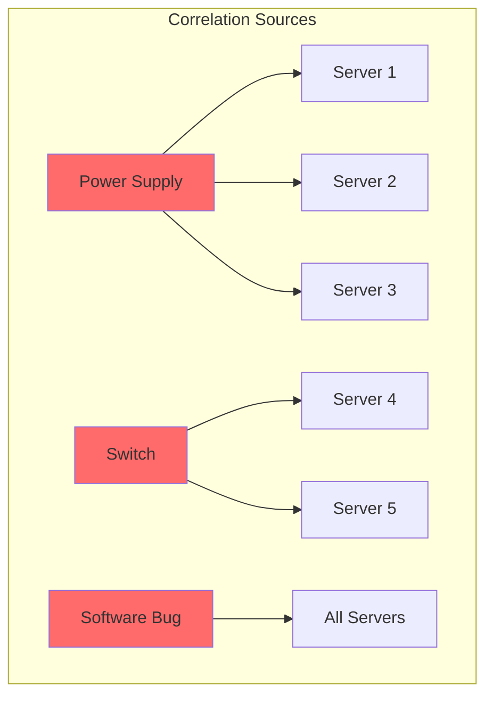
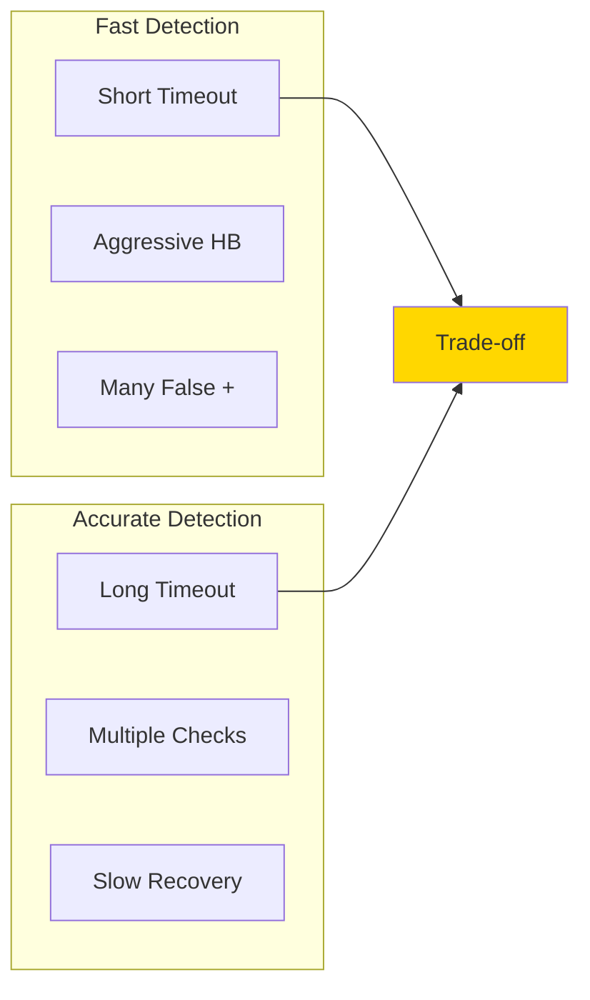
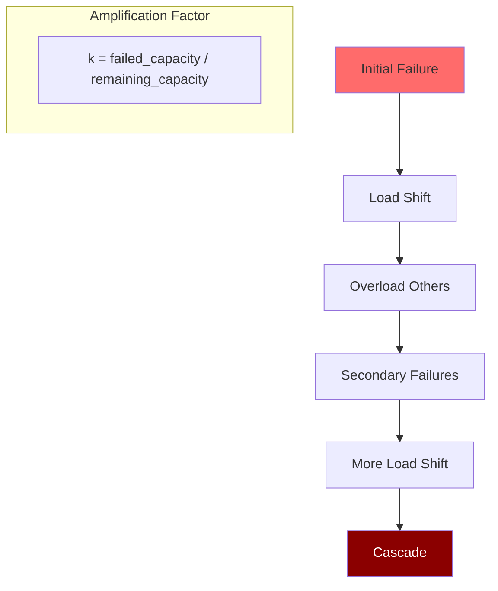
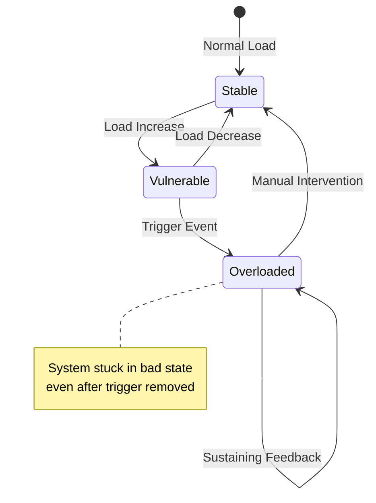

# Failure Models in Distributed Systems

!!! abstract "🎯 Core Insight"
 Different failure models have vastly different detection and recovery complexities. Understanding these models is crucial for designing resilient systems that can handle real-world failures gracefully.

## Failure Model Hierarchy



## Types of Failures

### 1. Crash Failures (Fail-Stop)

<h4>Definition</h4>
A component stops working and remains stopped. No incorrect behavior before failing.

<h4>Characteristics</h4>
- Clean shutdown
- No partial operations
- Easily detectable
- No recovery without restart

<h4>Mathematical Model</h4>
```
P(crash) = 1 - e^(-λt)
where λ = failure rate
```

<h4>Detection</h4>
```python
# Simple heartbeat detection
if time_since_last_heartbeat > timeout:
 mark_as_crashed(node)
```

<h4>Real Examples</h4>
- Process segfault
- Server power loss
- Container OOM kill

### 2. Omission Failures

<h4>Definition</h4>
Messages are lost in transit. Sender and receiver are functioning but communication fails.

<h4>Types</h4>


<h4>Probability Model</h4>
```
P(delivery) = (1 - p_loss)^n
where n = number of hops
```

<h4>Mitigation</h4>
- Acknowledgments
- Retransmission
- Forward error correction

### 3. Timing Failures

<h4>Definition</h4>
Operations complete but take longer than specified time bounds.

<h4>Impact Analysis</h4>
<div class="responsive-table" markdown>

| Delay | Impact | Example |
|-------|---------|----------|
| 10ms | Negligible | Cache miss |
| 100ms | Noticeable | Slow query |
| 1s | User impact | Page timeout |
| 10s | Cascade risk | Lock timeout |
| 60s | System failure | Watchdog trigger |


<h4>Modeling Latency</h4>
```python
# Latency often follows log-normal distribution
import numpy as np

median_latency = 50 # ms
std_dev = 1.5

# P99 calculation
p99 = np.exp(np.log(median_latency) + std_dev * 2.33)
# Result: ~365ms for 50ms median
```
</div>

### 4. Byzantine Failures

<h4>Definition</h4>
Components behave arbitrarily - sending wrong data, conflicting messages, or acting maliciously.

<h4>Byzantine Generals Problem</h4>


<h4>Tolerance Formula</h4>
```
For f Byzantine failures:
- Need 3f + 1 total nodes
- Need 2f + 1 correct responses
```

<h4>Real-World Examples</h4>
- Bit flips in memory
- Malicious actors
- Hardware malfunctions
- Software bugs causing inconsistent state

### 5. Gray Failures

<h4>Definition</h4>
Subtle failures that affect some operations but not others. System appears healthy from some perspectives.

<h4>Detection Challenge</h4>


<h4>Examples</h4>
- Performance degradation
- Partial network connectivity
- Resource exhaustion for specific operations
- Corrupted indexes affecting some queries

## Failure Probability Models

### Independent Failures

```python
# Probability of k failures out of n components
from math import comb

def failure_probability(n, k, p):
 """Binomial distribution for independent failures"""
 return comb(n, k) * (p**k) * ((1-p)**(n-k))

# Example: 100 servers, 0.1% daily failure rate
# P(exactly 2 failures) = C(100,2) * 0.001² * 0.999⁹⁸
# = 0.00184 (0.18%)
```

### Correlated Failures



**Correlation Model**:
```python
# Joint failure probability
P(A and B) = P(A) * P(B) + correlation_factor

# High correlation example:
# Same rack: correlation = 0.8
# Same datacenter: correlation = 0.3
# Different regions: correlation = 0.01
```

## Failure Detection Strategies

### Detection Time vs Accuracy Trade-off



### Phi Accrual Failure Detector

```python
def phi_accrual_detector(heartbeat_history):
 """
 Returns suspicion level (0-∞)
 Higher φ = more likely failed
 """
 current_time = time.now()
 last_heartbeat = heartbeat_history[-1]
 
# Calculate expected interval
 intervals = calculate_intervals(heartbeat_history)
 mean = np.mean(intervals)
 std = np.std(intervals)
 
# Time since last heartbeat
 elapsed = current_time - last_heartbeat
 
# Calculate φ
 phi = -log10(1 - F(elapsed))
# where F is CDF of normal distribution
 
 return phi

# Usage:
# φ < 1: Likely alive
# φ > 8: Likely failed
# Adjust threshold based on requirements
```

## Recovery Strategies by Failure Type

<table class="responsive-table">
<thead>
<tr>
<th>Failure Type</th>
<th>Detection Method</th>
<th>Recovery Strategy</th>
<th>Time to Recover</th>
</tr>
</thead>
<tbody>
<tr>
<td data-label="Failure Type"><strong>Crash</strong></td>
<td data-label="Detection Method">Heartbeat timeout</td>
<td data-label="Recovery Strategy">Restart/Failover</td>
<td data-label="Time to Recover">Seconds to minutes</td>
</tr>
<tr>
<td data-label="Failure Type"><strong>Omission</strong></td>
<td data-label="Detection Method">Missing ACKs</td>
<td data-label="Recovery Strategy">Retransmission</td>
<td data-label="Time to Recover">Milliseconds</td>
</tr>
<tr>
<td data-label="Failure Type"><strong>Timing</strong></td>
<td data-label="Detection Method">Latency monitoring</td>
<td data-label="Recovery Strategy">Circuit breaker/Retry</td>
<td data-label="Time to Recover">Seconds</td>
</tr>
<tr>
<td data-label="Failure Type"><strong>Byzantine</strong></td>
<td data-label="Detection Method">Voting/Consensus</td>
<td data-label="Recovery Strategy">Exclude from quorum</td>
<td data-label="Time to Recover">Minutes</td>
</tr>
<tr>
<td data-label="Failure Type"><strong>Gray</strong></td>
<td data-label="Detection Method">Multi-perspective</td>
<td data-label="Recovery Strategy">Gradual drain</td>
<td data-label="Time to Recover">Minutes to hours</td>
</tr>
</tbody>
</table>

## Failure Amplification

### Cascading Failure Model



**Cascade Probability**:
```python
def cascade_probability(initial_load, capacity, failed_nodes, total_nodes):
 remaining_nodes = total_nodes - failed_nodes
 new_load_per_node = (initial_load * total_nodes) / remaining_nodes
 
 if new_load_per_node > capacity:
# Cascade likely
 return 1.0
 else:
# Probability increases with load
 return (new_load_per_node / capacity) ** 2
```

## Real-World Failure Patterns

### Metastable Failures



### Failure Budget Allocation

```python
# Allocate failure budget across components
total_availability_target = 0.999 # 99.9%
allowed_downtime = 43.8 # minutes/month

# Component budgets
budgets = {
 'network': 0.3 * allowed_downtime, # 13.1 min
 'compute': 0.2 * allowed_downtime, # 8.8 min 
 'storage': 0.2 * allowed_downtime, # 8.8 min
 'software': 0.2 * allowed_downtime, # 8.8 min
 'human_error': 0.1 * allowed_downtime # 4.4 min
}
```

## Key Insights

!!! info "🔍 Critical Learnings"
 1. **Crash failures are easiest** - Design for them first
 2. **Byzantine failures are rare** - But catastrophic when they occur
 3. **Gray failures are common** - And hardest to detect
 4. **Correlation kills** - Independence assumptions often wrong
 5. **Detection trade-offs** - Fast vs accurate, choose wisely
 6. **Cascades amplify** - Small failures can bring down systems

## Related Concepts

- **Laws**: [Law 1: Correlated Failure](../core-principles/laws/correlated-failure/) | [Law 3: Emergent Chaos](../core-principles/laws/emergent-chaos/)
- **Patterns**: [Circuit Breaker](../pattern-library/resilience/circuit-breaker.md) | [Bulkhead](../pattern-library/resilience/bulkhead.md) | [Timeout](../pattern-library/resilience/timeout.md)
- **Quantitative**: [Availability Math](../../architects-handbook/quantitative-analysis/availability-math.md) | [Reliability Theory](../../architects-handbook/quantitative-analysis/reliability-theory.md)
- **Case Studies**: [Netflix Chaos](../case-studies/netflix-chaos.md) | [AWS Outages](../case-studies/aws-outages.md)