# Latency Ladder 2025

**Know your physics: Every operation has a cost**

## Fundamental Latency Hierarchy

```
L1 cache reference 0.5 ns 0.5 seconds
Branch mispredict 5 ns 5 seconds
L2 cache reference 7 ns 7 seconds
Mutex lock/unlock 25 ns 25 seconds
Main memory reference 100 ns 1.5 minutes
Compress 1KB 2 μs 33 minutes
Send 1KB over 1 Gbps 10 μs 2.8 hours
Read 4KB random SSD 16 μs 4.4 hours
Read 1MB sequential memory 250 μs 2.9 days
Datacenter round trip 500 μs 5.8 days
Read 1MB from SSD 1 ms 11.6 days
Disk seek 10 ms 3.8 months
Read 1MB from disk 20 ms 7.6 months
CA → Netherlands packet 150 ms 4.8 years
```

## 2025 Hardware Update

!!! abstract "🚀 2025 Hardware Evolution"

 <table class="responsive-table">
 <thead>
 <tr>
 <th>Operation</th>
 <th>Latency</th>
 <th>Notes</th>
 </tr>
 </thead>
 <tbody>
 <tr>
 <td data-label="Operation"><strong>NVMe SSD random read</strong></td>
 <td data-label="Latency">10 μs</td>
 <td data-label="Notes">10x faster than 2015</td>
 </tr>
 <tr>
 <td data-label="Operation"><strong>Optane persistent memory</strong></td>
 <td data-label="Latency">100 ns</td>
 <td data-label="Notes">Between RAM and SSD</td>
 </tr>
 <tr>
 <td data-label="Operation"><strong>RDMA network transfer</strong></td>
 <td data-label="Latency">1-2 μs</td>
 <td data-label="Notes">Bypass kernel</td>
 </tr>
 <tr>
 <td data-label="Operation"><strong>GPU memory transfer</strong></td>
 <td data-label="Latency">10-100 μs</td>
 <td data-label="Notes">Depends on size</td>
 </tr>
 <tr>
 <td data-label="Operation"><strong>5G mobile network latency</strong></td>
 <td data-label="Latency">1-10 ms</td>
 <td data-label="Notes">10x better than 4G</td>
 </tr>
 <tr>
 <td data-label="Operation"><strong>Starlink satellite latency</strong></td>
 <td data-label="Latency">20-40 ms</td>
 <td data-label="Notes">LEO constellation</td>
 </tr>
 <tr>
 <td data-label="Operation"><strong>Cross-region (optimized)</strong></td>
 <td data-label="Latency">30-80 ms</td>
 <td data-label="Notes">Private backbone</td>
 </tr>
 <tr>
 <td data-label="Operation"><strong>Edge compute</strong></td>
 <td data-label="Latency">&lt;5 ms</td>
 <td data-label="Notes">Local processing</td>
 </tr>
 </tbody>
 </table>

 <div class="progress-visualization">
 <h5>Latency Scale Visualization</h5>
 <svg viewBox="0 0 600 120" role="img" aria-label="Latency scale visualization showing logarithmic scale from nanoseconds to tens of milliseconds">
 <title>Latency Scale Visualization</title>
 <desc>Horizontal bar chart showing latency ranges on a logarithmic scale: Memory operations in nanoseconds, Storage in microseconds, Network in milliseconds, and WAN in tens of milliseconds</desc>
 <!-- Log scale bars -->
 <rect x="50" y="20" width="20" height="20" fill="#4CAF50" />
 <text x="75" y="35" font-size="12">ns</text>

 <rect x="150" y="20" width="40" height="20" fill="#66BB6A" />
 <text x="195" y="35" font-size="12">μs</text>

 <rect x="250" y="20" width="80" height="20" fill="#FFA726" />
 <text x="340" y="35" font-size="12">ms</text>

 <rect x="400" y="20" width="160" height="20" fill="#EF5350" />
 <text x="480" y="35" font-size="12">10s of ms</text>

 <!-- Labels -->
 <text x="50" y="60" font-size="10">Memory</text>
 <text x="150" y="60" font-size="10">Storage</text>
 <text x="250" y="60" font-size="10">Network</text>
 <text x="400" y="60" font-size="10">WAN</text>
 </svg>
</div>

## Latency Budget

```
User Perception:
100ms = Instant, 200ms = Fast, 500ms = OK, 1s = Slow, 3s = Bad, 10s = Gone

1000ms Budget Example:
 -50ms Network RTT
 -30ms TLS
 -10ms Infrastructure (LB, Gateway, Mesh)
 -20ms Database
 -5ms Serialization 
 -50ms Response
= 835ms for your logic
```

## Compound Effects

```
Serial: A→B→C = A + B + C
Parallel: A|B|C = MAX(A, B, C)

Percentile multiplication:
99% @ 100ms per service
2 calls = 98% @ 200ms
3 calls = 97% @ 300ms 
10 calls = 90% @ 1000ms!
```

## Industry Targets

```
HFT Trading: <1 μs (competitive advantage)
Gaming: 16 ms (60 FPS)
Video call: 150 ms (natural conversation)
Web search: 200 ms (user satisfaction)
E-commerce: 300 ms (conversion rate)
Streaming: 2 s (retention)
Email: 5 s (expectation)
```

## Latency Reduction Strategies

Practical approaches to reduce latency:

!!! note "💡 Latency Reduction Strategies"
 <table class="responsive-table">
 <thead>
 <tr>
 <th>Strategy</th>
 <th>Typical Improvement</th>
 <th>Cost</th>
 <th>Implementation</th>
 </tr>
 </thead>
 <tbody>
 <tr>
 <td data-label="Strategy"><strong>Add regional cache</strong></td>
 <td data-label="Typical Improvement">
 <div>
 <span>50-90%</span>
</td>
<td data-label="Cost">$</td>
<td data-label="Implementation">Redis, Memcached</td>
</tr>
 <tr>
<td data-label="Strategy"><strong>Use CDN</strong></td>
<td data-label="Typical Improvement">
 <div></div>
 <span>40-80%</span>
</td>
<td data-label="Cost">$</td>
<td data-label="Implementation">CloudFront, Akamai</td>
</tr>
 <tr>
<td data-label="Strategy"><strong>Optimize queries</strong></td>
<td data-label="Typical Improvement">
 <div></div>
 <span>20-50%</span>
</td>
<td data-label="Cost">$</td>
<td data-label="Implementation">Query tuning</td>
</tr>
 <tr>
<td data-label="Strategy"><strong>Add indexes</strong></td>
<td data-label="Typical Improvement">
 <div></div>
 <span>30-70%</span>
</td>
<td data-label="Cost">$</td>
<td data-label="Implementation">Database indexes</td>
</tr>
 <tr>
<td data-label="Strategy"><strong>Batch operations</strong></td>
<td data-label="Typical Improvement">
 <div></div>
 <span>40-60%</span>
</td>
<td data-label="Cost">$</td>
<td data-label="Implementation">Code refactor</td>
</tr>
 <tr>
<td data-label="Strategy"><strong>Parallel processing</strong></td>
<td data-label="Typical Improvement">
 <div></div>
 <span>30-50%</span>
</td>
<td data-label="Cost">$</td>
<td data-label="Implementation">Async/threads</td>
</tr>
 <tr>
<td data-label="Strategy"><strong>Better algorithms</strong></td>
<td data-label="Typical Improvement">
 <div></div>
 <span>10-90%</span>
</td>
<td data-label="Cost">$</td>
<td data-label="Implementation">Algorithm research</td>
</tr>
 <tr>
<td data-label="Strategy"><strong>Hardware upgrade</strong></td>
<td data-label="Typical Improvement">
 <div></div>
 <span>20-40%</span>
</td>
<td data-label="Cost">$$</td>
<td data-label="Implementation">Better servers</td>
</tr>
 <tr>
<td data-label="Strategy"><strong>Protocol optimization</strong></td>
<td data-label="Typical Improvement">
 <div></div>
 <span>10-30%</span>
</td>
<td data-label="Cost">$</td>
<td data-label="Implementation">HTTP/3, gRPC</td>
</tr>
 <tr>
<td data-label="Strategy"><strong>Connection pooling</strong></td>
<td data-label="Typical Improvement">
 <div></div>
 <span>20-40%</span>
</td>
<td data-label="Cost">$</td>
<td data-label="Implementation">Pool configuration</td>
</tr>
 </tbody>
</table>

!!! info
 💡 <strong>Pro Tip</strong>: Start with caching and query optimization - they offer the best ROI!
</div>

## Practical Examples

## Example 1: E-commerce Checkout

!!! info "🛍️ E-commerce Checkout Flow"
 <div>
 <div>
 <strong>User clicks "Buy Now" → Order confirmed</strong>
 
 <table class="responsive-table">
 <thead>
 <tr>
 <th>Step</th>
 <th>Latency</th>
 <th>Type</th>
 <th>Cumulative</th>
 </tr>
 </thead>
 <tbody>
 <tr>
 <td data-label="Step">User → CDN edge</td>
 <td data-label="Latency">20ms</td>
 <td data-label="Type">Sequential</td>
 <td data-label="Cumulative">20ms</td>
 </tr>
 <tr>
 <td data-label="Step">Edge → Region</td>
 <td data-label="Latency">30ms</td>
 <td data-label="Type">Sequential</td>
 <td data-label="Cumulative">50ms</td>
 </tr>
 <tr>
 <td data-label="Step">API Gateway</td>
 <td data-label="Latency">5ms</td>
 <td data-label="Type">Sequential</td>
 <td data-label="Cumulative">55ms</td>
 </tr>
 <tr>
 <td data-label="Step">Auth service</td>
 <td data-label="Latency">10ms</td>
 <td data-label="Type">Sequential</td>
 <td data-label="Cumulative">65ms</td>
 </tr>
 <tr>
 <td data-label="Step">Inventory check</td>
 <td data-label="Latency">15ms</td>
 <td data-label="Type">Parallel</td>
 <td data-label="Cumulative">165ms</td>
 </tr>
 <tr>
 <td data-label="Step">Payment processing</td>
 <td data-label="Latency">100ms</td>
 <td data-label="Type">Parallel</td>
 </tr>
 <tr>
 <td data-label="Step">Order creation</td>
 <td data-label="Latency">20ms</td>
 <td data-label="Type">Sequential</td>
 <td data-label="Cumulative">185ms</td>
 </tr>
 <tr>
 <td data-label="Step">Confirmation email</td>
 <td data-label="Latency">-</td>
 <td data-label="Type">Async</td>
 <td data-label="Cumulative">-</td>
 </tr>
 </tbody>
</table>
 
 <div>
 <strong>Total Perceived Latency: ~185ms</strong>
 <div>Well within 200ms "fast" threshold!</div>
 </div>
</div>
</div>

## Example 2: Real-time Gaming

!!! danger "🎮 Real-time Gaming Latency"
 <div>
 <div>
 <strong>Player input → Other players see action</strong>
 
 <div>
 <svg viewBox="0 0 600 200" role="img" aria-label="Gaming latency timeline breakdown showing input to render pipeline">
 <title>Real-time Gaming Latency</title>
 <desc>Timeline visualization showing latency breakdown for real-time gaming: 8ms input polling, 30ms client to server, 5ms server processing, 30ms server to clients, 8ms render, totaling 81ms</desc>
 <!-- Timeline -->
 <line x1="50" y1="100" x2="550" y2="100" stroke="#333" stroke-width="2"/>
 
 <!-- Input polling -->
 <rect x="50" y="80" width="40" height="40" fill="#2196F3"/>
 <text x="70" y="100" text-anchor="middle" fill="white" font-size="10">8ms</text>
 <text x="70" y="70" text-anchor="middle" font-size="10">Input</text>
 
 <!-- Client to Server -->
 <rect x="90" y="80" width="150" height="40" fill="#FF5722"/>
 <text x="165" y="100" text-anchor="middle" fill="white" font-size="10">30ms</text>
 <text x="165" y="70" text-anchor="middle" font-size="10">Client→Server</text>
 
 <!-- Server processing -->
 <rect x="240" y="80" width="25" height="40" fill="#4CAF50"/>
 <text x="252" y="100" text-anchor="middle" fill="white" font-size="10">5ms</text>
 <text x="252" y="70" text-anchor="middle" font-size="10">Process</text>
 
 <!-- Server to Other clients -->
 <rect x="265" y="80" width="150" height="40" fill="#FF5722"/>
 <text x="340" y="100" text-anchor="middle" fill="white" font-size="10">30ms</text>
 <text x="340" y="70" text-anchor="middle" font-size="10">Server→Clients</text>
 
 <!-- Render -->
 <rect x="415" y="80" width="40" height="40" fill="#2196F3"/>
 <text x="435" y="100" text-anchor="middle" fill="white" font-size="10">8ms</text>
 <text x="435" y="70" text-anchor="middle" font-size="10">Render</text>
 
 <!-- Total indicator -->
 <line x1="50" y1="140" x2="455" y2="140" stroke="#666" stroke-width="2"/>
 <text x="252" y="160" text-anchor="middle" font-weight="bold">Total: 81ms</text>
 </svg>
 </div>
 
 <div>
 <div>
 <div>🎯</div>
 <strong>Latency Budget</strong>
 <div>100ms</div>
 <div>Good experience threshold</div>
 </div>
 
 <div>
 <div>🛡️</div>
 <strong>Safety Margin</strong>
 <div>19ms</div>
 <div>Buffer for jitter/spikes</div>
 </div>
 </div>
 
 <div>
 <strong>⚠️ Warning:</strong> Network jitter can easily consume the 19ms margin. Consider:
 <ul>
 <li>Client-side prediction</li>
 <li>Lag compensation</li>
 <li>Regional game servers</li>
 </ul>
 </div>
</div>
</div>

## Example 3: Database Query Optimization
```redis
Before: Sequential queries
- Get user: 10ms
- Get orders: 20ms
- Get items per order: 10ms × N
Total: 30ms + 10N ms

After: Batch + parallel
- Get user + orders: 15ms (join)
- Get all items: 15ms (IN clause)
Total: 30ms (constant!)
```

## Law Connections

### Law 2: Asynchronous Reality


Every operation proves [Law 1](../../core-principles/laws/correlated-failure.md) - even L1 cache (0.5ns/index) > 0.

### Law 4: Trade-offs
!!! danger "📈 Latency Under Load"
 <div>
 <svg viewBox="0 0 600 300" role="img" aria-label="Chart showing exponential latency growth as system utilization increases">
 <title>Latency vs System Utilization</title>
 <desc>Exponential curve showing how latency remains stable until 75% utilization, then increases dramatically, reaching 10x at 90% and 100x at 99% utilization. Highlights danger zone above 75% and critical zone above 90%</desc>
 <!-- Title -->
 <text x="300" y="20" text-anchor="middle" font-weight="bold">Latency vs System Utilization</text>
 <!-- Axes -->
 <line x1="50" y1="250" x2="550" y2="250" stroke="#333" stroke-width="2"/>
 <line x1="50" y1="250" x2="50" y2="50" stroke="#333" stroke-width="2"/>
 <!-- X-axis labels -->
 <text x="50" y="270" text-anchor="middle" font-size="12">0%</text>
 <text x="150" y="270" text-anchor="middle" font-size="12">25%</text>
 <text x="250" y="270" text-anchor="middle" font-size="12">50%</text>
 <text x="350" y="270" text-anchor="middle" font-size="12">75%</text>
 <text x="450" y="270" text-anchor="middle" font-size="12">90%</text>
 <text x="550" y="270" text-anchor="middle" font-size="12">99%</text>
 <text x="300" y="290" text-anchor="middle" font-size="12">System Utilization</text>
 <!-- Y-axis labels -->
 <text x="40" y="250" text-anchor="end" font-size="12">10ms</text>
 <text x="40" y="200" text-anchor="end" font-size="12">100ms</text>
 <text x="40" y="150" text-anchor="end" font-size="12">1s</text>
 <text x="40" y="100" text-anchor="end" font-size="12">10s</text>
 <text x="40" y="50" text-anchor="end" font-size="12">100s</text>
 <text x="20" y="150" text-anchor="middle" font-size="12" transform="rotate(-90 20 150)">Latency</text>
 <!-- Exponential curve -->
 <path d="M 50 240 Q 250 240, 350 230 T 450 150 Q 500 100, 550 50"
 stroke="#FF5722" stroke-width="3" fill="none"/>
 <!-- Data points -->
 <circle cx="250" cy="240" r="5" fill="#4CAF50"/>
 <text x="250" y="230" text-anchor="middle" font-size="10">50%: 10ms</text>
 <circle cx="450" cy="150" r="5" fill="#FF9800"/>
 <text x="450" y="140" text-anchor="middle" font-size="10">90%: 100ms</text>
 <circle cx="550" cy="50" r="5" fill="#F44336"/>
 <text x="480" y="40" text-anchor="middle" font-size="10">99%: 1000ms</text>
 <!-- Warning zones -->
 <rect x="350" y="50" width="100" height="200" fill="#FF9800" opacity="0.1"/>
 <text x="400" y="70" text-anchor="middle" font-size="10" fill="#E65100">Danger Zone</text>
 <rect x="450" y="50" width="100" height="200" fill="#F44336" opacity="0.2"/>
 <text x="500" y="70" text-anchor="middle" font-size="10" fill="#B71C1C">Critical</text>
 </svg>

!!! warning
 ⚠️ <strong>Key Insight</strong>: Latency grows exponentially as utilization approaches 100%. Keep systems under 80% utilization for predictable performance!
</div>

See [Queueing Theory](../quantitative-analysis/queueing-models.md): utilization → 100% = latency → ∞

### Law 1: Failure
Timeouts, cascading failures, retry storms from high latency.

### Law 4: Trade-offs (Consistency Trade-off)
Consensus = multiple RTTs. Strong consistency = more hops.

## Visual Latency Comparison

!!! abstract "🕐 Human-Scale Latency Comparison"

 <div>
 <svg viewBox="0 0 700 400" role="img" aria-label="Human-scale comparison of computer operation latencies">
 <title>Human-Scale Latency Comparison</title>
 <desc>Visualization comparing computer operation latencies at human scale: if L1 cache access took 0.5 seconds, then L2 cache would take 7 seconds, main memory 1.5 minutes, SSD read 4.4 hours, disk seek 3.8 months, and cross-region network calls 4.8 years</desc>
 <!-- Title -->
 <text x="350" y="30" text-anchor="middle" font-weight="bold" font-size="16">If L1 Cache = 0.5 seconds...</text>

 <!-- CPU Operations -->
 <text x="50" y="70" font-weight="bold" fill="#5448C8">CPU Operations</text>

 <g transform="translate(50, 80)">
 <!-- L1 Cache -->
 <rect x="0" y="0" width="20" height="20" fill="#4CAF50"/>
 <text x="30" y="15" font-size="12">L1 Cache: 0.5 seconds</text>

 <!-- L2 Cache -->
 <rect x="0" y="30" width="140" height="20" fill="#66BB6A"/>
 <text x="150" y="45" font-size="12">L2 Cache: 7 seconds</text>

 <!-- Main Memory -->
 <rect x="0" y="60" width="300" height="20" fill="#81C784"/>
 <text x="310" y="75" font-size="12">Main Memory: 1.5 minutes</text>
 </g>

 <!-- Storage Operations -->
 <text x="50" y="200" font-weight="bold" fill="#FF5722">Storage Operations</text>

 <g transform="translate(50, 210)">
 <!-- SSD Read -->
 <rect x="0" y="0" width="350" height="20" fill="#FFA726"/>
 <text x="360" y="15" font-size="12">SSD Read: 4.4 hours</text>

 <!-- Disk Seek -->
 <rect x="0" y="30" width="500" height="20" fill="#FF7043"/>
 <text x="510" y="45" font-size="12">Disk Seek: 3.8 months!</text>
 </g>

 <!-- Network Operations -->
 <text x="50" y="320" font-weight="bold" fill="#2196F3">Network Operations</text>

 <g transform="translate(50, 330)">
 <!-- Datacenter RTT -->
 <rect x="0" y="0" width="250" height="20" fill="#42A5F5"/>
 <text x="260" y="15" font-size="12">Datacenter RTT: 5.8 days</text>

 <!-- Cross-Region -->
 <rect x="0" y="30" width="600" height="20" fill="#1976D2"/>
 <text x="460" y="45" font-size="12" fill="white">Cross-Region: 4.8 YEARS!</text>
 </g>
 </svg>

!!! info
 🤯 <strong>Mind-blowing fact</strong>: Cross-region network calls are ~300 million times slower than L1 cache access!
</div>

## Decision Framework: Choosing Storage Tiers

```mermaid
flowchart TD
 Start[Data Access Pattern?]
 Start --> Hot{Access > 1000/sec?}
 Hot -->|Yes| Memory[Use Memory<br/>100ns latency]
 Hot -->|No| Warm{Access > 10/sec?}
 Warm -->|Yes| SSD[Use SSD<br/>16μs latency]
 Warm -->|No| Cold{Access > 1/hour?}
 Cold -->|Yes| Disk[Use Disk<br/>10ms latency]
 Cold -->|No| Archive[Use Archive<br/>minutes-hours]
 
 style Memory fill:#90EE90
 style SSD fill:#FFD700
 style Disk fill:#FFA500
 style Archive fill:#FF6B6B
```



## Real-World Application: CDN Architecture


## Latency Budget Visualization

```text
Total Budget: 200ms (Fast Experience)
├── Network (User→Edge): 20ms [██████░░░░] 10%
├── TLS Handshake: 30ms [█████████░] 15%
├── Edge Processing: 5ms [██░░░░░░░░] 2.5%
├── Cache Check: 2ms [█░░░░░░░░░] 1%
├── Backend (if miss): 100ms [██████████] 50%
├── Response Network: 20ms [██████░░░░] 10%
└── Buffer: 23ms [███████░░░] 11.5%
```

This budget allocation relates to [Little's Law](../quantitative-analysis/littles-law.md) - as latency (W) increases, the number of concurrent requests (L) increases proportionally.

## Key Takeaways

1. **Cache = 200,000x faster than network**
2. **Memory = 100x faster than SSD**
3. **Same-DC = 300x faster than cross-region**
4. **Parallel hides latency** (adds complexity)
5. **Measure actual latencies** (varies)

**Rules**: 1ms (local) | 10ms (datacenter) | 100ms (perception) | 1000ms (patience)

You can't beat physics, but you can work with it.

## Related Concepts

- **Quantitative**: [Little's Law](../quantitative-analysis/littles-law.md) | [Queueing Theory](../quantitative-analysis/queueing-models.md) | [Availability Math](../quantitative-analysis/availability-math.md)
- **Patterns**: [Caching Strategies](../pattern-library/scaling/caching-strategies.md) | [Edge Computing](../pattern-library/scaling/edge-computing.md)
---
