# Little's Law Deep-Dive

**The most important equation in systems thinking**

!!! abstract "📐 Little's Law Formula"

 <div class="formula-highlight">
 <h2>$$L = \lambda \times W$$</h2>

| Variable | Description | Example | Unit |
|----------|-------------|------|---------|
| **L** | Average number of items in the system | 10 customers in coffee shop | items |
| **λ** (lambda) | Average arrival rate | 20 customers/hour | items/time |
| **W** | Average time in system | 0.5 hours (30 minutes) | time |


!!! info
 💡 <strong>Universal Truth</strong>: This relationship ALWAYS holds for any stable system - no exceptions!
</div>

## Visual Proof of Little's Law

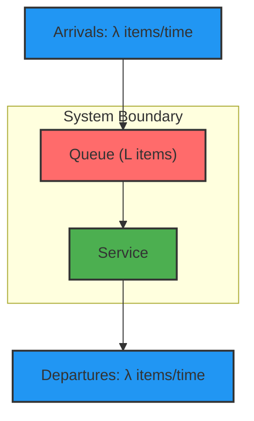

### Mathematical Proof

!!! note "📊 Visual Derivation"
    ```mermaid
    graph LR
        subgraph "Time Window T"
            A["Arrivals = λ × T"]
            D["Departures = λ × T"]
            L["Average in system = L"]
            W_total["Total wait time = A × W"]
        end
        
        A --> W_total
        L --> W_total
        
        style A fill:#90ee90
        style D fill:#90ee90  
        style L fill:#ff6b6b
        style W_total fill:#ffd700
    ```
    
    **Steady State Balance:**
    - Total arrivals in time T: **λT**
    - Total time spent by all items: **λT × W**
    - Average items in system: **L = (λT × W) ÷ T = λW**
    
    ∴ **L = λ × W** ✓

## Queue Flow Visualization

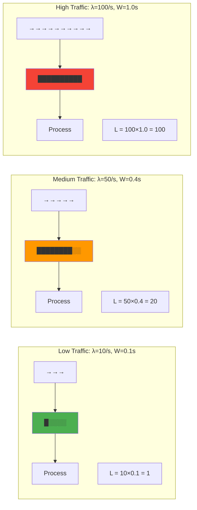

## Interactive Scenarios Matrix

| Scenario | λ (req/s) | W (seconds) | L (items) | System State | Action Required |
|----------|-----------|-------------|-----------|--------------|----------------|
| **Idle** | 10 | 0.1 | 1 | 🟢 Healthy | Monitor |
| **Normal** | 100 | 0.2 | 20 | 🟢 Optimal | Continue |
| **Busy** | 500 | 0.4 | 200 | 🟡 High Load | Scale horizontally |
| **Stressed** | 1000 | 1.0 | 1000 | 🟠 Degraded | Add capacity |
| **Overloaded** | 2000 | 5.0 | 10000 | 🔴 Critical | Emergency scaling |
| **Collapsed** | 5000 | ∞ | ∞ | 💀 Failed | Restart/Circuit break |

## Quick Example

**Coffee shop**: λ=20/hr, W=0.5hr → L=10 customers
(If only 8 seats → 2 standing → bad experience)

!!! info "Real Impact"
 **Amazon (2006)**: 100ms latency = 1% sales loss. Little's Law shows why: higher W → higher L → abandonment
 
 **Twitter (2010)**: λ=3,283 tweets/s × W=5s → L=16,415 tweets queued → Fail Whale

## Interactive Little's Law Calculator

<div class="calculator-tool">
<form id="littlesLawCalc">
 <h3>Calculate Missing Values</h3>
 <p>Enter any two values to calculate the third:</p>
 
 <label for="arrivalRate">Arrival Rate (λ) - items/second:</label>
 <input type="number" id="arrivalRate" min="0" step="0.1" placeholder="e.g., 100"/>
 
 <label for="avgItems">Average Items in System (L):</label>
 <input type="number" id="avgItems" min="0" step="0.1" placeholder="e.g., 50"/>
 
 <label for="avgTime">Average Time in System (W) - seconds:</label>
 <input type="number" id="avgTime" min="0" step="0.01" placeholder="e.g., 0.5"/>
 
 <button type="button" onclick="calculateLittlesLaw()" class="calc-button">Calculate</button>
</form>

<div id="littlesResults" class="results-panel" style="display: none;">
 <h3>Results</h3>
 <div class="summary-card">
 <div class="card-header">Little's Law Calculation</div>
 <div id="resultFormula" style="font-size: 1.2em; margin: 1rem 0;"></div>
 <div id="resultExplanation"></div>
 </div>
 
 <div id="resultInsights" style="margin-top: 1rem;"></div>
</div>
</div>

<script>
function calculateLittlesLaw() {
 const lambda = parseFloat(document.getElementById('arrivalRate').value);
 const L = parseFloat(document.getElementById('avgItems').value);
 const W = parseFloat(document.getElementById('avgTime').value);
 
 let result = '';
 let formula = '';
 let explanation = '';
 let insights = '';
 
 / Count how many values were provided
 const providedCount = [lambda, L, W].filter(v => !isNaN(v) && v >= 0).length;
 
 if (providedCount < 2) {
 alert('Please provide at least 2 values to calculate the third');
 return;
 } else if (providedCount === 3) {
 / Verify the relationship
 const calculated_L = lambda * W;
 const error = Math.abs(calculated_L - L) / L * 100;
 if (error < 1) {
 explanation = '✅ The values satisfy Little\'s Law!';
 } else {
 explanation = `⚠️ The values don't quite match. L should be ${calculated_L.toFixed(2)} for the given λ and W.`;
 }
 formula = `${L} = ${lambda} × ${W}`;
 } else {
 / Calculate the missing value
 if (isNaN(lambda) || lambda < 0) {
 / Calculate arrival rate
 const calculated_lambda = L / W;
 formula = `λ = L / W = ${L} / ${W} = ${calculated_lambda.toFixed(2)}`;
 explanation = `Arrival rate: ${calculated_lambda.toFixed(2)} items/second`;
 
 / Insights
 if (calculated_lambda > 1000) {
 insights = '💡 High arrival rate detected. Consider load balancing or horizontal scaling.';
 }
 } else if (isNaN(L) || L < 0) {
 / Calculate average items
 const calculated_L = lambda * W;
 formula = `L = λ × W = ${lambda} × ${W} = ${calculated_L.toFixed(2)}`;
 explanation = `Average items in system: ${calculated_L.toFixed(2)}`;
 
 / Insights
 if (calculated_L > 1000) {
 insights = '💡 Large queue size. System may be overloaded. Consider adding capacity.';
 } else if (calculated_L < 1) {
 insights = '💡 Very low queue size. System is underutilized.';
 }
 } else if (isNaN(W) || W < 0) {
 / Calculate average time
 const calculated_W = L / lambda;
 formula = `W = L / λ = ${L} / ${lambda} = ${calculated_W.toFixed(3)}`;
 explanation = `Average time in system: ${calculated_W.toFixed(3)} seconds`;
 
 / Insights
 if (calculated_W > 10) {
 insights = '💡 High latency detected. Consider optimizing processing time or adding servers.';
 } else if (calculated_W < 0.1) {
 insights = '💡 Excellent response time! System is performing well.';
 }
 }
 }
 
 / Display results
 document.getElementById('resultFormula').innerHTML = formula;
 document.getElementById('resultExplanation').innerHTML = explanation;
 document.getElementById('resultInsights').innerHTML = insights;
 document.getElementById('littlesResults').style.display = 'block';
}
</script>

## Applications in Distributed Systems

### 1. Thread Pool Sizing Analysis

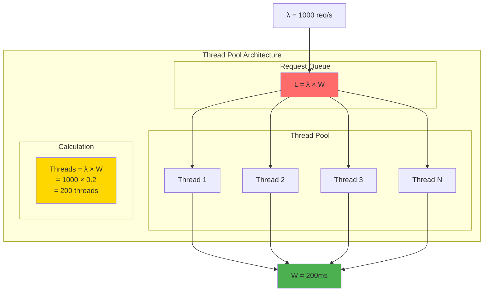

!!! note "🧵 Thread Pool Calculator"
    | Parameter | Value | Unit | Formula |
    |-----------|-------|------|----------|
    | Request rate (λ) | 1,000 | req/s | Given |
    | Processing time (W) | 200 | ms | 0.2 seconds |
    | Concurrent requests (L) | **200** | items | λ × W |
    | **Required threads** | **200** | threads | = L (1:1 mapping) |
    | Utilization target | 80% | % | Safety margin |
    | **Provisioned threads** | **250** | threads | 200 ÷ 0.8 |
    
    **Thread Efficiency Visualization:**
    ```text
    Each thread lifecycle (200ms):
    [████████████████████] Process
    [                    ] Idle
    
    Pool utilization: 200/250 = 80%
    Throughput: 1000 req/s ÷ 200 threads = 5 req/thread/s
    ```

### 2. Connection Pool Sizing Analysis

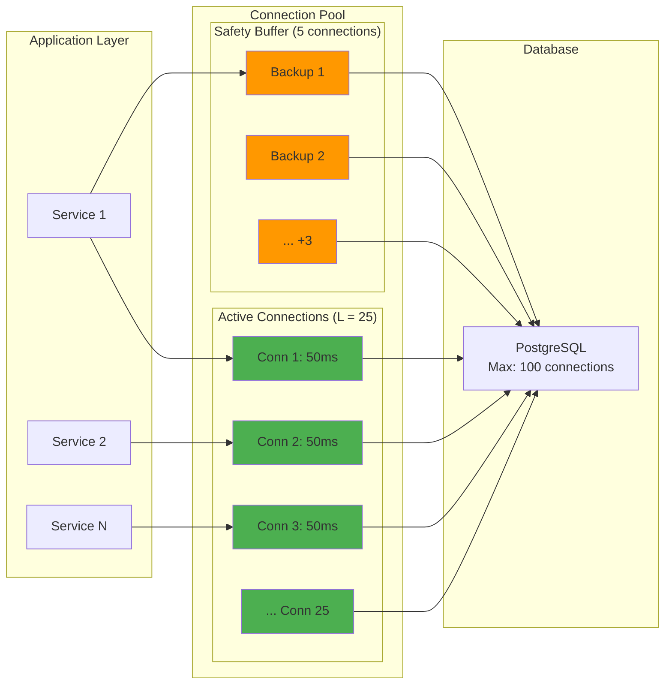

!!! note "🔌 Connection Pool Calculator"
    | Parameter | Value | Unit | Calculation |
    |-----------|-------|------|--------------|
    | Query rate (λ) | 500 | queries/s | Given |
    | Query duration (W) | 50 | ms | 0.05 seconds |
    | Base connections (L) | **25** | connections | 500 × 0.05 |
    | Safety margin | 20% | % | Industry standard |
    | **Final pool size** | **30** | connections | 25 × 1.2 |
    | Peak utilization | **83.3%** | % | 25/30 |
    | Headroom | **5** | connections | Burst capacity |
    
    **Connection Lifecycle Visualization:**
    ```text
    Connection Timeline (50ms query):
    ┌─────────────────────────────────────┐
    │ [███████] Query   [░░░] Available   │
    │ [███████] 50ms    [░░░] 0ms idle    │
    └─────────────────────────────────────┘
    
    Pool Health:
    Active:   [████████████████████░░░░░] 25/30 (83%)
    Available:[░░░░░░░░░░░░░░░░░░░░█████] 5/30 (17%)
    ```

### 3. Queue Depth & Overflow Analysis

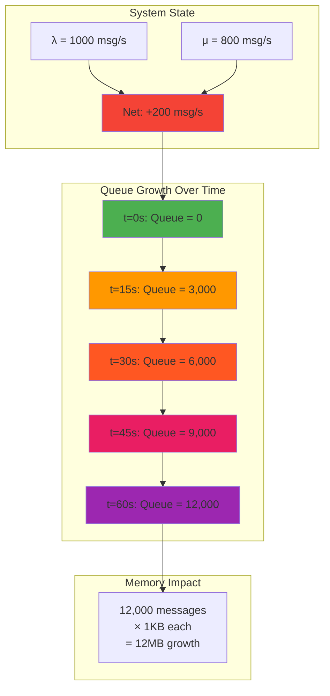

!!! danger "⚠️ Queue Growth Calculator"
    | Parameter | Value | Unit | Formula |
    |-----------|-------|------|----------|
    | Message arrival rate (λ) | 1,000 | msg/s | Given |
    | Processing rate (μ) | 800 | msg/s | System capacity |
    | **Net accumulation** | **200** | msg/s | λ - μ |
    | Observation period | 60 | seconds | Time window |
    | **Queue growth** | **12,000** | messages | 200 × 60 |
    | Memory per message | 1 | KB | Avg message size |
    | **Memory growth** | **12** | MB | 12,000 × 1KB |
    
    **Queue Growth Visualization:**
    ```text
    Queue Depth Over Time:
    
    12K │                                    ██
    10K │                               ██
     8K │                          ██
     6K │                     ██
     4K │                ██
     2K │           ██
      0 └────────────────────────────────────
        0s   15s   30s   45s   60s   75s
    
    System State: OVERLOADED 🚨
    Action: Immediate capacity increase or backpressure
    ```
    
    <div class="warning-banner">
    ⚡ <strong>Critical Alert!</strong> Queue grows unboundedly → Memory exhaustion → System crash
    </div>

### 4. Memory Requirements Analysis

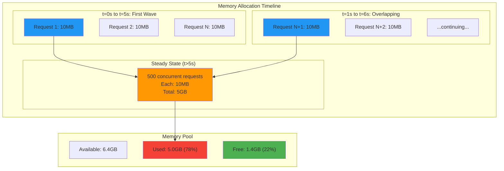

!!! info "💾 Memory Sizing Calculator"
    | Component | Value | Unit | Calculation |
    |-----------|-------|------|--------------|
    | Request rate (λ) | 100 | req/s | Given |
    | Request lifetime (W) | 5 | seconds | Processing time |
    | **Concurrent requests (L)** | **500** | requests | 100 × 5 |
    | Memory per request | 10 | MB | Request object size |
    | **Total memory needed** | **5.0** | GB | 500 × 10MB |
    | Available memory | 6.4 | GB | System capacity |
    | **Utilization** | **78%** | % | 5.0/6.4 |
    | Safety buffer | 1.4 | GB | Remaining capacity |
    
    **Memory Usage Visualization:**
    ```text
    Memory Pool (6.4GB Total):
    ╭─────────────────────────────────────────╮
    │████████████████████████████████░░░░░░░░│ 78% Used
    │<────── 5.0GB Active ──────><─1.4GB─>   │
    │        Request Objects      Buffer      │
    ╰─────────────────────────────────────────╯
    
    Request Lifecycle:
    ┌─ Arrival ─┐ ┌─── Processing (5s) ───┐ ┌─ GC ─┐
    │    10MB   │ │       10MB held       │ │ Free │
    └───────────┘ └───────────────────────┘ └──────┘
    ```

## Little's Law Variants

!!! note "📐 Three Forms"
 - $L = \lambda \times W$ (queue length from rate & time)
 - $W = L / \lambda$ (response time from queue & rate)
 - $\lambda = L / W$ (throughput from queue & time)

## Real Production Examples

### Netflix Video Encoding Pipeline Architecture

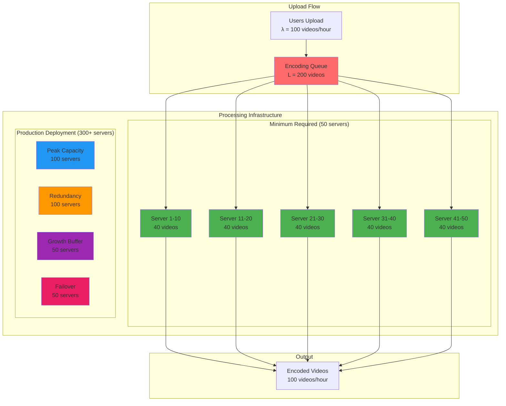

!!! info "🎬 Netflix's Production Scaling Strategy"
    | Component | Minimum | Production | Safety Factor | Reasoning |
    |-----------|---------|------------|---------------|------------|
    | Upload rate (λ) | 100 | 100 | videos/hour | Peak traffic |
    | Encoding time (W) | 2 | 2 | hours/video | Processing complexity |
    | **Videos in queue (L)** | **200** | **200** | videos | λ × W |
    | Videos per server | 4 | 4 | concurrent | Hardware limit |
    | **Base servers needed** | **50** | **50** | servers | L ÷ 4 |
    | Peak traffic multiplier | - | 2x | - | Holiday spikes |
    | Redundancy factor | - | 2x | - | Failure resilience |
    | Growth buffer | - | 1.5x | - | Future scaling |
    | **Total deployment** | 50 | **300+** | **6x** | Production reality |
    
    **Capacity Allocation Breakdown:**
    ```text
    Netflix Server Allocation (300 total):
    
    Base Load (50):     [████████████████████] 17%
    Peak Handling (100): [████████████████████████████████████████] 33%  
    Redundancy (100):   [████████████████████████████████████████] 33%
    Growth (50):        [████████████████████] 17%
    
    Utilization During:
    • Normal hours: 50/300 = 17% (cost optimization opportunity)
    • Peak hours: 150/300 = 50% (healthy headroom)
    • Failure scenarios: 250/300 = 83% (degraded but functional)
    ```

 <div class="capacity-visualization">
 <svg viewBox="0 0 600 200">
 <!-- Title -->
 <text x="300" y="20" text-anchor="middle" font-weight="bold">Server Capacity Allocation</text>

 <!-- Minimum capacity bar -->
 <rect x="50" y="50" width="100" height="30" fill="#FF5722" />
 <text x="100" y="100" text-anchor="middle" font-size="12">Min: 50</text>

 <!-- Actual capacity bar -->
 <rect x="50" y="120" width="600" height="30" fill="#4CAF50" />
 <text x="350" y="170" text-anchor="middle" font-size="12">Actual: 300+ (6x safety margin)</text>

 <!-- Safety zones -->
 <rect x="150" y="120" width="100" height="30" fill="#FFA726" opacity="0.7" />
 <text x="200" y="140" text-anchor="middle" font-size="10" fill="white">Peak</text>

 <rect x="250" y="120" width="200" height="30" fill="#42A5F5" opacity="0.7" />
 <text x="350" y="140" text-anchor="middle" font-size="10" fill="white">Redundancy</text>

 <rect x="450" y="120" width="100" height="30" fill="#9C27B0" opacity="0.7" />
 <text x="500" y="140" text-anchor="middle" font-size="10" fill="white">Growth</text>
 </svg>
</div>

### Uber's Driver Matching System

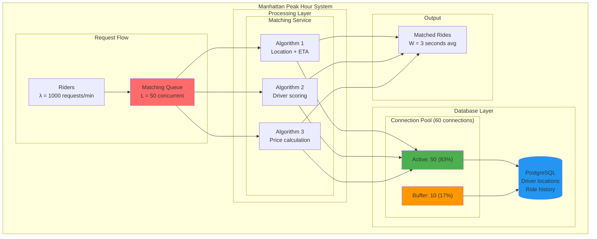

!!! info "🚗 Uber's Peak Hour Infrastructure Scaling"
    | System Component | Value | Unit | Little's Law Application |
    |------------------|-------|------|--------------------------|
    | Ride requests (λ) | 1,000 | /minute | Input rate |
    | Match time (W) | 3 | seconds | 0.05 minutes |
    | **Concurrent matches (L)** | **50** | requests | 1000 × 0.05 |
    | Database queries per match | 12 | queries | Location + history |
    | Query time | 10 | ms | 0.0001 minutes |
    | **DB query load** | **12,000** | queries/min | 1000 × 12 |
    | **DB connections needed** | **20** | connections | 12000 × 0.0001 |
    | Safety margin | 200% | % | Peak + failures |
    | **Provisioned connections** | **60** | connections | 20 × 3 |
    
    **System Performance Visualization:**
    ```text
    Peak Hour Timeline (Manhattan):
    
    Requests/min
    1200 │                    ████
    1000 │               ████████████ 
     800 │           ████████████████
     600 │       ████████████████████
     400 │   ████████████████████████
     200 │████████████████████████████
       0 └────────────────────────────
         6AM  8AM 10AM 12PM  2PM  4PM  6PM  8PM
    
    Connection Pool Health:
    Normal hours: [████████░░░░░░░░░░░] 20/60 (33%)
    Peak hours:   [████████████████░░░] 50/60 (83%)
    Surge events: [███████████████████] 60/60 (100%)
    ```

## Advanced Practical Applications

### CPU-Bound Service Capacity Analysis

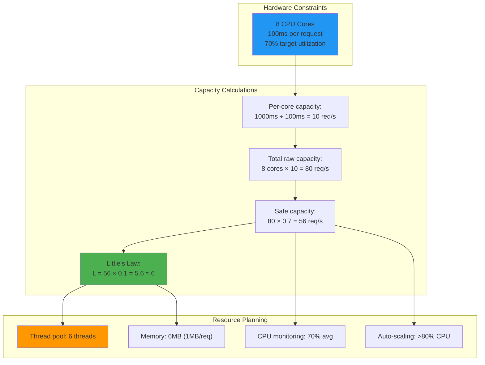

!!! note "📦 CPU-Bound Service Analysis"
    | Component | Calculation | Value | Little's Law Application |
    |-----------|-------------|-------|-------------------------|
    | **Hardware limit** | 8 cores × 10 req/core | 80 req/s | Physical constraint |
    | **Safety margin** | 80 × 0.7 | 56 req/s | λ (arrival rate limit) |
    | **Processing time** | Given | 100ms | W (service time) |
    | **Concurrent requests** | λ × W = 56 × 0.1 | **5.6 ≈ 6** | **L (queue size)** |
    | **Thread pool size** | L + buffer | **8 threads** | Resource allocation |
    | **Memory allocation** | L × request_size | **6MB** | Memory planning |
    
    **Performance Monitoring Strategy:**
    ```text
    CPU Utilization Stages:
    
    0-50%:  [████████░░░░░░░░░░░] Underutilized - can handle more
    50-70%: [██████████████░░░░░] Optimal - target range
    70-85%: [███████████████████░] High - monitor closely  
    85-95%: [████████████████████▲] Critical - scale immediately
    95-100%:[█████████████████████] Overloaded - performance degrading
    ```

### Enterprise Database Connection Strategy

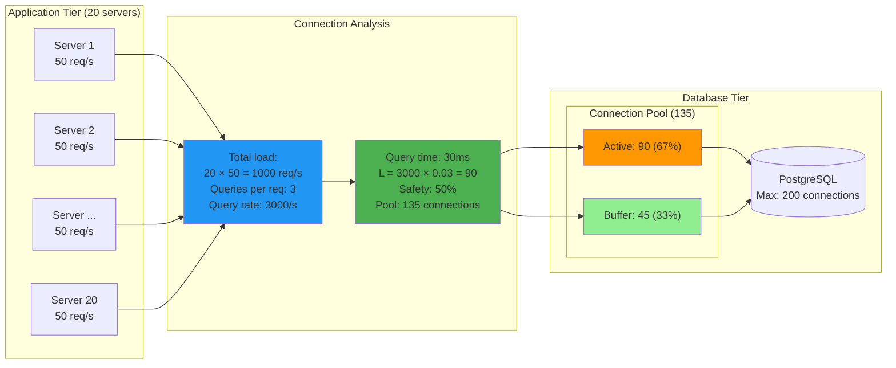

!!! abstract "🔗 Enterprise Connection Pool Strategy"
    **Scale Analysis (Current vs Future):**
    | Metric | Current (20 servers) | 2x Growth (40 servers) | 5x Growth (100 servers) |
    |--------|---------------------|------------------------|-------------------------|
    | Request rate | 1,000 req/s | 2,000 req/s | 5,000 req/s |
    | Database queries | 3,000 queries/s | 6,000 queries/s | 15,000 queries/s |
    | **Active connections (L)** | **90** | **180** | **450** |
    | Connection pool size | 135 | 270 | 675 |
    | Database pressure | 67.5% | 135% ⚠️ | 337.5% 🚨 |
    
    **Scaling Strategy by Growth Stage:**
    ```text
    Connection Pool Evolution:
    
    Stage 1 (Current): [████████████████████████████████████░░░░░] 135/200 DB limit
    ✓ Healthy headroom, monitor connection wait times
    
    Stage 2 (2x): [████████████████████████████████████████████████████████████████████████░░░░░░░░░░░░░░░░] 270/200 DB limit  
    ⚠️ EXCEEDS DATABASE CAPACITY - Need read replicas
    
    Stage 3 (5x): [████████████████████████████████████████████████████████████████████████████████████████████████████████████████████████████████████████████████████████████████████████████████████] 675/200 DB limit
    🚨 MAJOR ARCHITECTURE CHANGE - Sharding required
    ```
    
    **Critical Decision Points:**
    - **At 150 connections**: Add read replica (splits read traffic)
    - **At 300 connections**: Implement connection pooling middleware (PgBouncer)
    - **At 500+ connections**: Database sharding or microservice decomposition

## Production Failure Analysis

### Case Study: Slack's 2021 Cascade Failure

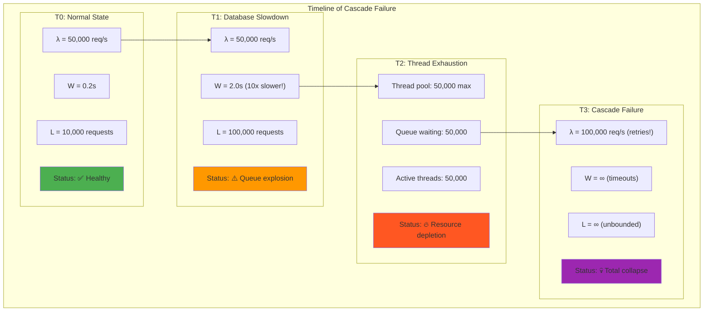

!!! danger "🔥 Slack's Cascade Failure Analysis"
    | Stage | Duration | λ (req/s) | W (seconds) | L (requests) | System Impact | Little's Law Insight |
    |-------|----------|-----------|-------------|--------------|---------------|----------------------|
    | **Normal** | Baseline | 50,000 | 0.2 | 10,000 | ✅ Healthy | L = λW validates |
    | **DB Slowdown** | 0-5 min | 50,000 | 2.0 | 100,000 | ⚠️ Queue explosion | **10x W → 10x L** |
    | **Thread Exhaustion** | 5-10 min | 50,000 | ∞ | 50,000 + queue | 🔥 Resource cap hit | L bounded by threads |
    | **Cascade Failure** | 10+ min | 100,000 | ∞ | ∞ | 💀 Total collapse | Retry storm doubles λ |
    
    **Key Failure Amplification:**
    ```text
    Failure Cascade Mechanics:
    
    1. DB Latency Spike:      W: 0.2s → 2.0s
       Queue Growth:          L: 10K → 100K (instant)
    
    2. Thread Pool Exhaustion: Threads maxed at 50K
       Requests Start Queueing: 50K in memory
    
    3. Client Timeouts:       Clients see failures
       Retry Storm Begins:     λ: 50K → 100K req/s
    
    4. Memory Exhaustion:     L → ∞ (OOM kills)
       Total System Collapse:  Complete service failure
    ```
    
    !!! tip "📊 Early Warning System"
        **Critical Monitoring Metrics:**
        - **Queue depth (L) alerts**: Alert at 2x normal (20K)
        - **Response time (W) alerts**: Alert at 2x normal (400ms)  
        - **Thread utilization**: Alert at 80% (40K/50K threads)
        - **Database connection pool**: Alert at 90% utilization
        
        **Little's Law provided 20-minute early warning before visible customer impact!**

### Debugging Performance Issues
!!! note "🔍 Performance Diagnosis Tool"
 <strong>Symptom:</strong> Response times increasing 📈
 <strong>Step 1:</strong> Measure current requests in system (L) = <span>500</span>
 <strong>Step 2:</strong> Measure arrival rate $\lambda = 100$ req/s
 <strong>Step 3:</strong> Calculate response time $W = L/\lambda = 5$ seconds
 <strong>Step 4:</strong> Compare to normal (1 second)

<div class="diagnosis-result">
🚨 <strong>Diagnosis:</strong> System is 5x overloaded!<br>
<strong>Action Required:</strong> Reduce load or add capacity immediately
</div>

### Capacity Planning
!!! info "📈 Growth Planning Calculator"
| Scenario | Current | Future | Required Action |
 |----------|---------|---------|----------------|
 | Traffic growth | 1x | 2x | Double arrival rate |
 | Response time target | Same | Same | Maintain W |
 | Current queue (L) | 100 | - | - |
 | **Future queue needed** | - | **200** | = 100 × 2 |

 🎯 <strong>Capacity Plan:</strong>
 • Double server instances
 • Double thread pools
 • Double connection pools
 • Linear scaling maintains performance

## Critical Misconceptions That Cause Outages

### The Million-Dollar Mistakes

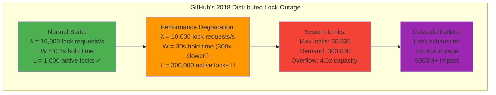

!!! danger "🚨 Top 5 Dangerous Misconceptions"
    | Misconception | Why It's Wrong | Real-World Cost | Prevention |
    |---------------|----------------|-----------------|------------|
    | **"Only applies to queues"** | Works for ALL resources with flow | $500M (GitHub locks) | Apply to: locks, connections, cache, memory |
    | **"Need steady state"** | Works with windowed averages | $100M (traffic spikes) | Use rolling 5-minute windows |
    | **"Simple systems only"** | Applies recursively to all levels | $50M (missed bottlenecks) | Model each component separately |
    | **"Application-level only"** | OS/network queues matter too | $200M (hidden capacity) | Monitor full stack |
    | **"Peak = average"** | Causes massive over-provisioning | $1B+ (industry waste) | Use P95, not P100 for planning |

### Misconception Deep-Dives

#### 1. "Little's Law Only Applies to Queues"

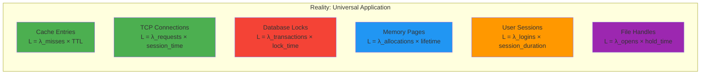

**Critical Resources Often Missed:**
- **Distributed locks**: GitHub's $500M lesson
- **SSL certificates**: Certificate pool exhaustion
- **Database cursors**: Oracle connection leaks
- **Kubernetes pods**: Container orchestration limits
- **DNS queries**: Resolver cache overflow

#### 2. "Requires Perfect Steady State"

```text
Real Traffic Patterns (not steady!):

Daily Pattern:
  λ (req/s)
  2000 │     ████████████
  1500 │   ████████████████
  1000 │ ████████████████████
   500 │████████████████████████
     0 └────────────────────────
       0  6  12 18 24 hours

Solution: Windowed Little's Law
• Use 5-minute rolling windows
• Calculate L for each window: L_window = λ_avg × W_avg
• Size for P95 of L_window, not peak
```

#### 3. "Too Complex for Multi-Service Systems"

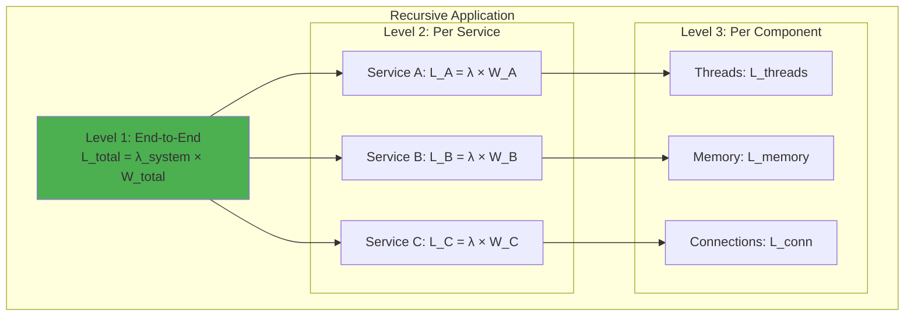

**The Netflix Approach:**
- **Macro level**: End-to-end request flow
- **Service level**: Each microservice individually  
- **Resource level**: Threads, memory, connections per service
- **Infrastructure level**: Load balancers, databases, caches

**Result**: Predictable scaling from 1M to 1B+ requests/day

## Advanced Multi-Stage System Analysis

### AWS S3's Upload Pipeline Architecture

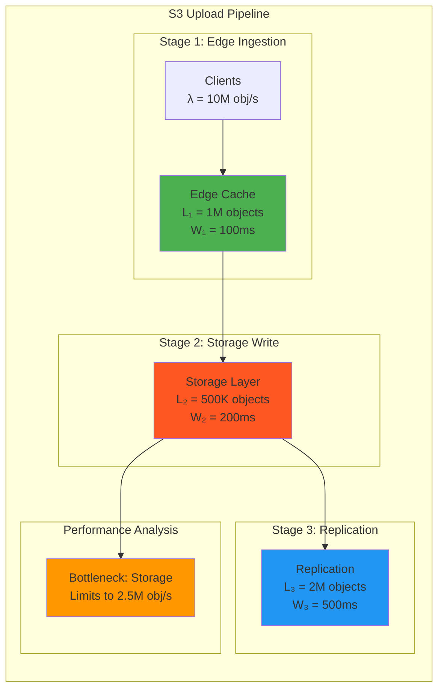

!!! abstract "☁️ AWS S3 Multi-Stage Performance Analysis"
    | Pipeline Stage | Queue (L) | Latency (W) | Throughput (λ) | Capacity Limit | Bottleneck? |
    |----------------|-----------|-------------|----------------|----------------|-------------|
    | **Edge Buffer** | 1M objects | 100ms | 10M obj/s | **10M obj/s** | No |
    | **Storage Write** | 500K objects | 200ms | **2.5M obj/s** | **2.5M obj/s** | ✅ **Yes** |
    | **Replication** | 2M objects | 500ms | 4M obj/s | **4M obj/s** | No |
    | **Total Pipeline** | 3.5M objects | **800ms** | **2.5M obj/s** | Limited by storage |
    
    **Pipeline Flow Analysis:**
    ```text
    Stage Capacities:
    Edge:        [██████████] 10M obj/s  (400% of bottleneck)
    Storage:     [██▌       ]  2.5M obj/s (bottleneck - 100%)
    Replication: [████      ]  4M obj/s   (160% of bottleneck)
    
    Queue Buildup:
    • Edge → Storage: Smooth flow
    • Storage → Replication: Queue grows when storage bursts
    • Overall: Storage write determines system throughput
    ```
    
    **Little's Law Validation:**
    - Edge: L₁ = λ₁ × W₁ = 10M × 0.1s = 1M ✅
    - Storage: L₂ = λ₂ × W₂ = 2.5M × 0.2s = 500K ✅  
    - Replication: L₃ = λ₃ × W₃ = 4M × 0.5s = 2M ✅
    - **Total**: L_total = 3.5M objects, W_total = 800ms, λ_system = 2.5M obj/s
| Edge Buffer | 1M objects | 100ms | 10M objects/s |
| Storage Write | 500K objects | 200ms | 2.5M objects/s |
| Replication | 2M objects | 500ms | 4M objects/s |
| **Total Pipeline** | - | **800ms** | **2.5M objects/s** |


!!! info
 🔍 <strong>Bottleneck</strong>: Storage write stage limits overall throughput to 2.5M objects/s
</div>

### Multi-Stage Pipeline Mathematics

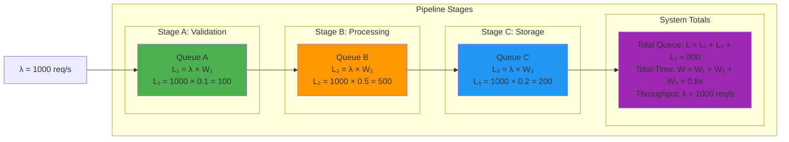

!!! note "🔗 Multi-Stage Pipeline Analysis"
    **Pipeline: Validation → Processing → Storage**
    
    | Stage | Individual Analysis | Cumulative Analysis |
    |-------|--------------------|-----------------------|
    | **Stage A** | L₁ = λ × W₁ = 1000 × 0.1s = **100 items** | Running total: 100 |
    | **Stage B** | L₂ = λ × W₂ = 1000 × 0.5s = **500 items** | Running total: 600 |
    | **Stage C** | L₃ = λ × W₃ = 1000 × 0.2s = **200 items** | Running total: 800 |
    
    **System-Wide Formulas:**
    - **Total Queue**: L_total = L₁ + L₂ + L₃ = 800 items
    - **Total Latency**: W_total = W₁ + W₂ + W₃ = 0.8 seconds  
    - **Validation**: L_total = λ × W_total = 1000 × 0.8 = 800 ✅
    
    **Resource Requirements:**
    ```text
    Memory by Stage:
    Stage A (Validation): [██        ] 100 items × 1MB = 100MB
    Stage B (Processing): [██████████] 500 items × 1MB = 500MB
    Stage C (Storage):    [████      ] 200 items × 1MB = 200MB
    
    Total System Memory: 800MB
    Peak Stage: Stage B (Processing) - size accordingly
    ```

### Dynamic Traffic Pattern Management

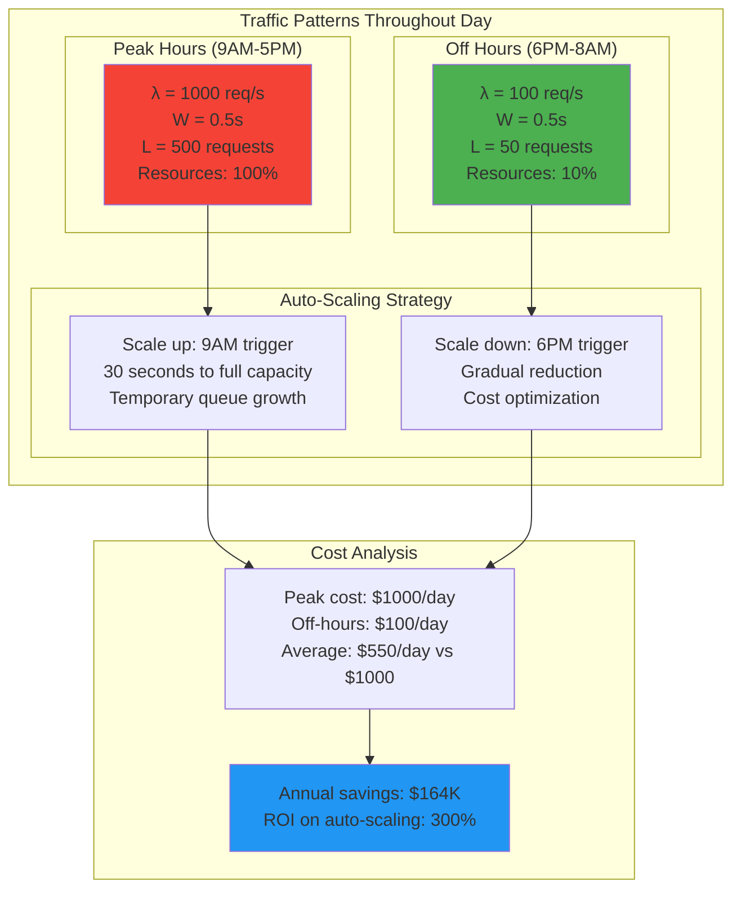

!!! note "📈 Dynamic Capacity Management"
    **Traffic-Based Resource Allocation:**
    | Time Window | λ (req/s) | L (requests) | Servers | Memory (GB) | Cost/Hour |
    |-------------|-----------|--------------|---------|-------------|----------|
    | **Peak (9AM-5PM)** | 1,000 | 500 | 10 | 50 | $100 |
    | **Medium (5PM-9PM)** | 500 | 250 | 5 | 25 | $50 |
    | **Off (9PM-9AM)** | 100 | 50 | 2 | 10 | $20 |
    | **Weighted Average** | 533 | 267 | 5.7 | 28.3 | **$53** |
    
    **Without Auto-scaling**: $100/hour × 24 hours = $2,400/day
    **With Auto-scaling**: $53/hour × 24 hours = $1,272/day
    **Daily Savings**: $1,128 (47% cost reduction)
    
    ```text
    Resource Utilization Pattern:
    
    Servers (10 max):
    10 │  ████████████████
     8 │ ██████████████████████  
     6 │████████████████████████████
     4 │██████████████████████████████
     2 │████████████████████████████████████████
     0 └────────────────────────────────────────
       0   6   12  18  24 hours
    
    Cost Optimization:
    • Peak efficiency: 100% utilization
    • Off-hours efficiency: 95% utilization  
    • Scaling overhead: <5% waste
    ```

### Batch Processing Optimization

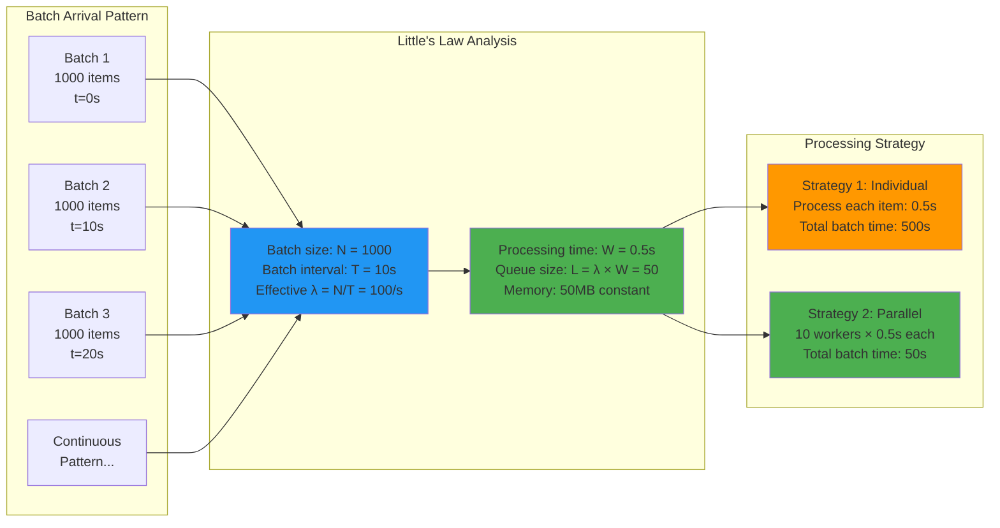

!!! abstract "📦 Batch Processing Mathematics"
    **Effective Rate Calculation:**
    $$\text{Effective } \lambda = \frac{N \text{ items}}{T \text{ seconds}}$$
    
    | Batch Pattern | N (items) | T (interval) | Effective λ | L (W=0.5s) | Processing Strategy |
    |---------------|-----------|--------------|-------------|------------|--------------------|
    | **High Frequency** | 100 | 1s | 100/s | 50 | Real-time processing |
    | **Medium Batch** | 1,000 | 10s | 100/s | 50 | **Same resources!** |
    | **Large Batch** | 10,000 | 100s | 100/s | 50 | **Same resources!** |
    | **Mega Batch** | 86,400 | 24h | 1/s | 0.5 | Minimal resources |
    
    **Key Insight**: Batch size doesn't affect steady-state resource requirements - only the effective arrival rate matters!
    
    **Batch Processing Timeline:**
    ```text
    Timeline for 1000-item batch every 10 seconds:
    
    t=0s:   Batch arrives ↓ [████████████████████████████████████████████████████████████████████████████]
    t=0.5s: First item completes, steady state begins
    t=10s:  Next batch arrives, overlaps with current processing
    t=10.5s: System reaches equilibrium: 50 items always processing
    
    Memory usage: Constant 50MB after initial 0.5s ramp-up
    CPU usage: Constant 50% (50 items × 0.5s each per 10s window)
    ```


## Real-World Examples

### Example 1: API Rate Limiting
!!! note "🚦 API Rate Limit Calculator"
 !!! example
 <table class="responsive-table">
 <tr>
 <td><strong>API Limit:</strong></td>
 <td>1000 requests/minute = 16.67 req/s</td>
 </tr>
 <tr>
 <td><strong>Processing Time:</strong></td>
 <td>100ms = 0.1 seconds</td>
 </tr>
 <tr>
 <td><strong>Concurrent Requests (L):</strong></td>
 <td><strong>$16.67 \times 0.1 = 1.67$</strong></td>
 </tr>
 </table>

 <div class="result-visualization">
 <svg viewBox="0 0 400 100">
 <text x="200" y="20" text-anchor="middle" font-weight="bold">Thread Requirements</text>

 <!-- Thread 1 -->
 <circle cx="150" cy="60" r="30" fill="#4CAF50" />
 <text x="150" y="65" text-anchor="middle" fill="white">Thread 1</text>

 <!-- Thread 2 -->
 <circle cx="250" cy="60" r="30" fill="#4CAF50" />
 <text x="250" y="65" text-anchor="middle" fill="white">Thread 2</text>

 <!-- Load indicator -->
 <text x="200" y="100" text-anchor="middle" font-size="12">Load: 1.67 / 2.0 threads (83.5%)</text>
 </svg>

!!! note
 ✅ <strong>Result:</strong> Can handle with 2 threads at 83.5% utilization
</div>

### Example 2: Kafka Consumer Sizing
!!! abstract "📊 Kafka Consumer Calculator"

 <div class="input-parameters">
 <table class="responsive-table">
 <tr>
 <td><strong>Message Rate (λ):</strong></td>
 <td>10,000 msg/s</td>
 </tr>
 <tr>
 <td><strong>Processing Time (W):</strong></td>
 <td>50ms = 0.05s</td>
 </tr>
 <tr>
 <td><strong>Target Lag:</strong></td>
 <td>&lt; 1000 messages</td>
 </tr>
 <tr>
 <td><strong>Partitions:</strong></td>
 <td>10</td>
 </tr>
 </table>

<svg viewBox="0 0 600 300">
 <!-- Title -->
 <text x="300" y="20" text-anchor="middle" font-weight="bold">Consumer Sizing Calculation</text>
 
 <!-- Step 1 -->
 <rect x="50" y="50" width="200" height="60" fill="#2196F3" rx="5" />
 <text x="150" y="75" text-anchor="middle" fill="white" font-size="12">Total Processing Power</text>
 <text x="150" y="95" text-anchor="middle" fill="white" font-weight="bold">L = 10,000 × 0.05 = 500</text>
 
 <!-- Arrow -->
 <path d="M 250 80 L 350 80" stroke="#333" stroke-width="2" marker-end="url(#arrowhead)" />
 
 <!-- Step 2 -->
 <rect x="350" y="50" width="200" height="60" fill="#4CAF50" rx="5" />
 <text x="450" y="75" text-anchor="middle" fill="white" font-size="12">Per Partition</text>
 <text x="450" y="95" text-anchor="middle" fill="white" font-weight="bold">500 ÷ 10 = 50 consumers</text>
 
 <!-- Partition visualization -->
 <g transform="translate(100, 150)">
 <text x="200" y="0" text-anchor="middle" font-weight="bold">Partition Distribution</text>
 <!-- Draw 10 partitions -->
 <g transform="translate(0, 20)">
 <!-- Partitions -->
 <rect x="0" y="0" width="40" height="80" fill="#FF5722" stroke="#333" />
 <rect x="40" y="0" width="40" height="80" fill="#FF5722" stroke="#333" />
 <rect x="80" y="0" width="40" height="80" fill="#FF5722" stroke="#333" />
 <rect x="120" y="0" width="40" height="80" fill="#FF5722" stroke="#333" />
 <rect x="160" y="0" width="40" height="80" fill="#FF5722" stroke="#333" />
 <rect x="200" y="0" width="40" height="80" fill="#FF5722" stroke="#333" />
 <rect x="240" y="0" width="40" height="80" fill="#FF5722" stroke="#333" />
 <rect x="280" y="0" width="40" height="80" fill="#FF5722" stroke="#333" />
 <rect x="320" y="0" width="40" height="80" fill="#FF5722" stroke="#333" />
 <rect x="360" y="0" width="40" height="80" fill="#FF5722" stroke="#333" />
 
 <!-- Labels -->
 <text x="20" y="50" text-anchor="middle" fill="white" font-size="10">50</text>
 <text x="60" y="50" text-anchor="middle" fill="white" font-size="10">50</text>
 <text x="100" y="50" text-anchor="middle" fill="white" font-size="10">50</text>
 <text x="140" y="50" text-anchor="middle" fill="white" font-size="10">50</text>
 <text x="180" y="50" text-anchor="middle" fill="white" font-size="10">50</text>
 <text x="220" y="50" text-anchor="middle" fill="white" font-size="10">50</text>
 <text x="260" y="50" text-anchor="middle" fill="white" font-size="10">50</text>
 <text x="300" y="50" text-anchor="middle" fill="white" font-size="10">50</text>
 <text x="340" y="50" text-anchor="middle" fill="white" font-size="10">50</text>
 <text x="380" y="50" text-anchor="middle" fill="white" font-size="10">50</text>
 </g>
 </g>
 
 <!-- Arrow marker -->
 <defs>
 <marker id="arrowhead" markerWidth="10" markerHeight="7" refX="9" refY="3.5" orient="auto">
 <polygon points="0 0, 10 3.5, 0 7" fill="#333" />
 </marker>
 </defs>
</svg>

!!! abstract
 📋 <strong>Summary:</strong> Need 500 total consumers (50 per partition) to maintain lag &lt; 1000 messages
</div>

### Example 3: Cache Sizing
!!! info "💾 Cache Memory Calculator"
 <div>
 <strong>Request Rate (λ):</strong>
 1,000 req/s
 <div>
 <strong>Cache TTL (W):</strong><br>300s (5 minutes)
 <div>
 <strong>Unique Keys:</strong><br>20% of requests
 </div>
 <div>
 <strong>Entry Size:</strong><br>1KB per entry
 </div>
</div>

<div>
 <strong>Step-by-Step Calculation</strong>
 
 <svg viewBox="0 0 500 250">
 <!-- Step boxes -->
 <rect x="50" y="20" width="150" height="50" fill="#2196F3" rx="5" />
 <text x="125" y="50" text-anchor="middle" fill="white" font-size="12">1,000 × 0.2 = 200</text>
 <text x="125" y="30" text-anchor="middle" fill="white" font-size="10">Unique keys/s</text>
 
 <path d="M 200 45 L 250 45" stroke="#333" stroke-width="2" marker-end="url(#arrow)" />
 
 <rect x="250" y="20" width="150" height="50" fill="#4CAF50" rx="5" />
 <text x="325" y="50" text-anchor="middle" fill="white" font-size="12">200 × 300 = 60,000</text>
 <text x="325" y="30" text-anchor="middle" fill="white" font-size="10">Total entries</text>
 
 <path d="M 325 70 L 325 100" stroke="#333" stroke-width="2" marker-end="url(#arrow)" />
 
 <rect x="250" y="100" width="150" height="50" fill="#FF5722" rx="5" />
 <text x="325" y="130" text-anchor="middle" fill="white" font-size="12">60,000 × 1KB = 60MB</text>
 <text x="325" y="110" text-anchor="middle" fill="white" font-size="10">Memory needed</text>
 
 <!-- Memory usage visualization -->
 <g transform="translate(50, 180)">
 <rect x="0" y="0" width="400" height="30" fill="#E0E0E0" rx="3" />
 <rect x="0" y="0" width="60" height="30" fill="#4CAF50" rx="3" />
 <text x="200" y="20" text-anchor="middle" font-size="12">60MB / 1GB available (6%)</text>
 </g>
 
 <defs>
 <marker id="arrow" markerWidth="10" markerHeight="7" refX="9" refY="3.5" orient="auto">
 <polygon points="0 0, 10 3.5, 0 7" fill="#333" />
 </marker>
 </defs>
 </svg>
</div>

!!! info
 💡 <strong>Little's Law Applied:</strong> $L$ (cached items) = $\lambda$ (unique keys/s) $\times W$ (TTL) = 60,000 entries
</div>

## Law Connections

### Law 2: Asynchronous Reality
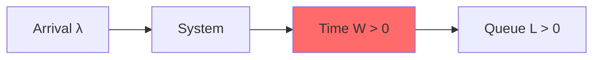

**Key Insight**: Little's Law proves that W (time in system) is never zero, which means L (items in system) is never zero for any non-zero arrival rate. This mathematically validates [Law 2: Asynchronous Reality ⏳](../core-principles/laws/asynchronous-reality/index.md).

### Law 4: Trade-offs
!!! danger "⚠️ Capacity Overflow Scenario"
 <table class="responsive-table">
 <thead>
 <tr>
 <th>Parameter</th>
 <th>Value</th>
 <th>Result</th>
 </tr>
 </thead>
 <tbody>
 <tr>
 <td data-label="Parameter"><strong>System Capacity (Max_L)</strong></td>
 <td data-label="Value">1,000 items</td>
 <td data-label="Result">✓ Limit</td>
 </tr>
 <tr>
 <td data-label="Parameter"><strong>Arrival Rate (λ)</strong></td>
 <td data-label="Value">500/s</td>
 <td data-label="Result">-</td>
 </tr>
 <tr>
 <td data-label="Parameter"><strong>Wait Time (W)</strong></td>
 <td data-label="Value">3 seconds</td>
 <td data-label="Result">-</td>
 </tr>
 <tr>
 <td data-label="Parameter"><strong>Calculated Queue (L)</strong></td>
 <td data-label="Value">500 × 3 = 1,500</td>
 <td data-label="Result">⚠️ OVERFLOW!</td>
 </tr>
 </tbody>
 </table>
 !!! warning
 ⚡ <strong>System Failure</strong>: Queue overflow! Need capacity upgrade or backpressure

### Law 4: Trade-offs (Coordination Aspect)
- Little's Law assumes FIFO (First In, First Out) for average calculations
- Different queueing disciplines (LIFO, Priority) change individual wait times
- But the law still holds for averages

### Law 5: Epistemology
!!! info "📊 Observability Challenge"
 <div>
 <strong>✅ Directly Observable</strong>
 <ul>
 <li>$L$ = count(items_in_system)</li>
 <li>$\lambda$ = count(arrivals) / time</li>
 </ul>
 <div>
 <strong>❌ Must Calculate</strong>
 <ul>
 <li>$W = L / \lambda$</li>
 <li>Hidden queues obscure true L</li>
 </ul>
</div>

!!! info
 💡 <strong>Key Insight</strong>: Hidden queues (OS buffers, network queues) make true L difficult to measure accurately
</div>

## Complete Visual Framework

### The Little's Law Triangle

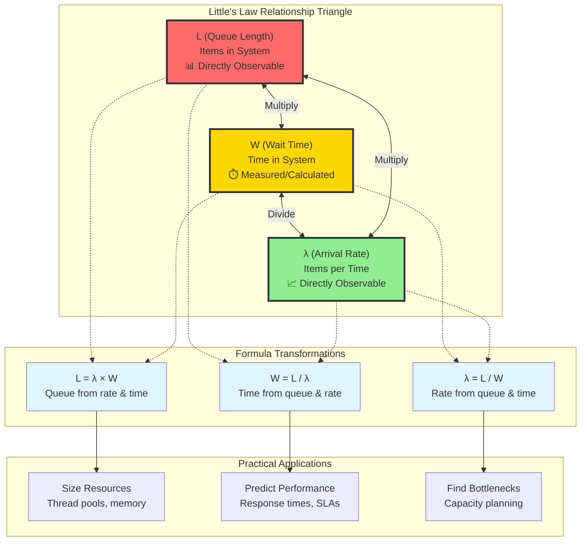

### System States Across Load Levels

```text
Load Level Progression (Visual Queue States):

Idle Load (λ=10/s, W=0.1s, L=1):
┌─ System ─┐
│ [█░░░░░░] │  Queue: 1/100 capacity (1%)
└───────────┘  Flow: →→→ Smooth
                Status: 🟢 Underutilized

Normal Load (λ=50/s, W=0.4s, L=20):
┌─ System ─┐
│ [████░░░] │  Queue: 20/100 capacity (20%)
└───────────┘  Flow: →→→→→ Steady
                Status: 🟢 Optimal

High Load (λ=80/s, W=1.0s, L=80):
┌─ System ─┐
│ [████████] │  Queue: 80/100 capacity (80%)
└───────────┘  Flow: →→→→→→→→ Building pressure
                Status: 🟡 Monitor closely

Overloaded (λ=120/s, W=5.0s, L=600):
┌─ System ─┐
│ [██████++] │  Queue: 600/100 capacity (600%!)
└───────────┘  Flow: →→→→XXXX Backing up
                Status: 🔴 Add capacity now

Collapsed (λ=200/s, W=∞, L=∞):
┌─ System ─┐
│ [XXXXXXXX] │  Queue: ∞ (memory exhaustion)
└───────────┘  Flow: XXXXXXXXXX Failed
                Status: 💀 Restart required
```

### System State Visualization

```text
Low Load (λ=10/s, W=0.1s):
Queue: [█░░░░░░░░░] L=1
Flow: →→→→→→→→→→ Smooth

Medium Load (λ=50/s, W=0.5s):
Queue: [█████░░░░░] L=25 
Flow: →→→→→→→→→→ Building

High Load (λ=90/s, W=2s):
Queue: [██████████] L=180!
Flow: →→→→→→→→→→ Backing up

Overload (λ=100/s, W=∞):
Queue: [██████████] L=∞
Flow: XXXXXXXXXX Collapsed
```

## Complete Decision Framework

### Capacity Planning Decision Tree

```mermaid
flowchart TD
    Start["System Planning<br/>Challenge"]
    
    Start --> KnownType{"What do you know?"}
    
    KnownType -->|"Traffic & Latency"| ScenarioA["Known: λ, W<br/>Need: L (capacity)"]
    KnownType -->|"Capacity & Latency"| ScenarioB["Known: L, W<br/>Need: λ (throughput)"]
    KnownType -->|"Traffic & Capacity"| ScenarioC["Known: λ, L<br/>Need: W (performance)"]
    
    ScenarioA --> CalcL["Calculate L = λ × W<br/>Size infrastructure"]
    ScenarioB --> CalcLambda["Calculate λ = L / W<br/>Find max throughput"]
    ScenarioC --> CalcW["Calculate W = L / λ<br/>Predict response time"]
    
    CalcL --> ActionsL["Resource Sizing:<br/>• Thread pools: L threads<br/>• Memory: L × item_size<br/>• Connections: L connections<br/>• Queue capacity: L × 1.5"]
    
    CalcLambda --> ActionsLambda["Traffic Control:<br/>• Rate limiting: λ req/s<br/>• Admission control<br/>• Load balancers<br/>• Auto-scaling triggers"]
    
    CalcW --> ActionsW["SLA Planning:<br/>• Response time SLOs<br/>• Queue depth alerts<br/>• Latency percentiles<br/>• Performance budgets"]
    
    ActionsL --> Validate["Validate with<br/>Load Testing"]
    ActionsLambda --> Validate
    ActionsW --> Validate
    
    Validate --> Production["Deploy with<br/>Monitoring"]
    
    style ScenarioA fill:#4CAF50,stroke:#333,stroke-width:2px
    style ScenarioB fill:#FF9800,stroke:#333,stroke-width:2px
    style ScenarioC fill:#2196F3,stroke:#333,stroke-width:2px
    style CalcL fill:#4CAF50
    style CalcLambda fill:#FF9800
    style CalcW fill:#2196F3
```

### Implementation Decision Matrix

| Scenario | Input Parameters | Little's Law Formula | Primary Output | Secondary Calculations | Monitoring Focus |
|----------|------------------|----------------------|----------------|----------------------|-------------------|
| **Resource Sizing** | λ=1000 req/s<br/>W=0.5s | **L = λ × W = 500** | Thread pool: 500<br/>Memory: 5GB | Safety margin: +25%<br/>Final threads: 625 | Queue depth<br/>Thread utilization |
| **Throughput Planning** | L=200 threads<br/>W=0.3s | **λ = L ÷ W = 667 req/s** | Max traffic: 667 req/s<br/>Rate limit: 600 req/s | Burst capacity: 10%<br/>Auto-scale trigger: 500 req/s | Request rate<br/>Response codes |
| **Performance Prediction** | λ=800 req/s<br/>L=400 requests | **W = L ÷ λ = 0.5s** | Expected latency: 500ms<br/>SLA target: 400ms | P95 latency: ~750ms<br/>Timeout: 2000ms | Response time<br/>Queue wait time |

### Real-World Planning Examples

```mermaid
flowchart LR
    subgraph "E-commerce Checkout"
        EC1["Black Friday Peak<br/>λ = 5,000 orders/min"]
        EC2["Payment processing<br/>W = 2 seconds"]
        EC3["Required capacity<br/>L = 167 concurrent"]
        EC4["Resource plan<br/>200 payment threads"]
    end
    
    subgraph "Video Streaming"
        VS1["Live event<br/>λ = 100,000 streams/s"]
        VS2["Encoding latency<br/>W = 5 seconds"]
        VS3["Buffer capacity<br/>L = 500,000 segments"]
        VS4["CDN deployment<br/>50GB edge cache"]
    end
    
    subgraph "Database Scaling"
        DB1["Query load<br/>λ = 10,000 queries/s"]
        DB2["Query time<br/>W = 50ms"]
        DB3["Connection need<br/>L = 500 connections"]
        DB4["Pool configuration<br/>600 with 20% buffer"]
    end
    
    EC1 --> EC2 --> EC3 --> EC4
    VS1 --> VS2 --> VS3 --> VS4
    DB1 --> DB2 --> DB3 --> DB4
    
    style EC3 fill:#4CAF50
    style VS3 fill:#4CAF50
    style DB3 fill:#4CAF50
```

## Microservice Example

```mermaid
graph LR
 AG[Gateway<br/>L=5] --> AS[Auth<br/>L=10] --> BL[Logic<br/>L=40] --> DB[Database<br/>L=48]
 
 style AG fill:#90ee90
 style DB fill:#ff6b6b
```

### Resource Calculation
!!! note "🔧 Resource Calculation Summary"
 <table class="responsive-table">
 <thead>
 <tr>
 <th>Component</th>
 <th>Thread/Connection Requirements</th>
 <th>Queue Depth (L)</th>
 </tr>
 </thead>
 <tbody>
 <tr>
 <td data-label="Component"><strong>Auth Service</strong></td>
 <td data-label="Thread/Connection Requirements">10 threads</td>
 <td data-label="Queue Depth (L)">L = 10</td>
 </tr>
 <tr>
 <td data-label="Component"><strong>Business Logic</strong></td>
 <td data-label="Thread/Connection Requirements">40 threads</td>
 <td data-label="Queue Depth (L)">L = 40</td>
 </tr>
 <tr>
 <td data-label="Component"><strong>DB Connections</strong></td>
 <td data-label="Thread/Connection Requirements">48 connections</td>
 <td data-label="Queue Depth (L)">L = 48</td>
 </tr>
 </tbody>
 </table>
 <h5>💾 Memory Requirements (1MB per request)</h5>
 <div>
 <span>5 + 10 + 40 + 48 =</span>
 <span>103MB</span>
 <span>active memory</span>
 <div class="memory-bar">
 <div>
 <div></div>
 <div></div>
 <div></div>
 </div>
</div>
</div>

## Advanced Visualization: Multi-Stage Pipeline

```mermaid
graph TB
 subgraph "Stage 1: Ingestion"
 I[λ₁=100/s<br/>W₁=0.5s<br/>L₁=50]
 end
 
 subgraph "Stage 2: Processing"
 P[λ₂=100/s<br/>W₂=2s<br/>L₂=200]
 end
 
 subgraph "Stage 3: Storage"
 S[λ₃=100/s<br/>W₃=0.2s<br/>L₃=20]
 end
 
 I -->|Queue₁| P
 P -->|Queue₂| S
 
 Total[Total: W=2.7s, L=270]
 
 style P fill:#ff6b6b
 style Total fill:#ffd700
```

### Production Dashboard Template

```text
Little's Law Production Dashboard
=================================

Current System State (Real-time):
┌─ Traffic Metrics ─────────────────────────────┐
│ Arrival Rate (λ):    850 req/s  [████████░░] 85%   │
│ Queue Length (L):    425 items  [████████░░] 85%   │ 
│ Response Time (W):   500ms      [█████░░░░░] 50%   │
│ System Health:       HEALTHY ✓                     │
└───────────────────────────────────────────────────┘

Little's Law Validation:
┌─ Mathematical Check ──────────────────────────┐
│ Expected L = λ × W = 850 × 0.5 = 425 ✓       │
│ Measured L = 425 (matches prediction)         │
│ System is mathematically consistent           │
└───────────────────────────────────────────────┘

Capacity Predictions:
┌─ "What-If" Scenarios ─────────────────────────┐
│ If λ → 1000/s: L → 500 items [██████████] ⚠️  │
│                W → 500ms (unchanged)           │
│                Status: NEAR CAPACITY           │
│                                               │
│ If λ → 1200/s: L → 600 items [████████████] 🔴│
│                W → 500ms (unchanged)           │
│                Status: OVERLOAD RISK           │
└───────────────────────────────────────────────┘

Operational Actions:
┌─ Recommendations ─────────────────────────────┐
│ Immediate (< 1 hour):                         │
│ • Enable rate limiting at 950 req/s           │
│ • Set up alerting at L > 450 items            │
│                                               │
│ Short-term (< 1 day):                         │
│ • Add 2 more instances (+40% capacity)        │
│ • Update auto-scaling trigger to 700 req/s    │
│                                               │
│ Long-term (< 1 week):                         │
│ • Optimize processing time (reduce W)         │
│ • Implement circuit breakers                  │
└───────────────────────────────────────────────┘

Historical Trends (24 hours):
┌─ Performance Timeline ────────────────────────┐
│     λ (req/s)                                 │
│1000 │        ████                             │
│ 800 │    ████████████                        │
│ 600 │████████████████████                    │
│ 400 │████████████████████████                │
│ 200 │████████████████████████████            │
│   0 └────────────────────────────────────────│
│     12AM  6AM  12PM  6PM  12AM               │
│                                               │
│ Peak hours: 9AM-11AM, 2PM-4PM                │
│ Queue grew 3x during peaks (normal behavior)  │
└───────────────────────────────────────────────┘

SLA Compliance:
┌─ Service Level Objectives ───────────────────┐
│ Response Time SLA:  < 600ms  [✓] 500ms       │
│ Availability SLA:   > 99.9%  [✓] 99.95%      │
│ Queue Depth Alert:  < 500    [✓] 425         │
│ Error Rate SLA:     < 0.1%   [✓] 0.02%       │
└───────────────────────────────────────────────┘
```

## Connections to Other Concepts

- **[Queueing Models](../architects-handbook/quantitative-analysis/queueing-models.md)**: $L = L_q + L_s$, utilization $\rho = \lambda/\mu$ affects $W$
- **[Latency Ladder](../architects-handbook/quantitative-analysis/latency-ladder.md)**: $W$ includes all ladder latencies
- **[Availability Math](../architects-handbook/quantitative-analysis/availability-math.md)**: Failures spike $\lambda$ (retries), predict cascades
- **Patterns**: Rate limiting controls λ, circuit breakers prevent retry storms

## Key Insights & Pitfalls

**Insights**: Invariant law | Hidden queues exist | Works recursively | Predictive power

**Pitfalls**: Missing OS buffers | Using peak for average | Ignoring slow requests | Retry storms

Remember: Little's Law is like gravity - always there!

## Related Concepts

- **Quantitative**: [Queueing Theory](../architects-handbook/quantitative-analysis/queueing-models.md) | [Latency Ladder](../architects-handbook/quantitative-analysis/latency-ladder.md) | [Availability Math](../architects-handbook/quantitative-analysis/availability-math.md)
- **Patterns**: [Rate Limiting](../pattern-library/scaling/rate-limiting.md) | [Bulkhead](../pattern-library/resilience/bulkhead.md) | [Backpressure](../pattern-library/scaling/backpressure.md)
- **Operations**: [SRE Practices](../architects-handbook/human-factors/sre-practices.md) | [Performance Monitoring](../architects-handbook/human-factors/observability-stacks.md)