# Little's Law Deep-Dive

**The most important equation in systems thinking**

!!! abstract "📐 Little's Law Formula"

 <div class="formula-highlight">
 <h2>$$L = \lambda \times W$$</h2>

| Variable | Description | Example |
|----------|-------------|------|
| **L** | Average number of items in the system | 10 customers in coffee shop |
| **λ** (lambda) | Average arrival rate | 20 customers/hour |
| **W** | Average time in system | 0.5 hours (30 minutes) |


!!! info
 💡 <strong>Universal Truth</strong>: This relationship ALWAYS holds for any stable system - no exceptions!
</div>

## Quick Example

**Coffee shop**: λ=20/hr, W=0.5hr → L=10 customers
(If only 8 seats → 2 standing → bad experience)

!!! info "Real Impact"
 **Amazon (2006)**: 100ms latency = 1% sales loss. Little's Law shows why: higher W → higher L → abandonment
 
 **Twitter (2010)**: λ=3,283 tweets/s × W=5s → L=16,415 tweets queued → Fail Whale

## Interactive Little's Law Calculator

<div class="calculator-tool">
<form id="littlesLawCalc">
 <h3>Calculate Missing Values</h3>
 <p>Enter any two values to calculate the third:</p>
 
 <label for="arrivalRate">Arrival Rate (λ) - items/second:</label>
 <input type="number" id="arrivalRate" min="0" step="0.1" placeholder="e.g., 100"/>
 
 <label for="avgItems">Average Items in System (L):</label>
 <input type="number" id="avgItems" min="0" step="0.1" placeholder="e.g., 50"/>
 
 <label for="avgTime">Average Time in System (W) - seconds:</label>
 <input type="number" id="avgTime" min="0" step="0.01" placeholder="e.g., 0.5"/>
 
 <button type="button" onclick="calculateLittlesLaw()" class="calc-button">Calculate</button>
</form>

<div id="littlesResults" class="results-panel" style="display: none;">
 <h3>Results</h3>
 <div class="summary-card">
 <div class="card-header">Little's Law Calculation</div>
 <div id="resultFormula" style="font-size: 1.2em; margin: 1rem 0;"></div>
 <div id="resultExplanation"></div>
 </div>
 
 <div id="resultInsights" style="margin-top: 1rem;"></div>
</div>
</div>

<script>
function calculateLittlesLaw() {
 const lambda = parseFloat(document.getElementById('arrivalRate').value);
 const L = parseFloat(document.getElementById('avgItems').value);
 const W = parseFloat(document.getElementById('avgTime').value);
 
 let result = '';
 let formula = '';
 let explanation = '';
 let insights = '';
 
 // Count how many values were provided
 const providedCount = [lambda, L, W].filter(v => !isNaN(v) && v >= 0).length;
 
 if (providedCount < 2) {
 alert('Please provide at least 2 values to calculate the third');
 return;
 } else if (providedCount === 3) {
 // Verify the relationship
 const calculated_L = lambda * W;
 const error = Math.abs(calculated_L - L) / L * 100;
 if (error < 1) {
 explanation = '✅ The values satisfy Little\'s Law!';
 } else {
 explanation = `⚠️ The values don't quite match. L should be ${calculated_L.toFixed(2)} for the given λ and W.`;
 }
 formula = `${L} = ${lambda} × ${W}`;
 } else {
 // Calculate the missing value
 if (isNaN(lambda) || lambda < 0) {
 // Calculate arrival rate
 const calculated_lambda = L / W;
 formula = `λ = L / W = ${L} / ${W} = ${calculated_lambda.toFixed(2)}`;
 explanation = `Arrival rate: ${calculated_lambda.toFixed(2)} items/second`;
 
 // Insights
 if (calculated_lambda > 1000) {
 insights = '💡 High arrival rate detected. Consider load balancing or horizontal scaling.';
 }
 } else if (isNaN(L) || L < 0) {
 // Calculate average items
 const calculated_L = lambda * W;
 formula = `L = λ × W = ${lambda} × ${W} = ${calculated_L.toFixed(2)}`;
 explanation = `Average items in system: ${calculated_L.toFixed(2)}`;
 
 // Insights
 if (calculated_L > 1000) {
 insights = '💡 Large queue size. System may be overloaded. Consider adding capacity.';
 } else if (calculated_L < 1) {
 insights = '💡 Very low queue size. System is underutilized.';
 }
 } else if (isNaN(W) || W < 0) {
 // Calculate average time
 const calculated_W = L / lambda;
 formula = `W = L / λ = ${L} / ${lambda} = ${calculated_W.toFixed(3)}`;
 explanation = `Average time in system: ${calculated_W.toFixed(3)} seconds`;
 
 // Insights
 if (calculated_W > 10) {
 insights = '💡 High latency detected. Consider optimizing processing time or adding servers.';
 } else if (calculated_W < 0.1) {
 insights = '💡 Excellent response time! System is performing well.';
 }
 }
 }
 
 // Display results
 document.getElementById('resultFormula').innerHTML = formula;
 document.getElementById('resultExplanation').innerHTML = explanation;
 document.getElementById('resultInsights').innerHTML = insights;
 document.getElementById('littlesResults').style.display = 'block';
}
</script>

## Applications in Distributed Systems

### 1. Thread Pool Sizing

!!! note "🧵 Thread Pool Calculator"
| Parameter | Value | Unit |
 |-----------|-------|------|
 | Request rate (λ) | 1,000 | req/s |
 | Processing time (W) | 200 | ms |
 | Target | No queueing | - |

 <strong>Required threads = $\lambda \times W = 1,000 \times 0.2 = 200$ threads</strong>

<div>
📊 <em>Visualization: Each thread handles 5 requests/second</em>
</div>

### 2. Connection Pool Sizing

!!! note "🔌 Connection Pool Calculator"
| Parameter | Value | Unit |
 |-----------|-------|------|
 | Query rate (λ) | 500 | queries/s |
 | Query duration (W) | 50 | ms |
 | Safety margin | 20% | - |

 <strong>Base connections = $500 \times 0.05 = 25$</strong>
 <strong>With safety margin = $25 \times 1.2 = 30$ connections</strong>

<div class="progress-bar">
<div>83% utilization at peak
</div>
</div>

### 3. Queue Depth Estimation

!!! danger "⚠️ Queue Growth Calculator"
| Parameter | Value | Unit |
 |-----------|-------|------|
 | Message arrival rate | 1,000 | msg/s |
 | Processing rate | 800 | msg/s |
 | Observation period | 60 | seconds |

 <strong>Net accumulation = $1,000 - 800 = 200$ msg/s</strong>
 <strong>Queue growth = $200 \times 60 = 12,000$ messages</strong>

<div class="warning-banner">
⚡ <strong>System Overload!</strong> Queue will grow indefinitely - add capacity or implement backpressure
</div>

### 4. Memory Requirements

!!! info "💾 Memory Sizing Calculator"
| Parameter | Value | Unit |
 |-----------|-------|------|
 | Request rate (λ) | 100 | req/s |
 | Request lifetime (W) | 5 | seconds |
 | Memory per request | 10 | MB |

 <strong>Concurrent requests (L) = $100 \times 5 = 500$</strong>
 <strong>Total memory = $500 \times 10\text{MB} = 5,000\text{MB} = 5\text{GB}$</strong>

<div class="memory-visualization">
<div>
5GB / 6.4GB Available (78% used)
</div>
</div>

## Little's Law Variants

!!! note "📐 Three Forms"
 - $L = \lambda \times W$ (queue length from rate & time)
 - $W = L / \lambda$ (response time from queue & rate)
 - $\lambda = L / W$ (throughput from queue & time)

## Real Production Examples

### Netflix Video Encoding Pipeline
!!! info "🎬 Netflix's Real Implementation"
| Parameter | Value | Calculation |
 |-----------|-------|-------------|
 | Upload rate (λ) | 100 videos/hour | - |
 | Encoding time (W) | 2 hours/video | - |
 | Videos in process (L) | **200 videos** | $= 100 \times 2$ |
 | Videos per server | 4 | - |
 | **Minimum servers** | **50** | = 200 ÷ 4 |
 | **Actual deployment** | **300+ servers** | 6x for peaks & redundancy |

 !!! info
 💡 <strong>Key Insight</strong>: Netflix provisions 6x minimum capacity for reliability and traffic spikes

 <div class="capacity-visualization">
 <svg viewBox="0 0 600 200">
 <!-- Title -->
 <text x="300" y="20" text-anchor="middle" font-weight="bold">Server Capacity Allocation</text>

 <!-- Minimum capacity bar -->
 <rect x="50" y="50" width="100" height="30" fill="#FF5722" />
 <text x="100" y="100" text-anchor="middle" font-size="12">Min: 50</text>

 <!-- Actual capacity bar -->
 <rect x="50" y="120" width="600" height="30" fill="#4CAF50" />
 <text x="350" y="170" text-anchor="middle" font-size="12">Actual: 300+ (6x safety margin)</text>

 <!-- Safety zones -->
 <rect x="150" y="120" width="100" height="30" fill="#FFA726" opacity="0.7" />
 <text x="200" y="140" text-anchor="middle" font-size="10" fill="white">Peak</text>

 <rect x="250" y="120" width="200" height="30" fill="#42A5F5" opacity="0.7" />
 <text x="350" y="140" text-anchor="middle" font-size="10" fill="white">Redundancy</text>

 <rect x="450" y="120" width="100" height="30" fill="#9C27B0" opacity="0.7" />
 <text x="500" y="140" text-anchor="middle" font-size="10" fill="white">Growth</text>
 </svg>
</div>

### Uber's Driver Matching
!!! info "🚗 Uber's Peak Hour Challenge"
| Metric | Manhattan Peak | Calculation |
 |--------|----------------|-------------|
 | Ride requests (λ) | 1,000/minute | - |
 | Match time (W) | 3 seconds | = 0.05 minutes |
 | **Concurrent matches (L)** | **50** | $= 1,000 \times 0.05$ |
 | Safety margin | 20% | Industry standard |
 | **DB connections needed** | **60** | $= 50 \times 1.2$ |

 <div>
 Connection Pool: 50/60 (83% utilization at peak)
</div>

## Practical Calculations

### Microservice Capacity
!!! note "📦 Service Capacity Calculator"
| Constraint | Value | Impact |
 |------------|-------|--------|
 | CPU cores | 8 | Parallelism limit |
 | CPU time per request | 100ms | Processing constraint |
 | Target utilization | 70% | Safety margin |

 <strong>Step 1:</strong> Requests per core = $1000\text{ms} \div 100\text{ms} = 10$
 <strong>Step 2:</strong> Total capacity = $8 \text{ cores} \times 10 = 80$
 <strong>Step 3:</strong> Safe capacity = $80 \times 0.7 = 56$ concurrent
 <strong>Result:</strong> Max throughput = $56 \div 0.1\text{s} = 560$ req/s

### Database Connection Needs
!!! abstract "🔗 Connection Pool Sizing"

 <div class="responsive-table" markdown>

 | Component | Value | Calculation |
 |-----------|-------|-------------|
 | Application servers | 20 | - |
 | Requests/server | 50 req/s | - |
 | Queries/request | 3 | - |
 | Query time | 30ms | - |
 | **Total query rate** | **3,000/s** | $= 20 \times 50 \times 3$ |
 | **Base connections (L)** | **90** | $= 3,000 \times 0.03$ |
 | Safety factor | 50% | Best practice |
 | **Final pool size** | **135** | $= 90 \times 1.5$ |


!!! warning
 ⚠️ <strong>Note</strong>: Monitor connection wait times - if >5ms, increase pool size
</div>

## Little's Law in Practice

### Case Study: Slack's 2021 Outage
!!! danger "🔥 Slack's Cascade Failure Timeline"
 <table class="responsive-table">
 <thead>
 <tr>
 <th>Stage</th>
 <th>Metrics</th>
 <th>Impact</th>
 </tr>
 </thead>
 <tbody>
 <tr>
 <td data-label="Stage"><strong>1. Normal State</strong></td>
 <td data-label="Metrics">$L = 10,000$
 $\lambda = 50,000$ req/s
 $W = 0.2\text{s}$ ✓</td>
 <td data-label="Impact">Healthy</td>
 </tr>
 <tr>
 <td data-label="Stage"><strong>2. DB Slowdown</strong></td>
 <td data-label="Metrics">$W \rightarrow 2\text{s}$
 $L \rightarrow 100,000$</td>
 <td data-label="Impact">10x queue growth!</td>
 </tr>
 <tr>
 <td data-label="Stage"><strong>3. Thread Exhaustion</strong></td>
 <td data-label="Metrics">Max threads: 50,000
 Queue: 50,000 waiting</td>
 <td data-label="Impact">Resources depleted</td>
 </tr>
 <tr>
 <td data-label="Stage"><strong>4. Cascade Failure</strong></td>
 <td data-label="Metrics">$\lambda \rightarrow 100,000$ req/s
 (retries double load)</td>
 <td data-label="Impact">Total collapse</td>
 </tr>
 </tbody>
 </table>
 !!! tip
 📊 <strong>Key Lesson</strong>: Monitoring L (queue depth) provides early warning - it grows exponentially before visible failures occur. Set alerts at L > 2x normal.

### Debugging Performance Issues
!!! note "🔍 Performance Diagnosis Tool"
 <strong>Symptom:</strong> Response times increasing 📈
 <strong>Step 1:</strong> Measure current requests in system (L) = <span>500</span>
 <strong>Step 2:</strong> Measure arrival rate $\lambda = 100$ req/s
 <strong>Step 3:</strong> Calculate response time $W = L/\lambda = 5$ seconds
 <strong>Step 4:</strong> Compare to normal (1 second)

<div class="diagnosis-result">
🚨 <strong>Diagnosis:</strong> System is 5x overloaded!<br>
<strong>Action Required:</strong> Reduce load or add capacity immediately
</div>

### Capacity Planning
!!! info "📈 Growth Planning Calculator"
| Scenario | Current | Future | Required Action |
 |----------|---------|---------|----------------|
 | Traffic growth | 1x | 2x | Double arrival rate |
 | Response time target | Same | Same | Maintain W |
 | Current queue (L) | 100 | - | - |
 | **Future queue needed** | - | **200** | = 100 × 2 |

 🎯 <strong>Capacity Plan:</strong>
 • Double server instances
 • Double thread pools
 • Double connection pools
 • Linear scaling maintains performance

## Common Misconceptions

!!! warning "Pitfalls That Cost Companies Millions"
 **GitHub's 2018 Outage**: Assumed Little's Law didn't apply to distributed locks
 - Lock requests: λ = 10,000/s
 - Lock hold time spiked: W = 30s (from 0.1s)
 - Locks needed: L = 300,000 (system had 65,536 max)
 - Result: 24-hour outage affecting millions

### Misconception 1: Only for Queues
Reality: Applies to ANY system with flow
- Cache entries
- TCP connections
- Database locks
- Memory pages
- User sessions

### Misconception 2: Requires Steady State
Reality: True for long-term average
Use windowed measurements for varying load

### Misconception 3: Simple Systems Only
Reality: Applies to complex systems too
Decompose into subsystems, apply to each

## Advanced Applications

### AWS S3's Upload Pipeline
!!! abstract "☁️ AWS S3 Multi-Stage Analysis"

 <div class="pipeline-flow">
 <span>Client</span>
 → 
 <span>Edge</span>
 → 
 <span>Storage</span>
 → 
 <span>Replication</span>

| Stage | Queue (L) | Latency (W) | Throughput Capacity |
|-------|-----------|-------------|--------------------|
| Edge Buffer | 1M objects | 100ms | 10M objects/s |
| Storage Write | 500K objects | 200ms | 2.5M objects/s |
| Replication | 2M objects | 500ms | 4M objects/s |
| **Total Pipeline** | - | **800ms** | **2.5M objects/s** |


!!! info
 🔍 <strong>Bottleneck</strong>: Storage write stage limits overall throughput to 2.5M objects/s
</div>

### Multi-Stage Systems
!!! note "🔗 Pipeline Formula"
 <div>
 <strong>Pipeline: A → B → C</strong>

| Stage | Queue Formula | Total Impact |
|-------|---------------|---------------|
| Stage A | $L_1 = \lambda \times W_1$ | First bottleneck |
| Stage B | $L_2 = \lambda \times W_2$ | Middle processing |
| Stage C | $L_3 = \lambda \times W_3$ | Final stage |


<strong>Total System Queue:</strong><br>
$$L = \lambda \times (W_1 + W_2 + W_3)$$
</div>

### Variable Arrival Rates
!!! note "📈 Traffic Pattern Planning"
| Time Period | Arrival Rate (λ) | Queue Size (L) | Resource Strategy |
 |-------------|------------------|----------------|-------------------|
 | Peak Hours | 1,000 req/s | 1,000 × W | Full capacity |
 | Off Hours | 100 req/s | 100 × W | Scale down 90% |

 <div>Peak: 100% Resources
<div>Off: 10%
</div>

!!! tip
 💰 <strong>Cost Optimization</strong>: Auto-scaling can reduce costs by 70% during off-hours
</div>

### Batch Processing
!!! abstract "📦 Batch Processing Formula"

 <div class="formula-box">
 <div>
 <strong>Batch arrivals: N items every T seconds</strong><br>
 $$\text{Effective } \lambda = N/T$$
</div>

<strong>Example Calculation:</strong>
 <table class="responsive-table">
 <tr>
 <td>Batch size (N):</td>
 <td><strong>1000 items</strong></td>
 </tr>
 <tr>
 <td>Batch interval (T):</td>
 <td><strong>10 seconds</strong></td>
 </tr>
 <tr>
 <td>Effective arrival rate (λ):</td>
 <td><strong>100 items/s</strong></td>
 </tr>
 <tr>
 <td>Processing time (W):</td>
 <td><strong>0.5s per item</strong></td>
 </tr>
 <tr>
 <td>Items in system (L):</td>
 <td><strong>50 items</strong></td>
 </tr>
 </table>

<svg viewBox="0 0 500 150">
 <!-- Timeline -->
 <line x1="50" y1="100" x2="450" y2="100" stroke="#333" stroke-width="2"/>
 
 <!-- Batch arrivals -->
 <g transform="translate(50, 50)">
 <rect x="0" y="0" width="40" height="40" fill="#5448C8" />
 <text x="20" y="25" text-anchor="middle" fill="white" font-size="10">1000</text>
 <text x="20" y="-5" text-anchor="middle" font-size="10">t=0</text>
 </g>
 
 <g transform="translate(150, 50)">
 <rect x="0" y="0" width="40" height="40" fill="#5448C8" />
 <text x="20" y="25" text-anchor="middle" fill="white" font-size="10">1000</text>
 <text x="20" y="-5" text-anchor="middle" font-size="10">t=10s</text>
 </g>
 
 <g transform="translate(250, 50)">
 <rect x="0" y="0" width="40" height="40" fill="#5448C8" />
 <text x="20" y="25" text-anchor="middle" fill="white" font-size="10">1000</text>
 <text x="20" y="-5" text-anchor="middle" font-size="10">t=20s</text>
 </g>
 
 <g transform="translate(350, 50)">
 <rect x="0" y="0" width="40" height="40" fill="#5448C8" />
 <text x="20" y="25" text-anchor="middle" fill="white" font-size="10">1000</text>
 <text x="20" y="-5" text-anchor="middle" font-size="10">t=30s</text>
 </g>
 
 <!-- Average line -->
 <line x1="50" y1="75" x2="450" y2="75" stroke="#4CAF50" stroke-width="2" stroke-dasharray="5,5"/>
 <text x="460" y="80" font-size="10">λ = 100/s</text>
 </svg>
</div>

## Real-World Examples

### Example 1: API Rate Limiting
!!! note "🚦 API Rate Limit Calculator"
 !!! example
 <table class="responsive-table">
 <tr>
 <td><strong>API Limit:</strong></td>
 <td>1000 requests/minute = 16.67 req/s</td>
 </tr>
 <tr>
 <td><strong>Processing Time:</strong></td>
 <td>100ms = 0.1 seconds</td>
 </tr>
 <tr>
 <td><strong>Concurrent Requests (L):</strong></td>
 <td><strong>$16.67 \times 0.1 = 1.67$</strong></td>
 </tr>
 </table>

 <div class="result-visualization">
 <svg viewBox="0 0 400 100">
 <text x="200" y="20" text-anchor="middle" font-weight="bold">Thread Requirements</text>

 <!-- Thread 1 -->
 <circle cx="150" cy="60" r="30" fill="#4CAF50" />
 <text x="150" y="65" text-anchor="middle" fill="white">Thread 1</text>

 <!-- Thread 2 -->
 <circle cx="250" cy="60" r="30" fill="#4CAF50" />
 <text x="250" y="65" text-anchor="middle" fill="white">Thread 2</text>

 <!-- Load indicator -->
 <text x="200" y="100" text-anchor="middle" font-size="12">Load: 1.67 / 2.0 threads (83.5%)</text>
 </svg>

!!! note
 ✅ <strong>Result:</strong> Can handle with 2 threads at 83.5% utilization
</div>

### Example 2: Kafka Consumer Sizing
!!! abstract "📊 Kafka Consumer Calculator"

 <div class="input-parameters">
 <table class="responsive-table">
 <tr>
 <td><strong>Message Rate (λ):</strong></td>
 <td>10,000 msg/s</td>
 </tr>
 <tr>
 <td><strong>Processing Time (W):</strong></td>
 <td>50ms = 0.05s</td>
 </tr>
 <tr>
 <td><strong>Target Lag:</strong></td>
 <td>&lt; 1000 messages</td>
 </tr>
 <tr>
 <td><strong>Partitions:</strong></td>
 <td>10</td>
 </tr>
 </table>

<svg viewBox="0 0 600 300">
 <!-- Title -->
 <text x="300" y="20" text-anchor="middle" font-weight="bold">Consumer Sizing Calculation</text>
 
 <!-- Step 1 -->
 <rect x="50" y="50" width="200" height="60" fill="#2196F3" rx="5" />
 <text x="150" y="75" text-anchor="middle" fill="white" font-size="12">Total Processing Power</text>
 <text x="150" y="95" text-anchor="middle" fill="white" font-weight="bold">L = 10,000 × 0.05 = 500</text>
 
 <!-- Arrow -->
 <path d="M 250 80 L 350 80" stroke="#333" stroke-width="2" marker-end="url(#arrowhead)" />
 
 <!-- Step 2 -->
 <rect x="350" y="50" width="200" height="60" fill="#4CAF50" rx="5" />
 <text x="450" y="75" text-anchor="middle" fill="white" font-size="12">Per Partition</text>
 <text x="450" y="95" text-anchor="middle" fill="white" font-weight="bold">500 ÷ 10 = 50 consumers</text>
 
 <!-- Partition visualization -->
 <g transform="translate(100, 150)">
 <text x="200" y="0" text-anchor="middle" font-weight="bold">Partition Distribution</text>
 <!-- Draw 10 partitions -->
 <g transform="translate(0, 20)">
 <!-- Partitions -->
 <rect x="0" y="0" width="40" height="80" fill="#FF5722" stroke="#333" />
 <rect x="40" y="0" width="40" height="80" fill="#FF5722" stroke="#333" />
 <rect x="80" y="0" width="40" height="80" fill="#FF5722" stroke="#333" />
 <rect x="120" y="0" width="40" height="80" fill="#FF5722" stroke="#333" />
 <rect x="160" y="0" width="40" height="80" fill="#FF5722" stroke="#333" />
 <rect x="200" y="0" width="40" height="80" fill="#FF5722" stroke="#333" />
 <rect x="240" y="0" width="40" height="80" fill="#FF5722" stroke="#333" />
 <rect x="280" y="0" width="40" height="80" fill="#FF5722" stroke="#333" />
 <rect x="320" y="0" width="40" height="80" fill="#FF5722" stroke="#333" />
 <rect x="360" y="0" width="40" height="80" fill="#FF5722" stroke="#333" />
 
 <!-- Labels -->
 <text x="20" y="50" text-anchor="middle" fill="white" font-size="10">50</text>
 <text x="60" y="50" text-anchor="middle" fill="white" font-size="10">50</text>
 <text x="100" y="50" text-anchor="middle" fill="white" font-size="10">50</text>
 <text x="140" y="50" text-anchor="middle" fill="white" font-size="10">50</text>
 <text x="180" y="50" text-anchor="middle" fill="white" font-size="10">50</text>
 <text x="220" y="50" text-anchor="middle" fill="white" font-size="10">50</text>
 <text x="260" y="50" text-anchor="middle" fill="white" font-size="10">50</text>
 <text x="300" y="50" text-anchor="middle" fill="white" font-size="10">50</text>
 <text x="340" y="50" text-anchor="middle" fill="white" font-size="10">50</text>
 <text x="380" y="50" text-anchor="middle" fill="white" font-size="10">50</text>
 </g>
 </g>
 
 <!-- Arrow marker -->
 <defs>
 <marker id="arrowhead" markerWidth="10" markerHeight="7" refX="9" refY="3.5" orient="auto">
 <polygon points="0 0, 10 3.5, 0 7" fill="#333" />
 </marker>
 </defs>
</svg>

!!! abstract
 📋 <strong>Summary:</strong> Need 500 total consumers (50 per partition) to maintain lag &lt; 1000 messages
</div>

### Example 3: Cache Sizing
!!! info "💾 Cache Memory Calculator"
 <div>
 <strong>Request Rate (λ):</strong>
 1,000 req/s
 <div>
 <strong>Cache TTL (W):</strong><br>300s (5 minutes)
 <div>
 <strong>Unique Keys:</strong><br>20% of requests
 </div>
 <div>
 <strong>Entry Size:</strong><br>1KB per entry
 </div>
</div>

<div>
 <strong>Step-by-Step Calculation</strong>
 
 <svg viewBox="0 0 500 250">
 <!-- Step boxes -->
 <rect x="50" y="20" width="150" height="50" fill="#2196F3" rx="5" />
 <text x="125" y="50" text-anchor="middle" fill="white" font-size="12">1,000 × 0.2 = 200</text>
 <text x="125" y="30" text-anchor="middle" fill="white" font-size="10">Unique keys/s</text>
 
 <path d="M 200 45 L 250 45" stroke="#333" stroke-width="2" marker-end="url(#arrow)" />
 
 <rect x="250" y="20" width="150" height="50" fill="#4CAF50" rx="5" />
 <text x="325" y="50" text-anchor="middle" fill="white" font-size="12">200 × 300 = 60,000</text>
 <text x="325" y="30" text-anchor="middle" fill="white" font-size="10">Total entries</text>
 
 <path d="M 325 70 L 325 100" stroke="#333" stroke-width="2" marker-end="url(#arrow)" />
 
 <rect x="250" y="100" width="150" height="50" fill="#FF5722" rx="5" />
 <text x="325" y="130" text-anchor="middle" fill="white" font-size="12">60,000 × 1KB = 60MB</text>
 <text x="325" y="110" text-anchor="middle" fill="white" font-size="10">Memory needed</text>
 
 <!-- Memory usage visualization -->
 <g transform="translate(50, 180)">
 <rect x="0" y="0" width="400" height="30" fill="#E0E0E0" rx="3" />
 <rect x="0" y="0" width="60" height="30" fill="#4CAF50" rx="3" />
 <text x="200" y="20" text-anchor="middle" font-size="12">60MB / 1GB available (6%)</text>
 </g>
 
 <defs>
 <marker id="arrow" markerWidth="10" markerHeight="7" refX="9" refY="3.5" orient="auto">
 <polygon points="0 0, 10 3.5, 0 7" fill="#333" />
 </marker>
 </defs>
 </svg>
</div>

!!! info
 💡 <strong>Little's Law Applied:</strong> $L$ (cached items) = $\lambda$ (unique keys/s) $\times W$ (TTL) = 60,000 entries
</div>

## Law Connections

### Law 2: Asynchronous Reality

```mermaid
graph LR
 A[Arrival λ] --> B[System]
 B --> C[Time W > 0]
 C --> D[Queue L > 0]
 
 style C fill:#ff6b6b
```


**Key Insight**: Little's Law proves that W (time in system) is never zero, which means L (items in system) is never zero for any non-zero arrival rate. This mathematically validates [Law 2: Asynchronous Reality ⏳](../core-principles/laws/asynchronous-reality/).

### Law 4: Trade-offs
!!! danger "⚠️ Capacity Overflow Scenario"
 <table class="responsive-table">
 <thead>
 <tr>
 <th>Parameter</th>
 <th>Value</th>
 <th>Result</th>
 </tr>
 </thead>
 <tbody>
 <tr>
 <td data-label="Parameter"><strong>System Capacity (Max_L)</strong></td>
 <td data-label="Value">1,000 items</td>
 <td data-label="Result">✓ Limit</td>
 </tr>
 <tr>
 <td data-label="Parameter"><strong>Arrival Rate (λ)</strong></td>
 <td data-label="Value">500/s</td>
 <td data-label="Result">-</td>
 </tr>
 <tr>
 <td data-label="Parameter"><strong>Wait Time (W)</strong></td>
 <td data-label="Value">3 seconds</td>
 <td data-label="Result">-</td>
 </tr>
 <tr>
 <td data-label="Parameter"><strong>Calculated Queue (L)</strong></td>
 <td data-label="Value">500 × 3 = 1,500</td>
 <td data-label="Result">⚠️ OVERFLOW!</td>
 </tr>
 </tbody>
 </table>
 !!! warning
 ⚡ <strong>System Failure</strong>: Queue overflow! Need capacity upgrade or backpressure

### Law 4: Trade-offs (Coordination Aspect)
- Little's Law assumes FIFO (First In, First Out) for average calculations
- Different queueing disciplines (LIFO, Priority) change individual wait times
- But the law still holds for averages

### Law 5: Epistemology
!!! info "📊 Observability Challenge"
 <div>
 <strong>✅ Directly Observable</strong>
 <ul>
 <li>$L$ = count(items_in_system)</li>
 <li>$\lambda$ = count(arrivals) / time</li>
 </ul>
 <div>
 <strong>❌ Must Calculate</strong>
 <ul>
 <li>$W = L / \lambda$</li>
 <li>Hidden queues obscure true L</li>
 </ul>
</div>

!!! info
 💡 <strong>Key Insight</strong>: Hidden queues (OS buffers, network queues) make true L difficult to measure accurately
</div>

## Visual Little's Law Dynamics

### The Universal Balance

```mermaid
graph TB
 subgraph "Little's Law Triangle"
 L[L - Queue Length<br/>Items in System]
 W[W - Wait Time<br/>Time in System]
 Lambda[λ - Arrival Rate<br/>Items per Second]
 end
 
 L <-->|"L = λ × W"| W
 W <-->|"W = L / λ"| Lambda
 Lambda <-->|"λ = L / W"| L
 
 style L fill:#ff6b6b
 style W fill:#ffd700
 style Lambda fill:#90ee90
```



### System State Visualization

```text
Low Load (λ=10/s, W=0.1s):
Queue: [█░░░░░░░░░] L=1
Flow: →→→→→→→→→→ Smooth

Medium Load (λ=50/s, W=0.5s):
Queue: [█████░░░░░] L=25 
Flow: →→→→→→→→→→ Building

High Load (λ=90/s, W=2s):
Queue: [██████████] L=180!
Flow: →→→→→→→→→→ Backing up

Overload (λ=100/s, W=∞):
Queue: [██████████] L=∞
Flow: XXXXXXXXXX Collapsed
```

## Decision Framework: Capacity Planning with Little's Law

```mermaid
flowchart TD
 Start[Known Parameters?]
 Start --> Know{What do you know?}
 
 Know -->|"λ and W"| CalcL[Calculate L = λ × W<br/>Size queues/memory]
 Know -->|"L and W"| CalcLambda[Calculate λ = L / W<br/>Find max throughput]
 Know -->|"L and λ"| CalcW[Calculate W = L / λ<br/>Predict response time]
 
 CalcL --> Size[Size Resources:<br/>- Thread pools<br/>- Connection pools<br/>- Memory buffers]
 CalcLambda --> Throttle[Set Limits:<br/>- Rate limiting<br/>- Admission control<br/>- Back pressure]
 CalcW --> Monitor[Set SLOs:<br/>- Response time<br/>- Queue depth<br/>- Utilization]
 
 style CalcL fill:#90ee90
 style CalcLambda fill:#ffd700
 style CalcW fill:#ff6b6b
```



## Microservice Example


### Resource Calculation
!!! note "🔧 Resource Calculation Summary"
 <table class="responsive-table">
 <thead>
 <tr>
 <th>Component</th>
 <th>Thread/Connection Requirements</th>
 <th>Queue Depth (L)</th>
 </tr>
 </thead>
 <tbody>
 <tr>
 <td data-label="Component"><strong>Auth Service</strong></td>
 <td data-label="Thread/Connection Requirements">10 threads</td>
 <td data-label="Queue Depth (L)">L = 10</td>
 </tr>
 <tr>
 <td data-label="Component"><strong>Business Logic</strong></td>
 <td data-label="Thread/Connection Requirements">40 threads</td>
 <td data-label="Queue Depth (L)">L = 40</td>
 </tr>
 <tr>
 <td data-label="Component"><strong>DB Connections</strong></td>
 <td data-label="Thread/Connection Requirements">48 connections</td>
 <td data-label="Queue Depth (L)">L = 48</td>
 </tr>
 </tbody>
 </table>
 <h5>💾 Memory Requirements (1MB per request)</h5>
 <div>
 <span>5 + 10 + 40 + 48 =</span>
 <span>103MB</span>
 <span>active memory</span>
 <div class="memory-bar">
 <div>
 <div></div>
 <div></div>
 <div></div>
 </div>
</div>
</div>

## Advanced Visualization: Multi-Stage Pipeline

```mermaid
graph TB
 subgraph "Stage 1: Ingestion"
 I[λ₁=100/s<br/>W₁=0.5s<br/>L₁=50]
 end
 
 subgraph "Stage 2: Processing"
 P[λ₂=100/s<br/>W₂=2s<br/>L₂=200]
 end
 
 subgraph "Stage 3: Storage"
 S[λ₃=100/s<br/>W₃=0.2s<br/>L₃=20]
 end
 
 I -->|Queue₁| P
 P -->|Queue₂| S
 
 Total[Total: W=2.7s, L=270]
 
 style P fill:#ff6b6b
 style Total fill:#ffd700
```



### Little's Law Dashboard

```text
System Metrics Dashboard
========================
Current State:
├── Arrival Rate (λ): 850 req/s [████████░░] 85%
├── Queue Length (L): 425 items [████████░░] 
├── Response Time (W): 500ms [█████░░░░░]
└── Health: HEALTHY ✓

Predictions (if λ → 1000/s):
├── New L: 500 items [██████████] ⚠️
├── New W: 500ms (unchanged)
└── Status: NEAR CAPACITY

Recommendations:
• Add 2 more instances (L capacity)
• Enable rate limiting at 950/s
• Set up alerting at L > 450
```

## Connections to Other Concepts

- **[Queueing Models](../../architects-handbook/quantitative-analysis/queueing-models.md)**: $L = L_q + L_s$, utilization $\rho = \lambda/\mu$ affects $W$
- **[Latency Ladder](../../architects-handbook/quantitative-analysis/latency-ladder.md)**: $W$ includes all ladder latencies
- **[Availability Math](../../architects-handbook/quantitative-analysis/availability-math.md)**: Failures spike $\lambda$ (retries), predict cascades
- **Patterns**: Rate limiting controls λ, circuit breakers prevent retry storms

## Key Insights & Pitfalls

**Insights**: Invariant law | Hidden queues exist | Works recursively | Predictive power

**Pitfalls**: Missing OS buffers | Using peak for average | Ignoring slow requests | Retry storms

Remember: Little's Law is like gravity - always there!

## Related Concepts

- **Quantitative**: [Queueing Theory](../../architects-handbook/quantitative-analysis/queueing-models.md) | [Latency Ladder](../../architects-handbook/quantitative-analysis/latency-ladder.md) | [Availability Math](../../architects-handbook/quantitative-analysis/availability-math.md)
- **Patterns**: [Rate Limiting](../pattern-library/scaling/rate-limiting.md) | [Bulkhead](../pattern-library/resilience/bulkhead.md) | [Backpressure](../pattern-library/scaling/backpressure.md)
- **Operations**: [SRE Practices](../../architects-handbook/human-factors/sre-practices.md) | [Performance Monitoring](../../architects-handbook/human-factors/observability-stacks.md)