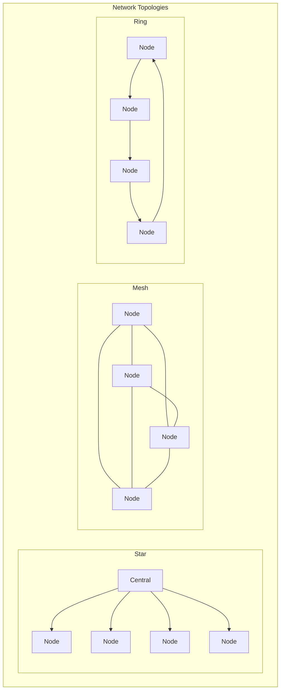
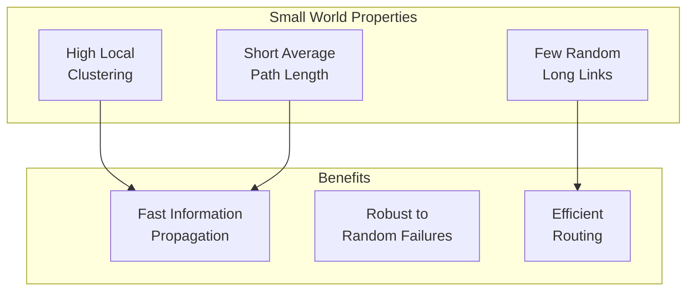
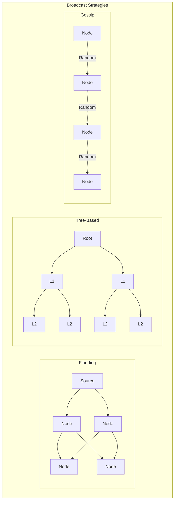
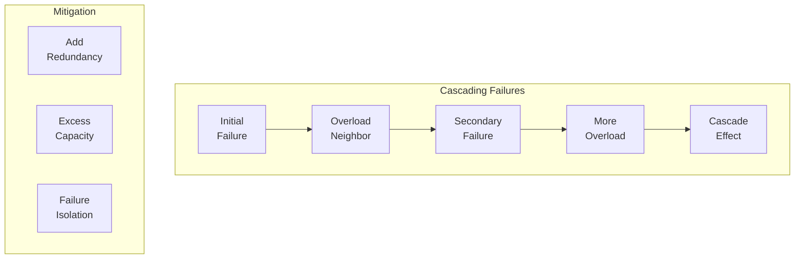
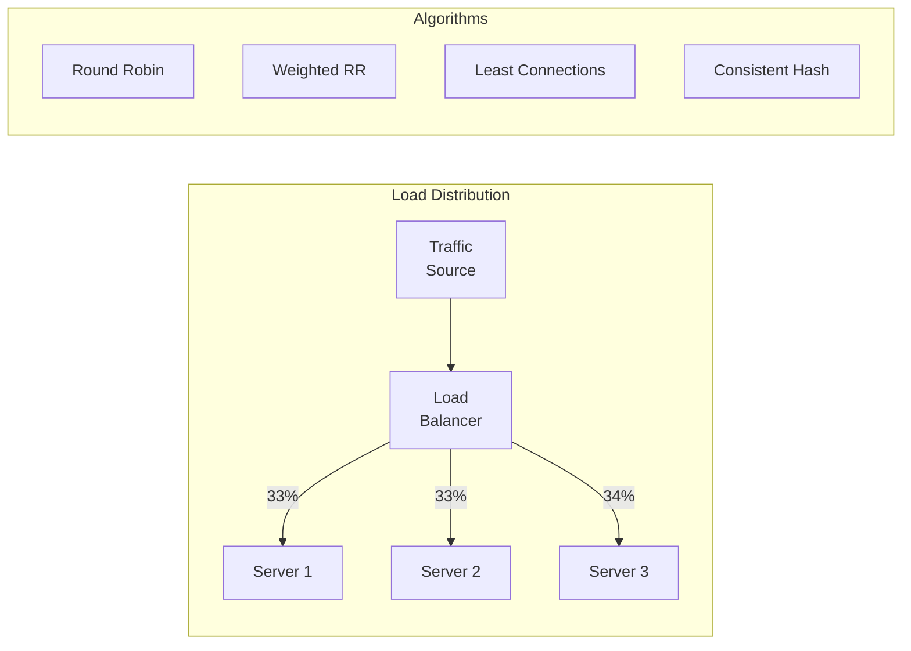
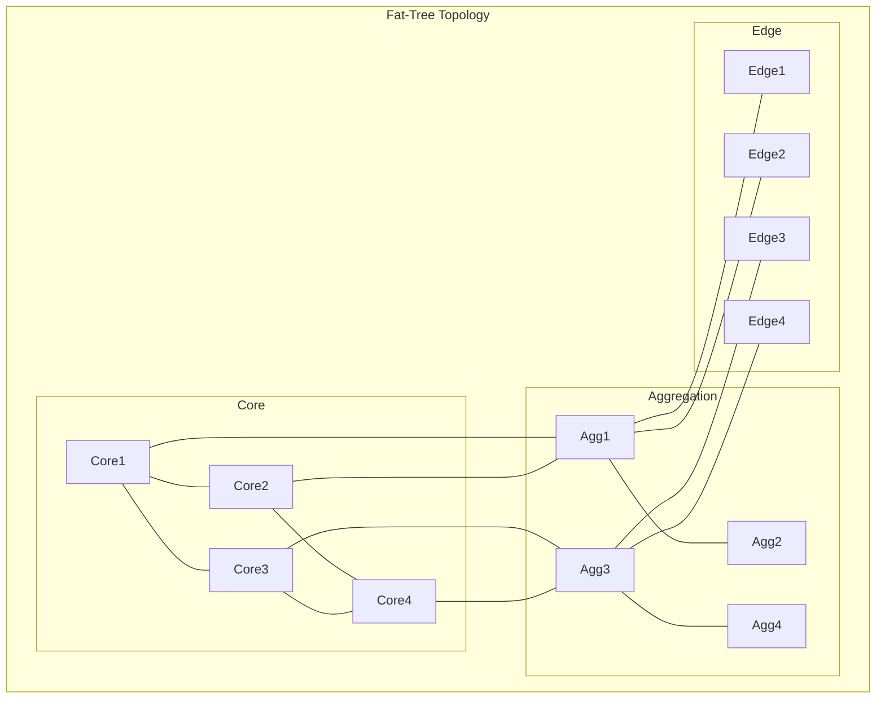
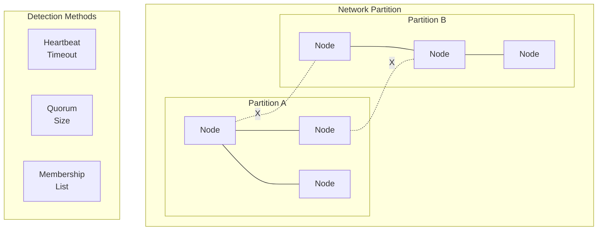

# Network Theory for Distributed Systems

!!! abstract "🎯 Core Principle"
 Network theory provides mathematical tools to analyze communication patterns, failure propagation, and information flow in distributed systems. Understanding network properties helps design more resilient and efficient architectures.

## Visual Network Models



## Fundamental Network Metrics

### 1. Degree Distribution

!!! example "Node Degree"
 <table class="formula-table responsive-table">
 <tr><td><strong>k_i</strong></td><td>Degree of node i (number of connections)</td></tr>
 <tr><td><strong>⟨k⟩</strong></td><td>Average degree = 2E/N</td></tr>
 <tr><td><strong>P(k)</strong></td><td>Probability of degree k</td></tr>
 </table>

 **Common Distributions**:
 - **Random**: P(k) ~ Poisson(λ)
 - **Scale-free**: P(k) ~ k^(-γ)
 - **Regular**: P(k) = δ(k - k₀)

### 2. Path Metrics

```python
def network_metrics(graph):
 """Calculate key network metrics"""
 metrics = {
 'diameter': nx.diameter(graph),
 'avg_path_length': nx.average_shortest_path_length(graph),
 'clustering_coefficient': nx.average_clustering(graph),
 'degree_centrality': nx.degree_centrality(graph),
 'betweenness': nx.betweenness_centrality(graph)
 }
 return metrics

# Example: Data center network
# Diameter: 6 (worst-case hops)
# Avg path: 3.2 (typical communication)
# Clustering: 0.15 (triangles/triples)
```

## Network Models in Distributed Systems

### 1. Small World Networks



**Watts-Strogatz Model**:
```python
def small_world_network(n, k, p):
 """
 n: number of nodes
 k: initial neighbors
 p: rewiring probability
 """
# Start with ring lattice
 G = nx.watts_strogatz_graph(n, k, p)
 
# Properties:
# p=0: Regular lattice (high clustering, long paths)
# p=1: Random graph (low clustering, short paths)
# 0<p<1: Small world (high clustering, short paths)
 return G
```

### 2. Scale-Free Networks

<h4>Barabási-Albert Model</h4>

**Preferential Attachment**: New nodes connect to existing nodes with probability proportional to their degree.

```python
def scale_free_growth(initial_nodes=3, total_nodes=1000, m=2):
 """Generate scale-free network via preferential attachment"""
 G = nx.barabasi_albert_graph(total_nodes, m)
 
# Power-law degree distribution
# P(k) ~ k^(-3) for BA model
# Few hubs, many low-degree nodes
 return G
```

**Properties**:
- **Hubs**: Few highly connected nodes
- **Resilient**: To random failures
- **Vulnerable**: To targeted attacks on hubs

## Communication Patterns

### 1. Broadcast Algorithms



### 2. Epidemic Spread Models

```python
def epidemic_spread(graph, infection_prob=0.1, recovery_prob=0.05):
 """SIR model on network"""
 states = {node: 'S' for node in graph.nodes()} # Susceptible
 patient_zero = random.choice(list(graph.nodes()))
 states[patient_zero] = 'I' # Infected
 
 infected_over_time = []
 
 while 'I' in states.values():
 new_states = states.copy()
 
 for node in graph.nodes():
 if states[node] == 'I':
# Try to infect neighbors
 for neighbor in graph.neighbors(node):
 if states[neighbor] == 'S' and random.random() < infection_prob:
 new_states[neighbor] = 'I'
 
# Try to recover
 if random.random() < recovery_prob:
 new_states[node] = 'R' # Recovered
 
 states = new_states
 infected_over_time.append(sum(1 for s in states.values() if s == 'I'))
 
 return infected_over_time
```

## Network Reliability

### 1. Failure Propagation



### 2. Percolation Theory

!!! example "Critical Threshold"

 For random failures with probability p:
 - **Connected**: p < p_c (critical threshold)
 - **Fragmented**: p > p_c

 **Critical thresholds**:
 - Random graph: p_c = 1/⟨k⟩
 - 2D lattice: p_c ≈ 0.593
 - Scale-free: p_c → 0 (very robust)

## Network Flow Algorithms

### 1. Max Flow Problem

```python
def max_flow_analysis(graph, source, sink):
 """Analyze maximum flow in network"""
# Ford-Fulkerson algorithm
 flow_value, flow_dict = nx.maximum_flow(graph, source, sink)
 
# Find bottlenecks (min cut)
 cut_value, (reachable, non_reachable) = nx.minimum_cut(graph, source, sink)
 
# Identify critical edges
 critical_edges = []
 for u, v in graph.edges():
 if u in reachable and v in non_reachable:
 critical_edges.append((u, v))
 
 return {
 'max_flow': flow_value,
 'min_cut': cut_value,
 'bottlenecks': critical_edges
 }
```

### 2. Load Balancing



## Distributed System Topologies

### 1. Data Center Networks



### 2. P2P Network Structures

<table class="responsive-table">
<thead>
<tr>
<th>Topology</th>
<th>Lookup Time</th>
<th>State/Node</th>
<th>Resilience</th>
<th>Example</th>
</tr>
</thead>
<tbody>
<tr>
<td data-label="Topology"><strong>Unstructured</strong></td>
<td data-label="Lookup Time">O(N)</td>
<td data-label="State/Node">O(1)</td>
<td data-label="Resilience">High</td>
<td data-label="Example">Gnutella</td>
</tr>
<tr>
<td data-label="Topology"><strong>DHT Ring</strong></td>
<td data-label="Lookup Time">O(log N)</td>
<td data-label="State/Node">O(log N)</td>
<td data-label="Resilience">Medium</td>
<td data-label="Example">Chord</td>
</tr>
<tr>
<td data-label="Topology"><strong>Hypercube</strong></td>
<td data-label="Lookup Time">O(log N)</td>
<td data-label="State/Node">O(log N)</td>
<td data-label="Resilience">High</td>
<td data-label="Example">CAN</td>
</tr>
<tr>
<td data-label="Topology"><strong>Skip Graph</strong></td>
<td data-label="Lookup Time">O(log N)</td>
<td data-label="State/Node">O(log N)</td>
<td data-label="Resilience">High</td>
<td data-label="Example">Skip Net</td>
</tr>
</tbody>
</table>

## Consensus Network Requirements

### Byzantine Fault Tolerance

```python
def byzantine_generals(n, f):
 """
 n: total nodes
 f: byzantine nodes
 """
# Requirement: n > 3f
 if n <= 3 * f:
 return "No consensus possible"
 
# Rounds needed: f + 1
 rounds = f + 1
 
# Message complexity: O(n²) per round
 messages = rounds * n * (n - 1)
 
 return {
 'feasible': True,
 'rounds': rounds,
 'messages': messages,
 'resilience': f'{f}/{n} byzantine nodes'
 }
```

## Network Partitioning

### Detecting Partitions



## Performance Analysis

### Network Latency Model

```python
def network_latency(distance_km, processing_ms=1, queuing_ms=0):
 """Total latency calculation"""
# Speed of light in fiber: ~200,000 km/s
 propagation_ms = distance_km / 200
 
# Total latency
 total_ms = propagation_ms + processing_ms + queuing_ms
 
 return {
 'propagation': f'{propagation_ms:.1f}ms',
 'processing': f'{processing_ms}ms',
 'queuing': f'{queuing_ms}ms',
 'total': f'{total_ms:.1f}ms',
 'round_trip': f'{2 * total_ms:.1f}ms'
 }

# Examples:
# Same city (10km): ~0.1ms RTT
# Cross-country (4000km): ~40ms RTT
# Cross-ocean (10000km): ~100ms RTT
```

## Key Insights

!!! info "🎯 Network Theory Principles"
 1. **Diameter matters**: Affects worst-case latency
 2. **Clustering creates redundancy**: Higher resilience
 3. **Hubs are double-edged**: Efficient but vulnerable
 4. **Topology determines properties**: Choose wisely
 5. **Partitions are inevitable**: Design for split-brain
 6. **Communication complexity**: Often quadratic in nodes

## Related Topics

- **Theory**: [Graph Theory](/architects-handbook/quantitative-analysis/graph-theory/) | [Queueing Networks](/architects-handbook/quantitative-analysis/queuing-networks/) | [Information Theory](/architects-handbook/quantitative-analysis/information-theory/)
- **Practice**: [Network Protocols](../patterns/network-protocols.md) | [Consensus](../pattern-library/coordination/consensus.md) | [P2P Systems](../patterns/p2p.md)
- **Laws**: [Law 2: Asynchronous Reality](../core-principles/laws/asynchronous-reality.md) | [Law 5: Distributed Knowledge](../core-principles/laws/distributed-knowledge.md)
