# Reliability Engineering Mathematics

!!! abstract "Core Concept"
    **🎯 Goal**: Quantify system reliability to make data-driven decisions
    **📊 Key Metric**: Probability of success over time
    **💰 Business Impact**: Each 9 of availability = 10x cost
    **🧮 Reality Check**: 100% reliability is mathematically impossible

## Reliability Fundamentals

### The Availability Spectrum

| Availability | Downtime/Year | Downtime/Month | Downtime/Day | Use Case |
|--------------|---------------|----------------|--------------|----------|
| **90% (1 nine)** | 36.5 days | 3 days | 2.4 hours | Development |
| **99% (2 nines)** | 3.65 days | 7.2 hours | 14 minutes | Internal tools |
| **99.9% (3 nines)** | 8.76 hours | 43 minutes | 1.4 minutes | Business apps |
| **99.99% (4 nines)** | 52.6 minutes | 4.3 minutes | 8.6 seconds | E-commerce |
| **99.999% (5 nines)** | 5.26 minutes | 26 seconds | 0.86 seconds | Financial |
| **99.9999% (6 nines)** | 31.5 seconds | 2.6 seconds | 0.086 seconds | Life critical |

### Visual Reliability Model

```mermaid
graph TB
    subgraph "System Reliability Calculation"
        COMP[Component Reliability] --> TYPE{Architecture?}
        
        TYPE -->|Series| SERIES[R = R₁ × R₂ × R₃]
        TYPE -->|Parallel| PARALLEL[R = 1 - (1-R₁)(1-R₂)(1-R₃)]
        TYPE -->|k-out-of-n| KOFN[Complex formula]
        
        SERIES --> WORSE[Reliability decreases]
        PARALLEL --> BETTER[Reliability increases]
    end
    
    style WORSE fill:#ff5252,color:#fff
    style BETTER fill:#4caf50,color:#fff
```

## Core Reliability Formulas

### 1. Basic Reliability Metrics

| Metric | Formula | Meaning | Example |
|--------|---------|---------|---------||
| **MTTF** | Mean Time To Failure | Average operational time | 1000 hours |
| **MTTR** | Mean Time To Repair | Average fix time | 2 hours |
| **MTBF** | MTTF + MTTR | Cycle time | 1002 hours |
| **Availability** | MTTF / (MTTF + MTTR) | Fraction online | 99.8% |
| **Failure Rate** | λ = 1/MTTF | Failures per time | 0.001/hour |

### 2. System Architectures

#### Series Systems (All must work)


| Components | Individual Reliability | System Reliability | Degradation |
|------------|------------------------|--------------------|--------------|
| 2 | 99% | 98.01% | -0.99% |
| 3 | 99% | 97.03% | -1.97% |
| 5 | 99% | 95.10% | -3.90% |
| 10 | 99% | 90.44% | -8.56% |

#### Parallel Systems (One must work)

```mermaid
graph TB
    subgraph "Parallel Redundancy"
        A1[Component A<br/>90%]
        A2[Component A<br/>90%]
        A3[Component A<br/>90%]
    end
    
    Result[System = 1 - (0.1)³ = 99.9%]
```

| Replicas | Individual Reliability | System Reliability | Improvement |
|----------|------------------------|--------------------|-------------|
| 1 | 90% | 90% | Baseline |
| 2 | 90% | 99% | +9% |
| 3 | 90% | 99.9% | +9.9% |
| 4 | 90% | 99.99% | +9.99% |

## Failure Analysis

### Bathtub Curve

```mermaid
graph TB
    subgraph "Component Lifetime Failure Rate"
        EARLY[Early Failures<br/>"Infant Mortality"] --> STABLE[Stable Period<br/>Random Failures]
        STABLE --> WEAR[Wear Out<br/>Age Failures]
    end
    
    subgraph "Mitigation Strategies"
        BURN[Burn-in Testing] -.-> EARLY
        MONITOR[Monitoring] -.-> STABLE  
        REPLACE[Preventive Replacement] -.-> WEAR
    end
```

### Failure Probability Over Time

| Time Period | Failure Type | Rate Pattern | Mitigation |
|-------------|--------------|--------------|------------|
| **0-3 months** | Manufacturing defects | Decreasing | Burn-in testing |
| **3 months - 5 years** | Random failures | Constant | Redundancy |
| **5+ years** | Wear out | Increasing | Replacement schedule |

## Reliability Improvement Strategies

### Cost vs Reliability Trade-off

| Availability | Annual Cost | Techniques Required | Business Justification |
|--------------|-------------|--------------------|-----------------------|
| **99%** | $10K | Basic monitoring | Internal tools |
| **99.9%** | $100K | Redundancy, on-call | Customer-facing |
| **99.99%** | $1M | Multi-region, 24/7 team | Revenue critical |
| **99.999%** | $10M | Custom hardware, chaos engineering | Financial/Healthcare |

### Improvement Techniques Matrix

| Technique | Reliability Gain | Cost | Implementation Time |
|-----------|------------------|------|--------------------|
| **Add monitoring** | +0.5 nines | $ | 1 week |
| **Redundant components** | +1 nine | $$ | 1 month |
| **Geographic distribution** | +1.5 nines | $$$ | 3 months |
| **Chaos engineering** | +0.5 nines | $$ | 6 months |
| **Custom hardware** | +1 nine | $$$$ | 1 year |

## Mathematical Models

### 1. Exponential Reliability

For constant failure rate λ:

```
R(t) = e^(-λt)

Where:
- R(t) = Reliability at time t
- λ = Failure rate
- t = Time period
```

| Time (MTTF units) | Reliability | Interpretation |
|-------------------|-------------|----------------|
| 0.1 | 90.5% | Very reliable |
| 0.5 | 60.7% | Moderate |
| 1.0 | 36.8% | Replace soon |
| 2.0 | 13.5% | High risk |

### 2. N+K Redundancy

| Configuration | Formula | 3 nines each | Result |
|---------------|---------|--------------|--------||
| **N (no redundancy)** | R | 99.9% | 99.9% |
| **N+1** | 1-(1-R)² | 99.9% | 99.9999% |
| **N+2** | Complex | 99.9% | 99.9999999% |
| **2N** | 1-(1-Rⁿ)² | 99.9% | ~100% |

## Real-World Applications

### Case Study: E-commerce Platform

```mermaid
graph TB
    subgraph "Component Reliability"
        LB[Load Balancer<br/>99.99%]
        WEB[Web Servers<br/>99.9% each]
        APP[App Servers<br/>99.9% each]
        DB[Database<br/>99.95%]
        CACHE[Cache<br/>99.9%]
    end
    
    subgraph "Architecture"
        LB --> WEB
        WEB --> APP
        APP --> DB
        APP --> CACHE
    end
    
    subgraph "Calculation"
        CALC[Total = 99.99% × 99.99% × 99.99% × 99.95% = 99.92%]
    end
```



### Reliability Budget Allocation

| Component | Budget | Rationale |
|-----------|--------|-----------||
| **Network** | 99.99% | Critical path |
| **Load Balancer** | 99.99% | Single point |
| **Web Tier** | 99.95% | Redundant |
| **App Tier** | 99.95% | Redundant |
| **Database** | 99.99% | Critical state |
| **Cache** | 99.9% | Graceful degradation |
| **Total System** | 99.82% | 15.8 hours/year |

## Quick Reference Formulas

```python
# Availability
availability = MTTF / (MTTF + MTTR)

# Series system
R_series = R1 * R2 * R3 * ... * Rn

# Parallel system  
R_parallel = 1 - (1-R1) * (1-R2) * ... * (1-Rn)

# Required replicas for target availability
import math
replicas = math.ceil(
    math.log(1 - target_availability) / 
    math.log(1 - component_availability)
)

# Downtime per period
downtime_minutes = period_minutes * (1 - availability)
```

## Related Concepts

| Concept | Connection | Learn More |
|---------|------------|------------|
| **[Law 1: Correlated Failure](../core-principles/laws/correlated-failure.md)** | Components fail together | Failure domains |
| **[Failure Models](/architects-handbook/quantitative-analysis/failure-models/)** | Types of failures | Failure patterns |
| **[SRE Practices](/architects-handbook/human-factors/sre-practices/)** | Operational reliability | Error budgets |
| **[Chaos Engineering](/architects-handbook/human-factors/chaos-engineering/)** | Testing reliability | Failure injection |
